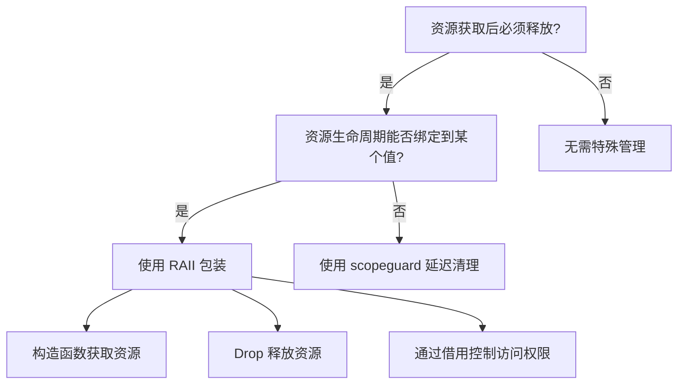
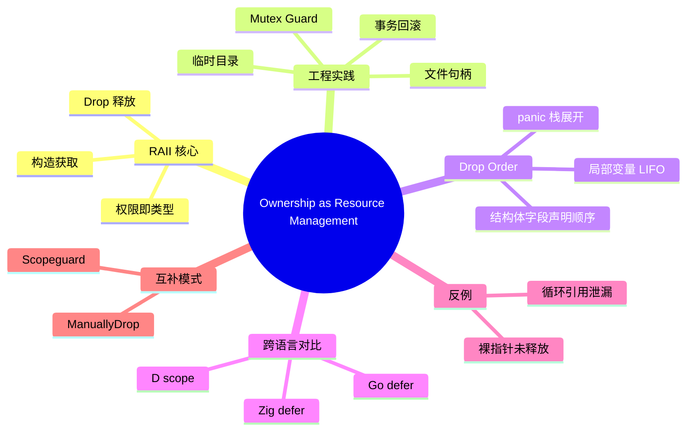

> **内容分级**: [专家级]

# Ownership as Resource Management（RAII 模式实践）

> **EN**: Ownership as Resource Management
> **Summary**: Engineering practices for RAII in Rust: Mutex guards, file handles, temporary files, transaction rollback, drop order, and comparisons with Go/Zig/D deferred cleanup.
> **Rust 版本**: 1.97.0+ (Edition 2024)
> **受众**: [进阶]
> **Bloom 层级**: L3-L4
> **权威来源**: 本文件为 `concept/` 权威页。
> **定位**: 将 Rust 的 ownership 语义具体化为资源管理工程模式，覆盖获取-使用-释放全生命周期、drop order 细节以及与同类语言机制的对比。
> **预计阅读时间**: 25 分钟
>
> **来源**:
> [Rust Reference — Destructors](https://doc.rust-lang.org/reference/destructors.html) ·
> [The Rustonomicon — RAII](https://doc.rust-lang.org/nomicon/raii.html) ·
> [Tofte & Talpin — Region-Based Memory Management](https://doi.org/10.1016/0890-5401(94)00052-3) ·
> [Rust API Guidelines](https://rust-lang.github.io/api-guidelines/)
>
> **前置概念**: [所有权（Ownership）](../../01_foundation/01_ownership_borrow_lifetime/01_ownership.md) · [析构函数与 Drop Scope](../../04_formal/05_rustc_internals/09_destructors.md) · [Rust 惯用法谱系](02_idioms_spectrum.md)
> **后置概念**:
> [作用域守卫与延迟清理](35_scope_guard_and_deferred_cleanup.md) ·
> [Unsafe Rust](../../03_advanced/02_unsafe/01_unsafe.md) ·
> [并发原语](../../03_advanced/00_concurrency/01_concurrency.md)

---

## 一、权威定义

**Ownership as Resource Management** 是指把「资源」的获取与释放直接绑定到 Rust 值的生命周期：

- 资源在值创建时获得（构造函数或工厂方法）。
- 资源在值离开作用域时释放（`Drop::drop`）。
- 资源权限随所有权移动而转移，借用期间权限受编译期约束。

这一模式通常被称为 RAII（Resource Acquisition Is Initialization）。在 Rust 中，RAII 不仅是内存管理策略，更是所有稀缺资源（锁、文件、网络连接、临时目录、事务句柄）的统一管理模型。

> **来源**: [The Rustonomicon — RAII](https://doc.rust-lang.org/nomicon/raii.html) · [Tofte & Talpin 1994](https://doi.org/10.1016/0890-5401(94)00052-3)

---

## 二、RAII 在 Rust 中的核心属性

| 属性 | 说明 | 工程价值 |
|:---|:---|:---|
| **获取即初始化** | 构造成功 ⟹ 资源有效 | 不会出现「半初始化」状态 |
| **释放自动化** | 离开作用域自动 `Drop` | 减少遗忘释放风险 |
| **权限即类型** | `MutexGuard<T>` 同时代表「持有锁」与「可访问 T」 | 编译期防止无锁访问 |
| **异常/ panic 安全** | 栈展开时会调用局部值的 `Drop` | 即使 panic 也能释放资源 |
| **零成本** | `Drop` 调用由编译器插入，无运行时簿记 | 与手动管理性能相当 |

---

## 三、正例：典型 RAII 工程实践

### 3.1 Mutex Guard

```rust
use std::sync::Mutex;

fn increment(counter: &Mutex<i32>) {
    let mut guard = counter.lock().unwrap();
    *guard += 1;
    // guard 在此作用域结束时自动释放锁
}
```

`MutexGuard` 把「持有锁」这一运行时事实编码为类型；只要 guard 存在，当前线程就合法拥有对内部数据的可变访问权。

### 3.2 文件句柄

```rust
use std::fs::File;
use std::io::{Write, Result};

fn write_log(path: &str, msg: &str) -> Result<()> {
    let mut file = File::create(path)?;
    file.write_all(msg.as_bytes())?;
    Ok(()) // file 自动关闭，即使 ? 提前返回也会 drop
}
```

### 3.3 临时目录（RAII + 自定义 Drop）

```rust
use std::fs;
use std::path::{Path, PathBuf};
use std::sync::atomic::{AtomicU64, Ordering};

struct TempDir(PathBuf);

static COUNTER: AtomicU64 = AtomicU64::new(0);

impl TempDir {
    fn new(prefix: &str) -> std::io::Result<Self> {
        let count = COUNTER.fetch_add(1, Ordering::Relaxed);
        let path = std::env::temp_dir().join(format!("{}-{}-{}", prefix, std::process::id(), count));
        fs::create_dir_all(&path)?;
        Ok(Self(path))
    }

    fn path(&self) -> &Path {
        &self.0
    }
}

impl Drop for TempDir {
    fn drop(&mut self) {
        let _ = fs::remove_dir_all(&self.0);
    }
}

fn main() {
    let tmp = TempDir::new("demo").unwrap();
    let file_path = tmp.path().join("data.txt");
    fs::write(&file_path, b"hello").unwrap();
    // 作用域结束时临时目录自动删除
}
```

### 3.4 事务回滚守卫

```rust
struct Transaction<'a> {
    db: &'a mut Database,
    committed: bool,
}

struct Database { balance: i32 }

impl<'a> Transaction<'a> {
    fn new(db: &'a mut Database) -> Self {
        Self { db, committed: false }
    }

    fn credit(&mut self, amount: i32) {
        self.db.balance += amount;
    }

    fn commit(mut self) {
        self.committed = true;
    }
}

impl<'a> Drop for Transaction<'a> {
    fn drop(&mut self) {
        if !self.committed {
            self.db.balance = 0; // 简化回滚
        }
    }
}
```

---

## 四、Drop Order 与作用域嵌套

Rust 的 drop 顺序遵循「先声明后释放、后声明先释放」的栈原则（LIFO）。

```rust
struct PrintOnDrop(&'static str);
impl Drop for PrintOnDrop {
    fn drop(&mut self) {
        println!("dropping {}", self.0);
    }
}

fn main() {
    let a = PrintOnDrop("a");
    let b = PrintOnDrop("b");
    let c = PrintOnDrop("c");
    // drop 顺序: c, b, a
}
```

在多字段结构体中，字段按声明顺序 drop。理解这一顺序对避免「释放顺序依赖」导致的 bug 至关重要。

### 4.1 临时值与 drop scope

表达式中的临时值也有 drop scope。例如：

```rust
struct PrintOnDrop(&'static str);
impl Drop for PrintOnDrop {
    fn drop(&mut self) { println!("dropping {}", self.0); }
}

fn main() {
    let _ = PrintOnDrop("temp");
    println!("statement end");
}
```

临时值通常在当前语句结束时 drop。若临时值被绑定到引用，其生命周期可能延长以覆盖引用使用期。掌握这些规则对编写 panic 安全、无资源泄漏的代码至关重要。

> 详见 [析构函数与 Drop Scope](../../04_formal/05_rustc_internals/09_destructors.md)。

---

## 五、与 Go / Zig / D 的对比

| 语言 | 资源释放机制 | 优缺点 |
|:---|:---|:---|
| **Rust** | RAII + `Drop` + ownership | 编译期保证，异常安全；需要把资源包装成类型 |
| **Go** | `defer` 语句 | 语法简单，按 LIFO 执行；运行期管理，编译器不检查是否遗漏 |
| **Zig** | `defer` / `errdefer` | 显式、无隐藏调用；需要手动在每个退出点书写 |
| **D** | `scope(exit)` / `scope(failure)` | 表达力强，可区分成功/失败退出；仍依赖开发者显式标注 |

Rust 的 RAII 与 `defer` 不是对立的：RAII 适合「资源与值生命周期绑定」的场景；`defer` 适合「临时性、一次性清理动作」。Rust 社区通过 [`scopeguard`](35_scope_guard_and_deferred_cleanup.md) crate 提供类似 `defer` 的能力。

### 5.1 何时选择 RAII 而非 defer

- 资源需要在多个函数之间传递时，RAII 类型的所有权语义更自然。
- 资源有复杂的获取/释放前置条件（如锁必须先于对应数据释放）。
- 需要与借用检查配合，确保「持有资源」与「访问权限」同时存在。

`defer` 在一次性脚本、C 风格资源释放、以及需要按 LIFO 执行多个临时清理动作时更轻便。

---

## 六、RAII 在并发环境中的角色

在并发编程中，RAII 不仅管理内存，更管理**权限**。`MutexGuard<T>` 是最典型的例子：

- 获取锁返回 `MutexGuard<T>`，代表当前线程持有锁。
- 通过 `Deref`/`DerefMut` 访问受保护数据。
- `Drop` 释放锁，且释放顺序由作用域决定，避免手动 `unlock` 遗漏。

这种设计把「锁与数据的绑定」从文档约定转化为类型约束，编译器会拒绝任何试图绕过 guard 访问数据的行为。

### 6.1 并发 RAII 与 Send/Sync

RAII 类型若要跨线程使用，必须正确实现 `Send` 和 `Sync`。例如，`Rc<T>` 不是 `Send`，因此不能用于多线程 RAII；应使用 `Arc<T>` 配合 `Mutex` 或 `RwLock`。

```rust
use std::sync::{Arc, Mutex};

fn share_counter() {
    let counter = Arc::new(Mutex::new(0));
    let counter2 = Arc::clone(&counter);

    std::thread::spawn(move || {
        let mut guard = counter2.lock().unwrap();
        *guard += 1;
    }).join().unwrap();

    let guard = counter.lock().unwrap();
    assert_eq!(*guard, 1);
}
```

> 详见 [并发原语](../../03_advanced/00_concurrency/01_concurrency.md)。

---

## 七、反例：RAII 的常见陷阱

### 6.1 循环引用导致泄漏

```rust
use std::cell::RefCell;
use std::rc::Rc;

struct Node {
    next: RefCell<Option<Rc<Node>>>,
}

fn main() {
    let a = Rc::new(Node { next: RefCell::new(None) });
    let b = Rc::new(Node { next: RefCell::new(Some(a.clone())) });
    *a.next.borrow_mut() = Some(b.clone());
    // a 与 b 形成循环引用，无法被释放，造成内存泄漏
}
```

**修正**：使用弱引用 `Weak<T>` 打破循环，或改用 arena / 所有权清晰的树形结构。

### 7.2 忘记释放裸指针资源

```rust,unsafe
use std::alloc::{alloc, dealloc, Layout};

unsafe fn leak() {
    let layout = Layout::new::<i32>();
    let ptr = alloc(layout) as *mut i32;
    *ptr = 42;
    // ❌ 没有调用 dealloc，内存泄漏
}
```

**修正**：将裸指针包装进 RAII 类型，在 `Drop` 中释放。

### 7.3 在 `Drop` 中 panic 或阻塞

`Drop` 实现应尽量避免 panic 或长时间阻塞：

- panic 在析构过程中可能导致双重 panic 与进程 abort。
- 阻塞 I/O 会延迟栈展开，影响系统响应。

若释放可能失败，应提供显式的 `close()` 方法返回 `Result`，并在 `Drop` 中做尽力而为的清理或记录日志。

---

## 七、RAII 与错误处理的协同

`?` 运算符与 RAII 天然协同：函数中任意 early return 都会触发已创建守卫的 `Drop`。

```rust
use std::fs::File;
use std::io::{self, Write};

fn create_backup(path: &str) -> io::Result<BackupGuard<'_>> {
    Ok(BackupGuard(path))
}

fn write_with_rollback(path: &str, data: &[u8]) -> io::Result<()> {
    let backup = create_backup(path)?; // RAII: 创建备份
    let mut file = File::create(path)?;
    file.write_all(data)?;
    backup.dismiss(); // 成功后撤销回滚
    Ok(())
}

struct BackupGuard<'a>(&'a str);
impl<'a> BackupGuard<'a> {
    fn dismiss(self) { let _ = self; }
}
impl<'a> Drop for BackupGuard<'a> {
    fn drop(&mut self) {
        println!("rolling back {}", self.0);
    }
}
```

---

## 八、决策树：何时使用 RAII



---

## 九、思维导图



---

## 十、相关概念

| 概念 | 关系 |
|:---|:---|
| [所有权（Ownership）](../../01_foundation/01_ownership_borrow_lifetime/01_ownership.md) | RAII 的理论基础 |
| [析构函数与 Drop Scope](../../04_formal/05_rustc_internals/09_destructors.md) | drop 顺序的规范说明 |
| [Rust 惯用法谱系](02_idioms_spectrum.md) | L3 资源级惯用法总览 |
| [作用域守卫与延迟清理](35_scope_guard_and_deferred_cleanup.md) | RAII 的补充模式 |
| [Unsafe Rust](../../03_advanced/02_unsafe/01_unsafe.md) | 裸指针与手动资源管理 |
| [并发原语](../../03_advanced/00_concurrency/01_concurrency.md) | 锁与 guard 的并发语义 |

---

## 十一、权威来源索引

- Tofte, M. & Talpin, J.-P. "Region-Based Memory Management." *Information and Computation*, 1994. [https://doi.org/10.1016/0890-5401(94)00052-3](https://doi.org/10.1016/0890-5401(94)00052-3)
- [The Rustonomicon — RAII](https://doc.rust-lang.org/nomicon/raii.html)
- [Rust Reference — Destructors](https://doc.rust-lang.org/reference/destructors.html)
- [Rust API Guidelines](https://rust-lang.github.io/api-guidelines/)

> **文档版本**: 1.0 ｜ **最后更新**: 2026-07-31 ｜ **状态**: ✅ 新建权威页
