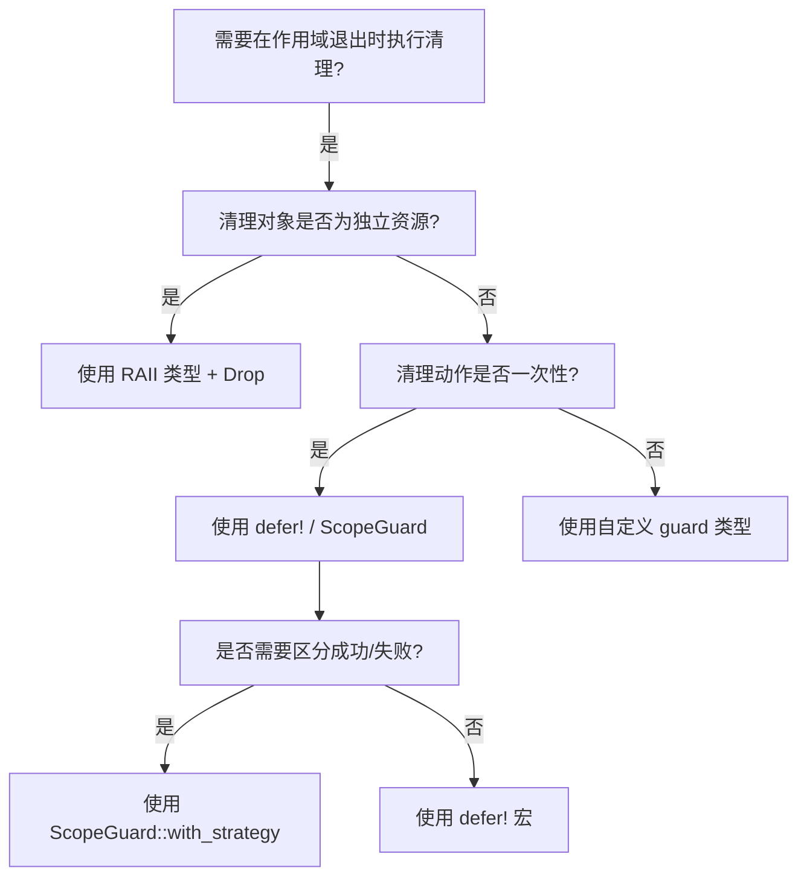
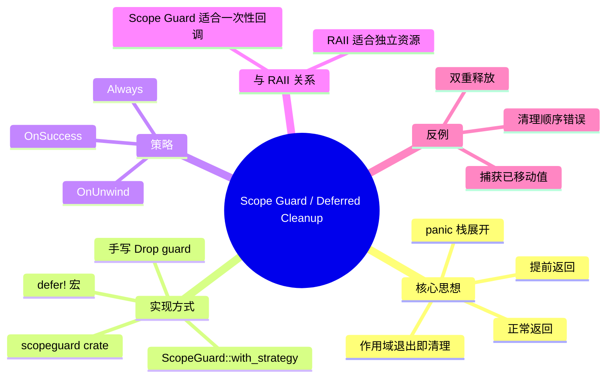

> **内容分级**: [专家级]

# Scope Guard / Deferred Cleanup（作用域守卫与延迟清理）

> **EN**: Scope Guard and Deferred Cleanup
> **Summary**: Using scopeguard crate, defer! macro, ScopeGuard::with_strategy, and custom guards to guarantee cleanup on early return or panic, and how this complements RAII and Drop.
> **Rust 版本**: 1.97.0+ (Edition 2024)
> **受众**: [进阶]
> **Bloom 层级**: L3-L4
> **权威来源**: 本文件为 `concept/` 权威页。
> **定位**: 聚焦「延迟清理」这一特定工程模式：当清理动作不适合封装为独立 RAII 类型，或需要在作用域退出时执行任意回调时使用 scope guard。
> **预计阅读时间**: 20 分钟
>
> **来源**:
> [scopeguard docs](https://docs.rs/scopeguard/latest/scopeguard/) ·
> [The Rustonomicon — RAII Guards](https://doc.rust-lang.org/nomicon/raii.html) ·
> [Rust API Guidelines](https://rust-lang.github.io/api-guidelines/) ·
> [Rust Reference — Destructors](https://doc.rust-lang.org/reference/destructors.html)
>
> **前置概念**:
> [Ownership as Resource Management](34_ownership_as_resource_management.md) ·
> [Rust 惯用法谱系](02_idioms_spectrum.md) ·
> [析构函数与 Drop Scope](../../04_formal/05_rustc_internals/09_destructors.md) ·
> [Rust vs Go：defer 机制对比](../../05_comparative/01_systems_languages/03_rust_vs_go.md) ·
> [Rust vs D：scope 语句对比](../../05_comparative/01_systems_languages/08_rust_vs_d.md)
> **后置概念**:
> [错误处理进阶](../../02_intermediate/03_error_handling/01_error_handling.md) ·
> [Unsafe Rust](../../03_advanced/02_unsafe/01_unsafe.md) ·
> [并发原语](../../03_advanced/00_concurrency/01_concurrency.md)

---

## 一、权威定义

**Scope Guard（作用域守卫）** 是一种在作用域退出时（正常返回、提前返回或 panic 栈展开）执行用户指定回调的资源管理技术。它把「清理动作」从「业务逻辑」中解耦出来，保证无论控制流如何离开作用域，收尾代码都会运行。

与 RAII 的关系：

- **RAII** 把资源封装成类型，通过 `Drop` 自动释放。
- **Scope Guard** 把「任意清理回调」封装成临时值，通过 `Drop` 在作用域结束时调用。

Scope Guard 是 RAII 思想的一种轻量表达形式：它不需要为每一次清理都定义一个新类型。

> **来源**: [scopeguard docs](https://docs.rs/scopeguard/latest/scopeguard/) · [The Rustonomicon — RAII](https://doc.rust-lang.org/nomicon/raii.html)

---

## 二、scopeguard crate 基础用法

`scopeguard` 提供 `defer!` 宏与 `ScopeGuard` 类型，语法接近 Go/Zig 的 `defer`：

```rust,ignore
use scopeguard::defer;

fn process_file(path: &str) -> std::io::Result<()> {
    let mut file = std::fs::File::open(path)?;

    defer! {
        println!("cleaning up: {}", path);
    }

    // ... 业务逻辑，可能提前返回 ...
    let mut contents = String::new();
    file.read_to_string(&mut contents)?;
    println!("{}", contents);
    Ok(())
}
```

`defer!` 创建的守卫按 LIFO 顺序执行，与 Go 的 `defer` 语义一致。

---

## 三、正例：手写 ScopeGuard（std-only）

在不引入外部依赖时，可用标准库实现同样的模式：

```rust
struct ScopeGuard<F: FnOnce()>(Option<F>);

impl<F: FnOnce()> ScopeGuard<F> {
    fn new(f: F) -> Self {
        Self(Some(f))
    }

    fn dismiss(mut self) {
        self.0.take();
    }
}

impl<F: FnOnce()> Drop for ScopeGuard<F> {
    fn drop(&mut self) {
        if let Some(f) = self.0.take() {
            f();
        }
    }
}

fn main() {
    let guard = ScopeGuard::new(|| println!("cleanup on scope exit"));
    // guard 离开作用域时打印 cleanup
    drop(guard);
}
```

### 3.1 early return 安全清理

```rust
use std::fs::File;
use std::io::{self, Read};

fn read_with_cleanup(path: &str) -> io::Result<String> {
    let mut file = File::open(path)?;
    let guard = ScopeGuard::new(|| println!("closing resources for {}", path));

    let mut contents = String::new();
    file.read_to_string(&mut contents)?; // 提前返回时 guard 仍会 drop

    // 正常路径：guard 在作用域结束时 drop
    Ok(contents)
}

struct ScopeGuard<F: FnOnce()>(Option<F>);
impl<F: FnOnce()> ScopeGuard<F> {
    fn new(f: F) -> Self { Self(Some(f)) }
}
impl<F: FnOnce()> Drop for ScopeGuard<F> {
    fn drop(&mut self) { if let Some(f) = self.0.take() { f(); } }
}
```

### 3.2 panic 安全清理

```rust
use std::panic;

fn may_panic() {
    let guard = ScopeGuard::new(|| println!("panic or not, this runs"));
    let _ = guard;
    panic!("boom");
}

struct ScopeGuard<F: FnOnce()>(Option<F>);
impl<F: FnOnce()> ScopeGuard<F> {
    fn new(f: F) -> Self { Self(Some(f)) }
}
impl<F: FnOnce()> Drop for ScopeGuard<F> {
    fn drop(&mut self) { if let Some(f) = self.0.take() { f(); } }
}

fn main() {
    let result = panic::catch_unwind(|| may_panic());
    assert!(result.is_err());
}
```

---

## 四、手写 ScopeGuard 的设计要点

自己实现 scope guard 时需注意以下设计决策：

1. **回调只执行一次**：通过 `Option<F>` 在 `Drop` 中 `take`，避免 panic 时重复执行。
2. **提供 `dismiss` 方法**：允许在成功路径上显式取消清理。
3. **支持 panic 策略**：区分 `Always`、`OnSuccess`、`OnUnwind`，满足事务语义。
4. **避免在回调中 panic**：guard 的 `Drop` 中 panic 可能导致双重 panic。
5. **生命周期管理**：若回调捕获引用，需确保引用在 guard 生命周期内有效。

### 4.1 支持 dismiss 的完整实现

```rust
struct ScopeGuard<F: FnOnce()>(Option<F>);

impl<F: FnOnce()> ScopeGuard<F> {
    fn new(f: F) -> Self {
        Self(Some(f))
    }

    fn dismiss(mut self) {
        self.0.take();
    }
}

impl<F: FnOnce()> Drop for ScopeGuard<F> {
    fn drop(&mut self) {
        if let Some(f) = self.0.take() {
            f();
        }
    }
}

fn main() {
    let guard = ScopeGuard::new(|| println!("this will not run"));
    guard.dismiss();
}
```

---

## 五、scopeguard 的高级策略

`scopeguard::ScopeGuard` 支持 `OnSuccess`、`OnUnwind`、`Always` 三种策略：

```rust,ignore
use scopeguard::{guard, Strategy};

let mut v = vec![1, 2, 3];
let guard = guard(&mut v, |v| {
    println!("rolling back vector length");
    v.pop();
});

// 若作用域正常退出，执行回调；panic 时则执行 OnUnwind 策略版本
```

- `Always`：无论正常返回还是 panic 都执行。
- `OnSuccess`：仅在正常返回时执行。
- `OnUnwind`：仅在 panic 栈展开时执行。

选择策略可以让清理动作与事务语义精确对应。

### 5.1 策略选择示例

事务处理中，`OnSuccess` 可用于提交，`OnUnwind` 可用于回滚：

```rust,ignore
use scopeguard::{guard, OnSuccess, OnUnwind};

fn transfer(from: &mut Account, to: &mut Account, amount: u64) -> Result<(), Error> {
    from.debit(amount)?;
    let rollback = guard((), |_| from.credit(amount)); // OnUnwind 默认

    to.credit(amount)?;

    // 正常到达这里：rollback 在 OnUnwind 时不会触发
    // 若中间 ? 提前返回，则自动回滚
    let _ = rollback;
    Ok(())
}
```

注意：具体 API 以 scopeguard 文档为准；核心思想是「按退出策略区分清理语义」。

---

## 六、与 RAII / Drop 的互补关系

| 场景 | 推荐方案 | 原因 |
|:---|:---|:---|
| 资源有清晰的获取-释放语义 | RAII 类型 + `Drop` | 类型即契约，复用性高 |
| 一次性、临时性的清理回调 | `scopeguard::defer!` | 无需定义新类型 |
| 需要区分成功/失败退出 | `ScopeGuard::with_strategy` | 精确控制执行时机 |
| 跨多个退出点共享清理逻辑 | 自定义 guard 类型 | 避免重复 `defer!` |

---

## 七、与语言级 defer 的对比

Go、Zig、D 等语言在语法层面提供 `defer`，Rust 则通过库与类型系统实现类似能力。二者差异如下：

| 特性 | Go/Zig/D defer | Rust scope guard |
|:---|:---|:---|
| 语法位置 | 语句级，写在资源获取之后 | 表达式级，创建一个值 |
| 执行时机 | 函数/作用域退出时 LIFO | `Drop` 触发，同样 LIFO |
| 编译期检查 | 不检查是否遗漏 | 值必须被使用（可被 `_` 绑定） |
| 策略粒度 | Go 只有一种；Zig 有 `errdefer` | `Always`/`OnSuccess`/`OnUnwind` |
| 与借用系统配合 | 无 | 闭包捕获受生命周期约束 |

Rust 的选择体现了其设计哲学：不引入专用语法，而是用通用的所有权和 `Drop` 机制表达同一概念。结果是 scope guard 与整个类型系统无缝集成，但也要求开发者理解闭包捕获与生命周期。

---

## 八、与 `?` 和 early return 的集成

Scope guard 与 Rust 的 `?` 运算符配合极佳：在函数任意位置 early return，已创建的 guard 都会按栈顺序 drop。

```rust
use std::fs::File;
use std::io::{self, Read};

fn read_and_log(path: &str) -> io::Result<String> {
    let guard = ScopeGuard::new(|| println!("exiting read_and_log for {}", path));

    let mut file = File::open(path)?; // early return 时 guard 仍执行
    let mut contents = String::new();
    file.read_to_string(&mut contents)?;

    Ok(contents)
}

struct ScopeGuard<F: FnOnce()>(Option<F>);
impl<F: FnOnce()> ScopeGuard<F> {
    fn new(f: F) -> Self { Self(Some(f)) }
}
impl<F: FnOnce()> Drop for ScopeGuard<F> {
    fn drop(&mut self) { if let Some(f) = self.0.take() { f(); } }
}
```

这种模式在日志、审计、临时状态恢复等场景中非常常见。

---

## 九、反例：scope guard 的误用

### 9.1 双重释放风险

```rust,ignore
use std::ptr;

struct RawBuffer(*mut u8);

impl Drop for RawBuffer {
    fn drop(&mut self) {
        unsafe {
            // 假设这里释放内存
            ptr::drop_in_place(self.0);
        }
    }
}

fn buggy() {
    let buf = RawBuffer(std::ptr::null_mut());
    // 错误：又在外部通过 scope guard 释放同一份资源
    let _guard = ScopeGuard::new(|| unsafe {
        ptr::drop_in_place(buf.0);
    });
}

struct ScopeGuard<F: FnOnce()>(Option<F>);
impl<F: FnOnce()> ScopeGuard<F> {
    fn new(f: F) -> Self { Self(Some(f)) }
}
impl<F: FnOnce()> Drop for ScopeGuard<F> {
    fn drop(&mut self) { if let Some(f) = self.0.take() { f(); } }
}
```

**修正**：一个资源只能有一个所有者负责释放；要么用 RAII 类型，要么用 scope guard，不要同时使用两者管理同一资源。

### 9.2 清理顺序错误

多个 `defer!` 按 LIFO 执行。如果业务逻辑要求「先打开的后关闭」，则 `defer!` 顺序必须与之对应。顺序写反会导致依赖资源提前释放。

```rust
fn wrong_order() {
    let guard_a = ScopeGuard::new(|| println!("cleanup A"));
    let _ = guard_a;
    let guard_b = ScopeGuard::new(|| println!("cleanup B"));
    let _ = guard_b;
    // 实际执行顺序：B, A
}

struct ScopeGuard<F: FnOnce()>(Option<F>);
impl<F: FnOnce()> ScopeGuard<F> {
    fn new(f: F) -> Self { Self(Some(f)) }
}
impl<F: FnOnce()> Drop for ScopeGuard<F> {
    fn drop(&mut self) { if let Some(f) = self.0.take() { f(); } }
}
```

### 8.3 在 guard 闭包中捕获已移动值

Scope guard 的回调通常需要在创建点捕获环境。若捕获的值之后被移动，闭包可能无法编译：

```rust,compile_fail
fn moved_value() {
    let msg = String::from("cleanup");
    let _guard = ScopeGuard::new(|| println!("{}", msg));
    drop(msg); // ❌ msg 已被闭包捕获，不能再次移动
}

struct ScopeGuard<F: FnOnce()>(Option<F>);
impl<F: FnOnce()> ScopeGuard<F> {
    fn new(f: F) -> Self { Self(Some(f)) }
}
impl<F: FnOnce()> Drop for ScopeGuard<F> {
    fn drop(&mut self) { if let Some(f) = self.0.take() { f(); } }
}
```

**修正**：使用引用捕获或将需要移动的值通过 `Option::take` 在 guard 内部管理。

---

## 十、决策树：选择清理策略



---

## 十一、性能考量与零成本抽象

Scope guard 在运行时只增加一个 `Drop` 调用的开销，与手写 `try`/`finally` 或语言级 `defer` 等价。`scopeguard` crate 的设计保证：

- 无堆分配：guard 本身是栈上的小结构体。
- 无动态分发：闭包通过泛型单态化，调用点内联。
- 无异常簿记：依赖 Rust 的栈展开机制，不引入额外运行时状态。

因此，在 hot path 上使用 scope guard 通常是可以接受的。但需注意：

- 避免在 guard 回调中执行重 I/O 或复杂计算。
- 大量嵌套 guard 会增加栈帧大小和指令缓存压力。
- 若清理动作极其简单（如单个变量复位），直接写 `Drop` 或 RAII 类型可能更清晰。

从工程角度看，scope guard 的价值在于把「正常路径」与「清理路径」解耦：业务代码专注于成功流程，而失败、回滚、日志等横切关注点由 guard 统一处理。这种解耦在复杂函数中显著降低认知负荷，同时保持零额外抽象成本。它是 Rust 在不引入专用语法的前提下，复用所有权与 `Drop` 机制实现高表达力资源管理的典型范例，体现了 Rust「用类型系统解决横切关注点」的设计哲学。

---

## 十二、思维导图



---

## 十三、相关概念

| 概念 | 关系 |
|:---|:---|
| [Ownership as Resource Management](34_ownership_as_resource_management.md) | Scope Guard 是 RAII 思想的轻量表达 |
| [Rust 惯用法谱系](02_idioms_spectrum.md) | L3 资源级惯用法中的 Scopeguard 小节 |
| [析构函数与 Drop Scope](../../04_formal/05_rustc_internals/09_destructors.md) | drop 顺序与作用域规则 |
| [错误处理进阶](../../02_intermediate/03_error_handling/01_error_handling.md) | `?` 传播与 early return 场景 |
| [Unsafe Rust](../../03_advanced/02_unsafe/01_unsafe.md) | 裸指针与手动释放的边界 |

---

## 十四、权威来源索引

- [scopeguard crate docs](https://docs.rs/scopeguard/latest/scopeguard/)
- [The Rustonomicon — RAII](https://doc.rust-lang.org/nomicon/raii.html)
- [Rust Reference — Destructors](https://doc.rust-lang.org/reference/destructors.html)
- [Rust API Guidelines](https://rust-lang.github.io/api-guidelines/)

> **文档版本**: 1.0 ｜ **最后更新**: 2026-07-31 ｜ **状态**: ✅ 新建权威页
