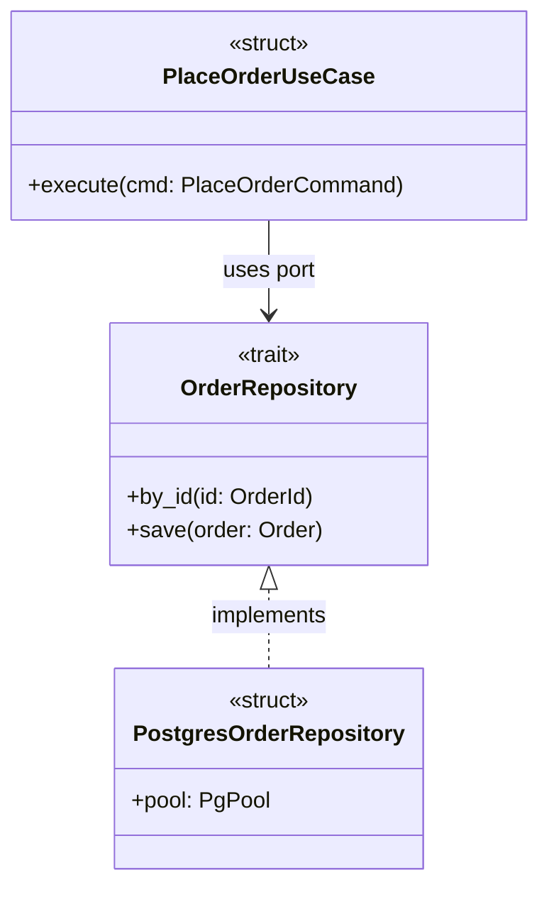
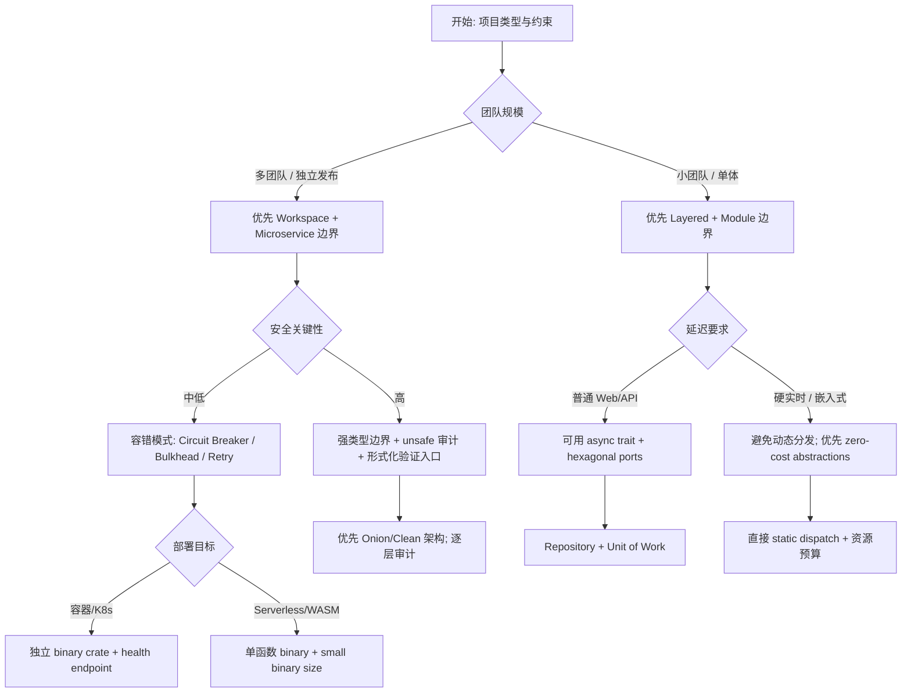
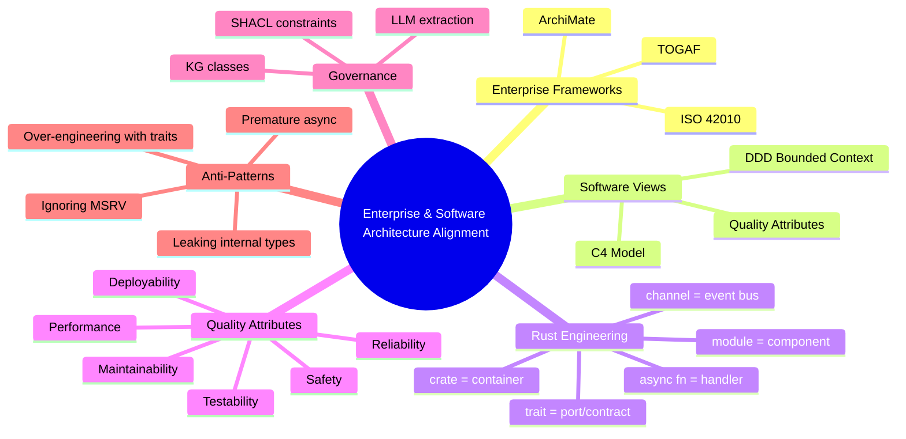

> **内容分级**: [专家级]
> **代码状态**: ✅ 含可编译示例
> **定理链**: N/A — 描述性/综述性/导航性文档，不涉及形式化定理链
>
# 企业架构与软件架构语义对齐
>
> **EN**: Enterprise and Software Architecture Alignment in Rust
> **Summary**: Bridge enterprise architecture frameworks, software architecture quality attributes, and Rust design patterns by mapping TOGAF/ArchiMate/C4/DDD concepts to crates, traits, channels, and knowledge-graph governance.
> **Rust 版本**: 1.97.0+ (Edition 2024)
> **Bloom 层级**: L4-L6
> **权威来源**: 本文件为 `concept/` 权威页。
> **A/S/P 标记**: **S+P** — Structure + Procedure
> **定位**: 将企业架构（TOGAF/ArchiMate）、软件架构（C4/DDD/质量属性）与 Rust 工程结构进行语义对齐，为大型组织引入 Rust 提供从架构视图到代码视图的映射语言。
> **前置概念**:
> [Patterns Overview](01_patterns.md) ·
> [Architecture Patterns](08_architecture_patterns.md) ·
> [System Design Principles](03_system_design_principles.md) ·
> [System Composability](04_system_composability.md) ·
> [Microservice Patterns](05_microservice_patterns.md) ·
> [Event-Driven Architecture](06_event_driven_architecture.md) ·
> [CQRS and Event Sourcing](07_cqrs_event_sourcing.md) ·
> [Repository and Unit of Work](24_repository_and_unit_of_work.md) ·
> [Hexagonal Ports and Adapters](25_hexagonal_ports_and_adapters.md) ·
> [Circuit Breaker](26_circuit_breaker.md) ·
> [AI Ontology and Rust Semantics](../../04_formal/13_semantic_engineering/06_ai_ontology_and_rust_semantics.md)
> **后置概念**: [Future Roadmap](../../07_future/01_edition_roadmap/04_roadmap.md) · [Rust vs C++](../../05_comparative/01_systems_languages/01_rust_vs_cpp.md)
>
> **来源 / Provenance**:
> [The Open Group — TOGAF Standard](https://www.opengroup.org/togaf) ·
> [The Open Group — ArchiMate Specification](https://www.opengroup.org/archimate) ·
> [ISO/IEC/IEEE 42010:2022](https://www.iso.org/standard/74296.html) ·
> [C4 Model](https://c4model.com/) ·
> [AWS Well-Architected Framework](https://docs.aws.amazon.com/wellarchitected/latest/framework/) ·
> [Azure Well-Architected Framework](https://learn.microsoft.com/en-us/azure/well-architected/) ·
> [Google Cloud Architecture Framework](https://cloud.google.com/architecture/framework) ·
> [Rust API Guidelines](https://rust-lang.github.io/api-guidelines/) ·
> [Rust Design Patterns](https://rust-unofficial.github.io/patterns/)

---

## 📑 目录

- [企业架构与软件架构语义对齐](#企业架构与软件架构语义对齐)
  - [📑 目录](#-目录)
  - [一、软件架构与企业架构的权威定义](#一软件架构与企业架构的权威定义)
    - [1.1 企业架构（Enterprise Architecture）](#11-企业架构enterprise-architecture)
    - [1.2 软件架构（Software Architecture）](#12-软件架构software-architecture)
    - [1.3 领域驱动设计（DDD）与限界上下文](#13-领域驱动设计ddd与限界上下文)
  - [二、Rust 视角的架构质量属性](#二rust-视角的架构质量属性)
    - [2.1 所有权与借用作为架构约束](#21-所有权与借用作为架构约束)
    - [2.2 类型系统作为架构契约](#22-类型系统作为架构契约)
  - [三、分层架构模式映射表](#三分层架构模式映射表)
    - [3.1 分层架构的 Rust 模块结构](#31-分层架构的-rust-模块结构)
    - [3.2 事件驱动架构的通道示例](#32-事件驱动架构的通道示例)
    - [3.3 Serverless 函数骨架](#33-serverless-函数骨架)
  - [四、从架构视图到代码视图的语义桥接](#四从架构视图到代码视图的语义桥接)
    - [4.1 ArchiMate → Rust 代码视图映射](#41-archimate--rust-代码视图映射)
    - [4.2 C4 Model → Rust 代码视图映射](#42-c4-model--rust-代码视图映射)
    - [4.3 使用 UML/C4 的 Rust Stereotype](#43-使用-umlc4-的-rust-stereotype)
  - [五、AI/本体论增强的架构治理](#五ai本体论增强的架构治理)
    - [5.1 核心 KG 类设计](#51-核心-kg-类设计)
    - [5.2 SHACL 约束示例](#52-shacl-约束示例)
    - [5.3 用 LLM 从代码中提取架构决策](#53-用-llm-从代码中提取架构决策)
  - [六、决策树：如何选择 Rust 架构模式](#六决策树如何选择-rust-架构模式)
  - [七、思维导图](#七思维导图)
  - [八、反例与反模式](#八反例与反模式)
    - [8.1 反例：为抽象而抽象的 trait 森林](#81-反例为抽象而抽象的-trait-森林)
    - [8.2 反例：过早引入 async](#82-反例过早引入-async)
    - [8.3 反例：公共 API 暴露内部类型](#83-反例公共-api-暴露内部类型)
    - [8.4 反例：忽视企业 MSRV 策略](#84-反例忽视企业-msrv-策略)
  - [九、国际权威来源](#九国际权威来源)
  - [十、嵌入式测验](#十嵌入式测验)
    - [测验 1：架构模式映射](#测验-1架构模式映射)
    - [测验 2：质量属性与 Rust 机制](#测验-2质量属性与-rust-机制)
    - [测验 3：企业架构到代码视图](#测验-3企业架构到代码视图)
    - [测验 4：反模式识别](#测验-4反模式识别)
    - [测验 5：AI/本体论治理](#测验-5ai本体论治理)
  - [十一、国际学术参考（P1）](#十一国际学术参考p1)
  - [十二、生态权威参考（P2）](#十二生态权威参考p2)

---

## 一、软件架构与企业架构的权威定义

### 1.1 企业架构（Enterprise Architecture）

**TOGAF**（The Open Group Architecture Framework）将企业架构分为四个领域：业务架构、应用架构、数据架构、技术架构。其核心交付物是**架构开发方法（ADM）**，通过迭代周期将业务目标转化为可实施的技术变更。

> **来源**: [The Open Group — TOGAF Standard](https://www.opengroup.org/togaf)

**ArchiMate** 提供面向企业架构的图形化建模语言，核心三层：

- **业务层（Business Layer）**：产品、流程、组织单元、业务服务。
- **应用层（Application Layer）**：应用组件、应用服务、数据对象。
- **技术层（Technology Layer）**：节点、设备、系统软件、技术接口。

> **来源**: [The Open Group — ArchiMate Specification](https://www.opengroup.org/archimate)

### 1.2 软件架构（Software Architecture）

**ISO/IEC/IEEE 42010:2022** 将软件架构定义为：系统的基本组织方式，体现在其组件、组件之间的关系、组件与环境的关系，以及指导其设计与演化的原则。

> **来源**: [ISO/IEC/IEEE 42010:2022](https://www.iso.org/standard/74296.html)

**C4 Model** 通过四个粒度层级可视化软件架构：

1. **System Context**：系统与外部用户/系统的交互。
2. **Container**：应用/服务/数据存储等运行时容器。
3. **Component**：容器内的主要组件及其职责。
4. **Code**：类/接口/函数实现细节。

> **来源**: [C4 Model](https://c4model.com/)

### 1.3 领域驱动设计（DDD）与限界上下文

**Domain-Driven Design（DDD）** 强调以业务领域为核心组织软件。**Bounded Context（限界上下文）** 是语义一致性的边界：同一术语在不同上下文中可以有不同的模型，上下文之间通过**上下文映射（Context Map）**显式集成。

| 概念 | 企业架构映射 | Rust 工程映射 |
|:---|:---|:---|
| **Bounded Context** | 业务能力的独立治理域 | Workspace 中的独立 crate 或 crate 内独立模块 |
| **Aggregate** | 业务一致性单元 | 带不变量的 struct/enum + 领域服务 |
| **Domain Event** | 业务事实记录 | `#[derive(Clone, Debug, Event)]` 的事件枚举 |
| **Context Map** | 上下文间集成关系 | Crate 依赖图 + 共享事件契约 crate |

> **来源**: [Evans 2003 — Domain-Driven Design](https://www.oreilly.com/library/view/domain-driven-design-tackling/0321125215/)

---

## 二、Rust 视角的架构质量属性

ISO/IEC 25010 将质量属性分为功能适用性、性能效率、兼容性、可用性、可靠性、安全性、可维护性、可移植性。下表聚焦 Rust 对六项关键架构质量属性的支撑机制。

| 质量属性 | 架构关切 | Rust 机制 | 企业架构意义 |
|:---|:---|:---|:---|
| **Safety** | 消除内存损坏与数据竞争 | 所有权、借用检查、`unsafe` 边界显式化 | 降低安全关键系统的认证与审计成本 |
| **Performance** | 低延迟、高吞吐、资源可控 | 零成本抽象、无运行时 GC、`async`/并发原语 | 在资源受限目标上达到 C/C++ 级性能 |
| **Reliability** | 故障 containment 与恢复 | `Result<T, E>`、`?` 传播、`panic` 边界 | 明确错误模型，支撑 SLO/SLA 设计 |
| **Maintainability** | 可理解、可修改、可测试 | 强类型、模块系统、trait 抽象、workspace | 降低跨团队协作的认知摩擦 |
| **Testability** | 隔离依赖、可重复测试 | trait-based 端口、in-memory 适配器、属性测试 | 支持六边形架构的测试金字塔 |
| **Deployability** | 单一二进制、跨平台、容器友好 | `cargo build --target`、静态链接、WASM | 适配云原生、边缘、嵌入式多目标 |

### 2.1 所有权与借用作为架构约束

Rust 的所有权模型不仅是内存安全工具，也是一种**架构约束语言**：

- **唯一可变引用（`&mut T`）**：在架构上对应“单一写入职责”，避免分布式系统中的并发写冲突隐喻。
- **共享不可变引用（`&T`）**：对应“只读视图/缓存/配置”，天然支持多个消费者。
- **所有权转移**：对应“命令/事件投递”，资源随控制权转移而转移，无需额外协调。

```rust
// 架构隐喻：命令对象获得所有权后向下游传递，避免共享可变状态
pub struct PlaceOrderCommand {
    pub customer_id: String,
    pub items: Vec<LineItem>,
}

pub fn handle_order(cmd: PlaceOrderCommand) -> Order {
    // cmd 的所有权进入本函数，不会被外部并发修改
    Order::new(cmd.customer_id, cmd.items)
}

pub struct Order {
    customer_id: String,
    items: Vec<LineItem>,
}

impl Order {
    pub fn new(customer_id: String, items: Vec<LineItem>) -> Self {
        Self { customer_id, items }
    }
}

#[derive(Clone)]
pub struct LineItem {
    pub product_id: String,
    pub quantity: u32,
}

fn main() {
    let cmd = PlaceOrderCommand {
        customer_id: "cust-42".into(),
        items: vec![LineItem { product_id: "sku-1".into(), quantity: 2 }],
    };
    let _order = handle_order(cmd);
}
```

### 2.2 类型系统作为架构契约

Rust 类型系统可在编译期编码架构规则：

- **Newtype 模式**：区分业务上不同含义的同类型值（如 `CustomerId(String)` vs `OrderId(String)`）。
- **Typestate 模式**：通过泛型编码对象生命周期状态，非法状态变编译错误。
- **PhantomData**：在类型层面携带语义标记，不增加运行时开销。

```rust
// Newtype：在编译期防止把 CustomerId 当作 OrderId 传递
pub struct CustomerId(pub String);
pub struct OrderId(pub String);

pub fn find_orders_by_customer(id: &CustomerId) -> Vec<OrderId> {
    vec![OrderId(format!("orders-for-{}", id.0))]
}

fn main() {
    let cid = CustomerId("alice".into());
    let _orders = find_orders_by_customer(&cid);
}
```

---

## 三、分层架构模式映射表

下表将经典软件架构模式映射到 Rust 的具体工程结构。

| 架构模式 | 核心思想 | Rust 映射 | 典型 crate/工具 |
|:---|:---|:---|:---|
| **Layered Architecture** | 按职责水平分层，依赖向下 | `crate` 或 `mod` 分层：`domain` → `application` → `infrastructure` | workspace、private module |
| **Hexagonal / Ports & Adapters** | 领域核心只依赖端口，适配器外接技术 | `trait` = port，`impl Trait for Struct` = adapter | `async-trait`、原生 `async fn` in trait |
| **Onion / Clean Architecture** | 依赖方向向内，分层更细 | 多层 crate：`entities` → `use-cases` → `interface-adapters` → `frameworks` | workspace 依赖向内 |
| **Event-Driven Architecture** | 组件通过事件解耦 | `mpsc`/`broadcast` channel、消息总线、事件处理器 enum | `tokio::sync::mpsc`、`flume` |
| **Microservices Architecture** | 独立部署的服务边界 | 每个微服务一个 crate/workspace，共享契约 crate | `axum`、`tonic`、`workspace` |
| **Serverless / FaaS** | 函数级部署与事件触发 | Rust Lambda handler / WASM spin component | `lambda_runtime`、`spin-sdk` |

### 3.1 分层架构的 Rust 模块结构

```text
my_app/
├── Cargo.toml
├── src/
│   ├── main.rs
│   ├── domain/          # 实体、值对象、领域服务
│   ├── application/     # 用例编排
│   ├── adapters/        # HTTP / DB / 消息适配器
│   └── ports.rs         # trait 端口定义
```

### 3.2 事件驱动架构的通道示例

```rust
use std::sync::mpsc::{channel, Sender, Receiver};

#[derive(Clone, Debug)]
pub enum DomainEvent {
    OrderPlaced { order_id: String },
    PaymentReceived { order_id: String },
}

pub fn event_bus() -> (Sender<DomainEvent>, Receiver<DomainEvent>) {
    channel()
}

fn main() {
    let (tx, rx) = event_bus();
    tx.send(DomainEvent::OrderPlaced { order_id: "ord-1".into() }).unwrap();
    match rx.recv() {
        Ok(event) => println!("received {:?}", event),
        Err(_) => eprintln!("channel closed"),
    }
}
```

### 3.3 Serverless 函数骨架

```rust,ignore
use lambda_runtime::{service_fn, LambdaEvent, Error};
use serde_json::Value;

async fn handler(event: LambdaEvent<Value>) -> Result<Value, Error> {
    let order_id = event.payload["order_id"].as_str().unwrap_or("unknown");
    Ok(serde_json::json!({ "status": "processed", "order_id": order_id }))
}

#[tokio::main]
async fn main() -> Result<(), Error> {
    lambda_runtime::run(service_fn(handler)).await
}
```

---

## 四、从架构视图到代码视图的语义桥接

### 4.1 ArchiMate → Rust 代码视图映射

| ArchiMate 层 | 典型元素 | Rust 代码视图 | 追踪元数据 |
|:---|:---|:---|:---|
| **业务层** | 业务服务、业务过程 | `use-case` crate / 领域服务函数 | `#[doc = "业务服务: ..."]` |
| **应用层** | 应用组件、应用服务 | `crate` / `struct` / `impl` | crate 名称、版本、MSRV |
| **技术层** | 节点、技术接口 | `target triple`、部署配置、`Dockerfile` | `Cargo.toml` target、`Cross.toml` |

### 4.2 C4 Model → Rust 代码视图映射

| C4 层级 | 关注 | Rust 映射 | 示例 |
|:---|:---|:---|:---|
| **System Context** | 系统与外部交互 | Workspace 边界、外部 crate 依赖 | `workspace.members` |
| **Container** | 运行时容器 | Binary crate、Web 服务、数据库 | `[[bin]]`、axum/tokio 服务 |
| **Component** | 容器内组件 | Library crate / module | `crate` 内 `domain`、`application` |
| **Code** | 实现细节 | struct、trait、fn、enum | 源码文件与代码块 |

### 4.3 使用 UML/C4 的 Rust Stereotype

在 C4 或 UML 图中表示 Rust 元素时，可使用以下 stereotype：

- `<<crate>>`：编译单元与发布单元。
- `<<module>>`：crate 内的命名空间。
- `<<trait>>`：接口/端口契约。
- `<<struct>>` / `<<enum>>`：数据类型。
- `<<async fn>>`：异步用例或适配器入口。



---

## 五、AI/本体论增强的架构治理

将架构决策、质量属性、组件接口建模为知识图谱（KG）类与 SHACL 约束，可实现机器可读的架构治理。

### 5.1 核心 KG 类设计

| 类（Class） | 用途 | 关键属性 | Rust 映射 |
|:---|:---|:---|:---|
| `ArchitectureDecision` | 记录 ADR（Architecture Decision Record） | `decisionId`, `status`, `date`, `context` | crate 级 ADR Markdown |
| `QualityAttributeScenario` | 量化质量属性场景 | `attribute`, `stimulus`, `response`, `measure` | 性能/可靠性测试目标 |
| `Component` | 软件组件 | `name`, `layer`, `owner`, `msrv` | crate / module |
| `Interface` | 组件间契约 | `provider`, `consumer`, `protocol` | trait / API surface |
| `BoundedContext` | DDD 限界上下文 | `name`, `domain`, `team` | workspace member |

### 5.2 SHACL 约束示例

以下 Turtle/SHACL 片段表达“组件必须声明 MSRV”与“接口必须双向链接实现方”：

```turtle
@prefix ex: <http://example.org/rust-kb#> .
@prefix sh: <http://www.w3.org/ns/shacl#> .

ex:ComponentShape a sh:NodeShape ;
    sh:targetClass ex:Component ;
    sh:property [
        sh:path ex:msrv ;
        sh:minCount 1 ;
        sh:datatype xsd:string ;
        sh:pattern "^1\\.\\d{2,3}\\.\\d+$" ;
        sh:message "Component must declare a semver MSRV."
    ] .

ex:InterfaceShape a sh:NodeShape ;
    sh:targetClass ex:Interface ;
    sh:property [
        sh:path ex:implementedBy ;
        sh:minCount 1 ;
        sh:class ex:Component ;
        sh:message "Interface must be implemented by at least one component."
    ] .
```

### 5.3 用 LLM 从代码中提取架构决策

LLM 可用于辅助抽取代码中的架构决策，但需以本体约束校验：

1. **输入**：crate 依赖图、`Cargo.toml`、关键 trait 定义、模块边界。
2. **提示**：要求 LLM 按 `ArchitectureDecision` 模板输出，包含决策、替代方案、后果。
3. **校验**：用 SHACL 检查输出是否满足必填字段；与人工 ADR 库 diff，标记幻觉。

```rust,ignore
// 示例：领域端口 trait，LLM 可据此识别“采用六边形架构”的决策
pub trait OrderRepository: Send + Sync {
    async fn by_id(&self, id: &OrderId) -> Result<Option<Order>, OrderError>;
    async fn save(&self, order: &Order) -> Result<(), OrderError>;
}

// LLM 提取结果（示例）：
// {
//   "decisionId": "ADR-001",
//   "title": "Use trait-based repository port for persistence abstraction",
//   "context": "Domain logic must remain independent of Postgres/Redis...",
//   "decision": "Introduce OrderRepository trait in domain crate",
//   "consequences": "+ testability; - initial boilerplate"
// }
```

---

## 六、决策树：如何选择 Rust 架构模式



---

## 七、思维导图



---

## 八、反例与反模式

### 8.1 反例：为抽象而抽象的 trait 森林

```rust,ignore
// ❌ 错误：每个小函数都抽象成 trait，导致认知负荷超过收益
pub trait OrderValidator {
    fn validate(&self, order: &Order) -> bool;
}
pub trait OrderFormatter {
    fn format(&self, order: &Order) -> String;
}
pub trait OrderNotifier {
    fn notify(&self, order: &Order);
}
// 实际只有一个实现，却被迫到处传泛型参数
```

**修正**: 先出现第二个实现或测试需求，再提取 trait；没有替换需求时，直接用具体类型和函数。

### 8.2 反例：过早引入 async

```rust,ignore
// ❌ 错误：纯本地计算也使用 async，增加运行时依赖却无收益
async fn compute_tax(amount: f64) -> f64 {
    amount * 0.2
}
```

**修正**: I/O 边界、并发等待、网络调用才使用 async；纯 CPU 计算保持同步函数。

### 8.3 反例：公共 API 暴露内部类型

```rust,ignore
// ❌ 错误：公共函数返回内部模块的私有实现类型
mod internal {
    pub struct Row {
        pub data: Vec<u8>,
    }
}

pub fn fetch() -> internal::Row { // 内部模块却 pub 使用
    todo!()
}
```

**修正**: 公共 API 使用 crate 根或 `pub` 模块中显式导出的类型；内部类型通过 `pub(crate)` 或 Newtype 封装。

### 8.4 反例：忽视企业 MSRV 策略

```rust,ignore
// ❌ 错误：在生产环境使用最新 rustc 特性，但企业 CI 仍锁定旧版本
// Cargo.toml 未声明 rust-version，导致旧编译器给出难以理解的错误
[package]
name = "enterprise-service"
version = "0.1.0"
edition = "2024"
// missing rust-version
```

**修正**: 企业 workspace 统一 `rust-version.workspace = true`，并在 CI 中用 `cargo check --locked` 与 MSRV 工具链验证。

---

## 九、国际权威来源

- The Open Group. *TOGAF Standard, Version 9.2/10*. [https://www.opengroup.org/togaf](https://www.opengroup.org/togaf)
- The Open Group. *ArchiMate 3.2 Specification*. [https://www.opengroup.org/archimate](https://www.opengroup.org/archimate)
- ISO/IEC/IEEE. *ISO/IEC/IEEE 42010:2022 — Systems and software engineering — Architecture description*. [https://www.iso.org/standard/74296.html](https://www.iso.org/standard/74296.html)
- Brown, S. *The C4 Model for Visualising Software Architecture*. [https://c4model.com/](https://c4model.com/)
- Evans, E. *Domain-Driven Design: Tackling Complexity in the Heart of Software*. Addison-Wesley, 2003.
- Vernon, V. *Implementing Domain-Driven Design*. Addison-Wesley, 2016.
- Fowler, M. *Patterns of Enterprise Application Architecture*. Addison-Wesley, 2002.
- Cockburn, A. "Hexagonal Architecture." [https://alistair.cockburn.us/hexagonal-architecture/](https://alistair.cockburn.us/hexagonal-architecture/)
- Martin, R. C. "The Clean Architecture." [https://blog.cleancoder.com/uncle-bob/2012/08/13/the-clean-architecture.html](https://blog.cleancoder.com/uncle-bob/2012/08/13/the-clean-architecture.html)
- Palermo, J. "The Onion Architecture." [https://jeffreypalermo.com/blog/the-onion-architecture-part-1/](https://jeffreypalermo.com/blog/the-onion-architecture-part-1/)
- AWS. *AWS Well-Architected Framework*. [https://docs.aws.amazon.com/wellarchitected/latest/framework/](https://docs.aws.amazon.com/wellarchitected/latest/framework/)
- Microsoft. *Azure Well-Architected Framework*. [https://learn.microsoft.com/en-us/azure/well-architected/](https://learn.microsoft.com/en-us/azure/well-architected/)
- Google Cloud. *Google Cloud Architecture Framework*. [https://cloud.google.com/architecture/framework](https://cloud.google.com/architecture/framework)
- Rust Language Team. *The Rust API Guidelines*. [https://rust-lang.github.io/api-guidelines/](https://rust-lang.github.io/api-guidelines/)
- Rust Unofficial Patterns. *Rust Design Patterns*. [https://rust-unofficial.github.io/patterns/](https://rust-unofficial.github.io/patterns/)
- Blandy, J., Orendorff, J., & Tindall, L. F. *Programming Rust: Fast, Safe Systems Development*. O'Reilly, 2021.
- Klabnik, S., & Nichols, C. *The Rust Programming Language*. No Starch Press, 2023.
- McNamara, J. *Rust for Rustaceans*. No Starch Press, 2021.
- Zero to Production in Rust. [https://www.zero2prod.com/](https://www.zero2prod.com/)

> **文档版本**: 1.0 ｜ **最后更新**: 2026-08-03 ｜ **状态**: ✅ 新建权威页

---

## 十、嵌入式测验

### 测验 1：架构模式映射

**问题**: 在 Rust 中，六边形架构（Hexagonal Architecture）的“端口”最适合用什么语言结构表达？

- A. `struct`
- B. `enum`
- C. `trait`
- D. `macro_rules!`

**答案**: C. `trait`。端口是领域对外声明的契约，`trait` 提供零成本、可替换的接口抽象。

### 测验 2：质量属性与 Rust 机制

**问题**: Rust 的所有权与借用模型最直接支撑哪两项架构质量属性？

- A. 可移植性与可维护性
- B. 安全性与可靠性
- C. 可用性与兼容性
- D. 性能与可扩展性

**答案**: B. 安全性与可靠性。所有权消除内存损坏与数据竞争，借用检查将运行时错误转为编译期错误，提升可靠性。

### 测验 3：企业架构到代码视图

**问题**: ArchiMate 的应用层（Application Layer）在 Rust 工程中最接近哪个实体？

- A. 单个函数
- B. crate 或 workspace member
- C. 编译目标 triple
- D. Cargo feature

**答案**: B. crate 或 workspace member。应用层对应可独立开发、测试、部署的应用组件，与 Rust crate/workspace member 对齐。

### 测验 4：反模式识别

**问题**: 下列哪一项是 Rust 企业代码库中的典型反模式？

- A. 使用 trait 定义 Repository 端口
- B. 在公共 API 中返回内部模块的实现类型
- C. 用 workspace 隔离不同微服务
- D. 为错误类型实现 `thiserror::Error`

**答案**: B. 在公共 API 中返回内部模块的实现类型会泄漏实现细节、破坏封装，应通过 crate 级 pub 导出显式类型。

### 测验 5：AI/本体论治理

**问题**: 在 KG 治理架构决策时，SHACL 约束最适合做什么？

- A. 自动生成代码
- B. 校验架构元数据是否满足必填字段与关系规则
- C. 替代人工 code review
- D. 编译 Rust 代码

**答案**: B. SHACL 是 RDF 数据_shapes_约束语言，可校验组件是否声明 MSRV、接口是否有实现方等元数据规则。

---

## 十一、国际学术参考（P1）

> 以下来源将企业架构/软件架构与学术研究对齐：
>
> - [The 4+1 View Model of Architecture — Kruchten, IEEE Software 1995](https://ieeexplore.ieee.org/document/469759)
> - [Software Architecture: Foundations, Theory, and Practice — Taylor, Medvidović & Dashofy](https://www.softwarearchitecturebook.com/)
> - [ISO/IEC/IEEE 42010:2022 — Systems and software engineering](https://www.iso.org/standard/74296.html)（P0 官方标准）
> - [TOGAF Standard, Version 10 — The Open Group](https://www.opengroup.org/togaf)（P0 官方框架）

## 十二、生态权威参考（P2）

> 以下来源将企业架构与 Rust 工程生态对齐：
>
> - [Rust API Guidelines](https://rust-lang.github.io/api-guidelines/)
> - [Rust Design Patterns](https://rust-unofficial.github.io/patterns/)
> - [Tokio 生态文档](https://docs.rs/tokio/latest/tokio/)
> - [crates.io — Rust 包注册中心](https://crates.io/)
> - [Rust 官方博客](https://blog.rust-lang.org/)
