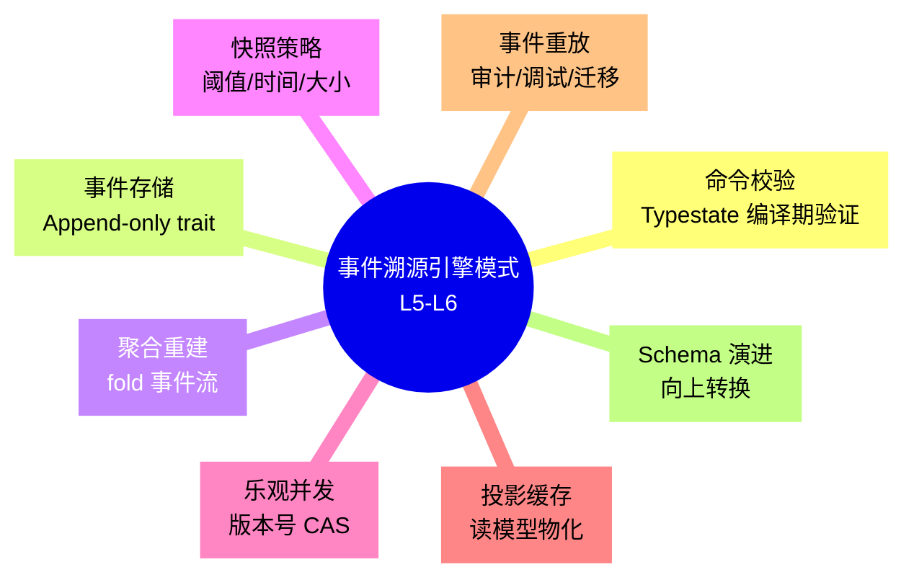
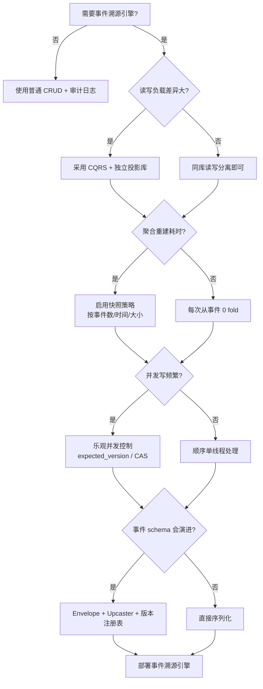

# 事件溯源引擎模式（Event Sourcing Engine Patterns in Rust）

> **EN**: Event Sourcing Engine Patterns in Rust
> **Summary**: Engineering patterns for building event-sourced storage engines in Rust: event-store abstraction, snapshotting, optimistic concurrency, projection caching, and typestate-validated commands.
> **Rust 版本**: 1.97.0+ (Edition 2024)
> **Bloom 层级**: L5-L6
> **权威来源**: 本文件为 `concept/` 权威页。
> **A/S/P 标记**: **P+S+A** — Procedure + Structure + Application — Structure + Application + Procedure
> **内容分级**: [专家级]
> **代码状态**: ✅ 含可编译示例
> **定位**: 本文件聚焦**事件溯源存储引擎的工程实现模式**，与 [`07_cqrs_event_sourcing.md`](07_cqrs_event_sourcing.md) 的 CQRS+ES 概念权威页形成互补：后者解释「是什么」与「为什么」，本文件解释「如何用一个 Rust 引擎实现」。
> **前置概念**:
> [CQRS & Event Sourcing](07_cqrs_event_sourcing.md) ·
> [Event-Driven Architecture](06_event_driven_architecture.md) ·
> [Typestate](32_typestate_deep_dive.md) ·
> [Repository and Unit of Work](24_repository_and_unit_of_work.md) ·
> [Traits](../../02_intermediate/00_traits/01_traits.md) ·
> [Interior Mutability](../../02_intermediate/02_memory_management/02_interior_mutability.md) ·
> [Error Handling](../../01_foundation/08_error_handling/01_error_handling_basics.md) ·
> [Rust vs Java](../../05_comparative/02_managed_languages/01_rust_vs_java.md)
> **后置概念**:
> [Saga](29_saga.md) · [Outbox](30_outbox.md) · [Workflow Theory](17_workflow_theory.md)
> **来源**:
> [Rust Reference](https://doc.rust-lang.org/reference/introduction.html) ·
> [TRPL](https://doc.rust-lang.org/book/title-page.html) ·
> [Tokio](https://docs.rs/tokio/) ·
> [flume](https://docs.rs/flume/) ·
> [Martin Fowler — Event Sourcing](https://martinfowler.com/eaaDev/EventSourcing.html)

---

## 📑 目录

- [事件溯源引擎模式（Event Sourcing Engine Patterns in Rust）](#事件溯源引擎模式event-sourcing-engine-patterns-in-rust)
  - [📑 目录](#-目录)
  - [🧠 知识结构图](#-知识结构图)
  - [一、权威定义](#一权威定义)
    - [1.1 事件溯源引擎](#11-事件溯源引擎)
    - [1.2 命令模型与类型状态验证](#12-命令模型与类型状态验证)
    - [1.3 快照与投影](#13-快照与投影)
    - [1.4 乐观并发控制](#14-乐观并发控制)
  - [二、Rust 实现惯用法](#二rust-实现惯用法)
    - [2.1 事件存储抽象：trait 边界](#21-事件存储抽象trait-边界)
    - [2.2 聚合根：fold 状态重建](#22-聚合根fold-状态重建)
    - [2.3 命令校验的类型状态机](#23-命令校验的类型状态机)
    - [2.4 快照策略与版本化](#24-快照策略与版本化)
    - [2.5 投影缓存与最终一致性](#25-投影缓存与最终一致性)
    - [2.6 乐观并发：版本号与 CAS](#26-乐观并发版本号与-cas)
    - [2.7 事件重放与审计日志](#27-事件重放与审计日志)
  - [三、反例与边界](#三反例与边界)
    - [3.1 反例：在重放循环中修改聚合](#31-反例在重放循环中修改聚合)
    - [3.2 反例：忽略事件 schema 版本](#32-反例忽略事件-schema-版本)
    - [3.3 反例：快照与事件流版本不一致](#33-反例快照与事件流版本不一致)
    - [3.4 边界：序列化成本与零拷贝权衡](#34-边界序列化成本与零拷贝权衡)
  - [四、选型决策树](#四选型决策树)
  - [五、权威来源索引](#五权威来源索引)
    - [P0：Rust 官方与核心规范](#p0rust-官方与核心规范)
    - [P1：学术与形式化来源](#p1学术与形式化来源)
    - [P2：生态权威与参考实现](#p2生态权威与参考实现)

---

## 🧠 知识结构图



> **认知功能**: 本 mindmap 将事件溯源引擎拆分为 8 个可独立演进的工程子系统。核心洞察是：**命令校验发生在写入前，状态重建发生在读取时，二者通过不可变事件流解耦**。

---

## 一、权威定义

### 1.1 事件溯源引擎

> **[Martin Fowler — Event Sourcing](https://martinfowler.com/eaaDev/EventSourcing.html)** 事件溯源是一种持久化策略：系统状态的所有变化都被记录为不可变事件。状态可以通过重放事件流来重建。

**事件溯源引擎**是支撑该策略的运行时组件集合，通常包括：

| 组件 | 职责 | Rust 抽象 |
|:---|:---|:---|
| **命令总线 (Command Bus)** | 接收、路由、校验命令 | `trait CommandHandler<C>` |
| **聚合根 (Aggregate)** | 维护业务不变量，产出领域事件 | `struct Aggregate { state, version }` |
| **事件存储 (Event Store)** | 追加持久化事件流 | `trait EventStore<E>` |
| **快照存储 (Snapshot Store)** | 缓存聚合状态，加速重建 | `trait SnapshotStore<S>` |
| **投影器 (Projector)** | 将事件流物化为读模型 | `trait Projector<E, View>` |
| **乐观并发控制 (OCC)** | 防止并发写覆盖 | `expected_version` / CAS |

### 1.2 命令模型与类型状态验证

事件溯源中的命令（Command）是对系统状态的**意图表达**。与 CQRS 的写模型配合，Rust 的 **Typestate** 可将「命令是否已校验」编码进类型：

- `UnvalidatedCommand`：原始输入，尚未校验业务规则。
- `ValidatedCommand`：已通过校验，可安全提交给聚合根。

这种编码使**非法提交在编译期被拒绝**，避免运行时校验遗漏。

### 1.3 快照与投影

**快照 (Snapshot)**：聚合根在某个版本的状态持久化副本。重建时先加载快照，再重放后续事件，避免从事件 0 开始 fold。

**投影 (Projection)**：事件流的只读物化视图，通常按查询场景去规范化。投影与写模型解耦，允许最终一致性。

### 1.4 乐观并发控制

事件存储通常采用追加写模型。当多个并发命令针对同一聚合根时，需保证**同一聚合的事件序列线性一致**。乐观并发控制的典型实现：

1. 读取聚合时返回当前版本号 `version`。
2. 写入新事件时携带 `expected_version`。
3. 若实际版本不等于期望值，返回并发冲突错误。

---

## 二、Rust 实现惯用法

### 2.1 事件存储抽象：trait 边界

使用 trait 定义事件存储的契约，使领域逻辑与持久化技术解耦：

```rust
use std::error::Error;
use std::fmt::Debug;

/// 领域事件标记 trait：要求 Clone + Debug + Send + Sync
pub trait DomainEvent: Clone + Debug + Send + Sync + 'static {}
impl<T: Clone + Debug + Send + Sync + 'static> DomainEvent for T {}

/// 存储中的事件记录：携带全局顺序号与聚合版本
#[derive(Debug, Clone)]
pub struct StoredEvent<E> {
    pub stream_id: String,
    pub version: u64,
    pub global_position: u64,
    pub event: E,
}

/// 事件存储端口：追加写 + 按流读取
pub trait EventStore<E: DomainEvent> {
    type Error: Error + Send + Sync + 'static;

    /// 追加事件；expected_version 用于乐观并发控制
    fn append(
        &mut self,
        stream_id: &str,
        expected_version: u64,
        events: Vec<E>,
    ) -> Result<Vec<u64>, Self::Error>;

    /// 读取某条事件流
    fn read_stream(&self, stream_id: &str) -> Result<Vec<StoredEvent<E>>, Self::Error>;

    /// 从指定版本之后读取（支持快照恢复后的增量重放）
    fn read_stream_from(
        &self,
        stream_id: &str,
        after_version: u64,
    ) -> Result<Vec<StoredEvent<E>>, Self::Error>;
}

fn main() {
    // trait 边界本身即可编译，具体实现见下文
    println!("EventStore trait defined");
}
```

> **关键洞察**: `DomainEvent` 用 blanket impl 自动为所有满足约束的类型实现，避免在每个事件类型上写重复代码。

### 2.2 聚合根：fold 状态重建

聚合根通过 `apply` 方法将事件 fold 到状态上：

```rust
use std::collections::HashMap;

#[derive(Debug, Clone, Default)]
pub struct BankAccountState {
    pub balance: i64,
    pub is_closed: bool,
}

#[derive(Debug, Clone)]
pub enum BankAccountEvent {
    Deposited { amount: u64 },
    Withdrawn { amount: u64 },
    Closed,
}

#[derive(Debug)]
pub struct BankAccount {
    pub account_id: String,
    pub version: u64,
    pub state: BankAccountState,
}

impl BankAccount {
    pub fn new(account_id: impl Into<String>) -> Self {
        Self {
            account_id: account_id.into(),
            version: 0,
            state: BankAccountState::default(),
        }
    }

    pub fn apply(&mut self, event: &BankAccountEvent) {
        match event {
            BankAccountEvent::Deposited { amount } => {
                self.state.balance += *amount as i64;
            }
            BankAccountEvent::Withdrawn { amount } => {
                self.state.balance -= *amount as i64;
            }
            BankAccountEvent::Closed => {
                self.state.is_closed = true;
            }
        }
        self.version += 1;
    }

    pub fn replay(events: &[BankAccountEvent], account_id: impl Into<String>) -> Self {
        let mut account = Self::new(account_id);
        for event in events {
            account.apply(event);
        }
        account
    }
}

fn main() {
    let events = vec![
        BankAccountEvent::Deposited { amount: 100 },
        BankAccountEvent::Withdrawn { amount: 30 },
    ];
    let account = BankAccount::replay(&events, "acc-1");
    assert_eq!(account.state.balance, 70);
    assert_eq!(account.version, 2);
}
```

### 2.3 命令校验的类型状态机

用 Typestate 区分「未校验命令」与「已校验命令」：

```rust,ignore
// 本片段依赖前文定义的 BankAccount/BankAccountEvent 类型
use std::marker::PhantomData;

#[derive(Debug, Clone)]
pub struct RawDeposit { pub amount: i64 }

#[derive(Debug, Clone)]
pub struct ValidatedDeposit { pub amount: u64 }

// 状态标记类型
pub struct Unvalidated;
pub struct Validated;

#[derive(Debug, Clone)]
pub struct DepositCommand<State> {
    pub account_id: String,
    pub amount: i64,
    _state: PhantomData<State>,
}

impl DepositCommand<Unvalidated> {
    pub fn new(account_id: impl Into<String>, amount: i64) -> Self {
        Self {
            account_id: account_id.into(),
            amount,
            _state: PhantomData,
        }
    }

    /// 校验：负数金额不可表示为已校验命令
    pub fn validate(self) -> Result<DepositCommand<Validated>, &'static str> {
        if self.amount <= 0 {
            Err("deposit amount must be positive")
        } else {
            Ok(DepositCommand {
                account_id: self.account_id,
                amount: self.amount,
                _state: PhantomData,
            })
        }
    }
}

impl DepositCommand<Validated> {
    pub fn amount(&self) -> u64 {
        self.amount as u64
    }
}

fn execute_deposit(cmd: DepositCommand<Validated>, account: &mut BankAccount) -> BankAccountEvent {
    BankAccountEvent::Deposited { amount: cmd.amount() }
}

fn main() {
    let raw = DepositCommand::<Unvalidated>::new("acc-1", 50);
    let validated = raw.validate().expect("valid command");
    let mut account = BankAccount::new("acc-1");
    let event = execute_deposit(validated, &mut account);
    account.apply(&event);
    assert_eq!(account.state.balance, 50);

    // 以下代码无法编译：execute_deposit 只接受 Validated 状态
    // let raw2 = DepositCommand::<Unvalidated>::new("acc-1", -10);
    // execute_deposit(raw2, &mut account);
}
```

> **关键洞察**: `PhantomData` 使状态标记不占用内存，编译期即可拒绝未校验命令进入执行路径。

### 2.4 快照策略与版本化

```rust,ignore
// 本片段展示快照存储 trait 与策略；独立编译需补充 Error 导入等上下文
#[derive(Debug, Clone)]
pub struct Snapshot<S> {
    pub stream_id: String,
    pub version: u64,
    pub state: S,
}

pub trait SnapshotStore<S: Clone + Send + Sync + 'static> {
    type Error: Error + Send + Sync + 'static;
    fn save(&mut self, snapshot: Snapshot<S>) -> Result<(), Self::Error>;
    fn load(&self, stream_id: &str) -> Result<Option<Snapshot<S>>, Self::Error>;
}

/// 快照策略：按事件数量阈值生成
pub struct SnapshotPolicy {
    pub every_n_events: u64,
}

impl SnapshotPolicy {
    pub fn should_snapshot(&self, current_version: u64) -> bool {
        current_version > 0 && current_version % self.every_n_events == 0
    }
}

fn main() {
    let policy = SnapshotPolicy { every_n_events: 100 };
    assert!(!policy.should_snapshot(99));
    assert!(policy.should_snapshot(100));
    assert!(!policy.should_snapshot(101));
}
```

### 2.5 投影缓存与最终一致性

投影器将事件流转换为读模型。以下展示内存中投影缓存：

```rust,ignore
// 本片段依赖前文定义的 BankAccountEvent/StoredEvent 等类型
use std::collections::HashMap;

#[derive(Debug, Default, Clone)]
pub struct BalanceView {
    pub balance: i64,
    pub last_version: u64,
}

pub struct InMemoryProjector {
    views: HashMap<String, BalanceView>,
}

impl InMemoryProjector {
    pub fn new() -> Self {
        Self {
            views: HashMap::new(),
        }
    }

    pub fn project(&mut self, stream_id: &str, events: &[StoredEvent<BankAccountEvent>]) {
        let view = self.views.entry(stream_id.to_string()).or_default();
        for stored in events {
            match &stored.event {
                BankAccountEvent::Deposited { amount } => {
                    view.balance += *amount as i64;
                }
                BankAccountEvent::Withdrawn { amount } => {
                    view.balance -= *amount as i64;
                }
                BankAccountEvent::Closed => {}
            }
            view.last_version = stored.version;
        }
    }

    pub fn view(&self, stream_id: &str) -> Option<BalanceView> {
        self.views.get(stream_id).cloned()
    }
}

fn main() {
    let mut projector = InMemoryProjector::new();
    let events = vec![
        StoredEvent {
            stream_id: "acc-1".into(),
            version: 1,
            global_position: 1,
            event: BankAccountEvent::Deposited { amount: 100 },
        },
        StoredEvent {
            stream_id: "acc-1".into(),
            version: 2,
            global_position: 2,
            event: BankAccountEvent::Withdrawn { amount: 20 },
        },
    ];
    projector.project("acc-1", &events);
    let view = projector.view("acc-1").unwrap();
    assert_eq!(view.balance, 80);
    assert_eq!(view.last_version, 2);
}
```

### 2.6 乐观并发：版本号与 CAS

```rust,ignore
// 本片段依赖前文定义的 DomainEvent/StoredEvent 等类型
#[derive(Debug)]
pub struct InMemoryEventStore<E> {
    streams: HashMap<String, Vec<StoredEvent<E>>>,
    global_position: u64,
}

impl<E: DomainEvent> InMemoryEventStore<E> {
    pub fn new() -> Self {
        Self {
            streams: HashMap::new(),
            global_position: 0,
        }
    }

    pub fn current_version(&self, stream_id: &str) -> u64 {
        self.streams
            .get(stream_id)
            .map(|events| events.last().map(|e| e.version).unwrap_or(0))
            .unwrap_or(0)
    }
}

#[derive(Debug)]
pub struct ConcurrencyError {
    pub expected: u64,
    pub actual: u64,
}

impl std::fmt::Display for ConcurrencyError {
    fn fmt(&self, f: &mut std::fmt::Formatter<'_>) -> std::fmt::Result {
        write!(f, "concurrency conflict: expected {}, actual {}", self.expected, self.actual)
    }
}

impl Error for ConcurrencyError {}

impl<E: DomainEvent> EventStore<E> for InMemoryEventStore<E> {
    type Error = ConcurrencyError;

    fn append(
        &mut self,
        stream_id: &str,
        expected_version: u64,
        events: Vec<E>,
    ) -> Result<Vec<u64>, Self::Error> {
        let current = self.current_version(stream_id);
        if current != expected_version {
            return Err(ConcurrencyError {
                expected: expected_version,
                actual: current,
            });
        }

        let stream = self.streams.entry(stream_id.to_string()).or_default();
        let mut versions = Vec::with_capacity(events.len());
        for event in events {
            self.global_position += 1;
            let version = current + versions.len() as u64 + 1;
            stream.push(StoredEvent {
                stream_id: stream_id.to_string(),
                version,
                global_position: self.global_position,
                event,
            });
            versions.push(version);
        }
        Ok(versions)
    }

    fn read_stream(&self, stream_id: &str) -> Result<Vec<StoredEvent<E>>, Self::Error> {
        Ok(self.streams.get(stream_id).cloned().unwrap_or_default())
    }

    fn read_stream_from(
        &self,
        stream_id: &str,
        after_version: u64,
    ) -> Result<Vec<StoredEvent<E>>, Self::Error> {
        Ok(self
            .streams
            .get(stream_id)
            .map(|events| {
                events
                    .iter()
                    .filter(|e| e.version > after_version)
                    .cloned()
                    .collect()
            })
            .unwrap_or_default())
    }
}

fn main() {
    let mut store = InMemoryEventStore::<BankAccountEvent>::new();
    let versions = store
        .append(
            "acc-1",
            0,
            vec![BankAccountEvent::Deposited { amount: 100 }],
        )
        .unwrap();
    assert_eq!(versions, vec![1]);

    // 模拟并发冲突：另一个客户端仍以为版本是 0
    let result = store.append(
        "acc-1",
        0,
        vec![BankAccountEvent::Withdrawn { amount: 10 }],
    );
    assert!(result.is_err());
    assert_eq!(result.unwrap_err().actual, 1);
}
```

### 2.7 事件重放与审计日志

```rust,ignore
// 本片段依赖前文定义的事件存储与投影类型
/// 审计日志：按全局顺序输出所有事件
pub fn audit_log<E: DomainEvent>(store: &impl EventStore<E>, stream_id: &str) {
    match store.read_stream(stream_id) {
        Ok(events) => {
            for e in events {
                println!(
                    "[pos={}] stream={} v={} event={:?}",
                    e.global_position, e.stream_id, e.version, e.event
                );
            }
        }
        Err(err) => eprintln!("audit failed: {}", err),
    }
}

fn main() {
    let mut store = InMemoryEventStore::<BankAccountEvent>::new();
    store
        .append(
            "acc-1",
            0,
            vec![
                BankAccountEvent::Deposited { amount: 100 },
                BankAccountEvent::Withdrawn { amount: 30 },
            ],
        )
        .unwrap();
    audit_log(&store, "acc-1");
}
```

---

## 三、反例与边界

### 3.1 反例：在重放循环中修改聚合

```rust,ignore
// ❌ 错误：在 fold 事件流时调用 mutating command
for event in events {
    account.apply(&event);
    if account.state.balance > 100 {
        account.apply(&BankAccountEvent::Withdrawn { amount: 10 }); // 非法！
    }
}
```

**修正**: 重放必须是**纯函数式 fold**，只根据事件更新状态，不能引入新事件。

```rust,ignore
// 修正示意：在完整上下文中对已有 events 列表执行纯 fold
for event in events {
    account.apply(&event);
}
```

### 3.2 反例：忽略事件 schema 版本

```rust,ignore
// ❌ 错误：直接反序列化外部事件，无版本兼容处理
let event: BankAccountEvent = serde_json::from_str(payload).unwrap();
```

**修正**: 使用 envelope + upcaster：

```rust,ignore
#[derive(Debug, Clone, Deserialize)]
struct EventEnvelope {
    schema_version: u32,
    payload: serde_json::Value,
}

fn deserialize_envelope(env: EventEnvelope) -> Result<BankAccountEvent, &'static str> {
    match env.schema_version {
        1 => serde_json::from_value(env.payload).map_err(|_| "invalid v1 payload"),
        0 => upcast_v0_to_v1(env.payload),
        _ => Err("unsupported schema version"),
    }
}
```

### 3.3 反例：快照与事件流版本不一致

```rust,ignore
// ❌ 错误：快照版本号与事件存储实际版本脱节
let snapshot = snapshot_store.load("acc-1").unwrap(); // version = 50
let events = event_store.read_stream("acc-1").unwrap(); // 包含 1..=50 的全部事件
// 重复应用 1..=50，导致状态错误
```

**修正**: 快照必须携带其对应的事件版本，重放时只应用该版本之后的事件。

```rust,ignore
// 修正示意：依赖前文定义的事件存储/快照存储类型
let snapshot = snapshot_store.load("acc-1").unwrap();
let mut account = BankAccount::from_snapshot(snapshot.state);
account.version = snapshot.version;
let new_events = event_store.read_stream_from("acc-1", snapshot.version).unwrap();
for stored in new_events {
    account.apply(&stored.event);
}
```

### 3.4 边界：序列化成本与零拷贝权衡

事件溯源引擎的核心开销之一是事件序列化/反序列化。Rust 生态提供两种极端：

| 方案 | 序列化 | 优点 | 缺点 |
|:---|:---|:---|:---|
| `serde_json` | JSON | 可读、易调试 | 文本解析开销高 |
| `rkyv` | 零拷贝归档 | 反序列化接近零成本 | Schema 演进复杂 |
| `flatbuffers` | 二进制 + 随机访问 | 零拷贝、跨语言 | 写路径复杂 |

判定依据：事件读多写少且 schema 稳定 → `rkyv`/`flatbuffers`；需要人类可读审计日志 → `serde_json`。

---

## 四、选型决策树



---

## 五、权威来源索引

### P0：Rust 官方与核心规范

- [The Rust Reference](https://doc.rust-lang.org/reference/introduction.html)
- [The Rust Programming Language](https://doc.rust-lang.org/book/title-page.html)
- [Rust API Guidelines](https://rust-lang.github.io/api-guidelines/)
- [Rust Design Patterns](https://rust-unofficial.github.io/patterns/)
- [Rust Error Codes Index](https://doc.rust-lang.org/error_codes/error-index.html)

### P1：学术与形式化来源

- [Taibi, Lenarduzzi & Pahl — *Microservices Anti Patterns: A Taxonomy*](https://arxiv.org/abs/1908.04101)（微服务反模式分类，事件溯源/CQRS 工程背景）

### P2：生态权威与参考实现

- [Tokio Documentation](https://tokio.rs/)
- [tokio::sync::mpsc - docs.rs](https://docs.rs/tokio/latest/tokio/sync/mpsc/)
- [flume - docs.rs](https://docs.rs/flume/)
- [eventstore-rs - docs.rs](https://docs.rs/eventstore/)
- [cqrs-es - docs.rs](https://docs.rs/cqrs-es/)
- [Martin Fowler — Event Sourcing](https://martinfowler.com/eaaDev/EventSourcing.html)
- [Martin Fowler — CQRS](https://martinfowler.com/bliki/CQRS.html)
- [Greg Young — CQRS Documents](https://cqrs.files.wordpress.com/2010/11/cqrs_documents.pdf)

---

> **文档版本**: 1.0 ｜ **最后更新**: 2026-08-03 ｜ **状态**: ✅ 新建权威页
