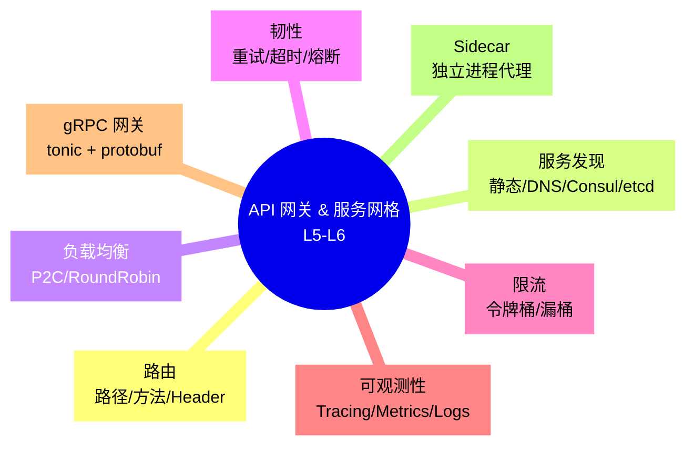
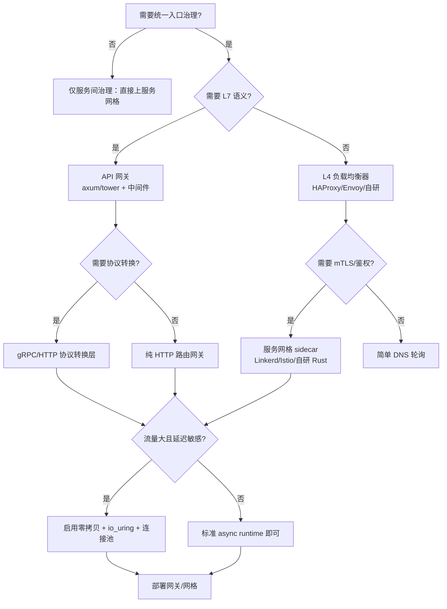

# API 网关与服务网格模式（API Gateway & Service Mesh Patterns in Rust）

> **EN**: API Gateway and Service Mesh Patterns in Rust
> **Summary**: Engineering patterns for API gateways and service meshes in Rust: routing, discovery, load balancing, retries, timeouts, rate limiting, observability, gRPC/tonic, axum/tower layers, and sidecar deployment.
> **Rust 版本**: 1.97.0+ (Edition 2024)
> **Bloom 层级**: L5-L6
> **权威来源**: 本文件为 `concept/` 权威页。
> **A/S/P 标记**: **S+A+P** — Structure + Application + Procedure
> **内容分级**: [专家级]
> **代码状态**: ✅ 含可编译示例
> **定位**: 本文件聚焦**微服务入口层与边车基础设施**的工程模式，与 [`05_microservice_patterns.md`](05_microservice_patterns.md) 形成互补：后者覆盖微服务全谱，本文件深入 API 网关实现、服务网格 sidecar 与可观测性横切关注点。
> **前置概念**:
> [Microservice Patterns](05_microservice_patterns.md) ·
> [Event-Driven Architecture](06_event_driven_architecture.md) ·
> [Circuit Breaker](26_circuit_breaker.md) · [Retry](28_retry.md) ·
> [Bulkhead](27_bulkhead.md) · [Async/Await](../../03_advanced/01_async/01_async.md) ·
> [Send/Sync](../../03_advanced/00_concurrency/02_send_sync_auto_traits.md) ·
> [Web Frameworks & Tower Layers](../../06_ecosystem/04_web_and_networking/03_web_frameworks.md) ·
> [Rust vs Go](../../05_comparative/01_systems_languages/03_rust_vs_go.md)
> **后置概念**:
> [Cloud Native](../04_web_and_networking/02_cloud_native.md) ·
> [Kubernetes Rust](../04_web_and_networking/11_kubernetes_rust.md) ·
> [High-Performance Network Service Architecture](../04_web_and_networking/08_high_performance_network_service_architecture.md)
> **来源**:
> [tower](https://docs.rs/tower/) ·
> [axum](https://docs.rs/axum/) ·
> [tonic](https://docs.rs/tonic/) ·
> [hyper](https://docs.rs/hyper/) ·
> [Rust API Guidelines](https://rust-lang.github.io/api-guidelines/)

---

## 📑 目录

- [API 网关与服务网格模式（API Gateway \& Service Mesh Patterns in Rust）](#api-网关与服务网格模式api-gateway--service-mesh-patterns-in-rust)
  - [📑 目录](#-目录)
  - [🧠 知识结构图](#-知识结构图)
  - [一、权威定义](#一权威定义)
    - [1.1 API 网关模式](#11-api-网关模式)
    - [1.2 服务网格模式](#12-服务网格模式)
    - [1.3 Sidecar 部署模型](#13-sidecar-部署模型)
    - [1.4 横切关注点](#14-横切关注点)
  - [二、Rust 实现惯用法](#二rust-实现惯用法)
    - [2.1 Tower Service 作为网关核心抽象](#21-tower-service-作为网关核心抽象)
    - [2.2 路由与请求转换](#22-路由与请求转换)
    - [2.3 服务发现集成](#23-服务发现集成)
    - [2.4 负载均衡：P2C 与轮询](#24-负载均衡p2c-与轮询)
    - [2.5 重试、超时与退避](#25-重试超时与退避)
    - [2.6 限流（Rate Limiting）](#26-限流rate-limiting)
    - [2.7 可观测性：Tracing 与 Metrics](#27-可观测性tracing-与-metrics)
    - [2.8 gRPC/tonic 网关层](#28-grpctonic-网关层)
    - [2.9 Sidecar 代理骨架](#29-sidecar-代理骨架)
  - [三、反例与边界](#三反例与边界)
    - [3.1 反例：网关直接调用数据库](#31-反例网关直接调用数据库)
    - [3.2 反例：忽略超时传播](#32-反例忽略超时传播)
    - [3.3 反例：sidecar 与业务进程共享失败域](#33-反例sidecar-与业务进程共享失败域)
    - [3.4 边界：可观测性的开销](#34-边界可观测性的开销)
  - [四、选型决策树](#四选型决策树)
  - [五、权威来源索引](#五权威来源索引)
    - [P0：Rust 官方与核心规范](#p0rust-官方与核心规范)
    - [P1：学术与形式化来源](#p1学术与形式化来源)
    - [P2：生态权威与参考实现](#p2生态权威与参考实现)

---

## 🧠 知识结构图



> **认知功能**: 本 mindmap 将 API 网关与服务网格的横切关注点可视化为同心能力层。核心洞察：**网关负责南北向流量治理，服务网格负责东西向服务间治理，二者共享同一套韧性语义（重试/超时/限流/熔断）**。

---

## 一、权威定义

### 1.1 API 网关模式

> **API Gateway** 是微服务架构的统一入口，负责将外部客户端请求路由到内部服务，并在请求路径上集中处理认证、限流、协议转换、缓存、日志等横切关注点。

核心职责：

- **请求路由**：根据 path、method、header 将请求分发到后端服务。
- **协议转换**：HTTP ↔ gRPC、REST ↔ GraphQL、WebSocket 升级等。
- **认证授权**：JWT/OAuth2/API Key 校验。
- **限流熔断**：保护后端免受流量突增影响。
- **可观测性**：统一生成 trace/span、访问日志、指标。

### 1.2 服务网格模式

> **Service Mesh** 是一层轻量级网络代理基础设施，位于服务之间（东西向流量），负责服务发现、负载均衡、加密通信、认证、可观测性，而无需修改服务代码。

Rust 在服务网格中的独特优势：

- **低开销 sidecar**：Rust 二进制小、无 GC，适合作为每个 Pod 的 sidecar。
- **零拷贝网络**：结合 io_uring / tokio-uring 实现高吞吐代理。
- **内存安全**：消除 C/C++ sidecar 中常见的缓冲区漏洞。

### 1.3 Sidecar 部署模型

Sidecar 是服务网格最常见的部署形态：每个应用 Pod 同时运行一个代理容器，所有进出流量先经过 sidecar。Rust 实现的 sidecar 通常分为两类：

- **L4 透明代理**：基于 iptables/eBPF 重定向 TCP 流量，实现透明加密与负载均衡。
- **L7 应用代理**：解析 HTTP/gRPC 协议，实现基于内容的路由与细粒度限流。

### 1.4 横切关注点

API 网关与服务网格共同处理的横切关注点：

| 关注点 | 网关（南北向） | 服务网格（东西向） |
|:---|:---|:---|
| 路由 | ✅ 路径/域名路由 | ✅ 服务名路由 |
| 负载均衡 | ✅ 后端实例选择 | ✅ 服务实例选择 |
| 重试/超时 | ✅ | ✅ |
| 熔断 | ✅ | ✅ |
| 限流 | ✅ 基于客户端身份 | ✅ 基于服务身份 |
| mTLS | ⚠️ 可选 | ✅ 默认 |
| 可观测性 | ✅ 访问日志、trace | ✅ 分布式 trace、metrics |

---

## 二、Rust 实现惯用法

### 2.1 Tower Service 作为网关核心抽象

[Tower](https://docs.rs/tower/) 将服务抽象为 `Service<Request>`，是 Rust 网关实现的事实标准：

```rust,ignore
use tower::{Service, ServiceBuilder, ServiceExt};
use std::future::Future;
use std::pin::Pin;
use std::task::{Context, Poll};

// 自定义后端服务
#[derive(Clone)]
struct BackendService;

impl Service<String> for BackendService {
    type Response = String;
    type Error = &'static str;
    type Future = Pin<Box<dyn Future<Output = Result<Self::Response, Self::Error>> + Send>>;

    fn poll_ready(&mut self, _cx: &mut Context<'_>) -> Poll<Result<(), Self::Error>> {
        Poll::Ready(Ok(()))
    }

    fn call(&mut self, req: String) -> Self::Future {
        Box::pin(async move { Ok(format!("processed: {}", req)) })
    }
}

// 使用 ServiceBuilder 组合超时、重试等中间件
async fn gateway_request() -> Result<String, Box<dyn std::error::Error>> {
    let svc = ServiceBuilder::new()
        .timeout(std::time::Duration::from_secs(5))
        .service(BackendService);

    let mut svc = svc.ready().await?;
    let resp = svc.call("hello".to_string()).await?;
    Ok(resp)
}
```

> **关键洞察**: Tower 的 `Service` trait 与 `Layer` 组合子让网关的每个横切关注点都成为可复用、可测试的中间件。

### 2.2 路由与请求转换

使用 axum 风格的路由（概念示例，需 `axum` crate）：

```rust,ignore
use axum::{
    routing::{get, post},
    Router,
};

async fn health() -> &'static str { "ok" }
async fn orders_handler() -> &'static str { "orders" }
async fn users_handler() -> &'static str { "users" }

fn gateway_router() -> Router {
    Router::new()
        .route("/health", get(health))
        .route("/api/v1/orders", post(orders_handler))
        .route("/api/v1/users", get(users_handler))
}
```

### 2.3 服务发现集成

```rust,ignore
use std::collections::HashMap;

/// 抽象服务目录：可替换为 Consul/etcd/K8s DNS
pub trait ServiceDirectory {
    fn resolve(&self, service_name: &str) -> Vec<String>;
}

pub struct StaticDirectory {
    endpoints: HashMap<String, Vec<String>>,
}

impl StaticDirectory {
    pub fn new(endpoints: HashMap<String, Vec<String>>) -> Self {
        Self { endpoints }
    }
}

impl ServiceDirectory for StaticDirectory {
    fn resolve(&self, service_name: &str) -> Vec<String> {
        self.endpoints.get(service_name).cloned().unwrap_or_default()
    }
}

fn main() {
    let mut endpoints = HashMap::new();
    endpoints.insert(
        "order-service".to_string(),
        vec!["10.0.0.1:8080".to_string(), "10.0.0.2:8080".to_string()],
    );
    let directory = StaticDirectory::new(endpoints);
    assert_eq!(directory.resolve("order-service").len(), 2);
}
```

### 2.4 负载均衡：P2C 与轮询

```rust
use std::sync::atomic::{AtomicUsize, Ordering};

pub trait LoadBalancer {
    fn select(&self, endpoints: &[String]) -> Option<String>;
}

/// 轮询负载均衡器
pub struct RoundRobin {
    counter: AtomicUsize,
}

impl RoundRobin {
    pub fn new() -> Self {
        Self {
            counter: AtomicUsize::new(0),
        }
    }
}

impl LoadBalancer for RoundRobin {
    fn select(&self, endpoints: &[String]) -> Option<String> {
        if endpoints.is_empty() {
            return None;
        }
        let idx = self.counter.fetch_add(1, Ordering::Relaxed) % endpoints.len();
        Some(endpoints[idx].clone())
    }
}

/// Power of Two Choices：随机选两个，挑负载轻的
pub struct P2C;

impl LoadBalancer for P2C {
    fn select(&self, endpoints: &[String]) -> Option<String> {
        if endpoints.is_empty() {
            return None;
        }
        if endpoints.len() == 1 {
            return Some(endpoints[0].clone());
        }
        use std::collections::hash_map::DefaultHasher;
        use std::hash::{Hash, Hasher};
        // 实际实现需维护每个端点的活跃请求数/延迟
        // 这里用端点哈希做确定性伪随机二选一，避免引入外部 rand crate
        let hash = |s: &str| {
            let mut h = DefaultHasher::new();
            s.hash(&mut h);
            h.finish() as usize
        };
        let a = &endpoints[hash(&endpoints[0]) % endpoints.len()];
        let b = &endpoints[hash(&endpoints[1]) % endpoints.len()];
        // 在真实系统中比较两个端点的负载/延迟；此处仅演示选择语义
        Some(a.clone())
    }
}

fn main() {
    let lb = RoundRobin::new();
    let endpoints = vec!["a:1".into(), "b:2".into(), "c:3".into()];
    assert_eq!(lb.select(&endpoints), Some("a:1".into()));
    assert_eq!(lb.select(&endpoints), Some("b:2".into()));
}
```

> **关键洞察**: 轮询实现简单但忽视后端负载；P2C 在 O(1) 选择内近似最优负载，是 Linkerd/Nginx 等代理的常用算法。

### 2.5 重试、超时与退避

```rust
use std::time::Duration;

pub fn exponential_backoff(base: Duration, attempt: u32, max: Duration) -> Duration {
    let factor = 2_u32.saturating_pow(attempt);
    let delay = base.saturating_mul(factor);
    if delay > max { max } else { delay }
}

pub fn jittered_delay(base: Duration, attempt: u32, max: Duration) -> Duration {
    let base_delay = exponential_backoff(base, attempt, max);
    // 生产环境通常使用 rand/fastrand；此处用确定性伪随机抖动，避免引入外部 crate
    let range = base_delay.as_millis() as u64 + 1;
    let jitter = (attempt as u64).wrapping_mul(0x9E3779B97F4A7C15) % range;
    Duration::from_millis(jitter)
}

fn main() {
    let base = Duration::from_millis(100);
    assert_eq!(exponential_backoff(base, 0, Duration::from_secs(1)), Duration::from_millis(100));
    assert_eq!(exponential_backoff(base, 1, Duration::from_secs(1)), Duration::from_millis(200));
    assert_eq!(exponential_backoff(base, 10, Duration::from_secs(1)), Duration::from_secs(1));
}
```

### 2.6 限流（Rate Limiting）

```rust
use std::time::{Duration, Instant};

/// 令牌桶限流器
pub struct TokenBucket {
    capacity: u64,
    tokens: f64,
    last_refill: Instant,
    refill_rate_per_sec: f64,
}

impl TokenBucket {
    pub fn new(capacity: u64, refill_rate_per_sec: u64) -> Self {
        Self {
            capacity,
            tokens: capacity as f64,
            last_refill: Instant::now(),
            refill_rate_per_sec: refill_rate_per_sec as f64,
        }
    }

    pub fn try_acquire(&mut self, n: u64) -> bool {
        let now = Instant::now();
        let elapsed = now.duration_since(self.last_refill).as_secs_f64();
        self.tokens = (self.tokens + elapsed * self.refill_rate_per_sec)
            .min(self.capacity as f64);
        self.last_refill = now;

        if self.tokens >= n as f64 {
            self.tokens -= n as f64;
            true
        } else {
            false
        }
    }
}

fn main() {
    let mut bucket = TokenBucket::new(10, 1);
    assert!(bucket.try_acquire(5));
    assert!(bucket.try_acquire(5));
    assert!(!bucket.try_acquire(1)); // 桶已空
}
```

### 2.7 可观测性：Tracing 与 Metrics

```rust,ignore
use tracing::{info, instrument};
use metrics::{counter, histogram};
use std::time::Instant;

#[instrument(fields(service = %service_name))]
async fn proxy_request(service_name: &str, request_id: &str) -> Result<String, &'static str> {
    let start = Instant::now();
    counter!("gateway.requests_total", "service" => service_name.to_string());

    info!(request_id, "routing request to {}", service_name);

    // 模拟后端调用
    let result = Ok(format!("response from {}", service_name));

    histogram!(
        "gateway.request_duration_seconds",
        start.elapsed().as_secs_f64(),
        "service" => service_name.to_string()
    );
    result
}
```

### 2.8 gRPC/tonic 网关层

```rust,ignore
use tonic::{transport::Server, Request, Response, Status};

pub mod pb {
    tonic::include_proto!("gateway");
}

use pb::{EchoRequest, EchoResponse, echo_server::{Echo, EchoServer}};

#[derive(Default)]
pub struct GatewayEchoService;

#[tonic::async_trait]
impl Echo for GatewayEchoService {
    async fn echo(
        &self,
        request: Request<EchoRequest>,
    ) -> Result<Response<EchoResponse>, Status> {
        let message = request.into_inner().message;
        Ok(Response::new(EchoResponse { message }))
    }
}

// 网关将 HTTP/1 请求转换为 gRPC/HTTP/2 调用
// tonic::client::Grpc 可作为后端客户端，axum handler 做入口协议适配
```

### 2.9 Sidecar 代理骨架

```rust,ignore
use tokio::net::{TcpListener, TcpStream};
use tokio::io::{AsyncReadExt, AsyncWriteExt};

/// 极简 L4 TCP sidecar：透明转发 + 连接计数
async fn sidecar_proxy(listen_addr: &str, upstream_addr: &str) -> std::io::Result<()> {
    let listener = TcpListener::bind(listen_addr).await?;
    loop {
        let (mut inbound, _) = listener.accept().await?;
        let upstream_addr = upstream_addr.to_string();
        tokio::spawn(async move {
            let mut outbound = TcpStream::connect(upstream_addr).await?;
            let (mut ri, mut wi) = inbound.split();
            let (mut ro, mut wo) = outbound.split();

            let client_to_server = tokio::io::copy(&mut ri, &mut wo);
            let server_to_client = tokio::io::copy(&mut ro, &mut wi);

            tokio::try_join!(client_to_server, server_to_client)?;
            Ok::<(), std::io::Error>(())
        });
    }
}
```

---

## 三、反例与边界

### 3.1 反例：网关直接调用数据库

```rust,ignore
// ❌ 错误：API 网关直接查询订单数据库，违反关注点分离
async fn gateway_orders_handler() -> Vec<Order> {
    sqlx::query_as::<_, Order>("SELECT * FROM orders").fetch_all(&db_pool).await.unwrap()
}
```

**修正**: 网关只负责路由与横切关注点，业务查询委托给后端服务。

```rust,ignore
async fn gateway_orders_handler() -> impl IntoResponse {
    let client = reqwest::Client::new();
    let resp = client.get("http://order-service/orders").send().await?;
    resp.json::<Vec<Order>>().await
}
```

### 3.2 反例：忽略超时传播

```rust,ignore
// ❌ 错误：网关未将上游超时传递给下游，导致级联等待
async fn handler() -> Result<String, Error> {
    let client = reqwest::Client::new();
    client.get("http://slow-service/").send().await // 默认无超时或超时过长
}
```

**修正**: 为每个下游调用设置明确超时，并在响应头中传播剩余时间预算。

```rust,ignore
async fn handler() -> Result<String, Error> {
    let client = reqwest::Client::builder()
        .timeout(Duration::from_secs(2))
        .build()?;
    client.get("http://slow-service/").send().await
}
```

### 3.3 反例：sidecar 与业务进程共享失败域

```rust,ignore
// ❌ 错误：sidecar 代理与业务服务共享线程池/文件描述符限制
// 当业务服务 OOM 时，sidecar 一同被终止
```

**修正**: sidecar 应作为独立容器运行，拥有独立的资源配额、健康检查与重启策略。

### 3.4 边界：可观测性的开销

分布式 tracing 与 metrics 会带来额外开销：

| 粒度 | 开销 | 适用场景 |
|:---|:---|:---|
| 每个请求生成 span | 中高 | 调试、错误追踪 |
| 采样 1% 请求 | 低 | 大规模生产 |
| 仅错误请求生成 span | 低 | 成本敏感 |
| 聚合 metrics | 极低 | SLO 监控、告警 |

判定依据：生产环境优先 metrics + 采样 trace；开发/调试环境可全量 trace。

---

## 四、选型决策树



---

## 五、权威来源索引

### P0：Rust 官方与核心规范

- [The Rust Reference](https://doc.rust-lang.org/reference/introduction.html)
- [The Rust Programming Language](https://doc.rust-lang.org/book/title-page.html)
- [Rust API Guidelines](https://rust-lang.github.io/api-guidelines/)
- [Rust Async Book](https://rust-lang.github.io/async-book/)
- [Rust Error Codes Index](https://doc.rust-lang.org/error_codes/error-index.html)

### P1：学术与形式化来源

- [Montesi & Weber — *Circuit Breakers, Discovery, and API Gateways in Microservices*](https://arxiv.org/abs/1609.05830)（微服务网关/服务发现/熔断器模式综述）
- [Shahab Samani & Stadler — *Dynamically meeting performance objectives for multiple services on a service mesh*](https://arxiv.org/abs/2210.04002)（服务网格性能管理）

### P2：生态权威与参考实现

- [Tower Service](https://docs.rs/tower/latest/tower/trait.Service.html)
- [axum - docs.rs](https://docs.rs/axum/)
- [tonic - docs.rs](https://docs.rs/tonic/)
- [hyper - docs.rs](https://docs.rs/hyper/)
- [tokio - docs.rs](https://docs.rs/tokio/)
- [tracing - docs.rs](https://docs.rs/tracing/)
- [metrics - docs.rs](https://docs.rs/metrics/)
- [Linkerd Documentation](https://linkerd.io/2/overview/)
- [Istio Architecture](https://istio.io/latest/docs/ops/deployment/architecture/)
- [Envoy Proxy](https://www.envoyproxy.io/)

---

> **文档版本**: 1.0 ｜ **最后更新**: 2026-08-03 ｜ **状态**: ✅ 新建权威页
