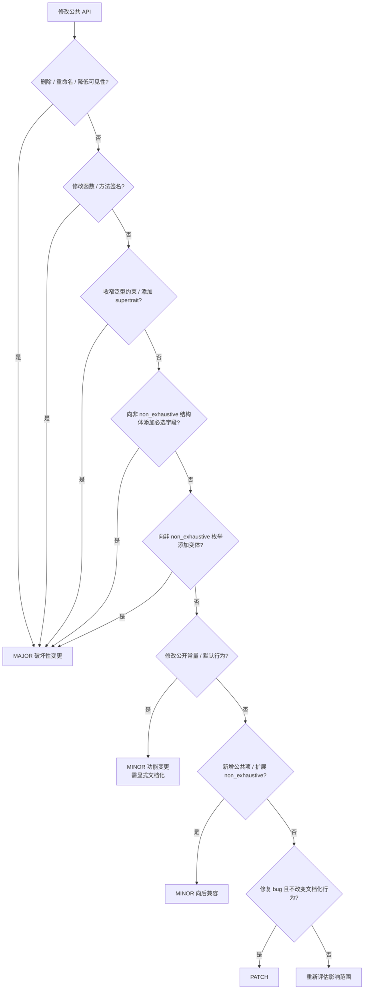
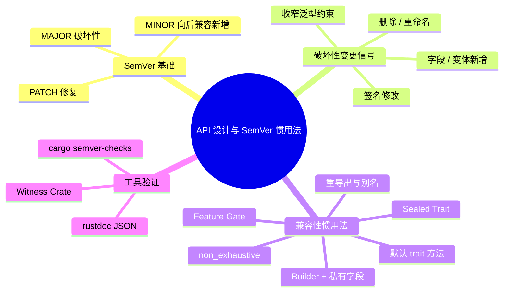

> **内容分级**: [专家级]
> **本节关键术语**: SemVer · API 兼容性 · 破坏性变更 · 密封 trait · non_exhaustive · Builder · 特征门 · cargo-semver-checks — [完整对照表](../../00_meta/01_terminology/01_terminology_glossary.md)
> **代码状态**: ✅ 含可编译示例
> **定理链**: N/A — 描述性/工程约定文档，不涉及形式化定理链

# Rust API 设计与 SemVer 惯用法

> **EN**: API Design and SemVer Idioms in Rust
> **Summary**: A practical guide to designing evolvable, SemVer-compliant public APIs in Rust, covering breaking-change taxonomy, compatibility-preserving idioms, and tooling.
>
> **Rust 版本**: 1.97.1+ (Edition 2024)
> **Bloom 层级**: L4-L5
> **权威来源**: 本文件为 `concept/` 权威页。
> **受众**: [进阶]
> **A/S/P 标记**: **S+A+P** — Structure + Application + Procedure
> **双维定位**: D×App — 将 SemVer 规则与 API 设计模式应用于 Rust crate 演化
> **定位**: 系统讲解如何在 Rust 中设计“可稳定演进”的公共 API：哪些变更属于破坏性变更、哪些惯用法能保留向后兼容、如何用工具自动验证。
>
> **前置概念**: [Rust API Guidelines 权威指南](../../00_meta/00_framework/rust_api_guidelines_canonical.md) ·
> [API 命名约定](../../02_intermediate/05_modules_and_visibility/03_api_naming_conventions.md) ·
> [Traits](../../02_intermediate/00_traits/01_traits.md) ·
> [Generics](../../02_intermediate/01_generics/01_generics.md) ·
> [模块与可见性](../../02_intermediate/05_modules_and_visibility/01_module_system.md)
> **后置概念**: [cargo-semver-checks 预览](../../07_future/02_preview_features/27_cargo_semver_checks_preview.md) ·
> [惯用法光谱](02_idioms_spectrum.md) ·
> [API 设计模式](18_api_design_patterns.md) ·
> [反模式](33_anti_patterns.md)
> **L5 对比**: [Rust vs C++](../../05_comparative/01_systems_languages/01_rust_vs_cpp.md)

---

> **来源**:
> [Cargo Book — SemVer Compatibility](https://doc.rust-lang.org/cargo/reference/semver.html) ·
> [Rust API Guidelines](https://rust-lang.github.io/api-guidelines/) ·
> [semver.org — Semantic Versioning 2.0.0](https://semver.org/) ·
> [The Rust Reference](https://doc.rust-lang.org/reference/introduction.html) ·
> [Rust for Rustaceans](https://rust-for-rustaceans.com/) ·
> [Effective Rust](https://www.effective-rust.com/)

---

## 📑 目录

- [Rust API 设计与 SemVer 惯用法](#rust-api-设计与-semver-惯用法)
  - [📑 目录](#-目录)
  - [一、权威定义与核心概念](#一权威定义与核心概念)
    - [1.1 SemVer 版本号语义](#11-semver-版本号语义)
    - [1.2 Rust 中的“破坏性变更”](#12-rust-中的破坏性变更)
    - [1.3 可扩展 API 的核心目标](#13-可扩展-api-的核心目标)
  - [二、概念属性矩阵](#二概念属性矩阵)
  - [三、保留兼容性的 API 设计惯用法](#三保留兼容性的-api-设计惯用法)
    - [3.1 密封 trait（Sealed Trait）](#31-密封-traitsealed-trait)
    - [3.2 `#[non_exhaustive]`](#32-non_exhaustive)
    - [3.3 Builder 与私有字段](#33-builder-与私有字段)
    - [3.4 默认 trait 方法与新方法](#34-默认-trait-方法与新方法)
    - [3.5 功能门（Feature Gate）与可选依赖](#35-功能门feature-gate与可选依赖)
    - [3.6 重导出与类型别名](#36-重导出与类型别名)
  - [四、完整示例：仅标准库的可演进 API](#四完整示例仅标准库的可演进-api)
  - [五、SemVer 决策树](#五semver-决策树)
  - [六、与国际权威来源的对齐说明](#六与国际权威来源的对齐说明)
  - [七、反例与陷阱](#七反例与陷阱)
    - [反例 1：破坏 sealed trait 的下游实现意图（E0277）](#反例-1破坏-sealed-trait-的下游实现意图e0277)
    - [反例 2：向非 `non_exhaustive` 结构体添加必选字段（E0063）](#反例-2向非-non_exhaustive-结构体添加必选字段e0063)
    - [反例 3：在 PATCH 中修改公开常量值](#反例-3在-patch-中修改公开常量值)
  - [八、关键属性](#八关键属性)
  - [九、概念关系](#九概念关系)
  - [十、思维导图](#十思维导图)
  - [国际权威参考](#国际权威参考)
  - [嵌入式测验](#嵌入式测验)
    - [测验 1：为什么 `#[non_exhaustive]` 能帮助 MINOR 升级？](#测验-1为什么-non_exhaustive-能帮助-minor-升级)
    - [测验 2：sealed trait 的核心价值是什么？](#测验-2sealed-trait-的核心价值是什么)
    - [测验 3：把公开 `struct` 的字段设为私有为什么有利于 SemVer？](#测验-3把公开-struct-的字段设为私有为什么有利于-semver)

---

## 一、权威定义与核心概念

### 1.1 SemVer 版本号语义

[SemVer 2.0.0](https://semver.org/) 把版本号定义为 `MAJOR.MINOR.PATCH`：

| 段位 | 含义 | 允许变更 |
|:---|:---|:---|
| **MAJOR** | 不兼容的 API 修改 | 删除/重命名公共项、收窄签名、改变行为契约 |
| **MINOR** | 向后兼容的功能新增 | 新增公共项、`#[non_exhaustive]` 扩展、新增默认方法 |
| **PATCH** | 向后兼容的问题修复 | Bug 修复、文档更正、不暴露新公共项的性能优化 |

判定原则：**下游已锁定的代码能否在不修改的情况下继续通过编译并维持文档化行为**？能则 MINOR/PATCH；不能则 MAJOR。

> **过渡**: 理解 SemVer 版本号语义后，下一节将把抽象规则映射到 Rust 类型系统的具体破坏面——从结构体字段、枚举变体到 trait 方法，逐一判定变更的兼容性。

### 1.2 Rust 中的“破坏性变更”

Rust 的静态类型系统使“破坏性”特别敏感。以下操作在 Cargo 的 SemVer 语境中被视为破坏：

1. **删除、重命名、降低可见性**任何 `pub` 项；
2. **修改函数/方法签名**：改变参数类型、返回类型、泛型约束、添加非默认泛型参数；
3. **向非 `#[non_exhaustive]` 的 `struct` 添加公开字段**（破坏 struct literal 构造与模式匹配）；
4. **向非 `#[non_exhaustive]` 的 `enum` 添加变体**（破坏穷尽匹配）；
5. **为公开 trait 添加无默认实现的抽象方法**（破坏已有实现者）；
6. **移除类型自动实现的 `Send`/`Sync`**（收窄线程安全边界）；
7. **把 `impl Trait` 返回的具体类型改为不兼容类型**（暴露实现细节时尤其危险）。

### 1.3 可扩展 API 的核心目标

- **封装实现细节**：公开 surface 越小，未来改动的自由度越大。
- **默认开放、显式封闭**：用 `#[non_exhaustive]` 和 sealed trait 保留扩展权，同时避免调用方产生错误假设。
- **构造即有效**：通过 builder 或 `try_new` 阻止无效状态进入公共类型。

---

## 二、概念属性矩阵

| 属性 | 取值 / 判定 | 依据 |
|---|---|---|
| 版本承诺 | `MAJOR.MINOR.PATCH` 三段式 | SemVer 2.0.0 |
| 兼容性方向 | 同 MAJOR 内 MINOR/PATCH 向后兼容 | Cargo SemVer Compatibility |
| 默认开放性 | `enum`/`struct` 默认 exhaustive | Rust 语言语义 |
| 扩展开关 | `#[non_exhaustive]` 使 exhaustive match 变为编译错误 | Rust Reference |
| 实现控制 | sealed trait 阻止下游 impl | Rust API Guidelines / Rust for Rustaceans |
| 构造控制 | private fields + builder / `try_new` | API Guidelines C-VALID |

---

## 三、保留兼容性的 API 设计惯用法

### 3.1 密封 trait（Sealed Trait）

把 trait 的 supertrait 放在一个私有模块中，公开 trait 继承该 supertrait。下游无法命名 supertrait，因此无法为外部类型实现公开 trait。

**价值**：防止用户实现你的 trait，未来可安全添加新方法（带默认实现）或修改内部契约。

```rust
// ✅ 上游 crate：公开 Endpoint，但禁止下游实现
pub mod upstream {
    mod sealed {
        pub trait Sealed {}
    }

    pub trait Endpoint: sealed::Sealed {
        fn url(&self) -> &str;
    }

    pub struct HttpEndpoint {
        url: String,
    }

    impl sealed::Sealed for HttpEndpoint {}
    impl Endpoint for HttpEndpoint {
        fn url(&self) -> &str { &self.url }
    }
}
```

### 3.2 `#[non_exhaustive]`

对 `enum` 和 `struct` 添加该属性后，外部 crate 不能构造其实例或使用穷尽模式匹配，从而允许库在不升 MAJOR 的情况下添加变体/字段。

```rust
// ✅ 可安全新增变体而不破坏下游 match
#[non_exhaustive]
pub enum LogLevel {
    Error,
    Warn,
    Info,
}

// 下游必须写：
// match level {
//     LogLevel::Error => ...,
//     LogLevel::Warn => ...,
//     LogLevel::Info => ...,
//     _ => ..., // 必须保留通配分支
// }
```

### 3.3 Builder 与私有字段

公开 `struct` 的字段若全部为私有，下游无法使用 struct literal 构造，也不能直接依赖字段存在。新增字段不会破坏现有代码。

```rust
#[derive(Debug, Clone)]
pub struct Client {
    host: String,
    port: u16,
}

impl Client {
    pub fn builder(host: impl Into<String>) -> ClientBuilder {
        ClientBuilder::new(host)
    }
}

#[derive(Debug, Clone)]
pub struct ClientBuilder {
    host: String,
    port: u16,
}

impl ClientBuilder {
    pub fn new(host: impl Into<String>) -> Self {
        Self { host: host.into(), port: 80 }
    }

    pub fn port(mut self, port: u16) -> Self {
        self.port = port;
        self
    }

    pub fn build(self) -> Result<Client, &'static str> {
        if self.host.is_empty() {
            return Err("host must not be empty");
        }
        if self.port == 0 {
            return Err("port must not be zero");
        }
        Ok(Client { host: self.host, port: self.port })
    }
}
```

### 3.4 默认 trait 方法与新方法

为公开 trait 新增方法时，提供默认实现可避免破坏已有 `impl`。这是 MINOR 升级的安全方式。

```rust
pub trait Formatter {
    fn format(&self, input: &str) -> String;

    // 新增方法带默认实现，不破坏旧实现者
    fn format_lossy(&self, input: &str) -> String {
        self.format(input)
    }
}
```

### 3.5 功能门（Feature Gate）与可选依赖

新增功能应放在 Cargo feature 之后，默认关闭。这样不改变默认编译行为，属于 MINOR 新增。

```toml
[features]
serde = ["dep:serde"]
async = ["dep:tokio"]
```

反模式：把默认关闭的行为改成默认开启，或在 PATCH 中新增默认 feature。

### 3.6 重导出与类型别名

- **重导出** `pub use` 可以调整模块结构而不破坏路径（旧路径保留为 deprecated）。
- **类型别名** `pub type UserId = u64;` 提供语义封装，但若替换为 newtype 则属于 MAJOR 破坏。

---

## 四、完整示例：仅标准库的可演进 API

以下示例展示如何用 sealed trait、`#[non_exhaustive]`、builder、默认 trait 方法设计一个可在 MINOR/PATCH 中安全演进的库 API。

```rust
//! 一个 SemVer 友好的配置/端点库示例（仅依赖标准库）

use std::fmt;

// ---------- 错误类型 ----------
#[derive(Debug, Clone, PartialEq)]
pub enum ConfigError {
    InvalidPort,
    MissingHost,
}

impl fmt::Display for ConfigError {
    fn fmt(&self, f: &mut fmt::Formatter<'_>) -> fmt::Result {
        match self {
            ConfigError::InvalidPort => write!(f, "invalid port"),
            ConfigError::MissingHost => write!(f, "missing host"),
        }
    }
}

impl std::error::Error for ConfigError {}

// ---------- 非穷尽枚举：未来可新增日志级别 ----------
#[non_exhaustive]
#[derive(Debug, Clone)]
pub enum LogLevel {
    Error,
    Warn,
    Info,
}

// ---------- 密封 trait：公开接口，禁止下游实现 ----------
mod sealed {
    pub trait Sealed {}
}

pub trait Endpoint: sealed::Sealed {
    fn url(&self) -> &str;
}

#[derive(Debug, Clone)]
pub struct HttpEndpoint {
    url: String,
}

impl sealed::Sealed for HttpEndpoint {}
impl Endpoint for HttpEndpoint {
    fn url(&self) -> &str { &self.url }
}

// ---------- Builder + 私有字段：构造即有效 ----------
#[derive(Debug, Clone)]
pub struct Client {
    host: String,
    port: u16,
    level: LogLevel,
}

impl Client {
    pub fn builder(host: impl Into<String>) -> ClientBuilder {
        ClientBuilder::new(host)
    }

    pub fn host(&self) -> &str { &self.host }
    pub fn port(&self) -> u16 { self.port }
    pub fn log_level(&self) -> &LogLevel { &self.level }
}

#[derive(Debug, Clone)]
pub struct ClientBuilder {
    host: String,
    port: u16,
    level: LogLevel,
}

impl ClientBuilder {
    pub fn new(host: impl Into<String>) -> Self {
        Self {
            host: host.into(),
            port: 443,
            level: LogLevel::Info,
        }
    }

    pub fn port(mut self, port: u16) -> Self {
        self.port = port;
        self
    }

    pub fn log_level(mut self, level: LogLevel) -> Self {
        self.level = level;
        self
    }

    pub fn build(self) -> Result<Client, ConfigError> {
        if self.host.is_empty() {
            return Err(ConfigError::MissingHost);
        }
        if self.port == 0 {
            return Err(ConfigError::InvalidPort);
        }
        Ok(Client {
            host: self.host,
            port: self.port,
            level: self.level,
        })
    }
}

// ---------- 默认 trait 方法：可安全扩展 ----------
pub trait Formatter {
    fn format(&self, input: &str) -> String;

    // 未来新增方法时提供默认实现，不破坏旧实现
    fn format_lossy(&self, input: &str) -> String {
        self.format(input)
    }
}

fn main() {
    let client = Client::builder("example.com")
        .port(8443)
        .log_level(LogLevel::Warn)
        .build()
        .expect("valid config");

    println!("{}:{} {:?}", client.host(), client.port(), client.log_level());

    let endpoint = HttpEndpoint { url: format!("https://{}:{}", client.host(), client.port()) };
    println!("endpoint: {}", endpoint.url());
}
```

> 实测（rustc 1.97.1, `--edition 2024`）：`cargo check` / `cargo run` 通过。

---

## 五、SemVer 决策树



判定要点：只要存在**下游已锁定代码可能编译失败或行为改变**的风险，就应升 MAJOR。

---

## 六、与国际权威来源的对齐说明

| 本页主题 | 国际权威来源 | 对齐要点 |
|---|---|---|
| SemVer 版本号语义 | [semver.org](https://semver.org/) | `MAJOR.MINOR.PATCH` 三段式定义 |
| Rust 破坏性变更清单 | [Cargo Book — SemVer Compatibility](https://doc.rust-lang.org/cargo/reference/semver.html) | 删除项、签名变更、字段/变体新增等具体规则 |
| 命名与构造约定 | [Rust API Guidelines](https://rust-lang.github.io/api-guidelines/) | C-VALID、C-CTOR、C-GETTER、C-SEALED 等 |
| 密封 trait 技术 | [Rust for Rustaceans](https://rust-for-rustaceans.com/) | 通过私有 supertrait 阻止外部实现 |
| `#[non_exhaustive]` 语义 | [The Rust Reference](https://doc.rust-lang.org/reference/attributes/type-system.html) | 非穷尽类型在 crate 外使用的限制 |
| 错误处理 | [Rust API Guidelines — C-GOOD-ERR](https://rust-lang.github.io/api-guidelines/interoperability.html#c-good-err) | 错误类型实现 `std::error::Error` + `Display` |
| 工具验证 | [cargo-semver-checks](https://github.com/obi1kenobi/cargo-semver-checks) | 通过 rustdoc JSON 自动检测 ~245 种破坏变更 |

---

## 七、反例与陷阱

### 反例 1：破坏 sealed trait 的下游实现意图（E0277）

密封 trait 禁止下游实现。若下游强行实现，会因无法满足私有 supertrait 而编译失败。

```rust,compile_fail,E0277
// 模拟上游 crate
pub mod upstream {
    mod sealed {
        pub trait Sealed {}
    }

    pub trait Endpoint: sealed::Sealed {
        fn url(&self) -> &str;
    }
}

// 下游 crate 试图实现 Endpoint
struct MyEndpoint;

impl upstream::Endpoint for MyEndpoint {
    fn url(&self) -> &str { "https://example.com" }
}

fn main() {}
```

> 错误本质：`MyEndpoint` 未实现私有的 `sealed::Sealed`，因此不满足 `Endpoint` 的 supertrait bound。这是 sealed trait 设计的预期行为。

### 反例 2：向非 `non_exhaustive` 结构体添加必选字段（E0063）

如果公开 `struct` 的字段全部公开且可被 struct literal 构造，新增字段会破坏所有构造点。

```rust,compile_fail,E0063
// 上游 v1.1.0 新增字段 port
pub struct Config {
    pub host: String,
    pub port: u16, // v1.0.0 不存在
}

// 下游按 v1.0.0 的写法初始化，编译失败
fn main() {
    let _ = Config { host: String::from("example.com") }; // E0063 missing port
}
```

> 修正：字段私有 + 提供 builder / `new` / `try_new`，或把结构体标记为 `#[non_exhaustive]`。

### 反例 3：在 PATCH 中修改公开常量值

```rust
// 上游 v1.0.5 修改常量
pub const DEFAULT_TIMEOUT_MS: u64 = 30_000; // 原为 5_000
```

表面上没有签名变更，但下游依赖该默认值的运行时行为会改变。根据 SemVer，**行为契约的变更**即便不破坏编译，也应在 MINOR 中发布并文档化；若行为变更是修复安全漏洞，可视为 PATCH，但必须在 Release Notes 中明确说明。

---

## 八、关键属性

| 属性 | 取值 / 判定 | 依据 |
|---|---|---|
| 版本模型 | SemVer 2.0.0 | semver.org |
| 兼容性承诺 | 同 MAJOR 向后兼容 | Cargo Book |
| 破坏性信号 | 删除、重命名、签名变更、字段/变体新增（非 exhaustive） | Cargo SemVer Compatibility |
| 扩展性机制 | `#[non_exhaustive]`、sealed trait、builder、默认方法 | Rust API Guidelines |
| 自动化验证 | `cargo semver-checks` | cargo-semver-checks 文档 |

---

## 九、概念关系

- **上位（is-a）**：[API 设计模式](18_api_design_patterns.md) 的子主题，聚焦“可演化性”维度。
- **下位（实例）**：sealed trait、`#[non_exhaustive]`、builder、feature gate 等具体惯用法。
- **依赖**：以 [Traits](../../02_intermediate/00_traits/01_traits.md)、[Generics](../../02_intermediate/01_generics/01_generics.md)、[模块可见性](../../02_intermediate/05_modules_and_visibility/01_module_system.md) 为语法基础。
- **对偶**：与 [API 命名约定](../../02_intermediate/05_modules_and_visibility/03_api_naming_conventions.md) 共同构成“API 契约设计”的两面（命名语义 vs 版本语义）。
- **前置工具链**：[Cargo Registry 与包发布](../01_cargo/08_cargo_registries_and_publishing.md) 提供发布流程背景。

---

## 十、思维导图



---

> **过渡**: 掌握 SemVer 规则与 API 可演化惯用法后，可进一步学习 [cargo-semver-checks 预览](../../07_future/02_preview_features/27_cargo_semver_checks_preview.md) 中的自动化验证方法，并在 [惯用法光谱](02_idioms_spectrum.md) 中横向对比 Rust 社区的其他设计模式。

---

## 国际权威参考

- **P0 官方**: [Cargo Book — SemVer Compatibility](https://doc.rust-lang.org/cargo/reference/semver.html)
- **P0 官方**: [Rust API Guidelines](https://rust-lang.github.io/api-guidelines/)
- **P0 官方**: [The Rust Reference](https://doc.rust-lang.org/reference/introduction.html)
- **P0 官方**: [semver.org — Semantic Versioning 2.0.0](https://semver.org/)
- **P1 书籍**: [Rust for Rustaceans](https://rust-for-rustaceans.com/)
- **P1 书籍**: [Effective Rust](https://www.effective-rust.com/)
- **P1 学术**: [Putting the Semantics into Semantic Versioning](https://arxiv.org/abs/2008.07069) — 语义版本控制的语义形式化分析
- **P2 生态**: [cargo-semver-checks](https://github.com/obi1kenobi/cargo-semver-checks)
- **P2 生态**: [Rust Design Patterns](https://rust-unofficial.github.io/patterns/)

---

## 嵌入式测验

### 测验 1：为什么 `#[non_exhaustive]` 能帮助 MINOR 升级？

<details>
<summary>✅ 答案与解析</summary>

它禁止外部 crate 对类型使用穷尽式构造或匹配，因此新增字段/变体不会破坏下游代码。
</details>

### 测验 2：sealed trait 的核心价值是什么？

<details>
<summary>✅ 答案与解析</summary>

阻止下游实现该 trait，使库作者未来可安全添加新方法或调整内部契约而不破坏已有实现者。
</details>

### 测验 3：把公开 `struct` 的字段设为私有为什么有利于 SemVer？

<details>
<summary>✅ 答案与解析</summary>

下游无法使用 struct literal 构造，也不能直接依赖字段存在，新增/删除字段不会破坏现有代码。
</details>

---

**变更日志**:

- v1.0 (2026-08-03): 初始创建——Rust API 设计与 SemVer 惯用法，覆盖 SemVer 规则、破坏性变更分类、sealed trait、`#[non_exhaustive]`、builder、默认方法、feature gate、决策树与标准库可编译示例。
