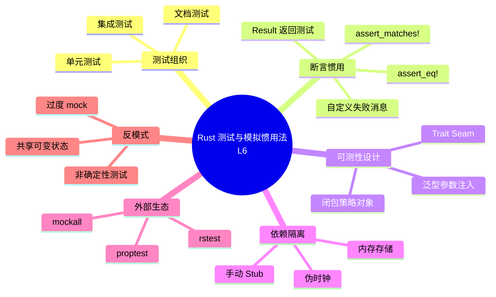
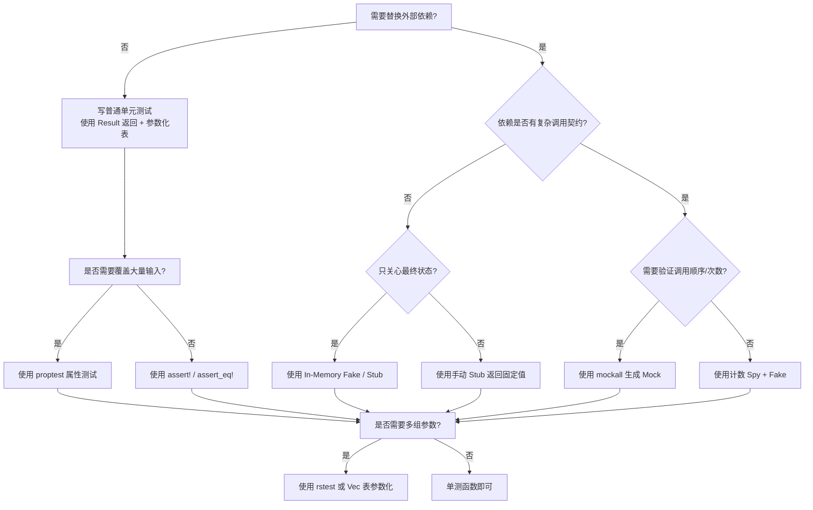

# Rust 测试与模拟惯用法（Testing and Mocking Idioms）

**EN**: Testing and Mocking Idioms in Rust
**Summary**: A canonical catalog of Rust-specific testing and mocking idioms that exploit the type system, trait seams, and RAII to write deterministic, parallel-safe tests with minimal external dependencies.

> **Rust 版本**: 1.97.1+ (Edition 2024)
> **Bloom 层级**: L6
> **权威来源**: 本文件为 `concept/` 权威页。
> **前置概念**: [测试基础](../../01_foundation/10_testing_basics/01_testing_basics.md) · [测试策略](../09_testing_and_quality/01_testing_strategies.md) · [Traits](../../02_intermediate/00_traits/01_traits.md) · [内部可变性](../../02_intermediate/02_memory_management/02_interior_mutability.md)
> **后置概念**: [测试生态：单元测试、集成测试与验证策略](../09_testing_and_quality/03_testing.md) · [Rust 惯用法谱系全景](02_idioms_spectrum.md)

---

> **来源（P0 官方）**:
> [TRPL — Testing](https://doc.rust-lang.org/book/ch11-00-testing.html) ·
> [Rust Reference — Attributes / Testing](https://doc.rust-lang.org/reference/attributes/testing.html) ·
> [Cargo Test](https://doc.rust-lang.org/cargo/commands/cargo-test.html) ·
> [Rust API Guidelines](https://rust-lang.github.io/api-guidelines/)
>
> **来源（P1 学术）**:
> [Jung et al. — RustBelt: Securing the Foundations of Rust](https://plv.mpi-sws.org/rustbelt/popl18/) ·
> [Fowler — Test Double Patterns](https://martinfowler.com/bliki/TestDouble.html)
>
> **来源（P2 生态）**:
> [mockall crate](https://docs.rs/mockall/latest/mockall/) ·
> [proptest Book](https://altsysrq.github.io/proptest-book/intro.html) ·
> [rstest crate](https://docs.rs/rstest/latest/rstest/) ·
> [similar-asserts crate](https://docs.rs/similar-asserts/latest/similar_asserts/) ·
> [Rust Design Patterns](https://rust-unofficial.github.io/patterns/)

---

## 🧠 知识结构图



> **认知功能**: 本图将 Rust 测试与模拟知识组织为六个正交维度。核心洞察是：Rust 的类型系统使「可测性设计」成为 idiomatic API 的自然结果，而不是事后打补丁。

---

## 📑 目录

- [Rust 测试与模拟惯用法（Testing and Mocking Idioms）](#rust-测试与模拟惯用法testing-and-mocking-idioms)
  - [🧠 知识结构图](#-知识结构图)
  - [📑 目录](#-目录)
  - [一、核心概念](#一核心概念)
    - [1.1 什么是测试惯用法](#11-什么是测试惯用法)
    - [1.2 模拟（Mock）与测试替身（Test Double）](#12-模拟mock与测试替身test-double)
    - [1.3 Rust 测试惯用法的特殊性](#13-rust-测试惯用法的特殊性)
  - [二、断言与测试结构惯用法](#二断言与测试结构惯用法)
    - [2.1 Result 返回测试](#21-result-返回测试)
    - [2.2 自定义失败消息](#22-自定义失败消息)
    - [2.3 `assert_matches!`](#23-assert_matches)
    - [2.4 参数化测试：闭包与迭代器](#24-参数化测试闭包与迭代器)
  - [三、可测性设计：Trait Seam 与依赖注入](#三可测性设计trait-seam-与依赖注入)
    - [3.1 用 Trait 抽象外部依赖](#31-用-trait-抽象外部依赖)
    - [3.2 泛型参数注入](#32-泛型参数注入)
    - [3.3 闭包作为策略对象](#33-闭包作为策略对象)
  - [四、零外部依赖的 Mock/Stub 惯用法](#四零外部依赖的-mockstub-惯用法)
    - [4.1 手动 Stub 实现](#41-手动-stub-实现)
    - [4.2 内存存储 Stub](#42-内存存储-stub)
    - [4.3 伪时钟 Stub](#43-伪时钟-stub)
    - [4.4 计数与验证 Stub](#44-计数与验证-stub)
  - [五、外部生态工具惯用法](#五外部生态工具惯用法)
    - [5.1 mockall：过程宏生成 Mock](#51-mockall过程宏生成-mock)
    - [5.2 proptest：属性测试](#52-proptest属性测试)
    - [5.3 rstest：参数化测试](#53-rstest参数化测试)
  - [六、测试隔离与资源惯用法](#六测试隔离与资源惯用法)
    - [6.1 RAII 临时目录](#61-raii-临时目录)
    - [6.2 静态原子计数器](#62-静态原子计数器)
    - [6.3 `std::sync::Mutex` 与测试死锁](#63-stdsyncmutex-与测试死锁)
  - [七、反例与陷阱](#七反例与陷阱)
    - [7.1 编译错误：`assert_eq!` 要求 `PartialEq`](#71-编译错误assert_eq-要求-partialeq)
    - [7.2 运行时陷阱：共享可变状态](#72-运行时陷阱共享可变状态)
    - [7.3 反模式：过度 Mock](#73-反模式过度-mock)
    - [7.4 反模式：非确定性测试](#74-反模式非确定性测试)
  - [八、决策树：选择测试/模拟策略](#八决策树选择测试模拟策略)
  - [九、与国际权威来源的对齐](#九与国际权威来源的对齐)
  - [十、相关概念与延伸阅读](#十相关概念与延伸阅读)
  - [权威来源索引](#权威来源索引)

---

## 一、核心概念

### 1.1 什么是测试惯用法

> **测试惯用法（Testing Idiom）**: 在 Rust 社区中被广泛接受的、利用语言特性（所有权、trait、泛型、RAII）表达测试意图的**地道写法**。它不是测试框架的语法，而是「如何组织测试代码以最小化样板、最大化编译期保证」的局部最优解。

与「测试策略」或「测试基础」不同，本页聚焦**代码层面的表达模式**：

| 维度 | 测试基础（L2） | 测试策略（L3-L4） | 测试与模拟惯用法（L6） |
|:---|:---|:---|:---|
| 关注点 | `#[test]`、`assert!` 怎么用 | 何时写单元/集成/属性测试 | 如何把依赖写成可替换的、如何用类型系统保证测试确定性 |
| 输出 | 能运行的测试 | 测试计划与分层 | 可复用的代码模式与反模式 |
| 依赖 | 标准库 | 生态工具 | 标准库 + 可选生态工具 |

### 1.2 模拟（Mock）与测试替身（Test Double）

按 Fowler 的分类，测试替身（Test Double）是广义的依赖替换物：

- **Dummy**: 仅填充参数，不被使用。
- **Fake**: 有真实但简化的实现，如内存数据库。
- **Stub**: 对固定输入返回固定输出。
- **Spy**: 记录调用信息供后续断言。
- **Mock**: 预设期望，运行时验证调用是否符合预期。

Rust 社区通常把「mock」当作动词或统称，技术上更多使用 **Stub/Fake + Spy** 的组合，因为强类型系统鼓励显式 trait 边界而非动态期望对象。

### 1.3 Rust 测试惯用法的特殊性

Rust 的所有权与并发模型使以下原则成为 idiomatic：

1. **默认并行**：`cargo test` 默认并行运行，测试间不能共享可变状态。
2. **零成本测试代码**：`#[cfg(test)]` 在 release 构建中完全消除。
3. **编译期接口契约**：用 trait 抽象依赖后，mock 实现必须在编译期满足所有 bound。
4. **确定性优先**：惯用法鼓励伪时钟、确定性随机种子，避免 `Instant::now()` 等隐藏依赖。

---

## 二、断言与测试结构惯用法

### 2.1 Result 返回测试

> **惯用**: 测试函数返回 `Result<(), Box<dyn Error>>`（或具体错误类型），用 `?` 传播 setup 错误，减少 `unwrap()` 噪音。 来源: [Rust API Guidelines](https://rust-lang.github.io/api-guidelines/)

```rust
use std::fs::File;
use std::io::{self, Read};

fn load_config(path: &str) -> io::Result<String> {
    let mut file = File::open(path)?;
    let mut buf = String::new();
    file.read_to_string(&mut buf)?;
    Ok(buf)
}

#[cfg(test)]
mod tests {
    use super::*;

    #[test]
    fn load_config_returns_content() -> io::Result<()> {
        // 若文件不存在或读取失败，测试自动标记为失败并传播错误
        let content = load_config("Cargo.toml")?;
        assert!(content.contains("[package]"));
        Ok(())
    }
}
```

**等价性**: `fn test() -> Result<T, E>` 在测试框架中等价于 `match test() { Ok(_) => pass, Err(e) => fail with e }`，但代码更贴近生产代码风格。

### 2.2 自定义失败消息

> **惯用**: 使用 `assert_eq!(actual, expected, "context: {}", value)` 在断言失败时提供调试上下文，避免只看到两个值而不知业务含义。 来源: [Rust By Example — Testing](https://doc.rust-lang.org/rust-by-example/testing.html)

```rust
#[cfg(test)]
mod tests {
    fn discount(price: u32, member: bool) -> u32 {
        if member { price * 9 / 10 } else { price }
    }

    #[test]
    fn member_gets_ten_percent_off() {
        let price = 100;
        assert_eq!(
            discount(price, true),
            90,
            "member discount should be 10% off for price={}",
            price
        );
    }
}
```

### 2.3 `assert_matches!`

> **惯用**: 对 `Option`/`Result`/自定义枚举做模式断言，避免先 `unwrap` 再 `assert`。Rust 1.58+ 内置 `assert_matches!`。 来源: [Rust Reference — Macro assert_matches](https://doc.rust-lang.org/std/assert_matches/macro.assert_matches.html)

```rust
#[derive(Debug, PartialEq)]
enum Status { Ok(u32), Err(&'static str) }

#[cfg(test)]
mod tests {
    use super::*;

    #[test]
    fn status_is_ok_with_value() {
        let status = Status::Ok(42);
        // stable 惯用：matches! + assert!
        assert!(matches!(status, Status::Ok(n) if n > 10));
    }
}
```

> **注意**: 在 Rust 1.97 stable 中，`matches!` 配合 `assert!` 是验证模式的最便携方式；`std::assert_matches::assert_matches!` 需等待该宏进入 stable channel。

### 2.4 参数化测试：闭包与迭代器

> **惯用**: 用 `for` 循环 + `Vec<(input, expected)>` 或迭代器实现轻量参数化测试，无需引入第三方 `rstest`。

```rust
#[cfg(test)]
mod tests {
    fn fib(n: u32) -> u32 {
        match n {
            0 => 0,
            1 => 1,
            _ => fib(n - 1) + fib(n - 2),
        }
    }

    #[test]
    fn fib_cases() {
        let cases = vec![(0, 0), (1, 1), (2, 1), (5, 5), (10, 55)];
        for (input, expected) in cases {
            assert_eq!(
                fib(input), expected,
                "fib({}) should be {}", input, expected
            );
        }
    }
}
```

---

## 三、可测性设计：Trait Seam 与依赖注入

### 3.1 用 Trait 抽象外部依赖

> **惯用**: 将 I/O、网络、数据库、时钟等不可控依赖抽象为 trait，生产代码与测试代码分别实现。这是 Rust 中「依赖注入」的主要形式。 来源: [Rust Design Patterns — Traits](https://rust-unofficial.github.io/patterns/)

```rust
// 抽象外部依赖
pub trait Clock {
    fn now(&self) -> u64;
}

pub struct SystemClock;
impl Clock for SystemClock {
    fn now(&self) -> u64 {
        std::time::SystemTime::now()
            .duration_since(std::time::UNIX_EPOCH)
            .unwrap()
            .as_secs()
    }
}

pub struct RateLimiter<C: Clock> {
    clock: C,
    last: u64,
}

impl<C: Clock> RateLimiter<C> {
    pub fn new(clock: C) -> Self {
        Self { clock, last: 0 }
    }

    pub fn try_acquire(&mut self) -> bool {
        let now = self.clock.now();
        if now - self.last >= 1 {
            self.last = now;
            true
        } else {
            false
        }
    }
}

#[cfg(test)]
mod tests {
    use super::*;

    struct FakeClock(u64);
    impl Clock for FakeClock {
        fn now(&self) -> u64 { self.0 }
    }

    #[test]
    fn rate_limiter_allows_after_one_second() {
        let mut limiter = RateLimiter::new(FakeClock(0));
        assert!(limiter.try_acquire());
        assert!(!limiter.try_acquire());

        // 时间推进 1 秒后再次允许
        let mut limiter = RateLimiter::new(FakeClock(1));
        assert!(limiter.try_acquire());
    }
}
```

### 3.2 泛型参数注入

> **惯用**: 当依赖类型不影响公共 API 时，通过泛型参数注入实现；若需要运行时多态，使用 `dyn Trait`。 来源: [Rust API Guidelines — Generic](https://rust-lang.github.io/api-guidelines/)

| 场景 | 推荐 | 原因 |
|:---|:---|:---|
| 单一依赖、测试少 | 泛型参数 `C: Clock` | 零成本、静态分发 |
| 多种依赖运行时切换 | `Box<dyn Clock>` | 避免泛型爆炸 |
| 依赖作为参数传入 | `impl Clock` | 语法糖，等价于泛型 |

### 3.3 闭包作为策略对象

> **惯用**: 对单一行为的依赖，用 `Fn(...) -> T` 闭包替代显式 trait，减少样板。 来源: [Rust API Guidelines](https://rust-lang.github.io/api-guidelines/)

```rust
pub fn fetch_and_transform<F>(input: &str, fetch: F) -> String
where
    F: Fn(&str) -> Option<String>,
{
    fetch(input).unwrap_or_default().to_uppercase()
}

#[cfg(test)]
mod tests {
    use super::*;

    #[test]
    fn uses_provided_fetcher() {
        let result = fetch_and_transform("hello", |_| Some("world".to_string()));
        assert_eq!(result, "WORLD");
    }

    #[test]
    fn falls_back_to_empty() {
        let result = fetch_and_transform("hello", |_| None);
        assert_eq!(result, "");
    }
}
```

---

## 四、零外部依赖的 Mock/Stub 惯用法

### 4.1 手动 Stub 实现

> **惯用**: 为 trait 实现一个只返回固定值的 struct，无需任何外部 crate。 来源: [Fowler — Test Double Patterns](https://martinfowler.com/bliki/TestDouble.html)

```rust
pub trait Notifier {
    fn send(&self, msg: &str) -> Result<(), &'static str>;
}

pub struct Service<N: Notifier> {
    notifier: N,
}

impl<N: Notifier> Service<N> {
    pub fn new(notifier: N) -> Self { Self { notifier } }

    pub fn notify_user(&self) -> bool {
        matches!(self.notifier.send("hello"), Ok(()))
    }
}

#[cfg(test)]
mod tests {
    use super::*;

    struct AlwaysOk;
    impl Notifier for AlwaysOk {
        fn send(&self, _msg: &str) -> Result<(), &'static str> { Ok(()) }
    }

    struct AlwaysErr;
    impl Notifier for AlwaysErr {
        fn send(&self, _msg: &str) -> Result<(), &'static str> { Err("down") }
    }

    #[test]
    fn service_reports_success() {
        assert!(Service::new(AlwaysOk).notify_user());
    }

    #[test]
    fn service_reports_failure() {
        assert!(!Service::new(AlwaysErr).notify_user());
    }
}
```

### 4.2 内存存储 Stub

> **惯用**: 用 `HashMap<K, V>` 或 `Vec<T>` 实现仓库接口，替代真实数据库。适合验证业务逻辑而无需 Docker/文件系统。 来源: [Rust Design Patterns — Repository](https://rust-unofficial.github.io/patterns/)

```rust
use std::collections::HashMap;

pub trait UserRepo {
    fn get(&self, id: u64) -> Option<String>;
    fn set(&mut self, id: u64, name: String);
}

pub struct InMemoryRepo(HashMap<u64, String>);

impl InMemoryRepo {
    pub fn new() -> Self { Self(HashMap::new()) }
}

impl UserRepo for InMemoryRepo {
    fn get(&self, id: u64) -> Option<String> {
        self.0.get(&id).cloned()
    }

    fn set(&mut self, id: u64, name: String) {
        self.0.insert(id, name);
    }
}

pub fn greet<R: UserRepo>(repo: &R, id: u64) -> String {
    repo.get(id).map(|n| format!("Hello, {}", n))
        .unwrap_or_else(|| "Hello, stranger".to_string())
}

#[cfg(test)]
mod tests {
    use super::*;

    #[test]
    fn greet_known_user() {
        let mut repo = InMemoryRepo::new();
        repo.set(1, "Alice".to_string());
        assert_eq!(greet(&repo, 1), "Hello, Alice");
    }

    #[test]
    fn greet_unknown_user() {
        let repo = InMemoryRepo::new();
        assert_eq!(greet(&repo, 99), "Hello, stranger");
    }
}
```

### 4.3 伪时钟 Stub

已在 [3.1 用 Trait 抽象外部依赖](#31-用-trait-抽象外部依赖) 中展示。核心要点：

- 将 `SystemTime::now()` 封装到 `Clock` trait。
- 测试中使用 `FakeClock(u64)` 手动推进时间。
- 避免测试在 CI 中因时间抖动而偶发失败。

### 4.4 计数与验证 Stub

> **惯用**: 用 `Cell<u32>` / `AtomicUsize` 在 Stub 中记录调用次数，实现 Spy 行为。

```rust
use std::cell::Cell;

pub trait Logger {
    fn log(&self, msg: &str);
}

pub struct CountingLogger {
    counter: Cell<u32>,
}

impl CountingLogger {
    pub fn new() -> Self { Self { counter: Cell::new(0) } }
    pub fn count(&self) -> u32 { self.counter.get() }
}

impl Logger for CountingLogger {
    fn log(&self, _msg: &str) {
        self.counter.set(self.counter.get() + 1);
    }
}

#[cfg(test)]
mod tests {
    use super::*;

    #[test]
    fn logger_counts_calls() {
        let logger = CountingLogger::new();
        logger.log("a");
        logger.log("b");
        assert_eq!(logger.count(), 2);
    }
}
```

---

## 五、外部生态工具惯用法

### 5.1 mockall：过程宏生成 Mock

> **惯用**: 当依赖接口复杂、调用顺序/参数匹配重要时，使用 `mockall` 的 `#[automock]` 自动生成 Mock。 来源: [mockall crate](https://docs.rs/mockall/latest/mockall/)

```rust,ignore
use mockall::{automock, predicate::*};

#[automock]
pub trait Database {
    fn get_user(&self, id: u64) -> Option<String>;
    fn save_user(&mut self, id: u64, name: &str) -> Result<(), String>;
}

pub struct UserService<D: Database> {
    db: D,
}

impl<D: Database> UserService<D> {
    pub fn new(db: D) -> Self { Self { db } }

    pub fn rename(&mut self, id: u64, new_name: &str) -> Result<(), String> {
        if self.db.get_user(id).is_some() {
            self.db.save_user(id, new_name)
        } else {
            Err("user not found".to_string())
        }
    }
}

#[test]
fn rename_existing_user() {
    let mut mock = MockDatabase::new();
    mock.expect_get_user()
        .with(eq(42))
        .times(1)
        .returning(|_| Some("Alice".to_string()));
    mock.expect_save_user()
        .with(eq(42), eq("Bob"))
        .times(1)
        .returning(|_, _| Ok(()));

    let mut service = UserService::new(mock);
    assert!(service.rename(42, "Bob").is_ok());
}
```

**适用边界**: `mockall` 擅长验证「调用契约」；但如果测试只关心最终状态，手动 Stub/Fake 通常更简单。

### 5.2 proptest：属性测试

> **惯用**: 用 `proptest!` 声明「对所有合法输入，某性质成立」，让框架自动生成并收缩反例。 来源: [proptest Book](https://altsysrq.github.io/proptest-book/intro.html)

```rust,ignore
use proptest::prelude::*;

fn reverse(s: &str) -> String {
    s.chars().rev().collect()
}

proptest! {
    #[test]
    fn reverse_is_involution(s in "\\PC*") {
        prop_assert_eq!(reverse(&reverse(&s)), s);
    }
}
```

### 5.3 rstest：参数化测试

> **惯用**: 使用 `rstest` 宏将测试用例声明为参数，生成多个独立测试函数。 来源: [rstest crate](https://docs.rs/rstest/latest/rstest/)

```rust,ignore
use rstest::rstest;

#[rstest]
#[case(0, 0)]
#[case(1, 1)]
#[case(5, 5)]
#[case(10, 55)]
fn fib(#[case] input: u32, #[case] expected: u32) {
    assert_eq!(fib(input), expected);
}
```

---

## 六、测试隔离与资源惯用法

### 6.1 RAII 临时目录

> **惯用**: 使用 `std::env::temp_dir()` 或 `tempfile` crate 创建临时目录，并在 `Drop` 中清理，确保测试并行安全。 来源: [Rust API Guidelines](https://rust-lang.github.io/api-guidelines/)

```rust
use std::fs::{self, File};
use std::io::Write;
use std::path::{Path, PathBuf};

pub struct TempDir(PathBuf);

impl TempDir {
    pub fn new() -> std::io::Result<Self> {
        let base = std::env::temp_dir().join(format!("rust-test-{}", generate_id()));
        fs::create_dir_all(&base)?;
        Ok(Self(base))
    }

    pub fn path(&self) -> &Path { &self.0 }
}

impl Drop for TempDir {
    fn drop(&mut self) {
        let _ = fs::remove_dir_all(&self.0);
    }
}

fn generate_id() -> u64 {
    use std::sync::atomic::{AtomicU64, Ordering};
    static COUNTER: AtomicU64 = AtomicU64::new(0);
    COUNTER.fetch_add(1, Ordering::Relaxed)
}

#[cfg(test)]
mod tests {
    use super::*;

    #[test]
    fn writes_to_temp_dir() -> std::io::Result<()> {
        let tmp = TempDir::new()?;
        let file_path = tmp.path().join("data.txt");
        {
            let mut file = File::create(&file_path)?;
            file.write_all(b"hello")?;
        }
        assert_eq!(fs::read_to_string(&file_path)?, "hello");
        Ok(())
    }
}
```

### 6.2 静态原子计数器

已在 [6.1 RAII 临时目录](#61-raii-临时目录) 中展示 `AtomicU64` 生成唯一 ID。关键原则：

- 使用 `Atomic*` 而非 `Mutex<u64>`，避免死锁。
- 使用 `Ordering::Relaxed` 即可，因为只需求唯一性，不需要 happens-before。

### 6.3 `std::sync::Mutex` 与测试死锁

> **陷阱**: 在 `#[test]` 中持有 `MutexGuard` 并调用可能 panic 的代码时，若测试线程被异常终止，guard 可能无法释放，导致后续测试死锁。 来源: [Rustonomicon — Poisoning](https://doc.rust-lang.org/nomicon/poisoning.html)

```rust,ignore
use std::sync::Mutex;

static STATE: Mutex<Vec<u32>> = Mutex::new(Vec::new());

#[test]
fn risky_test() {
    let mut guard = STATE.lock().unwrap();
    guard.push(1);
    // 若此处 panic，Mutex 会进入 poisoned 状态
    assert_eq!(guard.len(), 2); // 故意失败
}
```

**修正**: 缩小临界区，或使用 `Mutex::into_inner` / `lock().unwrap_or_else(|e| e.into_inner())` 处理 poison。

---

## 七、反例与陷阱

### 7.1 编译错误：`assert_eq!` 要求 `PartialEq`

> **反例**: `assert_eq!` 要求其左右操作数实现 `PartialEq`。忘记为自定义类型派生 `PartialEq` 会导致 `E0369`（二元操作 `==` 不能用于 `Point`）。 来源: [Rust Reference — Derivable Traits](https://doc.rust-lang.org/reference/attributes/derive.html)

```rust,compile_fail,E0369
#[derive(Debug)]
struct Point(i32, i32);

fn main() {
    // error[E0369]: binary operation `==` cannot be applied to type `Point`
    assert_eq!(Point(0, 0), Point(0, 0));
}
```

**修正**:

1. 为自定义类型派生 `#[derive(PartialEq)]`（以及 `Debug`，便于失败输出）。
2. 若需要自定义等价语义，手动实现 `PartialEq`。
3. 对复杂结构，使用 `similar-asserts` 等生态 crate 获得差异可视化。

### 7.2 运行时陷阱：共享可变状态

> **反例**: 使用全局 `static mut` 或共享 `Mutex` 存储测试状态，导致测试间互相干扰，且并行运行时 flaky。 来源: [TRPL — Testing](https://doc.rust-lang.org/book/ch11-00-testing.html)

```rust
use std::sync::Mutex;

static COUNTER: Mutex<u32> = Mutex::new(0);

#[test]
fn test_a() {
    *COUNTER.lock().unwrap() += 1;
    assert_eq!(*COUNTER.lock().unwrap(), 1);
}

#[test]
fn test_b() {
    *COUNTER.lock().unwrap() += 1;
    assert_eq!(*COUNTER.lock().unwrap(), 1);
}
```

**问题**: 当 `cargo test` 并行运行时，`test_a` 和 `test_b` 可能交错执行，导致断言偶发失败。

**修正**: 每个测试使用独立的本地状态，或通过 `Mutex` + 唯一键隔离。

### 7.3 反模式：过度 Mock

> **反模式**: 对每一个依赖都使用 `mockall` 生成 Mock，导致测试变成「实现细节的镜像」，重构时测试脆弱。 来源: [Fowler — Mock Aren't Stubs](https://martinfowler.com/articles/mocksArentStubs.html)

```rust,ignore
// 反模式：测试验证了 save_user 被调用，而不是验证最终状态
mock.expect_save_user()
    .times(1)
    .returning(|_, _| Ok(()));

let mut service = UserService::new(mock);
service.update_name(1, "Bob").unwrap();
// 测试通过，但不知道用户名字是否真的变了
```

**修正**: 优先使用 In-Memory Fake 验证最终状态；仅在「调用顺序/次数本身就是业务契约」时使用 Mock。

### 7.4 反模式：非确定性测试

> **反模式**: 测试依赖真实时间、随机数、网络或文件系统全局状态，导致 flaky test。 来源: [Rust API Guidelines](https://rust-lang.github.io/api-guidelines/)

```rust,ignore
#[test]
fn flaky_timeout() {
    let start = std::time::Instant::now();
    std::thread::sleep(std::time::Duration::from_millis(10));
    // 在负载高的 CI 环境中可能超时
    assert!(start.elapsed() < std::time::Duration::from_millis(20));
}
```

**修正**: 注入 `Clock` 和 `Sleeper` trait，测试中手动推进时间。

---

## 八、决策树：选择测试/模拟策略



> **认知功能**: 该决策树从「是否需要替换依赖」出发，将模拟策略分为 Fake/Stub/Spy/Mock 四层，并指导何时引入 `mockall`/`proptest`/`rstest`。

---

## 九、与国际权威来源的对齐

| Rust 惯用法 | 国际来源 | 对齐说明 |
|:---|:---|:---|
| Result 返回测试 | [Rust API Guidelines — Error Handling](https://rust-lang.github.io/api-guidelines/interoperability.html) | 鼓励函数返回 `Result` 并在测试中用 `?` 传播。 |
| Trait Seam / 依赖注入 | [Rust Design Patterns](https://rust-unofficial.github.io/patterns/) | Rust 没有传统 DI 容器，trait 是 idiomatic 的接缝。 |
| Test Double 分类 | [Fowler — Test Double](https://martinfowler.com/bliki/TestDouble.html) | Dummy/Fake/Stub/Spy/Mock 五类在 Rust 中均可用，但 Rust 更倾向 Fake/Stub。 |
| Mock 对象哲学 | [Fowler — Mocks Aren't Stubs](https://martinfowler.com/articles/mocksArentStubs.html) | 提醒不要过度使用行为验证，优先状态验证。 |
| 属性测试 | [QuickCheck (Haskell)](https://hackage.haskell.org/package/QuickCheck) / [proptest](https://altsysrq.github.io/proptest-book/intro.html) | Rust `proptest` 继承 QuickCheck 的生成-收缩模型。 |
| 内存安全与测试 | [Jung et al. — RustBelt](https://plv.mpi-sws.org/rustbelt/popl18/) | Rust 的类型系统消除了大量传统测试需求；测试应聚焦于业务不变式。 |
| 并发测试隔离 | [Rust Reference — Testing](https://doc.rust-lang.org/reference/attributes/testing.html) | `cargo test` 默认并行，要求测试无共享可变状态。 |

---

## 十、相关概念与延伸阅读

- [测试基础：从单元测试到集成测试](../../01_foundation/10_testing_basics/01_testing_basics.md)
- [Rust 测试策略：从单元测试到属性验证](../09_testing_and_quality/01_testing_strategies.md)
- [测试生态：单元测试、集成测试与验证策略](../09_testing_and_quality/03_testing.md)
- [Rust 惯用法谱系全景](02_idioms_spectrum.md)
- [Traits 系统](../../02_intermediate/00_traits/01_traits.md)
- [内部可变性](../../02_intermediate/02_memory_management/02_interior_mutability.md)
- [进程测试与基准测试](../../03_advanced/08_process_ipc/09_process_testing_and_benchmarking.md)
- [Rust vs Haskell：属性测试与类型驱动设计的对比](../../05_comparative/02_managed_languages/09_rust_vs_haskell.md)

---

## 权威来源索引

- **P0 官方**: [TRPL — Testing](https://doc.rust-lang.org/book/ch11-00-testing.html) · [Rust Reference — Testing Attributes](https://doc.rust-lang.org/reference/attributes/testing.html) · [Cargo Test](https://doc.rust-lang.org/cargo/commands/cargo-test.html) · [Rust API Guidelines](https://rust-lang.github.io/api-guidelines/) · [Rust By Example — Testing](https://doc.rust-lang.org/rust-by-example/testing.html)
- **P1 学术**: [Jung et al. — RustBelt: Securing the Foundations of Rust](https://plv.mpi-sws.org/rustbelt/popl18/) · [Fowler — Test Double Patterns](https://martinfowler.com/bliki/TestDouble.html) · [Fowler — Mocks Aren't Stubs](https://martinfowler.com/articles/mocksArentStubs.html)
- **P2 生态**: [mockall](https://docs.rs/mockall/latest/mockall/) · [proptest](https://altsysrq.github.io/proptest-book/intro.html) · [rstest](https://docs.rs/rstest/latest/rstest/) · [similar-asserts](https://docs.rs/similar-asserts/latest/similar_asserts/) · [Rust Design Patterns](https://rust-unofficial.github.io/patterns/) · [nextest](https://nexte.st/)
