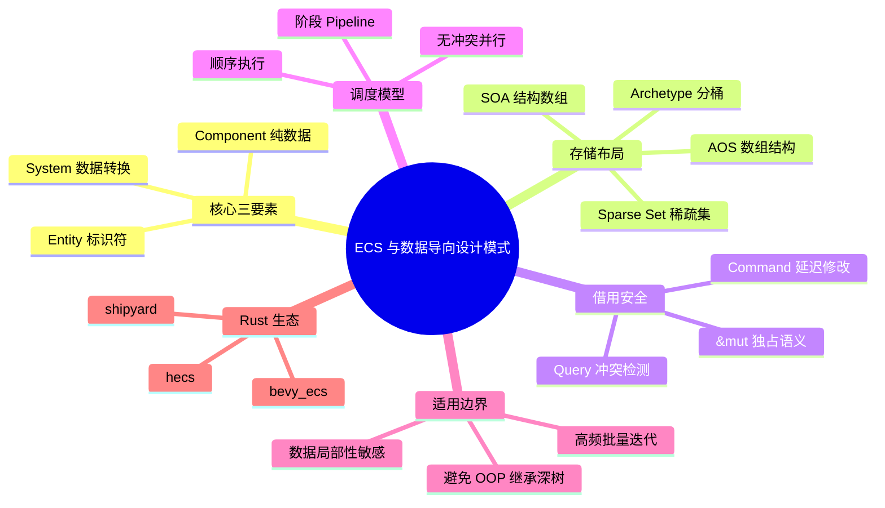
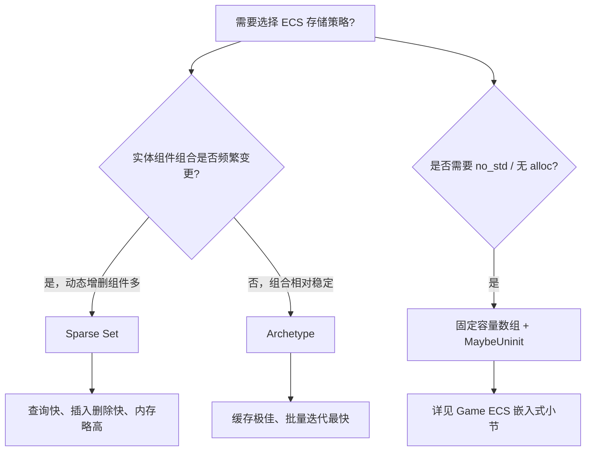
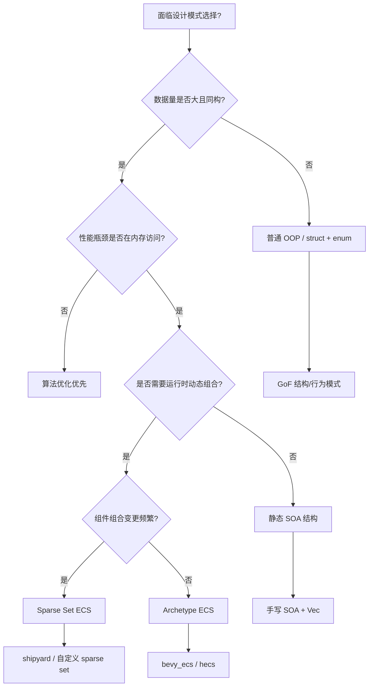

# ECS 与数据导向设计模式

**EN**: ECS and Data-Oriented Design Patterns in Rust
**Summary**: A design-pattern treatment of Entity-Component-System and data-oriented design in Rust, covering archetype vs sparse-set storage, borrow-checker-friendly scheduling, and when to prefer DOD over object-oriented composition.

> **Rust 版本**: 1.97.1+ (Edition 2024)
> **Bloom 层级**: L5-L6
> **权威来源**: 本文件为 `concept/` 权威页。
> **前置概念**: [Ownership](../../01_foundation/01_ownership_borrow_lifetime/01_ownership.md) · [Borrowing](../../01_foundation/01_ownership_borrow_lifetime/02_borrowing.md) · [Generics](../../02_intermediate/01_generics/01_generics.md) · [Traits](../../02_intermediate/00_traits/01_traits.md) · [Cache-Friendly and SIMD Algorithms](../16_algorithm_patterns/04_cache_friendly_and_simd_algorithms.md)
> **后置概念**: [Game ECS Architecture](../11_domain_applications/02_game_ecs.md) · [Performance Engineering Architecture](../10_performance/02_performance_engineering_architecture.md)
> **L5 对比**: [Rust vs C++](../../05_comparative/01_systems_languages/01_rust_vs_cpp.md)
> **主要来源**: [Rust Reference](https://doc.rust-lang.org/reference/introduction.html) · [Rust API Guidelines](https://rust-lang.github.io/api-guidelines/) · [Data-Oriented Design Book](https://www.dataorienteddesign.com/dodbook/) · [Bevy ECS Docs](https://docs.rs/bevy_ecs/latest/bevy_ecs/) · [hecs Documentation](https://docs.rs/hecs/latest/hecs/) · [Shipyard GitHub](https://github.com/leudz/shipyard) · [Wikipedia — Entity component system](https://en.wikipedia.org/wiki/Entity_component_system)

---

## 🧠 知识结构图



> **认知功能**: 本 mindmap 从「ECS 三要素 → 存储布局 → 借用安全 → 调度模型 → 适用边界 → 生态实现」六层展开，帮助读者建立「为什么 ECS 在 Rust 中不仅是游戏模式，而是可复用的数据导向设计模式」的整体认知。

---

## 一、权威定义

> **[Wikipedia — Entity component system](https://en.wikipedia.org/wiki/Entity_component_system)** Entity component system (ECS) is a software architectural pattern mostly used in video game development for the representation of game world objects. An ECS comprises entities composed from components of data, with systems which read and update component data.

> **[Data-Oriented Design Book](https://www.dataorienteddesign.com/dodbook/)** The purpose of all programs, and all parts of those programs, is to transform data from one form to another.

**数据导向设计（Data-Oriented Design, DOD）** 的核心主张是：程序的本质是数据转换，因此应根据**访问模式**组织内存，而不是根据对象层次或业务实体组织。ECS 是 DOD 在交互式/实时系统中最具代表性的实现形态之一。

在 Rust 中，ECS 与 DOD 具有独特的协同优势：

| 维度 | OOP 传统方案 | ECS/DOD 方案 | Rust 增益 |
|:---|:---|:---|:---|
| **组合方式** | 继承深树 + 虚函数 | Entity + Component 扁平组合 | 无隐式共享状态，组合在编译期验证 |
| **数据布局** | Array of Structs (AOS) | Structure of Arrays (SOA) / Archetype | `Iterator` + 泛型单态化实现零成本遍历 |
| **行为表达** | 方法绑定到对象 | System 作为纯函数作用于 Query | `&mut` / `&` 分区直接映射调度冲突 |
| **并发安全** | 手动锁 + 文档约定 | 无冲突 System 自动并行 | `Send` / `Sync` + 借用检查在编译期排除数据竞争 |

---

## 二、ECS 三要素的属性与关系

### 2.1 Entity：轻量标识符

Entity 不是对象，而是一个**代际索引**（generational index）或简单的整数句柄。其关键属性：

- **无行为**：Entity 本身不包含数据或方法。
- **可复用**：代际计数器检测已销毁 Entity 的误用（ABA 防御）。
- **低成本**：通常仅为 `u32` / `u64` 或 `{ index, generation }`。

### 2.2 Component：纯数据 POD

Component 是**无逻辑的数据包**，在 Rust 中通常用 `struct` 或零大小类型（ZST）标记组件表达。

```rust
#[derive(Clone, Copy, Debug)]
struct Position(f32, f32);

#[derive(Clone, Copy, Debug)]
struct Velocity(f32, f32);

#[derive(Clone, Copy, Debug)]
struct Health(u32);

// 零大小标记组件
#[derive(Clone, Copy, Debug)]
struct Player;
```

> **设计意图**: 将数据与行为分离，使组件存储布局完全由访问模式决定，而非由类层次决定。

### 2.3 System：数据转换函数

System 是**纯函数或近似纯函数**，通过 Query 声明自己读取/写入的组件类型。在 Rust 中，System 的合法性由借用检查器保证：

| Query 签名 | 调度语义 | Rust 借用对应 |
|:---|:---|:---|
| `Query<&T>` | 多个 System 可并行读取 | 共享不可变借用 `&T` |
| `Query<&mut T>` | 与任何 `&T` / `&mut T` 冲突 | 独占可变借用 `&mut T` |
| `Query<(&T, &U)>` | 与只读 `T`/`U` 的 System 并行 | 多个共享借用可共存 |
| `Query<(&mut T, &U)>` | 与写 `T` 的 System 冲突，与只读 `U` 的 System 可并行 | 同一作用域内 `&mut T` + `&U` 允许 |

---

## 三、Rust 标准库实现的极简 ECS

以下示例仅使用 Rust 标准库，展示 ECS 的核心模式：Entity、Component、System、World，以及 Rust 借用检查如何自然保证 System 调度安全。

```rust
use std::collections::HashMap;

/// 轻量级实体标识符
type Entity = u32;

/// Component: 纯数据结构
#[derive(Clone, Copy, Debug)]
struct Position { x: f32, y: f32 }

#[derive(Clone, Copy, Debug)]
struct Velocity { dx: f32, dy: f32 }

#[derive(Clone, Copy, Debug)]
struct Health { current: u32, max: u32 }

/// 标记组件（zero-sized type）
#[derive(Clone, Copy, Debug)]
struct Player;

/// World: 拥有所有组件存储
struct World {
    next_id: Entity,
    positions: HashMap<Entity, Position>,
    velocities: HashMap<Entity, Velocity>,
    healths: HashMap<Entity, Health>,
    players: HashMap<Entity, Player>,
}

impl World {
    fn new() -> Self {
        Self {
            next_id: 0,
            positions: HashMap::new(),
            velocities: HashMap::new(),
            healths: HashMap::new(),
            players: HashMap::new(),
        }
    }

    fn spawn(&mut self) -> Entity {
        let id = self.next_id;
        self.next_id += 1;
        id
    }

    fn insert_position(&mut self, e: Entity, p: Position) {
        self.positions.insert(e, p);
    }

    fn insert_velocity(&mut self, e: Entity, v: Velocity) {
        self.velocities.insert(e, v);
    }

    fn insert_health(&mut self, e: Entity, h: Health) {
        self.healths.insert(e, h);
    }

    fn insert_player(&mut self, e: Entity, p: Player) {
        self.players.insert(e, p);
    }

    /// System: 移动系统
    /// 读取 velocities，写入 positions
    fn movement_system(&mut self, dt: f32) {
        // 注意：&self.velocities 与 self.positions.get_mut 借用不同字段，可共存
        for (e, vel) in &self.velocities {
            if let Some(pos) = self.positions.get_mut(e) {
                pos.x += vel.dx * dt;
                pos.y += vel.dy * dt;
            }
        }
    }

    /// System: 持续伤害系统
    /// 只写入 healths
    fn damage_over_time_system(&mut self, amount: u32) {
        for health in self.healths.values_mut() {
            health.current = health.current.saturating_sub(amount);
        }
    }

    /// System: 渲染/状态打印
    /// 只读查询 Player + Position + Health
    fn render_system(&self) {
        println!("--- 当前世界状态 ---");
        for (e, pos) in &self.positions {
            let tag = if self.players.contains_key(e) { "[玩家]" } else { "[其他]" };
            let hp = self.healths.get(e)
                .map(|h| format!("{}/{}", h.current, h.max))
                .unwrap_or_else(|| "-".to_string());
            println!("  {} entity={}: pos=({:.1}, {:.1}), hp={}", tag, e, pos.x, pos.y, hp);
        }
    }
}

fn main() {
    let mut world = World::new();

    let player = world.spawn();
    world.insert_position(player, Position { x: 0.0, y: 0.0 });
    world.insert_velocity(player, Velocity { dx: 1.0, dy: 0.5 });
    world.insert_health(player, Health { current: 100, max: 100 });
    world.insert_player(player, Player);

    let enemy = world.spawn();
    world.insert_position(enemy, Position { x: 10.0, y: 5.0 });
    world.insert_velocity(enemy, Velocity { dx: -0.5, dy: 0.0 });
    world.insert_health(enemy, Health { current: 50, max: 50 });

    println!("初始状态:");
    world.render_system();

    // 模拟两帧
    for frame in 1..=2 {
        world.movement_system(1.0);
        world.damage_over_time_system(5);
        println!("\n第 {} 帧后:", frame);
        world.render_system();
    }
}
```

> **设计意图**: 该示例刻意不依赖外部 ECS crate，以展示 ECS 模式在 Rust 标准库中的**最小可编译表达**。`movement_system` 同时借用 `self.velocities`（不可变）和 `self.positions`（可变）的不同字段，Rust 借用检查器允许这种**不相交字段借用**，这正是 ECS 调度安全的语言级基础。

---

## 四、存储布局：Archetype vs Sparse Set

真实 ECS 引擎主要有两种存储策略，选型直接影响缓存行为、内存占用和动态修改组件的成本。

### 4.1 Archetype 存储（以 Bevy 为代表）

将具有**相同组件组合**的 Entity 放在同一张连续表中，表内按 SOA 布局存储各组件列。

| 特性 | 说明 |
|:---|:---|
| **缓存命中率** | 极高：同一 archetype 的实体完全连续 |
| **查询速度** | 快：只需遍历匹配的 archetype 表 |
| **添加/删除组件** | 较慢：需要跨 archetype 移动实体数据 |
| **内存碎片** | 低：批量分配与释放 |

### 4.2 Sparse Set 存储（以 shipyard 为代表）

每个组件类型维护一个 `dense` 数组（实际数据）和一个 `sparse` 数组（Entity → dense 索引映射）。

| 特性 | 说明 |
|:---|:---|
| **查询速度** | 极快：直接遍历 dense 数组 |
| **添加/删除组件** | 快：只需在 dense/sparse 中插入或交换移除 |
| **缓存命中率** | 高：dense 数组连续，但多组件联合查询需合并多个 dense 数组 |
| **内存占用** | 每个组件类型需要一个与最大 Entity ID 等长的 sparse 数组 |

### 4.3 选型对比



> **权威对齐**: Bevy 的 Archetype 设计参考了 [Data-Oriented Design Book](https://www.dataorienteddesign.com/dodbook/) 中「按访问模式组织数据」的原则；Sparse Set 的理论基础可追溯至 Briggs 与 Torczon 关于稀疏矩阵表示的工作。

---

## 五、反例与边界

### 5.1 反例：在查询期间扩容组件存储（E0502）

ECS 中常见反模式是在迭代组件时直接修改底层存储容量（如添加新实体）。以下示例展示了 Rust 借用检查器如何捕获这一错误，对应编译错误 **E0502**。

```rust,compile_fail,E0502
struct ComponentStore<T> {
    data: Vec<T>,
}

impl<T> ComponentStore<T> {
    fn first(&self) -> &T { &self.data[0] }
    fn push(&mut self, value: T) { self.data.push(value); }
}

struct World {
    positions: ComponentStore<f32>,
}

/// 反模式：在持有组件引用时扩容存储
fn buggy_query_and_spawn(world: &mut World) {
    let pos_ref = world.positions.first(); // 不可变借用开始
    world.positions.push(0.0);             // 错误：同时需要可变借用 -> E0502
    println!("first position: {}", pos_ref);
}

fn main() {
    let mut world = World {
        positions: ComponentStore { data: vec![1.0] },
    };
    buggy_query_and_spawn(&mut world);
}
```

**修正方案**：使用 **Command 模式** 将结构性变更延迟到阶段边界。

```rust
struct ComponentStore<T> {
    data: Vec<T>,
}

impl<T> ComponentStore<T> {
    fn first(&self) -> &T { &self.data[0] }
    fn push(&mut self, value: T) { self.data.push(value); }
    fn len(&self) -> usize { self.data.len() }
}

struct World {
    positions: ComponentStore<f32>,
}

enum Command {
    PushPosition(f32),
}

struct App {
    world: World,
    commands: Vec<Command>,
}

impl App {
    fn run_systems(&mut self) {
        // 阶段 1：只读查询，发出命令
        let first = self.world.positions.first();
        if *first > 0.0 {
            self.commands.push(Command::PushPosition(*first));
        }

        // 阶段 2：统一应用命令
        for cmd in self.commands.drain(..) {
            match cmd {
                Command::PushPosition(p) => self.world.positions.push(p),
            }
        }
    }
}

fn main() {
    let mut app = App {
        world: World {
            positions: ComponentStore { data: vec![1.0] },
        },
        commands: Vec::new(),
    };
    app.run_systems();
    assert_eq!(app.world.positions.len(), 2);
}
```

> **认知功能**: 此反例说明 ECS 中「迭代时修改 World 结构」必须通过命令队列延迟执行。Rust 的 E0502 在这里成为架构约束的编译期表达。

### 5.2 反例：把 ECS 当成「带标签的 OOP」

以下代码技术上能运行，但违反了 DOD 原则：System 中嵌入业务对象逻辑，组件包含方法，失去了缓存友好性。

```rust,ignore
// ❌ 反模式：组件包含方法，System 调用虚函数风格接口
trait GameObject {
    fn update(&mut self, dt: f32);
    fn render(&self);
}

struct WorldOop {
    objects: Vec<Box<dyn GameObject>>,
}

fn update_world(world: &mut WorldOop, dt: f32) {
    for obj in &mut world.objects {
        obj.update(dt); // 动态分发 + 缓存不友好
    }
}
```

**修正**：将数据与方法分离，System 操作纯数据 Component。

### 5.3 边界：ECS 不是银弹

| 场景 | 不推荐 ECS | 推荐替代 |
|:---|:---|:---|
| 少量（<100）异构对象 | 初始化与查询开销超过收益 | 普通 struct + Vec |
| 强层次关系（UI DOM、AST） | 父子关系需额外维护 | 树结构 + Arena |
| 单次脚本/配置对象 | 过度设计 | Plain struct / enum |
| 依赖运行时多态扩展 | ECS 组合静态 | Plugin / dyn Trait |

---

## 六、决策树：何时使用 ECS/DOD



> **认知功能**: 此决策树将 ECS/DOD 置于更广大的设计模式选择空间中。关键判读不是「ECS 是否流行」，而是「数据规模、访问局部性、动态组合需求」三个约束的交点。

---

## 七、与国际权威来源的对齐

### 7.1 Rust 官方与生态文档

| Rust 来源 | ECS/DOD 对应点 |
|:---|:---|
| [Rust Reference — Ownership](https://doc.rust-lang.org/reference/ownership.html) | `&T` / `&mut T` 的独占语义是 System 调度冲突检测的形式化基础 |
| [Rust API Guidelines](https://rust-lang.github.io/api-guidelines/) | 推荐零成本抽象；ECS 的 Query 迭代符合「不为未使用特性付费」原则 |
| [The Rust Programming Language — Smart Pointers](https://doc.rust-lang.org/book/ch15-00-smart-pointers.html) | `Rc<RefCell<T>>` + `Weak<T>` 模式在 Observer / 父子关系中打破循环引用 |
| [Bevy ECS Docs](https://docs.rs/bevy_ecs/latest/bevy_ecs/) | Archetype ECS 的工业级实现，展示 `Query` 与 `SystemSet` 的调度模型 |
| [hecs Documentation](https://docs.rs/hecs/latest/hecs/) | 最小化 Archetype ECS，验证 `no_std` 可行性 |

### 7.2 学术与理论来源

| 来源 | 核心观点 | 与 Rust ECS 的映射 |
|:---|:---|:---|
| Richard Fabian — *Data-Oriented Design* | 程序即数据转换；按访问模式组织内存 | ECS 的 Component/SOA 布局 |
| Hennessy & Patterson — *Computer Architecture: A Quantitative Approach* | 缓存局部性决定实际性能 | Archetype 连续存储降低 cache miss |
| Chen (1976) — *The Entity-Relationship Model* | Entity-Relationship 建模 | ECS 中 Entity-Component 关系的形式化前身 |
| Jung et al. — *RustBelt* (POPL 2018) | Rust 类型系统可形式化证明内存安全 | ECS 中 `&mut` 独占访问的安全保证可归约为 RustBelt 的语义 |

---

## 八、权威来源索引

- **P0 官方**: [The Rust Reference](https://doc.rust-lang.org/reference/introduction.html)
- **P0 官方**: [Rust API Guidelines](https://rust-lang.github.io/api-guidelines/)
- **P0 官方**: [The Rust Programming Language](https://doc.rust-lang.org/book/title-page.html)
- **P1 学术**: [Richard Fabian — Data-Oriented Design Book](https://www.dataorienteddesign.com/dodbook/)
- **P1 学术**: [Hennessy & Patterson — Computer Architecture: A Quantitative Approach](https://www.elsevier.com/books/computer-architecture/hennessy/978-0-12-811905-1)
- **P1 学术**: [Chen — The Entity-Relationship Model, ACM 1976](https://doi.org/10.1145/320434.320440)
- **P1 学术**: [Jung et al. — RustBelt: Securing the Foundations of Rust, POPL 2018](https://plv.mpi-sws.org/rustbelt/popl18/)
- **P2 生态**: [Bevy ECS Docs](https://docs.rs/bevy_ecs/latest/bevy_ecs/)
- **P2 生态**: [hecs Documentation](https://docs.rs/hecs/latest/hecs/)
- **P2 生态**: [Shipyard GitHub](https://github.com/leudz/shipyard)
- **P2 生态**: [Wikipedia — Entity component system](https://en.wikipedia.org/wiki/Entity_component_system)

---

## 九、相关概念导航

- 游戏引擎与渲染中的 ECS 深入实践：[Game ECS Architecture](../11_domain_applications/02_game_ecs.md)
- 缓存友好与 SIMD 优化：[Cache-Friendly and SIMD Algorithms](../16_algorithm_patterns/04_cache_friendly_and_simd_algorithms.md)
- 设计模式总览：[Design Patterns Overview](01_patterns.md)
- 模式选择最佳实践：[Pattern Selection Best Practices](10_pattern_selection_best_practices.md)

> **文档版本**: 1.0 ｜ **最后更新**: 2026-08-03 ｜ **状态**: ✅ 新建权威页
