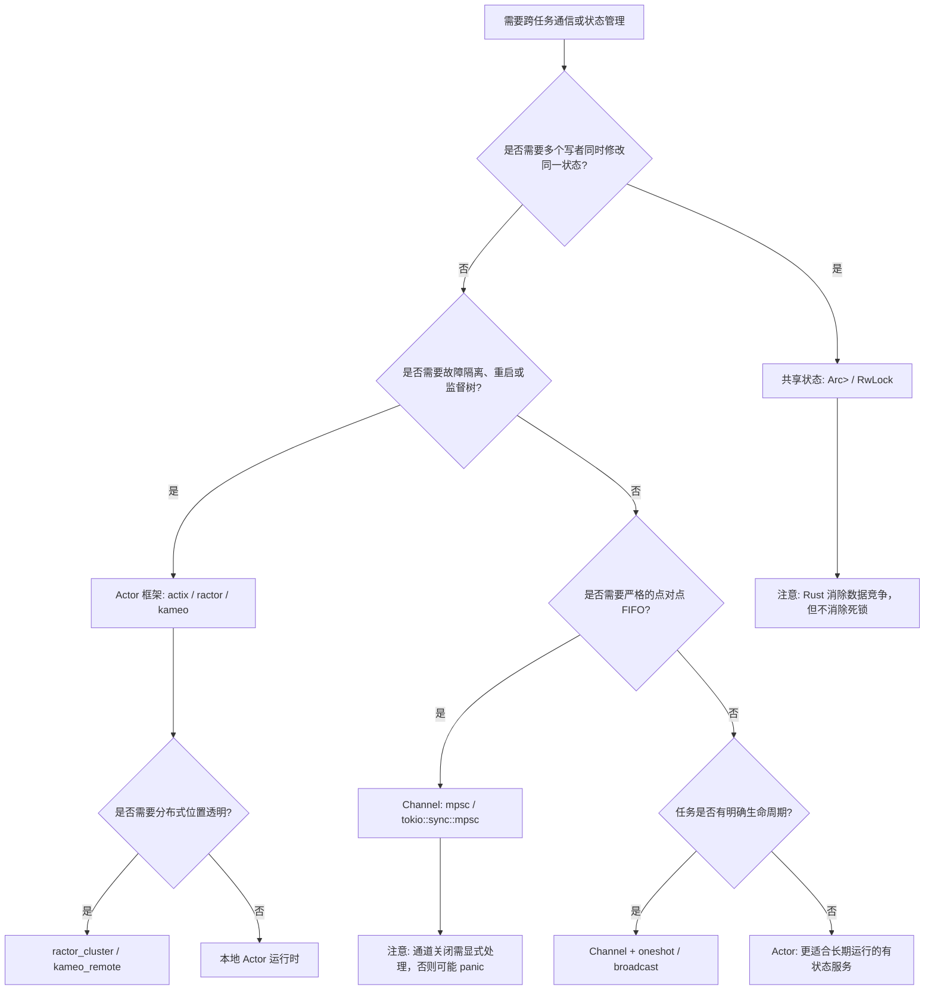
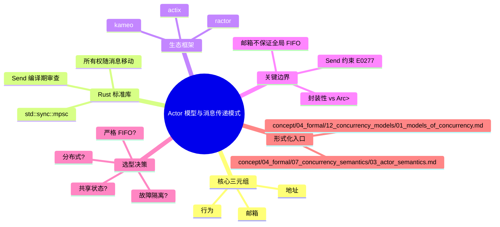

# Actor 模型与消息传递模式（Actor Model and Message Passing Patterns）

> **EN**: Actor Model and Message Passing Patterns in Rust
> **Summary**: Design-pattern treatment of the Actor model and message-passing idioms in Rust — covering std channels, actor-framework trade-offs, supervision boundaries, and when to prefer actors over shared-state concurrency.
> **Rust 版本**: 1.97.1+ (Edition 2024)
> **Bloom 层级**: L3-L6
> **权威来源**: 本文件为 `concept/` 权威页。
> **受众**: [进阶]
> **内容分级**: [专家级]
> **A/S/P 标记**: **S+A+P** — Structure + Application + Procedure
> **双维定位**: C×App — 应用 Actor 与消息传递模式解决并发与分布式设计问题
> **前置概念**:
> [并发模式](../../03_advanced/00_concurrency/03_concurrency_patterns.md) ·
> [Actor 形式语义](../../04_formal/07_concurrency_semantics/03_actor_semantics.md) ·
> [并发模型谱系](../../04_formal/12_concurrency_models/01_models_of_concurrency.md)
> **后置概念**:
> [微服务架构模式](05_microservice_patterns.md) ·
> [事件驱动架构](06_event_driven_architecture.md) ·
> [分布式系统](../04_web_and_networking/01_distributed_systems.md) ·
> [五模型定义矩阵](../../05_comparative/00_paradigms/04_five_models_definition_matrix.md) ·
> [P10-3 Actor canonical](../../05_comparative/05_idioms_patterns_architecture/04_architecture/04_actor.md)
>
> **来源**:
> [TRPL — Message Passing](https://doc.rust-lang.org/book/ch16-02-message-passing.html) ·
> [std::sync::mpsc](https://doc.rust-lang.org/std/sync/mpsc/index.html) ·
> [Rust API Guidelines](https://rust-lang.github.io/api-guidelines/) ·
> [actix](https://actix.rs/docs/actix/actor) ·
> [ractor](https://docs.rs/ractor/latest/ractor/) ·
> [kameo](https://docs.rs/kameo/latest/kameo/) ·
> [Hewitt, *Actor Model of Computation*, arXiv:1008.1459](https://arxiv.org/abs/1008.1459) ·
> [Agha, *Actors*, MIT Press 1986](https://mitpress.mit.edu/9780262010929/actors/)

---

## 📑 目录

- [Actor 模型与消息传递模式（Actor Model and Message Passing Patterns）](#actor-模型与消息传递模式actor-model-and-message-passing-patterns)
  - [📑 目录](#-目录)
  - [一、权威定义](#一权威定义)
  - [二、核心属性与关系](#二核心属性与关系)
    - [2.1 Actor 模型的关键属性](#21-actor-模型的关键属性)
    - [2.2 Channel 与 Actor 的关系](#22-channel-与-actor-的关系)
    - [2.3 与所有权系统的结合](#23-与所有权系统的结合)
  - [三、标准库实现：用 `std::sync::mpsc` 构造 Actor 形态](#三标准库实现用-stdsyncmpsc-构造-actor-形态)
  - [四、生态框架映射：actix / ractor / kameo](#四生态框架映射actix--ractor--kameo)
  - [五、反例与边界](#五反例与边界)
    - [反例：用 `Arc<Mutex<T>>` 假冒 Actor（模型语义违规）](#反例用-arcmutext-假冒-actor模型语义违规)
    - [边界测试：把 `Rc<T>` 当作消息穿越线程（E0277）](#边界测试把-rct-当作消息穿越线程e0277)
    - [边界：Actor 邮箱并不保证全局 FIFO](#边界actor-邮箱并不保证全局-fifo)
  - [六、决策树：何时选用 Actor / Channel / 共享状态](#六决策树何时选用-actor--channel--共享状态)
  - [七、与国际权威来源的对齐](#七与国际权威来源的对齐)
  - [八、相关概念](#八相关概念)
  - [权威来源索引](#权威来源索引)
  - [🧠 知识结构图（Mindmap）](#-知识结构图mindmap)

---

## 一、权威定义

**Actor 模型**（Hewitt, Bishop & Steiger, IJCAI 1973）把并发计算的基本单位定义为三元组：

```text
actor = ⟨地址, 邮箱, 行为⟩
```

- **地址（Address）**：actor 的全局唯一标识，也是向它发送消息的唯一能力；
- **邮箱（Mailbox）**：到达消息的缓冲队列，模型层不承诺顺序；
- **行为（Behavior）**：处理当前消息并决定下一行为的函数，处理期间**串行、不可中断**。

Hewitt 公理限定了 actor 处理消息时只能做三件事：向已知地址**发送**（send）、**创建**新 actor、**替换**自身行为（become）。

**消息传递模式**是更宽泛的工程族：进程/任务不共享可变状态，通过发送不可变（或可移动）消息通信。Rust 标准库的 `std::sync::mpsc` 与 `tokio::sync::mpsc` 属于 **channel 风格**的消息传递；`actix`/`ractor`/`kameo` 则属于 **Actor 风格**的消息传递。二者核心差异不在"异步发送"，而在**寻址抽象**与**故障模型**（见 §2 与 §6 决策树）。

> **判定依据**：一个设计是不是 Actor 模型，不看它是否用了 `spawn` 或 `send`，而看它是否满足"状态只能由 actor 自己修改"与"地址即能力"两条封装规则。任何让多个执行单元直接共享可变状态的实现，即使加了 `Mutex`，也已退化为共享内存并发。

---

## 二、核心属性与关系

### 2.1 Actor 模型的关键属性

| 属性 | 含义 | Rust 中的落点 |
|:---|:---|:---|
| **封装性** | 状态只由 actor 自身修改 | 所有权（Ownership）+ `Send` 约束；消息类型由 trait/enum 静态校验 |
| **地址即能力** | 没有地址就不能发送 | `Addr<A>` / `ActorRef<M>` / `Sender<T>` 等句柄类型 |
| **位置透明性** | 本地/远程发送语法一致 | `ractor_cluster`、`kameo_remote` 提供的分布式扩展 |
| **监督树** | 失败通过层级监督传播 | `ractor` 的 `spawn_linked`；`actix` 的 `Supervisor` |
| **无共享状态** | actor 之间不直接共享可变内存 | 编译期由 `Send`/`Sync` + 借用检查器强制 |

### 2.2 Channel 与 Actor 的关系

| 维度 | Channel（`mpsc` / `tokio::sync::mpsc`） | Actor（`actix` / `ractor` / `kameo`） |
|:---|:---|:---|
| 寻址单位 | 通道端点（`Sender<T>` / `Receiver<T>`） | 命名 actor（地址/引用） |
| 进程身份 | 发送者/接收者匿名 | actor 有身份、可监督、可链接 |
| 消息顺序 | 单通道 FIFO（mpsc 契约） | 模型层不保证；实现多为单 actor 串行处理 |
| 故障模型 | 通道关闭即错误传播 | 监督树 + 重启策略 |
| 典型开销 | 低，适合流水线 | 较高，适合有状态服务与容错边界 |

### 2.3 与所有权系统的结合

Rust 的所有权规则天然支持消息传递：

```text
值随消息移动  →  发送后原线程不能再访问  →  无数据竞争
&mut 独占     →  actor 内部一次处理一条消息  →  邮箱串行化等价于单线程状态机
Send 约束     →  跨 actor/线程 的消息类型在编译期被审查
```

> **认知功能**：在 Rust 中，Actor 与消息传递不是"库级技巧"，而是**所有权语义在并发维度的自然延伸**。

---

## 三、标准库实现：用 `std::sync::mpsc` 构造 Actor 形态

下面的示例仅用 Rust 标准库实现一个"类 Actor"的计数器：一个线程持有私有状态，主线程通过 `mpsc` 通道发送消息驱动状态变更。它满足 Actor 的核心属性——**状态不被共享，只通过消息异步修改**。

```rust
use std::sync::mpsc;
use std::thread;

// 消息枚举：actor 能处理的全部消息类型
enum CounterMsg {
    Increment,
    Get(mpsc::Sender<i64>),
}

// actor 行为函数：持有私有状态，循环处理邮箱消息
fn counter_actor(rx: mpsc::Receiver<CounterMsg>) {
    let mut state = 0i64;
    while let Ok(msg) = rx.recv() {
        match msg {
            CounterMsg::Increment => state += 1,
            // send 公理：向已知地址（reply 通道）发送结果
            CounterMsg::Get(reply) => { let _ = reply.send(state); }
        }
    }
    // 通道关闭、recv 返回 Err，actor 自然终止
}

fn main() {
    // create：创建 actor（地址 tx 与邮箱 rx）
    let (tx, rx) = mpsc::channel::<CounterMsg>();
    let handle = thread::spawn(move || counter_actor(rx));

    // send：向 actor 发送 5 条增量消息
    for _ in 0..5 { tx.send(CounterMsg::Increment).unwrap(); }

    // 请求-响应：把返回地址嵌入消息
    let (reply_tx, reply_rx) = mpsc::channel::<i64>();
    tx.send(CounterMsg::Get(reply_tx)).unwrap();
    println!("count = {}", reply_rx.recv().unwrap());

    // 关闭地址，优雅终止 actor
    drop(tx);
    handle.join().unwrap();
}
```

> **关键点**：
>
> 1. `state` 完全私有于 `counter_actor` 线程，外部无法直接访问；
> 2. 消息枚举 `CounterMsg` 让 Rust 在编译期验证"只处理这两种消息"；
> 3. `reply_tx` 把"返回地址"作为消息的一部分传递，与 π 演算的"名字传递"同构。

---

## 四、生态框架映射：actix / ractor / kameo

Rust 没有语言级 actor，但生态在类型系统内重建了 Actor 语义。下表给出工程选型时的核心差异：

| 维度 | actix | ractor | kameo |
|:---|:---|:---|:---|
| 定位 | 成熟、生态最大（actix-web 基础） | Erlang OTP 语义忠实移植 | 轻量、async 原生 |
| 地址类型 | `Addr<A>` / `Recipient<M>` | `ActorRef<M>` | `ActorRef<A>` |
| 消息契约 | `Message` trait + `Handler<M>` | 单消息 enum + `Actor::handle` | `Message<M>` trait |
| 邮箱背压 | 有界/无界可选 | 有界（默认） | 有界 |
| 监督 | `Supervisor` | 完整监督树 + 重启策略 | 内建监督 + linking |
| 分布式 | 无内建 | `ractor_cluster` | `kameo_remote` |

下面的 `rust,ignore` 代码展示 ractor 风格的三要素映射（API 细节以对应 crate 文档为准）：

```rust,ignore
use ractor::{Actor, ActorProcessingErr, ActorRef};

struct Counter;                        // actor 本体
enum CounterMsg {                      // 单消息枚举 → 穷尽匹配
    Increment,
    Get(ActorRef<i64>),                // 把回复地址装进消息
}

#[ractor::async_trait]
impl Actor for Counter {
    type Msg = CounterMsg;
    type State = i64;
    type Arguments = ();

    // init：监督重启时状态重置为此处返回值
    async fn pre_start(&self, _: ActorRef<Self::Msg>, _: ())
        -> Result<Self::State, ActorProcessingErr> { Ok(0) }

    // 行为函数：一次处理一条消息 → 邮箱串行化
    async fn handle(&self, _: ActorRef<Self::Msg>, msg: Self::Msg, state: &mut Self::State)
        -> Result<(), ActorProcessingErr> {
        match msg {
            CounterMsg::Increment => *state += 1,
            CounterMsg::Get(reply) => { reply.send_message(*state)?; }
        }
        Ok(())
    }
}
```

> **Rust 类型系统带来的增量保证**：
>
> 1. 消息类型错配在**编译期**捕获，而非运行时 mailbox 错配；
> 2. `Send` 约束保证跨 actor 传递的消息不含非线程安全引用；
> 3. `enum` + `match` 的穷尽性检查防止"漏处理某类消息"。

---

## 五、反例与边界

### 反例：用 `Arc<Mutex<T>>` 假冒 Actor（模型语义违规）

下面这段代码**不是 Actor 模型**，而是用共享内存模拟的"伪 actor"：

```rust
use std::sync::{Arc, Mutex};
use std::thread;

struct FakeActor {
    state: Arc<Mutex<i64>>,
}

fn main() {
    let state = Arc::new(Mutex::new(0));
    let a = FakeActor { state: Arc::clone(&state) };
    let b = FakeActor { state: Arc::clone(&state) };

    thread::spawn(move || { *a.state.lock().unwrap() += 1; });
    thread::spawn(move || { *b.state.lock().unwrap() += 1; });
}
```

**判定依据**：两个"actor"直接共享可变状态，违反了 Actor 模型的**封装边界**与**地址即能力**。这退化为共享内存并发，丢失了故障隔离、位置透明性与"邮箱串行化"带来的可推理性。

### 边界测试：把 `Rc<T>` 当作消息穿越线程（E0277）

Actor 与消息传递模式要求跨边界消息必须 `Send`。下面尝试把非 `Send` 的 `Rc<i32>` 放入消息并送往另一线程，编译器会拒绝：

```rust,compile_fail,E0277
use std::sync::mpsc;
use std::rc::Rc;
use std::thread;

enum Msg { Data(Rc<i32>) }

fn main() {
    let (tx, _rx) = mpsc::channel::<Msg>();
    let data = Rc::new(42);

    thread::spawn(move || {
        // error[E0277]: `Rc<i32>` cannot be sent between threads safely
        tx.send(Msg::Data(data)).unwrap();
    });
}
```

**修复方向**：把 `Rc<T>` 替换为 `Arc<T>`，或让消息只包含原始类型与 `Send` 类型。该检查在 Actor 框架中同样生效——`actix::Message` 的实现会自动要求 `Send`。

### 边界：Actor 邮箱并不保证全局 FIFO

```text
误区："同一个 actor 的邮箱按发送顺序处理消息"
正确理解：
  - 模型层：Agha 1986 配置中的 μ 是消息多重集，不承诺顺序；
  - 实现层：多数 Rust Actor 框架对单发送者到单接收者保证 FIFO，
            但多发送者交错顺序未定义；
  - 设计层：若业务依赖全局顺序，应在消息中嵌入版本号/因果关系
            （如 Lamport 时间戳或 vector clock），而不能依赖邮箱隐序。
```

---

## 六、决策树：何时选用 Actor / Channel / 共享状态



**决策规则摘要**：

1. **先问共享**：若多个任务必须并发写同一状态，channel/actor 都会引入序列化开销，此时 `Mutex`/`RwLock` 更直接；
2. **再问故障**：若崩溃隔离、重启策略、 supervision tree 是需求，actor 是首选；
3. **再问拓扑**：若通信关系静态、任务为流水线阶段，channel 更简单；若通信关系动态演化、存在请求-响应与重入，actor 更合适；
4. **最后看生态**：标准库 `mpsc` 适合无依赖原型；生产级 actor 系统按 Erlang 忠实度选 `ractor`，按 web 生态成熟度选 `actix`，按现代 async  ergonomics 选 `kameo`。

---

## 七、与国际权威来源的对齐

| 来源层级 | 来源 | 本页对齐点 |
|:---|:---|:---|
| **P0 官方** | [TRPL — Message Passing](https://doc.rust-lang.org/book/ch16-02-message-passing.html) | `std::sync::mpsc` 的所有权转移语义、channel 关闭行为 |
| **P0 官方** | [std::sync::mpsc](https://doc.rust-lang.org/std/sync/mpsc/index.html) | `Sender<T>`/`Receiver<T>` API、错误类型、多生产者单消费者契约 |
| **P0 官方** | [Rust API Guidelines](https://rust-lang.github.io/api-guidelines/) | 消息类型应实现 `Send`；错误类型应 `std::error::Error` |
| **P1 学术** | [Hewitt, Bishop & Steiger, IJCAI 1973](https://www.ijcai.org/Proceedings/73/Papers/027B.pdf) | Actor 三元组与 send/create/become 公理 |
| **P1 学术** | [Agha, *Actors*, MIT Press 1986](https://mitpress.mit.edu/9780262010929/actors/) | 配置语义、消息多重集、公平性假设 |
| **P1 学术** | [Erlang/OTP Design Principles — Supervision Trees](https://www.erlang.org/doc/system/design_principles.html#supervision-trees) | 监督树形状即失败传播图、let-it-crash 哲学 |
| **P2 生态** | [actix 文档](https://actix.rs/docs/actix/actor) | `Handler<M>` / `Message` trait、有界/无界邮箱、Supervisor |
| **P2 生态** | [ractor 文档](https://docs.rs/ractor/latest/ractor/) | Erlang 语义忠实映射、监督树、ractor_cluster 分布式 |
| **P2 生态** | [kameo 文档](https://docs.rs/kameo/latest/kameo/) | async 原生 API、linking、远程扩展 |

> **对齐说明**：本页是 **ecosystem design-pattern 视角**的权威页，重在工程选型、标准库实现与框架映射。Actor 模型的**形式化语义**（Hewitt 公理、Agha 配置转换、OTP 监督树形式化）已在 [`concept/04_formal/07_concurrency_semantics/03_actor_semantics.md`](../../04_formal/07_concurrency_semantics/03_actor_semantics.md) 中作为唯一深度解释；本页通过前置/后置链接与其保持 canonical 引用关系，避免重复推导。

---

## 八、相关概念

- [并发模式](../../03_advanced/00_concurrency/03_concurrency_patterns.md)：Rust 并发高级模式总览
- [Actor 形式语义](../../04_formal/07_concurrency_semantics/03_actor_semantics.md)：Hewitt 公理、Agha 配置、监督树形式化
- [并发模型谱系](../../04_formal/12_concurrency_models/01_models_of_concurrency.md)：CSP / Actor / π 演算 / Petri 网的形式分类
- [五模型定义矩阵](../../05_comparative/00_paradigms/04_five_models_definition_matrix.md)：共享内存、CSP、Actor、π、Petri 网的五维对比
- [微服务架构模式](05_microservice_patterns.md)：Actor 在分布式服务边界中的应用
- [事件驱动架构](06_event_driven_architecture.md)：消息传递与事件总线的工程结合
- [分布式系统](../04_web_and_networking/01_distributed_systems.md)：位置透明性、部分失败与共识

---

## 权威来源索引

- P0（官方）：[TRPL — Message Passing](https://doc.rust-lang.org/book/ch16-02-message-passing.html) · [std::sync::mpsc](https://doc.rust-lang.org/std/sync/mpsc/index.html) · [Rust API Guidelines](https://rust-lang.github.io/api-guidelines/)
- P1（学术）：[Hewitt, Bishop & Steiger, IJCAI 1973](https://www.ijcai.org/Proceedings/73/Papers/027B.pdf) · [Hewitt, arXiv:1008.1459](https://arxiv.org/abs/1008.1459) · [Agha, *Actors*, MIT Press 1986](https://mitpress.mit.edu/9780262010929/actors/) · [Erlang/OTP Supervision Trees](https://www.erlang.org/doc/system/design_principles.html#supervision-trees)
- P2（生态）：[actix](https://actix.rs/docs/actix/actor) · [ractor](https://docs.rs/ractor/latest/ractor/) · [kameo](https://docs.rs/kameo/latest/kameo/)

---

## 🧠 知识结构图（Mindmap）


