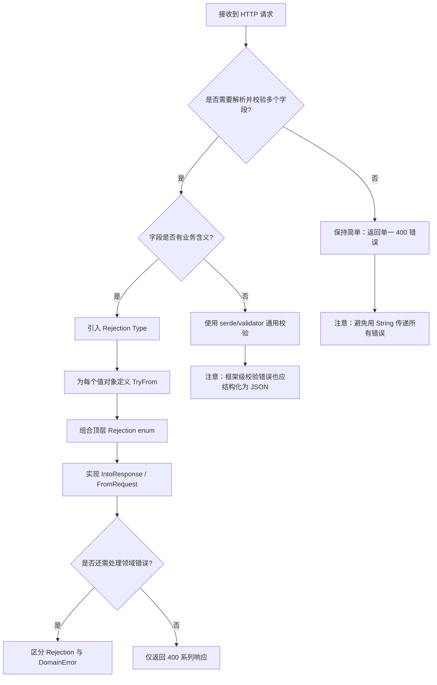
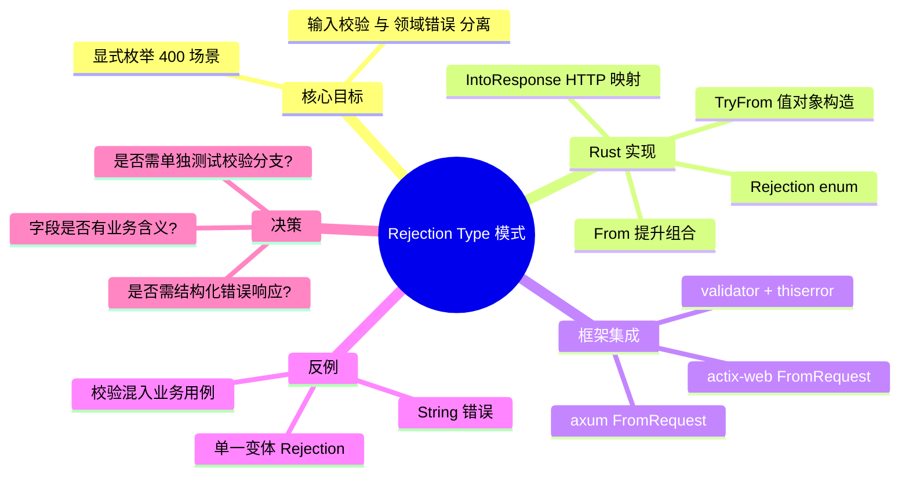

> **内容分级**: [进阶级]

# Rejection Type 模式（Rejection Type Pattern）

**EN**: Rejection Type Pattern
**Summary**: Domain-driven validation pattern that uses explicit rejection types to separate invalid input from core domain errors in Rust web services.

> **Rust 版本**: 1.97.0+ (Edition 2024)
> **Bloom 层级**: L2-L3
> **权威来源**: 本文件为 `concept/` 权威页。
> **定位**: 将输入校验、请求解析与领域错误显式分离，通过类型化的 Rejection 提升 Rust Web 服务的可测试性与错误可读性。
> **A/S/P 标记**: **S+A+P** — Structure + Application + Procedure
> **前置概念**:
> [Error Handling Basics](../../01_foundation/08_error_handling/01_error_handling_basics.md) ·
> [Intermediate Error Handling](../../02_intermediate/03_error_handling/01_error_handling.md) ·
> [Type Conversions](../../02_intermediate/04_types_and_conversions/07_type_conversions.md) ·
> [Serde Patterns](../../02_intermediate/00_traits/03_serde_patterns.md)
> **后置概念**:
> [Hexagonal / Ports & Adapters](25_hexagonal_ports_and_adapters.md) ·
> [DDD Tactical Patterns](../14_enterprise_architecture/04_domain_driven_design_in_rust.md) ·
> [API Design and SemVer Idioms](39_api_design_and_semver_idioms.md) ·
> [Rust vs Ada/SPARK](../../05_comparative/01_systems_languages/07_rust_vs_ada_spark.md)
>
> **来源**:
> [Zero To Production in Rust](https://www.zero2prod.com/) ·
> [validator crate docs](https://docs.rs/validator/latest/validator/) ·
> [axum extractors docs](https://docs.rs/axum/latest/axum/extract/index.html)

---

## 📑 目录

- [Rejection Type 模式（Rejection Type Pattern）](#rejection-type-模式rejection-type-pattern)
  - [📑 目录](#-目录)
  - [一、权威定义](#一权威定义)
  - [二、核心属性与关系](#二核心属性与关系)
    - [2.1 输入校验 vs 领域错误](#21-输入校验-vs-领域错误)
    - [2.2 显式 Rejection 类型的收益](#22-显式-rejection-类型的收益)
    - [2.3 Rejection 的组合关系](#23-rejection-的组合关系)
  - [三、Rust 实现](#三rust-实现)
    - [3.1 领域值对象与显式 Rejection 枚举](#31-领域值对象与显式-rejection-枚举)
    - [3.2 `TryFrom` / `From` 映射](#32-tryfrom--from-映射)
    - [3.3 与 axum Extractor 集成](#33-与-axum-extractor-集成)
    - [3.4 Rejection 的组合](#34-rejection-的组合)
    - [3.5 单元测试](#35-单元测试)
  - [四、关系](#四关系)
  - [五、反例与边界](#五反例与边界)
    - [反例：用 `String` 传递所有错误](#反例用-string-传递所有错误)
    - [反例：把校验逻辑混进业务用例](#反例把校验逻辑混进业务用例)
    - [边界：所有失败都坍缩到同一个 Rejection 变体](#边界所有失败都坍缩到同一个-rejection-变体)
  - [六、决策树：何时以及如何引入 Rejection Type](#六决策树何时以及如何引入-rejection-type)
  - [七、权威来源索引](#七权威来源索引)
  - [🧠 知识结构图（Mindmap）](#-知识结构图mindmap)

---

## 一、权威定义

**Rejection Type 模式**是一种领域驱动（Domain-Driven）的请求校验模式：在 Web 服务的入口层，把"请求格式非法/输入值非法"与"领域操作失败"区分为两种不同性质的错误，并分别为前者定义显式的 **Rejection 类型**。

> **核心主张**（来自 *Zero To Production in Rust*）：HTTP 层的请求解析与输入校验失败应尽早、显式地返回 400 系列响应；这些失败不应与数据库冲突、下游超时等"领域/基础设施错误"共用同一套错误类型，否则会导致错误处理分支混乱、测试难以定位问题。

在该模式中：

- **Rejection**：输入层错误（缺字段、格式非法、超出范围），通常映射为 `400 Bad Request`；
- **Domain Error**：领域规则或基础设施错误（订阅已存在、邮件服务不可用），通常映射为 `409 Conflict` / `500 Internal Server Error` / 业务状态码；
- **值对象（Value Object）**：通过 `TryFrom` 从原始输入构造，构造失败即产生 Rejection。

---

## 二、核心属性与关系

### 2.1 输入校验 vs 领域错误

| 维度 | 输入校验 / Rejection | 领域错误 / Domain Error |
|:---|:---|:---|
| **发生位置** | HTTP 入口、Extractor、请求 DTO | 应用服务、领域模型、仓库 |
| **错误原因** | 字段缺失、格式非法、长度超限 | 业务规则冲突、外部依赖失败 |
| **HTTP 映射** | `400 Bad Request` | `409` / `422` / `500` 等 |
| **是否可重试** | 否，必须修正请求 | 视情况而定 |
| **Rust 表达** | 显式 `Rejection` enum + `TryFrom` | `Result<T, DomainError>` |

### 2.2 显式 Rejection 类型的收益

1. **编译期穷尽性**：`match` 分支必须覆盖所有 Rejection 变体，避免漏处理；
2. **错误响应稳定**：同一 Rejection 变体始终对应同一 HTTP 状态与结构化响应；
3. **测试聚焦**：可以单独对值对象构造与 Rejection 转换写单元测试，无需启动 HTTP 服务器；
4. **领域纯净**：领域函数只接收已校验的值对象，不再关心字符串 trim、email 正则等细节。

### 2.3 Rejection 的组合关系

```text
Raw Request (String)
        │
        ▼
[Parser / Extractor] ──► ParseRejection
        │
        ▼
[Value Object via TryFrom] ──► ValidationRejection
        │
        ▼
[Application Service] ──► DomainError
        │
        ▼
   HTTP Response
```

- **ParseRejection** 与 **ValidationRejection** 可以合并为一个顶层 `SubscribeRejection`；
- 顶层 Rejection 通过 `From<ParseRejection>` / `From<ValidationRejection>` 自动转换；
- 最终通过框架的 `IntoResponse` 映射为 HTTP 响应。

---

## 三、Rust 实现

### 3.1 领域值对象与显式 Rejection 枚举

下面的例子模拟 *Zero To Production* 中的 newsletter 订阅端点，仅用标准库展示 Rejection Type 的核心结构。

```rust
use std::fmt;

/// 已校验的订阅请求（核心领域值对象）
#[derive(Debug, Clone, PartialEq)]
pub struct SubscribeRequest {
    pub email: SubscriberEmail,
    pub name: SubscriberName,
}

#[derive(Debug, Clone, PartialEq)]
pub struct SubscriberEmail(String);

#[derive(Debug, Clone, PartialEq)]
pub struct SubscriberName(String);

/// 输入层 Rejection：所有导致 400 的失败都被显式枚举
#[derive(Debug, Clone, PartialEq)]
pub enum SubscribeRejection {
    MissingEmail,
    InvalidEmail { raw: String, reason: String },
    MissingName,
    InvalidName { raw: String, reason: String },
}

impl fmt::Display for SubscribeRejection {
    fn fmt(&self, f: &mut fmt::Formatter<'_>) -> fmt::Result {
        match self {
            Self::MissingEmail => write!(f, "email is required"),
            Self::InvalidEmail { raw, reason } => {
                write!(f, "'{}' is not a valid email: {}", raw, reason)
            }
            Self::MissingName => write!(f, "name is required"),
            Self::InvalidName { raw, reason } => {
                write!(f, "'{}' is not a valid name: {}", raw, reason)
            }
        }
    }
}

impl std::error::Error for SubscribeRejection {}
```

### 3.2 `TryFrom` / `From` 映射

通过 `TryFrom` 把原始输入转换为值对象，失败时直接产出显式 Rejection。

```rust
# use std::fmt;
# #[derive(Debug, Clone, PartialEq)] pub struct SubscriberEmail(String);
# #[derive(Debug, Clone, PartialEq)] pub struct SubscriberName(String);
# #[derive(Debug, Clone, PartialEq)] pub enum SubscribeRejection {
#     MissingEmail,
#     InvalidEmail { raw: String, reason: String },
#     MissingName,
#     InvalidName { raw: String, reason: String },
# }
# impl fmt::Display for SubscribeRejection { fn fmt(&self, f: &mut fmt::Formatter<'_>) -> fmt::Result { write!(f, "{:?}", self) } }
# impl std::error::Error for SubscribeRejection {}

#[derive(Debug, Default)]
pub struct RawSubscribeRequest {
    pub email: Option<String>,
    pub name: Option<String>,
}

impl TryFrom<RawSubscribeRequest> for SubscribeRequest {
    type Error = SubscribeRejection;

    fn try_from(raw: RawSubscribeRequest) -> Result<Self, Self::Error> {
        let email_raw = raw.email.ok_or(SubscribeRejection::MissingEmail)?;
        let email = SubscriberEmail::try_from(email_raw)?;

        let name_raw = raw.name.ok_or(SubscribeRejection::MissingName)?;
        let name = SubscriberName::try_from(name_raw)?;

        Ok(SubscribeRequest { email, name })
    }
}

impl TryFrom<String> for SubscriberEmail {
    type Error = SubscribeRejection;

    fn try_from(raw: String) -> Result<Self, Self::Error> {
        let trimmed = raw.trim();
        if trimmed.is_empty() {
            return Err(SubscribeRejection::InvalidEmail {
                raw,
                reason: "email is empty".into(),
            });
        }
        if !trimmed.contains('@') || trimmed.split('@').count() != 2 {
            return Err(SubscribeRejection::InvalidEmail {
                raw,
                reason: "missing a single '@'".into(),
            });
        }
        Ok(SubscriberEmail(trimmed.to_lowercase()))
    }
}

impl TryFrom<String> for SubscriberName {
    type Error = SubscribeRejection;

    fn try_from(raw: String) -> Result<Self, Self::Error> {
        let trimmed = raw.trim();
        if trimmed.is_empty() {
            return Err(SubscribeRejection::InvalidName {
                raw,
                reason: "name is empty".into(),
            });
        }
        if trimmed.len() > 256 {
            return Err(SubscribeRejection::InvalidName {
                raw,
                reason: "name exceeds 256 characters".into(),
            });
        }
        Ok(SubscriberName(trimmed.to_string()))
    }
}

# #[derive(Debug, Clone, PartialEq)] pub struct SubscribeRequest { pub email: SubscriberEmail, pub name: SubscriberName }
```

> **要点**：`TryFrom` 把"原始字符串 → 领域值对象"的转换与失败原因绑定在类型上；调用方通过 `?` 自动向上传播具体 Rejection。

### 3.3 与 axum Extractor 集成

在真实 Web 服务中，Rejection Type 通常与 `axum::extract::FromRequest` 或 `actix-web::FromRequest` 结合。下面的片段依赖 `axum` 与 `validator`，仅作集成示意。

```rust,ignore
use axum::{
    extract::FromRequest,
    http::{Request, StatusCode},
    response::{IntoResponse, Response},
};
use serde::Deserialize;
use validator::Validate;

#[derive(Debug, Deserialize, Validate)]
pub struct SubscribeForm {
    #[validate(email(message = "invalid email"))]
    pub email: String,
    #[validate(length(min = 1, max = 256, message = "name length invalid"))]
    pub name: String,
}

#[derive(Debug)]
pub enum SubscribeRejection {
    Parse(String),
    Validation(validator::ValidationErrors),
}

impl IntoResponse for SubscribeRejection {
    fn into_response(self) -> Response {
        let (status, message) = match self {
            Self::Parse(e) => (StatusCode::BAD_REQUEST, format!("parse error: {}", e)),
            Self::Validation(e) => (StatusCode::BAD_REQUEST, format!("validation error: {}", e)),
        };
        (status, message).into_response()
    }
}

impl<S> FromRequest<S> for SubscribeForm
where
    S: Send + Sync,
{
    type Rejection = SubscribeRejection;

    async fn from_request(req: Request<axum::body::Body>, state: &S)
        -> Result<Self, Self::Rejection>
    {
        let form = axum::extract::Form::<SubscribeForm>::from_request(req, state)
            .await
            .map_err(|e| SubscribeRejection::Parse(e.to_string()))?;
        form.validate()
            .map_err(SubscribeRejection::Validation)?;
        Ok(form.0)
    }
}
```

> **与 `thiserror` 结合**：上面的 `SubscribeRejection` 可进一步用 `thiserror::Error` 派生 `Display`，减少手写 `fmt::Display` 的样板。

### 3.4 Rejection 的组合

当端点需要组合多个值对象时，Rejection 也应支持组合。下面的模式展示如何把多个子 Rejection 汇总到一个顶层类型。

```rust
# use std::fmt;
# #[derive(Debug, Clone, PartialEq)] pub struct SubscriberEmail(String);
# #[derive(Debug, Clone, PartialEq)] pub struct SubscriberName(String);
# #[derive(Debug, Clone, PartialEq)] pub struct SubscribeRequest { pub email: SubscriberEmail, pub name: SubscriberName }
# #[derive(Debug, Clone, PartialEq)] pub enum SubscribeRejection { MissingEmail, InvalidEmail { raw: String, reason: String }, MissingName, InvalidName { raw: String, reason: String } }
# impl fmt::Display for SubscribeRejection { fn fmt(&self, f: &mut fmt::Formatter<'_>) -> fmt::Result { write!(f, "{:?}", self) } }
# impl std::error::Error for SubscribeRejection {}

#[derive(Debug, Clone, PartialEq)]
pub enum NewsletterRejection {
    Subscribe(SubscribeRejection),
    // 可扩展：Unsubscribe(UnsubscribeRejection), Login(LoginRejection), ...
}

impl From<SubscribeRejection> for NewsletterRejection {
    fn from(r: SubscribeRejection) -> Self {
        NewsletterRejection::Subscribe(r)
    }
}

impl fmt::Display for NewsletterRejection {
    fn fmt(&self, f: &mut fmt::Formatter<'_>) -> fmt::Result {
        match self {
            Self::Subscribe(r) => write!(f, "subscribe error: {}", r),
        }
    }
}

impl std::error::Error for NewsletterRejection {}

// 使用 ? 时，SubscribeRejection 自动提升为 NewsletterRejection
fn build_newsletter_request(raw: RawSubscribeRequest) -> Result<SubscribeRequest, NewsletterRejection> {
    Ok(SubscribeRequest::try_from(raw)?)
}

# #[derive(Debug, Default)] pub struct RawSubscribeRequest { pub email: Option<String>, pub name: Option<String> }
# impl TryFrom<RawSubscribeRequest> for SubscribeRequest { type Error = SubscribeRejection; fn try_from(raw: RawSubscribeRequest) -> Result<Self, Self::Error> { let email_raw = raw.email.ok_or(SubscribeRejection::MissingEmail)?; let email = SubscriberEmail::try_from(email_raw)?; let name_raw = raw.name.ok_or(SubscribeRejection::MissingName)?; let name = SubscriberName::try_from(name_raw)?; Ok(SubscribeRequest { email, name }) } }
# impl TryFrom<String> for SubscriberEmail { type Error = SubscribeRejection; fn try_from(raw: String) -> Result<Self, Self::Error> { let trimmed = raw.trim(); if trimmed.is_empty() { return Err(SubscribeRejection::InvalidEmail { raw, reason: "email is empty".into() }); } if !trimmed.contains('@') || trimmed.split('@').count() != 2 { return Err(SubscribeRejection::InvalidEmail { raw, reason: "missing a single '@'".into() }); } Ok(SubscriberEmail(trimmed.to_lowercase())) } }
# impl TryFrom<String> for SubscriberName { type Error = SubscribeRejection; fn try_from(raw: String) -> Result<Self, Self::Error> { let trimmed = raw.trim(); if trimmed.is_empty() { return Err(SubscribeRejection::InvalidName { raw, reason: "name is empty".into() }); } if trimmed.len() > 256 { return Err(SubscribeRejection::InvalidName { raw, reason: "name exceeds 256 characters".into() }); } Ok(SubscriberName(trimmed.to_string())) } }

fn main() {
    let raw = RawSubscribeRequest {
        email: Some("charlie@example.com".into()),
        name: Some("Charlie".into()),
    };
    let _ = build_newsletter_request(raw);
}
```

### 3.5 单元测试

显式 Rejection 让单元测试可以直接断言失败分支，无需经过 HTTP 层。

```rust
# use std::fmt;
# #[derive(Debug, Clone, PartialEq)] pub struct SubscriberEmail(String);
# #[derive(Debug, Clone, PartialEq)] pub struct SubscriberName(String);
# #[derive(Debug, Clone, PartialEq)] pub struct SubscribeRequest { pub email: SubscriberEmail, pub name: SubscriberName }
# #[derive(Debug, Clone, PartialEq)] pub enum SubscribeRejection { MissingEmail, InvalidEmail { raw: String, reason: String }, MissingName, InvalidName { raw: String, reason: String } }
# impl fmt::Display for SubscribeRejection { fn fmt(&self, f: &mut fmt::Formatter<'_>) -> fmt::Result { write!(f, "{:?}", self) } }
# impl std::error::Error for SubscribeRejection {}
# #[derive(Debug, Default)] pub struct RawSubscribeRequest { pub email: Option<String>, pub name: Option<String> }
# impl TryFrom<RawSubscribeRequest> for SubscribeRequest { type Error = SubscribeRejection; fn try_from(raw: RawSubscribeRequest) -> Result<Self, Self::Error> { let email_raw = raw.email.ok_or(SubscribeRejection::MissingEmail)?; let email = SubscriberEmail::try_from(email_raw)?; let name_raw = raw.name.ok_or(SubscribeRejection::MissingName)?; let name = SubscriberName::try_from(name_raw)?; Ok(SubscribeRequest { email, name }) } }
# impl TryFrom<String> for SubscriberEmail { type Error = SubscribeRejection; fn try_from(raw: String) -> Result<Self, Self::Error> { let trimmed = raw.trim(); if trimmed.is_empty() { return Err(SubscribeRejection::InvalidEmail { raw, reason: "email is empty".into() }); } if !trimmed.contains('@') || trimmed.split('@').count() != 2 { return Err(SubscribeRejection::InvalidEmail { raw, reason: "missing a single '@'".into() }); } Ok(SubscriberEmail(trimmed.to_lowercase())) } }
# impl TryFrom<String> for SubscriberName { type Error = SubscribeRejection; fn try_from(raw: String) -> Result<Self, Self::Error> { let trimmed = raw.trim(); if trimmed.is_empty() { return Err(SubscribeRejection::InvalidName { raw, reason: "name is empty".into() }); } if trimmed.len() > 256 { return Err(SubscribeRejection::InvalidName { raw, reason: "name exceeds 256 characters".into() }); } Ok(SubscriberName(trimmed.to_string())) } }

fn main() {
    // 成功路径
    let valid = RawSubscribeRequest {
        email: Some("Alice@Example.COM".into()),
        name: Some("  Alice  ".into()),
    };
    let req = SubscribeRequest::try_from(valid).unwrap();
    assert_eq!(req.email.0, "alice@example.com");
    assert_eq!(req.name.0, "Alice");

    // 失败路径：email 非法
    let bad_email = RawSubscribeRequest {
        email: Some("not-an-email".into()),
        name: Some("Bob".into()),
    };
    match SubscribeRequest::try_from(bad_email) {
        Err(SubscribeRejection::InvalidEmail { raw, .. }) => assert_eq!(raw, "not-an-email"),
        other => panic!("expected InvalidEmail, got {:?}", other),
    }

    // 失败路径：缺少 name
    let missing_name = RawSubscribeRequest {
        email: Some("bob@example.com".into()),
        name: None,
    };
    assert!(matches!(
        SubscribeRequest::try_from(missing_name),
        Err(SubscribeRejection::MissingName)
    ));
}
```

---

## 四、关系

- **Rejection Type ↔ `TryFrom` / `From`**：`TryFrom` 负责"原始值 → 值对象"的拒绝语义；`From` 负责子 Rejection 向顶层 Rejection 的提升。
- **Rejection Type ↔ Hexagonal 架构**：Rejection 属于"输入适配器"层；值对象一旦构造成功，进入领域核心时就不再携带 HTTP 细节。
- **Rejection Type ↔ Error Handling**：Rejection 是 Error 的一个子集，专门用于"输入不可接受"这一早期失败。
- **Rejection Type ↔ API Design**：显式 Rejection 让 API 的错误响应形态在编译期即可穷尽枚举，便于生成 OpenAPI 错误 schema。

---

## 五、反例与边界

### 反例：用 `String` 传递所有错误

```rust,ignore
// ❌ 错误：所有失败都用 String，调用方无法区分缺少字段与格式非法
pub fn parse_subscribe(req: &RawSubscribeRequest) -> Result<SubscribeRequest, String> {
    if req.email.is_none() {
        return Err("bad request".into());
    }
    // ...
}
```

**问题**：

1. 调用方只能做字符串匹配，极易因文案调整而失效；
2. 无法通过 `match` 穷尽所有失败分支；
3. HTTP 映射只能统一返回 `400`，难以给出结构化错误体。

**修正**：定义显式 `enum SubscribeRejection { ... }`，每个变体附带结构化字段。

### 反例：把校验逻辑混进业务用例

```rust,ignore
// ❌ 错误：应用服务里仍检查字符串格式
pub async fn subscribe(req: RawSubscribeRequest, pool: PgPool) -> Result<(), String> {
    if !req.email.as_deref().unwrap_or("").contains('@') {
        return Err("invalid email".into());
    }
    // 插入数据库...
}
```

**问题**：业务用例同时承担"输入校验"与"领域操作"两个职责；测试数据库逻辑时仍须构造非法输入。

**修正**：在 Extractor / 控制器层先完成 `TryFrom` 转换，应用服务只接收 `SubscribeRequest` 值对象。

### 边界：所有失败都坍缩到同一个 Rejection 变体

```rust,ignore
// ⚠️ 边界：虽然用了 enum，但只有一个变体
pub enum SubscribeRejection {
    Invalid(String),
}
```

**判定**：这仍然等价于 `String` 错误。Rejection Type 的价值在于**变体级别的语义区分**。只有当变体数量足以覆盖调用方需要分别处理的失败场景时，才值得引入该模式。

---

## 六、决策树：何时以及如何引入 Rejection Type



**决策规则摘要**：

1. **字段有业务含义**（email、用户名、订单 ID 等）时，优先构造值对象 + Rejection；
2. **仅格式校验**（JSON 字段存在、类型正确）时，可复用 serde/validator 的通用错误；
3. **Rejection 只处理 400 场景**；数据库冲突、下游超时等应使用独立的 DomainError；
4. **测试优先**：为每个 Rejection 变体编写单元测试，再写集成测试。

---

## 七、权威来源索引

- P2（生态 / 书籍）：[*Zero To Production in Rust*](https://www.zero2prod.com/) —— newsletter 订阅端点的 Rejection Type 实践
- P2（生态）：[validator crate docs](https://docs.rs/validator/latest/validator/) —— 声明式输入校验
- P2（生态）：[axum extractors docs](https://docs.rs/axum/latest/axum/extract/index.html) —— `FromRequest`、`IntoResponse` 集成
- P2（生态）：[thiserror crate docs](https://docs.rs/thiserror/latest/thiserror/) —— 减少错误类型样板
- P0（官方）：[TRPL — Error Handling](https://doc.rust-lang.org/book/ch09-00-error-handling.html) —— `Result`、`?`、`Error` trait
- P0（官方）：[std::convert::TryFrom](https://doc.rust-lang.org/std/convert/trait.TryFrom.html) —— 失败型转换

> **文档版本**: 1.0 ｜ **最后更新**: 2026-08-03 ｜ **状态**: ✅ 新建权威页

---

## 🧠 知识结构图（Mindmap）


