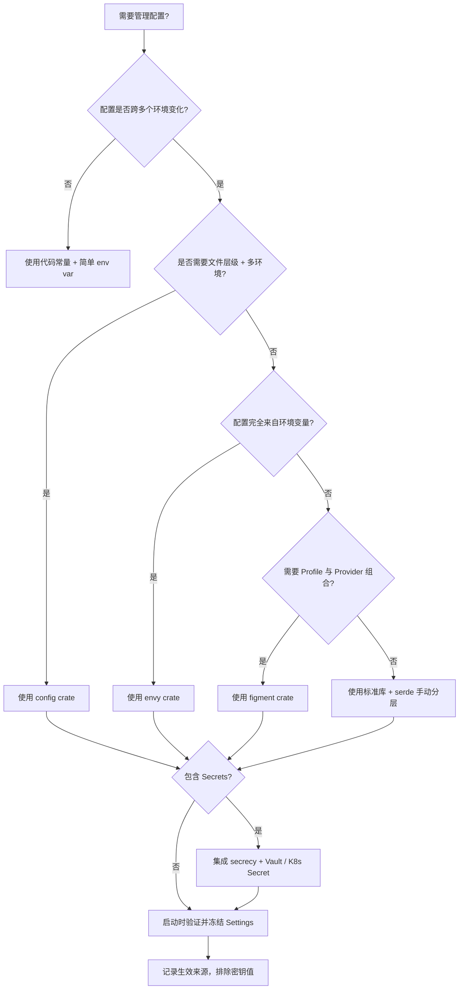
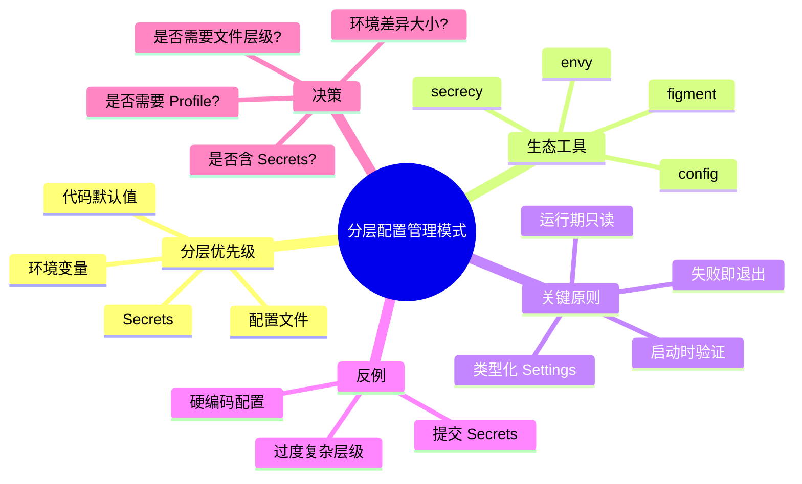

> **内容分级**: [进阶级]

# 分层配置管理模式（Layered Configuration Management Patterns）

**EN**: Layered Configuration Management Patterns
**Summary**: Patterns for layering default, file, environment, and secret configuration sources in Rust services using `config`, `figment`, and `envy`.

> **Rust 版本**: 1.97.0+ (Edition 2024)
> **Bloom 层级**: L2-L3
> **权威来源**: 本文件为 `concept/` 权威页。
> **定位**: 将"默认值 → 配置文件 → 环境变量 → 密钥"的分层加载与验证模式系统化，帮助 Rust 服务在 12-Factor 原则下安全、可测试地管理配置。
> **A/S/P 标记**: **S+A+P** — Structure + Application + Procedure
> **前置概念**:
> [Serde Patterns](../../02_intermediate/00_traits/03_serde_patterns.md) ·
> [Error Handling Basics](../../01_foundation/08_error_handling/01_error_handling_basics.md) ·
> [API Design and SemVer Idioms](39_api_design_and_semver_idioms.md) ·
> [Hexagonal / Ports & Adapters](25_hexagonal_ports_and_adapters.md)
> **后置概念**:
> [Clean Architecture](../14_enterprise_architecture/06_clean_architecture_in_rust.md) ·
> [Observability and SRE Patterns](../14_enterprise_architecture/09_observability_and_sre_patterns.md) ·
> [Microservice Patterns](05_microservice_patterns.md) ·
> [Rust vs Ada/SPARK](../../05_comparative/01_systems_languages/07_rust_vs_ada_spark.md)
>
> **来源**:
> [config crate docs](https://docs.rs/config/latest/config/) ·
> [figment crate docs](https://docs.rs/figment/latest/figment/) ·
> [envy crate docs](https://docs.rs/envy/latest/envy/) ·
> [Zero To Production in Rust](https://www.zero2prod.com/)

---

## 📑 目录

- [分层配置管理模式（Layered Configuration Management Patterns）](#分层配置管理模式layered-configuration-management-patterns)
  - [📑 目录](#-目录)
  - [一、权威定义](#一权威定义)
  - [二、核心属性与关系](#二核心属性与关系)
    - [2.1 分层优先级模型](#21-分层优先级模型)
    - [2.2 配置来源分类](#22-配置来源分类)
    - [2.3 运行时验证原则](#23-运行时验证原则)
  - [三、Rust 实现](#三rust-实现)
    - [3.1 可编译的最小分层配置（标准库版）](#31-可编译的最小分层配置标准库版)
    - [3.2 使用 `config` crate 加载分层配置](#32-使用-config-crate-加载分层配置)
    - [3.3 使用 `figment` 的多 Provider 与 Profile](#33-使用-figment-的多-provider-与-profile)
    - [3.4 使用 `envy` 映射环境变量](#34-使用-envy-映射环境变量)
    - [3.5 启动时验证与 Secrets 管理](#35-启动时验证与-secrets-管理)
    - [3.6 临时配置测试](#36-临时配置测试)
  - [四、关系](#四关系)
  - [五、反例与边界](#五反例与边界)
    - [反例：硬编码配置](#反例硬编码配置)
    - [反例：提交 Secrets 到版本控制](#反例提交-secrets-到版本控制)
    - [边界：过度复杂的优先级层级](#边界过度复杂的优先级层级)
  - [六、决策树：选择配置管理方案](#六决策树选择配置管理方案)
  - [七、权威来源索引](#七权威来源索引)
  - [🧠 知识结构图（Mindmap）](#-知识结构图mindmap)

---

## 一、权威定义

**分层配置管理模式**规定：Rust 服务的配置应由多个来源按明确优先级叠加而成，并在启动时完成反序列化、交叉验证与敏感信息隔离，最终形成一个不可变的、类型化的 `Settings` 结构体。

> **核心主张**（来自 *Zero To Production in Rust*）：配置不应散落在代码常量中，而应通过"默认值 → 配置文件 → 环境变量 → 密钥"的层级加载；越早加载的值优先级越低，越晚加载的值可以覆盖前者。这样可以在开发、测试、生产环境之间使用同一套代码，而不同环境只需替换外层配置。

在该模式中：

- **默认值（Default）**：代码内嵌的安全兜底，通常对应开发环境；
- **配置文件（File）**：`config/default.toml`、`config/production.yaml` 等按环境区分的静态配置；
- **环境变量（Environment Variables）**：12-Factor App 推荐的外部化方式，适合容器化部署；
- **Secrets（密钥）**：数据库密码、API Key 等，应来自 Vault、Sealed Secrets、运行时注入文件或环境变量，但**不得进入版本控制**。

---

## 二、核心属性与关系

### 2.1 分层优先级模型

```text
┌─────────────────────────────────────┐
│  Layer 4: Secrets / Vault / Runtime │  ← 最高优先级，敏感信息
├─────────────────────────────────────┤
│  Layer 3: Environment Variables     │  ← 部署时覆盖
├─────────────────────────────────────┤
│  Layer 2: Environment-specific File │  ← config/production.toml
├─────────────────────────────────────┤
│  Layer 1: Default File              │  ← config/default.toml
├─────────────────────────────────────┤
│  Layer 0: Hard-coded Defaults       │  ← 代码内嵌兜底
└─────────────────────────────────────┘
```

**覆盖规则**：高层值覆盖低层值；同层内后加载覆盖先加载（取决于具体 crate 的 merge 策略）。

### 2.2 配置来源分类

| 来源 | 适用场景 | Rust 生态工具 | 安全注意 |
|:---|:---|:---|:---|
| **代码默认值** | 开发兜底、可公开的端口/超时 | `Default` trait | 不要放密钥 |
| **配置文件** | 非敏感的静态环境差异 | `config` / `figment` | 不要提交含密钥的文件 |
| **环境变量** | 容器/K8s 部署、CI/CD | `config::Environment` / `envy` | 注意日志泄露 |
| **密钥管理器** | 数据库密码、TLS 证书 | `vault` / `secrecy` / 运行时卷 | 最小权限、轮换、不落地 |

### 2.3 运行时验证原则

1. **Fail Fast**：配置非法应在服务启动时立即 panic/exit，而不是在第一次请求时才发现；
2. **类型化**：使用 `serde` 将配置反序列化为强类型结构体，避免运行时字符串解析；
3. **不可变性**：配置加载完成后应视为只读，运行时不允许被修改；
4. **可审计**：记录实际生效的配置来源（不包含密钥值），便于排查环境差异。

---

## 三、Rust 实现

### 3.1 可编译的最小分层配置（标准库版）

下面的示例不依赖任何外部 crate，仅使用标准库展示"默认值 → 文件（模拟）→ 环境变量"的分层覆盖思想。

```rust
use std::collections::HashMap;
use std::env;

#[derive(Debug, PartialEq)]
pub struct AppConfig {
    pub port: u16,
    pub database_url: String,
    pub log_level: String,
}

impl AppConfig {
    /// Layer 0：代码内嵌默认值
    fn default() -> Self {
        Self {
            port: 8080,
            database_url: "postgres://localhost/app".to_string(),
            log_level: "info".to_string(),
        }
    }

    /// Layer 1：配置文件覆盖（用 HashMap 模拟从文件读取的键值对）
    fn with_file_overrides(base: Self, file: &HashMap<String, String>) -> Self {
        Self {
            port: file
                .get("PORT")
                .and_then(|s| s.parse().ok())
                .unwrap_or(base.port),
            database_url: file
                .get("DATABASE_URL")
                .cloned()
                .unwrap_or(base.database_url),
            log_level: file
                .get("LOG_LEVEL")
                .cloned()
                .unwrap_or(base.log_level),
        }
    }

    /// Layer 2：环境变量覆盖
    fn with_env_overrides(base: Self) -> Self {
        Self {
            port: env::var("PORT")
                .ok()
                .and_then(|s| s.parse().ok())
                .unwrap_or(base.port),
            database_url: env::var("DATABASE_URL").unwrap_or(base.database_url),
            log_level: env::var("LOG_LEVEL").unwrap_or(base.log_level),
        }
    }

    /// 启动时验证：端口不能为 0，数据库 URL 必须非空
    fn validate(&self) -> Result<(), ConfigError> {
        if self.port == 0 {
            return Err(ConfigError::InvalidPort(self.port));
        }
        if self.database_url.is_empty() {
            return Err(ConfigError::MissingDatabaseUrl);
        }
        Ok(())
    }
}

#[derive(Debug, PartialEq)]
pub enum ConfigError {
    InvalidPort(u16),
    MissingDatabaseUrl,
}

fn main() {
    // 模拟从 config/default.toml 读取
    let mut file = HashMap::new();
    file.insert("LOG_LEVEL".to_string(), "debug".to_string());

    let cfg = AppConfig::default();
    let cfg = AppConfig::with_file_overrides(cfg, &file);
    let cfg = AppConfig::with_env_overrides(cfg);

    cfg.validate().expect("invalid configuration");

    println!("port = {}", cfg.port);
    println!("database_url = {}", cfg.database_url);
    println!("log_level = {}", cfg.log_level);
}
```

> **要点**：标准库版本揭示了分层的本质——逐层 `unwrap_or(base.xxx)`。真实项目中，`config` / `figment` 用更声明式的 API 完成同样的事。

### 3.2 使用 `config` crate 加载分层配置

`config` crate 是 Rust 中最常用的分层配置库，支持 TOML、YAML、JSON、环境变量等多种来源。

```rust,ignore
use config::{Config, ConfigError, Environment, File};
use serde::Deserialize;

#[derive(Debug, Deserialize)]
pub struct Settings {
    pub database: DatabaseSettings,
    pub application: ApplicationSettings,
}

#[derive(Debug, Deserialize)]
pub struct DatabaseSettings {
    pub host: String,
    pub port: u16,
    pub username: String,
    pub password: String,
    pub name: String,
}

#[derive(Debug, Deserialize)]
pub struct ApplicationSettings {
    pub port: u16,
    pub host: String,
}

impl DatabaseSettings {
    pub fn connection_string(&self) -> String {
        format!(
            "postgres://{}:{}@{}:{}/{}",
            self.username, self.password, self.host, self.port, self.name
        )
    }
}

impl Settings {
    pub fn new() -> Result<Self, ConfigError> {
        let base_path = std::env::current_dir()
            .expect("failed to determine current directory");
        let config_dir = base_path.join("configuration");

        // 通过 APP_ENVIRONMENT 切换环境，默认 development
        let environment: String = std::env::var("APP_ENVIRONMENT")
            .unwrap_or_else(|_| "development".into());

        let settings = Config::builder()
            .add_source(File::from(config_dir.join("base")))
            .add_source(File::from(config_dir.join(&environment)).required(false))
            .add_source(
                Environment::with_prefix("APP")
                    .prefix_separator("_")
                    .separator("__"),
            )
            .build()?;

        settings.try_deserialize()
    }
}
```

> **环境变量约定**：`APP_APPLICATION__PORT=4000` 会映射到 `Settings.application.port`。

### 3.3 使用 `figment` 的多 Provider 与 Profile

`figment` 提供了更细粒度的 Provider 组合与 Profile 机制，常用于 Rocket 等框架。

```rust,ignore
use figment::{
    Figment,
    providers::{Env, Format, Toml},
};
use serde::Deserialize;

#[derive(Debug, Deserialize)]
pub struct DatabaseConfig {
    pub url: String,
    pub max_connections: u32,
}

#[derive(Debug, Deserialize)]
pub struct AppConfig {
    pub port: u16,
    pub database: DatabaseConfig,
}

impl AppConfig {
    pub fn load(profile: &str) -> Result<Self, figment::Error> {
        Figment::new()
            .merge(Toml::file("config/default.toml"))
            .merge(Toml::file(format!("config/{}.toml", profile)).nested())
            .merge(Env::prefixed("APP_").split("__"))
            .select(profile)
            .extract()
    }
}
```

> **Profile 语义**：`default` profile 与 `production` profile 共享同一 schema，但具体值不同；测试时可直接 `AppConfig::load("test")`。

### 3.4 使用 `envy` 映射环境变量

当配置完全来自环境变量、不需要文件层级时，`envy` 是最轻量的选择。

```rust,ignore
use serde::Deserialize;

#[derive(Debug, Deserialize)]
pub struct Config {
    pub port: u16,
    pub database_url: String,
    #[serde(default = "default_log_level")]
    pub log_level: String,
}

fn default_log_level() -> String {
    "info".to_string()
}

impl Config {
    pub fn from_env() -> Result<Self, envy::Error> {
        envy::prefixed("APP_").from_env()
    }
}
```

> **适用场景**：Serverless、Sidecar、短期任务等文件系统不可写或无需文件的环境。

### 3.5 启动时验证与 Secrets 管理

配置加载后应进行跨字段验证，并把 Secrets 包装在专门的类型中以避免意外日志打印。

```rust,ignore
use secrecy::{ExposeSecret, SecretString};
use serde::Deserialize;

#[derive(Debug, Deserialize, Clone)]
pub struct DatabaseSettings {
    pub host: String,
    pub port: u16,
    pub username: String,
    pub password: SecretString,
    pub name: String,
}

impl DatabaseSettings {
    pub fn connection_string(&self) -> SecretString {
        SecretString::from(format!(
            "postgres://{}:{}@{}:{}/{}",
            self.username,
            self.password.expose_secret(),
            self.host,
            self.port,
            self.name
        ))
    }

    pub fn validate(&self) -> Result<(), String> {
        if self.port == 0 {
            return Err("database port cannot be 0".into());
        }
        if self.password.expose_secret().is_empty() {
            return Err("database password must not be empty".into());
        }
        Ok(())
    }
}
```

> **Secrets 最佳实践**：
>
> 1. 使用 `secrecy::SecretString` 包装密钥，阻止 `Debug` 泄露；
> 2. 生产环境从 Vault、AWS Secrets Manager、K8s Secret 卷注入；
> 3. 本地开发使用 `.env` 文件，并确保 `.env` 在 `.gitignore` 中。

### 3.6 临时配置测试

分层配置使得测试可以只覆盖必要的层。下面的例子展示如何在测试中构造一个临时配置，而不依赖真实文件或环境变量。

```rust
# use std::collections::HashMap;
# #[derive(Debug, PartialEq)] pub struct AppConfig { pub port: u16, pub database_url: String, pub log_level: String }
# impl AppConfig { fn default() -> Self { Self { port: 8080, database_url: "postgres://localhost/app".to_string(), log_level: "info".to_string() } } fn with_file_overrides(base: Self, file: &HashMap<String, String>) -> Self { Self { port: file.get("PORT").and_then(|s| s.parse().ok()).unwrap_or(base.port), database_url: file.get("DATABASE_URL").cloned().unwrap_or(base.database_url), log_level: file.get("LOG_LEVEL").cloned().unwrap_or(base.log_level) } } fn with_env_overrides(base: Self) -> Self { base } fn validate(&self) -> Result<(), &'static str> { if self.port == 0 { return Err("invalid port"); } if self.database_url.is_empty() { return Err("missing database url"); } Ok(()) } }

fn build_test_config() -> AppConfig {
    let mut file = HashMap::new();
    file.insert("PORT".to_string(), "0".to_string()); // 故意设为 0 测试验证
    file.insert("DATABASE_URL".to_string(), "postgres://test/db".to_string());

    let cfg = AppConfig::default();
    let cfg = AppConfig::with_file_overrides(cfg, &file);
    AppConfig::with_env_overrides(cfg)
}

fn main() {
    let cfg = build_test_config();
    assert_eq!(cfg.port, 0);
    assert!(cfg.validate().is_err());

    let mut file = HashMap::new();
    file.insert("PORT".to_string(), "9000".to_string());
    file.insert("DATABASE_URL".to_string(), "postgres://test/db".to_string());
    let cfg = AppConfig::default();
    let cfg = AppConfig::with_file_overrides(cfg, &file);
    assert!(cfg.validate().is_ok());

    println!("configuration validation tests passed");
}
```

---

## 四、关系

- **Layered Config ↔ 12-Factor App**：配置外部化是 12-Factor 的第三条原则；分层模式是其在 Rust 中的类型化实现。
- **Layered Config ↔ Hexagonal / Clean Architecture**：配置加载属于"框架与驱动层"，领域代码只消费 `Settings` 值对象，不感知来源。
- **Layered Config ↔ Secrets Management**：Secrets 是最高优先级的配置来源，但需额外的加密、访问控制与审计机制。
- **Layered Config ↔ Error Handling**：启动时验证失败通常通过 panic / exit 处理，因为服务无法在配置非法时继续运行。

---

## 五、反例与边界

### 反例：硬编码配置

```rust,ignore
// ❌ 错误：把环境相关值写死在代码里
const DATABASE_URL: &str = "postgres://prod-db.internal/app";
const PORT: u16 = 80;

fn main() {
    // 本地开发、测试、生产都只能用同一套值
}
```

**问题**：

1. 同一套代码无法在不同环境运行；
2. 修改端口或数据库地址需要重新编译；
3. 密钥硬编码会带来严重安全风险。

**修正**：将可配置项抽到 `Settings` 结构体中，通过默认值、文件、环境变量分层加载。

### 反例：提交 Secrets 到版本控制

```text
# ❌ 错误：config/production.toml 里出现真实密码
[database]
password = "super-secret-123"
```

**问题**：密码一旦进入 Git 历史就无法真正删除；任何有仓库访问权限的人都能看到。

**修正**：

1. 配置文件只放非敏感值；
2. 密码通过 `DATABASE_URL` 环境变量或 Vault 注入；
3. 使用 `secrecy` 等 crate 防止日志泄露；
4. 把 `config/production.toml` 与 `.env` 加入 `.gitignore`。

### 边界：过度复杂的优先级层级

```text
⚠️ 边界：超过 4-5 层的配置来源
  代码默认值 → 全局文件 → 环境文件 → 本地文件 → 环境变量 → CLI 参数 → Secrets → ...
```

**判定**：层级过多会导致"到底哪个值生效"难以排查。一般推荐 **4 层**：默认值、环境文件、环境变量、Secrets。CLI 参数可视场景加入，但需有明确的 `--dump-config` 或日志输出来源信息。

---

## 六、决策树：选择配置管理方案



**决策规则摘要**：

1. **环境差异小** → 标准库或 `envy`；
2. **多环境文件 + 环境变量** → `config`；
3. **需要 Profile 切换 + 自定义 Provider** → `figment`；
4. **任何包含 Secrets 的方案** → 必须配合 `secrecy` 与外部密钥管理器；
5. **所有方案** → 启动时验证、失败即退出、运行期只读。

---

## 七、权威来源索引

- P2（生态 / 书籍）：[*Zero To Production in Rust*](https://www.zero2prod.com/) —— 分层配置与数据库设置加载实践
- P2（生态）：[config crate docs](https://docs.rs/config/latest/config/) —— TOML/YAML/JSON/环境变量分层加载
- P2（生态）：[figment crate docs](https://docs.rs/figment/latest/figment/) —— Profile 与 Provider 组合
- P2（生态）：[envy crate docs](https://docs.rs/envy/latest/envy/) —— 环境变量到 serde 结构体映射
- P2（生态）：[secrecy crate docs](https://docs.rs/secrecy/latest/secrecy/) —— 防止 Secrets 在日志中泄露
- P1（工程实践）：[The Twelve-Factor App — Config](https://12factor.net/config) —— 配置外部化原则
- P0（官方）：[serde docs](https://serde.rs/) —— 配置反序列化基础

> **文档版本**: 1.0 ｜ **最后更新**: 2026-08-03 ｜ **状态**: ✅ 新建权威页

---

## 🧠 知识结构图（Mindmap）


