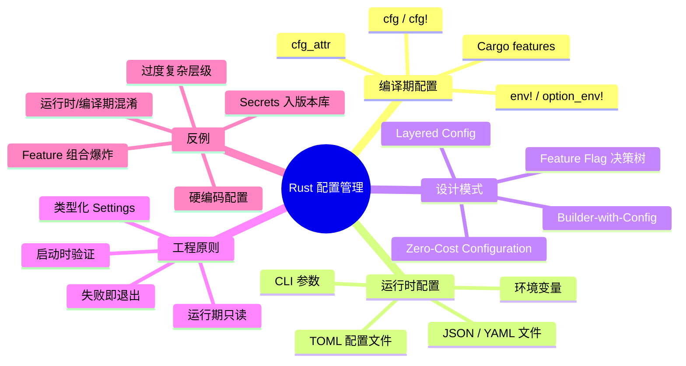
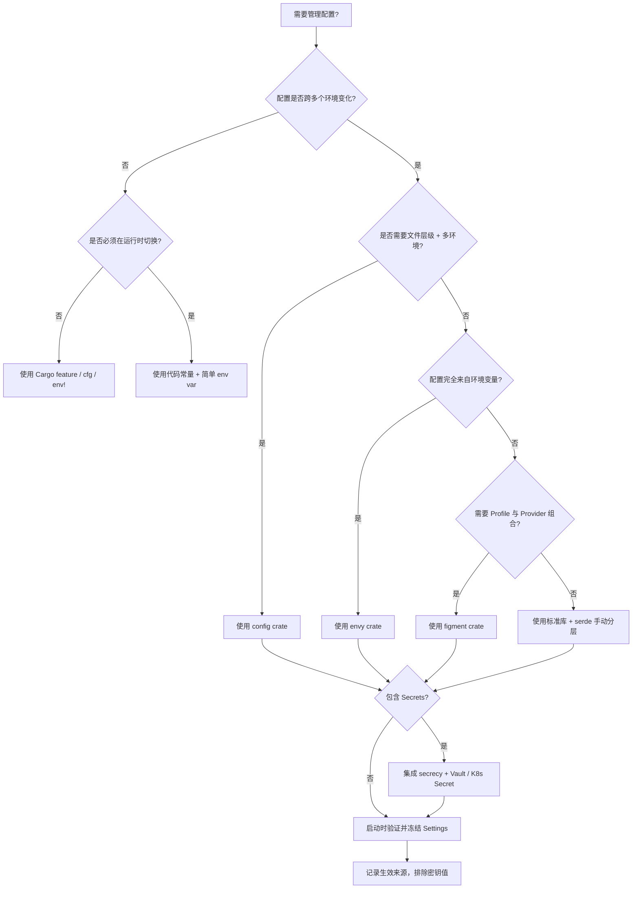

> **内容分级**: [进阶级]
>
> **本节关键术语**: configuration · cargo feature · cfg · env! · option_env! · layered config · builder · zero-cost · feature flag — [完整对照表](../../00_meta/01_terminology/01_terminology_glossary.md)

# Rust 配置管理模式（Configuration Management Patterns）

**EN**: Configuration Management Patterns in Rust
**Summary**: Compile-time and runtime configuration strategies for Rust, covering Cargo features, `cfg`, `env!`/`option_env!`, TOML/JSON/YAML files, and patterns such as builder-with-config, layered config, feature-flag decision trees, and zero-cost configuration.

> **Rust 版本**: 1.97.0+ (Edition 2024)
> **Bloom 层级**: L2-L3
> **权威来源**: 本文件为 `concept/` 权威页。
> **A/S/P 标记**: **S+A+P** — Structure + Application + Procedure
> **双维定位**: P×App — 在 Rust 服务与库中选择并组合合适的配置机制
> **定位**: 系统讲解 Rust 项目如何组合编译期配置（Cargo features、`cfg`、`env!`）与运行时配置（配置文件、环境变量、CLI 参数），并提供可复用的设计模式与反例警示。
> **前置概念**:
> [Serde Patterns](../../02_intermediate/00_traits/03_serde_patterns.md) ·
> [Error Handling Basics](../../01_foundation/08_error_handling/01_error_handling_basics.md) ·
> [API Design and SemVer Idioms](39_api_design_and_semver_idioms.md) ·
> [Hexagonal / Ports & Adapters](25_hexagonal_ports_and_adapters.md)
> **后置概念**:
> [Clean Architecture](../14_enterprise_architecture/06_clean_architecture_in_rust.md) ·
> [Observability and SRE Patterns](../14_enterprise_architecture/09_observability_and_sre_patterns.md) ·
> [Microservice Patterns](05_microservice_patterns.md) ·
> [Rust vs Ada/SPARK](../../05_comparative/01_systems_languages/07_rust_vs_ada_spark.md)
>
> **来源**:
> [The Cargo Book](https://doc.rust-lang.org/cargo/reference/features.html) ·
> [The Rust Reference — Conditional Compilation](https://doc.rust-lang.org/reference/conditional-compilation.html) ·
> [Rust API Guidelines](https://rust-lang.github.io/api-guidelines/) ·
> [config crate docs](https://docs.rs/config/latest/config/) ·
> [figment crate docs](https://docs.rs/figment/latest/figment/) ·
> [envy crate docs](https://docs.rs/envy/latest/envy/) ·
> [Zero To Production in Rust](https://www.zero2prod.com/)

---

## 🧠 知识结构图



---

## 📑 目录

- [Rust 配置管理模式（Configuration Management Patterns）](#rust-配置管理模式configuration-management-patterns)
  - [🧠 知识结构图](#-知识结构图)
  - [📑 目录](#-目录)
  - [一、权威定义](#一权威定义)
  - [二、编译期配置机制](#二编译期配置机制)
    - [2.1 Cargo features](#21-cargo-features)
    - [2.2 `cfg` 条件编译](#22-cfg-条件编译)
    - [2.3 `env!` 与 `option_env!`](#23-env-与-option_env)
  - [三、运行时配置来源](#三运行时配置来源)
    - [3.1 配置文件：TOML / JSON / YAML](#31-配置文件toml--json--yaml)
    - [3.2 环境变量](#32-环境变量)
    - [3.3 CLI 参数](#33-cli-参数)
  - [四、设计模式](#四设计模式)
    - [4.1 Builder-with-Config](#41-builder-with-config)
    - [4.2 Layered Config](#42-layered-config)
    - [4.3 Feature Flag 决策树](#43-feature-flag-决策树)
    - [4.4 Zero-Cost Configuration](#44-zero-cost-configuration)
  - [五、Rust 实现](#五rust-实现)
    - [5.1 编译期配置的可编译示例](#51-编译期配置的可编译示例)
    - [5.2 Builder-with-Config 实现](#52-builder-with-config-实现)
    - [5.3 可编译的最小分层配置（标准库版）](#53-可编译的最小分层配置标准库版)
    - [5.4 使用 `config` / `figment` / `envy` 加载运行时配置](#54-使用-config--figment--envy-加载运行时配置)
    - [5.5 零成本配置：类型状态与常量泛型](#55-零成本配置类型状态与常量泛型)
  - [六、反例与边界](#六反例与边界)
    - [反例：Feature 组合爆炸](#反例feature-组合爆炸)
    - [反例：运行时配置与编译期配置混淆](#反例运行时配置与编译期配置混淆)
    - [反例：硬编码配置](#反例硬编码配置)
    - [反例：提交 Secrets 到版本控制](#反例提交-secrets-到版本控制)
    - [边界：过度复杂的优先级层级](#边界过度复杂的优先级层级)
  - [七、决策树：选择配置管理方案](#七决策树选择配置管理方案)
  - [八、权威来源索引](#八权威来源索引)
  - [权威来源与延伸阅读（International Authority Sources）](#权威来源与延伸阅读international-authority-sources)

---

## 一、权威定义

**Rust 配置管理**规定：把影响程序行为的参数按“何时确定”划分为编译期配置与运行时配置，并分别为其选择最小权力、最小开销、最可验证的机制。

> **核心主张**（来自 *Zero To Production in Rust*）：配置不应散落在代码常量中。运行时配置应通过“默认值 → 配置文件 → 环境变量 → 密钥”分层加载；编译期配置应通过 Cargo features、`cfg`、`env!` 等机制显式声明，而不是通过注释或分支隐藏。

在该模式下：

- **编译期配置**：在编译或构建脚本阶段确定，进入二进制后不可更改。典型工具包括 Cargo features、`#[cfg(...)]`、`cfg!` 宏、`env!` / `option_env!`。
- **运行时配置**：在程序启动时或运行中确定，允许同一二进制在不同环境表现不同。典型来源包括配置文件、环境变量、CLI 参数、密钥管理器。
- **零成本原则**：能在编译期做出的选择，不要留到运行时做分支；能用类型表达的不变量，不要留到运行时验证。

---

## 二、编译期配置机制

### 2.1 Cargo features

Cargo features 是 Rust  crate 级别条件编译与可选依赖的**单一事实源**。每个 feature 是一组依赖与 `cfg(feature = "...")` 标志的开关。

```toml
[features]
default = ["std"]
std = []
serde = ["dep:serde"]
async = ["dep:tokio", "serde"]

[dependencies]
serde = { version = "1", optional = true }
tokio = { version = "1", optional = true }
```

**设计原则**（[Cargo Book](https://doc.rust-lang.org/cargo/reference/features.html)）：

1. **Additive**：启用 feature 应该只增加能力，而不是改变已有语义。避免“互斥 feature”。
2. **可组合**：任意 feature 子集都应能同时启用并通过编译。
3. **文档化**：每个 feature 在 `Cargo.toml` 中应注释其用途。

### 2.2 `cfg` 条件编译

`cfg` 是 Rust 编译器提供的条件编译属性，可在属性位置、表达式位置（`cfg!`）或项属性（`cfg_attr`）使用。

| 形式 | 示例 | 用途 |
|:---|:---|:---|
| `#[cfg(target_os = "linux")]` | 只在 Linux 编译某函数 | 平台差异 |
| `#[cfg(feature = "serde")]` | 只在启用 serde 时编译某模块 | Cargo feature |
| `cfg!(debug_assertions)` | 运行时布尔表达式 | 调试路径分支 |
| `#[cfg_attr(..., derive(Debug))]` | 条件化派生 | 减少 feature 启用时的样板 |

```rust
#[cfg(feature = "serde")]
pub mod serialization;

pub fn log_level() -> &'static str {
    if cfg!(debug_assertions) {
        "debug"
    } else {
        "info"
    }
}
```

### 2.3 `env!` 与 `option_env!`

`env!("KEY")` 在**编译时**读取环境变量，若不存在则编译失败。`option_env!("KEY")` 返回 `Option<&'static str>`，允许变量不存在。

典型用途：

- `env!("CARGO_PKG_VERSION", "0.0.0-local")` 把版本号嵌入二进制；
- `option_env!("VERGEN_GIT_SHA")` 在 CI 注入 git commit hash，本地可缺省；
- 与 `build.rs` 配合，把构建时信息编译为常量。

```rust
pub const VERSION: &str = match option_env!("CARGO_PKG_VERSION") {
    Some(v) => v,
    None => "0.0.0-local",
};
pub const BUILD_SHA: Option<&str> = option_env!("VERGEN_GIT_SHA");

fn main() {
    println!("version = {}", VERSION);
    if let Some(sha) = BUILD_SHA {
        println!("git sha = {}", sha);
    }
}
```

> **注意**：`env!` 读取的是**构建环境**变量，不是运行环境变量。若需要运行时读取，应使用 `std::env::var`。

---

## 三、运行时配置来源

### 3.1 配置文件：TOML / JSON / YAML

配置文件适合保存非敏感、按环境区分、人类可读的静态参数。Rust 生态常用 `toml`、`serde_json`、`serde_yaml` 配合 `serde` 反序列化。

```toml
# config/default.toml
[database]
host = "localhost"
port = 5432
name = "app"

[server]
host = "127.0.0.1"
port = 8080
```

```rust,ignore
use serde::Deserialize;
use std::fs;

#[derive(Debug, Deserialize)]
pub struct Settings {
    pub database: Database,
    pub server: Server,
}

#[derive(Debug, Deserialize)]
pub struct Database { pub host: String, pub port: u16, pub name: String }

#[derive(Debug, Deserialize)]
pub struct Server { pub host: String, pub port: u16 }

impl Settings {
    pub fn from_file(path: &str) -> Result<Self, Box<dyn std::error::Error>> {
        let content = fs::read_to_string(path)?;
        Ok(toml::from_str(&content)?)
    }
}
```

### 3.2 环境变量

环境变量是 12-Factor App 推荐的外部化方式，尤其适合容器化与 CI/CD。Rust 中可通过 `std::env::var` 读取，也可通过 `config` / `envy` 等 crate 结构化加载。

```rust
use std::env;

pub fn port_from_env(default: u16) -> u16 {
    env::var("APP_PORT")
        .ok()
        .and_then(|s| s.parse().ok())
        .unwrap_or(default)
}
```

### 3.3 CLI 参数

CLI 参数适合需要用户每次调用时显式指定的配置，如输入文件、输出格式、日志级别。常用 crate 有 `clap`、`bpaf`、`argh`。

```rust,ignore
use clap::Parser;

#[derive(Parser, Debug)]
#[command(version)]
struct Args {
    #[arg(short, long, default_value = "config/default.toml")]
    config: String,
    #[arg(short, long, default_value = "info")]
    log_level: String,
}
```

---

## 四、设计模式

### 4.1 Builder-with-Config

当配置项较多、存在默认值、且需要启动时验证时，使用**配置结构体 + Builder**模式。Builder 负责渐进式组装与最终验证，配置结构体负责运行期只读消费。

```rust
#[derive(Debug, Clone)]
pub struct ServerConfig {
    pub host: String,
    pub port: u16,
    pub workers: usize,
}

#[derive(Debug, Default)]
pub struct ServerConfigBuilder {
    host: Option<String>,
    port: Option<u16>,
    workers: Option<usize>,
}

impl ServerConfigBuilder {
    pub fn host(mut self, host: impl Into<String>) -> Self {
        self.host = Some(host.into());
        self
    }

    pub fn port(mut self, port: u16) -> Self {
        self.port = Some(port);
        self
    }

    pub fn workers(mut self, workers: usize) -> Self {
        self.workers = Some(workers);
        self
    }

    pub fn build(self) -> Result<ServerConfig, &'static str> {
        let port = self.port.unwrap_or(8080);
        if port == 0 {
            return Err("port cannot be 0");
        }
        Ok(ServerConfig {
            host: self.host.unwrap_or_else(|| "127.0.0.1".to_string()),
            port,
            workers: self.workers.unwrap_or(2),
        })
    }
}
```

**模式要点**：

1. Builder 允许缺失部分字段，但最终 `build()` 必须返回有效的、不可变的配置对象；
2. 默认值、文件值、环境变量值可通过不同 Builder 方法注入；
3. 验证失败应返回 `Err`，由调用者决定 panic 或退出。

### 4.2 Layered Config

分层配置把多个来源按优先级叠加，高层覆盖低层。典型优先级（由低到高）：

```text
┌─────────────────────────────────────┐
│  Layer 4: Secrets / Vault / Runtime │  ← 最高优先级，敏感信息
├─────────────────────────────────────┤
│  Layer 3: Environment Variables     │  ← 部署时覆盖
├─────────────────────────────────────┤
│  Layer 2: Environment-specific File │  ← config/production.toml
├─────────────────────────────────────┤
│  Layer 1: Default File              │  ← config/default.toml
├─────────────────────────────────────┤
│  Layer 0: Hard-coded Defaults       │  ← 代码内嵌兜底
└─────────────────────────────────────┘
```

Rust 实现参见 [5.3](#53-可编译的最小分层配置标准库版) 与 [5.4](#54-使用-config--figment--envy-加载运行时配置)。

### 4.3 Feature Flag 决策树

Feature flag 不仅指 Cargo features，也包括运行时特性开关。Rust 中应优先使用编译期 feature flag，除非该能力必须在运行时切换。

决策要点：

1. 能力是否必须在未重新编译的二进制中切换？
   - 是 → 运行时 feature flag（环境变量 / 配置 / 远程开关）；
   - 否 → 编译期 Cargo feature。
2. 该能力是否影响 API 表面？
   - 是 → Cargo feature（如 `serde` 支持）；
   - 否 → 运行时开关可能更简单。
3. 是否涉及可选依赖？
   - 是 → Cargo feature 控制依赖拉取。

### 4.4 Zero-Cost Configuration

零成本配置的核心是：把配置约束前移到编译期或类型系统，消除运行期分支与无效状态。

常用技术：

- `const` 泛型：把缓冲区大小、通道容量等参数做成编译期常量；
- `NonZero*` 类型：用类型保证值非零；
- `cfg`：在编译期剔除未启用代码路径；
- 类型状态（Typestate）：用不同类型表示已验证/未验证配置。

```rust
use std::num::NonZeroU16;

pub struct TimeoutMs(NonZeroU16);

impl TimeoutMs {
    pub const fn new(ms: u16) -> Option<Self> {
        match NonZeroU16::new(ms) {
            Some(nz) => Some(Self(nz)),
            None => None,
        }
    }

    pub const fn get(&self) -> u16 {
        self.0.get()
    }
}

pub struct Buffer<const N: usize>([u8; N]);

impl<const N: usize> Buffer<N> {
    pub const fn new() -> Self {
        Self([0; N])
    }
}
```

> **要点**：`TimeoutMs::new(0)` 在编译期或运行期都返回 `None`，调用者无法构造零超时的无效值；`Buffer<1024>` 在编译期确定容量，无运行期堆分配或长度检查。

---

## 五、Rust 实现

### 5.1 编译期配置的可编译示例

下面的代码不依赖外部 crate，演示 `cfg!`、`#[cfg]`、`env!`、`option_env!` 的联合使用。

```rust
pub const VERSION: &str = match option_env!("CARGO_PKG_VERSION") {
    Some(v) => v,
    None => "0.0.0-local",
};
pub const GIT_SHA: Option<&str> = option_env!("VERGEN_GIT_SHA");

#[cfg(feature = "tracing")]
pub fn trace_enabled() -> bool { true }

#[cfg(not(feature = "tracing"))]
pub fn trace_enabled() -> bool { false }

pub fn platform_tag() -> &'static str {
    if cfg!(target_os = "windows") {
        "win"
    } else if cfg!(target_os = "macos") {
        "mac"
    } else if cfg!(target_os = "linux") {
        "linux"
    } else {
        "other"
    }
}

fn main() {
    println!("version = {}", VERSION);
    println!("platform = {}", platform_tag());
    println!("tracing = {}", trace_enabled());
    if let Some(sha) = GIT_SHA {
        println!("git sha = {}", sha);
    }
}
```

### 5.2 Builder-with-Config 实现

```rust
#[derive(Debug, Clone)]
pub struct ServerConfig {
    pub host: String,
    pub port: u16,
    pub workers: usize,
}

#[derive(Debug, Default)]
pub struct ServerConfigBuilder {
    host: Option<String>,
    port: Option<u16>,
    workers: Option<usize>,
}

impl ServerConfigBuilder {
    pub fn host(mut self, host: impl Into<String>) -> Self {
        self.host = Some(host.into());
        self
    }

    pub fn port(mut self, port: u16) -> Self {
        self.port = Some(port);
        self
    }

    pub fn workers(mut self, workers: usize) -> Self {
        self.workers = Some(workers);
        self
    }

    pub fn build(self) -> Result<ServerConfig, &'static str> {
        let port = self.port.unwrap_or(8080);
        if port == 0 {
            return Err("port cannot be 0");
        }
        if self.workers == Some(0) {
            return Err("workers cannot be 0");
        }
        Ok(ServerConfig {
            host: self.host.unwrap_or_else(|| "127.0.0.1".to_string()),
            port,
            workers: self.workers.unwrap_or(2),
        })
    }
}

fn main() {
    let cfg = ServerConfig::builder()
        .host("0.0.0.0")
        .port(3000)
        .workers(4)
        .build()
        .expect("invalid config");
    println!("{:?}", cfg);
}

impl ServerConfig {
    pub fn builder() -> ServerConfigBuilder {
        ServerConfigBuilder::default()
    }
}
```

### 5.3 可编译的最小分层配置（标准库版）

下面的示例仅使用标准库，展示“默认值 → 文件（模拟）→ 环境变量”的分层覆盖思想。

```rust
use std::collections::HashMap;
use std::env;

#[derive(Debug, PartialEq)]
pub struct AppConfig {
    pub port: u16,
    pub database_url: String,
    pub log_level: String,
}

impl AppConfig {
    fn default() -> Self {
        Self {
            port: 8080,
            database_url: "postgres://localhost/app".to_string(),
            log_level: "info".to_string(),
        }
    }

    fn with_file_overrides(base: Self, file: &HashMap<String, String>) -> Self {
        Self {
            port: file
                .get("PORT")
                .and_then(|s| s.parse().ok())
                .unwrap_or(base.port),
            database_url: file
                .get("DATABASE_URL")
                .cloned()
                .unwrap_or(base.database_url),
            log_level: file
                .get("LOG_LEVEL")
                .cloned()
                .unwrap_or(base.log_level),
        }
    }

    fn with_env_overrides(base: Self) -> Self {
        Self {
            port: env::var("PORT")
                .ok()
                .and_then(|s| s.parse().ok())
                .unwrap_or(base.port),
            database_url: env::var("DATABASE_URL").unwrap_or(base.database_url),
            log_level: env::var("LOG_LEVEL").unwrap_or(base.log_level),
        }
    }

    fn validate(&self) -> Result<(), ConfigError> {
        if self.port == 0 {
            return Err(ConfigError::InvalidPort(self.port));
        }
        if self.database_url.is_empty() {
            return Err(ConfigError::MissingDatabaseUrl);
        }
        Ok(())
    }
}

#[derive(Debug, PartialEq)]
pub enum ConfigError {
    InvalidPort(u16),
    MissingDatabaseUrl,
}

fn main() {
    let mut file = HashMap::new();
    file.insert("LOG_LEVEL".to_string(), "debug".to_string());

    let cfg = AppConfig::default();
    let cfg = AppConfig::with_file_overrides(cfg, &file);
    let cfg = AppConfig::with_env_overrides(cfg);

    cfg.validate().expect("invalid configuration");

    println!("port = {}", cfg.port);
    println!("database_url = {}", cfg.database_url);
    println!("log_level = {}", cfg.log_level);
}
```

> **要点**：标准库版本揭示了分层的本质——逐层 `unwrap_or(base.xxx)`。真实项目中，`config` / `figment` 用更声明式的 API 完成同样的事。

### 5.4 使用 `config` / `figment` / `envy` 加载运行时配置

`config` crate 支持 TOML、YAML、JSON、环境变量等多种来源：

```rust,ignore
use config::{Config, ConfigError, Environment, File};
use serde::Deserialize;

#[derive(Debug, Deserialize)]
pub struct Settings {
    pub database: DatabaseSettings,
    pub application: ApplicationSettings,
}

#[derive(Debug, Deserialize)]
pub struct DatabaseSettings {
    pub host: String,
    pub port: u16,
    pub username: String,
    pub password: String,
    pub name: String,
}

#[derive(Debug, Deserialize)]
pub struct ApplicationSettings {
    pub port: u16,
    pub host: String,
}

impl Settings {
    pub fn new() -> Result<Self, ConfigError> {
        let base_path = std::env::current_dir()
            .expect("failed to determine current directory");
        let config_dir = base_path.join("configuration");
        let environment: String = std::env::var("APP_ENVIRONMENT")
            .unwrap_or_else(|_| "development".into());

        let settings = Config::builder()
            .add_source(File::from(config_dir.join("base")))
            .add_source(File::from(config_dir.join(&environment)).required(false))
            .add_source(
                Environment::with_prefix("APP")
                    .prefix_separator("_")
                    .separator("__"),
            )
            .build()?;

        settings.try_deserialize()
    }
}
```

`figment` 提供更细粒度的 Provider 与 Profile：

```rust,ignore
use figment::{
    Figment,
    providers::{Env, Format, Toml},
};
use serde::Deserialize;

#[derive(Debug, Deserialize)]
pub struct AppConfig {
    pub port: u16,
    pub database_url: String,
}

impl AppConfig {
    pub fn load(profile: &str) -> Result<Self, figment::Error> {
        Figment::new()
            .merge(Toml::file("config/default.toml"))
            .merge(Toml::file(format!("config/{}.toml", profile)).nested())
            .merge(Env::prefixed("APP_").split("__"))
            .select(profile)
            .extract()
    }
}
```

当配置完全来自环境变量时，`envy` 最轻量：

```rust,ignore
use serde::Deserialize;

#[derive(Debug, Deserialize)]
pub struct Config {
    pub port: u16,
    pub database_url: String,
    #[serde(default = "default_log_level")]
    pub log_level: String,
}

fn default_log_level() -> String { "info".to_string() }

impl Config {
    pub fn from_env() -> Result<Self, envy::Error> {
        envy::prefixed("APP_").from_env()
    }
}
```

### 5.5 零成本配置：类型状态与常量泛型

```rust
use std::num::NonZeroU16;

pub struct TimeoutMs(NonZeroU16);

impl TimeoutMs {
    pub const fn new(ms: u16) -> Option<Self> {
        match NonZeroU16::new(ms) {
            Some(nz) => Some(Self(nz)),
            None => None,
        }
    }

    pub const fn get(&self) -> u16 {
        self.0.get()
    }
}

pub struct Buffer<const N: usize>([u8; N]);

impl<const N: usize> Buffer<N> {
    pub const fn new() -> Self {
        Self([0; N])
    }

    pub fn as_slice(&self) -> &[u8; N] {
        &self.0
    }
}

fn main() {
    let timeout = TimeoutMs::new(1000).expect("timeout must be > 0");
    let buf = Buffer::<1024>::new();
    println!("timeout = {} ms, buffer len = {}", timeout.get(), buf.as_slice().len());
}
```

---

## 六、反例与边界

### 反例：Feature 组合爆炸

```toml
# ❌ 危险：大量正交 feature 导致 2^n 种配置
[features]
a = []
b = []
c = []
d = []
e = []
```

```rust,ignore
#[cfg(all(feature = "a", feature = "b", not(feature = "c")))]
mod special_path;
```

**问题**：

1. 5 个独立 feature 就产生 32 种编译配置，CI 难以全部覆盖；
2. 用户可能启用未经验证的组合，导致编译失败或行为异常；
3. feature unification 会让库的二进制在下游出现你没有本地测试过的 feature 组合。

**修正**：

1. 保持 feature **additive**；
2. 把高度相关的选项合并为 tiered feature（如 `runtime-tokio`、`runtime-async-std` 二选一，但通过 cfg 互斥并给出清晰错误）；
3. 在 CI 中运行 `cargo hack --feature-powerset` 至少验证关键组合。

### 反例：运行时配置与编译期配置混淆

```rust,ignore
// ❌ 错误：把构建时版本号用运行时 env 读取
fn version() -> String {
    std::env::var("CARGO_PKG_VERSION").unwrap_or_default()
}
```

**问题**：生产二进制运行时不一定在 Cargo 环境中，`CARGO_PKG_VERSION` 环境变量通常不存在，导致版本号为空。

**修正**：

```rust
pub const VERSION: &str = match option_env!("CARGO_PKG_VERSION") {
    Some(v) => v,
    None => "0.0.0-local",
};
```

反过来，不要把运行时才应可变的值用 `env!` 固定：

```rust,ignore
// ❌ 错误：运行环境端口被硬编码到构建时
const PORT: u16 = env!("APP_PORT").parse().unwrap();
```

运行期配置应使用 `std::env::var` 或分层配置加载。

### 反例：硬编码配置

```rust,ignore
// ❌ 错误：把环境相关值写死在代码里
const DATABASE_URL: &str = "postgres://prod-db.internal/app";
const PORT: u16 = 80;
```

**问题**：同一套代码无法在不同环境运行；修改端口或数据库地址需要重新编译；密钥硬编码会带来严重安全风险。

**修正**：将可配置项抽到 `Settings` 结构体中，通过默认值、文件、环境变量分层加载。

### 反例：提交 Secrets 到版本控制

```text
# ❌ 错误：config/production.toml 里出现真实密码
[database]
password = "super-secret-123"
```

**问题**：密码一旦进入 Git 历史就无法真正删除；任何有仓库访问权限的人都能看到。

**修正**：

1. 配置文件只放非敏感值；
2. 密码通过 `DATABASE_URL` 环境变量或 Vault 注入；
3. 使用 `secrecy` 等 crate 防止日志泄露；
4. 把 `config/production.toml` 与 `.env` 加入 `.gitignore`。

### 边界：过度复杂的优先级层级

```text
⚠️ 边界：超过 4-5 层的配置来源
  代码默认值 → 全局文件 → 环境文件 → 本地文件 → 环境变量 → CLI 参数 → Secrets → ...
```

**判定**：层级过多会导致“到底哪个值生效”难以排查。一般推荐 **4 层**：默认值、环境文件、环境变量、Secrets。CLI 参数可视场景加入，但需有明确的 `--dump-config` 或日志输出来源信息。

---

## 七、决策树：选择配置管理方案



**决策规则摘要**：

1. **环境差异小或纯编译期选择** → `cfg` / `env!` / Cargo features；
2. **多环境文件 + 环境变量** → `config`；
3. **需要 Profile 切换 + 自定义 Provider** → `figment`；
4. **完全来自环境变量** → `envy`；
5. **任何包含 Secrets 的方案** → 必须配合 `secrecy` 与外部密钥管理器；
6. **所有方案** → 启动时验证、失败即退出、运行期只读。

---

## 八、权威来源索引

- **P0（官方）**: [The Cargo Book — Features](https://doc.rust-lang.org/cargo/reference/features.html) — Cargo feature 语义与 additive 原则
- **P0（官方）**: [The Rust Reference — Conditional Compilation](https://doc.rust-lang.org/reference/conditional-compilation.html) — `cfg`、`cfg!`、`cfg_attr` 完整规则
- **P0（官方）**: [Rust API Guidelines](https://rust-lang.github.io/api-guidelines/) — 公开 API 与 feature 设计最佳实践
- **P0（官方）**: [serde docs](https://serde.rs/) — 配置文件反序列化基础
- **P2（生态）**: [config crate docs](https://docs.rs/config/latest/config/) — TOML/YAML/JSON/环境变量分层加载
- **P2（生态）**: [figment crate docs](https://docs.rs/figment/latest/figment/) — Profile 与 Provider 组合
- **P2（生态）**: [envy crate docs](https://docs.rs/envy/latest/envy/) — 环境变量到 serde 结构体映射
- **P2（生态）**: [secrecy crate docs](https://docs.rs/secrecy/latest/secrecy/) — 防止 Secrets 在日志中泄露
- **P2（生态/书籍）**: [*Zero To Production in Rust*](https://www.zero2prod.com/) — 分层配置与数据库设置加载实践
- **P1（工程实践）**: [The Twelve-Factor App — Config](https://12factor.net/config) — 配置外部化原则

> **文档版本**: 1.1 ｜ **最后更新**: 2026-08-03 ｜ **状态**: ✅ 权威页补齐

---

## 权威来源与延伸阅读（International Authority Sources）

- `config` crate docs：<https://docs.rs/config/latest/config/>
- `config` on crates.io：<https://crates.io/crates/config>
- RustBelt（Rust 形式化基础）：<https://plv.mpi-sws.org/rustbelt/>
