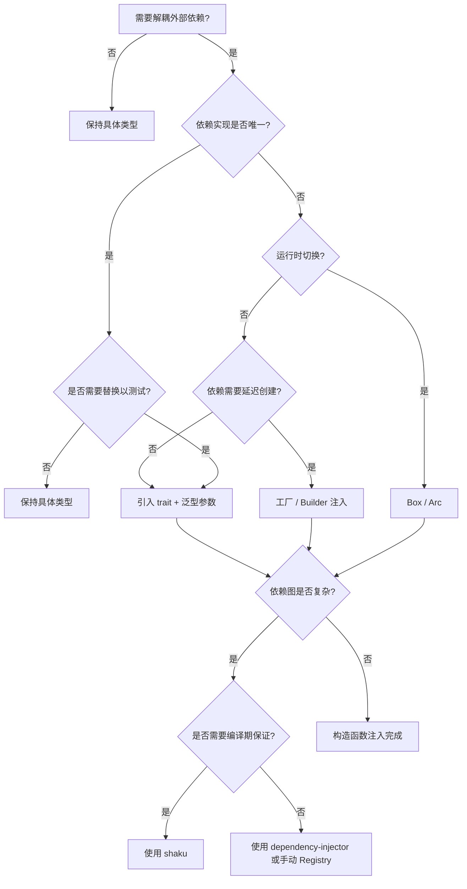
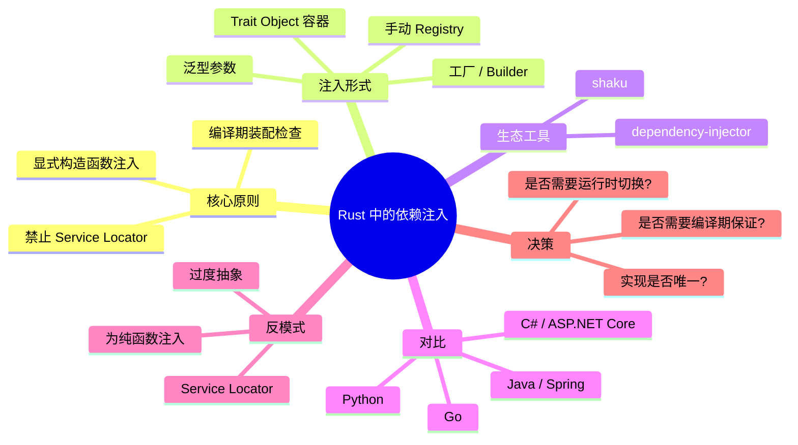

> **内容分级**: [进阶级]
> **代码状态**: ✅ 含可编译示例
>
# Rust 中的依赖注入（Dependency Injection in Rust）

**EN**: Dependency Injection in Rust
**Summary**: Limited forms of dependency injection in Rust: trait objects, generic parameters, manual registries, and crates like `shaku`/`di`, contrasted with Service Locator anti-patterns.

> **Rust 版本**: 1.97.0+ (Edition 2024)
> **Bloom 层级**: L2-L3
> **权威来源**: 本文件为 `concept/` 权威页。
> **A/S/P 标记**: **S+A** — Structure + Application
> **定位**: 说明 Rust 中没有传统 DI 容器，但可通过 trait、泛型参数、工厂函数与少量 crate 实现显式依赖注入；同时指出 Service Locator 与过度抽象的陷阱。
> **前置概念**:
> [Traits](../../02_intermediate/00_traits/01_traits.md) ·
> [Dispatch Mechanisms](../../02_intermediate/00_traits/02_dispatch_mechanisms.md) ·
> [Type System](../../01_foundation/02_type_system/01_type_system.md) ·
> [Error Handling Basics](../../01_foundation/08_error_handling/01_error_handling_basics.md) ·
> [Testing and Mocking Idioms](40_testing_and_mocking_idioms.md)
> **后置概念**:
> [Hexagonal / Ports & Adapters](25_hexagonal_ports_and_adapters.md) ·
> [Clean Architecture in Rust](../14_enterprise_architecture/06_clean_architecture_in_rust.md) ·
> [Repository and Unit of Work](24_repository_and_unit_of_work.md) ·
> [Microservice Patterns](05_microservice_patterns.md) ·
> [Rust vs Ada/SPARK](../../05_comparative/01_systems_languages/07_rust_vs_ada_spark.md)
>
> **来源**:
> [Rust Design Patterns](https://rust-unofficial.github.io/patterns/) ·
> [shaku crate docs](https://docs.rs/shaku/latest/shaku/) ·
> [dependency-injector crate docs](https://docs.rs/dependency-injector/latest/dependency_injector/) ·
> [Zero To Production in Rust](https://www.zero2prod.com/)

---

## 📑 目录

- [Rust 中的依赖注入（Dependency Injection in Rust）](#rust-中的依赖注入dependency-injection-in-rust)
  - [📑 目录](#-目录)
  - [一、权威定义](#一权威定义)
  - [二、为什么 Rust 的 DI 与主流语言不同](#二为什么-rust-的-di-与主流语言不同)
  - [三、DI 形式 1：泛型参数注入](#三di-形式-1泛型参数注入)
  - [四、DI 形式 2：Trait Object 容器](#四di-形式-2trait-object-容器)
  - [五、DI 形式 3：工厂 / Builder 注入](#五di-形式-3工厂--builder-注入)
  - [六、DI 形式 4：手动 Registry](#六di-形式-4手动-registry)
  - [七、DI 生态：shaku 与 dependency-injector](#七di-生态shaku-与-dependency-injector)
  - [八、何时不要在 Rust 中使用 DI](#八何时不要在-rust-中使用-di)
  - [九、与其他语言对比](#九与其他语言对比)
  - [十、反例与边界](#十反例与边界)
    - [反例：Service Locator](#反例service-locator)
    - [反例：过度抽象的 DI 容器](#反例过度抽象的-di-容器)
    - [反例：为纯函数注入依赖](#反例为纯函数注入依赖)
  - [十一、决策树：选择注入方式](#十一决策树选择注入方式)
  - [十二、权威来源索引](#十二权威来源索引)
  - [🧠 知识结构图（Mindmap）](#-知识结构图mindmap)

---

## 一、权威定义

**依赖注入（Dependency Injection, DI）** 是一种让组件不自行创建依赖、而是由外部提供依赖的设计原则。在 Rust 中，DI 几乎总是通过**显式构造函数参数**完成，形式包括：

- **泛型参数注入**：`Service<R: Repository>`；
- **Trait object 容器**：`Box<dyn Repository>`；
- **工厂 / Builder 注入**：把创建逻辑作为参数传入；
- **手动 Registry**：在启动时组装对象图，运行期只读。

> **核心主张**：Rust 没有 Spring / .NET DI 容器那样的运行时反射装配。依赖关系必须在类型系统中显式声明，编译器会检查装配是否完整。这既是限制，也是优势：装配错误在编译期被发现，运行时不会出现“缺少 bean”类错误。

---

## 二、为什么 Rust 的 DI 与主流语言不同

| 特性 | Java / C# / Go 传统 DI | Rust DI |
|:---|:---|:---|
| **装配时机** | 运行时反射 / 代码生成 | 编译期类型检查 |
| **多态形式** | 接口引用、泛型 | `dyn Trait`、`impl Trait`、泛型 |
| **生命周期** | 由容器管理 | 由所有权 / 借用 / `Arc` 显式管理 |
| **循环依赖** | 容器可能允许（需打破） | 编译器通常直接拒绝 |
| **典型成本** | 启动扫描、反射开销 | 零成本抽象（泛型）或一次 `Box` 分配（dyn） |

> **关键洞察**：Rust 的所有权模型让“全局可变容器”变得危险且罕见，因此 Rust 社区更强调**构造函数注入**与**显式对象图装配**。

---

## 三、DI 形式 1：泛型参数注入

当依赖类型固定、且希望零成本静态分发时，使用泛型参数注入。

```rust
/// 依赖契约
pub trait Notifier: Send + Sync {
    fn notify(&self, msg: &str);
}

/// 生产实现
pub struct EmailNotifier;
impl Notifier for EmailNotifier {
    fn notify(&self, msg: &str) {
        println!("[email] {}", msg);
    }
}

/// 测试实现
pub struct LogNotifier;
impl Notifier for LogNotifier {
    fn notify(&self, msg: &str) {
        println!("[log] {}", msg);
    }
}

/// 业务组件通过泛型参数接收依赖
pub struct AlertService<N: Notifier> {
    notifier: N,
}

impl<N: Notifier> AlertService<N> {
    pub fn new(notifier: N) -> Self {
        Self { notifier }
    }

    pub fn alert(&self, message: &str) {
        self.notifier.notify(message);
    }
}

fn main() {
    let production = AlertService::new(EmailNotifier);
    production.alert("disk full");

    let testing = AlertService::new(LogNotifier);
    testing.alert("test alert");
}
```

> **适用场景**：依赖单一、实现稳定、对性能敏感；缺点是泛型参数过多时 API 噪声增大。

---

## 四、DI 形式 2：Trait Object 容器

当需要运行时多态（例如同一字段在启动时根据配置选择实现），使用 `Box<dyn Trait>` 或 `Arc<dyn Trait>`。

```rust
pub trait PaymentGateway: Send + Sync {
    fn charge(&self, amount: u64) -> Result<(), &'static str>;
}

pub struct StripeGateway;
impl PaymentGateway for StripeGateway {
    fn charge(&self, amount: u64) -> Result<(), &'static str> {
        println!("charging {} via Stripe", amount);
        Ok(())
    }
}

pub struct MockGateway;
impl PaymentGateway for MockGateway {
    fn charge(&self, _amount: u64) -> Result<(), &'static str> {
        println!("mock charge");
        Ok(())
    }
}

/// 容器保存 trait object，运行时切换实现
pub struct CheckoutService {
    gateway: Box<dyn PaymentGateway>,
}

impl CheckoutService {
    pub fn new(gateway: Box<dyn PaymentGateway>) -> Self {
        Self { gateway }
    }

    pub fn checkout(&self, amount: u64) -> Result<(), &'static str> {
        self.gateway.charge(amount)
    }
}

fn make_gateway(use_stripe: bool) -> Box<dyn PaymentGateway> {
    if use_stripe {
        Box::new(StripeGateway)
    } else {
        Box::new(MockGateway)
    }
}

fn main() {
    let service = CheckoutService::new(make_gateway(false));
    service.checkout(100).unwrap();
}
```

> **适用场景**：依赖数量多、运行时切换、需要减少泛型爆炸；代价是一次动态分发与 `Box` 分配。

---

## 五、DI 形式 3：工厂 / Builder 注入

当依赖的创建需要延迟到运行时（例如需要请求上下文），可注入工厂函数或 Builder。

```rust
pub trait Connection {
    fn query(&self, sql: &str) -> Vec<String>;
}

pub struct FakeConnection;
impl Connection for FakeConnection {
    fn query(&self, sql: &str) -> Vec<String> {
        vec![format!("fake: {}", sql)]
    }
}

/// 工厂注入：不直接持有依赖，而是持有创建依赖的能力
pub struct ReportGenerator<F>
where
    F: Fn() -> Box<dyn Connection>,
{
    connection_factory: F,
}

impl<F> ReportGenerator<F>
where
    F: Fn() -> Box<dyn Connection>,
{
    pub fn new(connection_factory: F) -> Self {
        Self { connection_factory }
    }

    pub fn generate(&self, sql: &str) -> Vec<String> {
        let conn = (self.connection_factory)();
        conn.query(sql)
    }
}

fn main() {
    let generator = ReportGenerator::new(|| Box::new(FakeConnection));
    let rows = generator.generate("SELECT * FROM sales");
    assert_eq!(rows, vec!["fake: SELECT * FROM sales".to_string()]);
}
```

> **适用场景**：依赖生命周期与请求绑定、需要每次重新创建、或创建逻辑需要外部参数。

---

## 六、DI 形式 4：手动 Registry

手动 Registry 是在启动时显式组装对象图，然后以只读方式传递给 handler。

```rust
use std::sync::Arc;

pub trait Repository: Send + Sync {
    fn get(&self, id: u64) -> Option<String>;
}

pub struct InMemoryRepository;
impl Repository for InMemoryRepository {
    fn get(&self, id: u64) -> Option<String> {
        Some(format!("item-{}", id))
    }
}

/// 启动时装配、运行期只读的应用上下文
pub struct AppContext {
    repository: Arc<dyn Repository>,
}

impl AppContext {
    pub fn new(repository: Arc<dyn Repository>) -> Self {
        Self { repository }
    }

    pub fn repository(&self) -> &dyn Repository {
        &*self.repository
    }
}

fn main() {
    let ctx = AppContext::new(Arc::new(InMemoryRepository));
    assert_eq!(ctx.repository().get(1), Some("item-1".to_string()));
}
```

> **要点**：Registry 不是 Service Locator：它只在构造函数中注入，不暴露全局查找接口。

---

## 七、DI 生态：shaku 与 dependency-injector

当依赖图变得复杂（数十个组件、生命周期不同、需要按 profile 切换），可使用专门的 DI crate。

### `shaku`：编译期依赖注入

`shaku` 使用 derive 宏定义组件与模块，在编译期检查依赖是否完整，适合需要强保证的场景。

```rust,ignore
// [dependencies]
// shaku = "0.6"

use shaku::{module, Component, Container, Interface};
use std::sync::Arc;

trait Notifier: Interface {
    fn notify(&self, msg: &str);
}

#[derive(Component)]
#[shaku(interface = Notifier)]
struct EmailNotifier;

impl Notifier for EmailNotifier {
    fn notify(&self, msg: &str) {
        println!("{}", msg);
    }
}

module! {
    AppModule {
        components = [EmailNotifier],
        providers = []
    }
}

fn main() {
    let module = AppModule::builder().build();
    let notifier: Arc<dyn Notifier> = module.resolve_ref();
    notifier.notify("hello shaku");
}
```

### `dependency-injector`：无宏容器

`dependency-injector` 提供轻量、无过程宏的容器 API，适合不喜欢宏或需要运行时装配的团队。

```rust,ignore
// [dependencies]
// dependency-injector = "2"

use dependency_injector::Container;

struct DbConfig { url: String }
struct Repository { config: DbConfig }

fn main() {
    let mut container = Container::new();
    container.register(DbConfig { url: "postgres://".into() });
    // 运行时解析；缺少依赖会在 resolve 时报错
    let repo = container.resolve::<Repository>();
}
```

> **选型建议**：
> - 依赖图简单 → 手动泛型/trait object 足够；
> - 依赖图复杂且重视编译期保证 → `shaku`；
> - 需要运行时配置装配 → `dependency-injector`；
> - 绝大多数 Web 服务不需要 DI crate，构造函数 + `AppContext` 已足够。

---

## 八、何时不要在 Rust 中使用 DI

1. **纯函数**：`fn parse(input: &str) -> Result<T, E>` 没有外部依赖，注入只会增加噪音；
2. **唯一实现且不会变化**：如果整个生命周期只有一种数据库且不会替换，直接构造 `SqlxPool` 比重构为 trait 更经济；
3. **过度抽象导致编译成本**：每个依赖一个泛型参数会让类型签名膨胀、编译时间增加；
4. **一次性脚本或原型**：先用具体类型验证想法，待出现第二个实现或测试需求时再引入 trait seam。

---

## 九、与其他语言对比

| 语言/框架 | 典型 DI 形式 | Rust 映射 | 主要差异 |
|:---|:---|:---|:---|
| **Java / Spring** | 注解 + 运行时 Bean 容器 | `shaku` 或手动 Registry | Rust 无反射，装配在编译期 |
| **C# / ASP.NET Core** | `IServiceCollection` + 构造函数注入 | 手动 `AppContext` | Rust 无内置容器，需自行组装 |
| **Go** | 接口 + 构造函数注入 | `dyn Trait` / 泛型参数 | Rust 有编译期所有权检查 |
| **Python** | 猴子补丁 / 依赖注入框架 | trait + Fake 实现 | Rust 的替换在编译期完成 |

> **来源对齐**: Rust Design Patterns 将“通过 trait 解耦依赖”视为 Rust 的可测性设计核心，与 Fowler 的 Test Double 分类一致。

---

## 十、反例与边界

### 反例：Service Locator

Service Locator 让组件通过全局函数查找依赖，隐藏了真实依赖关系，使测试与理解成本陡增。

```rust,ignore
// ❌ 错误：全局 Service Locator
static LOCATOR: std::sync::OnceLock<Locator> = std::sync::OnceLock::new();

pub fn repository() -> &'static dyn Repository {
    LOCATOR.get().unwrap().repository()
}

pub fn handler() {
    let repo = repository(); // 依赖关系对调用方不可见
    // ...
}
```

**问题**：
- `handler` 的依赖签名不诚实；
- 测试前必须先初始化全局 `LOCATOR`；
- 并发测试容易互相干扰；
- 无法从类型签名判断组件需要哪些能力。

**修正**：把依赖作为参数传入，如 `fn handler(repo: &dyn Repository)`。

### 反例：过度抽象的 DI 容器

```rust,ignore
// ❌ 错误：为每一个小函数都引入泛型参数
pub fn process<T, U, V>(repo: T, logger: U, metrics: V, input: Input)
where
    T: Repository,
    U: Logger,
    V: Metrics,
{ }
```

**问题**：
- 类型签名噪音大；
- 编译时间增加；
- 阅读者难以抓住核心参数。

**修正**：当依赖超过 3-4 个时，使用 `AppContext` 或 `Box<dyn Trait>` 容器聚合。

### 反例：为纯函数注入依赖

```rust,ignore
// ❌ 错误：没有外部依赖的纯函数被强行注入 Transformer
pub fn double<T>(transformer: T, x: i32) -> i32
where
    T: Fn(i32) -> i32,
{
    transformer(x)
}
```

**问题**：如果 `transformer` 永远只是 `|x| x * 2`，注入就是过度设计。

**修正**：直接写 `fn double(x: i32) -> i32 { x * 2 }`。

---

## 十一、决策树：选择注入方式



**决策规则摘要**：

1. 优先使用具体类型；仅在需要替换/切换时引入 trait；
2. 单一依赖、性能敏感 → 泛型参数；
3. 多实现运行时切换 → `Box<dyn Trait>` / `Arc<dyn Trait>`；
4. 请求级生命周期 → 工厂注入；
5. 复杂对象图 → 手动 Registry，必要时再引入 DI crate；
6. 禁止 Service Locator。

---

## 十二、权威来源索引

- **P0 官方**: [The Rust Programming Language](https://doc.rust-lang.org/book/title-page.html) · [Rust Reference — Traits](https://doc.rust-lang.org/reference/items/traits.html) · [Rust API Guidelines](https://rust-lang.github.io/api-guidelines/)
- **P1 学术/行业**: [Fowler — Inversion of Control Containers and the Dependency Injection pattern](https://martinfowler.com/articles/injection.html) · [Fowler — Test Double Patterns](https://martinfowler.com/bliki/TestDouble.html)
- **P2 生态**: [Rust Design Patterns](https://rust-unofficial.github.io/patterns/) · [shaku crate docs](https://docs.rs/shaku/latest/shaku/) · [dependency-injector crate docs](https://docs.rs/dependency-injector/latest/dependency_injector/) · [*Zero To Production in Rust*](https://www.zero2prod.com/)

> **文档版本**: 1.0 ｜ **最后更新**: 2026-08-03 ｜ **状态**: ✅ 新建权威页

---

## 🧠 知识结构图（Mindmap）



---

## 国际权威来源（P1 补充）

- [Design Patterns: Abstraction and Reuse of Object-Oriented Design](https://link.springer.com/chapter/10.1007/978-3-642-59412-0_40)
