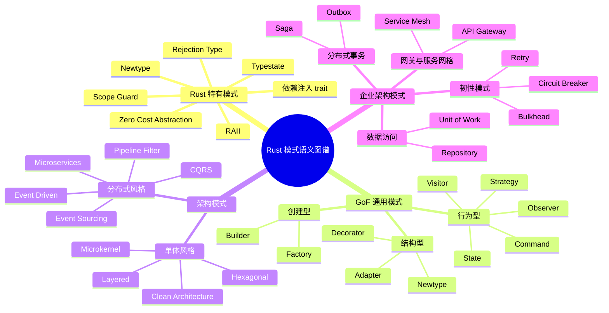
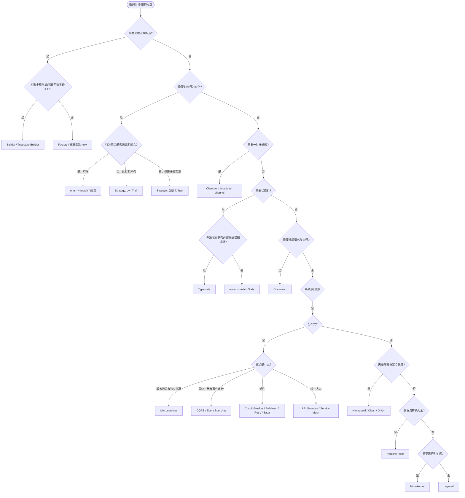

# Rust 设计模式与架构模式语义图谱

> **EN**: Rust Design Pattern and Architecture Pattern Semantic Atlas
> **Summary**: A unified semantic atlas mapping Rust-specific idioms, GoF design patterns, architecture patterns, and enterprise patterns into a single coordinate system with decision trees, comparison matrices, and composition algebra.
> **Rust 版本**: 1.97.0+ (Edition 2024)
> **Bloom 层级**: L4-L6
> **权威来源**: 本文件为 `concept/` 权威页。
> **A/S/P 标记**: S+A — Structure + Application
> **双维定位**: C×Ana / C×Eva
> **前置概念**:
> [Patterns](01_patterns.md) ·
> [Idioms Spectrum](02_idioms_spectrum.md) ·
> [Architecture Patterns](08_architecture_patterns.md) ·
> [System Design Principles](03_system_design_principles.md)
> **后置概念**:
> [Pattern Composition Algebra](../../04_formal/00_type_theory/12_pattern_composition_algebra.md) ·
> [Enterprise Architecture](../14_enterprise_architecture/README.md) ·
> [Semantic Space Index](../../00_meta/00_framework/pattern_semantic_space_index.md)
> **主要来源**:
> [Rust Design Patterns](https://rust-unofficial.github.io/patterns/) ·
> [GoF — Design Patterns](https://en.wikipedia.org/wiki/Design_Patterns) ·
> [POSA](https://en.wikipedia.org/wiki/Pattern-Oriented_Software_Architecture) ·
> [Martin Fowler — Enterprise Architecture Patterns](https://martinfowler.com/books/eaa.html) ·
> [Zero To Production](https://www.zero2prod.com/) ·
> [Rust API Guidelines](https://rust-lang.github.io/api-guidelines/)

---

## 目录

- [Rust 设计模式与架构模式语义图谱](#rust-设计模式与架构模式语义图谱)
  - [目录](#目录)
  - [一、核心命题：为什么需要一张模式语义图谱](#一核心命题为什么需要一张模式语义图谱)
  - [二、全景思维导图](#二全景思维导图)
  - [三、Rust 特有设计模式](#三rust-特有设计模式)
    - [3.1 Typestate](#31-typestate)
    - [3.2 RAII / Scope Guard](#32-raii--scope-guard)
    - [3.3 Newtype](#33-newtype)
    - [3.4 Rejection Type](#34-rejection-type)
    - [3.5 零成本抽象模式](#35-零成本抽象模式)
    - [3.6 依赖注入的 Rust 形态](#36-依赖注入的-rust-形态)
  - [四、通用设计模式在 Rust 中的实现](#四通用设计模式在-rust-中的实现)
    - [4.1 Adapter](#41-adapter)
    - [4.2 Strategy](#42-strategy)
    - [4.3 Command](#43-command)
    - [4.4 Observer](#44-observer)
    - [4.5 State](#45-state)
    - [4.6 Visitor](#46-visitor)
    - [4.7 Builder](#47-builder)
  - [五、架构模式](#五架构模式)
    - [5.1 Microservices](#51-microservices)
    - [5.2 Event-Driven](#52-event-driven)
    - [5.3 CQRS / Event Sourcing](#53-cqrs--event-sourcing)
    - [5.4 Hexagonal / Ports \& Adapters](#54-hexagonal--ports--adapters)
    - [5.5 Clean Architecture](#55-clean-architecture)
    - [5.6 Layered](#56-layered)
    - [5.7 Microkernel](#57-microkernel)
    - [5.8 Pipeline-Filter](#58-pipeline-filter)
  - [六、企业架构模式](#六企业架构模式)
    - [6.1 Repository / Unit of Work](#61-repository--unit-of-work)
    - [6.2 Saga](#62-saga)
    - [6.3 Outbox](#63-outbox)
    - [6.4 Circuit Breaker](#64-circuit-breaker)
    - [6.5 Bulkhead](#65-bulkhead)
    - [6.6 Retry](#66-retry)
    - [6.7 API Gateway](#67-api-gateway)
    - [6.8 Service Mesh](#68-service-mesh)
  - [七、模式选择决策树](#七模式选择决策树)
  - [八、多维对比矩阵](#八多维对比矩阵)
    - [8.1 设计模式对比](#81-设计模式对比)
    - [8.2 架构与企业模式对比](#82-架构与企业模式对比)
  - [九、模式组合代数与冲突表](#九模式组合代数与冲突表)
    - [9.1 组合原语](#91-组合原语)
    - [9.2 常见组合](#92-常见组合)
    - [9.3 冲突表](#93-冲突表)
  - [十、反例与误用](#十反例与误用)
    - [10.1 过度使用 `dyn Trait`](#101-过度使用-dyn-trait)
    - [10.2 Typestate 状态爆炸](#102-typestate-状态爆炸)
    - [10.3 分层依赖倒置错误](#103-分层依赖倒置错误)
    - [10.4 Observer 循环引用](#104-observer-循环引用)
    - [10.5 微服务过早拆分](#105-微服务过早拆分)
  - [十一、权威来源索引](#十一权威来源索引)
    - [P0 官方与语言规范](#p0-官方与语言规范)
    - [P1 学术与经典专著](#p1-学术与经典专著)
    - [P2 生态与实践](#p2-生态与实践)
  - [十二、延伸阅读](#十二延伸阅读)

---

## 一、核心命题：为什么需要一张模式语义图谱

> **设计模式不是 23 个孤立代码模板，架构模式也不是八股文式的分层。**
> 它们是分布在「问题域 × 抽象层级 × 实现机制」三维语义空间中的结构化知识。

Rust 的特殊性在于：所有权、生命周期、trait 系统与零成本抽象使得许多经典模式以不同形态出现，甚至有些模式被类型系统完全吸收（如 Typestate 替代运行期状态检查）。本图谱把 Rust 特有模式、GoF 模式、架构模式与企业架构模式统一到一个坐标系中，提供：

1. **定位**：每个模式在语义空间中的坐标；
2. **选择**：基于问题特征的决策树；
3. **对比**：同域模式的多维权衡矩阵；
4. **组合**：模式之间的代数关系与冲突检测；
5. **边界**：典型误用与反例。

---

## 二、全景思维导图



---

## 三、Rust 特有设计模式

### 3.1 Typestate

**意图**：将对象的合法状态转移编码到类型系统中，使非法状态不可表示。

**Rust 实现结构**：泛型状态参数 + `PhantomData<State>` + 消费型转移方法。

```rust
use std::marker::PhantomData;

struct Idle;
struct Running;
struct Stopped;

struct Task<State> {
    name: String,
    _state: PhantomData<State>,
}

impl Task<Idle> {
    fn new(name: impl Into<String>) -> Self {
        Self { name: name.into(), _state: PhantomData }
    }

    fn start(self) -> Task<Running> {
        println!("starting {}", self.name);
        Task { name: self.name, _state: PhantomData }
    }
}

impl Task<Running> {
    fn stop(self) -> Task<Stopped> {
        println!("stopping {}", self.name);
        Task { name: self.name, _state: PhantomData }
    }
}

fn main() {
    let t = Task::<Idle>::new("worker");
    let t = t.start();
    let _t = t.stop();
    // let _ = Task::<Idle>::new("x").stop(); // 编译错误
}
```

**适用场景**：协议状态机、资源生命周期、构建器必填字段校验。

**与所有权/类型系统的契合点**：消费 `self` 实现状态转移，旧状态被线性消耗；`PhantomData` 在不增加运行时开销的前提下携带状态信息。

> 深度阅读：[Typestate 深入解析](32_typestate_deep_dive.md)

---

### 3.2 RAII / Scope Guard

**意图**：将资源获取与对象生命周期绑定，离开作用域时确定性释放。

**Rust 实现结构**：`Drop` trait + 作用域 + `std::mem::ManuallyDrop`/`scopeguard` crate。

```rust
struct TempFile {
    path: std::path::PathBuf,
}

impl TempFile {
    fn new(path: impl Into<std::path::PathBuf>) -> Self {
        Self { path: path.into() }
    }
}

impl Drop for TempFile {
    fn drop(&mut self) {
        let _ = std::fs::remove_file(&self.path);
    }
}

fn main() {
    std::fs::write("/tmp/demo.txt", "hello").unwrap();
    {
        let _guard = TempFile::new("/tmp/demo.txt");
    } // drop 在此处自动调用，文件被删除
    assert!(!std::path::Path::new("/tmp/demo.txt").exists());
}
```

**适用场景**：文件句柄、锁、数据库连接、临时目录、计时器。

**与所有权/类型系统的契合点**：所有权离开作用域即触发 `Drop`，编译器保证无泄漏（除非 `mem::forget` 或引用循环）。

> 深度阅读：[Ownership as Resource Management](34_ownership_as_resource_management.md) · [Scope Guard and Deferred Cleanup](35_scope_guard_and_deferred_cleanup.md)

---

### 3.3 Newtype

**意图**：以零成本为同构底层类型赋予不同语义，同时获得类型安全与自定义 trait 实现。

```rust
#[derive(Debug, Clone, Copy, PartialEq, Eq)]
struct UserId(u64);

#[derive(Debug, Clone, Copy, PartialEq, Eq)]
struct OrderId(u64);

fn find_user(_id: UserId) -> &'static str {
    "alice"
}

fn main() {
    let user = UserId(42);
    let order = OrderId(42);
    println!("{}", find_user(user));
    // find_user(order); // 编译错误：类型不匹配
}
```

**适用场景**：ID/标识符、单位包装（米 vs 英尺）、不可空字符串、领域值对象。

**与所有权/类型系统的契合点**：`repr(transparent)` 保证布局与同构类型一致；可单独实现 `Display`、`FromStr` 等 trait，避免为全局 `u64` 实现。

---

### 3.4 Rejection Type

**意图**：在类型层面区分「业务拒绝」与「系统错误」，使错误处理路径可组合、可测试。

```rust
#[derive(Debug)]
struct InvalidEmail(String);

#[derive(Debug)]
struct User {
    email: String,
}

fn parse_email(raw: &str) -> Result<String, InvalidEmail> {
    if raw.contains('@') {
        Ok(raw.to_lowercase())
    } else {
        Err(InvalidEmail(raw.to_string()))
    }
}

fn create_user(email: &str) -> Result<User, InvalidEmail> {
    Ok(User { email: parse_email(email)? })
}

fn main() {
    assert!(create_user("foo@bar.com").is_ok());
    assert!(create_user("not-an-email").is_err());
}
```

**适用场景**：输入校验、领域不变量违反、API 错误响应建模。

**与所有权/类型系统的契合点**：利用 `Result<T, E>` 的泛型错误参数，使不同拒绝原因成为不同类型，便于 `match` 穷尽性检查。

> 深度阅读：[Rejection Type Pattern](43_rejection_type_pattern.md)

---

### 3.5 零成本抽象模式

**意图**：用高级抽象表达意图，编译后消除运行时开销。

```rust
fn sum_even_squares(numbers: &[i32]) -> i32 {
    numbers
        .iter()
        .filter(|&&n| n % 2 == 0)
        .map(|&n| n * n)
        .sum()
}

fn main() {
    let v = vec![1, 2, 3, 4];
    assert_eq!(sum_even_squares(&v), 20);
}
```

**适用场景**：迭代器适配器、泛型策略、编译期多态、内联闭包。

**与所有权/类型系统的契合点**：泛型单态化 + `Iterator` trait 的关联类型使抽象在编译期展开，运行时与手写循环等价。

---

### 3.6 依赖注入的 Rust 形态

**意图**：将依赖从内部构造转移到外部注入，提高可测试性与可替换性。

```rust
trait Clock {
    fn now(&self) -> u64;
}

struct SystemClock;
impl Clock for SystemClock {
    fn now(&self) -> u64 {
        std::time::SystemTime::now()
            .duration_since(std::time::UNIX_EPOCH)
            .unwrap()
            .as_secs()
    }
}

struct FixedClock(u64);
impl Clock for FixedClock {
    fn now(&self) -> u64 { self.0 }
}

struct Greeter<C: Clock> {
    clock: C,
}

impl<C: Clock> Greeter<C> {
    fn greet(&self, name: &str) -> String {
        format!("Hello {} at {}", name, self.clock.now())
    }
}

fn main() {
    let fixed = Greeter { clock: FixedClock(0) };
    assert_eq!(fixed.greet("world"), "Hello world at 0");
}
```

**适用场景**：测试替身、端口适配器、应用服务组装根。

**与所有权/类型系统的契合点**：泛型参数或 `Arc<dyn Trait>` 实现注入；trait 对象支持运行时异构，泛型支持零成本静态注入。

> 深度阅读：[Dependency Injection in Rust](45_dependency_injection_in_rust.md)

---

## 四、通用设计模式在 Rust 中的实现

### 4.1 Adapter

**意图**：将一个类的接口转换成客户希望的另一个接口，使原本不兼容的接口能够协同工作。

```rust
trait ModernWriter {
    fn write(&mut self, data: &str);
}

struct LegacyPrinter;
impl LegacyPrinter {
    fn print(&mut self, line: &[u8]) {
        println!("legacy: {}", String::from_utf8_lossy(line));
    }
}

struct PrinterAdapter {
    inner: LegacyPrinter,
}

impl ModernWriter for PrinterAdapter {
    fn write(&mut self, data: &str) {
        self.inner.print(data.as_bytes());
    }
}

fn main() {
    let mut writer = PrinterAdapter { inner: LegacyPrinter };
    writer.write("hello adapter");
}
```

**适用场景**：兼容旧代码、统一第三方库接口、测试替身。

**与 Rust 的契合点**：trait 即目标接口，struct 包装旧实现，零运行时开销（除方法调用外）。

---

### 4.2 Strategy

**意图**：定义算法族，分别封装，让它们可以互相替换。

```rust
trait Compressor {
    fn compress(&self, data: &[u8]) -> Vec<u8>;
}

struct NoopCompressor;
impl Compressor for NoopCompressor {
    fn compress(&self, data: &[u8]) -> Vec<u8> { data.to_vec() }
}

struct RunLengthCompressor;
impl Compressor for RunLengthCompressor {
    fn compress(&self, data: &[u8]) -> Vec<u8> {
        let mut out = Vec::new();
        if data.is_empty() { return out; }
        let mut run = (data[0], 1usize);
        for &b in &data[1..] {
            if b == run.0 && run.1 < 255 {
                run.1 += 1;
            } else {
                out.push(run.0);
                out.push(run.1 as u8);
                run = (b, 1);
            }
        }
        out.push(run.0);
        out.push(run.1 as u8);
        out
    }
}

struct Archiver<C: Compressor> {
    compressor: C,
}

impl<C: Compressor> Archiver<C> {
    fn archive(&self, data: &[u8]) -> Vec<u8> {
        self.compressor.compress(data)
    }
}

fn main() {
    let a = Archiver { compressor: NoopCompressor };
    assert_eq!(a.archive(b"aaabbb"), b"aaabbb".to_vec());

    let a = Archiver { compressor: RunLengthCompressor };
    assert_eq!(a.archive(b"aaabbb"), vec![b'a', 3, b'b', 3]);
}
```

**适用场景**：可替换算法、不同平台行为差异、避免大量条件分支。

**与 Rust 的契合点**：静态泛型实现零成本策略；`dyn Trait` 实现运行时异构策略；枚举 + `match` 适合闭合策略集。

> 深度阅读：[Patterns — Strategy](01_patterns.md#43-strategy-模式)

---

### 4.3 Command

**意图**：将请求封装为对象，从而可参数化调用者、队列化请求或支持撤销。

```rust
trait Command {
    fn execute(&self);
    fn undo(&self);
}

struct AppendCommand {
    target: String,
    text: String,
}

impl Command for AppendCommand {
    fn execute(&self) {
        println!("append '{}' to '{}'", self.text, self.target);
    }
    fn undo(&self) {
        println!("remove '{}' from '{}'", self.text, self.target);
    }
}

struct Invoker {
    history: Vec<Box<dyn Command>>,
}

impl Invoker {
    fn run(&mut self, cmd: Box<dyn Command>) {
        cmd.execute();
        self.history.push(cmd);
    }
}

fn main() {
    let mut invoker = Invoker { history: vec![] };
    invoker.run(Box::new(AppendCommand {
        target: "doc".to_string(),
        text: "hello".to_string(),
    }));
}
```

**适用场景**：撤销/重做、宏录制、任务队列、事务日志。

**与 Rust 的契合点**：trait 对象 `Box<dyn Command>` 支持异构命令队列；所有权明确区分命令持有者与执行者。

> 深度阅读：[Patterns — Command](01_patterns.md#41-command-模式)

---

### 4.4 Observer

**意图**：定义对象间一对多依赖，状态变化时通知所有观察者。

```rust
use std::cell::RefCell;
use std::rc::{Rc, Weak};

struct Subject {
    value: i32,
    observers: Vec<Weak<dyn Fn(i32)>>,
}

impl Subject {
    fn new() -> Self { Self { value: 0, observers: vec![] } }

    fn subscribe(&mut self, observer: Weak<dyn Fn(i32)>) {
        self.observers.push(observer);
    }

    fn set_value(&mut self, v: i32) {
        self.value = v;
        self.observers.retain(|weak| {
            if let Some(cb) = weak.upgrade() {
                cb(v);
                true
            } else {
                false
            }
        });
    }
}

fn main() {
    let subject = Rc::new(RefCell::new(Subject::new()));
    let cb: Rc<dyn Fn(i32)> = Rc::new(|v| println!("observed {}", v));
    subject.borrow_mut().subscribe(Rc::downgrade(&cb));
    subject.borrow_mut().set_value(42);
}
```

**适用场景**：事件监听、模型-视图同步、消息总线。

**与 Rust 的契合点**：`Weak<T>` 打破 `Rc`/`Arc` 循环引用，避免内存泄漏；异步场景可用 `tokio::sync::broadcast`。

> 深度阅读：[Patterns — Observer](01_patterns.md#46-observer-模式)

---

### 4.5 State

**意图**：允许对象在内部状态改变时改变行为。

```rust
#[derive(Debug)]
enum TrafficLight {
    Red,
    Green,
    Yellow,
}

impl TrafficLight {
    fn next(self) -> Self {
        match self {
            TrafficLight::Red => TrafficLight::Green,
            TrafficLight::Green => TrafficLight::Yellow,
            TrafficLight::Yellow => TrafficLight::Red,
        }
    }
}

fn main() {
    let mut light = TrafficLight::Red;
    for _ in 0..4 {
        light = light.next();
        println!("{:?}", light);
    }
}
```

**适用场景**：工作流、协议状态机、游戏角色状态。

**与 Rust 的契合点**：`match` 穷尽性检查强制处理所有状态；Typestate 变体可在编译期禁止非法转换。

---

### 4.6 Visitor

**意图**：在不改变元素类的前提下定义作用于这些元素的新操作。

```rust
mod ast {
    pub enum Expr {
        Literal(i64),
        Add(Box<Expr>, Box<Expr>),
    }

    pub trait ExprVisitor {
        fn visit_literal(&mut self, val: i64);
        fn visit_add(&mut self, left: &Expr, right: &Expr);
    }

    impl Expr {
        pub fn accept<V: ExprVisitor>(&self, visitor: &mut V) {
            match self {
                Expr::Literal(v) => visitor.visit_literal(*v),
                Expr::Add(l, r) => visitor.visit_add(l, r),
            }
        }
    }
}

use ast::{Expr, ExprVisitor};

struct Evaluator { result: i64 }

impl ExprVisitor for Evaluator {
    fn visit_literal(&mut self, val: i64) { self.result = val; }
    fn visit_add(&mut self, left: &Expr, right: &Expr) {
        let mut l = Evaluator { result: 0 };
        let mut r = Evaluator { result: 0 };
        left.accept(&mut l);
        right.accept(&mut r);
        self.result = l.result + r.result;
    }
}

fn main() {
    let expr = Expr::Add(Box::new(Expr::Literal(1)), Box::new(Expr::Literal(2)));
    let mut ev = Evaluator { result: 0 };
    expr.accept(&mut ev);
    assert_eq!(ev.result, 3);
}
```

**适用场景**：AST 遍历、代码生成、文档转换。

**与 Rust 的契合点**：enum 变体替代继承层次；泛型 `accept` 将双重分发压缩为编译期单分发。

> 深度阅读：[Patterns — Visitor](01_patterns.md#42-visitor-模式)

---

### 4.7 Builder

**意图**：将复杂对象的构造与表示分离，使同样的构造过程可以创建不同的表示。

```rust
#[derive(Debug)]
struct HttpRequest {
    method: String,
    url: String,
    headers: Vec<(String, String)>,
}

#[derive(Default)]
struct HttpRequestBuilder {
    method: String,
    url: String,
    headers: Vec<(String, String)>,
}

impl HttpRequestBuilder {
    fn new() -> Self { Self::default() }

    fn method(mut self, m: impl Into<String>) -> Self {
        self.method = m.into();
        self
    }

    fn url(mut self, u: impl Into<String>) -> Self {
        self.url = u.into();
        self
    }

    fn header(mut self, k: impl Into<String>, v: impl Into<String>) -> Self {
        self.headers.push((k.into(), v.into()));
        self
    }

    fn build(self) -> Result<HttpRequest, &'static str> {
        if self.method.is_empty() || self.url.is_empty() {
            return Err("method and url are required");
        }
        Ok(HttpRequest {
            method: self.method,
            url: self.url,
            headers: self.headers,
        })
    }
}

fn main() {
    let req = HttpRequestBuilder::new()
        .method("GET")
        .url("https://example.com")
        .header("Accept", "application/json")
        .build()
        .unwrap();
    println!("{:?}", req);
}
```

**适用场景**：复杂对象构造、可变必填/可选字段、不可变最终对象。

**与 Rust 的契合点**：消费型 `self` 实现链式调用；Typestate Builder 可用泛型在编译期保证必填字段。

> 深度阅读：[Patterns — Builder](01_patterns.md)

---

## 五、架构模式

### 5.1 Microservices

**意图**：将系统拆分为围绕业务能力组织的小型、独立部署服务。

**Rust 实现结构**：

```text
my-service/
├── src/
│   ├── main.rs          # HTTP 入口
│   ├── handlers.rs      # 路由处理
│   ├── service.rs       # 用例编排
│   ├── repository.rs    # trait 端口
│   └── client.rs        # 调用其他服务
├── Cargo.toml
```

**适用场景**：多团队独立发布、独立扩缩、技术异构、高可用。

**与 Rust 的契合点**：每个服务是独立 crate/workspace；`axum`/`tonic`/`tower` 提供类型安全的 HTTP/gRPC 路由与中间件；`serde` 提供强类型事件契约。

> 深度阅读：[Microservice Patterns](05_microservice_patterns.md)

---

### 5.2 Event-Driven

**意图**：通过事件解耦生产者与消费者，控制流经 broker/mediator。

```rust,ignore
// 使用 tokio::sync::broadcast 的进程内事件总线
use tokio::sync::broadcast;

struct EventBus<T: Clone + Send + 'static> {
    sender: broadcast::Sender<T>,
}

impl<T: Clone + Send + 'static> EventBus<T> {
    fn new(capacity: usize) -> Self {
        let (sender, _) = broadcast::channel(capacity);
        Self { sender }
    }

    fn publish(&self, event: T) -> Result<usize, broadcast::error::SendError<T>> {
        self.sender.send(event)
    }

    fn subscribe(&self) -> broadcast::Receiver<T> {
        self.sender.subscribe()
    }
}
```

**适用场景**：高并发异步流、事件溯源、多团队协作。

**与 Rust 的契合点**：`enum` 事件类型 + `match` 穷尽性检查；`tokio`/`rdkafka`/`nats` 提供不同尺度的事件基础设施。

> 深度阅读：[Event Driven Architecture](06_event_driven_architecture.md)

---

### 5.3 CQRS / Event Sourcing

**意图**：读写分离（CQRS）+ 以不可变事件序列作为真相来源（Event Sourcing）。

```rust,ignore
#[derive(Debug, Clone)]
enum OrderEvent {
    Created { order_id: Uuid, customer_id: Uuid },
    ItemAdded { item: OrderItem },
    Submitted,
}

struct EventStore {
    events: Vec<OrderEvent>,
}

impl EventStore {
    fn append(&mut self, event: OrderEvent) {
        self.events.push(event);
    }

    fn project(&self) -> OrderView {
        self.events.iter().fold(OrderView::default(), |view, ev| view.apply(ev))
    }
}
```

**适用场景**：审计需求强、复杂业务事件追踪、需要重建状态的系统。

**与 Rust 的契合点**：不可变事件天然契合所有权；`enum` 表达事件变体；持久化层可用 `serde` + 事件存储。

> 深度阅读：[CQRS and Event Sourcing](07_cqrs_event_sourcing.md) · [Event Sourcing Engine Patterns](37_event_sourcing_engine_patterns.md)

---

### 5.4 Hexagonal / Ports & Adapters

**意图**：将应用程序置于中心，外部世界通过端口（抽象接口）与适配器（具体实现）交互。

```rust,ignore
// 领域层定义端口
trait OrderRepository: Send + Sync {
    async fn save(&self, order: &Order) -> Result<(), RepositoryError>;
}

// 基础设施层实现适配器
struct PostgresOrderRepository { pool: PgPool }

impl OrderRepository for PostgresOrderRepository {
    async fn save(&self, order: &Order) -> Result<(), RepositoryError> {
        // PostgreSQL 实现
    }
}

// 应用服务通过泛型注入端口
struct OrderService<R: OrderRepository> {
    repo: R,
}
```

**适用场景**：需要隔离框架/数据库/UI、便于单元测试、长期演进的业务系统。

**与 Rust 的契合点**：`trait` 即端口，`impl Trait for Struct` 即适配器；Cargo workspace 的 crate 边界强制依赖方向。

> 深度阅读：[Architecture Patterns — Hexagonal](08_architecture_patterns.md) · [Hexagonal Ports and Adapters](25_hexagonal_ports_and_adapters.md) · [Clean Architecture in Rust](../14_enterprise_architecture/06_clean_architecture_in_rust.md)

---

### 5.5 Clean Architecture

**意图**：依赖关系只能向内指向更抽象、更稳定的层；外层是机制，内层是策略。

**层次**：Entities → Use Cases → Interface Adapters → Frameworks & Drivers。

**与 Rust 的契合点**：同 Hexagonal/Onion；Rust 的 trait 与 workspace 使「内层零依赖外层」成为编译期可强制规则。

> 深度阅读：[Clean Architecture in Rust](../14_enterprise_architecture/06_clean_architecture_in_rust.md)

---

### 5.6 Layered

**意图**：将系统组织为水平层级，每层提供特定抽象级别。

**经典四层**：Presentation → Application → Domain → Infrastructure。

**与 Rust 的契合点**：Cargo workspace 的 crate 边界天然拒绝循环依赖；`domain` crate 不出现数据库/Web 依赖即合规。

> 深度阅读：[Architecture Patterns — Layered](08_architecture_patterns.md)

---

### 5.7 Microkernel

**意图**：最小化核心 + 围绕核心运行的插件，通过统一接口扩展功能。

```rust
trait Plugin: Send + Sync {
    fn name(&self) -> &'static str;
    fn execute(&self, input: &str) -> String;
}

struct PluginRegistry {
    plugins: std::collections::HashMap<String, Box<dyn Plugin>>,
}

impl PluginRegistry {
    fn new() -> Self {
        Self { plugins: std::collections::HashMap::new() }
    }

    fn register(&mut self, plugin: Box<dyn Plugin>) {
        self.plugins.insert(plugin.name().to_string(), plugin);
    }

    fn run(&self, name: &str, input: &str) -> Option<String> {
        self.plugins.get(name).map(|p| p.execute(input))
    }
}

fn main() {
    struct UpperPlugin;
    impl Plugin for UpperPlugin {
        fn name(&self) -> &'static str { "upper" }
        fn execute(&self, input: &str) -> String { input.to_uppercase() }
    }

    let mut registry = PluginRegistry::new();
    registry.register(Box::new(UpperPlugin));
    assert_eq!(registry.run("upper", "hello"), Some("HELLO".to_string()));
}
```

**适用场景**：IDE/浏览器扩展、产品家族、可定制平台。

**与 Rust 的契合点**：`dyn Trait` 支持运行时异构插件；动态加载可用 `libloading`；沙箱可用 `wasmtime`。

> 深度阅读：[Microkernel Architecture](21_microkernel_architecture.md)

---

### 5.8 Pipeline-Filter

**意图**：把系统组织为数据流经过的一系列过滤器，每个过滤器独立完成转换。

```rust
fn trim(s: &str) -> String { s.trim().to_string() }
fn upper(s: &str) -> String { s.to_uppercase() }
fn dedup_words(s: &str) -> String {
    let mut seen = std::collections::HashSet::new();
    s.split_whitespace()
        .filter(|w| seen.insert(*w))
        .collect::<Vec<_>>()
        .join(" ")
}

fn pipeline(input: &str) -> String {
    let s = trim(input);
    let s = upper(&s);
    dedup_words(&s)
}

fn main() {
    assert_eq!(pipeline("  hello hello world  "), "HELLO WORLD");
}
```

**适用场景**：数据转换/ETL、编译器流水线、日志处理、流式计算。

**与 Rust 的契合点**：`Iterator`/`Stream` 适配器天然支持零成本管道；`tokio::sync::mpsc` 支持并发阶段。

> 深度阅读：[Pipeline Filter Blackboard Interpreter](23_pipeline_filter_blackboard_interpreter.md)

---

## 六、企业架构模式

### 6.1 Repository / Unit of Work

**意图**：Repository 封装集合视角的数据访问；Unit of Work 维护业务事务内变更的一致性边界。

```rust,ignore
#[async_trait::async_trait]
trait OrderRepository: Send + Sync {
    async fn find_by_id(&self, id: Uuid) -> Result<Option<Order>, RepositoryError>;
    async fn save(&self, order: &Order) -> Result<(), RepositoryError>;
}

struct UnitOfWork<'a> {
    repo: &'a dyn OrderRepository,
    dirty: Vec<Order>,
}

impl<'a> UnitOfWork<'a> {
    fn new(repo: &'a dyn OrderRepository) -> Self { Self { repo, dirty: vec![] } }
    fn register_dirty(&mut self, order: Order) { self.dirty.push(order); }

    async fn commit(self) -> Result<(), RepositoryError> {
        for order in self.dirty {
            self.repo.save(&order).await?;
        }
        Ok(())
    }
}
```

**适用场景**：领域驱动设计、事务边界、测试替身。

**与 Rust 的契合点**：trait 定义端口，实现放在基础设施层；生命周期与借用规则显式表达工作单元边界。

> 深度阅读：[Repository and Unit of Work](24_repository_and_unit_of_work.md)

---

### 6.2 Saga

**意图**：将长事务拆分为本地事务序列，每个本地事务完成后发布事件触发下一个；失败时执行补偿。

```rust,ignore
enum SagaStep {
    ReserveInventory,
    ChargePayment,
    CreateShipment,
}

struct Saga {
    steps: Vec<SagaStep>,
    compensations: Vec<Box<dyn Fn() -> BoxFuture<'static, ()>>>,
}

impl Saga {
    async fn execute(&mut self) -> Result<(), SagaError> {
        for step in &self.steps {
            match self.run_step(step).await {
                Ok(_) => self.register_compensation(step),
                Err(e) => {
                    self.compensate().await;
                    return Err(e);
                }
            }
        }
        Ok(())
    }
}
```

**适用场景**：分布式长事务、最终一致性、跨服务业务流程。

**与 Rust 的契合点**：`async`/`.await` 表达顺序步骤；`BoxFuture` 存储补偿闭包；状态机可用 `enum` 表达。

> 深度阅读：[Saga](29_saga.md)

---

### 6.3 Outbox

**意图**：将领域事件与业务数据在同一数据库事务中持久化到 Outbox 表，再由独立发布器转发到消息代理。

```rust,ignore
struct OutboxEntry {
    id: Uuid,
    aggregate_id: Uuid,
    event_type: String,
    payload: serde_json::Value,
}

async fn place_order(repo: &impl OrderRepository, outbox: &impl Outbox, cmd: PlaceOrder) -> Result<(), Error> {
    let mut tx = repo.begin().await?;
    let order = Order::new(cmd)?;
    tx.save(&order).await?;
    tx.outbox_insert(OutboxEntry {
        id: Uuid::new_v4(),
        aggregate_id: order.id,
        event_type: "OrderPlaced".to_string(),
        payload: serde_json::to_value(&order)?,
    }).await?;
    tx.commit().await?;
    Ok(())
}
```

**适用场景**：必须保证「数据更新 + 事件发布」原子性的分布式系统。

**与 Rust 的契合点**：强类型 Outbox 条目 + `serde` 序列化；事务边界由借用与生命周期显式约束。

> 深度阅读：[Outbox](30_outbox.md)

---

### 6.4 Circuit Breaker

**意图**：当远程调用失败率达到阈值时快速失败，防止级联故障；一段时间后进入半开状态探测恢复。

```rust,ignore
enum BreakerState {
    Closed,
    Open { until: Instant },
    HalfOpen,
}

struct CircuitBreaker {
    state: BreakerState,
    failure_count: u32,
    threshold: u32,
    timeout: Duration,
}

impl CircuitBreaker {
    async fn call<F, Fut, T, E>(&mut self, f: F) -> Result<T, BreakerError<E>>
    where
        F: FnOnce() -> Fut,
        Fut: std::future::Future<Output = Result<T, E>>,
    {
        match self.state {
            BreakerState::Open { until } if Instant::now() < until => {
                return Err(BreakerError::Open);
            }
            BreakerState::Open { .. } => self.state = BreakerState::HalfOpen,
            _ => {}
        }

        match f().await {
            Ok(v) => {
                self.failure_count = 0;
                self.state = BreakerState::Closed;
                Ok(v)
            }
            Err(e) => {
                self.failure_count += 1;
                if self.failure_count >= self.threshold {
                    self.state = BreakerState::Open { until: Instant::now() + self.timeout };
                }
                Err(BreakerError::Inner(e))
            }
        }
    }
}
```

**适用场景**：微服务间调用、外部 API 调用、防止级联雪崩。

**与 Rust 的契合点**：状态机用 `enum` + `match`；错误类型用 `enum` 区分熔断错误与业务错误。

> 深度阅读：[Circuit Breaker](26_circuit_breaker.md)

---

### 6.5 Bulkhead

**意图**：将资源池隔离为多个独立舱室，一个舱室耗尽不影响其他舱室。

```rust,ignore
struct Bulkhead {
    name: String,
    max_concurrent: usize,
    semaphore: tokio::sync::Semaphore,
}

impl Bulkhead {
    fn new(name: impl Into<String>, max_concurrent: usize) -> Self {
        Self {
            name: name.into(),
            max_concurrent,
            semaphore: tokio::sync::Semaphore::new(max_concurrent),
        }
    }

    async fn execute<F, Fut, T>(&self, f: F) -> Result<T, BulkheadError>
    where
        F: FnOnce() -> Fut,
        Fut: std::future::Future<Output = T>,
    {
        let _permit = self.semaphore.try_acquire().map_err(|_| BulkheadError::Full)?;
        Ok(f().await)
    }
}
```

**适用场景**：多租户资源隔离、不同优先级任务隔离、防止慢调用拖垮整个线程池。

**与 Rust 的契合点**：`tokio::sync::Semaphore` 提供异步舱壁；RAII 的 `Permit` 自动释放。

> 深度阅读：[Bulkhead](27_bulkhead.md)

---

### 6.6 Retry

**意图**：对临时失败的操作进行有限次重试，配合退避策略减少负载。

```rust
#[derive(Debug)]
enum RetryError<E> { Transient(E), Fatal(E) }

fn retry<F, T, E>(mut f: F, max_attempts: u32) -> Result<T, RetryError<E>>
where
    F: FnMut() -> Result<T, E>,
{
    let mut last_err = None;
    for attempt in 0..max_attempts {
        match f() {
            Ok(v) => return Ok(v),
            Err(e) => {
                last_err = Some(e);
                if attempt < max_attempts - 1 {
                    std::thread::sleep(std::time::Duration::from_millis(10 * 2u64.pow(attempt)));
                }
            }
        }
    }
    Err(RetryError::Transient(last_err.unwrap()))
}

fn main() {
    let mut calls = 0;
    let result = retry(|| {
        calls += 1;
        if calls < 3 { Err("transient") } else { Ok("success") }
    }, 5);
    assert_eq!(result.unwrap(), "success");
}
```

**适用场景**：网络抖动、数据库锁竞争、外部服务临时不可用。

**与 Rust 的契合点**：`Result` 类型明确区分成功/失败；泛型闭包参数实现可组合重试策略。

> 深度阅读：[Retry](28_retry.md)

---

### 6.7 API Gateway

**意图**：为微服务集群提供统一入口，处理认证、路由、限流、协议转换。

```rust,ignore
use axum::{
    routing::{get, post},
    Router,
    middleware::{self, Next},
    response::Response,
    extract::Request,
};

async fn auth_middleware(request: Request, next: Next) -> Response {
    // 校验 JWT，未通过返回 401
    next.run(request).await
}

let app = Router::new()
    .route("/orders", post(order_handler))
    .route("/users", get(user_handler))
    .layer(middleware::from_fn(auth_middleware));
```

**适用场景**：多服务统一入口、协议转换、安全策略集中、流量治理。

**与 Rust 的契合点**：`axum`/`tower` 中间件链是函数组合；类型安全的路由与请求提取器。

> 深度阅读：[API Gateway and Service Mesh Patterns](38_api_gateway_and_service_mesh_patterns.md)

---

### 6.8 Service Mesh

**意图**：将服务间通信的关注点（TLS、重试、熔断、可观测性）从应用代码下沉到 sidecar 代理。

**Rust 生态映射**：

| 能力 | Rust/云原生方案 |
|---|---|
| Sidecar 代理 | Linkerd2-proxy（Rust 实现）、Envoy（C++，可与 Rust 服务配合） |
| mTLS | cert-manager + Linkerd/Istio |
| 可观测性 | `tracing` + `opentelemetry` |
| 流量分割 | Flagger、Istio VirtualService |

**适用场景**：大规模微服务、统一安全与可观测性、语言异构集群。

**与 Rust 的契合点**：Rust 服务通过标准 HTTP/gRPC + `tower` 中间件暴露端点；可观测性通过 `tracing` 与 mesh 的 OTel 集成。

> 深度阅读：[API Gateway and Service Mesh Patterns](38_api_gateway_and_service_mesh_patterns.md)

---

## 七、模式选择决策树



---

## 八、多维对比矩阵

### 8.1 设计模式对比

| 模式 | 核心问题 | Rust 关键机制 | 静态/动态 | 运行时开销 | 反模式/误用 |
|---|---|---|---|---|---|
| Typestate | 非法状态可达 | 泛型 + `PhantomData` | 静态 | 零 | 状态空间爆炸 |
| RAII | 资源泄漏 | `Drop` + 所有权 | 静态 | 零 | `mem::forget`、循环引用 |
| Newtype | 类型语义混淆 | `struct Wrapper(T)` | 静态 | 零 | 重复实现大量 trait |
| Strategy | 算法硬编码 | `dyn Trait` / 泛型 / enum | 皆可 | 动态有 vtable | 单一实现时过度抽象 |
| Command | 请求参数化 | `Box<dyn Command>` | 动态 | 堆分配 | 命令对象生命周期复杂 |
| Observer | 一对多通知 | `Weak<T>` / channel | 动态 | 取决于实现 | 循环引用、内存泄漏 |
| Visitor | 异构结构操作扩展 | trait + enum `accept` | 静态 | 零 | 频繁新增变体时维护困难 |
| Builder | 复杂构造 | 消费型 self + 方法链 | 静态 | 零 | 字段少时过度工程 |

### 8.2 架构与企业模式对比

| 模式 | 核心问题 | Rust 生态映射 | 复杂度 | 可测试性 | 反指征 |
|---|---|---|---|---|---|
| Layered | 水平抽象层级 | workspace crate 边界 | 低 | 中 | 小项目分层臃肿 |
| Hexagonal | 隔离框架/数据库 | trait 端口 + 适配器 | 中 | 高 | 无外部依赖的简单脚本 |
| Clean | 依赖向内 | 同心圆 workspace | 中 | 高 | 同 Hexagonal |
| Microkernel | 运行时扩展 | `dyn Plugin` / `libloading` | 中 | 高 | 无扩展需求 |
| Microservices | 独立部署服务 | `axum`/`tonic` + `serde` | 高 | 高 | 小团队、简单业务 |
| Event-Driven | 异步解耦 | `tokio` broadcast / Kafka | 高 | 中 | 强同步一致性需求 |
| CQRS/ES | 读写分离与审计 | `serde` + 事件存储 | 很高 | 中 | 无审计/重建需求 |
| Circuit Breaker | 防止级联故障 | `enum` 状态机 | 中 | 高 | 本地调用、低失败率 |
| Saga | 分布式长事务 | `async` 状态机 | 高 | 中 | 可接受 2PC 的强一致场景 |
| Outbox | 数据与事件原子性 | 数据库事务 | 中 | 中 | 单机/非分布式系统 |
| API Gateway | 统一入口 | `axum` + `tower` | 中 | 中 | 服务数量极少 |
| Service Mesh | 通信治理下沉 | Linkerd + `tracing` | 很高 | 中 | 服务数量少、团队运维能力不足 |

---

## 九、模式组合代数与冲突表

### 9.1 组合原语

| 原语 | 符号 | 含义 | Rust 示例 |
|---|---|---|---|
| 并行组合 | `A ⊗ B` | 两个模式同时存在，责任正交 | RAII ⊗ Newtype |
| 串行组合 | `A ∘ B` | A 的输出作为 B 的输入 | Typestate ∘ Builder |
| 选择组合 | `A ⊕ B` | 根据条件选择 A 或 B | Strategy ⊕ enum |
| 精炼组合 | `A → B` | A 是 B 的特化或实现细节 | Hexagonal → Clean Architecture |

### 9.2 常见组合

```text
Typestate ∘ Builder     →  编译期保证必填字段的构建器
RAII ⊗ Scope Guard      →  确定性资源清理
Strategy ⊕ enum         →  闭合策略集用 enum，开放策略集用 dyn Trait
Repository → Hexagonal  →  仓储作为被驱动端口
Saga ⊗ Outbox           →  分布式事务 + 可靠事件发布
Circuit Breaker ⊗ Retry →  韧性调用栈
API Gateway → Service Mesh → 南北向与东西向流量治理分层
```

### 9.3 冲突表

| 模式 A | 模式 B | 关系 | 说明 |
|---|---|---|---|
| Typestate | 动态 Plugin | 冲突 | Typestate 依赖编译期状态，Plugin 依赖运行时加载 |
| Singleton | 微服务无状态 | 冲突 | 全局可变状态阻碍水平扩展 |
| Layered | Hexagonal | 可精炼 | Layered 可被 Hexagonal 的依赖倒置精炼 |
| CQRS/ES | 强一致 2PC | 冲突 | 最终一致与强一致目标矛盾 |
| Observer | 批量处理 | 需谨慎 | 逐个回调可能破坏批处理性能，宜用 channel 批量消费 |
| Service Mesh | 低延迟直连 | 冲突 | sidecar 引入额外网络跳数与序列化开销 |
| Circuit Breaker | Bulkhead | 正交 | 分别从调用结果与资源隔离维度提升韧性 |

---

## 十、反例与误用

### 10.1 过度使用 `dyn Trait`

```rust,ignore
// 反模式：当策略集合闭合且仅运行时切换一次时，泛型更优
trait Formatter { fn format(&self, s: &str) -> String; }

struct Logger<'a> {
    formatter: &'a dyn Formatter, // 每个调用都走 vtable
}

// 若 formatter 类型在编译期已知，应使用泛型：
// struct Logger<F: Formatter> { formatter: F }
```

### 10.2 Typestate 状态爆炸

```rust,ignore
// 反模式：超过 10 个状态后，Typestate 的转移方法数量呈 O(n²) 增长
struct S01; struct S02; struct S03; // ... S10
// impl State01 { fn to_02(self) -> State02; ... }
// 维护成本超过收益时，应退回到 enum + match 运行期检查
```

### 10.3 分层依赖倒置错误

```rust,ignore
// 错误：领域层依赖基础设施层
// domain/Cargo.toml
// [dependencies]
// sqlx = "0.8"  // ❌ 领域层不应知道数据库框架
```

### 10.4 Observer 循环引用

```rust,ignore
use std::rc::Rc;
use std::cell::RefCell;

struct Subject;
struct Observer {
    subject: Rc<RefCell<Subject>>, // 强引用导致循环
}
struct SubjectImpl {
    observers: Vec<Rc<RefCell<Observer>>>, // 强引用导致循环
}
// 修正：至少一方使用 Weak<T>
```

### 10.5 微服务过早拆分

```rust,ignore
// 反模式：3 人团队、单一业务上下文拆出 8 个服务
// 结果：分布式事务、网络延迟、运维成本 > 业务收益
// 修正：从模块化单体开始，当部署/扩展/团队边界确实需要时再拆分
```

---

## 十一、权威来源索引

### P0 官方与语言规范

- [Rust Reference — Patterns](https://doc.rust-lang.org/reference/patterns.html)
- [The Rust Programming Language](https://doc.rust-lang.org/book/title-page.html)
- [Rust API Guidelines](https://rust-lang.github.io/api-guidelines/)
- [Rust Design Patterns](https://rust-unofficial.github.io/patterns/)

### P1 学术与经典专著

- Gamma, Helm, Johnson, Vlissides. *Design Patterns: Elements of Reusable Object-Oriented Software* (GoF, 1994)
- Buschmann et al. *Pattern-Oriented Software Architecture* (POSA)
- Fowler, M. *Patterns of Enterprise Application Architecture* (2002)
- Hohpe, G. & Woolf, B. *Enterprise Integration Patterns* (2003)
- Newman, S. *Building Microservices*, 2nd ed. (2021)
- Richardson, C. *Microservices Patterns* (2018)
- Kleppmann, M. *Designing Data-Intensive Applications* (2017)
- [Mayvan, Rasoolzadegan & Yazdi — The State of the Art on Design Patterns (ACM DL)](https://dl.acm.org/doi/10.1016/j.jss.2016.11.030)
- [Zdun, Zimmermann & Pautasso — Architectural Decision Guidance across Projects (IEEE Xplore)](https://ieeexplore.ieee.org/document/7884623)
- [Fehlmann & Kranich — Enterprise Architecture Patterns for Digital Transformation (Springer)](https://link.springer.com/chapter/10.1007/978-3-030-29608-7_17)

### P2 生态与实践

- [Zero To Production in Rust](https://www.zero2prod.com/)
- [Rusty Architecture — Luca Palmieri](https://www.lpalmieri.com/)
- [AWS Well-Architected Framework](https://docs.aws.amazon.com/wellarchitected/latest/framework/welcome.html)
- [Microsoft Azure Architecture Center](https://docs.microsoft.com/en-us/azure/architecture/)
- [CNCF Cloud Native Patterns](https://landscape.cncf.io/)

---

## 十二、延伸阅读

- [模式语义空间索引](../../00_meta/00_framework/pattern_semantic_space_index.md)
- [设计模式概览](01_patterns.md)
- [惯用语谱系](02_idioms_spectrum.md)
- [架构设计模式](08_architecture_patterns.md)
- [系统设计原则](03_system_design_principles.md)
- [微服务模式](05_microservice_patterns.md)
- [事件驱动架构](06_event_driven_architecture.md)
- [CQRS 与事件溯源](07_cqrs_event_sourcing.md)
- [企业架构](../14_enterprise_architecture/README.md)
- [模式组合代数](../../04_formal/00_type_theory/12_pattern_composition_algebra.md)
- [形式化设计模式理论](11_formal_design_pattern_theory.md)
- [Rust vs C++：系统语言设计模式对比](../../05_comparative/01_systems_languages/01_rust_vs_cpp.md)

---

> **Checklist**: 已覆盖 Rust 特有模式 / GoF 通用模式 / 架构模式 / 企业架构模式；已提供全景 mindmap、模式选择决策树、多维对比矩阵、组合代数与冲突表；已给出反例与权威来源索引；已链接到相关子页。
