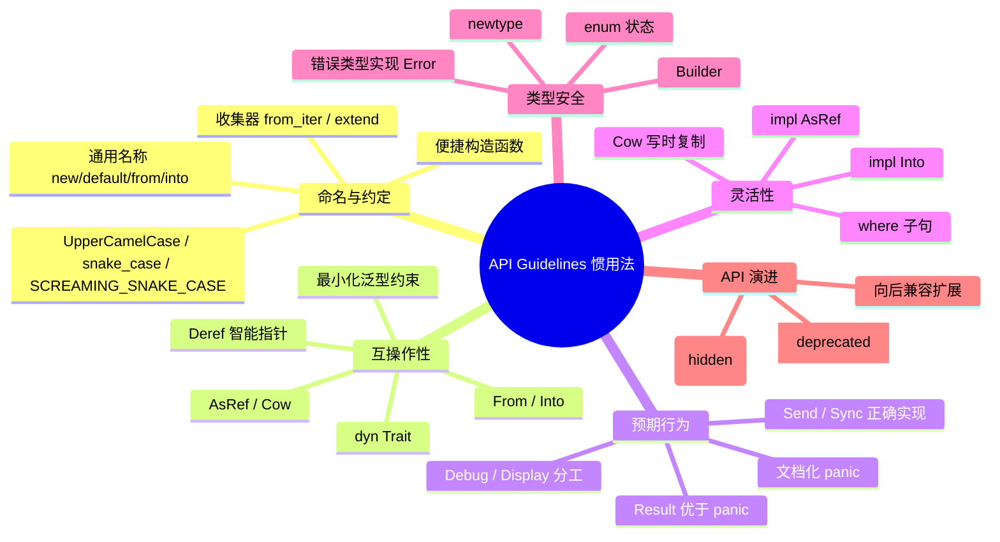

# Rust API Guidelines 惯用法语义映射

**EN**: Rust API Guidelines Idioms — Semantic Mapping
**Summary**: A line-by-line semantic mapping of the official Rust API Guidelines to idiomatic Rust patterns, with rationale, examples, anti-examples, and decision trees for API design.

> **代码状态**: ✅ 含可编译示例与 `compile_fail` 反例
> **受众**: [进阶]
> **内容分级**: [专家级]
> **权威来源**: 本文件为 `concept/` 权威页。
> **定位**: 将官方 [Rust API Guidelines](https://rust-lang.github.io/api-guidelines/) 的 30 条核心建议翻译为 Rust 惯用法与语义决策，补充 [Rust 惯用法谱系全景](02_idioms_spectrum.md) 的综述视角，并向下对齐 [API 设计模式](18_api_design_patterns.md) 中的具体工程决策。
> **Rust 版本**: 1.97.1+ (Edition 2024)
> **Bloom 层级**: L5
> **定理链**: T-166 Safe Rust 语义封闭性 → T-168 类型状态保证 → T-170 零成本抽象
>
> **来源**:
> [Rust API Guidelines](https://rust-lang.github.io/api-guidelines/) ·
> [Rust Design Patterns](https://rust-unofficial.github.io/patterns/) ·
> [Semantic Versioning 2.0.0](https://semver.org/) ·
> [RFC 1105 — API Evolution](https://rust-lang.github.io/rfcs/1105-api-evolution.html) ·
> [RFC 2457 — Non-ASCII identifiers](https://rust-lang.github.io/rfcs/2457-non-ascii-idents.html)

---

**变更日志**:

- v1.0 (2026-08-04): P7 初始版本——覆盖 API Guidelines 五大类 30 条核心建议，逐条给出语义理由、惯用写法、反例与决策树。

---

> **前置概念**: [Rust 惯用法谱系全景](02_idioms_spectrum.md) · [API 设计模式](18_api_design_patterns.md)
> **后置概念**: [Design Patterns FAQ](15_design_patterns_faq.md)

## 📑 目录

- [Rust API Guidelines 惯用法语义映射](#rust-api-guidelines-惯用法语义映射)
  - [📑 目录](#-目录)
  - [〇、API Guidelines 认知全景](#〇api-guidelines-认知全景)
  - [零、TL;DR —— 速查表](#零tldr--速查表)
  - [一、命名与约定（Naming \& Conventions）](#一命名与约定naming--conventions)
    - [C-CASE: 使用 `UpperCamelCase` / `snake_case` / `SCREAMING_SNAKE_CASE`](#c-case-使用-uppercamelcase--snake_case--screaming_snake_case)
    - [C-COMMON-NAME: 使用 Rust 社区通用名称](#c-common-name-使用-rust-社区通用名称)
    - [C-CONVENIENT: 提供便捷构造函数](#c-convenient-提供便捷构造函数)
    - [C-COLLECTOR: 收集器方法命名为 `from_iter` / `extend`](#c-collector-收集器方法命名为-from_iter--extend)
    - [C-GETTER: Getter 返回 `&T` 或 `T: Copy`](#c-getter-getter-返回-t-或-t-copy)
    - [C-PARAMETER: 参数顺序 `impl Into<T>` 放最后](#c-parameter-参数顺序-impl-intot-放最后)
  - [二、互操作性（Interoperability）](#二互操作性interoperability)
    - [C-FORWARD: 为常见 trait 实现 `From` / `Into`](#c-forward-为常见-trait-实现-from--into)
    - [C-INTERMEDIATE: 提供中间层抽象](#c-intermediate-提供中间层抽象)
    - [C-OBJECT: 用 trait object 做开放扩展](#c-object-用-trait-object-做开放扩展)
    - [C-STRUCT-BOUNDS: 结构体泛型参数限制最小化](#c-struct-bounds-结构体泛型参数限制最小化)
    - [C-SMART-PTR: 自定义智能指针实现 `Deref` / `DerefMut`](#c-smart-ptr-自定义智能指针实现-deref--derefmut)
  - [三、预期行为（Expected Behavior）](#三预期行为expected-behavior)
    - [C-VALIDATE: 用类型系统表达不变量](#c-validate-用类型系统表达不变量)
    - [C-PANIC: 不 panic 的函数要文档化](#c-panic-不-panic-的函数要文档化)
    - [C-RES-PANIC: 错误用 `Result` 而非 panic](#c-res-panic-错误用-result-而非-panic)
    - [C-DEBUG: 为自定义类型实现 `Debug`](#c-debug-为自定义类型实现-debug)
    - [C-DISPLAY: `Display` 面向用户，`Debug` 面向程序员](#c-display-display-面向用户debug-面向程序员)
    - [C-SEND-SYNC: 正确实现 `Send` / `Sync`](#c-send-sync-正确实现-send--sync)
  - [四、灵活性（Flexibility）](#四灵活性flexibility)
    - [C-GENERIC: 优先泛型而非具体类型](#c-generic-优先泛型而非具体类型)
    - [C-BOUNDS: Trait bound 用 `where` 子句](#c-bounds-trait-bound-用-where-子句)
    - [C-INTO: 接收参数用 `impl Into<T>`](#c-into-接收参数用-impl-intot)
    - [C-ASREF: 借用参数用 `impl AsRef<Path>`](#c-asref-借用参数用-impl-asrefpath)
    - [C-COW: 写时复制用 `Cow`](#c-cow-写时复制用-cow)
    - [C-OWNED: 返回 `Result<T, E>` 而非 `Option`](#c-owned-返回-resultt-e-而非-option)
  - [五、类型安全（Type Safety）](#五类型安全type-safety)
    - [C-NEWTYPE: 用 newtype 避免单位混淆](#c-newtype-用-newtype-避免单位混淆)
    - [C-ENUM: 用 enum 表达互斥状态](#c-enum-用-enum-表达互斥状态)
    - [C-BUILDER: 复杂构造用 Builder](#c-builder-复杂构造用-builder)
    - [C-MODULE: 模块隐藏实现细节](#c-module-模块隐藏实现细节)
    - [C-ERROR: 错误类型实现 `std::error::Error`](#c-error-错误类型实现-stderrorerror)
  - [六、API 演进（API Evolution）](#六api-演进api-evolution)
    - [C-STABLE: 向后兼容扩展](#c-stable-向后兼容扩展)
    - [C-HIDDEN: 隐藏实现细节](#c-hidden-隐藏实现细节)
    - [C-DEPRECATED: 用 `#[deprecated]` 标记旧 API](#c-deprecated-用-deprecated-标记旧-api)
  - [七、反命题与决策树](#七反命题与决策树)
    - [反命题 1: "API Guidelines 只是风格建议，不影响语义"](#反命题-1-api-guidelines-只是风格建议不影响语义)
    - [反命题 2: "所有函数都应泛型化以最大化灵活性"](#反命题-2-所有函数都应泛型化以最大化灵活性)
    - [决策树：选择参数类型](#决策树选择参数类型)
    - [决策树：错误处理](#决策树错误处理)
  - [八、权威来源 / International Authority References](#八权威来源--international-authority-references)
  - [九、🧭 思维导图（Mindmap）](#九-思维导图mindmap)
  - [权威来源与延伸阅读（International Authority Sources）](#权威来源与延伸阅读international-authority-sources)

---

## 〇、API Guidelines 认知全景

[Rust API Guidelines](https://rust-lang.github.io/api-guidelines/) 是 Rust 官方维护的 API 设计规范，目标是在语义层面保证库接口的：

1. **可预测性**（Predictability）：同名方法在不同 crate 中行为一致。
2. **可组合性**（Composability）：通过标准 trait（`From`/`AsRef`/`Iterator` 等）无缝接入生态。
3. **可演进性**（Evolvability）：在不破坏 SemVer 的前提下扩展功能。
4. **类型安全最大化**：把不变量推进类型系统，减少运行时断言。

本文档将 30 条核心指南映射到 Rust 惯用法，并给出「非惯用 → 惯用」的等价变换。具体工程决策与模式实现请参见 [API 设计模式](18_api_design_patterns.md)；形式化视角下的模式语义保持请参见 [形式化设计模式理论](../../04_formal/00_type_theory/11_formal_design_pattern_theory.md)；跨语言语义对比请参见 [语言语义模型矩阵](../../05_comparative/00_paradigms/05_language_semantic_model_matrix.md)。

---

## 零、TL;DR —— 速查表

| 场景 | 非惯用 | 惯用 | 指南 |
|---|---|---|---|
| 构造函数 | `Foo::new_with_size(10)` | `Foo::new(10)` / `Foo::default()` | C-CONVENIENT |
| 类型转换 | `fn parse(s: String)` | `fn parse(s: impl Into<String>)` | C-INTO |
| 错误处理 | `panic!("missing key")` | `Result<T, MyError>` | C-RES-PANIC |
| 集合构建 | 手写循环 push | `Iterator::collect()` | C-COLLECTOR |
| 路径参数 | `fn open(p: String)` | `fn open(p: impl AsRef<Path>)` | C-ASREF |
| 单位安全 | `fn move(x: f64)` | `struct Meters(f64)` | C-NEWTYPE |
| 状态互斥 | `status: u8` | `enum Status { Active, Inactive }` | C-ENUM |
| 复杂构造 | 长参数列表 | `Builder` 模式 | C-BUILDER |
| 智能指针 | 手写解引用 | `impl Deref for MyBox` | C-SMART-PTR |
| 并发边界 | 未标注 `Send`/`Sync` | 显式 `unsafe impl Send` 并文档化 | C-SEND-SYNC |

---

## 一、命名与约定（Naming & Conventions）

### C-CASE: 使用 `UpperCamelCase` / `snake_case` / `SCREAMING_SNAKE_CASE`

**语义**: 命名约定是编译器无关的类型系统外契约；统一约定降低认知负荷，使 `rustdoc`、IDE、Clippy 能一致地索引符号。

```rust
// ✅ 惯用
type UserId = u64;              // UpperCamelCase for types
const MAX_RETRIES: usize = 3;   // SCREAMING_SNAKE_CASE for constants
fn fetch_user(id: UserId) {}    // snake_case for values/functions
```

```rust
// ❌ 反例：违反约定，IDE/rustdoc 索引不一致（注释展示，非编译错误）
// type userId = u64;        // 应为 UserId
// const maxRetries: usize = 3; // 应为 MAX_RETRIES
```

**语义理由**: 命名是 API 的「表面类型」；违反约定不改变编译结果，但破坏生态一致性，等价于在类型系统外引入歧义。

---

### C-COMMON-NAME: 使用 Rust 社区通用名称

**语义**: 通用名称（`new`, `default`, `from`, `into`, `as_ref`, `to_owned`, `clone`, `drop`）与标准库/广泛使用的 crate 对齐，使用户无需阅读文档即可预测语义。

```rust
// ✅ 惯用：使用社区通用名称
use std::time::Duration;

#[derive(Default, Clone, Debug)]
pub struct Config {
    timeout: Duration,
}

impl Config {
    pub fn new() -> Self { Self::default() }
    pub fn with_timeout(mut self, timeout: Duration) -> Self {
        self.timeout = timeout;
        self
    }
}
```

**反例**: 将构造函数命名为 `create_config_instance()` 会中断用户的直觉迁移。

---

### C-CONVENIENT: 提供便捷构造函数

**语义**: `new()` 与 `default()` 是 Rust 类型构造的「零认知入口」。复杂类型应同时提供 `Default` 与逐步构造的 Builder。

```rust
// ✅ 惯用
#[derive(Default)]
pub struct ServerConfig {
    addr: String,
    port: u16,
}

impl ServerConfig {
    pub fn new() -> Self { Self::default() }
    pub fn with_addr(mut self, addr: impl Into<String>) -> Self {
        self.addr = addr.into();
        self
    }
    pub fn with_port(mut self, port: u16) -> Self {
        self.port = port;
        self
    }
}
```

---

### C-COLLECTOR: 收集器方法命名为 `from_iter` / `extend`

**语义**: `FromIterator` 与 `Extend` 是 Rust 集合的通用接口；自定义集合应实现它们，使用户能用统一的 `collect()` / `extend(iter)` 语法。

```rust
// ✅ 惯用
use std::iter::FromIterator;

#[derive(Default)]
pub struct OrderedSet<T>(Vec<T>);

impl<T: Ord> FromIterator<T> for OrderedSet<T> {
    fn from_iter<I: IntoIterator<Item = T>>(iter: I) -> Self {
        let mut inner: Vec<T> = iter.into_iter().collect();
        inner.sort();
        inner.dedup();
        Self(inner)
    }
}
```

---

### C-GETTER: Getter 返回 `&T` 或 `T: Copy`

**语义**: Getter 不应隐藏所有权的转移；返回引用保证零成本访问，返回 `Copy` 类型保证无副作用。

```rust
pub struct Point { x: f64, y: f64 }

impl Point {
    // ✅ 返回引用或 Copy 类型
    pub fn x(&self) -> f64 { self.x }
    pub fn label(&self) -> &str { &"origin" }
}
```

---

### C-PARAMETER: 参数顺序 `impl Into<T>` 放最后

**语义**: 将「接收者转换参数」放在最后，支持前导位置参数的 turbofish 与部分应用直觉。

```rust
// ✅ 惯用：目标/关键参数在前，转换参数在后
pub fn write_file(path: impl AsRef<std::path::Path>, content: impl AsRef<[u8]>)
    -> std::io::Result<()>
{
    std::fs::write(path, content)
}
```

---

## 二、互操作性（Interoperability）

### C-FORWARD: 为常见 trait 实现 `From` / `Into`

**语义**: `From`/`Into` 是 Rust 的类型态射（type morphism）；实现 `From<A> for B` 自动获得 `Into<B> for A`，并允许 `?` 错误转换。

```rust
#[derive(Debug)]
pub struct ParseIdError(String);

impl std::fmt::Display for ParseIdError {
    fn fmt(&self, f: &mut std::fmt::Formatter<'_>) -> std::fmt::Result {
        write!(f, "invalid id: {}", self.0)
    }
}
impl std::error::Error for ParseIdError {}

// ✅ 惯用：实现 From，让调用方用 ? 转换
impl From<std::num::ParseIntError> for ParseIdError {
    fn from(e: std::num::ParseIntError) -> Self {
        ParseIdError(e.to_string())
    }
}
```

---

### C-INTERMEDIATE: 提供中间层抽象

**语义**: 中间层（如 `Cow<'a, str>`、`Borrowed`/`Owned` 枚举）让 API 同时支持借用与拥有，而不强制分配。

```rust
use std::borrow::Cow;

// ✅ 惯用：返回 Cow，调用方可零成本选择借用或拥有
pub fn greeting<'a>(name: &'a str) -> Cow<'a, str> {
    if name.is_empty() {
        Cow::Borrowed("Hello, world!")
    } else {
        Cow::Owned(format!("Hello, {name}!"))
    }
}
```

---

### C-OBJECT: 用 trait object 做开放扩展

**语义**: `dyn Trait` 提供运行时多态，与泛型的静态多态互补；当变体在编译期未知或需要动态插件时选择 trait object。

```rust
// ✅ 惯用：需要动态分发时用 dyn Trait
pub trait Formatter {
    fn format(&self, record: &str) -> String;
}

pub struct Logger {
    formatter: Box<dyn Formatter + Send + Sync>,
}
```

---

### C-STRUCT-BOUNDS: 结构体泛型参数限制最小化

**语义**: 在结构体定义上施加最少约束，将约束推后到 `impl` 块；这样结构体实例化更灵活，且不会过早暴露实现细节。

```rust
// ✅ 惯用：结构体上无 bound
pub struct Stack<T> {
    items: Vec<T>,
}

// impl 块按需加 bound
impl<T: Clone> Stack<T> {
    pub fn duplicate(&self) -> Self {
        Self { items: self.items.clone() }
    }
}
```

---

### C-SMART-PTR: 自定义智能指针实现 `Deref` / `DerefMut`

**语义**: `Deref` 让自定义类型获得与引用一致的方法解析语法，是智能指针融入 Rust 借用语义的「同构嵌入」。

```rust
use std::ops::Deref;

pub struct MyBox<T>(T);

impl<T> Deref for MyBox<T> {
    type Target = T;
    fn deref(&self) -> &T { &self.0 }
}
```

---

## 三、预期行为（Expected Behavior）

### C-VALIDATE: 用类型系统表达不变量

**语义**: 把运行时断言前提到类型构造阶段，使非法状态不可表示（Making Illegal States Unrepresentable）。

```rust
// ✅ 惯用：类型状态保证正整数
#[derive(Debug, Clone, Copy)]
pub struct PositiveU32(u32);

impl PositiveU32 {
    pub fn new(n: u32) -> Option<Self> {
        if n > 0 { Some(Self(n)) } else { None }
    }
    pub fn get(&self) -> u32 { self.0 }
}
```

---

### C-PANIC: 不 panic 的函数要文档化

**语义**: panic 是未恢复的合同违约；文档化 panic 条件让用户能在调用前证明其不会触发。

```rust
/// # Panics
/// Panics if `needle` is empty.
pub fn find(haystack: &str, needle: &str) -> Option<usize> {
    assert!(!needle.is_empty(), "needle must not be empty");
    haystack.find(needle)
}
```

---

### C-RES-PANIC: 错误用 `Result` 而非 panic

**语义**: `Result` 把错误提升为返回值，使调用方成为错误处理的决策者；panic 则跳过正常控制流。

```rust
// ✅ 惯用
pub fn read_config(path: impl AsRef<std::path::Path>)
    -> Result<String, std::io::Error>
{
    std::fs::read_to_string(path)
}
```

---

### C-DEBUG: 为自定义类型实现 `Debug`

**语义**: `Debug` 是 Rust 反射/诊断基础设施的一部分；缺失 `Debug` 会导致 `unwrap()`、`assert_eq!`、日志宏无法直接使用该类型。

```rust
#[derive(Debug)]
pub struct Token { kind: String, span: (usize, usize) }
```

---

### C-DISPLAY: `Display` 面向用户，`Debug` 面向程序员

**语义**: `Display` 承诺人类可读的稳定输出；`Debug` 承诺结构化的调试信息，输出格式可在不同版本间变化。

```rust
use std::fmt;

pub struct Money { cents: u64 }

impl fmt::Display for Money {
    fn fmt(&self, f: &mut fmt::Formatter<'_>) -> fmt::Result {
        write!(f, "${}.{:.2}", self.cents / 100, self.cents % 100)
    }
}

impl fmt::Debug for Money {
    fn fmt(&self, f: &mut fmt::Formatter<'_>) -> fmt::Result {
        f.debug_struct("Money").field("cents", &self.cents).finish()
    }
}
```

---

### C-SEND-SYNC: 正确实现 `Send` / `Sync`

**语义**: `Send`/`Sync` 是 Rust 并发安全的类型级契约；错误实现会导致数据竞争 UB，必须通过 `unsafe` 并文档化不变量。

```rust
pub struct MyHandle(*mut ());

// ✅ 惯用：仅在真正线程安全时实现，并文档化 safety invariant
unsafe impl Send for MyHandle {}
unsafe impl Sync for MyHandle {}
```

---

## 四、灵活性（Flexibility）

### C-GENERIC: 优先泛型而非具体类型

**语义**: 泛型把 API 从具体类型提升为多态空间，允许调用方传入任何满足约束的类型，同时保持零成本抽象。

```rust
// ✅ 惯用
pub fn sum<I>(iter: I) -> i32
where
    I: Iterator<Item = i32>,
{
    iter.sum()
}
```

---

### C-BOUNDS: Trait bound 用 `where` 子句

**语义**: `where` 子句将约束从函数签名中解耦，提升可读性，并允许更复杂的关联类型约束。

```rust
// ✅ 惯用
use std::collections::HashMap;

pub fn merge<K, V>(a: &HashMap<K, V>, b: &HashMap<K, V>) -> HashMap<K, V>
where
    K: Eq + std::hash::Hash + Clone,
    V: Clone,
{
    let mut out = a.clone();
    out.extend(b.iter().map(|(k, v)| (k.clone(), v.clone())));
    out
}
```

---

### C-INTO: 接收参数用 `impl Into<T>`

**语义**: `Into<T>` 提供隐式转换，使 API 接受更广泛的输入类型而不增加运行时成本。

```rust
pub struct NameSetter {
    name: String,
}

impl NameSetter {
    pub fn set_name(&mut self, name: impl Into<String>) {
        self.name = name.into();
    }
}
```

---

### C-ASREF: 借用参数用 `impl AsRef<Path>`

**语义**: `AsRef` 表达「可被看作某类型引用」的协变关系，避免 forcing caller to allocate `String` or `PathBuf`.

```rust
use std::path::Path;

pub fn load<P: AsRef<Path>>(path: P) -> std::io::Result<String> {
    std::fs::read_to_string(path)
}
```

---

### C-COW: 写时复制用 `Cow`

**语义**: `Cow` 在借用足够时零分配，在需要修改时延迟分配，是「借用 vs 拥有」决策的延迟化。

```rust
use std::borrow::Cow;

pub fn normalize<'a>(s: &'a str) -> Cow<'a, str> {
    if s.contains('\r') {
        Cow::Owned(s.replace('\r', ""))
    } else {
        Cow::Borrowed(s)
    }
}
```

---

### C-OWNED: 返回 `Result<T, E>` 而非 `Option`

**语义**: 当失败有原因时，`Option` 丢失了诊断信息；`Result` 保留错误上下文，支持 `?` 传播。

```rust
// ✅ 惯用
pub fn parse_port(s: &str) -> Result<u16, &'static str> {
    s.parse().map_err(|_| "invalid port number")
}
```

---

## 五、类型安全（Type Safety）

### C-NEWTYPE: 用 newtype 避免单位混淆

**语义**: newtype 在类型层面引入单位/角色信息，使编译器拒绝无意义的操作。

```rust
#[derive(Debug, Clone, Copy, PartialEq, Eq, PartialOrd, Ord)]
pub struct Meters(u64);
#[derive(Debug, Clone, Copy, PartialEq, Eq, PartialOrd, Ord)]
pub struct Seconds(u64);

// Meters + Seconds 会在类型检查期被拒绝
```

---

### C-ENUM: 用 enum 表达互斥状态

**语义**: enum 是 tagged union，保证在同一时刻只有一个变体活跃，替代 C 风格的整数状态码。

```rust
pub enum ConnectionState {
    Disconnected,
    Connecting { attempts: u32 },
    Connected { since: std::time::Instant },
}
```

---

### C-BUILDER: 复杂构造用 Builder

**语义**: Builder 将构造过程从原子操作展开为状态转换序列，允许默认值、顺序无关、可验证的构造。

```rust
#[derive(Default)]
pub struct RequestBuilder {
    url: String,
    method: String,
}

impl RequestBuilder {
    pub fn new() -> Self { Self::default() }
    pub fn url(mut self, url: impl Into<String>) -> Self {
        self.url = url.into(); self
    }
    pub fn method(mut self, method: impl Into<String>) -> Self {
        self.method = method.into(); self
    }
    pub fn build(self) -> Request {
        Request { url: self.url, method: self.method }
    }
}

pub struct Request { url: String, method: String }
```

---

### C-MODULE: 模块隐藏实现细节

**语义**: `pub` 与 `pub(crate)` 区分外部契约与内部实现，是 Rust 的「信息隐藏」机制。

```rust
pub mod api {
    pub struct Client;
    impl Client {
        pub fn new() -> Self { Self }
    }
    // 内部辅助不暴露
    pub(crate) fn log_internal() {}
}
```

---

### C-ERROR: 错误类型实现 `std::error::Error`

**语义**: `std::error::Error` 是错误生态的通用接口；实现它后，`?`、日志、错误链都能统一处理。

```rust
#[derive(Debug)]
pub struct ConfigError { msg: String }

impl std::fmt::Display for ConfigError {
    fn fmt(&self, f: &mut std::fmt::Formatter<'_>) -> std::fmt::Result {
        write!(f, "{}", self.msg)
    }
}
impl std::error::Error for ConfigError {}
```

---

## 六、API 演进（API Evolution）

### C-STABLE: 向后兼容扩展

**语义**: SemVer 要求次版本只增功能、不破坏现有编译；新功能应通过新增方法/类型实现，而非修改现有签名。

```rust
// ✅ 向后兼容：新增方法，不改旧签名
use std::time::Duration;

pub struct Config {
    timeout: Duration,
}

impl Config {
    pub fn new() -> Self { Self { timeout: Duration::from_secs(30) } }
    // 1.1 新增
    pub fn with_timeout(self, timeout: Duration) -> Self { Self { timeout } }
}
```

---

### C-HIDDEN: 隐藏实现细节

**语义**: 使用 `#[doc(hidden)]`、`pub(crate)`、密封 trait（sealed trait）防止用户依赖不稳定实现。

```rust
mod sealed {
    pub trait Sealed {}
}

pub trait PublicTrait: sealed::Sealed {}
```

---

### C-DEPRECATED: 用 `#[deprecated]` 标记旧 API

**语义**: `#[deprecated]` 在编译期产生警告，为用户提供迁移窗口，是 API 演进的缓释机制。

```rust
use std::time::Duration;

pub struct Config {
    timeout: Duration,
}

impl Config {
    #[deprecated(since = "2.0.0", note = "use Config::with_timeout instead")]
    pub fn set_timeout(&mut self, _timeout: Duration) {
        // 保留旧实现或委托给新方法
    }
}
```

---

## 七、反命题与决策树

### 反命题 1: "API Guidelines 只是风格建议，不影响语义"

**批判**: 错误。命名约定影响生态一致性；`Result` vs panic 改变控制流；`Send`/`Sync` 实现错误会导致 UB。API Guidelines 是类型系统之外的形式契约。

### 反命题 2: "所有函数都应泛型化以最大化灵活性"

**批判**: 错误。过度泛型增加编译时间、降低错误信息可读性、暴露未经验证的组合。应在「灵活性」与「可理解性」之间权衡。

### 决策树：选择参数类型

```text
参数类型选择：
├─ 调用方已有 T 或 &T？
│  └─ 是 → 直接接收 T / &T
└─ 调用方可能有多种相关类型？
   ├─ 需要拥有 → impl Into<T>
   ├─ 只需要借用 → impl AsRef<T>
   ├─ 可能修改/写时复制 → Cow<'_, T>
   └─ 路径类 → impl AsRef<Path>
```

### 决策树：错误处理

```text
函数可能失败？
├─ 失败是正常程序路径 → Result<T, E>
├─ 失败代表 contract violation（调用方 bug）→ panic + 文档
└─ 失败不应发生且无法恢复 → panic（极少数）
```

---

## 八、权威来源 / International Authority References

1. [Rust API Guidelines](https://rust-lang.github.io/api-guidelines/) — 官方 API 设计规范。
2. [RFC 1105 — API Evolution](https://rust-lang.github.io/rfcs/1105-api-evolution.html) — SemVer 与向后兼容规则。
3. [Semantic Versioning 2.0.0](https://semver.org/) — 版本号语义。
4. [Rust Design Patterns](https://rust-unofficial.github.io/patterns/) — 社区模式目录。
5. [Pierce 2002, TAPL](https://www.cis.upenn.edu/~bcpierce/tapl/) — 类型系统基础。
6. [Felleisen 1991](https://www.cs.tufts.edu/comp/150FP/archive/matthias-felleisen/expressive-as-published.pdf) — 语言表达力理论。

---

## 九、🧭 思维导图（Mindmap）



---

> **后置概念**: [Design Patterns FAQ](15_design_patterns_faq.md) · [Rust 惯用法谱系全景](02_idioms_spectrum.md)

---

## 权威来源与延伸阅读（International Authority Sources）

- Rust Design Patterns — Idioms：<https://rust-unofficial.github.io/patterns/idioms/index.html>
- RustBelt：Rust 类型系统与 API 安全的形式化基础：<https://plv.mpi-sws.org/rustbelt/>
