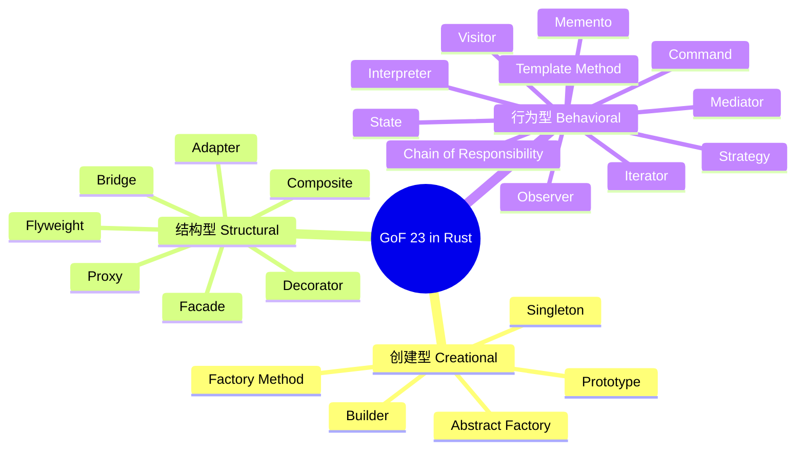
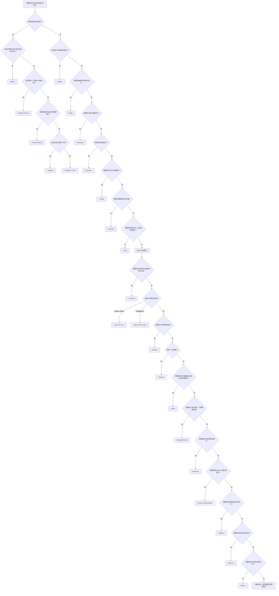

# GoF 23 设计模式 Rust 语义映射速查与深度指南

**EN**: GoF 23 Design Patterns in Rust — Semantic Mapping Cheatsheet and Deep Guide
**Summary**: A canonical quick-reference that maps all 23 Gang-of-Four patterns into Rust ownership/trait/type-system idioms, with implementation variants, trade-offs, and counterexamples.

> **Rust 版本**: 1.97.0+ (Edition 2024)
> **Bloom 层级**: L6
> **权威来源**: 本文件为 `concept/` 权威页。
> **A/S/P 标记**: S+A — Structure + Application
> **前置概念**:
> [Patterns](01_patterns.md) ·
> [Idioms Spectrum](02_idioms_spectrum.md) ·
> [Rust Design Pattern and Architecture Pattern Semantic Atlas](47_rust_design_and_architecture_patterns_semantic_atlas.md)
> **后置概念**:
> [Pattern Composition Algebra](../../04_formal/00_type_theory/12_pattern_composition_algebra.md) ·
> [Anti-patterns](33_anti_patterns.md) ·
> [API Design Patterns](18_api_design_patterns.md)
> **主要来源**:
> [GoF — Design Patterns](https://en.wikipedia.org/wiki/Design_Patterns) ·
> [Rust Design Patterns](https://rust-unofficial.github.io/patterns/) ·
> [Refactoring Guru — Design Patterns in Rust](https://refactoring.guru/design-patterns/rust)

---

## 目录

- [GoF 23 设计模式 Rust 语义映射速查与深度指南](#gof-23-设计模式-rust-语义映射速查与深度指南)
  - [目录](#目录)
  - [一、核心命题：为什么 Rust 需要独立的 GoF 语义映射](#一核心命题为什么-rust-需要独立的-gof-语义映射)
  - [二、GoF 23 全景思维导图](#二gof-23-全景思维导图)
  - [三、23 模式速查表](#三23-模式速查表)
  - [四、创建型模式 Creational Patterns](#四创建型模式-creational-patterns)
    - [4.1 Singleton（单例）](#41-singleton单例)
    - [4.2 Factory Method（工厂方法）](#42-factory-method工厂方法)
    - [4.3 Abstract Factory（抽象工厂）](#43-abstract-factory抽象工厂)
    - [4.4 Builder（生成器）](#44-builder生成器)
    - [4.5 Prototype（原型）](#45-prototype原型)
  - [五、结构型模式 Structural Patterns](#五结构型模式-structural-patterns)
    - [5.1 Adapter（适配器）](#51-adapter适配器)
    - [5.2 Bridge（桥接）](#52-bridge桥接)
    - [5.3 Composite（组合）](#53-composite组合)
    - [5.4 Decorator（装饰器）](#54-decorator装饰器)
    - [5.5 Facade（外观）](#55-facade外观)
    - [5.6 Flyweight（享元）](#56-flyweight享元)
    - [5.7 Proxy（代理）](#57-proxy代理)
  - [六、行为型模式 Behavioral Patterns](#六行为型模式-behavioral-patterns)
    - [6.1 Chain of Responsibility（职责链）](#61-chain-of-responsibility职责链)
    - [6.2 Command（命令）](#62-command命令)
    - [6.3 Interpreter（解释器）](#63-interpreter解释器)
    - [6.4 Iterator（迭代器）](#64-iterator迭代器)
    - [6.5 Mediator（中介者）](#65-mediator中介者)
    - [6.6 Memento（备忘录）](#66-memento备忘录)
    - [6.7 Observer（观察者）](#67-observer观察者)
    - [6.8 State（状态）](#68-state状态)
    - [6.9 Strategy（策略）](#69-strategy策略)
    - [6.10 Template Method（模板方法）](#610-template-method模板方法)
    - [6.11 Visitor（访问者）](#611-visitor访问者)
  - [七、多维对比矩阵](#七多维对比矩阵)
  - [八、模式选择决策树](#八模式选择决策树)
  - [九、正向/反向推理示例](#九正向反向推理示例)
    - [9.1 正向推理：从问题到模式](#91-正向推理从问题到模式)
    - [9.2 反向推理：从代码到模式](#92-反向推理从代码到模式)
  - [十、反例与误用](#十反例与误用)
  - [十一、权威来源语义对齐索引](#十一权威来源语义对齐索引)
  - [十二、工程实践映射（L5）](#十二工程实践映射l5)
  - [权威来源与延伸阅读（International Authority Sources）](#权威来源与延伸阅读international-authority-sources)

---

## 一、核心命题：为什么 Rust 需要独立的 GoF 语义映射

> **GoF 的 23 个模式诞生于继承为中心的 OOP 语境；Rust 没有类继承，却拥有所有权、生命周期、trait 与 enum 穷尽性检查。**

因此同一模式在 Rust 中往往出现**语义等价但实现形态不同**的变体：

| GoF 模式 | 传统 OOP 实现 | Rust 语义映射 |
|:---|:---|:---|
| State | 基于多态类的状态对象替换 | `enum` + `match` 或类型状态 `Context<S>` |
| Strategy | 接口/抽象类的子类注入 | 泛型参数 `T: Strategy` 或 `Box<dyn Strategy>` |
| Visitor | 双分派与类层次扩展 | `enum` + trait Visitor，新增操作不修改变体 |
| Singleton | 私有构造器 + 静态字段 | `OnceLock<T>` / `LazyLock<T>` + `&'static T` |
| Observer | 订阅者接口与回调列表 | `Rc<RefCell<dyn Subscriber>>` 或 channel/event-listener |
| Iterator | 集合类内置迭代器 | 实现 `Iterator` trait，与 `for` 循环零成本集成 |

本页提供**速查表** + **每个模式的 Rust 语义卡片**：意图、实现变体、权衡、反例。更系统的模式语义坐标、组合代数与企业架构映射请参见 [Rust Design Pattern and Architecture Pattern Semantic Atlas](47_rust_design_and_architecture_patterns_semantic_atlas.md)。

---

## 二、GoF 23 全景思维导图



---

## 三、23 模式速查表

| 模式 | 分类 | Rust 主要机制 | 分发方式 | 所有权/生命周期要点 | 深度参考 |
|:---|:---|:---|:---|:---|:---|
| **Singleton** | 创建型 | `OnceLock<T>` / `LazyLock<T>` | 静态分发 | 全局不可变借用；可变需 `Mutex` | [4.1](#41-singleton单例) |
| **Factory Method** | 创建型 | `trait Factory` + `Box<dyn Product>` | 动态/静态均可 | 工厂返回对象的所有权转移给调用者 | [4.2](#42-factory-method工厂方法) |
| **Abstract Factory** | 创建型 | 一族相关 trait（`GuiFactory`、`Button`、`Checkbox`） | 动态 trait object | 族创建器本身通常 `Box<dyn>` | [4.3](#43-abstract-factory抽象工厂) |
| **Builder** | 创建型 | 消费型/可变 builder + `build() -> Result` | 静态单态化 | 通过所有权链保证必填字段 | [4.4](#44-builder生成器) |
| **Prototype** | 创建型 | `Clone` trait / 自定义 `Prototype` trait | 静态分发 | `Rc<T>` 共享 vs `Box<T>` 深拷贝 | [4.5](#45-prototype原型) |
| **Adapter** | 结构型 | `trait Target` + wrapper struct | 静态/动态 | wrapper 持有被适配对象 | [5.1](#51-adapter适配器) |
| **Bridge** | 结构型 | 泛型抽象 `Remote<D: Device>` | 静态单态化 | 抽象与实现分离，无运行时桥接 | [5.2](#52-bridge桥接) |
| **Composite** | 结构型 | `trait Component` + `Vec<Box<dyn Component>>` | 动态 | 树形所有权递归下降 | [5.3](#53-composite组合) |
| **Decorator** | 结构型 | 泛型包装 `Milk<C: Coffee>` 或 `Box<dyn Coffee>` | 静态/动态 | 包装器获得内部组件所有权 | [5.4](#54-decorator装饰器) |
| **Facade** | 结构型 | 聚合多个子系统的 struct | 静态 | 简化接口不隐藏子系统 | [5.5](#55-facade外观) |
| **Flyweight** | 结构型 | `HashMap<K, Rc<T>>` 工厂缓存 | 静态 | 共享不可变状态；外在状态分离 | [5.6](#56-flyweight享元) |
| **Proxy** | 结构型 | 与目标同 trait 的代理 struct + 缓存/访问控制 | 动态 | 代理常需 `RefCell` 做内部可变性 | [5.7](#57-proxy代理) |
| **Chain of Responsibility** | 行为型 | `Vec<Box<dyn Handler>>` 或递归 `next` | 动态 | 链节点共享引用或所有权转移 | [6.1](#61-chain-of-responsibility职责链) |
| **Command** | 行为型 | `trait Command { fn execute(&self); fn undo(&self); }` | 动态 | 命令持有接收者引用或 `Rc` | [6.2](#62-command命令) |
| **Interpreter** | 行为型 | `enum Expr { Number, Add, Var }` + `eval` | 静态 | AST 节点递归求值 | [6.3](#63-interpreter解释器) |
| **Iterator** | 行为型 | 实现 `Iterator` trait | 静态 | 自定义 `next()` 管理状态 | [6.4](#64-iterator迭代器) |
| **Mediator** | 行为型 | 中心对象 + `Weak<RefCell<T>>` 避免循环 | 动态 | 防止同事之间的 `Rc` 强引用循环 | [6.5](#65-mediator中介者) |
| **Memento** | 行为型 | 不可变快照 struct + Caretaker 存储历史 | 静态 | 快照通过 `Clone` 实现深拷贝 | [6.6](#66-memento备忘录) |
| **Observer** | 行为型 | `Rc<RefCell<dyn Subscriber>>` 或 channel | 动态 | 订阅列表需避免循环引用 | [6.7](#67-observer观察者) |
| **State** | 行为型 | `enum` + `match` 或 `Box<dyn State>` 转换 | 静态/动态 | 状态转移消费旧状态的所有权 | [6.8](#68-state状态) |
| **Strategy** | 行为型 | 泛型 `T: Strategy` 或 `Box<dyn Strategy>` | 静态/动态 | 策略对象所有权由上下文持有 | [6.9](#69-strategy策略) |
| **Template Method** | 行为型 | `trait` 默认方法 + hook 方法 | 动态 | 骨架算法不可变；子类覆盖 hook | [6.10](#610-template-method模板方法) |
| **Visitor** | 行为型 | `enum` + `trait Visitor` + `accept` | 动态 | 访问者通过 `&mut dyn Visitor` 分派 | [6.11](#611-visitor访问者) |

---

## 四、创建型模式 Creational Patterns

### 4.1 Singleton（单例）

**意图**：保证全局只有一个实例，并提供统一访问点。

**Rust 语义映射**：没有类静态字段，使用 `std::sync::OnceLock<T>` 或 `std::sync::LazyLock<T>` 在首次访问时初始化一次，返回 `&'static T`。

**实现变体**：

```rust
use std::sync::OnceLock;

#[derive(Debug)]
struct Config {
    timeout_ms: u64,
}

impl Config {
    fn global() -> &'static Config {
        static INSTANCE: OnceLock<Config> = OnceLock::new();
        INSTANCE.get_or_init(|| Config { timeout_ms: 3000 })
    }
}

fn main() {
    let cfg = Config::global();
    println!("global timeout = {}", cfg.timeout_ms);
}
```

**权衡**：

| 维度 | 评价 |
|:---|:---|
| 线程安全 | `OnceLock` 内置线程安全；`LazyLock` 类似 |
| 可测试性 | 全局状态使单元测试间可能相互影响，建议用依赖注入替代 |
| 生命周期 | `&'static T` 永不释放；需可变时使用 `Mutex` 包装 |

**反例**：使用裸 `static mut` 是可变全局状态的典型错误。

```rust,compile_fail
static mut COUNTER: u32 = 0;

fn increment() {
    COUNTER += 1; // error[E0133]: use of mutable static is unsafe
}
```

### 4.2 Factory Method（工厂方法）

**意图**：让子类/实现决定实例化哪个类，将实例化延迟到运行时。

**Rust 语义映射**：用 `trait Product` 定义接口，`trait Factory` 声明创建方法；具体工厂实现返回具体产品（`Box<dyn Product>` 或泛型）。

```rust
trait Vehicle {
    fn drive(&self);
}

struct Car;
impl Vehicle for Car {
    fn drive(&self) { println!("driving a car"); }
}

struct Bike;
impl Vehicle for Bike {
    fn drive(&self) { println!("riding a bike"); }
}

trait VehicleFactory {
    fn create(&self) -> Box<dyn Vehicle>;
}

struct CarFactory;
impl VehicleFactory for CarFactory {
    fn create(&self) -> Box<dyn Vehicle> { Box::new(Car) }
}

struct BikeFactory;
impl VehicleFactory for BikeFactory {
    fn create(&self) -> Box<dyn Vehicle> { Box::new(Bike) }
}

fn assemble(factory: &dyn VehicleFactory) {
    factory.create().drive();
}

fn main() {
    assemble(&CarFactory);
    assemble(&BikeFactory);
}
```

**权衡**：

- 动态工厂：`Box<dyn VehicleFactory>` 运行时灵活，有虚表开销。
- 静态工厂：使用泛型参数 `F: VehicleFactory` 零成本，但丢失了运行时多态。

### 4.3 Abstract Factory（抽象工厂）

**意图**：创建相关或依赖对象的族，而无需指定具体类。

**Rust 语义映射**：一族 trait（如 `GuiFactory`、`Button`、`Checkbox`），具体族实现所有成员类型。

```rust
trait Button { fn render(&self); }
trait Checkbox { fn check(&self); }

trait GuiFactory {
    fn create_button(&self) -> Box<dyn Button>;
    fn create_checkbox(&self) -> Box<dyn Checkbox>;
}

struct WinButton;
impl Button for WinButton { fn render(&self) { println!("Windows button"); } }

struct WinCheckbox;
impl Checkbox for WinCheckbox { fn check(&self) { println!("Windows checkbox"); } }

struct WinFactory;
impl GuiFactory for WinFactory {
    fn create_button(&self) -> Box<dyn Button> { Box::new(WinButton) }
    fn create_checkbox(&self) -> Box<dyn Checkbox> { Box::new(WinCheckbox) }
}

fn render_ui(factory: Box<dyn GuiFactory>) {
    factory.create_button().render();
    factory.create_checkbox().check();
}

fn main() {
    render_ui(Box::new(WinFactory));
}
```

**权衡**：增加新的产品族容易（新增实现），但增加新的产品类型会波及所有族接口。

### 4.4 Builder（生成器）

**意图**：分步骤构造复杂对象，将构造与表示分离。

**Rust 语义映射**：消费型 builder 通过 `self` 转移所有权，配合 `Option<T>` 必填字段与 `build() -> Result<T, E>`。

```rust
#[derive(Debug)]
struct HttpRequest {
    method: String,
    url: String,
    body: Option<String>,
}

struct HttpRequestBuilder {
    method: String,
    url: Option<String>,
    body: Option<String>,
}

impl HttpRequestBuilder {
    fn new(method: impl Into<String>) -> Self {
        Self { method: method.into(), url: None, body: None }
    }

    fn url(mut self, url: impl Into<String>) -> Self {
        self.url = Some(url.into());
        self
    }

    fn body(mut self, body: impl Into<String>) -> Self {
        self.body = Some(body.into());
        self
    }

    fn build(self) -> Result<HttpRequest, &'static str> {
        let url = self.url.ok_or("url is required")?;
        Ok(HttpRequest { method: self.method, url, body: self.body })
    }
}

fn main() {
    let req = HttpRequestBuilder::new("GET")
        .url("https://example.com")
        .body("payload")
        .build()
        .unwrap();
    println!("{:?}", req);
}
```

**权衡**：

- 消费型 builder：强制线性链，防止重复使用；字段少于 3 个时属于过度工程。
- 可变 builder：`&mut self` 返回 `&mut Self` 更灵活，但可能构造不完整对象。

**反例**：消费型 builder 的所有权转移后再次使用会编译失败。

```rust,compile_fail
struct HttpRequestBuilder { url: Option<String> }
impl HttpRequestBuilder {
    fn url(&mut self, u: &str) -> &mut Self { self.url = Some(u.into()); self }
    fn build(self) -> String { self.url.unwrap() }
}

fn main() {
    let mut b = HttpRequestBuilder { url: None };
    let _req = b.build();
    b.url("next"); // error[E0382]: borrow of moved value
}
```

### 4.5 Prototype（原型）

**意图**：通过复制现有对象创建新对象，避免子类化创建器。

**Rust 语义映射**：`Clone` trait 是语言级原型机制；如需运行时多态，可自定义 `Prototype` trait 返回 `Box<dyn Prototype>`。

```rust
trait Prototype {
    fn duplicate(&self) -> Box<dyn Prototype>;
    fn describe(&self) -> String;
}

#[derive(Clone)]
struct Document {
    title: String,
}

impl Prototype for Document {
    fn duplicate(&self) -> Box<dyn Prototype> {
        Box::new(self.clone())
    }

    fn describe(&self) -> String {
        format!("Document({})", self.title)
    }
}

fn main() {
    let p: Box<dyn Prototype> = Box::new(Document { title: "draft".into() });
    let p2 = p.duplicate();
    println!("original: {}", p.describe());
    println!("duplicate: {}", p2.describe());
}
```

**权衡**：`Clone` 是零成本深拷贝；`Rc<T>` 可用作共享不可变原型。`Box<dyn Prototype>` 适用于需要统一注册表的场景，但会引入运行时分发。

---

## 五、结构型模式 Structural Patterns

### 5.1 Adapter（适配器）

**意图**：将一个类的接口转换成客户希望的另一个接口。

**Rust 语义映射**：目标 trait + wrapper struct + 为目标 trait 实现适配逻辑。

```rust
trait RoundPeg {
    fn radius(&self) -> f64;
}

struct SquarePeg { width: f64 }

struct SquarePegAdapter { peg: SquarePeg }

impl RoundPeg for SquarePegAdapter {
    fn radius(&self) -> f64 {
        self.peg.width * std::f64::consts::SQRT_2 / 2.0
    }
}

fn fits(peg: &dyn RoundPeg) -> bool {
    peg.radius() <= 10.0
}

fn main() {
    let square = SquarePeg { width: 7.0 };
    let adapter = SquarePegAdapter { peg: square };
    println!("fits: {}", fits(&adapter));
}
```

**权衡**：静态适配（泛型 wrapper）零成本；动态适配使用 `&dyn RoundPeg`，运行时灵活。

### 5.2 Bridge（桥接）

**意图**：将抽象部分与实现部分分离，使它们可以独立变化。

**Rust 语义映射**：泛型抽象持有实现接口 `D: Device`；也可使用 trait object 但会牺牲零成本。

```rust
trait Device {
    fn is_enabled(&self) -> bool;
    fn toggle(&mut self);
}

struct Radio { on: bool }
impl Device for Radio {
    fn is_enabled(&self) -> bool { self.on }
    fn toggle(&mut self) { self.on = !self.on; }
}

struct Tv { on: bool }
impl Device for Tv {
    fn is_enabled(&self) -> bool { self.on }
    fn toggle(&mut self) { self.on = !self.on; }
}

struct Remote<D: Device> { device: D }

impl<D: Device> Remote<D> {
    fn power(&mut self) { self.device.toggle(); }
    fn status(&self) -> bool { self.device.is_enabled() }
}

fn main() {
    let mut remote = Remote { device: Radio { on: false } };
    remote.power();
    println!("radio on: {}", remote.status());
}
```

**权衡**：泛型桥接无额外开销；抽象与实现独立演化。相比 Adapter 的“事后修补”，Bridge 是“事前分层”。

### 5.3 Composite（组合）

**意图**：将对象组合成树形结构以表示“部分-整体”层次。

**Rust 语义映射**：公共 trait + 叶子类型 + 容器类型持有 `Vec<Box<dyn Component>>`。

```rust
trait Graphic { fn draw(&self); }

struct Circle;
impl Graphic for Circle { fn draw(&self) { println!("circle"); } }

struct Picture { children: Vec<Box<dyn Graphic>> }

impl Graphic for Picture {
    fn draw(&self) {
        for child in &self.children { child.draw(); }
    }
}

impl Picture {
    fn add(&mut self, g: Box<dyn Graphic>) { self.children.push(g); }
}

fn main() {
    let mut root = Picture { children: vec![] };
    root.add(Box::new(Circle));
    root.add(Box::new(Picture { children: vec![Box::new(Circle)] }));
    root.draw();
}
```

**权衡**：递归所有权简单直观；但 `Box<dyn Graphic>` 有分配与虚表开销。对于同质树，可考虑 `enum Node { Leaf(Circle), Composite(Vec<Node>) }` 获得零成本静态分发。

### 5.4 Decorator（装饰器）

**意图**：动态地给对象添加额外职责。

**Rust 语义映射**：泛型包装器或 trait object 包装器，均实现同一接口。

```rust
trait Coffee {
    fn cost(&self) -> u32;
    fn description(&self) -> String;
}

struct SimpleCoffee;
impl Coffee for SimpleCoffee {
    fn cost(&self) -> u32 { 10 }
    fn description(&self) -> String { "simple".into() }
}

struct Milk<C: Coffee>(C);
impl<C: Coffee> Coffee for Milk<C> {
    fn cost(&self) -> u32 { self.0.cost() + 2 }
    fn description(&self) -> String { format!("{} + milk", self.0.description()) }
}

fn main() {
    let coffee = Milk(Milk(SimpleCoffee));
    println!("{} costs {}", coffee.description(), coffee.cost());
}
```

**权衡**：泛型装饰器零成本、类型精确；`Box<dyn Coffee>` 可运行时组合但堆分配更多。

### 5.5 Facade（外观）

**意图**：为子系统中的一组接口提供一个统一的高层接口。

**Rust 语义映射**：一个 struct 聚合多个子系统模块，方法按用例编排调用顺序。

```rust
mod subsystem {
    pub struct Amplifier;
    impl Amplifier { pub fn on(&self) { println!("amp on"); } }

    pub struct Projector;
    impl Projector { pub fn wide_screen(&self) { println!("wide screen"); } }
}

struct HomeTheater {
    amp: subsystem::Amplifier,
    projector: subsystem::Projector,
}

impl HomeTheater {
    fn watch_movie(&self) {
        self.amp.on();
        self.projector.wide_screen();
    }
}

fn main() {
    let ht = HomeTheater {
        amp: subsystem::Amplifier,
        projector: subsystem::Projector,
    };
    ht.watch_movie();
}
```

**权衡**：Facade 不封装子系统，只是减少调用方认知负荷；过度集中会导致 Facade 成为上帝对象。

### 5.6 Flyweight（享元）

**意图**：通过共享技术有效地支持大量细粒度对象。

**Rust 语义映射**：不可变共享状态放入 `Rc<T>`，外在状态保存在使用方；工厂通过 `HashMap<K, Rc<T>>` 缓存。

```rust
use std::collections::HashMap;
use std::rc::Rc;

#[derive(Clone, PartialEq, Eq, Hash, Debug)]
struct TreeType { name: String, color: String }

struct TreeTypeFactory { cache: HashMap<TreeType, Rc<TreeType>> }

impl TreeTypeFactory {
    fn get(&mut self, name: &str, color: &str) -> Rc<TreeType> {
        let key = TreeType { name: name.into(), color: color.into() };
        self.cache.entry(key.clone()).or_insert_with(|| Rc::new(key)).clone()
    }
}

struct Tree { x: i32, y: i32, kind: Rc<TreeType> }
impl Tree { fn draw(&self) { println!("{:?} at ({},{})", self.kind, self.x, self.y); } }

fn main() {
    let mut factory = TreeTypeFactory { cache: HashMap::new() };
    let t1 = Tree { x: 1, y: 2, kind: factory.get("oak", "green") };
    let t2 = Tree { x: 3, y: 4, kind: factory.get("oak", "green") };
    t1.draw();
    t2.draw();
    assert!(Rc::ptr_eq(&t1.kind, &t2.kind));
}
```

**权衡**：`Rc<T>` 适用于单线程共享；跨线程改用 `Arc<T>`。外在状态必须可分离，否则共享失效。

### 5.7 Proxy（代理）

**意图**：为其他对象提供一种代理以控制对这个对象的访问。

**Rust 语义映射**：代理 struct 与真实对象实现同一 trait；常用 `RefCell<Option<Real>>` 做延迟加载的内部可变性。

```rust
use std::cell::RefCell;

trait Image { fn display(&self); }

struct RealImage { filename: String }
impl RealImage {
    fn load(filename: &str) -> Self {
        println!("loading {}", filename);
        Self { filename: filename.into() }
    }
}
impl Image for RealImage {
    fn display(&self) { println!("display {}", self.filename); }
}

struct ProxyImage {
    filename: String,
    real: RefCell<Option<RealImage>>,
}

impl ProxyImage {
    fn new(filename: &str) -> Self {
        Self { filename: filename.into(), real: RefCell::new(None) }
    }
}

impl Image for ProxyImage {
    fn display(&self) {
        if self.real.borrow().is_none() {
            *self.real.borrow_mut() = Some(RealImage::load(&self.filename));
        }
        self.real.borrow().as_ref().unwrap().display();
    }
}

fn main() {
    let img: Box<dyn Image> = Box::new(ProxyImage::new("photo.png"));
    img.display();
    img.display(); // second call does not reload
}
```

**权衡**：保护代理、远程代理、虚拟代理都可用同一结构；注意 `RefCell` 在运行时借用失败会 panic，多线程场景应使用 `Mutex`/`RwLock`。

---

## 六、行为型模式 Behavioral Patterns

### 6.1 Chain of Responsibility（职责链）

**意图**：使多个对象都有机会处理请求，从而避免请求发送者与接收者耦合。

**Rust 语义映射**：`trait Handler` + 可选 `next: Box<dyn Handler>`；每个节点决定处理或转发。

```rust
trait Handler {
    fn handle(&self, request: &str) -> Option<&'static str>;
}

struct Auth { next: Option<Box<dyn Handler>> }
impl Handler for Auth {
    fn handle(&self, request: &str) -> Option<&'static str> {
        if request.starts_with("auth:") { return Some("auth passed"); }
        self.next.as_ref()?.handle(request)
    }
}

struct Logging { next: Option<Box<dyn Handler>> }
impl Handler for Logging {
    fn handle(&self, request: &str) -> Option<&'static str> {
        println!("log: {}", request);
        self.next.as_ref()?.handle(request)
    }
}

fn main() {
    let chain = Auth {
        next: Some(Box::new(Logging { next: None })),
    };
    println!("{:?}", chain.handle("auth:me"));
    println!("{:?}", chain.handle("other"));
}
```

**权衡**：链式结构灵活，但请求可能无人处理；节点过多时调试困难。

### 6.2 Command（命令）

**意图**：将请求封装为对象，从而支持参数化、队列、日志与撤销。

**Rust 语义映射**：`trait Command { fn execute(&self); fn undo(&self); }`，命令对象持有接收者引用。

```rust
trait Command {
    fn execute(&self);
    fn undo(&self);
}

struct Light;
impl Light {
    fn on(&self) { println!("light on"); }
    fn off(&self) { println!("light off"); }
}

struct LightOn<'a> { light: &'a Light }
impl<'a> Command for LightOn<'a> {
    fn execute(&self) { self.light.on(); }
    fn undo(&self) { self.light.off(); }
}

struct Macro<'a> { commands: Vec<Box<dyn Command + 'a>> }
impl<'a> Command for Macro<'a> {
    fn execute(&self) { for c in &self.commands { c.execute(); } }
    fn undo(&self) { for c in self.commands.iter().rev() { c.undo(); } }
}

fn main() {
    let light = Light;
    let on = LightOn { light: &light };
    on.execute();
    on.undo();

    let macro_cmd = Macro { commands: vec![Box::new(LightOn { light: &light })] };
    macro_cmd.execute();
}
```

**权衡**：命令对象保存状态可支持撤销；但每个操作一个类型会增加样板代码。

### 6.3 Interpreter（解释器）

**意图**：给定一个语言，定义它的文法表示，并定义解释器。

**Rust 语义映射**：`enum Expr` 表示 AST，`eval(&self, &Context)` 递归解释。

```rust
use std::collections::HashMap;

struct Context { vars: HashMap<String, i32> }

enum Expr {
    Number(i32),
    Add(Box<Expr>, Box<Expr>),
    Variable(String),
}

impl Expr {
    fn eval(&self, ctx: &Context) -> i32 {
        match self {
            Expr::Number(n) => *n,
            Expr::Add(l, r) => l.eval(ctx) + r.eval(ctx),
            Expr::Variable(v) => *ctx.vars.get(v).unwrap_or(&0),
        }
    }
}

fn main() {
    let ctx = Context { vars: [("x".into(), 10)].into() };
    let expr = Expr::Add(
        Box::new(Expr::Variable("x".into())),
        Box::new(Expr::Number(5)),
    );
    println!("{}", expr.eval(&ctx));
}
```

**权衡**：`enum` 穷尽性检查保证解释器不会遗漏节点类型；新增节点类型需要修改 `eval`。

### 6.4 Iterator（迭代器）

**意图**：提供一种方法顺序访问聚合对象中的各个元素，而无需暴露其内部表示。

**Rust 语义映射**：实现 `Iterator` trait，`for` 循环自动使用 `IntoIterator`。

```rust
struct StepRange { start: i32, end: i32, step: i32 }

impl Iterator for StepRange {
    type Item = i32;
    fn next(&mut self) -> Option<Self::Item> {
        if self.start >= self.end { return None; }
        let v = self.start;
        self.start += self.step;
        Some(v)
    }
}

fn main() {
    for v in (StepRange { start: 0, end: 10, step: 3 }) {
        println!("{}", v);
    }
}
```

**权衡**：自定义迭代器与标准库生态无缝集成；通过 `Iterator` 适配器可组合复杂流水线。

### 6.5 Mediator（中介者）

**意图**：用一个中介对象封装一系列对象交互，降低同事对象之间的耦合。

**Rust 语义映射**：中心 `ChatRoom` 持有同事 `User` 的弱引用，避免 `Rc` 强引用循环。

```rust
use std::cell::RefCell;
use std::rc::{Rc, Weak};

struct ChatRoom { users: RefCell<Vec<Rc<RefCell<User>>>> }

impl ChatRoom {
    fn new() -> Rc<RefCell<Self>> {
        Rc::new(RefCell::new(Self { users: RefCell::new(vec![]) }))
    }

    fn join(self_rc: &Rc<RefCell<Self>>, user: Rc<RefCell<User>>) {
        user.borrow_mut().room = Some(Rc::downgrade(self_rc));
        self_rc.borrow().users.borrow_mut().push(user);
    }

    fn send(&self, from: &str, msg: &str) {
        for u in self.users.borrow().iter() {
            let u = u.borrow();
            if u.name != from { u.receive(from, msg); }
        }
    }
}

struct User {
    name: String,
    room: Option<Weak<RefCell<ChatRoom>>>,
}

impl User {
    fn new(name: &str) -> Rc<RefCell<Self>> {
        Rc::new(RefCell::new(Self { name: name.into(), room: None }))
    }

    fn send(&self, msg: &str) {
        if let Some(room) = self.room.as_ref().and_then(|w| w.upgrade()) {
            room.borrow().send(&self.name, msg);
        }
    }

    fn receive(&self, from: &str, msg: &str) {
        println!("{} received from {}: {}", self.name, from, msg);
    }
}

fn main() {
    let room = ChatRoom::new();
    let alice = User::new("Alice");
    let bob = User::new("Bob");
    ChatRoom::join(&room, alice.clone());
    ChatRoom::join(&room, bob.clone());
    alice.borrow().send("Hi Bob");
}
```

**权衡**：集中逻辑简化同事关系，但 Mediator 本身可能演变为 God Object。使用 `Weak` 是避免内存泄漏的关键。

### 6.6 Memento（备忘录）

**意图**：在不破坏封装性的前提下捕获对象的内部状态，以便以后恢复。

**Rust 语义映射**：不可变快照 struct + `Clone`；Caretaker 负责存储历史栈。

```rust
#[derive(Clone)]
struct Memento { content: String }

struct Editor { content: String }
impl Editor {
    fn new() -> Self { Self { content: String::new() } }
    fn type_text(&mut self, s: &str) { self.content.push_str(s); }
    fn save(&self) -> Memento { Memento { content: self.content.clone() } }
    fn restore(&mut self, m: Memento) { self.content = m.content; }
}

struct Caretaker { history: Vec<Memento> }

fn main() {
    let mut editor = Editor::new();
    let mut caretaker = Caretaker { history: vec![] };

    editor.type_text("hello ");
    caretaker.history.push(editor.save());
    editor.type_text("world");
    editor.restore(caretaker.history.pop().unwrap());

    println!("{}", editor.content);
}
```

**权衡**：快照可能占用大量内存；对于大型状态，可采用增量 memento 或持久化数据结构。

### 6.7 Observer（观察者）

**意图**：定义对象间一对多依赖，当一个对象状态改变时通知所有依赖者。

**Rust 语义映射**：Publisher 持有 `Rc<RefCell<dyn Subscriber>>` 列表；调用 `notify` 时遍历回调。

```rust
use std::cell::RefCell;
use std::rc::Rc;

trait Subscriber {
    fn update(&self, event: &str);
}

struct Publisher {
    subscribers: RefCell<Vec<Rc<RefCell<dyn Subscriber>>>>,
}

impl Publisher {
    fn new() -> Self { Self { subscribers: RefCell::new(vec![]) } }
    fn subscribe(&self, sub: Rc<RefCell<dyn Subscriber>>) {
        self.subscribers.borrow_mut().push(sub);
    }
    fn notify(&self, event: &str) {
        for sub in self.subscribers.borrow().iter() {
            sub.borrow().update(event);
        }
    }
}

struct EmailSubscriber { name: String }
impl Subscriber for EmailSubscriber {
    fn update(&self, event: &str) {
        println!("{} notified: {}", self.name, event);
    }
}

fn main() {
    let publisher = Publisher::new();
    let sub = Rc::new(RefCell::new(EmailSubscriber { name: "A".into() }));
    publisher.subscribe(sub);
    publisher.notify("new article");
}
```

**权衡**：事件通道（channel）或 `event-listener` crate 更适合跨线程/异步场景；直接 `Rc` 引用容易产生循环引用。

### 6.8 State（状态）

**意图**：允许对象在内部状态改变时改变其行为。

**Rust 语义映射**：

- 静态变体：`enum State` + `match`，非法转换在编译期不可表示。
- 动态变体：`Box<dyn State>` + 消费型转换方法。

```rust
trait State {
    fn handle(self: Box<Self>) -> Box<dyn State>;
    fn name(&self) -> &'static str;
}

struct Idle;
impl State for Idle {
    fn handle(self: Box<Self>) -> Box<dyn State> {
        println!("idle -> running");
        Box::new(Running)
    }
    fn name(&self) -> &'static str { "idle" }
}

struct Running;
impl State for Running {
    fn handle(self: Box<Self>) -> Box<dyn State> {
        println!("running -> idle");
        Box::new(Idle)
    }
    fn name(&self) -> &'static str { "running" }
}

struct Context { state: Option<Box<dyn State>> }
impl Context {
    fn new() -> Self { Self { state: Some(Box::new(Idle)) } }
    fn request(&mut self) {
        if let Some(s) = self.state.take() {
            self.state = Some(s.handle());
        }
    }
}

fn main() {
    let mut ctx = Context::new();
    ctx.request();
    ctx.request();
}
```

**权衡**：动态状态对象支持运行时插件；静态 `enum` 状态机能利用穷尽性检查防止遗漏转换。对于状态空间小的场景，优先使用 `enum`。

**反例**：用 `String` 表示状态并手写 `match` 容易遗漏分支。

```rust,compile_fail
enum State { Idle, Running }
fn transition(s: State) -> State {
    match s {
        State::Idle => State::Running,
        // error[E0004]: non-exhaustive patterns: `Running` not covered
    }
}
```

### 6.9 Strategy（策略）

**意图**：定义算法族，分别封装，让它们可以互相替换。

**Rust 语义映射**：泛型参数 `S: Strategy` 实现零成本静态策略；`Box<dyn Strategy>` 实现运行时策略。

```rust
trait Strategy { fn execute(&self, a: i32, b: i32) -> i32; }

struct Add;
impl Strategy for Add { fn execute(&self, a: i32, b: i32) -> i32 { a + b } }

struct Mul;
impl Strategy for Mul { fn execute(&self, a: i32, b: i32) -> i32 { a * b } }

struct Calculator<S: Strategy> { strategy: S }
impl<S: Strategy> Calculator<S> {
    fn new(strategy: S) -> Self { Self { strategy } }
    fn compute(&self, a: i32, b: i32) -> i32 { self.strategy.execute(a, b) }
}

fn main() {
    let calc = Calculator::new(Add);
    println!("{}", calc.compute(2, 3));
}
```

**权衡**：泛型策略无运行时开销，但每种策略产生一个单态化代码副本；`dyn` 策略减少代码体积，但有虚表调用。

**反例**：只有一种算法时使用 `Box<dyn Strategy>` 是过度抽象。

```rust,ignore
// 反模式：无多态需求却引入 trait object
trait Strategy { fn run(&self); }
struct MyOnlyStrategy;
impl Strategy for MyOnlyStrategy { fn run(&self) {} }
fn main() {
    let _s: Box<dyn Strategy> = Box::new(MyOnlyStrategy);
}
```

### 6.10 Template Method（模板方法）

**意图**：在父类中定义算法骨架，将某些步骤延迟到子类。

**Rust 语义映射**：`trait` 提供带默认实现的 `mine` 方法，子 trait/type 实现 hook 方法。

```rust
trait DataMiner {
    fn mine(&self, path: &str) {
        let data = self.open(path);
        let rows = self.parse(&data);
        self.analyze(&rows);
        self.send_report();
    }
    fn open(&self, path: &str) -> String;
    fn parse(&self, raw: &str) -> Vec<String>;
    fn analyze(&self, rows: &[String]);
    fn send_report(&self) { println!("report sent"); }
}

struct CsvMiner;
impl DataMiner for CsvMiner {
    fn open(&self, path: &str) -> String { format!("csv:{path}") }
    fn parse(&self, raw: &str) -> Vec<String> { raw.split(',').map(String::from).collect() }
    fn analyze(&self, rows: &[String]) { println!("analyzed {} rows", rows.len()); }
}

fn main() {
    let miner: Box<dyn DataMiner> = Box::new(CsvMiner);
    miner.mine("data.csv");
}
```

**权衡**：默认 trait 方法提供骨架，hook 方法可覆盖；`dyn DataMiner` 允许多态集合，但 `mine` 默认方法在 trait object 中仍可用。

### 6.11 Visitor（访问者）

**意图**：表示作用于某对象结构中各元素的操作，使你可以在不改变元素类的前提下定义新操作。

**Rust 语义映射**：`enum` 定义元素族，`trait Visitor` 定义操作，`accept(&mut dyn Visitor)` 进行分派。

```rust
enum Shape {
    Circle { radius: f64 },
    Rectangle { width: f64, height: f64 },
}

trait Visitor {
    fn visit_circle(&mut self, radius: f64);
    fn visit_rectangle(&mut self, width: f64, height: f64);
}

struct AreaVisitor { area: f64 }
impl Visitor for AreaVisitor {
    fn visit_circle(&mut self, r: f64) { self.area += std::f64::consts::PI * r * r; }
    fn visit_rectangle(&mut self, w: f64, h: f64) { self.area += w * h; }
}

impl Shape {
    fn accept(&self, visitor: &mut dyn Visitor) {
        match self {
            Shape::Circle { radius } => visitor.visit_circle(*radius),
            Shape::Rectangle { width, height } => visitor.visit_rectangle(*width, *height),
        }
    }
}

fn main() {
    let shapes = vec![
        Shape::Circle { radius: 1.0 },
        Shape::Rectangle { width: 2.0, height: 3.0 },
    ];
    let mut visitor = AreaVisitor { area: 0.0 };
    for s in &shapes { s.accept(&mut visitor); }
    println!("{}", visitor.area);
}
```

**权衡**：新增操作容易（新增 Visitor），新增元素类型难（需修改所有 Visitor）。`enum` 穷尽性检查可强制更新。

**反例**：新增元素类型后未更新 Visitor 会导致非穷尽匹配。

```rust,compile_fail
enum Shape { Circle(f64), Rectangle(f64, f64) }
fn area(s: &Shape) -> f64 {
    match s {
        Shape::Circle(r) => std::f64::consts::PI * r * r,
        // error[E0004]: non-exhaustive patterns: `Rectangle` not covered
    }
}
```

---

## 七、多维对比矩阵

| 模式 | 主要分发方式 | 运行时分配 | 编译期状态安全 | 扩展操作 | 扩展元素类型 |
|:---|:---|:---:|:---:|:---:|:---:|
| Builder | 静态单态化 | 无 | 中（必填字段 `Option`） | — | — |
| Adapter | 静态/动态 | 可选 | 高 | 低 | 低 |
| Bridge | 静态泛型 | 无 | 高 | 高 | 高 |
| Composite | 动态 trait object | 有 | 中 | 中 | 中 |
| Decorator | 静态泛型 | 无 | 高 | 高 | 低 |
| Proxy | 动态 trait object | 有 | 中 | 中 | 低 |
| State (`enum`) | 静态 match | 无 | **高**（穷尽性） | 中 | 低 |
| State (`dyn`) | 动态 | 有 | 低 | 高 | 高 |
| Strategy (泛型) | 静态单态化 | 无 | 高 | 高 | 低 |
| Strategy (`dyn`) | 动态 | 有 | 中 | 高 | 低 |
| Visitor | 动态 | 有 | 高（`enum` 穷尽性） | **高** | 低 |
| Command | 动态 | 有 | 中 | 高 | 低 |

> **解读**：Rust 优先选择能在编译期证明正确性的模式变体（`enum` State、泛型 Strategy、泛型 Bridge/Decorator）。当需要运行时插件化或异构集合时，再退回到 `Box<dyn Trait>`。

---

## 八、模式选择决策树



---

## 九、正向/反向推理示例

### 9.1 正向推理：从问题到模式

**问题**：一个 HTTP 客户端 SDK 的 `Request` 有 method、url、headers、body、timeout 等多个可选字段，用户经常忘记必填的 url，且不同客户端库对 header 默认值理解不一致。

**推理链**：

1. 核心风险是构造不完整对象 → 需要分步构造。
2. 必填字段应在编译期或构造时被强制检查 → 选择消费型 Builder + `build() -> Result`。
3. 多个可选字段不影响类型安全 → 用 `Option<T>` 存储，链式调用设置。
4. 不需要运行时切换构造算法 → 不用 Factory Method/Abstract Factory。

**结论**：使用 **Builder** 模式。

```rust
struct RequestBuilder { url: Option<String>, body: Option<String> }
impl RequestBuilder {
    fn url(mut self, url: impl Into<String>) -> Self { self.url = Some(url.into()); self }
    fn body(mut self, body: impl Into<String>) -> Self { self.body = Some(body.into()); self }
    fn build(self) -> Result<Request, &'static str> {
        let url = self.url.ok_or("url required")?;
        Ok(Request { url, body: self.body })
    }
}
struct Request { url: String, body: Option<String> }

fn main() {
    let req = RequestBuilder { url: None, body: None }
        .url("https://example.com")
        .build()
        .unwrap();
    println!("{}", req.url);
}
```

### 9.2 反向推理：从代码到模式

**代码片段**：

```rust
trait Command {
    fn execute(&self);
    fn undo(&self);
}

struct Macro<'a> { commands: Vec<Box<dyn Command + 'a>> }
impl<'a> Command for Macro<'a> {
    fn execute(&self) { for c in &self.commands { c.execute(); } }
    fn undo(&self) { for c in self.commands.iter().rev() { c.undo(); } }
}
```

**推理链**：

1. 存在一个统一接口 `Command`，封装“执行”与“撤销”操作。
2. `Macro` 持有多个命令并按顺序/逆序调用 → 这是命令的组合（composite command）。
3. 调用方无需知道接收者细节 → 请求被参数化为对象。

**结论**：这是 **Command** 模式，并且引入了组合命令的变体。

---

## 十、反例与误用

| 反模式 | 错误描述 | Rust 后果 | 推荐替代 |
|:---|:---|:---|:---|
| **裸 `static mut` 单例** | 用可变全局变量实现 Singleton | 编译错误（除非 `unsafe`），且数据竞争 | `OnceLock<Mutex<T>>` 或依赖注入 |
| **Builder 所有权误用** | 构造后复用 builder | `E0382` 借用/移动错误 | 消费型 builder 或使用 `&mut self` |
| **单一策略的 `dyn` 抽象** | 只有一种算法仍用 `Box<dyn Strategy>` | 无收益，引入虚表和堆分配 | 直接使用函数或泛型 |
| **Stringly 状态机** | 用 `String` 表示状态并手写 `match` | 非法转移成为运行时 bug | `enum` + 穷尽性检查或 Typestate |
| **Visitor 遗漏新变体** | 新增 `enum` 变体后未更新 Visitor | `E0004` 非穷尽匹配 | 利用编译器强制更新所有 match |
| **Observer 强引用循环** | Publisher 与 Subscriber 互相 `Rc` 强引用 | 内存泄漏 | 使用 `Weak`、channel 或事件总线 |
| **Mediator 上帝对象** | Mediator 承担所有业务逻辑 | 单一模块膨胀、测试困难 | 按领域拆分多个 Mediator |
| **Proxy 直接返回 `&mut`** | 在 `&self` trait 方法里直接修改字段 | 违反借用规则 | 使用 `RefCell`/`Mutex` 等内部可变性 |

---

## 十一、权威来源语义对齐索引

| 模式 | GoF / Refactoring Guru 语义 | Rust 生态语义 | 对齐状态 | 备注 |
|:---|:---|:---|:---:|:---|
| Singleton | 全局唯一实例 + 统一访问点 | `OnceLock`/`LazyLock` 提供线程安全一次性初始化 | ✅ 对齐 | Rust 没有类静态字段，语义等价 |
| Factory Method | 子类决定实例化类 | `trait Factory` + `Box<dyn Product>` | ✅ 对齐 | Rust 用 trait 替代抽象类 |
| Abstract Factory | 创建相关对象族 | 一族相关 trait | ✅ 对齐 | 与 Bridge 配合可实现平台抽象 |
| Builder | 分步构造复杂对象 | 消费型 builder + `Result` | ✅ 对齐 | Rust 所有权链强化必填校验 |
| Prototype | 通过复制创建对象 | `Clone` trait / `Box<dyn Prototype>` | ✅ 对齐 | `Clone` 是语言级原型机制 |
| Adapter | 接口转换 | wrapper struct + 目标 trait | ✅ 对齐 | 静态/动态两种实现 |
| Bridge | 抽象与实现解耦 | 泛型抽象 `Remote<D: Device>` | ✅ 对齐 | 零成本桥接 |
| Composite | 部分-整体树 | `Vec<Box<dyn Component>>` / `enum Node` | ✅ 对齐 | 同质树推荐 `enum` |
| Decorator | 动态附加职责 | 泛型 wrapper / `Box<dyn>` | ✅ 对齐 | 泛型装饰器零成本 |
| Facade | 统一高层接口 | 聚合子系统的 struct | ✅ 对齐 | 不隐藏子系统 |
| Flyweight | 共享细粒度对象 | `Rc<T>` + `HashMap` 缓存 | ✅ 对齐 | 外在状态必须可分离 |
| Proxy | 控制对象访问 | 同 trait 代理 + `RefCell` 缓存 | ✅ 对齐 | 注意内部可变性选择 |
| Chain of Responsibility | 多对象依次处理请求 | `Vec<Box<dyn Handler>>` | ✅ 对齐 | 可能请求落空 |
| Command | 封装请求为对象 | `trait Command` + undo | ✅ 对齐 | 生命周期由借用/Rc 管理 |
| Interpreter | 文法解释 | `enum` AST + 递归 `eval` | ✅ 对齐 | `enum` 穷尽性检查保护 |
| Iterator | 顺序访问聚合元素 | `Iterator` trait | ✅ 对齐 | 零成本抽象 |
| Mediator | 封装同事交互 | `Rc<RefCell<ChatRoom>>` + `Weak` | ✅ 对齐 | 防止循环引用 |
| Memento | 捕获与恢复状态 | `Clone` 快照 + Caretaker | ✅ 对齐 | 不可变快照更安全 |
| Observer | 一对多通知 | `Rc<RefCell<dyn Subscriber>>` | ✅ 对齐 | 跨线程改用 channel |
| State | 状态改变行为 | `enum` / `Box<dyn State>` | ✅ 对齐 | `enum` 优先 |
| Strategy | 算法族互换 | 泛型 / `Box<dyn>` | ✅ 对齐 | 泛型零成本 |
| Template Method | 算法骨架 + hook | trait 默认方法 | ✅ 对齐 | `dyn` 可用默认方法 |
| Visitor | 操作与结构分离 | `enum` + `trait Visitor` | ✅ 对齐 | 新增操作容易，新增元素难 |

---

> **延伸阅读**：
>
> - [Rust Design Pattern and Architecture Pattern Semantic Atlas](47_rust_design_and_architecture_patterns_semantic_atlas.md) — 模式的语义坐标、组合代数、企业架构映射。
> - [Pattern Composition Algebra](../../04_formal/00_type_theory/12_pattern_composition_algebra.md) — 模式之间的形式化组合关系。
> - [Anti-patterns](33_anti_patterns.md) — 设计模式误用与重构建议。

---

## 十二、工程实践映射（L5）

GoF 模式在 Rust 企业级系统中的典型组合：

| 系统类型 | 常用模式组合 | 权威实践入口 |
|:---|:---|:---|
| Web 服务 | Factory + Strategy + Repository + Builder | [`../14_enterprise_architecture/10_production_rust_web_service_patterns.md`](../14_enterprise_architecture/10_production_rust_web_service_patterns.md) |
| 微服务 | Facade + Proxy + Circuit Breaker + Event Sourcing | [`../14_enterprise_architecture/08_microservices_patterns_in_rust.md`](../14_enterprise_architecture/08_microservices_patterns_in_rust.md) |
| 事件驱动系统 | Observer + Mediator + Saga + Outbox | [`../14_enterprise_architecture/11_event_driven_and_cqrs_patterns.md`](../14_enterprise_architecture/11_event_driven_and_cqrs_patterns.md) |
| 云原生/Serverless | Adapter + Decorator + Sidecar | [`../14_enterprise_architecture/12_cloud_native_and_serverless_patterns.md`](../14_enterprise_architecture/12_cloud_native_and_serverless_patterns.md) |

---

## 权威来源与延伸阅读（International Authority Sources）

- GoF 原书（*Design Patterns: Elements of Reusable Object-Oriented Software*）：[ACM Digital Library](https://dl.acm.org/doi/10.5555/186897)
- Refactoring Guru — Design Patterns in Rust：<https://refactoring.guru/design-patterns/rust>
- Rust Design Patterns book：<https://rust-unofficial.github.io/patterns/>
- The Rust Programming Language（TRPL，Rust 官方基线）：<https://doc.rust-lang.org/book/>
