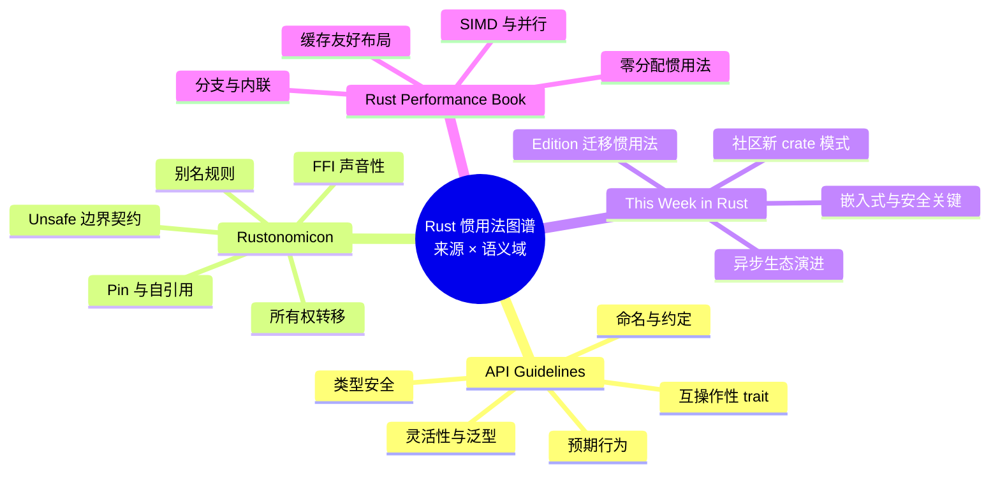
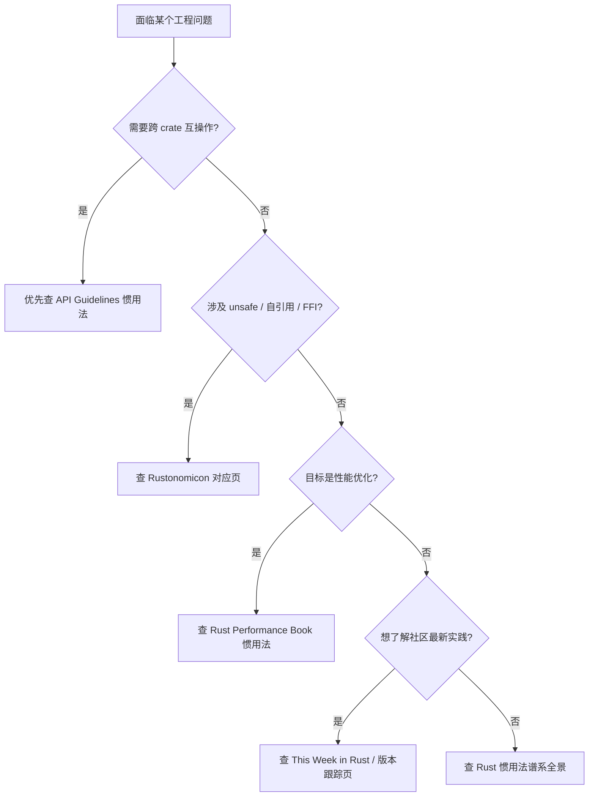

# Rust 惯用法全面图谱（Rust Idioms Atlas）

> **EN**: Rust Idioms Atlas
> **Summary**: A cross-authority navigation atlas that maps Rust idioms to the Rust API Guidelines, The Rustonomicon, This Week in Rust, and the Rust Performance Book, linking each idiom to its canonical concept page and semantic domain.
> **Rust 版本**: 1.97.1+ (Edition 2024)
> **Bloom 层级**: L6
> **权威来源**: 本文件为 `concept/` 权威页。

> **定位**: 本页是「Rust 惯用法」主题的**导航型权威页**，不重复展开各惯用法的完整语义，而是从四大国际权威来源的视角建立索引、语义域映射与选型路径。每个惯用法的深度解释请参见 [`02_idioms_spectrum.md`](02_idioms_spectrum.md) 或对应专题页。

> **前置概念**: [Rust 惯用法谱系全景](02_idioms_spectrum.md) · [Rust API Guidelines 惯用法语义映射](48_api_guidelines_idioms.md)
> **后置概念**: [Rust 反模式与陷阱图谱](51_anti_patterns_and_pitfalls.md) · [Rust 性能惯用法](52_performance_idioms.md)

> **来源**:
> [Rust API Guidelines](https://rust-lang.github.io/api-guidelines/) ·
> [The Rustonomicon](https://doc.rust-lang.org/nomicon/index.html) ·
> [This Week in Rust](https://this-week-in-rust.org/) ·
> [Rust Performance Book](https://nnethercote.github.io/perf-book/) ·
> [Jung et al. — RustBelt: Securing the Foundations of Rust](https://plv.mpi-sws.org/rustbelt/popl18/)

---

## 〇、图谱认知框架



**图谱目标**：

1. **单一入口**：从任一权威来源或语义域快速定位到 `concept/` 中的 canonical 解释。
2. **避免重复**：本页只给出「是什么、在哪、与谁相关」，不展开等价变换、定理链或形式化证明。
3. **动态对齐**：当 Rust 版本演进或社区最佳实践变化时，只需更新对应专题页和本索引。

---

## 一、权威来源与惯用法分层

| 权威来源 | 关注层级 | 核心语义 | 本库对应权威页 |
|---|---|---|---|
| **Rust API Guidelines** | L2–L5 接口与 API 设计 | 可预测性、可组合性、SemVer 演进 | [`48_api_guidelines_idioms.md`](48_api_guidelines_idioms.md)、[`39_api_design_and_semver_idioms.md`](39_api_design_and_semver_idioms.md) |
| **The Rustonomicon** | L3–L5 资源与 Unsafe | 所有权、别名、Pin、FFI、内存安全契约 | [`Unsafe Rust`](../../03_advanced/02_unsafe/01_unsafe.md)、[`FFI 模式`](../../03_advanced/04_ffi/07_ffi_patterns.md)、[`Pin 与 Unpin`](../../03_advanced/01_async/08_pin_unpin.md) |
| **This Week in Rust** | L5–L7 生态与趋势 | 新兴 crate、迁移路径、社区共识 | [`Rust 1.97 稳定特性`](../../07_future/00_version_tracking/rust_1_97_stabilized.md)、[`07_future/`](../../07_future/README.md) |
| **Rust Performance Book** | L4–L6 性能工程 | 测量、分配、缓存、SIMD、并行 | 本页 [`52_performance_idioms.md`](52_performance_idioms.md)、[`所有权性能优化`](../../03_advanced/06_low_level_patterns/06_ownership_performance_optimization.md) |

---

## 二、来源 × 语义域 惯用法矩阵

下表将四大来源中反复出现的惯用法映射到本库的 canonical 页。同一单元格内按「常用 → 高级」排序。

| 语义域 | Rust API Guidelines | The Rustonomicon | This Week in Rust | Rust Performance Book |
|---|---|---|---|---|
| **所有权与生命周期** | `Into`/`From` 隐式转移；`Cow<T>` 写时克隆；`AsRef`/`Borrow` 参数化 | `ManuallyDrop` 显式析构；`MaybeUninit` 未初始化内存；`Pin` 自引用 | `scopeguard` 延迟清理；跨 await 的 `Send` 边界 | 栈上分配；复用缓冲区；避免 `Box` 热路径 |
| **类型系统** | Newtype；Typestate；`TryFrom` 安全转换；Builder | `PhantomData` 标记变型；零大小能力标记 | 过程宏驱动 DSL；GAT 异步 trait | SoA/AoS 布局；对齐与 `repr(C)` |
| **错误处理** | `Result` 优先于 panic；`std::error::Error`；`must_use` | 异常安全（exception safety）；`catch_unwind` 边界 | `thiserror`/`anyhow` 生态选择 | 热路径避免 `Result` 分支膨胀 |
| **迭代器与集合** | `FromIterator`/`Extend`；`collect()`；迭代器消费链 | 手动 `Iterator` 实现的安全契约 | `itertools` 扩展模式 | 惰性求值；预分配容量；零拷贝切片 |
| **并发与异步** | `Send`/`Sync` 显式实现；`Mutex`/`RwLock` 选型 | 无锁结构的 epoch/内存序；alias 规则 | `tokio::sync::Mutex` 跨 await；structured concurrency | 无锁原子操作；避免 false sharing |
| **Unsafe 与 FFI** | 公开 `unsafe` 必须附安全文档 | `unsafe` 块最小化；FFI 声音性；transmute 禁区 | `bindgen`/`cxx` 工作流 | `#[inline]`/`#[cold]`；内联汇编边界 |
| **API 设计** | 命名约定；`impl Into<T>`；`AsRef<Path>`；semver 演进 | 公开类型必须满足不变量 | 版本迁移惯用法；新 Edition 适配 | 公开接口避免隐藏分配 |
| **宏与元编程** | 默认 trait 方法；扩展 trait | 过程宏卫生性；声明宏 TT-munching | `paste`/`seq_macro`；编译期生成 | 减少过程宏展开开销 |

---

## 三、API Guidelines 惯用法速查

Rust API Guidelines 的 30 条核心建议已在 [`48_api_guidelines_idioms.md`](48_api_guidelines_idioms.md) 中逐条语义化。本图谱只给出**来源 → 惯用法 → 目标页**的速查入口：

| 指南缩写 | 惯用法 | 目标页 |
|---|---|---|
| C-CONVENIENT / C-DEFAULT | `new()` / `default()` 构造函数 | [`48_api_guidelines_idioms.md`](48_api_guidelines_idioms.md) |
| C-INTO / C-ASREF | `impl Into<T>` / `impl AsRef<Path>` | [`02_idioms_spectrum.md`](02_idioms_spectrum.md) |
| C-NEWTYPE / C-ENUM | Newtype、Typestate、穷尽枚举 | [`02_idioms_spectrum.md`](02_idioms_spectrum.md) |
| C-SEND-SYNC | 显式 `unsafe impl Send` 并文档化 | [`Send/Sync 边界判定`](../../03_advanced/00_concurrency/04_send_sync_boundaries.md) |
| C-ERROR / C-DEBUG | 自定义错误实现 `std::error::Error`；`Debug`/`Display` 分离 | [`Rust 错误处理惯用法`](../../02_intermediate/03_error_handling/05_error_idioms.md) |

---

## 四、Rustonomicon 惯用法

The Rustonomicon 的核心贡献是阐明「为什么某些写法在 Rust 中是安全的或不安全的」。与本库对应关系：

| Nomicon 主题 | 惯用法 | 本库 canonical 页 |
|---|---|---|
| 所有权与转移 | 通过 `Into`/`mem::replace` 显式转移；避免部分 move 陷阱 | [`Move 语义`](../../01_foundation/01_ownership_borrow_lifetime/05_move_semantics.md) |
| 别名规则 | `&mut T` 排他性；`UnsafeCell` 是合法别名出口 | [`内部可变性`](../../02_intermediate/02_memory_management/02_interior_mutability.md) |
| 未初始化内存 | 使用 `MaybeUninit<T>`，禁止 `std::mem::uninitialized` | [`MaybeUninit`](../../03_advanced/02_unsafe/04_unsafe_rust_patterns.md) |
| Pin 与自引用 | 安全的 Pin 投影模式；禁止未经 `pin_project` 的手工投影 | [`Pin 与 Unpin`](../../03_advanced/01_async/08_pin_unpin.md) |
| FFI | `unsafe extern` block；C ABI 与生命周期契约；声音性文档 | [`FFI 模式`](../../03_advanced/04_ffi/07_ffi_patterns.md) |
| Drop 与泄漏 | `mem::forget` 不触发 UB，但会泄漏资源；`ManuallyDrop` 控制析构 | [`RAII 与 Scopeguard`](34_ownership_as_resource_management.md)、[`Scope Guard`](35_scope_guard_and_deferred_cleanup.md) |

---

## 五、This Week in Rust 社区惯用法

This Week in Rust 是社区最佳实践的**时间切片**。本页将其归纳为四类信号，链接到版本跟踪与生态页：

| 信号类别 | 典型惯用法 | 跟踪页 |
|---|---|---|
| **稳定特性采用** | `let chains`、const trait impl 预览、GAT 落地 | [`Rust 版本跟踪`](../../07_future/00_version_tracking/01_rust_version_tracking.md) |
| **crate 生态共识** | `anyhow`/`thiserror`、serde 属性模式、tracing 结构化日志 | [`Serde 序列化模式`](../../02_intermediate/00_traits/03_serde_patterns.md)、[`错误处理惯用法`](../../02_intermediate/03_error_handling/05_error_idioms.md) |
| **Edition 迁移** | `unsafe extern blocks`、RPITIT、异步闭包 | [`Edition 2024 完全指南`](../../07_future/01_edition_roadmap/02_edition_guide.md) |
| **嵌入式 / 安全关键** | RTIC/Embassy 任务模型、`defmt` 日志、Ferrocene | [`Embassy 框架`](../../06_ecosystem/05_systems_and_embedded/34_embassy_framework_deep_dive.md)、[`Ferrocene`](../../07_future/02_preview_features/12_ferrocene_preview.md) |

---

## 六、Rust Performance Book 惯用法

Rust Performance Book 的系统性建议已集中在 [`52_performance_idioms.md`](52_performance_idioms.md)。本图谱给出**核心入口**：

| 性能主题 | 惯用法 | 目标页 |
|---|---|---|
| 测量与归因 | Criterion、perf、flamegraph；先测量再优化 | [`52_performance_idioms.md`](52_performance_idioms.md) |
| 分配控制 | `with_capacity`、`reserve`、`Cow`、`&str` | [`52_performance_idioms.md`](52_performance_idioms.md) |
| 缓存与布局 | SoA、对齐、`#[repr(C)]`、避免间接跳转 | [`52_performance_idioms.md`](52_performance_idioms.md) |
| 分支与内联 | `#[cold]`、`std::hint::likely` / `unlikely`、`#[inline]` | [`52_performance_idioms.md`](52_performance_idioms.md) |
| SIMD 与并行 | `std::simd`、Rayon、`rayon::par_iter` | [`52_performance_idioms.md`](52_performance_idioms.md) |

---

## 七、惯用法选型决策树



代码示例：根据来源选择惯用接口。

```rust
use std::path::Path;

// API Guidelines: 接收路径用 impl AsRef<Path>，提升互操作性
pub fn open_config<P: AsRef<Path>>(path: P) -> std::io::Result<String> {
    std::fs::read_to_string(path)
}

// Performance Book: 预分配容量，避免循环中多次扩容
pub fn even_numbers(src: &[i32]) -> Vec<i32> {
    let mut out = Vec::with_capacity(src.len() / 2);
    out.extend(src.iter().filter(|&&x| x % 2 == 0).copied());
    out
}

fn main() {
    let nums = vec![1, 2, 3, 4, 5, 6];
    assert_eq!(even_numbers(&nums), vec![2, 4, 6]);
}
```

---

## 八、反例：图谱误用

| 误用 | 后果 | 正确做法 |
|---|---|---|
| 把导航页当定义页，重复展开惯用法细节 | 与 [`02_idioms_spectrum.md`](02_idioms_spectrum.md) 等页内容重叠，触发去重门 | 在本页只保留索引与链接，详情进入对应专题页 |
| 忽视版本约束，直接套用 TWiR 新特性 | 在旧版 rustc 上编译失败 | 检查目标页顶部的 **Rust 版本** 声明 |
| 来源混用，不看语义域 | API Guidelines 的 `impl Into<T>` 不适用于所有性能敏感上下文 | 按「来源 → 语义域 → 目标页」三层决策 |

---

## 九、权威来源与延伸阅读

- **Rust API Guidelines**: <https://rust-lang.github.io/api-guidelines/>
- **The Rustonomicon**: <https://doc.rust-lang.org/nomicon/index.html>
- **This Week in Rust**: <https://this-week-in-rust.org/>
- **Rust Performance Book**: <https://nnethercote.github.io/perf-book/>
- **Rust Design Patterns**: <https://rust-unofficial.github.io/patterns/>

相关概念页：

- [Rust 惯用法谱系全景](02_idioms_spectrum.md)
- [Rust API Guidelines 惯用法语义映射](48_api_guidelines_idioms.md)
- [工程实践与生产级模式](13_engineering_and_production_patterns.md)
- [语言语义模型矩阵](../../05_comparative/00_paradigms/05_language_semantic_model_matrix.md)
- [Rust 反模式](33_anti_patterns.md)
- [Rust 反模式与陷阱图谱](51_anti_patterns_and_pitfalls.md)
- [Rust 性能惯用法](52_performance_idioms.md)
