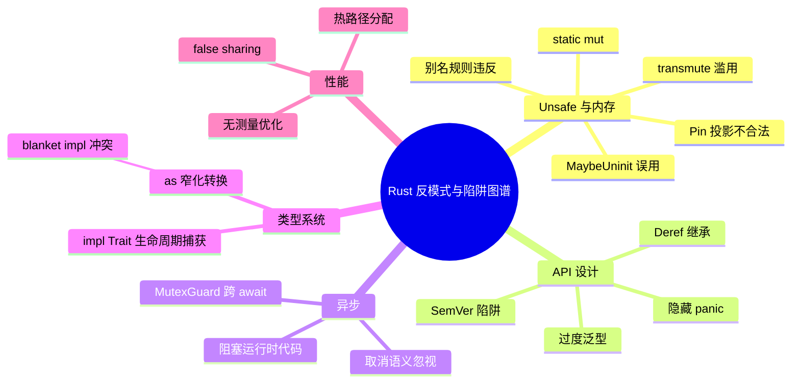
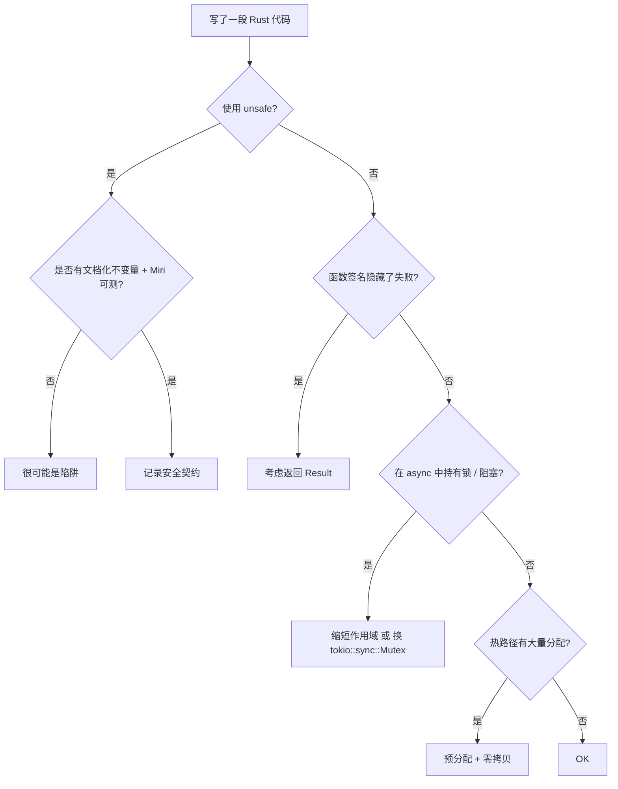

# Rust 反模式与陷阱图谱（Anti-patterns and Pitfalls Atlas）

> **EN**: Rust Anti-patterns and Pitfalls Atlas
> **Summary**: An atlas of subtle and advanced Rust anti-patterns and pitfalls drawn from The Rustonomicon, Rust API Guidelines, This Week in Rust, and the Rust Performance Book, with cross-references to the common anti-patterns page.
> **Rust 版本**: 1.97.1+ (Edition 2024)
> **Bloom 层级**: L5–L6
> **权威来源**: 本文件为 `concept/` 权威页。

> **定位**: 本页聚焦**进阶、 subtle 或跨领域**的反模式与陷阱，与 [`33_anti_patterns.md`](33_anti_patterns.md) 形成互补：后者覆盖日常常见反模式（`Clone` 消错、OOP 模拟、`unwrap` 级联等），本页覆盖 Unsafe、API 设计、异步、类型系统、性能工程中的深坑。

> **前置概念**: [Rust 反模式](33_anti_patterns.md) · [Rust 惯用法谱系全景](02_idioms_spectrum.md)
> **后置概念**: [Rust 性能惯用法](52_performance_idioms.md) · [Unsafe Rust 模式](../../03_advanced/02_unsafe/04_unsafe_rust_patterns.md)

> **来源**:
> [Rust Design Patterns — Anti-patterns](https://rust-unofficial.github.io/patterns/anti_patterns/) ·
> [The Rustonomicon](https://doc.rust-lang.org/nomicon/index.html) ·
> [Rust API Guidelines](https://rust-lang.github.io/api-guidelines/) ·
> [This Week in Rust](https://this-week-in-rust.org/) ·
> [Rust Performance Book](https://nnethercote.github.io/perf-book/) ·
> [Jung et al. — RustBelt: Securing the Foundations of Rust](https://plv.mpi-sws.org/rustbelt/popl18/)

---

## 〇、知识结构图



---

## 一、为什么需要「反模式图谱」

Rust 的借用检查器、所有权和类型系统会把大量错误推到编译期。但以下三类问题仍会滑入运行时或演变为维护债务：

1. **Unsafe 代码**：编译器暂停检查，开发者必须手动维护不变量。
2. **API 设计决策**：今天合法的接口可能成为明天的 SemVer 陷阱。
3. **性能与并发**：能编译不等于高效、无竞争、取消安全。

本页按来源组织，每个条目给出**问题定义 → 风险 → 地道修复 → 可编译对照**。

---

## 二、速查表

| 反模式 / 陷阱 | 一句话风险 | 地道修复 |
|---|---|---|
| `transmute` 当类型转换 | 破坏类型/生命周期不变量，导致 UB | `From`/`TryFrom`、newtype、指针转换 |
| 通过可变裸指针制造别名 | 违反 `&mut` 排他性，优化器可制造 UB | 使用 `UnsafeCell`、遵循 stacked borrows / tree borrows |
| `MaybeUninit::assume_init` 过早 | 读取未初始化内存，UB | 仅在确实写入后调用 |
| 手工 `Pin` 投影 | 破坏 Pin 不动性契约 | 使用 `pin_project!` / `pin_project_lite` |
| `static mut` 共享可变状态 | 数据竞争、UB | `Mutex`/`RwLock` + `LazyLock`、`thread_local!` |
| 过度泛型化接口 | 编译时间爆炸、类型推断失败、API 难用 | 在灵活性与约束间取平衡 |
| 隐藏 panic | 库用户无法通过类型系统预知失败 | `Result` + 文档化 panic 条件 |
| `Deref` 模拟继承 | 隐藏组合关系、方法解析意外 | 显式组合、`Deref` 只用于智能指针 |
| `MutexGuard` 跨 `.await` | `std::sync::MutexGuard` 非 `Send`，Future 无法跨线程调度 | 缩短锁作用域、`tokio::sync::Mutex`、channel |
| 阻塞代码直接跑在 async 任务 | 降低异步运行时吞吐量 | `spawn_blocking` / 专用线程池 |
| 热路径频繁分配 | 延迟、缓存抖动 | 预分配、复用缓冲区、`Cow`、栈数组 |
| 无测量优化 | 改写后反而更慢 | Criterion / perf → 定位瓶颈 → 优化 |

---

## 三、Rustonomicon Unsafe 与内存陷阱

### 3.1 `transmute` 当作通用类型转换

**风险**：`std::mem::transmute` 会同时转换类型与生命周期，极易破坏类型大小、对齐、变型与生命周期不变量。

**地道修复**：优先使用标准 trait 转换；若必须指针转换，使用 `as` 或 `pointer::cast` 并显式文档化。

```rust,ignore
// ❌ 反例：把 &str 的地址/长度解释为 u64 元组，极不可移植且 UB
// let (addr, len): (usize, usize) = unsafe { std::mem::transmute(s) };
```

```rust
// ✅ 正例：通过安全接口获取字符串切片信息
fn inspect(s: &str) -> (&[u8], usize) {
    (s.as_bytes(), s.len())
}

fn main() {
    let s = "hello";
    let (bytes, len) = inspect(s);
    assert_eq!(len, 5);
    assert_eq!(bytes, b"hello");
}
```

### 3.2 通过可变裸指针制造别名

**风险**：Safe Rust 中 `&mut T` 保证独占别名；进入 `unsafe` 后，同一对象的多个可变裸指针会触发未定义行为。

```rust,ignore
// ❌ 反例：通过 as_mut_ptr 获取两个可变指针后同时写入
// let mut x = 0;
// let p1 = &mut x as *mut i32;
// let p2 = &mut x as *mut i32;
// unsafe { *p1 = 1; *p2 = 2; } // 数据竞争 / UB
```

```rust
// ✅ 正例：需要内部可变性时用 UnsafeCell，并在同一 unsafe 块内控制别名
use std::cell::UnsafeCell;

struct Counter(UnsafeCell<usize>);

unsafe impl Sync for Counter {}

impl Counter {
    fn increment(&self) {
        unsafe { *self.0.get() += 1; }
    }
}

fn main() {
    let c = Counter(UnsafeCell::new(0));
    c.increment();
    assert_eq!(unsafe { *c.0.get() }, 1);
}
```

### 3.3 `MaybeUninit::assume_init` 过早调用

**风险**：未初始化的位模式被当作有效值读取，属于 UB。

```rust,ignore
// ❌ 反例：
// let mut x = std::mem::MaybeUninit::<String>::uninit();
// let s = unsafe { x.assume_init() }; // 未初始化！
```

```rust
// ✅ 正例：写入后再 assume_init
use std::mem::MaybeUninit;

fn make_string() -> String {
    let mut x = MaybeUninit::<String>::uninit();
    unsafe { x.as_mut_ptr().write(String::from("ok")); }
    unsafe { x.assume_init() }
}

fn main() {
    assert_eq!(make_string(), "ok");
}
```

### 3.4 手工 `Pin` 投影

**风险**：不合法的 Pin 投影会破坏「自引用结构在移动后仍指向自身」的契约。

**地道修复**：使用 `pin_project_lite::pin_project!` 或 `pin_project::pin_project!`；如果必须手写，投影字段必须实现 `Unpin` 或提供 `Pin` 安全的投影方法。

```rust,ignore
// ❌ 反例：手工把 Pin<&mut Self> 解引用为 &mut Self 再取字段引用
// unsafe { &mut self.get_unchecked_mut().field }
// 这会丢失 Pin 不动性保证。
```

相关权威页：[Pin 与 Unpin](../../03_advanced/01_async/08_pin_unpin.md)。

### 3.5 `static mut` 共享可变全局状态

**风险**：`static mut` 允许无锁地获得 `&mut`，是多线程数据竞争的直接来源。

**地道修复**：使用 `std::sync::Mutex` / `RwLock` + `std::sync::LazyLock`。

```rust
// ✅ 正例：线程安全的全局计数器
use std::sync::{Mutex, LazyLock};

static COUNTER: LazyLock<Mutex<u64>> = LazyLock::new(|| Mutex::new(0));

fn bump() -> u64 {
    let mut g = COUNTER.lock().unwrap();
    *g += 1;
    *g
}

fn main() {
    assert_eq!(bump(), 1);
}
```

---

## 四、API 设计反模式

### 4.1 过度泛型化接口

**风险**：所有参数都写成 `impl Into<T>` + 复杂 `where` 子句，会导致编译时间激增、类型推断失败、文档难以阅读。

```rust,ignore
// ❌ 反例：为了灵活而过度泛型
// pub fn process<K, V, I>(input: I) -> impl Iterator<Item = (K, V)>
// where
//     K: Eq + Hash + Clone,
//     V: Clone,
//     I: IntoIterator<Item = (K, V)>,
// { ... }
```

```rust
// ✅ 正例：对库公开接口保持最小泛型，内部再转换
pub fn process(input: impl IntoIterator<Item = (String, i32)>) -> Vec<(String, i32)> {
    input.into_iter().filter(|(_, v)| *v > 0).collect()
}

fn main() {
    let v = vec![("a".to_string(), 1), ("b".to_string(), -1)];
    assert_eq!(process(v), vec![("a".to_string(), 1)]);
}
```

### 4.2 隐藏 panic

**风险**：函数签名不返回 `Result`，却在内部 `panic!`，调用者无法通过类型系统处理失败。

**地道修复**：可恢复错误返回 `Result<T, E>`；不可恢复但属于前置条件违反的 panic 必须在文档 `# Panics` 节说明。

```rust,ignore
// ❌ 反例：
// pub fn ratio(a: f64, b: f64) -> f64 {
//     if b == 0.0 { panic!("division by zero"); }
//     a / b
// }
```

```rust
// ✅ 正例：
#[derive(Debug)]
struct ZeroDivision;

impl std::fmt::Display for ZeroDivision {
    fn fmt(&self, f: &mut std::fmt::Formatter<'_>) -> std::fmt::Result {
        write!(f, "division by zero")
    }
}
impl std::error::Error for ZeroDivision {}

pub fn ratio(a: f64, b: f64) -> Result<f64, ZeroDivision> {
    if b == 0.0 { return Err(ZeroDivision); }
    Ok(a / b)
}

fn main() {
    assert!(ratio(1.0, 0.0).is_err());
}
```

### 4.3 用 `Deref` 模拟继承

**风险**：`Deref` 只能用于「透明解引用」（如智能指针）。用它让 `Child` 调用 `Parent` 的方法会隐藏真实组合关系，导致方法解析与文档都出乎意料。

```rust,ignore
// ❌ 反例：
// struct Parent;
// impl Parent { fn work(&self) {} }
// struct Child { parent: Parent }
// impl std::ops::Deref for Child { type Target = Parent; fn deref(&self) -> &Parent { &self.parent } }
```

```rust
// ✅ 正例：显式组合 + 委托
struct Parent;
impl Parent { fn work(&self) -> &str { "parent" } }

struct Child { parent: Parent }
impl Child {
    fn work(&self) -> String { format!("child of {}", self.parent.work()) }
}

fn main() {
    assert_eq!(Child { parent: Parent }.work(), "child of parent");
}
```

### 4.4 SemVer 陷阱：公开 `enum` 不加 `#[non_exhaustive]`

**风险**：下游对公开 `enum` 做穷尽 `match`。库一旦新增变体，就会破坏下游编译，违反 SemVer。

```rust
// ✅ 正例：对外公开的枚举使用 non_exhaustive
#[non_exhaustive]
pub enum Status { Ok, Warn }

pub fn describe(s: &Status) -> &'static str {
    match s {
        Status::Ok => "ok",
        Status::Warn => "warn",
    }
}
```

---

## 五、异步陷阱

### 5.1 `std::sync::MutexGuard` 跨 `.await`

**风险**：`std::sync::MutexGuard` 不是 `Send`，持有它跨越 `.await` 会使 Future 无法被多线程调度器移动。

```rust,compile_fail
use std::sync::Mutex;

async fn hold_guard(m: &Mutex<String>) {
    let _guard = m.lock().unwrap();
    async {}.await; // 错误：MutexGuard 跨 await
}

fn require_send(_: impl Send) {}

fn main() {
    require_send(hold_guard(&Mutex::new(String::new())));
}
```

```rust
// ✅ 正例 1：缩短锁作用域
use std::sync::Mutex;

async fn release_before_await(m: &Mutex<String>) -> String {
    let s = {
        let guard = m.lock().unwrap();
        guard.clone()
    };
    async {}.await;
    s
}

fn require_send(_: impl Send) {}

fn main() {
    require_send(release_before_await(&Mutex::new(String::new())));
}
```

### 5.2 在 async 任务中执行阻塞操作

**风险**：在 async 任务里调用 `std::thread::sleep`、同步文件 IO 等会阻塞整个 executor 线程，降低并发度。

**地道修复**：使用 `spawn_blocking`（tokio）或专用线程池；对 `tokio` 示例见 [`Async 运行时惯用法`](../../03_advanced/01_async/03_async_patterns.md)。

---

## 六、类型系统陷阱

### 6.1 `as` 窄化转换

**风险**：`as` 在数值溢出时静默截断，丢失信息。

**地道修复**：使用 `try_into()`、`u32::try_from(...)`，或在确实需要截断时显式使用 `wrapping_*` / `saturating_*`。

```rust
// ✅ 正例：可失败转换
fn to_u8(x: u32) -> Option<u8> {
    x.try_into().ok()
}

fn main() {
    assert_eq!(to_u8(255), Some(255));
    assert_eq!(to_u8(256), None);
}
```

### 6.2 `impl Trait` 生命周期捕获歧义

**风险**：`impl Trait + 'a` 与 `impl Trait + '_` 的捕获规则在嵌套返回类型中容易出错，导致返回的引用比预期活得更短或更长。

**地道修复**：在 API 公开接口中显式标注生命周期，或在 Edition 2024 中利用精确捕获（RPITIT）规则。

相关页：[`Async Trait 对象安全`](../../03_advanced/01_async/13_async_trait_object_safety.md)、[`Lifetime Capture in impl Trait 预研`](../../07_future/02_preview_features/13_lifetime_capture_preview.md)。

---

## 七、性能工程陷阱

详见 [`52_performance_idioms.md`](52_performance_idioms.md)。本节只列出与反模式直接相关的要点：

| 陷阱 | 风险 | 修复 |
|---|---|---|
| 热路径中 `clone()` / `to_string()` | O(n) 分配、缓存抖动 | 借用、`Cow`、复用缓冲区 |
| 循环内 `Vec::push` 无预分配 | 多次重新分配与拷贝 | `with_capacity` / `reserve` |
| 未测量即重写关键路径 | 可能把 O(n) 改成更慢的 O(n log n) | Criterion → perf → 优化 |
| false sharing | 多线程同时写入同一缓存行 | 按缓存行对齐独立计数器 |
| 全局 `Mutex` 作为通用同步 | 单点竞争 | 分片锁、原子、channel |

---

## 八、决策树：这是陷阱还是合理权衡？



---

## 九、权威来源与延伸阅读

- [Rust Design Patterns — Anti-patterns](https://rust-unofficial.github.io/patterns/anti_patterns/)
- [The Rustonomicon](https://doc.rust-lang.org/nomicon/index.html)
- [Rust API Guidelines](https://rust-lang.github.io/api-guidelines/)
- [This Week in Rust](https://this-week-in-rust.org/)
- [Rust Performance Book](https://nnethercote.github.io/perf-book/)
- [Rust 反模式](33_anti_patterns.md)
- [Rust 惯用法谱系全景](02_idioms_spectrum.md)
- [系统设计原则与国际权威对齐](03_system_design_principles.md)
- [语言语义模型矩阵](../../05_comparative/00_paradigms/05_language_semantic_model_matrix.md)
- [Rust 性能惯用法](52_performance_idioms.md)
