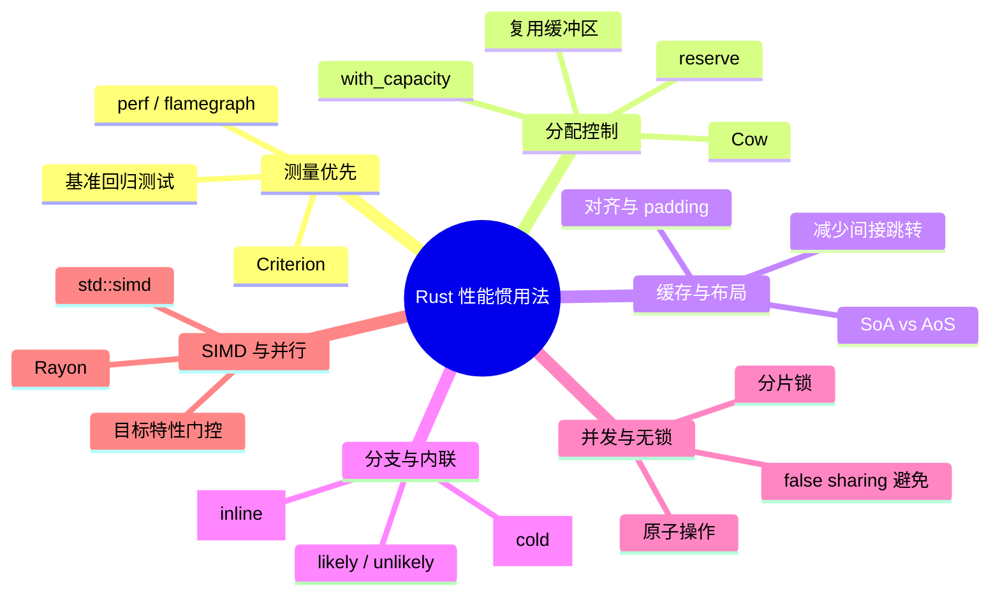

# Rust 性能惯用法（Performance Idioms）

> **EN**: Rust Performance Idioms
> **Summary**: A catalog of performance-oriented Rust idioms aligned with the Rust Performance Book: allocation avoidance, cache-friendly layout, branch hints, inlining, atomics, SIMD, and measurement-first optimization.
> **Rust 版本**: 1.97.1+ (Edition 2024)
> **Bloom 层级**: L4–L6
> **权威来源**: 本文件为 `concept/` 权威页。

> **定位**: 本页是 Rust 性能工程的惯用法权威页，聚焦**可移植、零额外依赖**的标准库惯用法，并对 SIMD、并行计算、剖析工具给出社区共识入口。

> **前置概念**: [Rust 惯用法谱系全景](02_idioms_spectrum.md) · [所有权性能优化](../../03_advanced/06_low_level_patterns/06_ownership_performance_optimization.md)
> **后置概念**: [Rust 反模式与陷阱图谱](51_anti_patterns_and_pitfalls.md)

> **来源**:
> [Rust Performance Book](https://nnethercote.github.io/perf-book/) ·
> [Rust API Guidelines](https://rust-lang.github.io/api-guidelines/) ·
> [The Rustonomicon](https://doc.rust-lang.org/nomicon/index.html) ·
> [This Week in Rust](https://this-week-in-rust.org/) ·
> [Jung et al. — RustBelt: Securing the Foundations of Rust](https://plv.mpi-sws.org/rustbelt/popl18/)

---

## 〇、性能模型与认知框架



**核心原则**：

1. **先测量，后优化**：没有 profiling 的优化是猜测。
2. **零成本抽象优先**：利用 Rust 的类型系统消除运行时开销，而非牺牲可读性。
3. **局部性即性能**：CPU 缓存、分支预测、锁竞争往往比 Big-O 更影响真实延迟。

---

## 一、测量与归因惯用法

### 1.1 Criterion.rs 微基准

```rust,ignore
// 需要 dev-dependencies: criterion = "0.5"
use criterion::{black_box, criterion_group, criterion_main, Criterion};

fn fibonacci(n: u64) -> u64 {
    match n {
        0 => 1,
        1 => 1,
        n => fibonacci(n - 1) + fibonacci(n - 2),
    }
}

fn criterion_benchmark(c: &mut Criterion) {
    c.bench_function("fib 20", |b| b.iter(|| fibonacci(black_box(20))));
}

criterion_group!(benches, criterion_benchmark);
criterion_main!(benches);
```

### 1.2 使用 `std::hint::black_box` 防止优化消除

```rust
pub fn sum(v: &[i32]) -> i32 {
    v.iter().sum()
}

fn main() {
    let v = vec![1, 2, 3, 4, 5];
    // 在基准测试中，用 black_box 包裹输入与输出，防止编译器完全常量折叠
    let result = std::hint::black_box(sum(std::hint::black_box(&v)));
    assert_eq!(result, 15);
}
```

---

## 二、分配控制惯用法

### 2.1 预分配集合容量

```rust
fn collect_positive(src: &[i32]) -> Vec<i32> {
    // 最坏情况下全部元素都满足条件，预分配避免多次扩容
    let mut out = Vec::with_capacity(src.len());
    out.extend(src.iter().filter(|&&x| x > 0).copied());
    out
}

fn main() {
    let v = vec![-1, 2, -3, 4];
    assert_eq!(collect_positive(&v), vec![2, 4]);
}
```

### 2.2 复用 `String` / `Vec` 缓冲区

```rust
use std::fmt::Write;

fn format_batch(items: &[i32], buf: &mut String) {
    buf.clear();
    for item in items {
        let _ = write!(buf, "{} ", item);
    }
}

fn main() {
    let mut buf = String::with_capacity(64);
    format_batch(&[1, 2, 3], &mut buf);
    assert_eq!(buf, "1 2 3 ");
    format_batch(&[4, 5], &mut buf);
    assert_eq!(buf, "4 5 ");
}
```

### 2.3 写时克隆：`Cow<T>`

```rust
use std::borrow::Cow;

fn greet(name: &str) -> Cow<'_, str> {
    if name.is_empty() {
        Cow::Borrowed("World")
    } else {
        Cow::Owned(format!("Hello, {}", name))
    }
}

fn main() {
    assert_eq!(greet(""), "World");
    assert_eq!(greet("Rust"), "Hello, Rust");
}
```

### 2.4 优先借用：`&str` 替代 `String`

```rust
fn first_word(s: &str) -> &str {
    s.split_whitespace().next().unwrap_or("")
}

fn main() {
    let s = String::from("hello world");
    let w = first_word(&s); // 不分配新 String
    assert_eq!(w, "hello");
}
```

---

## 三、迭代器与惰性求值惯用法

### 3.1 惰性链替代显式循环

```rust
fn total_price(prices: &[f64]) -> f64 {
    prices
        .iter()
        .filter(|&&p| p > 0.0)
        .map(|p| p * 0.9) // 9 折
        .sum()
}

fn main() {
    assert_eq!(total_price(&[10.0, -5.0, 20.0]), 27.0);
}
```

### 3.2 短路累加：`try_fold`

```rust
fn parse_sum(items: &[&str]) -> Result<i32, std::num::ParseIntError> {
    items.iter().try_fold(0, |acc, s| {
        let n: i32 = s.parse()?;
        Ok(acc + n)
    })
}

fn main() {
    assert_eq!(parse_sum(&["1", "2", "3"]).unwrap(), 6);
    assert!(parse_sum(&["1", "x"]).is_err());
}
```

---

## 四、缓存友好数据布局

### 4.1 SoA（Structure of Arrays）

```rust
#[derive(Default)]
struct Particles {
    x: Vec<f32>,
    y: Vec<f32>,
    active: Vec<bool>,
}

impl Particles {
    fn with_capacity(n: usize) -> Self {
        Self {
            x: Vec::with_capacity(n),
            y: Vec::with_capacity(n),
            active: Vec::with_capacity(n),
        }
    }

    fn update_positions(&mut self) {
        for (x, y) in self.x.iter_mut().zip(self.y.iter_mut()) {
            *x += 1.0;
            *y += 0.5;
        }
    }
}

fn main() {
    let mut ps = Particles::with_capacity(4);
    ps.x.extend([0.0, 1.0, 2.0, 3.0]);
    ps.y.extend([0.0; 4]);
    ps.active.extend([true; 4]);
    ps.update_positions();
    assert_eq!(ps.x, vec![1.0, 2.0, 3.0, 4.0]);
}
```

### 4.2 减少指针跳转：内联小结构

```rust
// ❌ 间接跳转多：每个 Point 都在堆上
// struct Polygon { points: Vec<Box<Point>> }

// ✅ 连续内存，缓存友好
#[derive(Clone, Copy, Debug, PartialEq)]
struct Point { x: f64, y: f64 }

struct Polygon { points: Vec<Point> }

fn centroid(poly: &Polygon) -> Point {
    let n = poly.points.len() as f64;
    let (sx, sy) = poly.points.iter().fold((0.0, 0.0), |(sx, sy), p| {
        (sx + p.x, sy + p.y)
    });
    Point { x: sx / n, y: sy / n }
}

fn main() {
    let poly = Polygon { points: vec![Point { x: 0.0, y: 0.0 }, Point { x: 2.0, y: 0.0 }, Point { x: 1.0, y: 2.0 }] };
    assert_eq!(centroid(&poly), Point { x: 1.0, y: 2.0 / 3.0 });
}
```

---

## 五、分支预测与内联

### 5.1 冷路径标注 `#[cold]`

```rust
fn parse_positive(s: &str) -> Result<u32, &'static str> {
    let n: u32 = s.parse().map_err(|_| { cold_error(); "invalid number" })?;
    if n == 0 {
        cold_error();
        return Err("must be positive");
    }
    Ok(n)
}

#[cold]
fn cold_error() {
    eprintln!("error path taken");
}

fn main() {
    assert_eq!(parse_positive("42").unwrap(), 42);
    assert!(parse_positive("0").is_err());
}
```

### 5.2 `likely` / `unlikely` 提示（实验性特性）

`std::hint::likely` / `unlikely` 可直接向后端提示分支概率，但目前仍需启用 `likely_unlikely` 特性门控才能使用（截至 1.97.1 尚未进入稳定通道）。稳定版 Rust 中应优先使用 `#[cold]` 与数据布局优化来引导分支预测。

```rust,ignore
// 本示例需在启用 likely_unlikely 特性门控的每日构建版工具链上运行
use std::hint::likely;

fn count_nonzero(v: &[i32]) -> usize {
    let mut n = 0;
    for &x in v {
        if likely(x != 0) { n += 1; }
    }
    n
}
```

### 5.3 内联提示 `#[inline]`

```rust
#[inline]
fn add_one(x: i32) -> i32 { x + 1 }

#[inline(always)]
fn hot_path_check(x: i32) -> bool { x > 0 }

fn main() {
    assert_eq!(add_one(1), 2);
    assert!(hot_path_check(5));
}
```

> 注意：`#[inline(always)]` 只在测量确认收益后使用；过度内联会增加代码体积与编译时间。

---

## 六、并发与无锁惯用法

### 6.1 原子计数器替代 `Mutex`

```rust
use std::sync::atomic::{AtomicUsize, Ordering};

static HITS: AtomicUsize = AtomicUsize::new(0);

fn hit() -> usize {
    HITS.fetch_add(1, Ordering::Relaxed)
}

fn main() {
    assert_eq!(hit(), 0);
    assert_eq!(hit(), 1);
}
```

### 6.2 分片锁减少竞争

```rust
use std::sync::Mutex;

const SHARDS: usize = 16;

struct ShardedCounter([Mutex<u64>; SHARDS]);

impl ShardedCounter {
    fn new() -> Self {
        let mut arr = Vec::with_capacity(SHARDS);
        for _ in 0..SHARDS { arr.push(Mutex::new(0)); }
        Self(arr.try_into().unwrap())
    }

    fn increment(&self, key: usize) {
        let mut g = self.0[key % SHARDS].lock().unwrap();
        *g += 1;
    }
}

fn main() {
    let c = ShardedCounter::new();
    c.increment(1);
    c.increment(17); // 与 key=1 同一 shard，演示分片语义
}
```

### 6.3 避免 false sharing：按缓存行填充计数器

```rust,ignore
// 生产级实现需要 crate "crossbeam" 的 CachePadded 或手动对齐
// use crossbeam::util::CachePadded;
// struct PaddedCounter([CachePadded<AtomicUsize>; N]);
```

---

## 七、SIMD 与并行入口

### 7.1 便携式 SIMD：`std::simd`

```rust,ignore
// 需要目标支持 SIMD；本示例仅作入口展示，实际使用需加目标特性门控
use std::simd::{Simd, simd_swizzle};

fn add_four(a: [f32; 4], b: [f32; 4]) -> [f32; 4] {
    let va = Simd::from_array(a);
    let vb = Simd::from_array(b);
    (va + vb).to_array()
}
```

### 7.2 数据并行：Rayon

```rust,ignore
// 需要 dependencies: rayon = "1"
use rayon::prelude::*;

fn sum_squares(v: &[i32]) -> i32 {
    v.par_iter().map(|x| x * x).sum()
}
```

---

## 八、I/O 缓冲惯用法

```rust
use std::io::{BufWriter, Write};

fn write_many<W: Write>(writer: &mut W, lines: &[&str]) -> std::io::Result<()> {
    let mut bw = BufWriter::new(writer);
    for line in lines {
        writeln!(bw, "{}", line)?;
    }
    bw.flush()
}

fn main() {
    let mut buf = Vec::new();
    write_many(&mut buf, &["a", "b", "c"]).unwrap();
    assert_eq!(buf, b"a\nb\nc\n");
}
```

---

## 九、性能反模式

| 反模式 | 风险 | 修复 |
|---|---|---|
| 无测量优化 | 改写后更慢、代码更复杂 | Criterion / perf → 数据驱动 |
| 热路径中 `clone()` / `to_string()` | 分配与拷贝开销 | 借用、`Cow`、预分配 |
| 把所有数据装箱 | 指针跳转、缓存不友好 | 内联小结构、SoA |
| 全局 `Mutex` 保护一切 | 单点竞争、扩展性差 | 分片锁、原子、channel |
| 过度 `#[inline(always)]` | 代码膨胀、编译变慢、缓存失效 | 仅对测量后的热点使用 |
| 忽视 false sharing | 多核扩展性差 | 缓存行对齐 |

---

## 十、决策树：选择性能惯用法

```mermaid
flowchart TD
    A[发现性能瓶颈] --> B[用 Criterion / perf 测量]
    B --> C{瓶颈类型?}
    C -->|分配| D[预分配 / Cow / 借用 / 复用缓冲区]
    C -->|缓存| E[SoA / 减少指针跳转 / 对齐]
    C -->|分支| F[#[cold] / likely / unlikely]
    C -->|并发竞争| G[原子 / 分片锁 / 无锁结构]
    C -->|可并行计算| H[Rayon / std::simd]
    D --> I[再次测量]
    E --> I
    F --> I
    G --> I
    H --> I
```

---

## 十一、权威来源与延伸阅读

- [Rust Performance Book](https://nnethercote.github.io/perf-book/)
- [Criterion.rs](https://bheisler.github.io/criterion.rs/book/)
- [Rayon](https://docs.rs/rayon)
- [Portable SIMD in std::simd](https://doc.rust-lang.org/std/simd/index.html)
- [Rust API Guidelines — Flexibility](https://rust-lang.github.io/api-guidelines/flexibility.html)
- [所有权性能优化](../../03_advanced/06_low_level_patterns/06_ownership_performance_optimization.md)
- [工程实践与生产级模式](13_engineering_and_production_patterns.md)
- [语言语义模型矩阵](../../05_comparative/00_paradigms/05_language_semantic_model_matrix.md)
- [Rust 反模式与陷阱图谱](51_anti_patterns_and_pitfalls.md)
