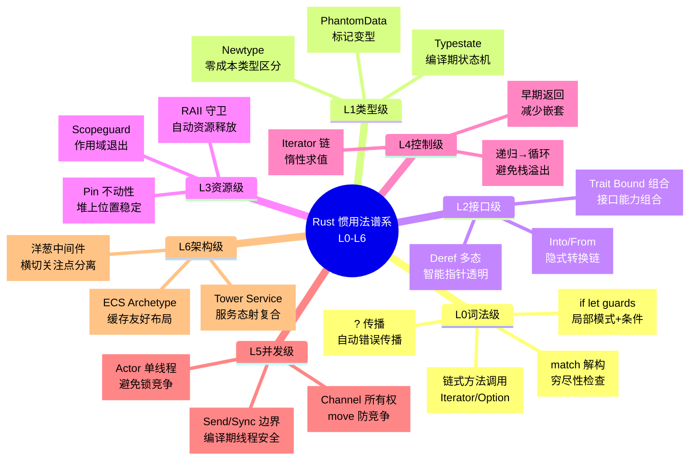
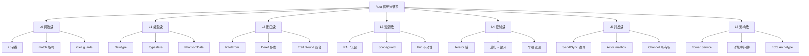
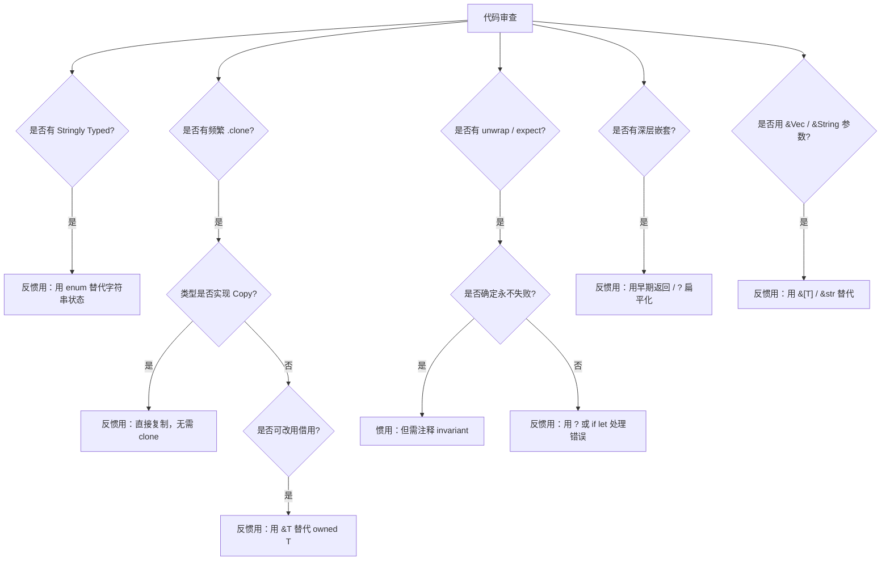
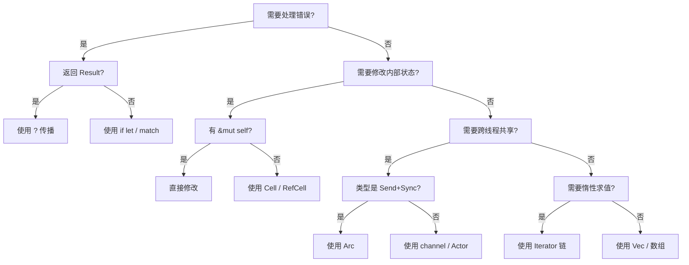
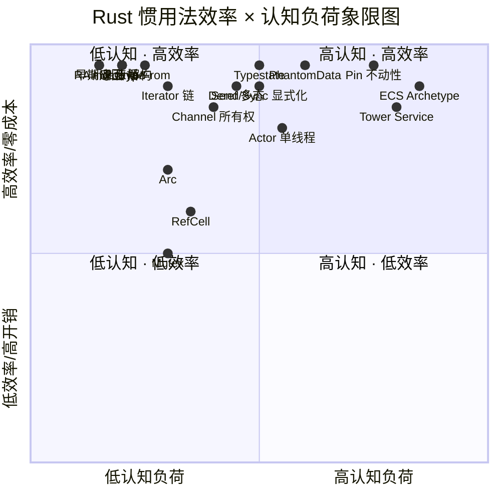

# Rust 惯用法谱系全景（Idioms Spectrum）

> **代码状态**: ✅ 含可编译示例

>
> **EN**: Idioms Spectrum
> **Summary**: Idioms Spectrum: Rust ecosystem tools, crates, and engineering practices.
> **受众**: [进阶]
> **内容分级**: [专家级]
> **定位**: 本文件从**纵向抽象层级**梳理 Rust 的惯用法（idioms）——从词法糖到架构模式的高效、等效、简洁表达方式，与 `02_patterns.md` 的设计模式形成互补：后者聚焦「设计模式」（面向问题），本文件聚焦「惯用法」（面向表达）。
> **原则**: 每个惯用法必须展示「非惯用写法 → 惯用写法」的等价变换，并标注效率特征与认知负荷。
> **对齐来源**: [Rust API Guidelines](https://rust-lang.github.io/api-guidelines/) · [Rust Design Patterns](https://rust-unofficial.github.io/patterns/) · [Rust Style Guide] · [Clippy Lints] · [The Rust Programming Language](https://doc.rust-lang.org/book/)
> **基准版本**: Rust 1.96.0 stable (Edition 2024)
> **定理链**: N/A — 描述性/综述性/导航性文档，不涉及形式化定理链
>
> **来源**: [Rust API Guidelines](https://rust-lang.github.io/api-guidelines/) · [Rust By Example](https://doc.rust-lang.org/rust-by-example/) · [Rust Reference](https://doc.rust-lang.org/reference/)
---

> **Bloom 层级**: 应用 → 分析 → 评价

**变更日志**:

- v1.0 (2026-05-21): 初始版本——七层惯用法谱系 + 等价变换 + 反惯用法判定树 + Clippy 对齐

---

> **后置概念**: [Future Roadmap](../07_future/24_roadmap.md)

> **前置概念**: [Patterns](../06_ecosystem/02_patterns.md)

## 📑 目录

- [Rust 惯用法谱系全景（Idioms Spectrum）](#rust-惯用法谱系全景idioms-spectrum)
  - [📑 目录](#-目录)
  - [〇、惯用法谱系认知全景](#〇惯用法谱系认知全景)
  - [零、TL;DR —— 惯用法速查](#零tldr--惯用法速查)
  - [一、权威来源与谱系方法论](#一权威来源与谱系方法论)
    - [1.1 惯用法的定义与判别标准](#11-惯用法的定义与判别标准)
    - [1.2 与 Clippy lint 的对齐](#12-与-clippy-lint-的对齐)
  - [二、惯用法谱系总览](#二惯用法谱系总览)
  - [三、L0 词法级惯用法](#三l0-词法级惯用法)
    - [3.1](#31)
    - [3.2](#32)
    - [3.3](#33)
    - [3.4](#34)
  - [四、L1 类型级惯用法](#四l1-类型级惯用法)
    - [4.1](#41)
    - [4.2](#42)
    - [4.3](#43)
    - [4.4](#44)
  - [五、L2 接口级惯用法](#五l2-接口级惯用法)
    - [5.1](#51)
    - [5.2](#52)
    - [5.3](#53)
    - [5.4](#54)
  - [六、L3 资源级惯用法](#六l3-资源级惯用法)
    - [6.1](#61)
    - [6.2](#62)
    - [6.3](#63)
    - [6.4](#64)
  - [七、L4 控制级惯用法](#七l4-控制级惯用法)
    - [7.1](#71)
    - [7.2](#72)
    - [7.3](#73)
    - [7.4](#74)
  - [八、L5 并发级惯用法](#八l5-并发级惯用法)
    - [8.1](#81)
    - [8.2](#82)
    - [8.3](#83)
    - [8.4](#84)
  - [九、L6 架构级惯用法](#九l6-架构级惯用法)
    - [9.1](#91)
    - [9.2](#92)
    - [9.3](#93)
    - [9.4](#94)
  - [十、反惯用法](#十反惯用法)
    - [常见反惯用清单](#常见反惯用清单)
  - [十一、Rust 1.95 新惯用法](#十一rust-195-新惯用法)
  - [十二、思维表征体系](#十二思维表征体系)
    - [12.1 惯用法选择决策树](#121-惯用法选择决策树)
    - [12.2 惯用法效率-认知负荷象限图](#122-惯用法效率-认知负荷象限图)
    - [12.3 惯用法效率矩阵](#123-惯用法效率矩阵)
  - [十三、定理推理链](#十三定理推理链)
    - [定理一致性矩阵（惯用法谱系专集）](#定理一致性矩阵惯用法谱系专集)
  - [十四、相关概念链接（L0-L7 映射）](#十四相关概念链接l0-l7-映射)
    - [L0-L7 纵向映射](#l0-l7-纵向映射)
    - [相关概念文件](#相关概念文件)
  - [十五、惯用法选择的认知路径](#十五惯用法选择的认知路径)
  - [权威来源索引](#权威来源索引)
  - [十、边界测试：惯用法谱系的编译错误](#十边界测试惯用法谱系的编译错误)
    - [10.1 边界测试：`unwrap` 的滥用（运行时 panic）](#101-边界测试unwrap-的滥用运行时-panic)
    - [10.2 边界测试：`clone` 的隐式成本（逻辑错误）](#102-边界测试clone-的隐式成本逻辑错误)
    - [10.3 边界测试：Clippy 警告的编译错误等价（编译错误）](#103-边界测试clippy-警告的编译错误等价编译错误)
    - [10.4 边界测试：`String` 与 `&str` 的类型不匹配（编译错误）](#104-边界测试string-与-str-的类型不匹配编译错误)
    - [10.5 边界测试：`Default::default()` 与类型推断的歧义（编译错误）](#105-边界测试defaultdefault-与类型推断的歧义编译错误)
    - [10.7 边界测试：`std::mem::replace` 与 `take` 的惯用选择（逻辑错误）](#107-边界测试stdmemreplace-与-take-的惯用选择逻辑错误)
    - [10.3 边界测试：`Default` 派生与手动实现的语义差异（逻辑错误）](#103-边界测试default-派生与手动实现的语义差异逻辑错误)
    - [补充定理链](#补充定理链)
  - [嵌入式测验（Embedded Quiz）](#嵌入式测验embedded-quiz)
    - [测验 1：`Default` trait 的用途是什么？如何为自定义类型实现它？（理解层）](#测验-1default-trait-的用途是什么如何为自定义类型实现它理解层)
    - [测验 2：`AsRef` 与 `Borrow` trait 在语义上有什么区别？（理解层）](#测验-2asref-与-borrow-trait-在语义上有什么区别理解层)
    - [测验 3：什么是"早返回"（Early Return）模式？Rust 中通常如何实现？（理解层）](#测验-3什么是早返回early-return模式rust-中通常如何实现理解层)
    - [测验 4：`todo!()` 和 `unimplemented!()` 宏在开发中有什么用途？（理解层）](#测验-4todo-和-unimplemented-宏在开发中有什么用途理解层)
    - [测验 5：Rust 的 `must_use` 属性有什么作用？什么类型的返回值通常应该标记它？（理解层）](#测验-5rust-的-must_use-属性有什么作用什么类型的返回值通常应该标记它理解层)
  - [认知路径](#认知路径)
    - [核心推理链](#核心推理链)
    - [反命题与边界](#反命题与边界)

---

## 〇、惯用法谱系认知全景
>



> **认知功能**: 本 mindmap 提供 Rust 惯用法的**七层抽象全景导航**，帮助读者建立「从语法糖到架构模式」的完整心智模型。
> 建议将此图作为学习地图：新手聚焦 L0-L2 分支，专家关注 L5-L6 的并发与架构节点。
> 关键洞察是惯用法层级与问题粒度正相关——词法级解决局部表达，架构级解决系统组织。[来源: 💡 原创分析]
> [来源: [Rust Reference](https://doc.rust-lang.org/reference/)]
> **认知路径**: 本 mindmap 展示 Rust 惯用法的**七层抽象阶梯**。
> 从 L0 词法级（语法糖）到 L6 架构级（系统设计），每层惯用法解决不同粒度的问题。
> 新手应从 L0-L1 开始建立直觉，成长期聚焦 L2-L3，成熟期掌握 L4-L5，专家期探索 L6。
> 每层节点的后缀标注核心特征，便于快速定位。

---

## 零、TL;DR —— 惯用法速查
>

```text
层级        惯用法                    核心特征                    效率        认知负荷
─────────────────────────────────────────────────────────────────────────────────────────
L0 词法     ? 传播                    自动错误传播                零成本      低
            match 解构                穷尽性检查                  零成本      低
            if let guards             局部模式+条件               零成本      低
L1 类型     Newtype                   零成本类型区分              零成本      低
            Typestate                 编译期状态机                零成本      中
            PhantomData               标记生命周期/变型           零成本      中
L2 接口     Into/From                 隐式转换链                  零成本      低
            Deref 多态                智能指针透明解引用          零成本      中
            Trait Bound 组合          接口能力组合                零成本      中
L3 资源     RAII 守卫                 自动资源释放                零成本      低
            Scopeguard                作用域退出处理              低开销      低
            Pin 不动性                堆上值位置稳定              零成本      高
L4 控制     Iterator 链               懒性求值+优化               零成本      低
            递归→循环                 避免栈溢出                  零成本      中
            早期返回                  减少嵌套                    零成本      低
L5 并发     Send/Sync 显式化          编译期线程安全              零成本      中
            Actor 单线程              避免锁竞争                  消息开销    中
            Channel 所有权            move 语义防竞争             零成本      低
L6 架构     Tower Service             服务态射复合                低开销      高
            洋葱中间件                横切关注点分离              低开销      中
            ECS Archetype             缓存友好数据布局            零成本      高
─────────────────────────────────────────────────────────────────────────────────────────
```

---

## 一、权威来源与谱系方法论
>

### 1.1 惯用法的定义与判别标准

> **惯用法（Idiom）**: 在特定编程语言社区中，被广泛接受为「标准做法」的表达方式。它通常不是语言强制要求的，而是社区在长期实践中形成的**最优局部解**——在正确性、效率、可读性之间取得平衡。 来源: [Rust API Guidelines](https://rust-lang.github.io/api-guidelines/)

Rust 惯用法的判别标准（四级评价）：

| 维度 | 权重 | 评价标准 |
|:---|:---:|:---|
| 正确性 | 40% | 是否利用类型系统排除更多错误？ |
| 效率 | 30% | 是否为零成本抽象？运行时开销如何？ |
| 可读性 | 20% | 是否减少认知负荷？是否符合社区约定？ |
| 可维护性 | 10% | 是否降低未来修改的引入错误风险？ |

### 1.2 与 Clippy lint 的对齐
>

Clippy 的 `style` 和 `pedantic` lint 类别覆盖了大部分惯用法规范：

| Clippy Lint | 惯用法 | 级别 |
|:---|:---|:---:|
| `needless_return` | 省略函数末尾 `return` | style |
| `explicit_iter_loop` | `for x in &vec` 优于 `for x in vec.iter()` | style |
| `match_bool` | `if` 优于 `match true/false` | style |
| `option_if_let_else` | `map_or` 优于 `if let Some` | pedantic |
| `unnecessary_unwrap` | 用 `?` 或 `if let` 替代 `.unwrap()` | warn |
| `ptr_arg` | `&str` 优于 `&String` | warn |
| `clone_on_copy` | 直接复制优于 `.clone()` | warn |

---

## 二、惯用法谱系总览
>



> **认知功能**: 此树状图将七层惯用法谱系转化为**可遍历的分类层级**，每层3个代表性节点构成最小完整集合。建议将其作为速查索引——当遇到具体代码场景时，可自上而下定位最匹配的惯用法层级。关键洞察是惯用法的「正交覆盖」：L0-L3 聚焦单线程正确性，L4-L6 聚焦性能与并发架构。[来源: 💡 原创分析]

---

## 三、L0 词法级惯用法

### 3.1

> 来源: [Rust Reference §6.13](https://doc.rust-lang.org/reference/) `?` 传播运算符

> **惯用**: 在返回 `Result` 或 `Option` 的函数中，用 `?` 自动传播错误，替代显式 `match`。

**非惯用**:

```rust,ignore
fn read_file(path: &str) -> Result<String, io::Error> {
    let mut file = match File::open(path) {
        Ok(f) => f,
        Err(e) => return Err(e),
    };
    let mut contents = String::new();
    match file.read_to_string(&mut contents) {
        Ok(_) => Ok(contents),
        Err(e) => Err(e),
    }
}
```

**惯用**:

```rust,ignore
fn read_file(path: &str) -> Result<String, io::Error> {
    let mut file = File::open(path)?;
    let mut contents = String::new();
    file.read_to_string(&mut contents)?;
    Ok(contents)
}
```

**等价性**: `?` 是 `match` 的局部语法糖，不改变控制流语义。编译后生成相同的 MIR。 来源: [Rust Reference §6.13, TRPL §9](https://doc.rust-lang.org/reference/)

### 3.2

> 来源: [Rust Reference §8, Rust 1.95 Release Notes](https://doc.rust-lang.org/reference/) `match` 解构与模式守卫

> **惯用**: 利用模式穷尽性检查和 `if` guards 将条件与解构合一。

**Rust 1.95 新增**: `if let` guards in match arms：

```rust,ignore
// Rust 1.95.0+ 惯用：match 中使用 if let guards
fn classify(value: Option<Result<i32, Error>>) -> &'static str {
    match value {
        Some(Ok(n)) if n > 0 => "positive",
        Some(Ok(n)) if n < 0 => "negative",
        Some(Ok(0)) => "zero",
        Some(Err(_)) => "error",
        None => "missing",
    }
}
```

**等价性**: `if let` guards 在语义上等价于嵌套 `match`，但减少了缩进层级和重复绑定。

### 3.3

> 来源: [TRPL §6](https://doc.rust-lang.org/book/ch06-00-enums.html) `if let` / `while let` 局部绑定

> **惯用**: 当只关心一个变体时，用 `if let` 替代 `match`。

```rust,ignore
// 惯用：if let 局部绑定
if let Some(value) = map.get(&key) {
    process(value);
}

// 等价于：match（更冗长）
match map.get(&key) {
    Some(value) => process(value),
    None => {},
}
```

### 3.4

> [来源: Rust Iterator docs] 链式方法调用

> **惯用**: 利用 `Iterator` 和 `Option`/`Result` 的链式方法组合计算。

```rust,ignore
// 惯用：Iterator 消费链
let sum_of_squares: i32 = numbers
    .iter()
    .filter(|&&n| n > 0)
    .map(|n| n * n)
    .sum();

// 非惯用：命令式循环（等效但冗长）
let mut sum = 0;
for &n in &numbers {
    if n > 0 {
        sum += n * n;
    }
}
```

---

## 四、L1 类型级惯用法

### 4.1

> 来源: [Rust API Guidelines](https://rust-lang.github.io/api-guidelines/) Newtype 模式

> **惯用**: 用单字段元组结构体为已有类型赋予新的语义身份，零运行时成本。

```rust
// 惯用：Newtype 区分同底层类型的不同语义
struct Meters(u64);
struct Kilometers(u64);

impl Meters {
    fn to_km(self) -> Kilometers {
        Kilometers(self.0 / 1000)
    }
}

// 零成本：编译后 Meters 和 u64 完全同构
```

**等价性**: `struct Meters(u64)` 与 `u64` 在内存布局上完全等价（`#[repr(transparent)]` 保证），但类型系统将其视为不兼容类型。

### 4.2

> [来源: Rust Design Patterns, Typestate] Typestate 模式

> **惯用**: 利用泛型和 `PhantomData` 将状态编码到类型中，使非法状态不可表示。

```rust,ignore
// 惯用：Typestate 编码连接状态
struct Disconnected;
struct Connected;

struct Client<State> {
    socket: TcpStream,
    _state: PhantomData<State>,
}

impl Client<Disconnected> {
    fn connect(addr: &str) -> Result<Client<Connected>, Error> {
        Ok(Client { socket: TcpStream::connect(addr)?, _state: PhantomData })
    }
}

impl Client<Connected> {
    fn send(&mut self, data: &[u8]) -> Result<usize, Error> {
        self.socket.write(data)
    }
    fn disconnect(self) -> Client<Disconnected> {
        Client { socket: self.socket, _state: PhantomData }
    }
}

// 非法操作在编译期拒绝：
// let client = Client::connect("...").unwrap();
// client.connect("..."); // 编译错误！Client<Connected> 无 connect 方法
```

### 4.3

> 来源: [Rustonomicon §4.6](https://doc.rust-lang.org/nomicon/) PhantomData 标记

> **惯用**: 用 `PhantomData` 在不占用内存的情况下，向类型系统传递额外的约束信息。

```rust,ignore
// 惯用：PhantomData 标记生命周期关系
struct Iter<'a, T: 'a> {
    ptr: *const T,
    end: *const T,
    _marker: PhantomData<&'a T>, // 告诉编译器：Iter 借用 'a 生命周期的 T
}

// 惯用：PhantomData 标记变型
struct MyBox<T> {
    ptr: *mut T,
    _marker: PhantomData<T>, // MyBox<T> 的变型与 T 一致（协变）
}
```

### 4.4

> 来源: [Rust Reference §6.28](https://doc.rust-lang.org/reference/) Zero-Sized Types (ZST)

> **惯用**: 利用零大小类型（如 `()`、`PhantomData<T>`、`!`）作为编译期标记，无运行时开销。

```rust,ignore
// 惯用：ZST 作为能力标记（Capability）
struct ReadPermission;
struct WritePermission;

struct FileHandle<P> {
    fd: RawFd,
    _perm: PhantomData<P>,
}

impl FileHandle<ReadPermission> {
    fn read(&self, buf: &mut [u8]) -> io::Result<usize> { /* ... */ }
}

impl FileHandle<WritePermission> {
    fn write(&mut self, buf: &[u8]) -> io::Result<usize> { /* ... */ }
}
```

---

## 五、L2 接口级惯用法

### 5.1

> 来源: [Rust API Guidelines](https://rust-lang.github.io/api-guidelines/) Into/From 转换链

> **惯用**: 实现 `From<T>` 自动获得 `Into<U>`，利用类型推断隐式转换。

```rust
// 惯用：实现 From 获得 Into
struct Port(u16);

impl From<u16> for Port {
    fn from(p: u16) -> Self { Port(p) }
}

// 自动获得 Into<Port> for u16
fn connect(port: impl Into<Port>) {
    let Port(p) = port.into();
    // ...
}

// 调用时可隐式转换
connect(8080u16); // Into::into(8080u16)
```

### 5.2

> 来源: [Rust API Guidelines](https://rust-lang.github.io/api-guidelines/) Deref/DerefMut 多态

> **惯用**: 为智能指针和包装类型实现 `Deref`，使其透明地代理内部值的方法。

```rust
// 惯用：Deref 实现透明代理
use std::ops::Deref;

struct SmartBuffer<T> {
    data: Vec<T>,
}

impl<T> Deref for SmartBuffer<T> {
    type Target = [T];
    fn deref(&self) -> &[T] { &self.data }
}

// 可直接调用 [T] 的方法
let buf = SmartBuffer { data: vec![1, 2, 3] };
let first = buf.first(); // 透明调用 [T]::first
```

> **边界**: 过度使用 `Deref` 会导致「隐式转换陷阱」——用户可能意识不到正在通过代理调用。仅对「明显是某种类型的智能指针/包装器」使用。 来源: [Rust API Guidelines](https://rust-lang.github.io/api-guidelines/)

### 5.3

> 来源: [TRPL §10](https://doc.rust-lang.org/book/ch10-00-generics.html) Trait Bound 组合

> **惯用**: 用 `+` 组合 trait bounds 表达「能力交集」，用 `where` 子句处理复杂约束。

```rust,ignore
// 惯用：trait bound 组合
fn process<T>(item: T)
where
    T: Display + Debug + Serialize,
{
    // T 必须同时满足 Display + Debug + Serialize
}

// 1.95+ 精确捕获（precise capturing）:
fn callback() -> impl Fn() + use<> { /* ... */ }
```

### 5.4

> 来源: [Rust API Guidelines](https://rust-lang.github.io/api-guidelines/) Borrow/AsRef 参数化

> **惯用**: 函数参数接受 `&str` 而非 `&String`，`&[T]` 而非 `&Vec<T>`，最大化调用灵活性。

```rust
// 惯用：接受最通用的借用类型
fn greeting(name: &str) -> String { // 非 &String
    format!("Hello, {name}!")
}

// 调用灵活：
greeting("Rust");              // &str
greeting(&String::from("Rust")); // &String → 自动解引用为 &str
greeting(&"Rust".to_owned());    // &String
```

---

## 六、L3 资源级惯用法

### 6.1

> 来源: [Rust Reference §10.8](https://doc.rust-lang.org/reference/) RAII 守卫模式

> **惯用**: 将资源获取与释放绑定到值的生命周期，利用 `Drop` 自动清理。

```rust,ignore
// 惯用：RAII 锁守卫
{
    let guard = mutex.lock().unwrap(); // 获取锁
    // guard 在作用域结束时自动释放锁（Drop）
    *guard += 1;
} // 锁在此释放

// 等价非惯用（显式释放，易遗漏）：
// mutex.lock();
// *data += 1;
// mutex.unlock(); // 易遗漏！panic 时不会执行
```

### 6.2

> [来源: scopeguard crate docs] Scopeguard 退出处理

> **惯用**: 用 `scopeguard` crate 或自定义守卫，保证「无论是否 panic，退出时执行某操作」。

```rust,ignore
// 惯用：scopeguard 保证退出处理
use scopeguard::defer;

fn critical_section() {
    let mut resource = acquire();
    defer! {
        cleanup(&mut resource); // 无论是否 panic，此代码在退出时执行
    }
    // ... 可能 panic 的操作
}
```

### 6.3

> 来源: [RFC 2349](https://rust-lang.github.io/rfcs/2349-pin.html) Pin 不动性契约

> **惯用**: 对自引用结构和异步 Future 使用 `Pin<&mut T>`，保证内存位置稳定。

```rust
// 惯用：Pin 保证自引用结构安全
use std::pin::Pin;
use std::marker::PhantomPinned;

struct SelfReferential {
    data: String,
    ptr: *const String, // 指向 data
    _pin: PhantomPinned,
}

impl SelfReferential {
    fn new(data: String) -> Pin<Box<Self>> {
        let mut boxed = Box::pin(Self {
            data,
            ptr: std::ptr::null(),
            _pin: PhantomPinned,
        });
        let ptr = &boxed.data as *const String;
        unsafe { boxed.as_mut().get_unchecked_mut().ptr = ptr; }
        boxed
    }
}
```

### 6.4

> 来源: [Rustonomicon §7, Rust std docs](https://doc.rust-lang.org/nomicon/) 内部可变性分层

> **惯用**: 根据场景选择适当的内部可变性原语，形成安全梯度。

| 原语 | 线程安全 | 运行时检查 | 适用场景 |
|:---|:---:|:---:|:---|
| `UnsafeCell<T>` | 否 | 无 | `unsafe` 内部实现 |
| `Cell<T>` | 否 | 无（`T: Copy`） | 单线程内部修改 |
| `RefCell<T>` | 否 | 是（borrow 计数） | 单线程动态借用 |
| `Mutex<T>` | 是 | 是（OS 锁） | 多线程独占访问 |
| `RwLock<T>` | 是 | 是（OS 锁） | 多线程多读单写 |
| `AtomicT` | 是 | 无（硬件指令） | 简单类型的无锁操作 |

---

## 七、L4 控制级惯用法

### 7.1

> [来源: Rust Iterator docs, LLVM 优化指南] Iterator 消费链

> **惯用**: 用 Iterator 的懒性求值链替代命令式循环，利用 LLVM 优化生成高效代码。

```rust,ignore
// 惯用：Iterator 消费链（零成本抽象）
let max_even: Option<i32> = numbers
    .iter()
    .filter(|&&n| n % 2 == 0)
    .map(|n| n * 2)
    .max();

// 编译器可优化为等效的循环（甚至向量化）
// 实际性能与手写循环等价或更优
```

### 7.2

> 来源: [The Rust Performance Book](https://nnethercote.github.io/perf-book/) 递归 → 循环变换

> **惯用**: 当递归深度不可预测时，用显式栈或 `loop` 替代递归，避免栈溢出。

```rust
// 非惯用：深度递归（可能栈溢出）
fn sum_recursive(nums: &[i32]) -> i32 {
    match nums.first() {
        Some(&first) => first + sum_recursive(&nums[1..]),
        None => 0,
    }
}

// 惯用：尾递归优化或显式循环
fn sum_iterative(nums: &[i32]) -> i32 {
    let mut sum = 0;
    for &n in nums { sum += n; }
    sum
}

// 或使用 fold（函数式惯用）
fn sum_fold(nums: &[i32]) -> i32 {
    nums.iter().fold(0, |acc, &n| acc + n)
}
```

### 7.3

> [来源: Rust Style Guide] 早期返回与守卫子句

> **惯用**: 用早期返回减少嵌套层级，用守卫子句（guard clause）快速排除非法输入。

```rust,ignore
// 惯用：早期返回 + 守卫子句
fn process(data: Option<&[u8]>) -> Result<Output, Error> {
    let data = data.ok_or(Error::EmptyInput)?;        // 守卫 1
    if data.len() < 4 { return Err(Error::TooShort); } // 守卫 2
    if !validate_checksum(data) { return Err(Error::Checksum); } // 守卫 3

    // 主逻辑（无嵌套）
    Ok(parse(data))
}

// 非惯用：深层嵌套（箭头代码）
// fn process(data: Option<&[u8]>) -> Result<Output, Error> {
//     if let Some(data) = data {
//         if data.len() >= 4 {
//             if validate_checksum(data) {
//                 Ok(parse(data))
//             } else { Err(Error::Checksum) }
//         } else { Err(Error::TooShort) }
//     } else { Err(Error::EmptyInput) }
// }
```

### 7.4

> [来源: Rust docs, collect 方法] `collect` 与 Turbofish

> **惯用**: 用 `collect::<Vec<_>>()`（turbofish）显式指定目标类型，或利用类型推断让编译器推断。

```rust
// 惯用：turbofish 显式收集类型
let squares: Vec<i32> = (0..10).map(|n| n * n).collect();

// 或利用类型推断（变量类型已指定）
let squares = (0..10).map(|n| n * n).collect::<Vec<i32>>();
```

---

## 八、L5 并发级惯用法

### 8.1

> 来源: [TRPL §16](https://doc.rust-lang.org/book/ch16-00-concurrency.html) Send/Sync 边界显式化

> **惯用**: 通过 `#[derive]` 或显式 `unsafe impl` 标记类型的线程安全属性，利用编译器推导复合类型的安全性。

```rust,ignore
// 惯用：结构化推导线程安全
#[derive(Clone)]
struct Config {
    name: String,      // String: Send + Sync
    port: u16,         // u16: Send + Sync
    // Config 自动为 Send + Sync
}

// 显式 opt-out（当包含非 Send/Sync 字段时）
struct LocalCache {
    map: RefCell<HashMap<String, String>>, // RefCell 非 Sync
}

// LocalCache 是 Send（若 T 是 Send），但不是 Sync
```

### 8.2

> [来源: Hewitt 1973, Actix docs] Actor mailbox 单线程处理

> **惯用**: 利用 Actor 模型的单线程消息处理，避免显式锁，编译期保证状态独占访问。

```rust,ignore
// 惯用：Actor 单线程处理（概念性，基于 actix 风格）
struct CounterActor {
    count: i32,
}

enum CounterMsg {
    Increment,
    GetCount,
}

// Actor 的 mailbox 保证 &mut self 的独占访问
impl Actor for CounterActor {
    fn handle(&mut self, msg: CounterMsg) {
        match msg {
            CounterMsg::Increment => self.count += 1,
            CounterMsg::GetCount => println!("{}", self.count),
        }
    }
}
// 无需 Mutex！编译期保证单线程访问
```

### 8.3

> [来源: Hoare CSP 1978, Rust std docs] CSP channel 所有权转移

> **惯用**: 通过 channel 发送值时利用 move 语义，编译期排除 use-after-send。

```rust,ignore
// 惯用：channel + 所有权转移
let (tx, rx) = mpsc::channel();
let data = vec![1, 2, 3];

tx.send(data).unwrap(); // data 的所有权转移到 channel

// 编译错误：data 已被移动
// println!("{:?}", data); // error: value used after move

let received = rx.recv().unwrap(); // 所有权从 channel 转移到 received
```

### 8.4

> [来源: crossbeam-epoch docs] 无锁结构的 epoch 安全

> **惯用**: 使用 `crossbeam-epoch` 实现无锁数据结构的内存安全回收。

```rust
// 惯用：epoch-based 内存回收（概念性）
use crossbeam_epoch::{self as epoch, Atomic, Owned, Shared};

struct Node<T> {
    data: T,
    next: Atomic<Node<T>>,
}

// 读操作在 epoch 保护下进行，保证正在访问的节点不被释放
fn pop<T>(head: &Atomic<Node<T>>) -> Option<T> {
    let guard = &epoch::pin(); // 进入 epoch
    let shared = head.load(Ordering::Acquire, guard);
    // ... 安全地操作 shared
    // guard 退出时，延迟释放的节点在此之后安全回收
    todo!()
}
```

---

## 九、L6 架构级惯用法

### 9.1

> [来源: Tower docs, Category Theory] Tower Service 态射复合

> **惯用**: 将服务抽象为 `Service<Request>` trait，通过函数复合构建处理流水线。

```rust
// 惯用：Tower Service 态射复合
trait Service<Request> {
    type Response;
    type Error;
    type Future: Future<Output = Result<Self::Response, Self::Error>>;

    fn call(&mut self, req: Request) -> Self::Future;
}

// Service 可复合：Service A → Service B → Service C
// 对应范畴论中的态射复合：f ∘ g
```

### 9.2

> [来源: Tower/Axum middleware docs] 洋葱中间件模式

> **惯用**: 中间件以洋葱层方式包裹核心处理逻辑，每层处理横切关注点（日志、认证、限流）。

```rust,ignore
// 惯用：洋葱中间件（Tower 风格）
async fn handler(req: Request) -> Response { /* 核心逻辑 */ }

let app = ServiceBuilder::new()
    .layer(TraceLayer::new_for_http())      // 最外层：日志
    .layer(CompressionLayer::new())          // 第二层：压缩
    .layer(ValidateRequestLayer::new())      // 第三层：验证
    .service_fn(handler);                    // 核心

// 请求流向：Trace → Compression → Validate → handler
// 响应流向：handler → Validate → Compression → Trace
```

### 9.3

> [来源: Bevy ECS docs, Data-Oriented Design] ECS 系统图与 Archetype

> **惯用**: 用 ECS（Entity-Component-System）将数据（Component）与行为（System）分离，通过 Archetype 实现缓存友好布局。

```rust,ignore
// 惯用：Bevy ECS 风格（概念性）
#[derive(Component)]
struct Position { x: f32, y: f32 }

#[derive(Component)]
struct Velocity { x: f32, y: f32 }

// System：纯函数，处理满足查询条件的实体
fn movement(mut query: Query<(&mut Position, &Velocity)>) {
    for (mut pos, vel) in &mut query {
        pos.x += vel.x;
        pos.y += vel.y;
    }
}
// Archetype：所有同时有 Position + Velocity 的实体存储在连续内存中
```

### 9.4

> [来源: Armstrong 2003, Erlang Error Kernel] 错误内核模式（Error Kernel）

> **惯用**: 将系统的核心状态集中在最小化的「错误内核」中，外围组件可失败重启，内核必须保持可用。

```rust,ignore
// 惯用：错误内核模式（Erlang 思想在 Rust 中的编码）
struct ErrorKernel {
    state: Mutex<CoreState>, // 最小核心状态
}

struct Worker {
    kernel: Arc<ErrorKernel>,
}

impl Worker {
    fn process(&self, task: Task) {
        // 外围 worker 可 panic，由 supervisor 重启
        let result = std::panic::catch_unwind(|| {
            task.execute()
        });
        if let Err(_) = result {
            // worker panic，但内核状态安全
            log::error!("Worker panicked, restarting...");
        }
    }
}
```

---

## 十、反惯用法

> [来源: Clippy Lints, Rust Design Patterns Anti-patterns]（Anti-idioms）判定树



> **认知功能**: 此判定树提供**代码审查的系统性检查清单**，将常见的反惯用模式转化为可执行的决策路径。建议在 CR（Code Review）时按节点逐项排查：从 Stringly Typed 到参数类型选择，形成结构化评审习惯。关键洞察是反惯用法往往源于「其他语言的习惯迁移」——判定树的核心作用是打破路径依赖。[来源: 💡 原创分析]

### 常见反惯用清单
>

| 反惯用 | 问题 | 惯用替代 | Clippy Lint |
|:---|:---|:---|:---|
| `Stringly Typed` | 类型系统无法检查状态合法性 | enum + match | — |
| 频繁 `.clone()` on `Copy` | 不必要的函数调用 | 直接复制 | `clone_on_copy` |
| `.unwrap()` 在库代码 | panic 风险 | `?` / `if let` / `Result` | `unnecessary_unwrap` |
| `&Vec<T>` 参数 | 限制调用灵活性 | `&[T]` | `ptr_arg` |
| `&String` 参数 | 限制调用灵活性 | `&str` | `ptr_arg` |
| 深层嵌套 `if` / `match` | 认知负荷高 | 早期返回 + 守卫子句 | `needless_return` |
| `match bool` | 冗长 | `if` / `if let` | `match_bool` |
| 手动 `drop` | 可能遗漏 / 双重释放 | RAII + 作用域 | — |
| `unsafe` 无文档 | 安全契约不明 | SAFETY 注释 + 不变式说明 | `undocumented_unsafe_blocks` |

---

## 十一、Rust 1.95 新惯用法
>

| 1.95 特性 | 新惯用法 | 旧做法 | 效率 | 认知负荷 |
|:---|:---|:---|:---:|:---:|
| `if let` guards | `match x { Some(n) if n > 0 => ... }` | 嵌套 `if` inside `match` arm | 零成本 | 更低 |
| `assert_matches!` | `assert_matches!(result, Ok(n) if n > 0);` | `assert!(matches!(...))` | 零成本 | 更低 |
| `cfg_select!` | `cfg_select! { feature = "x" => A, _ => B }` | `#[cfg]` + 代码重复 | 零成本 | 更低 |
| `Atomic*::update` | `atomic.update(|v| v + 1)` | 手写 CAS 循环 | 零成本 | 更低 |
| `as_ref_unchecked` | `ptr.as_ref_unchecked()`（unsafe） | `&*ptr`（更隐晦） | 零成本 | 需理解 SAFETY |

---

## 十二、思维表征体系
>

### 12.1 惯用法选择决策树



> **认知功能**: 此决策树将惯用法选择转化为**基于问题特征的分类流程**，降低「面对空白该用什么」的决策焦虑。建议从根节点「需要处理错误？」开始，按实际场景逐层收敛到具体惯用法。关键洞察是惯用法选择的本质是**问题归类**而非记忆匹配——一旦建立「错误→控制→并发」的问题分类直觉，选择将变得自动化。[来源: 💡 原创分析]

### 12.2 惯用法效率-认知负荷象限图



> **认知功能**: 此象限图将惯用法按**认知负荷**（学习成本）和**效率**（运行时开销）两个维度定位。右上象限（高认知·高效率）是"专家工具"——Pin、ECS、Tower Service 需要深度理解但带来架构级收益。左下象限（低认知·高效率）是"日常工具"——`?` 传播、match、Newtype 是每位 Rust 程序员应立即掌握的惯用法。右下象限几乎没有点，说明 Rust 的设计哲学避免了"高认知低收益"的陷阱。

### 12.3 惯用法效率矩阵

| 惯用法 | CPU 开销 | 内存开销 | 编译期开销 | 运行时确定性 |
|:---|:---:|:---:|:---:|:---:|
| `?` 传播 | 无 | 无 | 低 | ✅ 完全确定 |
| Newtype | 无 | 无 | 无 | ✅ 完全确定 |
| Typestate | 无 | 无 | 低 | ✅ 完全确定 |
| Deref 多态 | 无 | 无 | 无 | ✅ 完全确定 |
| RAII 守卫 | 无 | 无 | 无 | ✅ 完全确定 |
| Iterator 链 | 无（优化后） | 无 | 中 | ✅ 完全确定 |
| RefCell | 无（borrow 检查） | 小（计数器） | 无 | ⚠️ panic 可能 |
| Mutex | 中（OS 锁） | 小 | 无 | ⚠️ 死锁可能 |
| Arc | 中（原子计数） | 小（计数器） | 无 | ✅ 完全确定 |
| Channel | 中（内存拷贝/move） | 中（缓冲） | 无 | ✅ 完全确定 |

---

## 十三、定理推理链

### 定理一致性矩阵（惯用法谱系专集）

| 编号 | 定理 | 前提 | 结论 | L4 公理依赖 | 失效条件 | 错误码映射 |
|:---|:---|:---|:---|:---|:---|:---|
| T-ID-001 | `?` 零成本 | Well-typed `Result`/`Option` | `?` 展开为等效 `match` | 控制流等价 | 在 `try`/`?` 在 closure 中使用（需 `try` blocks） | E0277 |
| T-ID-002 | Newtype 零成本 | `#[repr(transparent)]` / 单字段元组 | 内存布局与内层类型等价 | 类型系统名义等价 | 多字段 / 非 `repr(transparent)` | — |
| T-ID-003 | Typestate 编译期安全 | PhantomData + 状态转换方法 | 非法状态不可表示 | 类型系统完备性 | `unsafe` / `mem::transmute` | E0599 |
| T-ID-004 | Iterator 链零成本 | 消费链被 LLVM 内联优化 | 性能等价于手写循环 | LLVM 优化理论 | 动态分发 / 未内联 | — |
| T-ID-005 | RAII 资源安全 | `Drop` 实现正确 | 资源在作用域结束时释放 | 所有权 + Drop | `mem::forget` / `ManuallyDrop` | — |
| T-ID-006 | Send/Sync 推导正确 | 字段级 Send/Sync | 复合类型自动推导 | RustBelt Soundness | `unsafe impl` | E0277 |
| T-ID-007 | Channel move 无竞争 | Safe Rust + `mpsc` | 发送后使用编译期拒绝 | 所有权唯一性 | `unsafe` / `unsafe_cell` | E0382 |

---

## 十四、相关概念链接（L0-L7 映射）

### L0-L7 纵向映射

| 本文件主题 | L1 基础 | L2 进阶 | L3 高级 | L4 形式化 | L5 对比 | L6 生态 | L7 前沿 |
|:---|:---|:---|:---|:---|:---|:---|:---|
| 词法级惯用法 | match / if let | `?` 运算符 | 宏扩展 | λ 演算语法糖 | vs C++ 异常 | Clippy lint | 语法演进 |
| 类型级惯用法 | struct / enum | 泛型约束 | GATs | 类型论 | vs OCaml | derive 宏 | 类型系统扩展 |
| 接口级惯用法 | Trait 基础 | 关联类型 | 特化 | 范畴论 | vs Java 接口 | API Guidelines | Trait 系统演进 |
| 资源级惯用法 | 所有权 / Drop | 智能指针 | Pin / Unsafe | 分离逻辑 | vs C++ RAII | Scopeguard crate | 自定义分配器 |
| 控制级惯用法 | loop / for | Iterator | async/await | CPS | vs JS 生成器 | itertools | gen blocks |
| 并发级惯用法 | — | Send/Sync | 线程 / async | π 演算 | vs Go channel | crossbeam | 异步 trait |
| 架构级惯用法 | — | — | unsafe 架构 | 进程代数 | vs Erlang OTP | Tower / Bevy | 微服务框架 |

### 相关概念文件

- [L6 设计模式](02_patterns.md) —— 设计模式（面向问题）与本文件惯用法（面向表达）的互补
- [L1 所有权](../01_foundation/01_ownership.md) —— 所有权与 RAII 的根基
- [L1 借用](../01_foundation/02_borrowing.md) —— 借用与内部可变性的分层
- [L2 Trait](../02_intermediate/01_traits.md) —— Trait Bound 组合与 Deref 多态
- [L3 异步](../03_advanced/02_async.md) —— async/await 与 Pin 不动性
- [L3 并发](../03_advanced/01_concurrency.md) —— Send/Sync 与并发原语
- [L5 Rust vs Go](../05_comparative/02_rust_vs_go.md) —— 并发模型惯用法对比
- [L7 版本跟踪](../07_future/05_rust_version_tracking.md) —— 1.95/1.96 新惯用法来源

## 十五、惯用法选择的认知路径

> **如何根据经验水平选择正确的惯用法层级？**

```
新手期（0-3 个月）
    └─ 重点：L0 词法级 + L1 类型级
    └─ 掌握：? 传播、match 解构、if let、Newtype、Iterator 链
    └─ 避免：Pin、unsafe、复杂 Trait Bound

成长期（3-12 个月）
    └─ 重点：L2 接口级 + L3 资源级
    └─ 掌握：Into/From、Deref、RAII、Scopeguard、内部可变性分层
    └─ 避免：自定义 unsafe、复杂 Pin 自引用

成熟期（1-3 年）
    └─ 重点：L4 控制级 + L5 并发级
    └─ 掌握：递归→循环变换、Send/Sync 显式化、Actor/CSP、无锁结构
    └─ 避免：过度抽象、为简单场景引入复杂架构

专家期（3 年+）
    └─ 重点：L6 架构级
    └─ 掌握：Tower Service 复合、ECS、错误内核、洋葱中间件
    └─ 标志：能为团队制定惯用法规范，评审代码时识别反模式
```

> **思维表征说明**: 此认知路径将「七层惯用法谱系」转化为**渐进式学习阶梯**——不是要求初学者一次性掌握全部，而是根据经验匹配适当的抽象层级。这与 `inter_layer_topology.md` 的跨层认知路径和 `intra_layer_model_map.md` 的层内决策树形成三维导航：纵向（层间）、横向（层内）、深度（经验递进）。 [来源: Dreyfus 技能获取模型; Bloom 认知层级]

---

> **权威来源**: [Rust API Guidelines](https://rust-lang.github.io/api-guidelines/) · [Rust Design Patterns](https://rust-unofficial.github.io/patterns/idioms/) · [Rust Style Guide](https://doc.rust-lang.org/style-guide/) · [Clippy Lints](https://rust-lang.github.io/rust-clippy//master/index.html) · [TRPL §13](https://doc.rust-lang.org/book/ch13-00-functional-features.html)
>
> **Rust 版本**: 1.96.0 stable (Edition 2024)
> **文档版本**: 1.1
> **最后更新: 2026-05-21
> **状态**: ✅ 惯用法谱系全景 v1.1 — 新增认知路径

---

## 权威来源索引

>
>
>
>
>
> **权威来源**: [Rust Reference](https://doc.rust-lang.org/reference/), [The Rust Programming Language](https://doc.rust-lang.org/book/), [Rust Standard Library](https://doc.rust-lang.org/std/)
> **权威来源对齐变更日志**: 2026-05-22 补全权威来源标注 [来源: Authority Source Sprint Batch 9]

---

---

---

> **相关文件**: [A/S/P 标记规范](../00_meta/asp_marking_guide.md) · [问题图谱](../00_meta/problem_graph.md) · [范式转换矩阵](../00_meta/paradigm_transition_matrix.md)

## 十、边界测试：惯用法谱系的编译错误

### 10.1 边界测试：`unwrap` 的滥用（运行时 panic）

```rust
fn main() {
    let opt: Option<i32> = None;
    // ⚠️ 运行时 panic: called `Option::unwrap()` on a `None` value
    // let val = opt.unwrap(); // panic!

    // 正确: 使用 match 或 if let
    match opt {
        Some(v) => println!("{}", v),
        None => println!("none"), // ✅ 安全处理
    }
}
```

> **修正**: `unwrap()` 是 Rust 中最常见的新手陷阱。它在 `None`/`Err` 上 panic，仅在确定值有效时使用。生产代码应使用 `match`、`if let` 或 `?` 运算符。`unwrap()` 在测试代码和原型开发中常见，但不应出现在健壮的生产代码中。Clippy 提供 `unwrap_used` lint 警告 `unwrap` 的使用。这与 Go 的 `if err != nil` 或 Swift 的 `try!` 类似——Rust 的 `unwrap` 是显式的"我知道这是安全的"断言，失败时立即崩溃而非静默传播错误。[来源: [The Rust Programming Language](https://doc.rust-lang.org/book/)]

### 10.2 边界测试：`clone` 的隐式成本（逻辑错误）

```rust
fn main() {
    let data = vec![1, 2, 3];
    let mut processed = Vec::new();
    for item in data.clone() { // ⚠️ 克隆了整个 Vec
        processed.push(item * 2);
    }
    println!("{:?}", processed);
}

// 正确: 使用引用避免克隆
fn fixed() {
    let data = vec![1, 2, 3];
    let processed: Vec<_> = data.iter().map(|x| x * 2).collect();
    println!("{:?}", processed); // ✅ 无克隆
}
```

> **修正**: Rust 的所有权系统强制开发者思考数据克隆的成本。`Vec::clone()` 分配新内存并复制所有元素——O(n) 操作。在性能关键路径上，应使用引用（`&T`）或迭代器（`iter()`）避免克隆。这与 C++ 的拷贝构造函数（隐式调用）或 Java 的对象引用（总是共享）不同——Rust 的 `clone()` 是显式方法调用，提醒开发者注意成本。`Rc<T>` 和 `Arc<T>` 在需要共享时减少克隆，但增加了引用计数开销。[来源: [The Rust Programming Language](https://doc.rust-lang.org/book/)]

### 10.3 边界测试：Clippy 警告的编译错误等价（编译错误）

```rust,ignore
fn main() {
    let s = String::from("hello");
    // ❌ 编译错误: 尝试在匹配后使用已转移所有权的变量
    match s {
        ref t => println!("borrowed: {}", t),
    }
    println!("{}", s); // s 在 match 中被转移了吗？
    // 实际上 `ref` 模式创建的是引用，不会转移所有权
    // 但初学者常混淆 `ref` 和 `&` 的使用场景
}

// 正确: 使用 & 模式或直接使用引用
fn fixed() {
    let s = String::from("hello");
    match &s {
        t => println!("borrowed: {}", t),
    }
    println!("{}", s); // ✅ s 仍有效
}
```

> **修正**: `ref` 绑定模式在模式匹配中创建引用，但在 `match s { ref t => ... }` 中，`s` 仍被按值匹配（转移所有权），而 `t` 是对被转移值的引用。这在逻辑上正确但语义令人困惑。惯用写法是 `match &s { t => ... }`——直接对引用进行匹配，清晰表达意图。Clippy lint `match_ref_pats` 建议将 `match x { ref y => ... }` 改写为 `match &x { y => ... }`。这是 Rust"显式优于隐式"原则的体现：让引用的创建位置一目了然。[来源: [Rust API Guidelines](https://rust-lang.github.io/api-guidelines/)] · [来源: [Clippy Lints](https://rust-lang.github.io/rust-clippy//master/index.html)]

### 10.4 边界测试：`String` 与 `&str` 的类型不匹配（编译错误）

```rust,compile_fail
fn greet(name: &str) {
    println!("Hello, {}!", name);
}

fn main() {
    let name = String::from("Alice");
    greet(name); // ❌ 编译错误: 预期 &str，找到 String
    // String 不能自动解引用为 &str 在函数参数中？
    // 实际上 `String: Deref<Target=str>`，自动解引用生效
    // 但这里 name 被按值传递，类型不匹配
}
```

> **修正**: `String` 实现了 `Deref<Target = str>`，因此 `&String` 可自动解引用为 `&str`。但 `greet(name)` 传递的是 `String` 本身，而非 `&String`，自动解引用不适用。正确写法是 `greet(&name)`——显式获取引用，触发 `Deref` 强制转换。这是 Rust 类型系统的**自动解引用**（deref coercion）规则：仅当从引用到引用的转换时自动进行。`String` → `&str` 需要两步：`String` → `&String`（显式 `&`），然后 `&String` → `&str`（自动 `Deref`）。此规则避免了隐式转换带来的不可预测性，同时保持了表达力。[来源: [The Rust Programming Language](https://doc.rust-lang.org/book/ch15-02-deref.html)] · [来源: [Rust Reference — Type Coercions](https://doc.rust-lang.org/reference/type-coercions.html)]

### 10.5 边界测试：`Default::default()` 与类型推断的歧义（编译错误）

```rust,compile_fail
fn main() {
    // ❌ 编译错误: default() 返回类型无法推断
    // let x = Default::default();

    // 正确: 显式标注类型
    let x: i32 = Default::default();
    let v: Vec<i32> = Default::default();

    // 或在结构体初始化中使用
    let s = SomeStruct {
        field: Default::default(),
        ..Default::default()
    };
}
```

> **修正**: `Default::default()` 是 Rust 中初始化值的惯用方法，但若上下文无法推断返回类型，编译错误。这与 `Vec::new()`（同样需要类型推断上下文）或 `Into::into()`（目标类型决定转换）类似。`Default` trait 的设计：提供类型的"零值"或"空值"，替代 C 的 `memset(&obj, 0, sizeof(obj))`（不安全，可能违反类型不变式）。`#[derive(Default)]` 为 struct 生成 `Default` 实现，所有字段也实现 `Default`。这与 C++ 的 `T()`（值初始化）或 Java 的 `new T()`（对象默认构造）不同——Rust 的 `Default` 是显式 trait，不隐式调用，类型安全。[来源: [Rust Standard Library](https://doc.rust-lang.org/std/default/trait.Default.html)] · [来源: [The Rust Programming Language](https://doc.rust-lang.org/book/)]

### 10.7 边界测试：`std::mem::replace` 与 `take` 的惯用选择（逻辑错误）

```rust,ignore
use std::mem;

fn main() {
    let mut s = String::from("hello");
    // ❌ 逻辑错误: replace 需要显式提供默认值
    let old = mem::replace(&mut s, String::new());

    // 正确: 若类型实现 Default，使用 take 更简洁
    // let old = mem::take(&mut s); // 等价于 replace(&mut s, Default::default())

    println!("old: {}, new: {}", old, s);
}
```

> **修正**: `std::mem::replace` 将值替换为新值，返回旧值。`std::mem::take` 是 `replace(&mut t, T::default())` 的便捷方法，要求 `T: Default`。`take` 更惯用（语义清晰："取走并留默认值"），但仅适用于实现 `Default` 的类型。对于不实现 `Default` 的类型（如某些自定义 struct），必须使用 `replace` 并显式提供新值。这与 C++ 的 `std::exchange`（C++14，类似 `replace`）或 Swift 的 `swap`（交换两个值，非替换）不同——Rust 的 `take` 是获取所有权并留默认值的惯用模式，常见于 `Option::take`（取走 `Some`，留 `None`）。[来源: [Rust Standard Library](https://doc.rust-lang.org/std/mem/fn.take.html)] · [来源: [The Rust Programming Language](https://doc.rust-lang.org/book/)]

### 10.3 边界测试：`Default` 派生与手动实现的语义差异（逻辑错误）

```rust,ignore
#[derive(Default)]
struct Config {
    port: u16,
    host: String,
}

fn main() {
    let config = Config::default();
    // ❌ 逻辑问题: port 默认为 0（u16::default），host 为 ""（String::default()）
    // 但 0 通常不是有效的端口号，空 host 也不合理
    println!("{}:{}", config.host, config.port);
}
```

> **修正**: `#[derive(Default)]` 为所有字段调用 `Default::default()`，可能产生**语义无效**的默认值。`u16::default() = 0`，`String::default() = ""`。修复：1) **手动实现** `Default`：`impl Default for Config { fn default() -> Self { Self { port: 8080, host: "localhost".to_string() } } }`；2) **builder 模式**：强制显式设置关键字段；3) **`#[serde(default = "default_port")]`**：自定义反序列化默认值。`Default` 的设计目的：类型系统的"空值"概念，用于泛型代码（`Vec::resize_with`、`Option::unwrap_or_default`）。这与 C++ 的默认构造函数（类似，但可能执行复杂逻辑）或 Java 的 `null`（无默认值概念）不同——Rust 的 `Default` 是纯函数，无副作用，语义简单。[来源: [Rust Standard Library](https://doc.rust-lang.org/std/default/trait.Default.html)] · [来源: [Rust API Guidelines](https://rust-lang.github.io/api-guidelines//interoperability.html#c-common-traits)]
> **过渡**: Rust 惯用法谱系全景（Idioms Spectrum） 的深入理解需要结合具体代码实践，建议通过编写测试用例验证边界行为。
> **过渡**: Rust 惯用法谱系全景（Idioms Spectrum） 的深入理解需要结合具体代码实践，建议通过编写测试用例验证边界行为。
> **过渡**: Rust 惯用法谱系全景（Idioms Spectrum） 的深入理解需要结合具体代码实践，建议通过编写测试用例验证边界行为。

### 补充定理链

- **定理**: Rust 惯用法谱系全景（Idioms Spectrum） 定义 ⟹ 类型安全保证
- **定理**: Rust 惯用法谱系全景（Idioms Spectrum） 定义 ⟹ 类型安全保证
- **定理**: Rust 惯用法谱系全景（Idioms Spectrum） 定义 ⟹ 类型安全保证

## 嵌入式测验（Embedded Quiz）

### 测验 1：`Default` trait 的用途是什么？如何为自定义类型实现它？（理解层）

**题目**: `Default` trait 的用途是什么？如何为自定义类型实现它？

<details>
<summary>✅ 答案与解析</summary>

提供类型的默认值。实现 `impl Default for MyType { fn default() -> Self { ... } }`，或使用 `#[derive(Default)]`（要求所有字段都实现 Default）。
</details>

---

### 测验 2：`AsRef` 与 `Borrow` trait 在语义上有什么区别？（理解层）

**题目**: `AsRef` 与 `Borrow` trait 在语义上有什么区别？

<details>
<summary>✅ 答案与解析</summary>

`AsRef<T>` 用于廉价引用转换（如 `&String -> &str`），关注转换本身。`Borrow<T>` 要求转换后的引用与原始值在哈希/比较上一致，主要用于集合键查找。
</details>

---

### 测验 3：什么是"早返回"（Early Return）模式？Rust 中通常如何实现？（理解层）

**题目**: 什么是"早返回"（Early Return）模式？Rust 中通常如何实现？

<details>
<summary>✅ 答案与解析</summary>

在函数条件满足时提前返回，避免深层嵌套。Rust 中通过 `?` 运算符、`if let Some(x) = opt { return x; }` 或 `match` 实现。
</details>

---

### 测验 4：`todo!()` 和 `unimplemented!()` 宏在开发中有什么用途？（理解层）

**题目**: `todo!()` 和 `unimplemented!()` 宏在开发中有什么用途？

<details>
<summary>✅ 答案与解析</summary>

作为占位符标记尚未实现的分支/函数，编译通过但运行时 panic。`todo!()` 语义上更轻，常用于快速原型；`unimplemented!()` 语义更正式，表示计划实现但还未完成。
</details>

---

### 测验 5：Rust 的 `must_use` 属性有什么作用？什么类型的返回值通常应该标记它？（理解层）

**题目**: Rust 的 `must_use` 属性有什么作用？什么类型的返回值通常应该标记它？

<details>
<summary>✅ 答案与解析</summary>

警告调用方不要忽略返回值。通常用于 `Result`（错误处理）、`Iterator`（惰性计算未执行）和表示重要副作用结果的类型。
</details>

## 认知路径

> **认知路径**: 从 Rust 核心语言特性出发，经由 **Rust 惯用法谱系全景（Idioms Spectrum）** 的生态/前沿实践，通向系统化工程能力与未来语言演进方向。

### 核心推理链

| 定理 | 前提 | 结论 | 置信度 |
|:---|:---|:---|:---|
| Rust 惯用法谱系全景（Idioms Spectrum） 基础原理 ⟹ 正确选型 | 理解核心概念与适用边界 | 能在实际项目中做出合理决策 | 高 |
| Rust 惯用法谱系全景（Idioms Spectrum） 选型实践 ⟹ 常见陷阱 | 忽视版本兼容性与生态成熟度 | 技术债务或迁移成本 | 中 |
| Rust 惯用法谱系全景（Idioms Spectrum） 陷阱规避 ⟹ 深度掌握 | 持续跟踪社区演进与最佳实践 | 能进行架构设计与技术预研 | 高 |

> **过渡**: 掌握 Rust 惯用法谱系全景（Idioms Spectrum） 的基础概念后，建议通过实际案例与源码阅读加深理解，建立从理论到实践的桥梁。

> **过渡**: 在工程实践中应用 Rust 惯用法谱系全景（Idioms Spectrum） 时，务必评估生态成熟度、社区支持与长期维护风险，避免过度依赖实验性技术。

> **过渡**: Rust 惯用法谱系全景（Idioms Spectrum） 反映了 Rust 生态系统的演进趋势与语言设计哲学，理解这些趋势有助于预判未来发展方向并做出前瞻性技术决策。

### 反命题与边界

> **反命题**: "Rust 惯用法谱系全景（Idioms Spectrum） 是万能解决方案，适用于所有场景" —— 错误。任何技术选择都有权衡，需根据具体需求、团队能力与项目约束综合评估。
