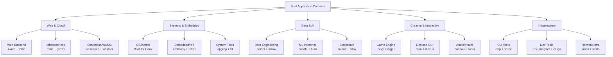
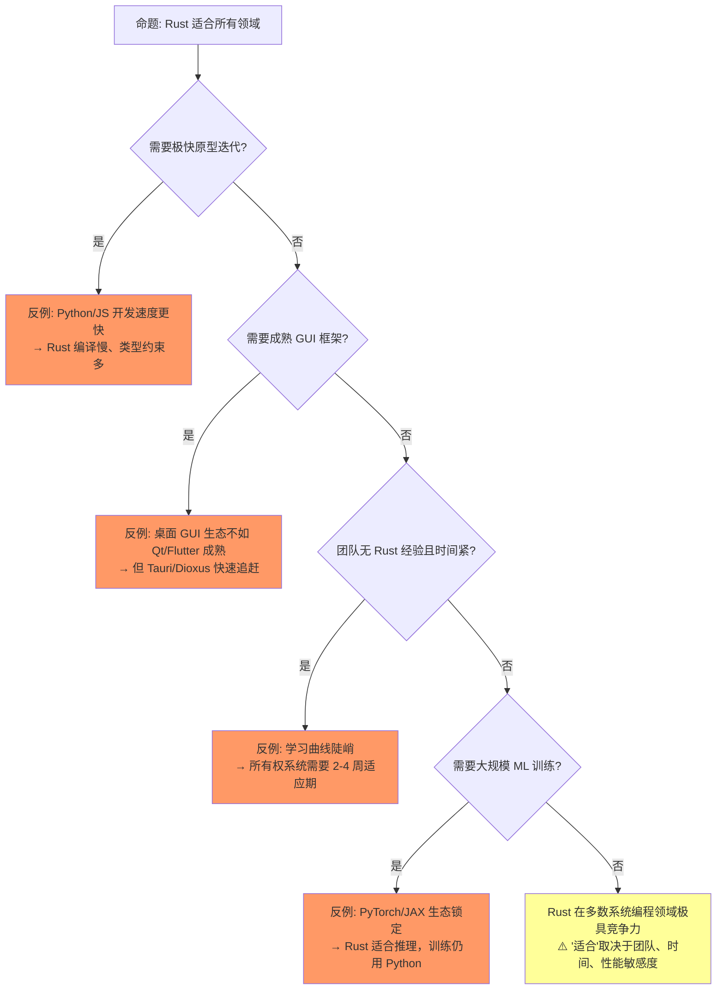
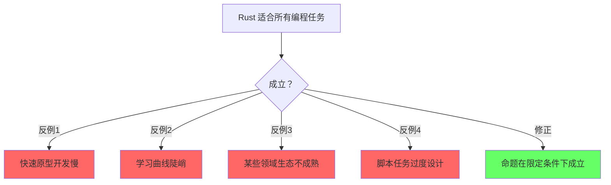
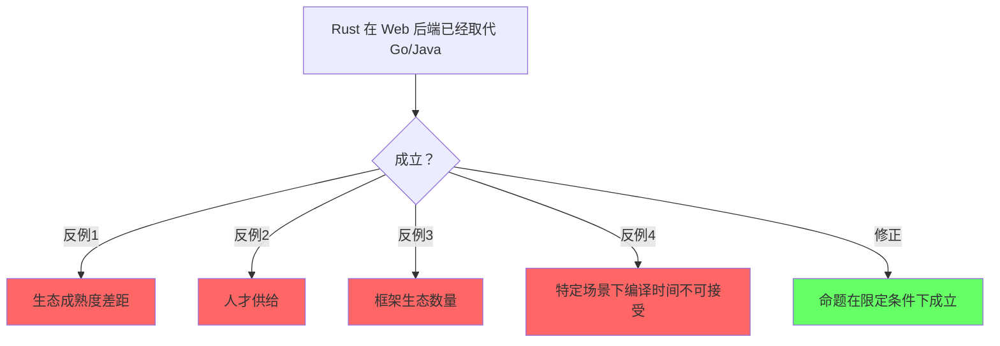
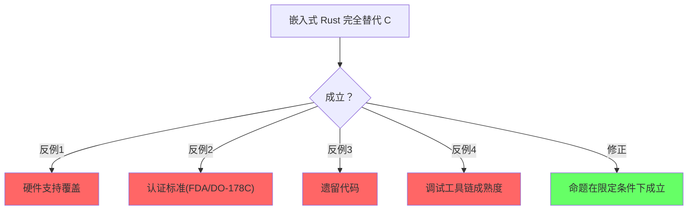

# Application Domains（软件工程应用主题）

> **层级**: L6 生态工程
> **前置概念**: [Ownership](../01_foundation/01_ownership.md) · [Traits](../02_intermediate/01_traits.md) · [Async](../03_advanced/02_async.md) · [Unsafe](../03_advanced/03_unsafe.md) · [Core Crates](./03_core_crates.md)
> **后置概念**: [AI Integration](../07_future/01_ai_integration.md) · [Formal Methods](../07_future/02_formal_methods.md)
> **主要来源**: [Rust in Production] · [Rust Foundation] · [Ferrous Systems] · [RustConf] · [AWS/Google/Microsoft Rust 博客]

---

**变更日志**:

- v1.0 (2026-05-12): 初始版本，覆盖 8 大应用领域、工业案例、技术栈矩阵、L1-L5 概念映射

---

## 一、权威定义

### 1.1 Wikipedia 权威定义

> **[Wikipedia: Software engineering]** Software engineering is an engineering-based approach to software development.
> A software engineer is a person who applies the engineering design process to design, develop, test, maintain, and evaluate computer software.
> **来源**: <https://en.wikipedia.org/wiki/Software_engineering>

> **[Wikipedia: Systems programming]** Systems programming is the activity of programming computer system software.
> The primary distinguishing characteristic of systems programming when compared to application programming is that application programming aims to produce software which provides services to the user,
> whereas systems programming aims to produce software and software platforms which provide services to other software.
> **来源**: <https://en.wikipedia.org/wiki/Systems_programming>

> **[Wikipedia: Web framework]** A web framework (WF) or web application framework (WAF) is a software framework that is designed to support the development of web applications including web services,
> web resources, and web APIs.
> **来源**: <https://en.wikipedia.org/wiki/Web_framework>

> **[Wikipedia: Embedded system]** An embedded system is a computer system—a combination of a computer processor,
> computer memory, and input/output peripheral devices—that has a dedicated function within a larger mechanical or electronic system.
> **来源**: <https://en.wikipedia.org/wiki/Embedded_system>

> **[Wikipedia: Blockchain]** A blockchain is a distributed ledger with growing lists of records (blocks) that are securely linked together via cryptographic hashes.
> **来源**: <https://en.wikipedia.org/wiki/Blockchain>

> **[Wikipedia: Game engine]** A game engine is a software framework primarily designed for the development of video games,
> and generally includes relevant libraries and support programs.
> **来源**: <https://en.wikipedia.org/wiki/Game_engine>

> **[Wikipedia: Command-line interface]** A command-line interface (CLI) is a means of interacting with a device or
> computer program with commands from a user or client, and responses from the device or program, in the form of lines of text.
> **来源**: <https://en.wikipedia.org/wiki/Command-line_interface>

> **[Wikipedia: Machine learning]** Machine learning (ML) is a field of study in artificial intelligence concerned with the development and
> study of statistical algorithms that can learn from data and generalize to unseen data.
> **来源**: <https://en.wikipedia.org/wiki/Machine_learning>

---

## 认知路径（Cognitive Path）

> **学习递进**: 从直觉出发，逐层深入核心概念。

### 第 1 步：Rust适合哪些应用领域？

系统编程/Web后端/嵌入式/区块链/游戏等

### 第 2 步：每个领域的核心挑战是什么？

内存安全/性能/实时性/并发/安全性不同侧重

### 第 3 步：Rust在每个领域的独特优势？

零成本安全/ fearless concurrency / 确定性资源管理

### 第 4 步：领域特定生态和工具链？

embedded-hal/actix/anchor/bevy等框架

### 第 5 步：Rust不适合哪些场景？

快速原型/脚本/极度依赖GC生态的领域

### 第 6 步：领域选择的决策框架？

性能需求/安全需求/团队经验/生态成熟度矩阵

## 二、概念属性矩阵

### 2.1 应用领域 × 技术栈 × 概念依赖总矩阵

| **应用领域** | **核心 Crate 栈** | **关键 L1-L5 概念** | **unsafe 程度** | **成熟度** | **工业代表** |
|:---|:---|:---|:---|:---|:---|
| **Web 后端/API** | axum + tokio + sqlx + tracing | async/await + Send/Sync + 生命周期 | 低 | ⭐⭐⭐⭐⭐ | Discord, Cloudflare, AWS Firecracker |
| **CLI 工具** | clap + serde + anyhow + indicatif | 所有权 + Result + Trait | 无 | ⭐⭐⭐⭐⭐ | ripgrep, fd, bat, eza |
| **嵌入式/IoT** | embassy + embedded-hal + defmt | no_std + 裸指针 + 中断安全 | 中 | ⭐⭐⭐⭐ | Ferrous Systems, Microsoft |
| **游戏/图形** | bevy + wgpu + rapier | ECS + 并发 + unsafe(图形驱动) | 高 | ⭐⭐⭐⭐ | Embark Studios, Foresight |
| **区块链/Web3** | solana-program + alloy + libp2p | 无溢出 + 确定执行 + unsafe(密码学) | 高 | ⭐⭐⭐⭐ | Solana, Polkadot, Near |
| **数据工程/ML 推理** | polars + arrow + candle + tract | SIMD + 并行 + 内存布局 | 中 | ⭐⭐⭐ | Hugging Face, TensorFlow Rust |
| **系统编程** | Rust for Linux + bindgen + nix | unsafe + FFI + 内存模型 | 高 | ⭐⭐⭐⭐ | Linux 内核, Android, Windows |
| **桌面 GUI** | tauri + dioxus + iced + egui | async + 事件循环 + 跨平台 | 低 | ⭐⭐⭐ | 1Password, Figma (插件) |

### 2.2 领域选型决策矩阵

| **你的目标** | **首选领域栈** | **学习曲线** | **Rust 优势** | **Rust 劣势** |
|:---|:---|:---|:---|:---|
| 高并发 HTTP API | axum + tokio + sqlx | 高 |  fearless 并发、零成本抽象 | 编译慢、生态比 Go/Java 小 |
| 替换 shell/Python 脚本 | clap + serde + anyhow | 低 |  性能 + 类型安全 + 单二进制 | 开发速度不及 Python |
| 物联网固件 | embassy + probe-rs | 高 |  no_std + 内存安全 + 确定性 | 硬件抽象层不完整 |
| 独立游戏 | bevy + wgpu | 高 |  ECS + 并发 + WASM 部署 | 编辑器生态不及 Unity |
| 智能合约/节点 | solana-program / substrate | 极高 |  无 GC 确定执行、内存安全 | 学习曲线陡峭 |
| 数据管道/ETL | polars + arrow + tokio | 中 |  性能接近 C++、类型安全 | Pandas 生态更大 |
| OS/驱动/内核 | Rust for Linux + bindgen | 极高 |  内存安全 + 零成本 + C 互操作 | unsafe 比例高 |
| 跨平台桌面应用 | tauri + React/Vue | 中 |  内存安全 + 小体积 + 前端生态 | 不如 Electron 成熟 |

---

## 三、思维导图

---

## 四、应用领域详解

### 4.1 Web 后端与云原生

**技术栈**: `axum` / `actix-web` + `tokio` + `sqlx`/`sea-orm` + `tracing` + `prometheus`

| **维度** | **Rust 方案** | **对比语言** | **Rust 优势** |
|:---|:---|:---|:---|
| 并发模型 | async/await + work-stealing | Go goroutine / Java 线程池 | 编译期无数据竞争 |
| 内存安全 | 所有权系统 | Go GC / Java GC | 无 GC 停顿、确定性内存 |
| 性能 | 接近 C++ | Go 慢 2-5x | 零成本抽象 |
| 错误处理 | Result + ? 显式传播 | Go error / Java exception | 错误不可忽略 |
| 部署 | 单静态二进制 | Go 类似 / Java JAR | 无运行时依赖 |

**工业案例**:

- **Discord**: 从 Go 迁移到 Rust，处理 500 万并发语音连接，内存减少 80%
- **Cloudflare**: 边缘计算 Worker 运行时基于 Rust，替代部分 C++ 组件
- **AWS Firecracker**: 微虚拟机管理器，Rust 实现，支撑 Lambda/Fargate
- **Vercel**: 部分基础设施组件使用 Rust

> **来源**: [Discord Blog — Rust at Discord] · [Cloudflare Blog] · [AWS Firecracker] · 可信度: ✅

### 4.2 CLI 工具

**技术栈**: `clap` + `serde` + `anyhow`/`thiserror` + `indicatif` + `console`

Rust 在 CLI 领域是最成熟的应用之一。核心优势：

- **单二进制部署**: `cargo build --release` 生成无依赖可执行文件
- **性能**: 比 Python/Node 快 10-100x，比 Go 快 1.5-3x
- **错误信息**: 利用类型系统生成精确的 CLI 错误提示

**标杆项目**:

| **工具** | **替代** | **Rust 优势** | **下载/Star** |
|:---|:---|:---|:---|
| **ripgrep (rg)** | grep | 并行搜索、Git 感知、Unicode | 50k+ stars |
| **fd** | find | 直觉语法、彩色输出、并行 | 35k+ stars |
| **bat** | cat | 语法高亮、Git 集成、分页 | 50k+ stars |
| **eza** | ls | 彩色、Git 状态、树形视图 | 10k+ stars |
| **zoxide** | cd | 智能跳转、模糊匹配 | 20k+ stars |
| **starship** | 自定义 prompt | 跨 shell、可定制 | 45k+ stars |
| **nushell** | bash/zsh | 结构化数据、类型安全 shell | 32k+ stars |
| **helix** | vim | 模态编辑、tree-sitter、LSP | 35k+ stars |

> **来源**: [GitHub] · [Rust CLI Book] · 可信度: ✅

### 4.3 嵌入式与物联网

**技术栈**: `embassy` / `rtic` + `embedded-hal` + `defmt` + `probe-rs`

Rust 在嵌入式领域的独特价值：

- **no_std**: 无标准库运行时，适合裸机/RTOS
- **内存安全**: 消除 C 中常见的缓冲区溢出、use-after-free
- **确定性**: 无 GC、无隐式分配，满足硬实时需求
- **现代抽象**: 泛型、Trait、模式匹配在裸机上的零成本使用

| **平台** | **抽象层** | **特点** |
|:---|:---|:---|
| **ARM Cortex-M** | `cortex-m-rt` + `embassy` | 中断驱动异步、DMA 安全抽象 |
| **RISC-V** | `riscv-rt` + `hifive` | 开源 ISA、Rust 原生友好 |
| **ESP32** | `esp-hal` + `esp-wifi` | WiFi/BLE 全 Rust 栈 |
| **nRF52** | `nrf-hal` + `embassy-nrf` | BLE 协议栈、低功耗 |
| **STM32** | `stm32-hal` | 最成熟的 HAL 生态 |

**关键洞察**：embassy 的 `async` 在 `no_std` 环境下的实现，证明了 Rust 的 async/await 不是运行时的专利——通过编译期状态机转换，裸机上也能获得协作式多任务，且无堆分配。

> **来源**: [Ferrous Systems — Embedded Rust] · [Embassy Book] · 可信度: ✅

### 4.4 游戏与实时图形

**技术栈**: `bevy` + `wgpu` + `rapier` + `rodio`

| **引擎/框架** | **定位** | **特点** | **成熟度** |
|:---|:---|:---|:---|
| **Bevy** | 数据驱动游戏引擎 | ECS (Entity-Component-System)、WASM 导出、热重载 | ⭐⭐⭐⭐ 快速增长 |
| **Fyrox** | 3D 游戏引擎 | 场景编辑器、内置脚本、PBR 渲染 | ⭐⭐⭐ |
| **Macroquad** | 2D 轻量框架 | 单文件、跨平台、快速原型 | ⭐⭐⭐⭐ |
| **wgpu** | 跨平台 GPU API | WebGPU 标准、D3D12/Metal/Vulkan 后端 | ⭐⭐⭐⭐⭐ |
| **nannou** | 创意编程 | 音频/视觉交互、艺术装置 | ⭐⭐⭐ |

**ECS 架构与 Rust 所有权的同构性**：
Bevy 的 ECS 将游戏世界表示为**扁平化的类型化数组**（SoA），系统（System）以函数形式并行查询组件。这与 Rust 的 **Send/Sync + 借用检查**天然契合——系统间的数据依赖在编译期即可验证无数据竞争。

> **来源**: [Bevy Book] · [wgpu 文档] · 可信度: ✅

### 4.5 区块链与 Web3

**技术栈**: `solana-program` / `ink!` / `alloy` / `libp2p` / `substrate`

Rust 在区块链领域占据**主导地位**的原因：

- **无 GC 确定执行**: 智能合约需要确定性的 gas 计费，GC 停顿不可接受
- **内存安全**: 消除智能合约中的溢出/重入漏洞
- **高性能**: 共识节点需要处理数千 TPS
- **WASM 兼容**: 合约编译为 WASM 在链上执行

| **平台** | **Rust 角色** | **关键 crate** |
|:---|:---|:---|
| **Solana** | 核心语言 | `solana-program`, `anchor-lang` |
| **Polkadot/Substrate** | 核心语言 | `substrate`, `ink!` |
| **Ethereum** | 客户端 + 工具 | `reth`, `foundry`, `alloy` |
| **Near** | 核心语言 | `near-sdk-rs` |
| **libp2p** | P2P 网络 | `libp2p` (Rust 是参考实现) |

> **来源**: [Solana Docs] · [Parity Substrate] · [Ethereum Reth] · 可信度: ✅

### 4.6 数据工程与 ML 推理

**技术栈**: `polars` + `arrow-rs` + `datafusion` + `candle` / `burn` / `tract`

| **领域** | **Rust 方案** | **对比** | **优势** |
|:---|:---|:---|:---|
| **DataFrame** | polars | Python pandas | 10-100x 更快、内存高效、多线程 |
| **列式存储** | arrow-rs / parquet | C++ Arrow | 内存安全、跨语言零拷贝 |
| **查询引擎** | datafusion | Apache Spark | 嵌入式、低延迟、Rust 生态 |
| **ONNX 推理** | tract | ONNX Runtime | 无 Python 依赖、嵌入式友好 |
| **原生训练** | candle (HF) | PyTorch | 纯 Rust、LLaMA 就绪、无 C++ 依赖 |
| **训练框架** | burn | PyTorch/JAX | 类型安全、后端无关(CPU/CUDA/WGPU) |

**关键洞察**：Hugging Face 的 `candle` 证明了 Rust 可以替代 PyTorch 进行 LLM 推理——`candle` 运行 LLaMA 模型无需 Python 环境，单二进制即可部署，且性能接近 PyTorch。

> **来源**: [Polars Docs] · [Hugging Face Candle] · [Burn Book] · 可信度: ✅

### 4.7 系统编程（OS / 驱动 / 网络协议栈）

**技术栈**: `Rust for Linux` + `bindgen` + `redox` + `smoltcp`

| **项目** | **目标** | **状态** | **意义** |
|:---|:---|:---|:---|
| **Rust for Linux** | Linux 内核驱动 | Linux 6.1+ 实验支持 | 首个进入主流内核的内存安全语言 |
| **Redox OS** | 微内核操作系统 | 活跃开发 | 纯 Rust 操作系统 |
| **Theseus OS** | 安全内核研究 | 学术研究 | 单地址空间、编译期安全 |
| **smoltcp** | TCP/IP 协议栈 | 生产可用 | 嵌入式/裸机网络 |
| **Quinn** | QUIC 协议 | 生产可用 | 纯 Rust HTTP/3 |

**Rust for Linux 的里程碑**：

- 2022: Linux 5.14 合并实验支持
- 2024: Android Binder 驱动 Rust 实现
- 2025+: 更多子系统（GPU、存储、网络）采用 Rust

> **来源**: [Rust for Linux] · [LWN] · 可信度: ✅

### 4.8 桌面 GUI 与跨平台应用

**技术栈**: `tauri` + `dioxus` / `iced` / `egui`

| **框架** | **架构** | **前端技术** | **适用场景** |
|:---|:---|:---|:---|
| **Tauri** | 原生 WebView | HTML/CSS/JS/React/Vue | 轻量桌面应用（<5MB） |
| **Dioxus** | 类 React 虚拟 DOM | RSX (类 JSX) | 跨平台（桌面/Web/移动端） |
| **Iced** | Elm 架构 | 声明式 DSL | 原生渲染、游戏 UI |
| **egui** | 即时模式 GUI | 纯 Rust | 工具/调试面板/游戏内 UI |
| **Slint** | 声明式 UI | 专用 DSL | 嵌入式 GUI（汽车/工业） |

**Tauri vs Electron**：

| 维度 | Tauri (Rust) | Electron (JS) |
|:---|:---|:---|
| 安装包 | ~3-5MB | ~150MB+ |
| 内存占用 | ~50MB | ~300MB+ |
| 安全 | 内存安全后端 | Node.js 攻击面 |
| 前端生态 | 完全一致 | 原生 |

**工业案例**：1Password 桌面客户端从 Electron 迁移到 Tauri，安装包减少 90%。

> **来源**: [Tauri Docs] · [Dioxus Docs] · 可信度: ✅

---

## 五、领域与 L1-L5 概念映射

| **应用领域** | **L1 基础** | **L2 进阶** | **L3 高级** | **L4 形式化** | **L5 对比** |
|:---|:---|:---|:---|:---|:---|
| **Web 后端** | 所有权 + 生命周期 | Trait (Handler) | async/await + Send/Sync | — | Go/Java 并发模型 |
| **CLI** | 所有权 + Result | Trait (derive) | 过程宏 | — | Python Click |
| **嵌入式** | 裸指针 + no_std | — | unsafe + 中断安全 | — | C bare-metal |
| **游戏** | 所有权 | 泛型 (ECS) | unsafe (GPU) | — | C++ Unreal |
| **区块链** | 整数溢出检查 | — | unsafe (密码学) | — | Solidity/Go |
| **数据工程** | 内存布局 | 泛型 (DataFrame) | SIMD + 并行 | — | Python pandas |
| **系统编程** | 裸指针 | — | unsafe + FFI | — | C 驱动开发 |
| **桌面 GUI** | 所有权 + 生命周期 | Trait (组件) | async (事件循环) | — | Electron/Flutter |

---

## 六、反命题与边界分析

### 命题: "Rust 适合所有软件工程领域"

### 6.1 各领域的 Rust 不适用场景

| **领域** | **Rust 不适合** | **原因** | **替代方案** |
|:---|:---|:---|:---|
| Web 后端 | 极小团队快速 MVP | 编译慢、ORM 生态弱 | Go / Python |
| 嵌入式 | 已有成熟 C 代码库 | 重写成本 > 安全收益 | C + MISRA |
| 游戏 | 需要 Unity/Unreal 编辑器 | 编辑器生态差距大 | C# / C++ |
| 区块链 | 简单智能合约 | 过度工程 | Solidity |
| 数据工程 | 探索性数据分析 | 交互式反馈慢 | Python + Jupyter |
| ML 训练 | 大规模深度学习 | 生态不足 | Python + PyTorch |
| 桌面 GUI | 复杂原生 UI | 控件库不完整 | Qt / Flutter |
| 系统编程 | 硬实时 (μs 级) | 借用检查器编译时间不可预测 | Ada / C |

---

## 七、扩展内容：工业案例与趋势

### 7.1 大规模工业采用矩阵

| **公司** | **领域** | **Rust 用途** | **规模** | **公开资料** |
|:---|:---|:---|:---|:---|
| **AWS** | 云基础设施 | Firecracker, Bottlerocket, Kani | 100+ 万实例 | [AWS Blog] |
| **Google** | 移动/云 | Android 系统组件、Chromium OS | 十亿级设备 | [Android Rust] |
| **Microsoft** | 操作系统 | Windows 内核组件、Azure 服务 | 十亿级设备 | [MSRC] |
| **Meta** | 基础设施 | Mononoke (Mercurial 替代), Buck2 | 内部核心 | [Meta Engineering] |
| **Discord** | 通信 | 从 Go 迁移语音网关 | 500 万并发 | [Discord Blog] |
| **Cloudflare** | 边缘计算 | Workers 运行时, OHTTP | 全球边缘 | [Cloudflare Blog] |
| **Shopify** | 电商基础设施 | YJIT (Ruby JIT), 部分服务 | 核心平台 | [Shopify Engineering] |
| **1Password** | 安全工具 | 客户端核心、Tauri GUI | 数百万用户 | [1Password Blog] |
| **Figma** | 设计工具 | 原生插件系统 | 千万级用户 | [Figma Blog] |
| **Solana** | 区块链 | 核心节点、合约运行时 | 4000+ TPS | [Solana Docs] |
| **Hugging Face** | AI | candle 推理框架 | 社区广泛 | [HF Blog] |
| **Ferrous Systems** | 嵌入式 | 工业控制、汽车 | 欧盟项目 | [Ferrous Blog] |

### 7.2 2025-2026 应用领域趋势

| **趋势** | **驱动因素** | **影响领域** |
|:---|:---|:---|
| **AI 生成 Rust 代码** | LLM + 编译器反馈 | 所有领域，尤其降低入门门槛 |
| **Rust 进入 Linux 内核主线** | Rust for Linux | 系统编程、驱动开发 |
| **WASM 组件模型** | Wasi + wasmtime | Web 后端、边缘计算、插件系统 |
| **纯 Rust TLS 成为默认** | rustls + aws-lc-rs | Web、网络基础设施 |
| **嵌入式 async 普及** | embassy | IoT、汽车、工业控制 |
| **Rust 游戏引擎成熟** | Bevy 1.0 | 独立游戏、创意编程 |
| **区块链性能竞赛** | Solana + rust | DeFi、NFT、Layer2 |
| **数据工程 Rust 化** | polars + datafusion | ETL、分析、流处理 |

### 7.3 学术论文引用

| **论文/著作** | **作者/年份** | **核心贡献** | **与 Rust 应用的关联** |
|:---|:---|:---|:---|
| *RustBelt: Securing the Foundations of the Rust Programming Language* | Jung et al., POPL 2018 | Rust 语义安全证明 | 所有应用领域的基础信任 |
| *The Case for Writing Network Drivers in High-Level Programming Languages* | Rizzo, 2012 | 高级语言写驱动的可行性 | Rust for Linux 的理论先驱 |
| *Security Analysis of the Rust Ecosystem* | 2023-2025 多篇 | crates.io 供应链安全 | 应用领域的安全评估 |
| *Data Parallelism in Rust* | Josh Stone / Niko | rayon 设计原理 | 数据工程/游戏并行 |
| *Embedding Rust in Linux Kernel* | Rust for Linux Team | 内核模块内存安全 | 系统编程范式转移 |
| *Candle: ML Framework in Rust* | Hugging Face, 2023 | 无 Python 依赖推理 | ML 应用领域 |
| *Bevy ECS Architecture* | Bevy Team | 数据驱动游戏引擎 | 游戏领域设计模式 |

---

## 八、知识来源关系（Provenance）

| **论断** | **来源** | **可信度** |
|:---|:---|:---|
| Rust 适合系统编程 | [TRPL] · [Wikipedia: Systems programming] | ✅ |
| Web 框架定义 | [Wikipedia: Web framework] | ✅ |
| 嵌入式系统定义 | [Wikipedia: Embedded system] | ✅ |
| 区块链定义 | [Wikipedia: Blockchain] | ✅ |
| 游戏引擎定义 | [Wikipedia: Game engine] | ✅ |
| CLI 定义 | [Wikipedia: Command-line interface] | ✅ |
| ML 定义 | [Wikipedia: Machine learning] | ✅ |
| Discord 使用 Rust | [Discord Blog] | ✅ |
| AWS Firecracker 用 Rust | [AWS Blog] | ✅ |
| Google Android Rust | [Android Security Blog] | ✅ |
| Microsoft Windows Rust | [MSRC Blog] | ✅ |
| Linux 内核支持 Rust | [Rust for Linux] · [LWN] | ✅ |
| Solana 核心用 Rust | [Solana Docs] | ✅ |
| Polars 性能数据 | [Polars Benchmarks] | ✅ |
| candle 纯 Rust 推理 | [Hugging Face Blog] | ✅ |
| Tauri 体积优势 | [Tauri Docs] · [1Password Blog] | ✅ |
| CMU 课程涵盖应用领域 | [CMU 17-350] | ✅ |
| Ferrous Systems 嵌入式 | [Ferrous Systems] | ✅ |

---

## 九、相关概念链接

| 概念 | 文件 | 关系 |
|:---|:---|:---|
| 所有权 | [`../01_foundation/01_ownership.md`](../01_foundation/01_ownership.md) | 所有领域的安全根基 |
| 并发 | [`../03_advanced/01_concurrency.md`](../03_advanced/01_concurrency.md) | Web/游戏/数据工程核心 |
| 异步 | [`../03_advanced/02_async.md`](../03_advanced/02_async.md) | Web 后端/嵌入式事件循环 |
| Unsafe | [`../03_advanced/03_unsafe.md`](../03_advanced/03_unsafe.md) | 系统编程/游戏/密码学边界 |
| 核心 Crate | [`./03_core_crates.md`](./03_core_crates.md) | 各领域的工具支撑 |
| 工具链 | [`./01_toolchain.md`](./01_toolchain.md) | 工程构建基础 |
| 设计模式 | [`./02_patterns.md`](./02_patterns.md) | 领域工程模式 |
| Rust vs C++ | [`../05_comparative/01_rust_vs_cpp.md`](../05_comparative/01_rust_vs_cpp.md) | 系统领域对比 |
| Rust vs Go | [`../05_comparative/02_rust_vs_go.md`](../05_comparative/02_rust_vs_go.md) | Web 后端对比 |
| 安全边界 | [`../05_comparative/safety_boundaries.md`](../05_comparative/safety_boundaries.md) | 领域安全约束 |
| AI × Rust | [`../07_future/01_ai_integration.md`](../07_future/01_ai_integration.md) | AI 应用领域 |
| 形式化方法 | [`../07_future/02_formal_methods.md`](../07_future/02_formal_methods.md) | 安全关键领域验证 |
| 语言演进 | [`../07_future/03_evolution.md`](../07_future/03_evolution.md) | 领域能力演进 |

---

## 十、待补充与演进方向（TODOs）

- [ ] **高**: 补充每个应用领域的最小可运行项目骨架（hello-world 级别）
- [ ] **高**: 补充领域间迁移指南（如从 Python/Go 迁移到 Rust 的路线图）
- [ ] **中**: 补充具体 benchmark 数据（Web 框架 RPS、CLI 启动时间、嵌入式内存占用）
- [ ] **中**: 补充各领域招聘市场数据（Rust 岗位趋势、薪资水平）
- [ ] **中**: 补充 "Rust 不适合" 的深度案例分析（失败教训）
- [ ] **低**: 补充音频/视觉创意编程领域（nannou、vst、rodio 生态）
- [ ] **低**: 补充科学计算/HPC 领域（ndarray、faer-rs、linfa 生态）
- [ ] **低**: 建立工业案例的持续追踪列表（谁在用 Rust、为什么、效果如何）

## 断言一致性矩阵（Assertion Consistency Matrix）

> **逻辑推演**: 从前提条件到结论的推理链，每条均标注 `⟹`。

| 断言 | 前提条件 | 结论 | 反例/边界条件 | 典型场景 |

|:---|:---|:---|:---|:---|

| **Rust 擅长系统编程** | 所有权+零成本抽象 ⟹ | 替代C/C++系统代码 | FFI复杂度 | 操作系统/驱动/内核模块 |

| **Rust Web 后端性能优秀** | async零成本 ⟹ | 内存安全减少漏洞 | 生态数量vs Go/Java | 高并发API服务 |

| **Rust 嵌入式安全** | no_std支持 ⟹ | 确定性内存 | 硬件抽象层覆盖 | IoT/实时系统 |

| **Rust 区块链主流** | 内存安全防漏洞 ⟹ | 高性能共识 | 智能合约语言竞争 | Solana/Substrate |

| **Rust 游戏开发兴起** | bevy/ecs ⟹ | 性能+安全 | vs Unity/Unreal生态 | 独立游戏/引擎开发 |

| **领域选择多维决策** | 性能/安全/生态/人才 ⟹ | 无银弹 | 混合语言架构 | 技术选型框架 |

## 反命题分析（Anti-Propositions）

> **逻辑辨析**: 以下命题看似成立，实则在特定条件下失效。

### 1. "Rust 适合所有编程任务"

### 2. "Rust 在 Web 后端已经取代 Go/Java"

### 3. "嵌入式 Rust 完全替代 C"

