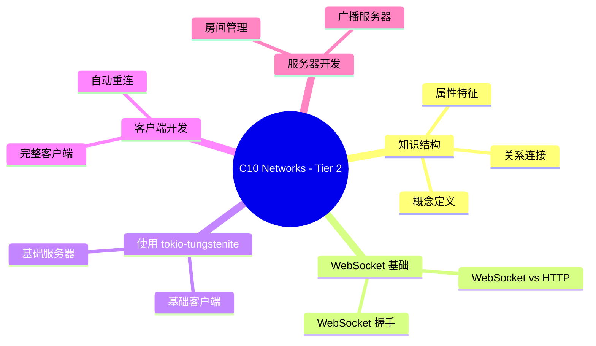

> **EN**: WebSocket Real-Time Communication
> **Summary**: Authoritative concept page for `03 Websocket Realtime Communication`. Content migrated from `crates/c10_networks/docs/tier_02_guides/03_websocket_realtime_communication.md`.
> **受众**: [进阶]
> **内容分级**: [参考级]
> **Bloom 层级**: L2-L4
> **权威来源**: 本文件为 `concept/` 权威页。
> **A/S/P 标记**: **A+S** — Application + Structure
> **双维定位**: A×App — WebSocket 实时通信应用
> **前置依赖**: [Network Protocols](07_network_protocols.md) · [Async](../../03_advanced/01_async/01_async.md)
> **后置概念**: [High Performance Network Service Architecture](08_high_performance_network_service_architecture.md) · [Web Frameworks](03_web_frameworks.md)
> **定理链**: Real-Time Requirement ⟹ Connection State ⟹ Message Delivery
>
> **权威来源**: 本页为 `WebSocket Real-Time Communication` 的权威概念页；crate 文档仅保留导航 stub。

# C10 Networks - Tier 2: WebSocket 实时通信

> **文档版本**: v1.0.0
> **最后更新**: 2025-12-11
> **Rust 版本**: 1.97.0+ (Edition 2024)
> **预计阅读**: 35 分钟

---

## 📊 目录

- [C10 Networks - Tier 2: WebSocket 实时通信](#c10-networks---tier-2-websocket-实时通信)
  - [📊 目录](#-目录)
  - [📐 知识结构](#-知识结构)
    - [概念定义](#概念定义)
    - [属性特征](#属性特征)
    - [关系连接](#关系连接)
    - [思维导图](#思维导图)
    - [概念矩阵](#概念矩阵)
  - [1. WebSocket 基础](#1-websocket-基础)
    - [1.1 WebSocket vs HTTP](#11-websocket-vs-http)
    - [1.2 WebSocket 握手](#12-websocket-握手)
  - [2. 使用 tokio-tungstenite](#2-使用-tokio-tungstenite)
    - [2.1 基础客户端](#21-基础客户端)
    - [2.2 基础服务器](#22-基础服务器)
  - [3. 客户端开发](#3-客户端开发)
    - [3.1 完整客户端](#31-完整客户端)
    - [3.2 自动重连](#32-自动重连)
  - [4. 服务器开发](#4-服务器开发)
    - [4.1 广播服务器](#41-广播服务器)
    - [4.2 房间管理](#42-房间管理)
  - [5. 消息格式与编解码](#5-消息格式与编解码)
    - [5.1 JSON 消息](#51-json-消息)
    - [5.2 二进制消息](#52-二进制消息)
  - [6. 实战案例](#6-实战案例)
    - [6.1 聊天室](#61-聊天室)
    - [6.2 实时数据推送](#62-实时数据推送)
  - [⚠️ 反例与陷阱](#️-反例与陷阱)
  - [7. 总结](#7-总结)
    - [核心要点](#核心要点)
    - [最佳实践](#最佳实践)
  - [📚 参考资源](#-参考资源)
  - [**下一步**: 学习 TCP/UDP 编程，掌握底层网络协议](#下一步-学习-tcpudp-编程掌握底层网络协议)
  - [过渡段](#过渡段)
  - [定理链](#定理链)
  - [国际权威参考 / International Authority References（P1 学术 · P2 生态）](#国际权威参考--international-authority-referencesp1-学术--p2-生态)

## 📐 知识结构

「知识结构」部分按概念定义、属性特征、关系连接、思维导图等5个方面的顺序逐层展开。

### 概念定义

**WebSocket**:

- **定义**: 在单个 TCP 连接上进行全双工通信的协议，支持实时双向数据传输
- **类型**: 网络协议
- **范畴**: 网络编程、实时通信
- **版本**: RFC 6455
- **相关概念**: HTTP、TCP、实时通信、双向通信

### 属性特征

**核心属性**:

- **长连接**: 保持连接打开，支持持续通信
- **双向通信**: 客户端和服务器都可以主动发送消息
- **低开销**: 握手后只有少量协议开销
- **实时性**: 支持实时数据传输

**性能特征**:

- **延迟**: 比 HTTP 轮询更低
- **吞吐量**: 支持高吞吐量通信
- **适用场景**: 实时聊天、实时数据推送、在线游戏

### 关系连接

**继承关系**:

- WebSocket --[is-a]--> 应用层协议
- WebSocket --[extends]--> HTTP 握手

**组合关系**:

- WebSocket 应用 --[uses]--> WebSocket 协议
- 实时通信系统 --[uses]--> WebSocket

**依赖关系**:

- WebSocket --[depends-on]--> TCP
- WebSocket --[depends-on]--> HTTP 握手

### 思维导图

```text
WebSocket 实时通信
│
├── WebSocket 基础
│   ├── vs HTTP
│   └── 握手过程
├── 客户端开发
│   ├── 基础客户端
│   └── 自动重连
├── 服务器开发
│   ├── 广播服务器
│   └── 房间管理
├── 消息格式
│   ├── JSON
│   └── 二进制
└── 实战案例
    ├── 聊天室
    └── 实时推送
```

### 概念矩阵

| 特性     | HTTP             | WebSocket    |
| :--- | :--- | :--- |
| 连接方式 | 短连接           | 长连接       |
| 通信方向 | 单向             | 双向         |
| 开销     | 每次请求都有头部 | 握手后低开销 |
| 适用场景 | 普通数据获取     | 实时通信     |
| 延迟     | 较高             | 较低         |

---

## 1. WebSocket 基础

WebSocket（RFC 6455）与 HTTP 的本质差异是**连接生命周期与消息方向**：

| 维度 | HTTP/1.1 | WebSocket |
|---|---|---|
| 连接 | 短连接/keep-alive 复用 | 长连接，一次握手后常驻 |
| 消息方向 | 客户端发起 | 全双工，服务端可主动推送 |
| 帧开销 | 每请求数百字节头 | 2–14 字节帧头 |
| 状态 | 无状态 | 有状态（会话绑定） |

握手过程：客户端发 `Upgrade: websocket` + `Sec-WebSocket-Key`（16 字节随机 base64），服务端以 `Sec-WebSocket-Accept = base64(sha1(key + "258EAFA5-E914-47DA-95CA-C5AB0DC85B11"))` 应答——该魔数拼接不是安全机制，只是防止非 WebSocket 中间件误升级。

判定依据：仅「服务端推送」需求可先评估 SSE（更简单、走 HTTP 基础设施）；需要双向高频消息才用 WebSocket。

### 1.1 WebSocket vs HTTP

| 特性         | HTTP              | WebSocket    |
| :--- | :--- | :--- |
| **连接方式** | 短连接            | 长连接       |
| **通信方向** | 单向（请求/响应） | 双向         |
| **开销**     | 每次请求都有头部  | 握手后低开销 |
| **适用场景** | 普通数据获取      | 实时通信     |

### 1.2 WebSocket 握手

**HTTP 升级请求**：

```http
GET /chat HTTP/1.1
Host: server.example.com
Upgrade: websocket
Connection: Upgrade
Sec-WebSocket-Key: dGhlIHNhbXBsZSBub25jZQ==
Sec-WebSocket-Version: 13
```

**服务器响应**：

```http
HTTP/1.1 101 Switching Protocols
Upgrade: websocket
Connection: Upgrade
Sec-WebSocket-Accept: s3pPLMBiTxaQ9kYGzzhZRbK+xOo=
```

---

## 2. 使用 tokio-tungstenite

本节围绕「使用 tokio-tungstenite」展开，覆盖基础客户端 与 基础服务器 两个方面。

### 2.1 基础客户端

```rust
use tokio_tungstenite::{connect_async, tungstenite::Message};
use futures_util::{StreamExt, SinkExt};

#[tokio::main]
async fn main() -> Result<(), Box<dyn std::error::Error>> {
    // 连接 WebSocket 服务器
    let (ws_stream, _) = connect_async("ws://echo.websocket.org").await?;
    println!("WebSocket 已连接");

    let (mut write, mut read) = ws_stream.split();

    // 发送消息
    write.send(Message::Text("Hello WebSocket".to_string())).await?;

    // 接收消息
    if let Some(msg) = read.next().await {
        let msg = msg?;
        println!("收到: {}", msg);
    }

    Ok(())
}
```

### 2.2 基础服务器

```rust
use tokio::net::TcpListener;
use tokio_tungstenite::accept_async;
use futures_util::{StreamExt, SinkExt};

#[tokio::main]
async fn main() -> Result<(), Box<dyn std::error::Error>> {
    let listener = TcpListener::bind("127.0.0.1:9001").await?;
    println!("WebSocket 服务器运行在 ws://127.0.0.1:9001");

    while let Ok((stream, addr)) = listener.accept().await {
        tokio::spawn(async move {
            println!("新连接: {}", addr);

            let ws_stream = accept_async(stream).await.expect("握手失败");
            let (mut write, mut read) = ws_stream.split();

            while let Some(msg) = read.next().await {
                let msg = msg.expect("读取消息失败");

                if msg.is_text() || msg.is_binary() {
                    // 回显消息
                    write.send(msg).await.expect("发送消息失败");
                }
            }
        });
    }

    Ok(())
}
```

---

## 3. 客户端开发

本节围绕「客户端开发」展开，覆盖完整客户端 与 自动重连 两个方面。

### 3.1 完整客户端

```rust
use tokio_tungstenite::{connect_async, tungstenite::Message};
use futures_util::{StreamExt, SinkExt, stream::SplitSink};
use tokio::sync::mpsc;
use tokio::net::TcpStream;
use tokio_tungstenite::WebSocketStream;

type WsWrite = SplitSink<WebSocketStream<tokio_tungstenite::MaybeTlsStream<TcpStream>>, Message>;

struct WebSocketClient {
    sender: mpsc::UnboundedSender<Message>,
}

impl WebSocketClient {
    async fn new(url: &str) -> Result<Self, Box<dyn std::error::Error>> {
        let (ws_stream, _) = connect_async(url).await?;
        let (write, mut read) = ws_stream.split();

        let (tx, mut rx) = mpsc::unbounded_channel::<Message>();

        // 发送任务
        tokio::spawn(async move {
            Self::send_task(write, &mut rx).await;
        });

        // 接收任务
        tokio::spawn(async move {
            Self::receive_task(&mut read).await;
        });

        Ok(Self { sender: tx })
    }

    async fn send_task(mut write: WsWrite, rx: &mut mpsc::UnboundedReceiver<Message>) {
        while let Some(msg) = rx.recv().await {
            if write.send(msg).await.is_err() {
                break;
            }
        }
    }

    async fn receive_task<S>(read: &mut futures_util::stream::SplitStream<S>)
    where
        S: StreamExt<Item = Result<Message, tokio_tungstenite::tungstenite::Error>> + Unpin,
    {
        while let Some(msg) = read.next().await {
            match msg {
                Ok(Message::Text(text)) => {
                    println!("收到文本: {}", text);
                }
                Ok(Message::Binary(data)) => {
                    println!("收到二进制: {} 字节", data.len());
                }
                Ok(Message::Close(_)) => {
                    println!("连接关闭");
                    break;
                }
                Err(e) => {
                    eprintln!("接收错误: {}", e);
                    break;
                }
                _ => {}
            }
        }
    }

    fn send(&self, msg: Message) -> Result<(), Box<dyn std::error::Error>> {
        self.sender.send(msg)?;
        Ok(())
    }
}

#[tokio::main]
async fn main() -> Result<(), Box<dyn std::error::Error>> {
    let client = WebSocketClient::new("ws://echo.websocket.org").await?;

    // 发送测试消息
    client.send(Message::Text("Test 1".to_string()))?;
    client.send(Message::Text("Test 2".to_string()))?;

    tokio::time::sleep(tokio::time::Duration::from_secs(3)).await;

    Ok(())
}
```

### 3.2 自动重连

```rust
use tokio_tungstenite::connect_async;
use std::time::Duration;

async fn connect_with_retry(url: &str, max_retries: u32) -> Result<(), Box<dyn std::error::Error>> {
    let mut attempts = 0;

    loop {
        match connect_async(url).await {
            Ok((ws_stream, _)) => {
                println!("连接成功");
                // 处理连接...
                break;
            }
            Err(e) if attempts < max_retries => {
                attempts += 1;
                println!("连接失败（{}/{}）: {}", attempts, max_retries, e);
                tokio::time::sleep(Duration::from_secs(2_u64.pow(attempts))).await;
            }
            Err(e) => return Err(e.into()),
        }
    }

    Ok(())
}

#[tokio::main]
async fn main() -> Result<(), Box<dyn std::error::Error>> {
    connect_with_retry("ws://echo.websocket.org", 3).await
}
```

---

## 4. 服务器开发

服务器开发的两个核心模式：

**广播服务器**：连接注册表的经典实现是 `tokio::sync::broadcast`（多消费者通道，自带慢消费者丢弃语义）或集中式 `HashMap<ConnId, mpsc::Sender>` + 写扇出任务。注意 `broadcast::Sender::send` 在无接收者时返回 `Err`，不算失败。

**房间管理**：双层注册表 `HashMap<RoomId, HashMap<ConnId, Sender>>` 的并发保护选择——单写者任务串行化（actor 模式，无锁）优于 `RwLock` 包裹（锁内做网络发送会放大尾延迟）。**绝不在持锁状态下 `.await` 网络操作**——这会把 I/O 延迟传导为全局停顿。

判定依据：连接数 <10k 用 broadcast；>10k 或需跨节点，引入 Redis pub/sub / NATS 做扇出，单机注册表无法水平扩展。

### 4.1 广播服务器

```rust
use tokio::net::TcpListener;
use tokio::sync::broadcast;
use tokio_tungstenite::{accept_async, tungstenite::Message};
use futures_util::{StreamExt, SinkExt};

#[tokio::main]
async fn main() -> Result<(), Box<dyn std::error::Error>> {
    let listener = TcpListener::bind("127.0.0.1:9001").await?;
    let (tx, _rx) = broadcast::channel::<String>(100);

    println!("广播服务器运行在 ws://127.0.0.1:9001");

    loop {
        let (stream, addr) = listener.accept().await?;
        let tx = tx.clone();
        let mut rx = tx.subscribe();

        tokio::spawn(async move {
            let ws_stream = accept_async(stream).await.expect("握手失败");
            let (mut write, mut read) = ws_stream.split();

            println!("客户端 {} 已连接", addr);

            // 接收并广播消息
            let tx_clone = tx.clone();
            tokio::spawn(async move {
                while let Some(msg) = read.next().await {
                    if let Ok(Message::Text(text)) = msg {
                        println!("收到消息: {}", text);
                        let _ = tx_clone.send(text);
                    }
                }
                println!("客户端 {} 断开连接", addr);
            });

            // 转发广播消息
            while let Ok(text) = rx.recv().await {
                if write.send(Message::Text(text)).await.is_err() {
                    break;
                }
            }
        });
    }
}
```

### 4.2 房间管理

```rust
use tokio::sync::RwLock;
use std::collections::HashMap;
use std::sync::Arc;

type ClientId = usize;
type RoomId = String;

struct Room {
    id: RoomId,
    clients: Vec<ClientId>,
}

struct RoomManager {
    rooms: Arc<RwLock<HashMap<RoomId, Room>>>,
    next_client_id: Arc<RwLock<ClientId>>,
}

impl RoomManager {
    fn new() -> Self {
        Self {
            rooms: Arc::new(RwLock::new(HashMap::new())),
            next_client_id: Arc::new(RwLock::new(0)),
        }
    }

    async fn create_room(&self, room_id: RoomId) {
        let mut rooms = self.rooms.write().await;
        rooms.insert(room_id.clone(), Room {
            id: room_id,
            clients: Vec::new(),
        });
    }

    async fn join_room(&self, room_id: &str, client_id: ClientId) -> bool {
        let mut rooms = self.rooms.write().await;
        if let Some(room) = rooms.get_mut(room_id) {
            room.clients.push(client_id);
            true
        } else {
            false
        }
    }

    async fn leave_room(&self, room_id: &str, client_id: ClientId) {
        let mut rooms = self.rooms.write().await;
        if let Some(room) = rooms.get_mut(room_id) {
            room.clients.retain(|&id| id != client_id);
        }
    }

    async fn get_next_client_id(&self) -> ClientId {
        let mut id = self.next_client_id.write().await;
        let current = *id;
        *id += 1;
        current
    }
}

fn main() {
    let manager = RoomManager::new();
    println!("房间管理器已创建");
}
```

---

## 5. 消息格式与编解码

消息格式的选择沿「可读性 → 带宽 → 类型安全」光谱分布：

- **JSON**（`serde_json`）：调试友好，浏览器原生；体积与解析成本最高，适合控制面消息。
- **MessagePack / CBOR**：schema-less 二进制，体积约为 JSON 的 60–70%，适合中频数据面。
- **Protobuf / FlatBuffers**：schema 驱动、零拷贝读取（FlatBuffers），适合高频行情/游戏帧同步；代价是 `.proto` 构建链与版本治理。

Rust 侧的编解码骨架统一为 `serde::{Serialize, Deserialize}` + `tokio_util::codec` 的 `Encoder/Decoder` 实现帧定界（WebSocket 已自带帧边界，codec 只在裸 TCP 上需要）。

判定依据：先用 JSON 打通链路，profile 确认序列化占 CPU >10% 再换二进制格式——过早引入 schema 治理成本。

### 5.1 JSON 消息

```rust
use serde::{Serialize, Deserialize};
use tokio_tungstenite::tungstenite::Message;

#[derive(Serialize, Deserialize, Debug)]
#[serde(tag = "type")]
enum WsMessage {
    Join { room: String, username: String },
    Leave { room: String },
    Message { room: String, content: String },
    Ping,
    Pong,
}

impl WsMessage {
    fn to_message(&self) -> Result<Message, serde_json::Error> {
        let json = serde_json::to_string(self)?;
        Ok(Message::Text(json))
    }

    fn from_message(msg: Message) -> Result<Self, Box<dyn std::error::Error>> {
        match msg {
            Message::Text(text) => {
                let parsed = serde_json::from_str(&text)?;
                Ok(parsed)
            }
            _ => Err("不支持的消息类型".into()),
        }
    }
}

fn main() -> Result<(), Box<dyn std::error::Error>> {
    let msg = WsMessage::Join {
        room: "general".to_string(),
        username: "Alice".to_string(),
    };

    let ws_msg = msg.to_message()?;
    println!("序列化: {:?}", ws_msg);

    let parsed = WsMessage::from_message(ws_msg)?;
    println!("反序列化: {:?}", parsed);

    Ok(())
}
```

### 5.2 二进制消息

```rust
use tokio_tungstenite::tungstenite::Message;

fn encode_binary_message(msg_type: u8, data: &[u8]) -> Message {
    let mut payload = vec![msg_type];
    payload.extend_from_slice(data);
    Message::Binary(payload)
}

fn decode_binary_message(msg: Message) -> Result<(u8, Vec<u8>), String> {
    match msg {
        Message::Binary(data) if !data.is_empty() => {
            let msg_type = data[0];
            let payload = data[1..].to_vec();
            Ok((msg_type, payload))
        }
        _ => Err("无效的二进制消息".to_string()),
    }
}

fn main() {
    let msg = encode_binary_message(1, b"Hello");
    println!("编码: {:?}", msg);

    let (msg_type, data) = decode_binary_message(msg).unwrap();
    println!("解码: type={}, data={:?}", msg_type, String::from_utf8_lossy(&data));
}
```

---

## 6. 实战案例

「实战案例」部分包含聊天室 与 实时数据推送 两条主线，本节依次说明。

### 6.1 聊天室

```rust
use tokio::net::TcpListener;
use tokio::sync::{broadcast, mpsc};
use tokio_tungstenite::{accept_async, tungstenite::Message};
use futures_util::{StreamExt, SinkExt};
use serde::{Serialize, Deserialize};

#[derive(Serialize, Deserialize, Clone, Debug)]
struct ChatMessage {
    username: String,
    content: String,
    timestamp: i64,
}

#[tokio::main]
async fn main() -> Result<(), Box<dyn std::error::Error>> {
    let listener = TcpListener::bind("127.0.0.1:9001").await?;
    let (broadcast_tx, _) = broadcast::channel::<ChatMessage>(100);

    println!("聊天室服务器运行在 ws://127.0.0.1:9001");

    loop {
        let (stream, addr) = listener.accept().await?;
        let broadcast_tx = broadcast_tx.clone();
        let mut broadcast_rx = broadcast_tx.subscribe();

        tokio::spawn(async move {
            let ws_stream = accept_async(stream).await.expect("握手失败");
            let (mut write, mut read) = ws_stream.split();

            println!("新用户加入: {}", addr);

            // 接收并广播消息
            let tx = broadcast_tx.clone();
            tokio::spawn(async move {
                while let Some(msg) = read.next().await {
                    if let Ok(Message::Text(text)) = msg {
                        if let Ok(chat_msg) = serde_json::from_str::<ChatMessage>(&text) {
                            println!("消息: {} - {}", chat_msg.username, chat_msg.content);
                            let _ = tx.send(chat_msg);
                        }
                    }
                }
            });

            // 转发消息
            while let Ok(chat_msg) = broadcast_rx.recv().await {
                let json = serde_json::to_string(&chat_msg).unwrap();
                if write.send(Message::Text(json)).await.is_err() {
                    break;
                }
            }

            println!("用户离开: {}", addr);
        });
    }
}
```

### 6.2 实时数据推送

```rust
use tokio::time::{interval, Duration};
use tokio_tungstenite::tungstenite::Message;
use serde_json::json;

async fn data_pusher() -> Result<(), Box<dyn std::error::Error>> {
    let mut ticker = interval(Duration::from_secs(1));

    loop {
        ticker.tick().await;

        // 模拟实时数据
        let data = json!({
            "timestamp": chrono::Utc::now().timestamp(),
            "value": rand::random::<f64>() * 100.0,
        });

        println!("推送数据: {}", data);

        // 在实际应用中，这里会发送到 WebSocket 客户端
        // write.send(Message::Text(data.to_string())).await?;
    }
}

#[tokio::main]
async fn main() -> Result<(), Box<dyn std::error::Error>> {
    data_pusher().await
}
```

---

## ⚠️ 反例与陷阱

**陷阱：广播遍历中修改客户端表**。WebSocket 服务常见的「遍历连接表发消息、顺手剔除失效连接」写法，在 Rust 中是不可变借用与可变借用冲突：

```rust,compile_fail
use std::collections::HashMap;

fn broadcast(clients: &mut HashMap<u64, String>, msg: &str) {
    for (id, name) in clients.iter() {
        if name.is_empty() {
            clients.remove(id); // 遍历期间可变修改
        }
        let _ = msg;
    }
}
```

rustc 1.97.0 实测：`error[E0502]: cannot borrow *clients as mutable because it is also borrowed as immutable`。

**修正**：两阶段处理——先收集待剔除 id 再修改；发送阶段同理先取快照（`values().cloned().collect()`）再逐个 await 发送。

```rust
let stale: Vec<u64> = clients.iter()
    .filter(|(_, n)| n.is_empty()).map(|(id, _)| *id).collect();
for id in stale { clients.remove(&id); }
```

## 7. 总结

本节从核心要点 与 最佳实践 两个层面剖析「总结」。

### 核心要点

| 特性           | 描述         | 适用场景   |
| :--- | :--- | :--- || **全双工通信** | 双向实时通信 | 聊天、游戏 |
| **低延迟**     | 减少握手开销 | 实时数据   |
| **事件驱动**   | 异步（Async）消息处理 | 高并发     |

### 最佳实践

1. **心跳检测**: 定期发送 Ping/Pong 维持连接
2. **错误处理（Error Handling）**: 妥善处理断线重连
3. **消息队列**: 缓冲待发送消息
4. **状态管理**: 维护连接状态
5. **资源清理**: 连接关闭时清理资源

---

## 📚 参考资源

- [WebSocket RFC](https://tools.ietf.org/html/rfc6455)
- [tokio-tungstenite](https://docs.rs/tokio-tungstenite/)
- [WebSocket MDN](https://developer.mozilla.org/zh-CN/docs/Web/API/WebSocket)

---

**下一步**: 学习 [TCP/UDP 编程](/crates/c10_networks/docs/tier_02_guides/04_tcp_udp_programming.md)，掌握底层网络协议
---

> **权威来源**: [Rust Reference](https://doc.rust-lang.org/reference/), [The Rust Programming Language](https://doc.rust-lang.org/book/), [Rust Standard Library](https://doc.rust-lang.org/std/)
>
> **权威来源对齐变更日志**: 2026-05-19 新增 Rust Reference、TRPL、标准库官方来源标注 [来源: Authority Source Sprint Batch 8]

**文档版本**: 1.1
**最后更新**: 2026-05-19
**状态**: ✅ 权威来源对齐完成 (Batch 8)

---

> **向下引用（Reference）**: 参见 [08_rust_vs_javascript](../../05_comparative/02_managed_languages/03_rust_vs_javascript.md)

## 过渡段

> **过渡**: 从 HTTP 轮询过渡到持久 WebSocket 连接，可以理解实时通信对延迟的改进。
>
> **过渡**: 从连接管理过渡到消息排序与背压，可以建立可靠广播的设计约束。
>
> **过渡**: 从单机实现过渡到水平扩展，可以评估状态共享与负载均衡策略。
>

## 定理链

| 定理 | 前提 | 结论 |
|:---|:---|:---|
| 持久连接 ⟹ 更低延迟 | 避免重复建立 HTTP 连接 | 适合实时推送场景 |
| 帧协议 ⟹ 高效解析 | 二进制帧头与掩码机制 | 降低解析开销 |
| 背压 ⟹ 稳定广播 | 控制发送速率 | 防止慢消费者拖垮系统 |

---

## 国际权威参考 / International Authority References（P1 学术 · P2 生态）

> 依据 `AGENTS.md` §2「对齐网络国际化权威内容」补充：仅追加已验证可达的权威链接，不改动正文事实。

- **P1 学术/形式化**: [Hoare: Communicating Sequential Processes (CACM 1978)](https://dl.acm.org/doi/10.1145/359576.359585)

---

## 🧭 思维导图（Mindmap）



> **认知功能**: 本 mindmap 从本页「C10 Networks - Tier 2」的章节结构提炼，一级分支对应核心主题，叶子节点为关键子概念，可作为本页的快速导航与复习索引。
