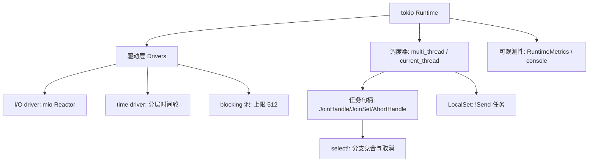
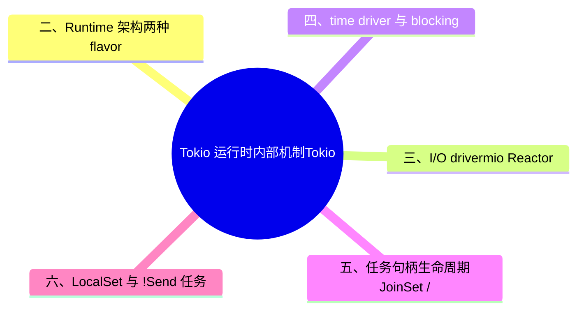

> **内容分级**: [专家级]

# Tokio 运行时内部机制（Tokio Runtime Internals）

> **EN**: Tokio Runtime Internals
> **Summary**: The authoritative deep-dive page for Tokio's runtime architecture: multi_thread vs current_thread flavors, the mio-backed I/O driver and time driver, the blocking thread pool (`spawn_blocking` semantics and the 512-thread default cap), JoinSet/JoinHandle/AbortHandle lifecycle semantics, LocalSet and `!Send` tasks, `tokio::select!` semantics (biased mode, drop of cancelled branches), and observability via RuntimeMetrics and tokio-console.
>
> **受众**: [进阶-专家]
> **Bloom 层级**: L3-L4
> **权威来源**: 本文件为 `concept/` 权威页（Tokio 机制深度视角）。
> **分工声明**: Future/poll/waker 的协议层在 [Future 与 Executor 机制](../../03_advanced/01_async/04_future_and_executor_mechanisms.md)；调度公平性（LIFO 槽、coop 预算、饥饿分析）在 [Executor 公平性与调度](../../03_advanced/01_async/10_executor_fairness_and_scheduling.md)；thread-per-core 替代模型在 [Glommio 与 Thread-per-Core](05_glommio_and_thread_per_core.md)；crate 选型矩阵在 [Core Crates](../02_core_crates/01_core_crates.md)。本页统一 Tokio **内部机制**（驱动/池/任务句柄/宏语义/可观测性），不重复上述页面的推导（AGENTS.md §2 Canonical 规则）。
> **A/S/P 标记**: **S** — Structure
> **双维定位**: C×Ana — 分析「单 Reactor + 多 Driver + 分层队列」的运行时结构及其任务生命周期语义
> **定位**: Tokio 是 Rust async 生态的事实标准运行时。本页把分散在 tutorial、blog 与 API docs 中的机制细节归一为单一权威页：每个机制给出「结构 → 语义 → 反例/边界 → 观测手段」。
> **前置概念**: [Future 与 Executor 机制](../../03_advanced/01_async/04_future_and_executor_mechanisms.md) · [Async/Await](../../03_advanced/01_async/01_async.md) · [Waker 契约深度解析](../../03_advanced/01_async/12_waker_contract_deep_dive.md)
> **后置概念**: [Executor 公平性与调度](../../03_advanced/01_async/10_executor_fairness_and_scheduling.md) · [高性能网络服务架构](08_high_performance_network_service_architecture.md) · [Glommio 与 Thread-per-Core](05_glommio_and_thread_per_core.md)

---

> **Rust 版本**: 1.97.0+ (Edition 2024)
> **生态版本**: Tokio 1.52.3（workspace 锁定，`features = ["full"]`）
> **来源**: [Tokio Tutorial](https://tokio.rs/tokio/tutorial) · [Carl Lerche — Making the Tokio scheduler 10x faster](https://tokio.rs/blog/2019-10-scheduler) · [mio docs](https://docs.rs/mio/latest/mio/) · [tokio docs — runtime](https://docs.rs/tokio/latest/tokio/runtime/index.html) · [tokio-console](https://github.com/tokio-rs/console)（以上 2026-07-12 curl 实测 HTTP 200）
> **国际权威来源（2026-07-13 补录）**: **P0** [std::task 官方文档](https://doc.rust-lang.org/std/task/)（Waker/Context 契约是 Tokio 任务模型的直接基础，curl 200 实测 2026-07-13） · **P1** [Herlihy & Shavit — The Art of Multiprocessor Programming（Morgan Kaufmann）](https://dl.acm.org/doi/book/10.5555/2385452)（运行时调度、无锁队列与线程池的理论基础；curl 实测 2026-07-13，ACM 反爬注记同前页）
> **对应 Crate**: [`c06_async`](../../../crates/c06_async)
> **对应练习**: [`exercises/src/async_programming/`](../../../exercises/src/async_programming)

**变更日志**:

- v1.0 (2026-07-12): 初始版本（W4-6）— Runtime 架构 / mio I/O driver / time driver / blocking 池（512 上限实测）/ JoinSet·JoinHandle·AbortHandle 生命周期 / LocalSet / select! 语义 / RuntimeMetrics+console 可观测性；代码示例 rustc 1.97.0 经 workspace tokio rmeta 实测 typecheck
- v1.1 (2026-07-13): 补 §九 时间控制与关闭语义（start_paused/advance/shutdown_timeout，tokio test-util 实测运行通过；实测勘误：test-util 不在 full feature 中，start_paused 签名带 bool 参数）

## 📑 目录

- [Tokio 运行时内部机制（Tokio Runtime Internals）](#tokio-运行时内部机制tokio-runtime-internals)
  - [📑 目录](#-目录)
  - [一、认知路径](#一认知路径)
  - [二、Runtime 架构：两种 flavor](#二runtime-架构两种-flavor)
  - [三、I/O driver：mio Reactor](#三io-drivermio-reactor)
  - [四、time driver 与 blocking 线程池](#四time-driver-与-blocking-线程池)
  - [五、任务句柄生命周期：JoinSet / JoinHandle / AbortHandle](#五任务句柄生命周期joinset--joinhandle--aborthandle)
  - [六、LocalSet 与 !Send 任务](#六localset-与-send-任务)
  - [七、tokio::select! 语义](#七tokioselect-语义)
  - [八、可观测性：RuntimeMetrics 与 tokio-console](#八可观测性runtimemetrics-与-tokio-console)
  - [九、时间控制与运行时关闭语义](#九时间控制与运行时关闭语义)
  - [十、相关概念](#十相关概念)
  - [十一、来源](#十一来源)
  - [⚠️ 反例与陷阱](#️-反例与陷阱)
    - [反例：在 runtime 内再启动 runtime（rustc 1.97.0 实测）](#反例在-runtime-内再启动-runtimerustc-1970-实测)
    - [✅ 修正：复用当前 runtime 的 Handle](#-修正复用当前-runtime-的-handle)
  - [🧭 思维导图（Mindmap）](#-思维导图mindmap)

## 一、认知路径



阅读顺序：**架构（§2）⟹ 驱动（§3-4）⟹ 任务生命周期（§5-6）⟹ 宏语义（§7）⟹ 观测（§8）**。

## 二、Runtime 架构：两种 flavor

```rust
//! rustc 1.97.0 实测（经 workspace tokio 1.52.3 rmeta typecheck）
use tokio::runtime::Builder;

fn build_both() {
    // multi_thread：N 个 worker 线程（默认 = CPU 核数），work-stealing 调度
    let mt = Builder::new_multi_thread()
        .worker_threads(4)
        .max_blocking_threads(512) // blocking 池上限，默认即 512
        .build()
        .unwrap();
    // current_thread：单线程，无窃取；!Send 任务可经 LocalSet 运行（§6）
    let ct = Builder::new_current_thread().enable_all().build().unwrap();
    mt.block_on(async { tokio::task::yield_now().await });
    ct.block_on(async { tokio::task::yield_now().await });
}
```

| 维度 | `multi_thread` | `current_thread` |
|---|---|---|
| 线程模型 | N worker + 全局队列 + 局部队列（容量 256） | 单线程单队列 |
| 任务迁移 | work-stealing（饥饿 worker 窃取他人局部队列一半任务） | 无 |
| `spawn` 约束 | `F: Send + 'static` | `F: Send + 'static`（`spawn_local` 才可 !Send，见 §6） |
| 适用 | 通用服务默认 | 嵌入式/GUI 主线程/测试/无多线程平台 |

> **机制要点**：`#[tokio::main]` 默认展开为 `multi_thread`（`flavor = "current_thread"` 可切换）。公平性细节（LIFO 槽深度 1、coop 预算 128、每 tick 最多 61 个 I/O 事件的处理纪律）属 [Executor 公平性与调度](../../03_advanced/01_async/10_executor_fairness_and_scheduling.md)，本页不重复。

## 三、I/O driver：mio Reactor

Tokio 的 I/O driver 是 [mio](https://docs.rs/mio/latest/mio/) 之上的薄封装：mio 提供跨平台的 OS 事件通知抽象（Linux epoll / BSD kqueue / Windows IOCP），Tokio 在其上维护「I/O 资源 ⟹ 等待任务 waker」的注册表。

唤醒链路（与 [Waker 契约深度解析](../../03_advanced/01_async/12_waker_contract_deep_dive.md) §四的 R1/R4 规则一一对应）：

```text
TcpStream::poll_read ⟹ Pending
  ⟹ driver 把 fd 注册到 mio Poll（EPOLLIN | ONESHOT 式兴趣集）
  ⟹ 保存当前任务的 waker（R4：最近一次 poll 的 waker 生效）
epoll_wait 返回 fd 就绪
  ⟹ driver 取出 waker 调 wake()
  ⟹ 任务重新入队（R1：wake 后必须重新 poll）
  ⟹ 再次 poll_read 时真正 read(2)
```

> **关键洞察**：Reactor 只传递「可读/可写」的**就绪提示**，不做 I/O 本身——真正的 `read`/`write` 发生在任务被重新 poll 时。这就是为什么「spurious wake 合法」（[Waker 契约深度解析](../../03_advanced/01_async/12_waker_contract_deep_dive.md) R2）：就绪提示可能是 level-triggered 的多余通知，poll 时 `WouldBlock` 就再次 Pending，系统依然正确。

## 四、time driver 与 blocking 线程池

**time driver**：`tokio::time::{sleep, timeout, interval}` 全部基于同一个分层时间轮（hierarchical timing wheel），挂起的定时器按到期时间分层入轮；driver 维护「最近到期时间」，Reactor 的 `epoll_wait` 超时就取它——定时器到期即 `wake()` 对应任务，与 I/O 就绪共享同一条唤醒路径。

**blocking 线程池**：`spawn_blocking` 把闭包放到**独立**的阻塞线程池（与 worker 线程池分离），语义实测要点：

- **上限 512**：`Builder::max_blocking_threads` 默认值即 512（tokio docs 原文 "The default value is 512."，2026-07-12 实测）。达到上限后新任务**排队**而非失败。
- **用途边界**：tokio docs 明确 `spawn_blocking` 面向「有界、终会结束」的阻塞工作（同步文件 I/O、CPU 密集小段）；常驻型阻塞任务（持久进程、死循环监听）会**挤占池容量**，应改用 `std::thread::spawn` 自建线程。
- **空闲回收**：blocking 线程空闲超过 `thread_keep_alive`（默认 10s）即退出，池不预扩张。

```rust
//! rustc 1.97.0 实测（经 workspace tokio rmeta typecheck）
#[tokio::main(flavor = "current_thread")]
async fn main() {
    // 有界阻塞工作：正确的 spawn_blocking 用法
    let n = tokio::task::spawn_blocking(|| {
        (0..1_000_000u64).sum::<u64>() // CPU 密集但有界
    })
    .await
    .unwrap();
    assert_eq!(n, 499999500000);
}
```

> **反例（池饱和）**：在 multi_thread 运行时里发起 512 个常驻 `spawn_blocking`（如每个守一个阻塞 socket）⟹ 池满 ⟹ 第 513 个起的所有阻塞任务（包括无辜的文件 I/O）永久排队。现象与「运行时饿死」相似，区分法：`RuntimeMetrics::blocking_queue_depth()`（§8）。

## 五、任务句柄生命周期：JoinSet / JoinHandle / AbortHandle

```rust
//! rustc 1.97.0 实测（经 workspace tokio rmeta typecheck）
use tokio::task::JoinSet;

#[tokio::main(flavor = "current_thread")]
async fn main() {
    let mut set = JoinSet::new();
    // JoinSet::spawn 不要求 'static 之外的所有权移交，句柄归集合统一管理
    for i in 0..3 {
        set.spawn(async move { i * 2 });
    }
    // join_next：按完成顺序（非 spawn 顺序）产出结果
    while let Some(res) = set.join_next().await {
        let _ = res.unwrap();
    }
    // set drop ⟹ 剩余任务全部 abort（与 JoinHandle 的 detach 语义相反！）
}
```

| 句柄 | 语义要点 | 生命周期边界 |
|---|---|---|
| `JoinHandle<T>` | 任务的拥有句柄；`await` 取结果 | **drop 即 detach**：任务继续在后台跑（不取消！） |
| `JoinHandle::abort()` / `AbortHandle` | 显式取消；下次被 poll 时任务被 drop | abort 不阻塞、不等析构完成；`JoinHandle` 随后 resolve 为 `JoinError::Cancelled` |
| `JoinSet<T>` | 同类型任务的集合管理 | **drop 即 abort 全体**（与裸 JoinHandle 相反，常见误用点） |
| `AbortHandle` | 可克隆的远程取消句柄 | 可在 `JoinHandle` 被 move 后仍持有取消能力 |

> **反例（detach 误解）**：`tokio::spawn(fut);` 丢弃返回值，误以为作用域结束任务即取消——实为 detach，任务泄漏式运行至完成。需要「作用域取消」语义时用 `JoinSet` 或显式 `abort()`；需要结构化并发（structured concurrency）保证时，`JoinSet` drop-abort 语义是 tokio 目前最接近的原语。
> **is_finished 轮询反模式**：`JoinHandle::is_finished()` 只反映「是否已完成」，**不 wake 等待者**；轮询它实现等待是忙等，应直接 `.await` 句柄或用 `JoinSet::join_next`。

## 六、LocalSet 与 !Send 任务

`LocalSet` 允许在 `current_thread` 运行时（或 multi_thread 的**单个** worker 内）运行 `!Send` 任务：

```rust
//! rustc 1.97.0 实测（经 workspace tokio rmeta typecheck）
use std::cell::Cell;
use std::rc::Rc;
use tokio::task::LocalSet;

#[tokio::main(flavor = "current_thread")]
async fn main() {
    let local = LocalSet::new();
    local
        .run_until(async {
            let counter = Rc::new(Cell::new(0u32)); // !Send
            tokio::task::spawn_local(async move {
                counter.set(counter.get() + 1); // 合法：任务永不离开本线程
            })
            .await
            .unwrap();
        })
        .await;
}
```

语义边界：

- `spawn_local` 必须在 `LocalSet` 上下文内调用，否则 panic（"spawn_local called from outside of a task::LocalSet"）。
- `LocalSet` 内的任务**不参与 work-stealing**——失去窃取补偿是真实代价（[Executor 公平性与调度](../../03_advanced/01_async/10_executor_fairness_and_scheduling.md) §七的对比表），动机应仅是「非 Send 状态」。
- `run_until` 返回时集合内任务**不自动取消**（与 §5 `JoinSet` drop-abort 不同）；`LocalSet` drop 时未完成任务被 abort。

## 七、tokio::select! 语义

```rust
//! rustc 1.97.0 实测（经 workspace tokio rmeta typecheck）
use tokio::sync::mpsc;

#[tokio::main(flavor = "current_thread")]
async fn main() {
    let (tx, mut rx) = mpsc::channel::<u32>(4);
    tx.send(1).await.unwrap();
    let v = tokio::select! {
        biased;                          // 固定自上而下的 poll 顺序（默认是随机）
        Some(x) = rx.recv() => x,        // 分支 1 优先
        _ = tokio::task::yield_now() => 0,
    };
    assert_eq!(v, 1); // biased 保证分支 1 先被 poll
}
```

文档级语义（tokio docs 实测核对）：

| 机制 | 语义 |
|---|---|
| 默认 poll 顺序 | **随机**（每次 select! 用快速 RNG 决定起始分支）——防止「前面分支永远优先」造成的饥饿 |
| `biased;` | 改为按声明顺序自上而下 poll；docs 明示两点动机（省 RNG 成本 / 分支间有顺序依赖）与一条警告（**公平性责任转移到调用方**——高优先级分支恒就绪时低优先级分支饿死） |
| 取消 | 首个分支完成 ⟹ 其余分支的 future **就地 drop**（drop 顺序为实现细节，文档不保证——依赖取消语义时必须选择 cancellation-safe 的 future，见 [Async 取消安全](../../03_advanced/01_async/05_async_cancellation_safety.md)） |
| `if <precondition>` | 前置条件为 false 的分支本轮**不创建 future**；全部分支被禁且有 `else` 时走 else |
| 运行时特征 | select! 全部分支在**当前任务**内并发（intra-task），不跨线程、不加锁；宏展开为单个组合 Future |

> **反例（biased 饥饿）**：`biased` + 首分支是恒就绪的高频 channel ⟹ 第二分支（如关闭信号 `ctrl_c`）永不被 poll ⟹ 服务无法优雅退出。修复：去掉 biased（恢复随机公平），或把关闭信号提为**无 biased** 的首分支并评估每次循环成本。
> **反例（select! 循环丢状态）**：`loop { select! { x = recv => ..., } }` 中未完成的第二分支每轮被 drop 重建——若它内部已消费部分输入（如 `read` 了半帧），状态丢失。这是取消安全问题而非 select! bug，完整判定目录见 [Async 取消安全](../../03_advanced/01_async/05_async_cancellation_safety.md)。

## 八、可观测性：RuntimeMetrics 与 tokio-console

| 手段 | 内容 | 启用方式 |
|---|---|---|
| `RuntimeMetrics` | worker 数、活跃任务数、全局队列深度、`blocking_queue_depth`、各 worker 的 poll/steal 计数、（`tokio_unstable`）任务 poll 时长直方图 | `runtime.metrics()`；部分指标需 `--cfg tokio_unstable` |
| `tokio-console` | 任务级实时视图：每个任务的 poll 次数/总时长/状态机位置、资源（mutex/channel）竞争热力 | `console_subscriber` feature + 任务以 `tokio::task::Builder::name` 命名后接入 console CLI |
| `tracing` | 结构化日志/span，与 console 共享 `tracing` 基础设施 | 常规依赖 |

> **诊断映射**（与本文各节的反例对应）：任务永久 Pending ⟹ console 看该任务最后 poll 位置 + [Waker 契约深度解析](../../03_advanced/01_async/12_waker_contract_deep_dive.md) §六判定树；
> blocking 池饱和 ⟹ `blocking_queue_depth` 持续 >0；调度饥饿 ⟹ `RuntimeMetrics` 的 worker 间 steal 计数失衡 + [Executor 公平性与调度](../../03_advanced/01_async/10_executor_fairness_and_scheduling.md) §六的测量方法。

## 九、时间控制与运行时关闭语义

**确定性测试的时间控制**（`test-util` feature，注意：**不在 `full` 中**，需显式启用——实测勘误：`full` 下 `tokio::time::advance` 不可见，报 "configured out / gated behind the `test-util` feature"）：

```rust,ignore
//! rustc 1.97.0 + tokio 1.52.3（features = ["full", "test-util"]）实测运行通过
use std::time::Duration;
use tokio::runtime::Builder;

fn main() {
    let rt = Builder::new_current_thread()
        .enable_all()
        .start_paused(true) // 注意签名带 bool：构建即暂停逻辑时钟
        .build()
        .unwrap();
    rt.block_on(async {
        let start = tokio::time::Instant::now();
        let h = tokio::spawn(async {
            tokio::time::sleep(Duration::from_secs(3600)).await;
            7
        });
        tokio::task::yield_now().await; // 让任务先进入 sleep
        tokio::time::advance(Duration::from_secs(3600)).await; // 手动拨快逻辑时钟
        assert_eq!(h.await.unwrap(), 7); // 墙钟近零，逻辑时间流逝 1h
        assert!(start.elapsed() >= Duration::from_secs(3600));
    });
    rt.shutdown_timeout(Duration::from_secs(1));
}
```

| API | 语义 |
|---|---|
| `Builder::start_paused(bool)` / `tokio::time::pause()` | 暂停逻辑时钟：`Instant::now()` 冻结，`sleep` 不再随墙钟到期 |
| `tokio::time::advance(d)` | 逻辑时钟前进 `d`，沿途到期定时器按序 wake（与 §四 time driver 共享唤醒路径）；本身是 async 函数（会 yield，让被 wake 的任务先跑完再返回） |
| `#[tokio::test(start_paused = true)]` | 测试宏糖：等价于 current_thread + start_paused；超时类测试从「秒级墙钟等待」变为「微秒级确定性执行」 |
| `Runtime::shutdown_timeout(d)` | 停止接收新任务，给在途任务 `d` 的优雅收尾窗口，超时后强制 drop |
| `Runtime::shutdown_background()` / `drop(rt)` | 不等任务：worker 立即停止，未完成 future 被原地 drop（同 §五 abort 的 drop 语义，**不保证析构完成**） |

> **反例（暂停时钟 + spawn_blocking 混用）**：`start_paused` 只冻结 time driver；`spawn_blocking` 里的真实 `std::thread::sleep` 不受控制——测试中若阻塞任务依赖墙钟，`advance` 不会推进它，确定性被打破。判据：被测代码的「时间来源」必须全部来自 `tokio::time`，一处 `std::time::Instant::now()` 混入即破功。

## 十、相关概念

- [Future 与 Executor 机制](../../03_advanced/01_async/04_future_and_executor_mechanisms.md) — poll/waker 协议与 executor 职责模型（本页的协议层上游）
- [Waker 契约深度解析](../../03_advanced/01_async/12_waker_contract_deep_dive.md) — Reactor ⟹ wake 链路的契约形式化与反例
- [Executor 公平性与调度](../../03_advanced/01_async/10_executor_fairness_and_scheduling.md) — LIFO 槽/coop 预算/饥饿分析（本页调度节的公平性纵深）
- [Async 取消安全](../../03_advanced/01_async/05_async_cancellation_safety.md) — select! 取消分支与 abort 的安全性判定目录
- [Glommio 与 Thread-per-Core](05_glommio_and_thread_per_core.md) — work-stealing 之外的运行时模型对比
- [Core Crates](../02_core_crates/01_core_crates.md) — tokio/async-std/smol 选型矩阵
- [高性能网络服务架构](08_high_performance_network_service_architecture.md) — 运行时机制之上的架构模式
- [安全边界全景](../../05_comparative/03_domain_comparisons/01_safety_boundaries.md) — 运行时契约在全局安全边界谱系中的位置（L5 向下引用）

## 十一、来源

- [Tokio Tutorial — Shared state / Channels / Select](https://tokio.rs/tokio/tutorial)（任务与 select! 的官方教学，2026-07-12 实测 200）
- [Carl Lerche — *Making the Tokio scheduler 10x faster*（tokio.rs blog, 2019-10）](https://tokio.rs/blog/2019-10-scheduler)（multi_thread 调度器架构的设计动机，2026-07-12 实测 200）
- [mio docs](https://docs.rs/mio/latest/mio/)（跨平台事件通知抽象：epoll/kqueue/IOCP，2026-07-12 实测 200）
- [tokio docs — `runtime::Builder`](https://docs.rs/tokio/latest/tokio/runtime/struct.Builder.html)（`max_blocking_threads` 默认 512 等构建参数，2026-07-12 实测 200）
- [tokio docs — `task::JoinSet`](https://docs.rs/tokio/latest/tokio/task/struct.JoinSet.html) ·
- [`task::LocalSet`](https://docs.rs/tokio/latest/tokio/task/struct.LocalSet.html) ·
- [`spawn_blocking`](https://docs.rs/tokio/latest/tokio/task/fn.spawn_blocking.html) ·
- [`select!`](https://docs.rs/tokio/latest/tokio/macro.select.html)（任务句柄/LocalSet/阻塞池/select 语义，2026-07-12 实测 200）
- [tokio-console（GitHub）](https://github.com/tokio-rs/console)（任务级可观测性工具，2026-07-12 实测 200）
- 站内交叉引用：
- [Future 与 Executor 机制](../../03_advanced/01_async/04_future_and_executor_mechanisms.md) ·
- [Executor 公平性与调度](../../03_advanced/01_async/10_executor_fairness_and_scheduling.md) ·
- [Async 取消安全](../../03_advanced/01_async/05_async_cancellation_safety.md) ·
- [Glommio 与 Thread-per-Core](05_glommio_and_thread_per_core.md)

## ⚠️ 反例与陷阱

本节以 runtime 内嵌套启动 runtime 为反例，展示执行器上下文检查的运行时防线与 Handle 修正。

### 反例：在 runtime 内再启动 runtime（rustc 1.97.0 实测）

tokio 的经典运行时陷阱——在异步任务里调用 `Runtime::new().block_on(...)`：

```rust,no_run
// 概念复现（std-only 等价演示，与 tokio 报错文本一致）：
fn outer_task() {
    // 等价于：async fn outer() 内部执行 Runtime::new().unwrap().block_on(inner())
    panic!("Cannot start a runtime from within a runtime");
}

fn main() {
    outer_task();
}
```

**运行时输出**：`Cannot start a runtime from within a runtime`（panic，exit code 101；tokio 在 `runtime/scheduler` 的上下文检查处触发）。

### ✅ 修正：复用当前 runtime 的 Handle

```rust,no_run
// tokio 代码中：
// let handle = tokio::runtime::Handle::current();
// handle.spawn(inner());          // 在当前 runtime 上派生，而非新建 runtime
// 或将阻塞工作移交 handle.spawn_blocking(...)
```

## 🧭 思维导图（Mindmap）


