> **内容分级**: [综述级]
> **代码状态**: ✅ 含可编译示例（部分依赖 kube-rs/axum 使用 `ignore`）
> **定理链**: N/A — 描述性/综述性/导航性文档，不涉及形式化定理链
>
# Rust 服务与 Kubernetes
>
> **EN**: Rust Services on Kubernetes
> **Summary**: Engineering practices for deploying Rust microservices on Kubernetes: containerization, ConfigMaps, Secrets, operators, sidecars, health probes, graceful shutdown, and resource limits.
>
> **Rust 版本**: 1.97.0+ (Edition 2024)
> **Bloom 层级**: L4-L6
> **权威来源**: 本文件为 `concept/` 权威页。
> **受众**: [进阶]
> **A/S/P 标记**: **S+A+P** — Structure + Applicati/on + Procedure
> **双维定位**: P×App — 在 Kubernetes 上交付 Rust 服务
> **定位**: 系统分析 Rust 服务在 Kubernetes 上的工程实践——从容器化、配置注入、健康探针、优雅关闭到资源约束与 operator 扩展，建立可复现的部署决策框架。
> **前置概念**: [Cloud Native](02_cloud_native.md) · [Web 框架](03_web_frameworks.md) · [Async/Await](../../03_advanced/01_async/01_async.md)
> **后置概念**: [Service Mesh](../../06_ecosystem/07_security_and_cryptography/04_security_architecture.md) · [Observability](../00_toolchain/02_logging_observability.md)
>
> **来源**: [Kubernetes Docs](https://kubernetes.io/docs/) · [kube-rs](https://kube.rs/) · [Google Distroless](https://github.com/GoogleContainerTools/distroless) · [SIGTERM Handling in Kubernetes](https://kubernetes.io/docs/concepts/workloads/pods/pod-lifecycle/#pod-termination)

---

## 📑 目录

- [Rust 服务与 Kubernetes](#rust-服务与-kubernetes)
  - [📑 目录](#-目录)
  - [一、权威定义与概述](#一权威定义与概述)
    - [1.1 Kubernetes 上的 Rust 服务定位](#11-kubernetes-上的-rust-服务定位)
    - [1.2 容器化基础：多阶段构建与最小镜像](#12-容器化基础多阶段构建与最小镜像)
  - [二、配置管理：ConfigMap 与 Secret](#二配置管理configmap-与-secret)
    - [2.1 环境变量注入](#21-环境变量注入)
    - [2.2 卷挂载与运行时重载](#22-卷挂载与运行时重载)
  - [三、部署模式](#三部署模式)
    - [3.1 Deployment + Service](#31-deployment--service)
    - [3.2 Horizontal Pod Autoscaler](#32-horizontal-pod-autoscaler)
    - [3.3 Kubernetes Operator（kube-rs）](#33-kubernetes-operatorkube-rs)
  - [四、可观测性与生命周期](#四可观测性与生命周期)
    - [4.1 健康探针](#41-健康探针)
    - [4.2 优雅关闭](#42-优雅关闭)
    - [4.3 Sidecar 模式](#43-sidecar-模式)
  - [五、资源管理](#五资源管理)
    - [5.1 Requests 与 Limits](#51-requests-与-limits)
    - [5.2 QoS 等级](#52-qos-等级)
  - [六、反例与边界](#六反例与边界)
    - [反例 1：忽视 SIGTERM 导致连接中断](#反例-1忽视-sigterm-导致连接中断)
    - [反例 2：livenessProbe 检查下游依赖](#反例-2livenessprobe-检查下游依赖)
    - [反例 3：镜像使用 root 用户](#反例-3镜像使用-root-用户)
    - [边界极限](#边界极限)
  - [七、常见陷阱](#七常见陷阱)
  - [八、来源与延伸阅读](#八来源与延伸阅读)
  - [相关概念](#相关概念)
  - [嵌入式测验（Embedded Quiz）](#嵌入式测验embedded-quiz)
    - [测验 1：为什么 Rust 服务适合使用 distroless 镜像？（理解层）](#测验-1为什么-rust-服务适合使用-distroless-镜像理解层)
    - [测验 2：Kubernetes 中 livenessProbe 和 readinessProbe 的职责区分是什么？（理解层）](#测验-2kubernetes-中-livenessprobe-和-readinessprobe-的职责区分是什么理解层)
    - [测验 3：优雅关闭（graceful shutdown）在 Kubernetes 中的关键步骤是什么？（应用层）](#测验-3优雅关闭graceful-shutdown在-kubernetes-中的关键步骤是什么应用层)
    - [测验 4：为什么建议将 Secret 以卷挂载而非环境变量注入？（理解层）](#测验-4为什么建议将-secret-以卷挂载而非环境变量注入理解层)
    - [测验 5：kube-rs 在 Kubernetes 生态中主要解决什么问题？（理解层）](#测验-5kube-rs-在-kubernetes-生态中主要解决什么问题理解层)
  - [🧭 思维导图（Mindmap）](#-思维导图mindmap)
  - [国际化权威来源补充（International Authority Sources）](#国际化权威来源补充international-authority-sources)

---

## 一、权威定义与概述

### 1.1 Kubernetes 上的 Rust 服务定位

> **[Kubernetes Documentation](https://kubernetes.io/docs/concepts/overview/)** Kubernetes is an open-source system for automating the deployment, scaling, and management of containerized applications.

Rust 服务在 Kubernetes 中的核心价值来自三个语言特性：

```text
Rust + Kubernetes 的契合点:
  ┌─────────────────────────────────────────────────────────────┐
  │  自包含二进制                                                │
  │  · 静态链接 → distroless/cc 镜像可 < 20MB                  │
  │  · 无 JVM/Python 运行时依赖 → 启动 < 50ms                   │
  ├─────────────────────────────────────────────────────────────┤
  │  内存安全                                                   │
  │  · 无 GC 停顿 → 尾延迟稳定，适合 sidecar/代理                │
  │  · 编译期数据竞争消除 → 多线程服务更可靠                     │
  ├─────────────────────────────────────────────────────────────┤
  │  异步 I/O                                                   │
  │  · tokio 实现高并发小体积 Pod                                │
  │  · 单容器即可承载高吞吐网关/代理                             │
  └─────────────────────────────────────────────────────────────┘
```

> **认知功能**: Rust 服务适合作为 Kubernetes 上的**高密部署单元**——小镜像、快启动、低内存占用，使相同节点资源可承载更多副本，降低基础设施成本。[💡 原创分析](../../00_meta/00_framework/methodology.md)

### 1.2 容器化基础：多阶段构建与最小镜像

Rust 的静态链接特性使其天然适合最小化容器镜像。推荐路径：

```dockerfile
# 阶段 1：builder
FROM rust:1.97-slim-bookworm AS builder
WORKDIR /app
COPY Cargo.toml Cargo.lock ./
RUN mkdir src && echo "fn main() {}" > src/main.rs
RUN cargo build --release
COPY src ./src
RUN cargo build --release

# 阶段 2：runtime（distroless 或 scratch）
FROM gcr.io/distroless/cc-debian12
COPY --from=builder /app/target/release/myapp /usr/local/bin/myapp
USER nonroot:nonroot
EXPOSE 8080
ENTRYPOINT ["/usr/local/bin/myapp"]
```

> **关键洞察**: 使用 `distroless/cc-debian12` 而非 `alpine` 可避免 musl/glibc 兼容性问题，同时保持镜像小于 30MB。若追求极致体积且无需 TLS 解析系统库，可构建 `x86_64-unknown-linux-musl` 目标并放入 `scratch` 镜像。[来源: [Google Distroless](https://github.com/GoogleContainerTools/distroless)]

---

## 二、配置管理：ConfigMap 与 Secret

### 2.1 环境变量注入

Kubernetes 通过 `envFrom` 将 ConfigMap/Secret 注入为环境变量，Rust 侧使用 `std::env` 或类型化配置 crate 读取：

```rust
use std::env;

#[derive(Debug, Clone)]
struct AppConfig {
    database_url: String,
    port: u16,
    log_level: String,
}

impl AppConfig {
    fn from_env() -> Result<Self, String> {
        Ok(AppConfig {
            database_url: env::var("DATABASE_URL")
                .map_err(|_| "DATABASE_URL missing")?,
            port: env::var("PORT")
                .unwrap_or_else(|_| "8080".into())
                .parse()
                .map_err(|_| "PORT must be u16")?,
            log_level: env::var("LOG_LEVEL").unwrap_or_else(|_| "info".into()),
        })
    }
}

fn main() {
    let cfg = AppConfig::from_env().expect("invalid config");
    println!("{:?}", cfg);
}
```

> **工程价值**: 显式 `from_env` 在启动时即验证必要配置，比动态 `env::var` 散布在代码中更可靠；缺失必需项直接 panic，符合 Kubernetes crash-loop 快速失败语义。

### 2.2 卷挂载与运行时重载

对于需要热更新的配置（如路由表、feature flag），使用卷挂载而非环境变量：

```yaml
apiVersion: v1
kind: ConfigMap
metadata:
  name: app-config
data:
  features.yaml: |
    dark_mode: true
    rate_limit: 1000
---
apiVersion: apps/v1
kind: Deployment
metadata:
  name: rust-service
spec:
  template:
    spec:
      containers:
        - name: app
          image: myapp:1.0.0
          volumeMounts:
            - name: config-vol
              mountPath: /etc/app
      volumes:
        - name: config-vol
          configMap:
            name: app-config
```

> **边界说明**: ConfigMap 卷挂载的更新会同步到容器内文件，但应用必须主动监听文件变化或按请求重载；Kubernetes 不会自动重启 Pod。[来源: [Kubernetes ConfigMaps](https://kubernetes.io/docs/concepts/configuration/configmap/)]

---

## 三、部署模式

### 3.1 Deployment + Service

最基础的 Kubernetes 部署单元：

```yaml
apiVersion: apps/v1
kind: Deployment
metadata:
  name: rust-api
spec:
  replicas: 3
  selector:
    matchLabels:
      app: rust-api
  template:
    metadata:
      labels:
        app: rust-api
    spec:
      containers:
        - name: api
          image: rust-api:1.0.0
          ports:
            - containerPort: 8080
          resources:
            requests:
              memory: "64Mi"
              cpu: "100m"
            limits:
              memory: "256Mi"
              cpu: "500m"
---
apiVersion: v1
kind: Service
metadata:
  name: rust-api
spec:
  selector:
    app: rust-api
  ports:
    - port: 80
      targetPort: 8080
```

### 3.2 Horizontal Pod Autoscaler

基于 CPU/内存或自定义指标自动扩缩容：

```yaml
apiVersion: autoscaling/v2
kind: HorizontalPodAutoscaler
metadata:
  name: rust-api-hpa
spec:
  scaleTargetRef:
    apiVersion: apps/v1
    kind: Deployment
    name: rust-api
  minReplicas: 3
  maxReplicas: 20
  metrics:
    - type: Resource
      resource:
        name: cpu
        target:
          type: Utilization
          averageUtilization: 70
  behavior:
    scaleDown:
      stabilizationWindowSeconds: 300
```

> **关键洞察**: Rust 服务通常 CPU 效率更高，HPA 目标利用率可适度上调（70–80%），但需配合压力测试验证尾延迟不恶化。

### 3.3 Kubernetes Operator（kube-rs）

`kube-rs` 是 Rust 生态中构建 Kubernetes Operator 的主流框架，基于 `kube`（API 客户端）+ `kube-runtime`（Controller 运行时）：

```rust,ignore
// kube-rs Operator 骨架：监听自定义资源 MyApp
use kube::{
    api::{Api, ListParams, ResourceExt},
    runtime::controller::{Action, Controller},
    Client, CustomResource,
};
use schemars::JsonSchema;
use serde::{Deserialize, Serialize};
use std::sync::Arc;
use tokio::time::Duration;

#[derive(CustomResource, Clone, Debug, Deserialize, Serialize, JsonSchema)]
#[kube(group = "example.com", version = "v1", kind = "MyApp")]
#[kube(shortname = "myapp", namespaced)]
struct MyAppSpec {
    replicas: i32,
    image: String,
}

struct Context {
    client: Client,
}

async fn reconcile(app: Arc<MyApp>, ctx: Arc<Context>) -> Result<Action, Error> {
    let deploys: Api<Deployment> = Api::default_namespaced(ctx.client.clone());
    // 根据 app.spec 创建/更新 Deployment
    Ok(Action::requeue(Duration::from_secs(300)))
}

fn error_policy(_app: Arc<MyApp>, _error: &Error, _ctx: Arc<Context>) -> Action {
    Action::requeue(Duration::from_secs(60))
}

#[tokio::main]
async fn main() -> anyhow::Result<()> {
    let client = Client::try_default().await?;
    let apps = Api::<MyApp>::all(client.clone());
    Controller::new(apps, ListParams::default())
        .run(reconcile, error_policy, Arc::new(Context { client }))
        .for_each(|_| futures::future::ready(()))
        .await;
    Ok(())
}
```

> **来源**: [kube-rs Controller Guide](https://kube.rs/controllers/intro/) · [Kubernetes Operator Pattern](https://kubernetes.io/docs/concepts/extend-kubernetes/operator/)
> **适用场景**: 当业务需要为 Rust 服务定义自定义资源（CRD）并自动管理其生命周期（如数据库迁移、证书轮转、配置一致性）时，Operator 是合适选择。

---

## 四、可观测性与生命周期

### 4.1 健康探针

Kubernetes 通过三种探针决定 Pod 状态：

| 探针 | 触发时机 | Rust 实现建议 |
|:---|:---|:---|
| **livenessProbe** | 持续运行 | `/healthz` 返回 200；卡住时触发重启 |
| **readinessProbe** | 持续运行 | 依赖就绪（DB、缓存）后返回 200，否则 503 |
| **startupProbe** | 启动阶段 | 慢启动服务先通过 startup，再启用 liveness |

```rust,ignore
// axum 健康检查示例
use axum::{routing::get, Router};
use std::sync::Arc;

async fn liveness() -> &'static str {
    "ok"
}

async fn readiness(state: axum::extract::State<Arc<AppState>>) -> impl axum::response::IntoResponse {
    match state.db.ping().await {
        Ok(_) => (http::StatusCode::OK, "ready"),
        Err(_) => (http::StatusCode::SERVICE_UNAVAILABLE, "not ready"),
    }
}

let app = Router::new()
    .route("/healthz", get(liveness))
    .route("/readyz", get(readiness));
```

> **陷阱规避**: liveness 探针不应检查下游依赖；否则下游故障会导致所有 Pod 级联重启，放大故障。[来源: [Kubernetes Probes](https://kubernetes.io/docs/tasks/configure-pod-container/configure-liveness-readiness-startup-probes/)]

### 4.2 优雅关闭

Kubernetes 发送 SIGTERM 后给予 `terminationGracePeriodSeconds`（默认 30s）让应用清理：

```rust
use std::sync::Arc;
use std::sync::atomic::{AtomicBool, Ordering};
use tokio::signal;

async fn shutdown_signal(shutdown: Arc<AtomicBool>) {
    signal::ctrl_c().await.expect("install signal handler");
    shutdown.store(true, Ordering::Relaxed);
}

#[tokio::main]
async fn main() {
    let shutdown = Arc::new(AtomicBool::new(false));
    let shutdown_clone = Arc::clone(&shutdown);

    tokio::spawn(async move {
        shutdown_signal(shutdown_clone).await;
    });

    // 模拟服务器：检查 shutdown 标志并主动 drain 连接
    loop {
        if shutdown.load(Ordering::Relaxed) {
            println!("draining connections...");
            break;
        }
        tokio::time::sleep(tokio::time::Duration::from_millis(100)).await;
    }
}
```

> **关键洞察**: Rust 服务应在收到 SIGTERM 后立即停止接收新连接、完成 inflight 请求后退出。`tokio::signal` 提供跨平台信号处理；在 axum 中可配合 `with_graceful_shutdown` 实现连接排空。[来源: [Kubernetes Pod Termination](https://kubernetes.io/docs/concepts/workloads/pods/pod-lifecycle/#pod-termination)]

### 4.3 Sidecar 模式

Sidecar 与主容器共享网络命名空间与存储卷，常用于：

- **服务网格**（Istio/Linkerd）：流量加密、金丝雀发布
- **日志/指标代理**（Vector/Fluent Bit）：统一采集
- **配置重载器**：监听 ConfigMap 变化并通知主进程

```text
Pod 内的 Sidecar 布局:
  ┌─────────────────────────────────────────┐
  │  Pod (共享网络 + IPC)                    │
  │  ┌─────────────┐  ┌─────────────┐      │
  │  │  rust-api   │  │  istio-proxy│      │
  │  │  :8080      │  │  :15001     │      │
  │  └─────────────┘  └─────────────┘      │
  │         ↑                ↑              │
  │         └──── shared localhost ────────┘│
  └─────────────────────────────────────────┘
```

> **判定依据**: Sidecar 增加资源开销与启动时序复杂度；仅在需要跨服务横切关注点（安全、可观测性、流量管理）且无法下沉到节点级 DaemonSet 时使用。

---

## 五、资源管理

### 5.1 Requests 与 Limits

| 维度 | Requests | Limits |
|:---|:---|:---|
| 调度 | 决定 Pod 可被调度到哪个节点 | 不影响调度 |
| 运行时 | 保证可用资源下限 | 强制资源使用上限 |
| CPU | 可压缩；超额使用会被节流 | 硬上限 |
| 内存 | 无运行时保证，仅用于 OOM 评分 | 超过即 OOMKilled |

Rust 服务建议：

```yaml
resources:
  requests:
    memory: "64Mi"
    cpu: "100m"
  limits:
    memory: "256Mi"
    cpu: "1000m"
```

> **关键洞察**: Rust 服务的内存使用通常可预测，但仍应设置合理的 `limits.memory` 以防止泄漏导致节点级 OOM。CPU `requests` 应根据基准测试设定，避免过度申请导致调度碎片。

### 5.2 QoS 等级

Kubernetes 根据 requests/limits 关系分配 QoS 等级：

```text
QoS 等级决定节点内存压力下被杀顺序:
  Guaranteed   : limits == requests（所有资源）→ 最后被驱逐
  Burstable    : limits != requests → 中等优先级
  BestEffort   : 未设置 requests/limits → 最先被驱逐

Rust 生产服务建议至少达到 Burstable；关键服务应设为 Guaranteed。
```

> **来源**: [Kubernetes QoS](https://kubernetes.io/docs/tasks/configure-pod-container/quality-service-pod/)

---

## 六、反例与边界

### 反例 1：忽视 SIGTERM 导致连接中断

```text
命题: "Kubernetes 删除 Pod 时请求会自然完成"
└── ❌ 否
    ├── SIGTERM 后容器若不处理，30s 后直接收到 SIGKILL
    ├── inflight 请求被强制中断 → 客户端 502/503
    └── ✅ 正确做法: 监听 SIGTERM，停止 accept，drain 现有连接
```

### 反例 2：livenessProbe 检查下游依赖

```text
命题: "livenessProbe 应该验证数据库连接"
└── ❌ 否
    ├── 数据库故障 → 所有 Pod liveness 失败 → 无限重启循环
    ├── 可用性：下游故障不应导致本服务 Pod 重启
    └── ✅ 正确做法: liveness 只检查本进程状态；readiness 检查依赖
```

### 反例 3：镜像使用 root 用户

```text
命题: "容器内使用 root 运行 Rust 二进制没问题"
└── ❌ 否
    ├── 逃逸风险增加
    ├── 违反 PodSecurity 限制
    └── ✅ 正确做法: Dockerfile 中设置 USER nonroot，或在 securityContext 中限制
```

### 边界极限

| 边界 | 现状 | 理论极限 | 工程影响 |
|:---|:---|:---|:---|
| 单 Pod 内存 | 受 limits.memory 约束 | 节点可用内存 | 超过即 OOMKilled |
| 启动探针超时 | startupProbe 成功前 liveness 不生效 | terminationGracePeriod | 慢启动服务必须配置 |
| HPA 响应延迟 | 默认 15s 指标窗口 | 控制循环周期 | 突发流量需配合 VPA 或预扩容 |
| 卷挂载更新延迟 | kubelet 默认 60s 同步 | 不可低于 kubelet 周期 | 热配置不能期望秒级生效 |

---

## 七、常见陷阱

```text
陷阱 1: 静态链接但未处理 DNS
  ❌ 在 scratch/musl 镜像中使用系统 getaddrinfo
     // musl 与 glibc DNS 行为差异，可能解析失败

  ✅ 使用 rustls + trust-dns-resolver 或 tokio 异步 DNS
     // reqwest = { version = "0.12", default-features = false, features = ["rustls-tls"] }

陷阱 2: 监听 127.0.0.1
  ❌ 绑定 127.0.0.1:8080
     // Service 无法从 Pod 外部访问

  ✅ 绑定 0.0.0.0:8080
     // 让 Service 的 targetPort 可达

陷阱 3: 健康探针路径未排除日志/指标
  ❌ /healthz 返回大量日志或触发慢查询
     // 探针高频访问放大负载

  ✅ /healthz 做轻量自检，/readyz 检查必要依赖

陷阱 4: Secret 以环境变量注入
  ❌ 密码出现在 ps e 输出或 crash 日志中

  ✅ Secret 卷挂载或集成 external-secrets/ Vault

陷阱 5: 忽略 graceful shutdown 时间
  ❌ 默认 30s 内无法完成 drain

  ✅ 设置 terminationGracePeriodSeconds 并测试最坏情况
```

---

## 八、来源与延伸阅读

| 来源 | 可信度 | 说明 |
|:---|:---:|:---|
| [Kubernetes Documentation](https://kubernetes.io/docs/) | ✅ 一级 | 容器编排平台官方文档 |
| [kube-rs](https://kube.rs/) | ✅ 一级 | Rust Kubernetes 客户端与 Operator 框架 |
| [Google Distroless](https://github.com/GoogleContainerTools/distroless) | ✅ 一级 | 最小化容器基础镜像 |
| [Kubernetes Probes](https://kubernetes.io/docs/tasks/configure-pod-container/configure-liveness-readiness-startup-probes/) | ✅ 一级 | 健康探针官方指南 |
| [Pod Lifecycle](https://kubernetes.io/docs/concepts/workloads/pods/pod-lifecycle/) | ✅ 一级 | Pod 终止与信号处理 |
| [Horizontal Pod Autoscaler](https://kubernetes.io/docs/tasks/run-application/horizontal-pod-autoscale/) | ✅ 一级 | 自动扩缩容 |
| [Kubernetes Operators](https://kubernetes.io/docs/concepts/extend-kubernetes/operator/) | ✅ 一级 | Operator 模式 |
| [Istio Service Mesh](https://istio.io/latest/docs/) | ✅ 二级 | Sidecar/服务网格实践 |
| [Linkerd](https://linkerd.io/2/overview/) | ✅ 二级 | 轻量级服务网格 |
| [Kubernetes Best Practices](https://kubernetes.io/docs/concepts/configuration/manage-resources-containers/) | ✅ 一级 | 资源管理 |

---

## 相关概念

- [Cloud Native](02_cloud_native.md) — 容器化与微服务部署
- [Web 框架](03_web_frameworks.md) — axum / actix-web / rocket / poem 选型
- [DevOps 与 CI/CD](../00_toolchain/03_devops_and_ci_cd.md) — 持续交付与镜像构建
- [Observability](../00_toolchain/02_logging_observability.md) — 日志、指标、追踪
- [Network Security](../../06_ecosystem/07_security_and_cryptography/04_security_architecture.md) — 服务网格与安全通信
- [Async/Await](../../03_advanced/01_async/01_async.md) — 异步运行时基础

> **权威来源**: [Rust Reference](https://doc.rust-lang.org/reference/introduction.html) · [The Rust Programming Language](https://doc.rust-lang.org/book/title-page.html) · [Cargo Book](https://doc.rust-lang.org/cargo/index.html)

---

## 嵌入式测验（Embedded Quiz）

### 测验 1：为什么 Rust 服务适合使用 distroless 镜像？（理解层）

**题目**: 为什么 Rust 服务适合使用 distroless 镜像？

<details>
<summary>✅ 答案与解析</summary>

Rust 二进制可静态链接，无需 shell、包管理器或运行时依赖；distroless 镜像仅包含运行二进制所需的最小系统库，显著减小攻击面与镜像体积。
</details>

---

### 测验 2：Kubernetes 中 livenessProbe 和 readinessProbe 的职责区分是什么？（理解层）

**题目**: Kubernetes 中 livenessProbe 和 readinessProbe 的职责区分是什么？

<details>
<summary>✅ 答案与解析</summary>

`livenessProbe` 判断容器是否存活，失败则重启容器；`readinessProbe` 判断容器是否准备好接收流量，失败则将 Pod 从 Service 端点移除。不应在 liveness 中检查下游依赖。
</details>

---

### 测验 3：优雅关闭（graceful shutdown）在 Kubernetes 中的关键步骤是什么？（应用层）

**题目**: 优雅关闭在 Kubernetes 中的关键步骤是什么？

<details>
<summary>✅ 答案与解析</summary>

监听 SIGTERM 信号；停止接收新连接；完成 inflight 请求；在 `terminationGracePeriodSeconds` 内主动退出。避免被强制 SIGKILL 中断。
</details>

---

### 测验 4：为什么建议将 Secret 以卷挂载而非环境变量注入？（理解层）

**题目**: 为什么建议将 Secret 以卷挂载而非环境变量注入？

<details>
<summary>✅ 答案与解析</summary>

环境变量可能通过 `/proc/<pid>/environ`、容器日志或 crash dump 泄露；卷挂载将敏感数据限制在文件系统内，且支持动态更新与更细粒度的权限控制。
</details>

---

### 测验 5：kube-rs 在 Kubernetes 生态中主要解决什么问题？（理解层）

**题目**: `kube-rs` 在 Kubernetes 生态中主要解决什么问题？

<details>
<summary>✅ 答案与解析</summary>

`kube-rs` 是 Rust 的 Kubernetes 客户端与 Operator 运行时，用于以类型安全的方式与 API Server 交互，并构建自定义资源（CRD）控制器来自动化运维逻辑。
</details>

---

## 🧭 思维导图（Mindmap）

```mermaid
mindmap
  root((Rust 服务与 Kubernetes))
    容器化
      多阶段构建
      distroless 镜像
      静态链接
    配置管理
      ConfigMap
      Secret
      卷挂载热更新
    部署模式
      Deployment
      Service
      HPA
      kube-rs Operator
    可观测性与生命周期
      健康探针
      优雅关闭
      Sidecar
    资源管理
      Requests
      Limits
      QoS 等级
```



> **认知功能**: 本 mindmap 从本页「Rust 服务与 Kubernetes」的章节结构提炼，一级分支对应核心主题，叶子节点为关键子概念，可作为本页的快速导航与复习索引。
>
> **跨层链接（L5）**: Kubernetes 生态中 Rust 与 Go 的对比，参见 [Rust vs Go](../../05_comparative/01_systems_languages/03_rust_vs_go.md)。

## 国际化权威来源补充（International Authority Sources）

- <https://dl.acm.org/doi/book/10.5555/186897>
- <https://kubernetes.io/docs/home/>
- <https://github.com/kube-rs/kube>
