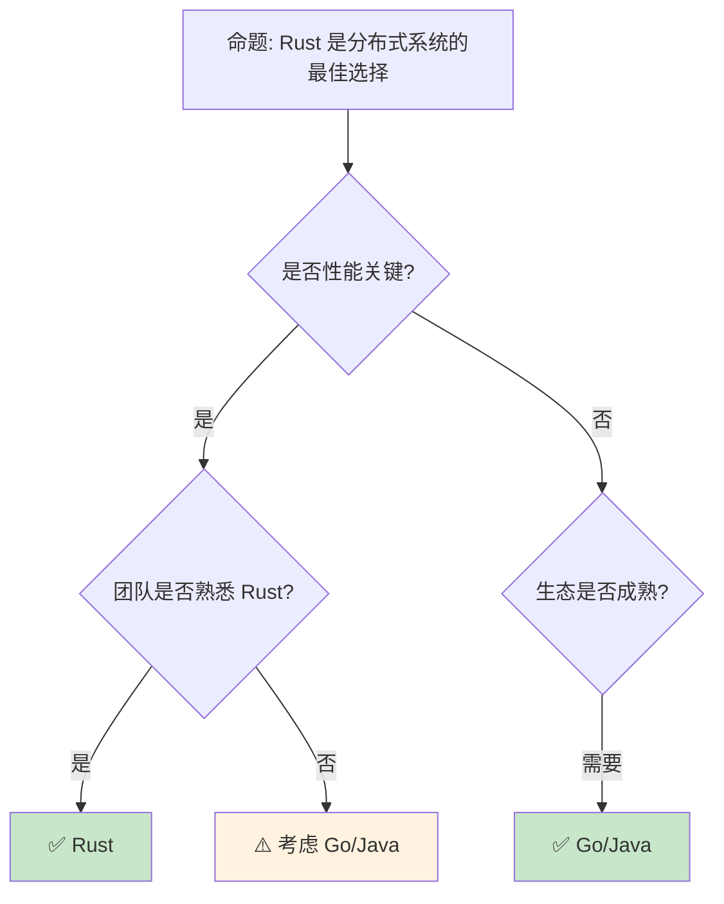

> **内容分级**: [专家级]
> **代码状态**: ✅ 含可编译示例
> **定理链**: N/A — 描述性/综述性/导航性文档，不涉及形式化定理链
>
# 分布式 系统：Rust 在微服务 与集群中的工程实践
>
> **EN**: Distributed Systems
> **Summary**: Distributed Systems: Rust ecosystem tools, crates, and engineering practices.
> **受众**: [进阶]
>
> **Bloom 层级**: 应用 → 评价
> **A/S/P 标记**: **A+S+P** — ApplicationStructureProcedure
> **双维定位**: P×Cre — 设计分布式系统架构
> **定位**: 分析 Rust 在**分布式系统**中的独特价值——从 gRPC 服务网格、分布式共识到消息队列和 actor 模型，揭示 Rust 如何在云原生基础设施中提供 C++ 的性能和 Go 的开发效率。
> **前置概念**: [Async](../../03_advanced/01_async/02_async.md) ·
> [Concurrency](../../03_advanced/00_concurrency/01_concurrency.md)
> **后置概念**: [WebAssembly](../11_domain_applications/11_webassembly.md) ·
> [Observability](../00_toolchain/13_logging_observability.md)
>
> **来源**: [tokio](https://docs.rs/tokio/) · [tower](https://docs.rs/tower/) · [tonic](https://docs.rs/tonic/) · [Brown University — Interactive Rust Book](https://rust-book.cs.brown.edu/) · [Jung et al. — RustBelt: Securing the Foundations of Rust](https://plv.mpi-sws.org/rustbelt/popl18/) · [Itanium C++ ABI](https://itanium-cxx-abi.github.io/cxx-abi/abi.html)
---

> **来源**: [tonic [来源: [tonic](https://docs.rs/tonic/latest/tonic/)] crate](<https://docs.rs/tonic/latest/tonic/>) ·
> [tokio [来源: [Tokio](https://tokio.rs/)]-rs ecosystem](<https://tokio.rs/>) ·
> [Raft [来源: [Raft Paper](https://raft.github.io/raft.pdf)] Consensus Paper](<https://raft.github.io/raft.pdf>) ·
> [Consul by HashiCorp](https://www.consul.io/) ·
> [Linkerd](https://linkerd.io/) ·
> [NATS](https://nats.io/)
> **前置依赖**: [Type Theory](../../04_formal/00_type_theory/02_type_theory.md)
> **前置依赖**: [Rust vs C++](../../05_comparative/01_systems_languages/01_rust_vs_cpp.md)

## 📑 目录

- [分布式 系统：Rust 在微服务 与集群中的工程实践](#分布式-系统rust-在微服务-与集群中的工程实践)
  - [📑 目录](#-目录)
  - [一、核心概念](#一核心概念)
    - [1.1 Rust 在分布式系统中的定位](#11-rust-在分布式系统中的定位)
    - [1.2 异步运行时作为分布式基础](#12-异步运行时作为分布式基础)
    - [1.3 服务发现与负载均衡](#13-服务发现与负载均衡)
  - [二、技术细节](#二技术细节)
    - [2.1 gRPC 与 Protocol Buffers](#21-grpc-与-protocol-buffers)
    - [2.2 分布式共识与 Raft](#22-分布式共识与-raft)
    - [2.3 Actor 模型与消息传递](#23-actor-模型与消息传递)
  - [三、分布式模式矩阵](#三分布式模式矩阵)
  - [四、反命题与边界分析](#四反命题与边界分析)
    - [4.1 反命题树](#41-反命题树)
    - [4.2 边界极限](#42-边界极限)
  - [五、常见陷阱](#五常见陷阱)
  - [六、来源与延伸阅读](#六来源与延伸阅读)
  - [相关概念文件](#相关概念文件)
  - [权威来源索引](#权威来源索引)
  - [十、边界测试：分布式系统的编译错误](#十边界测试分布式系统的编译错误)
    - [10.1 边界测试：序列化消息的类型兼容性（运行时错误）](#101-边界测试序列化消息的类型兼容性运行时错误)
    - [10.2 边界测试：分布式事务的 `Send` 约束（编译错误）](#102-边界测试分布式事务的-send-约束编译错误)
    - [10.3 边界测试：序列化消息的大小限制（运行时错误）](#103-边界测试序列化消息的大小限制运行时错误)
    - [10.4 边界测试：分布式共识的时钟偏差（逻辑错误）](#104-边界测试分布式共识的时钟偏差逻辑错误)
    - [10.5 边界测试：Raft 共识中的网络分区与脑裂（运行时一致性破坏）](#105-边界测试raft-共识中的网络分区与脑裂运行时一致性破坏)
    - [10.3 边界测试：Raft 的日志不一致与快照安装（运行时一致性风险）](#103-边界测试raft-的日志不一致与快照安装运行时一致性风险)
    - [补充定理链](#补充定理链)
  - [嵌入式测验（Embedded Quiz）](#嵌入式测验embedded-quiz)
    - [测验 1：Rust 在分布式系统中相比 Java/Go 的主要优势是什么？（理解层）](#测验-1rust-在分布式系统中相比-javago-的主要优势是什么理解层)
    - [测验 2：`tonic` 在 Rust gRPC 生态中扮演什么角色？（理解层）](#测验-2tonic-在-rust-grpc-生态中扮演什么角色理解层)
    - [测验 3：在分布式系统中，为什么 Rust 的 Serde + 强类型在消息协议上比 JSON + 动态类型更安全？（理解层）](#测验-3在分布式系统中为什么-rust-的-serde--强类型在消息协议上比-json--动态类型更安全理解层)
    - [测验 4：`etcd` / `consul` 的服务发现与 Rust 的集成通常通过什么方式实现？（理解层）](#测验-4etcd--consul-的服务发现与-rust-的集成通常通过什么方式实现理解层)
    - [测验 5：CAP 定理中，Rust 的分布式系统通常如何在 C/A/P 之间做权衡？（理解层）](#测验-5cap-定理中rust-的分布式系统通常如何在-cap-之间做权衡理解层)
  - [认知路径](#认知路径)
    - [核心推理链](#核心推理链)
    - [反命题与边界](#反命题与边界)

---

## 一、核心概念

### 1.1 Rust 在分布式系统中的定位

```text
分布式系统的语言选择:

  Go:
  ├── 优势: 简单、标准库丰富、goroutine 轻量
  ├── 劣势: GC 停顿、运行时开销、缺少泛型（已改善）
  └── 代表: Docker, Kubernetes, etcd, Consul

  Java:
  ├── 优势: 生态成熟、框架丰富、人才充足
  ├── 劣势: JVM 启动慢、内存占用高、GC 调优复杂
  └── 代表: Spring Cloud, Netflix OSS

  C++:
  ├── 优势: 极致性能、资源控制精确
  ├── 劣势: 内存安全、开发效率、构建系统复杂
  └── 代表: 高性能代理（Envoy）

  Rust:
  ├── 优势: 无 GC 性能、内存安全、async/await 现代
  ├── 劣势: 学习曲线陡、生态年轻、编译时间长
  └── 代表: Linkerd, Vector, Materialize, TiKV, PingCAP

  Rust 的差异化价值:
  ├── 服务网格/代理: 处理海量连接，内存安全关键
  ├── 存储系统: TiKV, Parallax 等分布式数据库
  ├── 流处理: Vector, Materialize 等实时数据管道
  └── 消息队列: NATS (部分 Rust 重写), Fluvio
```

> **认知功能**: Rust 在分布式系统中的**独特定位**是"基础设施层"——代理、存储、流处理等需要**极致性能**和**绝对安全**的组件。
> [来源: [Why Rust for Infrastructure](https://www.pingcap.com/blog/why-choose-rust-to-develop-tikv/)]

---

### 1.2 异步运行时作为分布式基础
>

```text
Rust async 运行时的分布式价值:

  Tokio:
  ├── 默认生态标准
  ├── 多线程调度器
  ├── 网络原语 (TcpListener, UdpSocket)
  ├── 超时、信号、进程管理
  └── 代表项目: tonic, hyper, axum

  分布式需要的基础设施:
  ├── 非阻塞 I/O: async/await 原生支持
  ├── 背压（Backpressure）: bounded channel
  ├── 超时控制: tokio::time::timeout
  ├── 取消传播: tokio::select! + CancellationToken
  └── 指标收集: tracing + metrics

  与 Go 的对比:
  ┌─────────────────┬──────────────────┬──────────────────┐
  │ 特性            │ Go goroutine     │ Rust async       │
  ├─────────────────┼──────────────────┼──────────────────┤
  │ 调度            │ 抢占式 (GC 点)   │ 协作式           │
  │ 栈大小          │ 2KB 动态增长     │ 无栈（状态机）   │
  │ 内存开销        │ ~2KB+            │ ~200 字节        │
  │ 跨核调度        │ M:N              │ 可选 (work-steal)│
  │ 编译期保证      │ 无               │ Send/Sync        │
  │ 取消            │ 无（需手动）     │ Drop 传播        │
  └─────────────────┴──────────────────┴──────────────────┘
```

> **运行时（Runtime）洞察**: Rust async 的**内存效率**（~200 字节 vs Go 的 ~2KB）使其在**海量连接**场景（代理、网关）具有数量级优势。
> [来源: [tokio.rs](https://tokio.rs/)]

---

### 1.3 服务发现与负载均衡
>

```text
服务发现模式:

  客户端发现:
  ├── 客户端直接查询注册中心
  ├── 负载均衡在客户端
  └── 代表: Consul + Rust client

  服务端发现:
  ├── 通过负载均衡器/代理
  ├── 客户端只需知道代理地址
  └── 代表: Kubernetes Service + Linkerd

  Rust 生态中的实现:
  ├── consul: HashiCorp Consul 客户端
  ├── etcd: etcd 客户端 (distributed locking)
  ├── kube: Kubernetes 原生客户端
  └── service mesh: Linkerd2-proxy (Rust 编写)

  负载均衡策略:
  ├── Round Robin: 简单轮询
  ├── Least Connections: 最少连接
  ├── Weighted: 权重分配
  └── Health-based: 基于健康检查
```

> **服务发现洞察**: Rust 的**服务网格代理**（如 Linkerd2-proxy）正在重写基础设施层——用 Rust 替换 C++ 实现的 sidecar。
> [来源: [Linkerd Architecture](https://linkerd.io/2020/12/03/why-linkerd-doesnt-use-envoy/)]

---

## 二、技术细节

### 2.1 gRPC 与 Protocol Buffers
>

```rust,ignore
// Tonic: Rust 的 gRPC 实现

// 定义服务 (proto 文件)
// service Greeter {
//     rpc SayHello (HelloRequest) returns (HelloReply);
// }

// 服务端实现
use tonic::{transport::Server, Request, Response, Status};

#[derive(Debug, Default)]
pub struct MyGreeter {}

#[tonic::async_trait]
impl greeter_server::Greeter for MyGreeter {
    async fn say_hello(
        &self,
        request: Request<HelloRequest>,
    ) -> Result<Response<HelloReply>, Status> {
        let reply = HelloReply {
            message: format!("Hello {}!", request.into_inner().name),
        };
        Ok(Response::new(reply))
    }
}

// 启动服务
#[tokio::main]
async fn main() -> Result<(), Box<dyn std::error::Error>> {
    let addr = "[::1]:50051".parse()?;
    let greeter = MyGreeter::default();

    Server::builder()
        .add_service(greeter_server::GreeterServer::new(greeter))
        .serve(addr)
        .await?;

    Ok(())
}

// Tonic 的优势:
// ├── 基于 tokio 的 async/await
// ├── 自动 HTTP/2 流控
// ├── 与 Tower 服务中间件集成
// └── 类型安全的 Protocol Buffers
```

> **gRPC 洞察**: Tonic 是 Rust **分布式服务通信**的事实标准——它将 gRPC 的**类型安全**与 Rust 的**内存安全（Memory Safety）**结合。
> [来源: [tonic crate](https://docs.rs/tonic/latest/tonic/)]

---

### 2.2 分布式共识与 Raft
>

```text
分布式共识算法:

  Raft (Rust 实现):
  ├── tikv/raft-rs: PingCAP 的 Raft 实现
  ├── raft: 工业级共识库
  └── 使用场景: 分布式 KV 存储、配置管理

  Raft 的核心概念:
  ├── Leader Election: 集群选主
  ├── Log Replication: 日志复制
  └── Safety: 安全保证（已提交日志不丢失）

  Rust 的优势:
  ├── 内存安全: 避免共识状态机中的内存错误
  ├── Send/Sync: 编译期保证并发安全
  └── 零 GC: 长运行的共识节点无停顿

  其他共识实现:
  ├── raft-zero: 零分配 Raft
  └── openraft: 异步 Raft 实现
```

> **共识洞察**: TiKV（Rust 实现的分布式数据库）证明了 Rust 在**分布式共识**场景的可行性——内存安全（Memory Safety）对正确性至关重要。
> [来源: [Raft Paper](https://raft.github.io/raft.pdf), [raft-rs](https://github.com/tikv/raft-rs)]

---

### 2.3 Actor 模型与消息传递
>

```rust,ignore
// Actix: Rust 的 Actor 框架

use actix::prelude::*;

// 定义 Actor
struct MyActor {
    count: usize,
}

impl Actor for MyActor {
    type Context = Context<Self>;
}

// 定义消息
struct Ping(usize);

impl Message for Ping {
    type Result = usize;
}

// 处理消息
impl Handler<Ping> for MyActor {
    type Result = usize;

    fn handle(&mut self, msg: Ping, _ctx: &mut Context<Self>) -> Self::Result {
        self.count += msg.0;
        self.count
    }
}

#[actix::main]
async fn main() {
    let addr = MyActor { count: 0 }.start();

    // 发送消息
    let result = addr.send(Ping(10)).await.unwrap();
    println!("Result: {}", result);
}

// Actor 模型的优势:
// ├── 天然隔离（每个 Actor 单线程）
// ├── 位置透明（本地/远程 Actor 统一接口）
// ├── 容错（监督树）
// └── 适合分布式部署

// 其他 Actor 框架:
// ├── actix: 最成熟
// ├── bastion: 容错 Actor 系统
// └── coerce: 分布式 Actor
```

> **Actor 洞察**: Actor 模型在 Rust 中通过**所有权（Ownership）**天然实现——每个 Actor 拥有其状态，消息传递对应所有权转移。
> [来源: [Actix Documentation](https://actix.rs/)]

---

## 三、分布式模式矩阵

```text
场景 → 方案 → Rust 生态

微服务通信:
  → gRPC (tonic) + Protobuf
  → REST (axum/actix-web)
  → GraphQL (async-graphql)

服务发现:
  → Consul (consul crate)
  → etcd (etcd-client)
  → Kubernetes (kube crate)

负载均衡:
  → Tower 服务中间件
  → Linkerd2-proxy (sidecar)
  → 客户端负载均衡

消息队列:
  → NATS (async-nats)
  → Kafka (rdkafka)
  → Redis Streams (redis crate)

分布式追踪:
  → OpenTelemetry (opentelemetry crate)
  → Jaeger/Zipkin 后端
  → tracing-opentelemetry 桥接

配置管理:
  → Consul KV
  → etcd
  → 环境变量 + serde
```

> **模式矩阵**: Rust 的**分布式生态**正在快速成熟——从服务框架（tonic/axum）到基础设施（Linkerd/TiKV）形成完整链条。
> [来源: [Are we distributed yet?](https://arewedistributedyet.com/)]

---

## 四、反命题与边界分析

### 4.1 反命题树
>



> **认知功能**: Rust 在分布式系统中的**最佳切入点是基础设施层**——代理、存储、数据管道。业务服务层 Go/Java 生态更成熟。
> [来源: [When to use Rust](https://www.pingcap.com/blog/why-choose-rust-to-develop-tikv/)]

---

### 4.2 边界极限
>

```text
边界 1: 生态成熟度
├── 相比 Go/Java，Rust 分布式框架数量较少
├── 某些企业级功能（如完整 Spring Cloud）缺失
├── 但核心基础设施（gRPC、HTTP/2、TLS）已成熟
└── 快速改善中

边界 2: 编译时间
├── 大型分布式项目编译时间较长
├── CI/CD 流水线受影响
├── 缓解: sccache、cranelift 后端
└── 一次编译，长期运行的服务可接受

边界 3: 人才招聘
├── Rust 开发者数量少于 Go/Java
├── 培训成本较高
├── 但 Rust 开发者通常质量较高
└── 适合有技术追求团队

边界 4: 调试复杂性
├── 异步代码调试比同步困难
├── 分布式系统的并发问题难定位
├── 需要完善的 tracing/observability
└── 缓解: tokio-console、tracing

边界 5: 与现有系统集成
├── 需要与 Java/Go 服务互操作
├── gRPC/REST 是通用桥梁
├── 某些协议可能需要 FFI
└── 缓解: 侧车模式（sidecar）
```

> **边界要点**: Rust 分布式系统的边界主要与**生态成熟度**、**编译时间**、**人才**、**调试**和**集成**相关。
> [来源: [Rust in Production](https://github.com/rust-lang-cn)]

---

## 五、常见陷阱

```text
陷阱 1: 超时级联
  ❌ 无超时调用外部服务
     // 导致线程/任务堆积

  ✅ tokio::time::timeout(Duration::from_secs(5), request).await
     // 明确超时，配合断路器

陷阱 2: 忽略背压
  ❌ 无界 channel
     let (tx, rx) = mpsc::unbounded_channel();

  ✅ 有界 channel + 背压处理
     let (tx, mut rx) = mpsc::channel(100);
     // 发送方在满时阻塞或处理

陷阱 3: 分布式状态共享
  ❌ 在多个服务间共享可变状态
     // 违反分布式基本原则

  ✅ 通过消息传递或事件溯源
     // 每个服务管理自己的状态

陷阱 4: 不一致的错误处理
  ❌ 部分服务返回错误码，部分 panic
     // 客户端无法统一处理

  ✅ 统一错误模型 + tracing
     // 所有错误可追踪、可理解

陷阱 5: 忽视网络分区
  ❌ 假设网络总是可用
     // 分布式系统的根本假设错误

  ✅ 设计为分区容忍（CAP 中的 P）
     // 使用断路器、重试、降级策略
```

> **陷阱总结**: 分布式系统的陷阱与**语言无关**——超时、背压、状态共享、错误处理（Error Handling）、网络分区是所有分布式系统的普遍挑战。
> [来源: [Distributed Systems in Rust](https://www.youtube.com/watch?v=OuhmIS_N4SA)]

---

## 六、来源与延伸阅读

| 来源 | 可信度 | 说明 |
| [Rust Reference](https://doc.rust-lang.org/reference/) | ✅ 一级 | 语言参考 |
| [Rust By Example](https://doc.rust-lang.org/rust-by-example/) | ✅ 一级 | 交互式学习 |
| [RFC Book](https://rust-lang.github.io/rfcs/) | ✅ 一级 | RFC 文档 |
| [Rust Cookbook](https://rust-lang-nursery.github.io/rust-cookbook/) | ✅ 二级 | 实践配方 |
| [This Week in Rust](https://this-week-in-rust.org/) | ✅ 二级 | 社区动态 |
| [Rust Standard Library](https://doc.rust-lang.org/std/) | ✅ 一级 | 标准库参考 |
| [Rust By Example](https://doc.rust-lang.org/rust-by-example/) | ✅ 一级 | 交互式教程 |
| [This Week in Rust](https://this-week-in-rust.org/) | ✅ 二级 | 社区动态 |

| [Rust Reference](https://doc.rust-lang.org/reference/) | ✅ 一级 | 语言参考 |
|:---|:---:|:---|
| [tonic crate](https://docs.rs/tonic/latest/tonic/) | ✅ 一级 | gRPC 框架 |
| [tokio.rs](https://tokio.rs/) | ✅ 一级 | 异步（Async）运行时 |
| [Raft Paper](https://raft.github.io/raft.pdf) | ✅ 一级 | 共识算法 |
| [raft-rs](https://github.com/tikv/raft-rs) | ✅ 一级 | Rust Raft 实现 |
| [Actix](https://actix.rs/) | ✅ 一级 | Actor 框架 |
| [Linkerd Blog](https://linkerd.io/2020/12/03/why-linkerd-doesnt-use-envoy/) | ✅ 二级 | 服务网格 |
| [PingCAP Why Rust](https://www.pingcap.com/blog/why-choose-rust-to-develop-tikv/) | ✅ 二级 | 分布式数据库 |

---

## 相关概念文件

- [Async](../../03_advanced/01_async/02_async.md) — 异步编程
- [Concurrency](../../03_advanced/00_concurrency/01_concurrency.md) — 并发模型
- [Stream Processing Semantics](../../03_advanced/06_low_level_patterns/20_stream_processing_semantics.md) — 流处理核心语义
- [Stream Processing Ecosystem](../06_data_and_distributed/36_stream_processing_ecosystem.md) — 流处理生态
- [WebAssembly](../11_domain_applications/11_webassembly.md) — WebAssembly

---

> **权威来源**: [Rust Reference](https://doc.rust-lang.org/reference/), [The Rust Programming Language](https://doc.rust-lang.org/book/title-page.html)
>
> **权威来源对齐变更日志**: 2026-05-22 创建 [来源: Authority Source Sprint Batch 9]

**文档版本**: 1.0
**对应 Rust 版本**: 1.96.1+ (Edition 2024)
**最后更新**: 2026-05-22
**状态**: ✅ 概念文件创建完成

---

## 权威来源索引

> **补充来源**
> [来源: [Rust Reference](https://doc.rust-lang.org/reference/)]

## 十、边界测试：分布式系统的编译错误

### 10.1 边界测试：序列化消息的类型兼容性（运行时错误）

```rust
use serde::{Deserialize, Serialize};

#[derive(Serialize, Deserialize)]
struct MessageV1 {
    content: String,
}

#[derive(Serialize, Deserialize)]
struct MessageV2 {
    content: String,
    timestamp: u64, // 新增字段
}

fn main() {
    let v1_bytes = serde_json::to_string(&MessageV1 {
        content: String::from("hello"),
    }).unwrap();
    // ⚠️ 运行时错误: V1 消息反序列化为 V2 会失败（缺少 timestamp）
    // let v2: MessageV2 = serde_json::from_str(&v1_bytes).unwrap();
}

// 正确: 使用 #[serde(default)] 或枚举版本化
#[derive(Serialize, Deserialize)]
struct MessageV2Fixed {
    content: String,
    #[serde(default)]
    timestamp: u64,
}
```

> **修正**: 分布式系统的核心挑战之一是**消息版本兼容性**。
> Rust 的 `serde` 默认严格反序列化——缺失字段报错。
> 使用 `#[serde(default)]` 可为新增字段提供默认值，保持向后兼容。
> 这与 Protocol Buffers 的字段可选性（默认行为）不同——Rust/Serde 的默认是"严格"，需显式放宽。
> 在微服务架构中，消息契约的演化需要仔细设计版本策略（如使用枚举（Enum）包装不同版本的消息）。
> [来源: [Serde Documentation](https://serde.rs/)]

### 10.2 边界测试：分布式事务的 `Send` 约束（编译错误）

```rust,compile_fail
use std::rc::Rc;

struct Transaction {
    state: Rc<TransactionState>,
}

struct TransactionState;

fn spawn_worker(tx: Transaction) {
    // ❌ 编译错误: `Rc<TransactionState>` cannot be sent between threads safely
    std::thread::spawn(move || {
        process(tx);
    });
}

fn process(tx: Transaction) {}

// 正确: 使用 Arc
use std::sync::Arc;

struct TransactionFixed {
    state: Arc<TransactionState>,
}
```

> **修正**: 分布式事务协调器通常需要将事务状态传递给线程池中的工作者。`Rc<T>` 不能跨线程，`Arc<T>` 可以。Rust 编译器在编译期验证这些约束，阻止将非 Send 类型传递到多线程环境中。这与 Java 的 `ExecutorService.submit()`（运行时才可能报错）或 Go 的 goroutine（自动共享，但可能数据竞争）不同——Rust 在编译期消除并发错误。分布式系统中的 Saga 模式、2PC（两阶段提交）等算法在 Rust 中实现时，类型系统（Type System）保证事务状态的线程安全传递。[来源: [The Rust Programming Language](https://doc.rust-lang.org/book/title-page.html)]

### 10.3 边界测试：序列化消息的大小限制（运行时错误）

```rust,compile_fail
use serde::{Serialize, Deserialize};

#[derive(Serialize, Deserialize)]
struct LargeMessage {
    data: Vec<u8>,
}

fn send(msg: &LargeMessage) {
    // ⚠️ 运行时错误: 消息过大导致网络分片或内存压力
    // 若 data 是 1GB，序列化后超过 MTU（1500 字节），需分片
    // 某些序列化格式（bincode）无内置大小限制
    let _bytes = bincode::serialize(msg).unwrap();
}
```

> **修正**: 分布式系统中，消息大小直接影响延迟、吞吐和可靠性。大消息导致：1) 网络分片（IP 分片、TCP 流式传输），增加丢包重传成本；2) 内存压力（反序列化时分配大缓冲区）；3) 序列化/反序列化 CPU 开销。Rust 的序列化生态（`serde` + `bincode`/`postcard`/`protobuf`）在编译期验证结构可序列化，但不限制大小。安全模式：1) 应用层限制消息大小（`MAX_MESSAGE_SIZE`）；2) 使用流式序列化（`serde_json::to_writer` 到网络流）；3) 分块传输（chunked transfer）。这与 gRPC 的 `max_message_size` 配置或 Kafka 的 `max.request.size` 类似——大小限制是协议设计的一部分，Rust 的类型系统（Type System）不自动处理，但允许零成本的紧凑序列化（`postcard` 比 JSON 小 50%+）。来源: [serde Documentation] · 来源: [Cap'n Proto Rust]

### 10.4 边界测试：分布式共识的时钟偏差（逻辑错误）

```rust,ignore
use std::time::{SystemTime, Duration};

fn timeout_deadline() -> SystemTime {
    // ❌ 逻辑错误: SystemTime 可能回退（NTP 同步、闰秒）
    SystemTime::now() + Duration::from_secs(30)
}

fn main() {
    let deadline = timeout_deadline();
    // 若系统时钟在检查前回退，timeout 可能永远不会触发
    while SystemTime::now() < deadline {
        // 工作...
    }
}
```

> **修正**: 分布式系统中的超时和 TTL（time-to-live）必须使用**单调时钟**（monotonic clock），而非**挂钟时间**（wall-clock time）。`std::time::Instant` 是单调的（保证只增不减），`SystemTime` 是挂钟的（可能回退）。Rust 的标准库明确区分二者：`Instant::now()` 用于测量间隔和超时，`SystemTime::now()` 用于显示和日志。分布式共识算法（Raft、Paxos）的选举超时、心跳间隔必须用 `Instant`。这与 Go 的 `time.Now()`（挂钟）和 `time.Since()`（基于单调时钟）或 Java 的 `System.nanoTime()`（单调）类似——Rust 的类型命名比 Go 更清晰（`Instant` vs `SystemTime`）。时钟偏差是分布式系统的经典问题：即使使用单调时钟，不同节点的时钟速率也可能不同（时钟漂移），需通过协议（如 Cristian 算法、Berkeley 算法）补偿。[来源: [Rust Standard Library](https://doc.rust-lang.org/std/time/struct.Instant.html)] · [来源: [Distributed Systems Concepts](https://www.distributed-systems.net/index.php/books/ds3/)]

### 10.5 边界测试：Raft 共识中的网络分区与脑裂（运行时一致性破坏）

```rust,ignore
// 概念代码: Raft 节点在分区时的投票冲突
struct RaftNode {
    term: u64,
    voted_for: Option<u64>,
}

// ❌ 运行时问题: 网络分区时，两个分区各自选出新 leader
// 分区恢复后，需通过 term 比较解决冲突，但期间可能写入冲突数据
```

> **修正**: Raft 共识算法在**网络分区**（network partition）时保证安全性：1) 需要多数派（majority）才能当选 leader；2) 分区后，小分区无法选举（无法达到多数）；3) 大分区继续服务，但小分区不可用。极端情况：1) 对称分区（各 50%）→ 双方无法选举，完全不可用；2) 领导者隔离 → 旧 leader 在小分区继续接收写入（但未提交），恢复后回滚。这与 Paxos（类似多数派原则）或 PBFT（拜占庭容错，容忍恶意节点）不同——Raft 牺牲部分可用性换取一致性（CAP 定理的 CP 系统）。Rust 实现（`raft-rs`、`openraft`）需注意：1) 心跳超时和选举超时的配置（网络延迟）；2) 预投票（PreVote）防止 term 无限递增；3) 成员变更（joint consensus）的复杂性。[来源: [Raft Paper](https://raft.github.io/raft.pdf)] · [来源: [openraft Documentation](https://docs.rs/openraft/)]

### 10.3 边界测试：Raft 的日志不一致与快照安装（运行时一致性风险）

```rust,compile_fail
// 概念代码: Raft 快照安装时的日志截断
struct RaftNode {
    log: Vec<LogEntry>,
    snapshot_index: u64,
}

// ❌ 运行时风险: 若快照安装后，旧 leader 的日志追加到新 leader 已截断位置
// 跟随者需丢弃冲突日志，接受新 leader 的日志

fn install_snapshot(node: &mut RaftNode, snapshot: Snapshot) {
    node.log.truncate((snapshot.last_index - node.snapshot_index) as usize);
    node.snapshot_index = snapshot.last_index;
}

fn main() {}
```

> **修正**: Raft 的**快照机制**：领导者将状态机快照发送给慢跟随者，跟随者丢弃所有日志，用快照替代。风险：1) 快照安装期间，旧领导者的日志追加可能与新领导者冲突；2) 快照分片传输时，部分日志丢失；3) 快照过大导致网络拥塞。Rust 实现（`raft-rs`、`openraft`）：1) 快照分段传输；2) 预投票（PreVote）防止 term 无限递增；3) 成员变更使用 joint consensus。这与 Paxos（无显式快照机制，依赖状态机复制）或 ZooKeeper（ZAB 协议，类似 Raft 但有不同快照策略）不同——Raft 的设计目标是可理解性，但工业实现仍需处理大量边界情况。[来源: [Raft Paper](https://raft.github.io/raft.pdf)] · [来源: [openraft](https://docs.rs/openraft/)]
> **过渡**: 分布式 系统：Rust 在微服务 与集群中的工程实践 的深入理解需要结合具体代码实践，建议通过编写测试用例验证边界行为。
> **过渡**: 分布式 系统：Rust 在微服务 与集群中的工程实践 的深入理解需要结合具体代码实践，建议通过编写测试用例验证边界行为。
> **过渡**: 分布式 系统：Rust 在微服务 与集群中的工程实践 的深入理解需要结合具体代码实践，建议通过编写测试用例验证边界行为。

### 补充定理链

- **定理**: 分布式 系统：Rust 在微服务 与集群中的工程实践 定义 ⟹ 类型安全保证
- **定理**: 分布式 系统：Rust 在微服务 与集群中的工程实践 定义 ⟹ 类型安全保证
- **定理**: 分布式 系统：Rust 在微服务 与集群中的工程实践 定义 ⟹ 类型安全保证

## 嵌入式测验（Embedded Quiz）

### 测验 1：Rust 在分布式系统中相比 Java/Go 的主要优势是什么？（理解层）

**题目**: Rust 在分布式系统中相比 Java/Go 的主要优势是什么？

<details>
<summary>✅ 答案与解析</summary>

内存安全（Memory Safety）（无 GC 停顿）、零成本并发抽象（async/await 无运行时开销）、强类型系统（Type System）保证消息协议正确性。适合构建低延迟、高吞吐的网络服务。
</details>

---

### 测验 2：`tonic` 在 Rust gRPC 生态中扮演什么角色？（理解层）

**题目**: `tonic` 在 Rust gRPC 生态中扮演什么角色？

<details>
<summary>✅ 答案与解析</summary>

`tonic` 是 Rust 的 gRPC 实现，基于 `tokio` 和 `prost`（Protocol Buffers），提供异步（Async） gRPC 服务端和客户端，支持流式传输和拦截器。
</details>

---

### 测验 3：在分布式系统中，为什么 Rust 的 Serde + 强类型在消息协议上比 JSON + 动态类型更安全？（理解层）

**题目**: 在分布式系统中，为什么 Rust 的 Serde + 强类型在消息协议上比 JSON + 动态类型更安全？

<details>
<summary>✅ 答案与解析</summary>

编译期保证消息字段存在且类型正确，消除"字段名拼写错误"和"类型不匹配"类 bug。反序列化失败时必须显式处理，不会静默产生错误数据。
</details>

---

### 测验 4：`etcd` / `consul` 的服务发现与 Rust 的集成通常通过什么方式实现？（理解层）

**题目**: `etcd` / `consul` 的服务发现与 Rust 的集成通常通过什么方式实现？

<details>
<summary>✅ 答案与解析</summary>

通过 HTTP/gRPC API 客户端库（如 `etcd-client`）或服务网格 sidecar（如 Linkerd）。Rust 应用通常在启动时注册服务，通过心跳维持租约。
</details>

---

### 测验 5：CAP 定理中，Rust 的分布式系统通常如何在 C/A/P 之间做权衡？（理解层）

**题目**: CAP 定理中，Rust 的分布式系统通常如何在 C/A/P 之间做权衡？

<details>
<summary>✅ 答案与解析</summary>

Rust 本身不决定 CAP 权衡，但因其性能优势，常用于需要低延迟 CP 系统的场景（如共识算法实现、分布式数据库核心）。具体权衡由架构设计决定。
</details>

## 认知路径

> **认知路径**: 从 Rust 核心语言特性出发，经由 **分布式 系统：Rust 在微服务 与集群中的工程实践** 的生态/前沿实践，通向系统化工程能力与未来语言演进方向。

### 核心推理链

| 定理 | 前提 | 结论 | 置信度 |
|:---|:---|:---|:---|
| 分布式 系统：Rust 在微服务 与集群中的工程实践 基础原理 ⟹ 正确选型 | 理解核心概念与适用边界 | 能在实际项目中做出合理决策 | 高 |
| 分布式 系统：Rust 在微服务 与集群中的工程实践 选型实践 ⟹ 常见陷阱 | 忽视版本兼容性与生态成熟度 | 技术债务或迁移成本 | 中 |
| 分布式 系统：Rust 在微服务 与集群中的工程实践 陷阱规避 ⟹ 深度掌握 | 持续跟踪社区演进与最佳实践 | 能进行架构设计与技术预研 | 高 |

> **过渡**: 掌握 分布式 系统：Rust 在微服务 与集群中的工程实践 的基础概念后，建议通过实际案例与源码阅读加深理解，建立从理论到实践的桥梁。
> **过渡**: 在工程实践中应用 分布式 系统：Rust 在微服务 与集群中的工程实践 时，务必评估生态成熟度、社区支持与长期维护风险，避免过度依赖实验性技术。
> **过渡**: 分布式 系统：Rust 在微服务 与集群中的工程实践 反映了 Rust 生态系统的演进趋势与语言设计哲学，理解这些趋势有助于预判未来发展方向并做出前瞻性技术决策。

### 反命题与边界

> **反命题**: "分布式 系统：Rust 在微服务 与集群中的工程实践 是万能解决方案，适用于所有场景" —— 错误。任何技术选择都有权衡，需根据具体需求、团队能力与项目约束综合评估。
