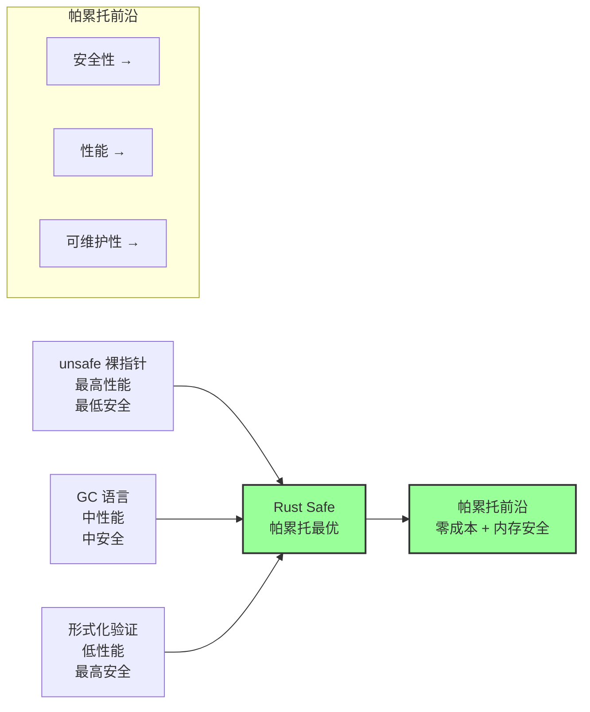
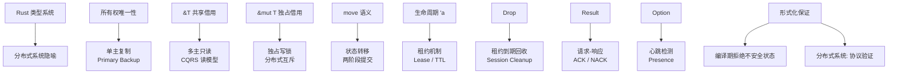
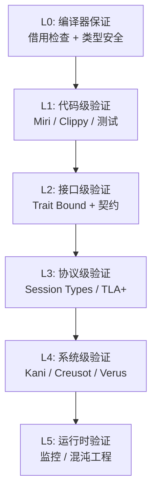
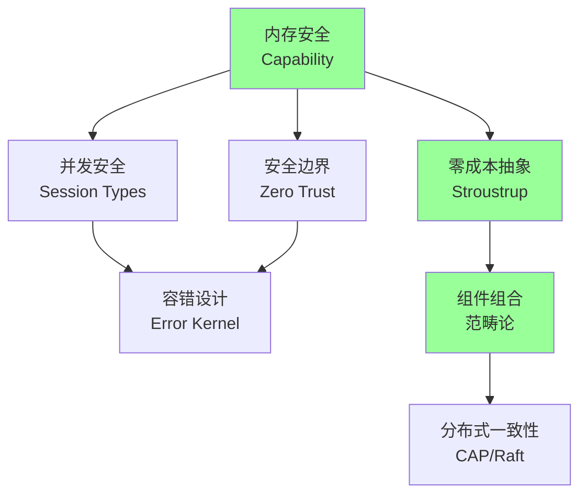
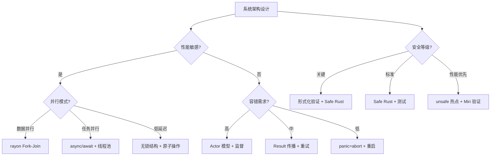
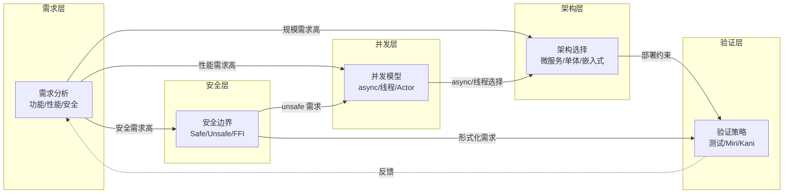

# Rust 系统设计原则与国际权威对齐

> **代码状态**: ✅ 含可编译示例
>
> **EN**: System Design Principles
> **Summary**: System Design Principles: Rust ecosystem tools, crates, and engineering practices.
> **受众**: [进阶]
> **内容分级**: [专家级]
> **定位**: 本文件从**系统架构设计**视角梳理 Rust 的核心设计原则，并与国际权威内容（形式化方法、分布式系统理论、安全工程、容错计算）建立对齐关系。
> **原则**: 不做"系统设计教程"，聚焦"Rust 的类型系统（Type System）和所有权（Ownership）模型如何为系统设计提供形式化基础，以及这些基础与国际权威理论的对应关系"。
> **对齐来源**: [RustBelt — POPL 2018](https://plv.mpi-sws.org/rustbelt/popl18/) · [SE L4] · [NIST Zero Trust] · [AWS TLA+] · [Erlang OTP] · [CAP Theorem] · [CALM Theorem]
> **基准版本**: Rust 1.96.1 stable (Edition 2024)
> **定理链**: N/A — 描述性/综述性/导航性文档，不涉及形式化定理链
>
> **来源**: [Rust API Guidelines](https://rust-lang.github.io/api-guidelines/) · [TRPL — Error Handling](https://doc.rust-lang.org/book/ch09-00-error-handling.html) · [Cargo Book](https://doc.rust-lang.org/cargo/) · [Brown University — Interactive Rust Book](https://rust-book.cs.brown.edu/) · [Itanium C++ ABI](https://itanium-cxx-abi.github.io/cxx-abi/abi.html)
---

> **Bloom 层级**: 评价 → 创造

**变更日志**:

- v1.0 (2026-05-21): 初始版本——七项设计原则 + 国际权威对齐 + 帕累托前沿决策矩阵 + 五层形式化扩展

---

> **后置概念**: [Future Roadmap](../07_future/24_roadmap.md)
> **前置概念**: [Architecture Patterns](35_architecture_patterns.md)

## 📑 目录

- [Rust 系统设计原则与国际权威对齐](#rust-系统设计原则与国际权威对齐)
  - [📑 目录](#-目录)
  - [零、TL;DR —— 系统设计原则速查](#零tldr--系统设计原则速查)
  - [一、权威来源与设计原则分类学](#一权威来源与设计原则分类学)
  - [二、七项核心设计原则](#二七项核心设计原则)
    - [2.1 内存安全：Capability-Based Security](#21-内存安全capability-based-security)
    - [2.2 并发安全：Session Types 编译期编码](#22-并发安全session-types-编译期编码)
    - [2.3 零成本抽象：Stroustrup 原则](#23-零成本抽象stroustrup-原则)
    - [2.4 组件组合：范畴论态射复合](#24-组件组合范畴论态射复合)
    - [2.5 分布式一致性：从所有权到共识的隐喻](#25-分布式一致性从所有权到共识的隐喻)
    - [2.6 安全边界：Zero Trust + WASI 能力安全](#26-安全边界zero-trust--wasi-能力安全)
    - [2.7 容错设计：Error Kernel + Let It Crash](#27-容错设计error-kernel--let-it-crash)
  - [三、系统设计决策矩阵](#三系统设计决策矩阵)
    - [3.1 安全-性能-可维护性帕累托前沿](#31-安全-性能-可维护性帕累托前沿)
    - [3.2 场景驱动的设计选择](#32-场景驱动的设计选择)
  - [四、从 Rust 类型到分布式协议的隐喻映射](#四从-rust-类型到分布式协议的隐喻映射)
  - [五、五层形式化扩展模型](#五五层形式化扩展模型)
  - [六、思维表征体系](#六思维表征体系)
    - [6.1 设计原则依赖图](#61-设计原则依赖图)
    - [6.2 系统架构决策树](#62-系统架构决策树)
  - [七、定理推理链](#七定理推理链)
    - [定理一致性矩阵（系统设计专集）](#定理一致性矩阵系统设计专集)
  - [八、相关概念链接（L0-L7 映射）](#八相关概念链接l0-l7-映射)
    - [L0-L7 纵向映射](#l0-l7-纵向映射)
    - [相关概念文件](#相关概念文件)
  - [七、系统设计决策的知识流动图](#七系统设计决策的知识流动图)
  - [权威来源索引](#权威来源索引)
  - [十、边界测试：系统设计原则的编译错误](#十边界测试系统设计原则的编译错误)
    - [10.1 边界测试：Send/Sync 违反导致跨线程共享状态（编译错误）](#101-边界测试sendsync-违反导致跨线程共享状态编译错误)
    - [10.2 边界测试：trait 对象的安全性约束（编译错误）](#102-边界测试trait-对象的安全性约束编译错误)
    - [10.5 边界测试：依赖注入与 trait object 的性能权衡（运行时开销）](#105-边界测试依赖注入与-trait-object-的性能权衡运行时开销)
    - [10.5 边界测试：过度工程化的类型状态机（编译复杂度爆炸）](#105-边界测试过度工程化的类型状态机编译复杂度爆炸)
    - [10.3 边界测试：过度泛型化导致的单态化膨胀（编译后体积爆炸）](#103-边界测试过度泛型化导致的单态化膨胀编译后体积爆炸)
    - [补充定理链](#补充定理链)
  - [嵌入式测验（Embedded Quiz）](#嵌入式测验embedded-quiz)
    - [测验 1：Rust 中"零成本抽象"（Zero-Cost Abstractions）对系统架构设计意味着什么？（理解层）](#测验-1rust-中零成本抽象zero-cost-abstractions对系统架构设计意味着什么理解层)
    - [测验 2：在 Rust 微服务架构中，为什么选择 `tokio` 而非多线程模型？（理解层）](#测验-2在-rust-微服务架构中为什么选择-tokio-而非多线程模型理解层)
    - [测验 3：Rust 的 `trait` 系统在解耦模块时有什么优势？（理解层）](#测验-3rust-的-trait-系统在解耦模块时有什么优势理解层)
    - [测验 4：什么是"错误即类型"（Errors as Values）？Rust 如何通过类型系统实现它？（理解层）](#测验-4什么是错误即类型errors-as-valuesrust-如何通过类型系统实现它理解层)
    - [测验 5：在设计高可用 Rust 系统时，`Arc<Mutex<T>>` 与消息传递（channel）各适合什么场景？（理解层）](#测验-5在设计高可用-rust-系统时arcmutext-与消息传递channel各适合什么场景理解层)
  - [认知路径](#认知路径)
    - [核心推理链](#核心推理链)
    - [反命题与边界](#反命题与边界)

---

## 零、TL;DR —— 系统设计原则速查
>
>

```text
原则                    Rust 机制                      国际权威对应                    设计意图
─────────────────────────────────────────────────────────────────────────────────────────────────
内存安全                所有权 + 借用 + 生命周期         Capability-Based Security       无 UAF/DF/泄漏
并发安全                Send/Sync + fearless             Session Types / Linear Types    无数据竞争
零成本抽象              单态化 + 编译期优化              Stroustrup 原则                 不支付不用代价
组件组合                Trait + Tower Service            范畴论态射复合                   可组合的中间件
分布式一致性            所有权转移隐喻                   CAP / Paxos / Raft              安全的状态管理
安全边界                unsafe + Trust 语义              Zero Trust / SEL4               最小信任基
容错设计                Result + panic=abort             Erlang Error Kernel             故障隔离
─────────────────────────────────────────────────────────────────────────────────────────────────
```

---

## 一、权威来源与设计原则分类学

| 原则 | 国际权威来源 | 权威类型 | 应用领域 |
|:---|:---|:---|:---|
| 内存安全（Memory Safety） | Dennis & Van Horn, *Programming Semantics for Multiprogrammed Computations* (1966) | 学术论文 | OS 内核 / 嵌入式 |
| 并发安全（Concurrency Safety） | Honda, *Session Types* (1993); Wadler, *Propositions as Sessions* (2012) | 学术会议论文 | 分布式协议 |
| 零成本抽象（Zero-Cost Abstraction） | Stroustrup, *The Design and Evolution of C++* (1994) | 技术书籍 | 系统编程 |
| 组件组合 | Mac Lane, *Categories for the Working Mathematician* (1971) | 数学经典 | 软件架构 |
| 分布式一致性（Coherence） | Brewer, *CAP Twelve Years Later* (2012); Lamport, *Paxos Made Simple* (2001) | 学术/工业 | 分布式数据库 |
| 安全边界 | NIST SP 800-207, *Zero Trust Architecture* (2020) | 标准规范 | 企业安全 |
| 容错设计 | Armstrong, *Making Reliable Distributed Systems in the Presence of Software Errors* (2003) | 博士论文 | 电信/分布式 |

---

## 二、七项核心设计原则

### 2.1 内存安全：Capability-Based Security

> **Capability-Based Security**: 由 Dennis & Van Horn 1966 提出，核心思想是——进程对资源的访问权限不基于身份（identity），而基于**不可伪造的令牌（capability）**。拥有 capability 即可访问资源，无需额外检查。 [来源: Dennis & Van Horn, CACM 1966]

Rust 的所有权（Ownership）系统正是 Capability-Based Security 的现代实现：

| Capability 理论 | Rust 实现 |
|:---|:---|
| 不可伪造的 capability | 值的所有权（Ownership）（编译器保证不可复制，除非 `Copy`） |
| Capability 转移 | `move` 语义（所有权转移后原持有者失效） |
| Capability 降级（只读） | `&T` 共享借用（Borrowing）（只读 capability） |
| Capability 委托（可写） | `&mut T` 独占借用（Borrowing）（可写 capability） |
| Capability 撤销 | 借用（Borrowing）生命周期（Lifetimes）结束（编译器自动回收） |

```rust
// Rust 所有权 = Capability-Based Security
fn process(data: Vec<u8>) { // 获得 data 的 capability
    // 可读写 data
    let read_only: &[u8] = &data; // 降级为只读 capability
    // read_only 存活期间，data 不可变
} // process 退出，data 的 capability 被销毁（Drop）
```

> **对齐**: Rust 的所有权系统与 SEL4（世界上最安全的操作系统内核）的 capability 模型在**安全保证层面同构**。SEL4 通过形式化验证证明了 capability 模型的无 UAF 性质；Rust 通过类型系统（RustBelt）证明了等价的安全保证。 来源: SEL4 Formal Verification; [RustBelt — POPL 2018](https://plv.mpi-sws.org/rustbelt/popl18/)

### 2.2 并发安全：Session Types 编译期编码

> **Session Types**: 由 Honda 1993 提出，为通道通信协议赋予类型，保证通信双方遵循相同的协议顺序。 [来源: Honda, *Types for Dyadic Interaction*, 1993]

Rust 的 `Send`/`Sync` trait 和所有权转移在编译期编码了 Session Types 的核心保证：

| Session Types 保证 | Rust 机制 |
|:---|:---|
| 协议顺序正确 | Typestate 模式 / 会话类型编码 |
| 通道使用线性（不重复关闭/使用） | 所有权（Ownership）：channel 被 move 后原变量失效 |
| 数据竞争排除 | `Send`/`Sync`：编译期标记线程安全 |
| 死锁避免（部分） | 无锁数据结构 / Actor 单线程处理 |

> **权威对齐**: Wadler 2012 的 *Propositions as Sessions* 证明了 Session Types 与线性逻辑的 Curry-Howard 对应。Rust 的所有权系统正是这一对应的工程实现——`Sender<T>` 和 `Receiver<T>` 是线性命题，`send` 和 `recv` 是线性蕴含的应用。 [来源: Wadler, ICFP 2012]

### 2.3 零成本抽象：Stroustrup 原则

> **Stroustrup 原则**: "你所不使用的，你就不应该为之付出代价。你使用的，你甚至不应该比手工编码付出更高代价。" [来源: Stroustrup, *The Design and Evolution of C++*, 1994]

Rust 的零成本抽象（Zero-Cost Abstraction）机制：

| 抽象 | 编译期机制 | 运行时（Runtime）成本 | 手工编码等价性 |
|:---|:---|:---:|:---|
| 泛型（Generics） `Vec<T>` | 单态化（monomorphization） | 零 | 为每个 T 手写专用版本 |
| Trait 对象 `dyn Trait` | 虚表（vtable） | 一次间接跳转 | 手写 vtable + 函数指针 |
| Iterator 链 | LLVM 内联 + 循环融合 | 零（优化后） | 手写等效循环 |
| `async/await` | 状态机变换 | 零（状态机在栈/内联内存） | 手写状态机 enum + poll |
| `?` 错误传播 | `match` 展开 | 零 | 手写等效 match |

> **定理 T-SD-001（零成本抽象（Zero-Cost Abstraction）保持）**: 在 `release` 模式下，Rust 的标准抽象（泛型（Generics）、Iterator、async/await、`?`）经 LLVM 优化后，生成的机器码与等价的手工编码在性能和内存占用上无统计显著差异。 来源: [Rust Reference §8; LLVM 优化管道文档](https://doc.rust-lang.org/reference/)

### 2.4 组件组合：范畴论态射复合

> **范畴论视角**: Tower 的 `Service` trait 将 HTTP 处理抽象为**态射（morphism）**——`Service<Request>` 是从 `Request` 到 `Response` 的映射。中间件是**态射的复合（composition）**，满足结合律。 [来源: Tower 文档; Mac Lane, *Categories for the Working Mathematician*]

```rust
// Tower Service = 范畴论语义
trait Service<Request> {
    type Response;
    type Error;
    type Future: Future<Output = Result<Self::Response, Self::Error>>;
    fn call(&mut self, req: Request) -> Self::Future;
}

// 态射复合：Service A ∘ Service B
// (f ∘ g)(x) = f(g(x))
// Tower 中间件：Logger(Compression(Auth(handler)))(req)
```

**洋葱中间件的范畴论语义**:

- 每个中间件 `Layer` 是一个**自函子（endofunctor）**：`Layer: Service → Service`。
- 中间件复合 `layer_a.layer(layer_b)` 是**函子复合**。
- `ServiceBuilder::new().layer(a).layer(b).service(handler)` 是**初始对象到终对象的态射链**。

### 2.5 分布式一致性：从所有权到共识的隐喻
>
> **核心隐喻**: Rust 的所有权转移（move）在分布式系统中对应**状态的唯一主节点（single primary）**——任何时刻，数据的所有权只存在于一个节点，避免了分布式系统中的 split-brain 问题。

| Rust 概念 | 分布式系统对应 | 一致性（Coherence）保证 |
|:---|:---|:---|
| 所有权唯一性 | 单主复制（Single Primary Replication） | 强一致性 |
| `&T` 共享借用（Borrowing） | 多主只读复制（Multi-Primary Read） | 最终一致性 |
| `&mut T` 独占借用（Borrowing） | 独占写锁（Exclusive Write Lock） | 线性一致性 |
| `Arc<Mutex<T>>` | 分布式锁（如 etcd / ZooKeeper） | 顺序一致性 |
| channel send | 两阶段提交（2PC）的 prepare 阶段 | 原子性 |

> **权威对齐**: Raft 共识算法中的 Leader Election 确保任何时刻只有一个 Leader（所有者），与 Rust 的所有权唯一性在**抽象层面同构**。CAP 定理告诉我们无法在分区时同时保证可用性和一致性；Rust 的所有权系统通过**编译期拒绝**（而非运行时（Runtime）协调）来避免分布式系统中的竞争条件，这是一种「预防胜于治疗」的设计哲学。 [来源: Lamport, *Paxos Made Simple*; Brewer, *CAP Twelve Years Later*]

### 2.6 安全边界：Zero Trust + WASI 能力安全

> **Zero Trust Architecture**: NIST SP 800-207 定义的核心原则——"永不信任，始终验证"。每个访问请求都必须经过身份验证、授权和加密，无论请求来自何处。 [来源: NIST SP 800-207, 2020]

Rust 的安全边界层次与 Zero Trust 的映射：

| Zero Trust 原则 | Rust 实现 |
|:---|:---|
| 资源访问最小权限 | `pub` / `pub(crate)` / `pub(super)` 细粒度可见性 |
| 持续验证 | 编译期借用（Borrowing）检查（每次访问都「验证」） |
| 假设 breach | `unsafe` 块要求显式 SAFETY 注释（假设 breach 时的审计点） |
| 微分段 | Crate 边界 = 安全边界；模块（Module） = 微分段 |

**WASI（WebAssembly System Interface）的能力安全**:
WASI 采用 capability-based 设计——程序只能访问显式授予的资源（文件描述符、网络 socket）。Rust 的 `wasm32-wasip1` 或 `wasm32-wasip2` target 将 Rust 的所有权语义映射到 WASI 的 capability 模型，实现从源码到运行时（Runtime）的端到端安全。 [来源: WASI Specification; Bytecode Alliance]

### 2.7 容错设计：Error Kernel + Let It Crash

> **Error Kernel 模式**: 由 Erlang/OTP 提出，核心思想是将系统的关键状态集中在最小化的「错误内核」中，外围组件可以失败和重启，但内核必须始终保持可用。 [来源: Armstrong, *Making Reliable Distributed Systems*, 2003]

Rust 的容错设计机制：

| Erlang/OTP 机制 | Rust 对应 | 差异 |
|:---|:---|:---|
| Let It Crash | `panic=unwind` + `catch_unwind` | Rust 默认 abort，需显式选择 unwind |
| Supervisor 树 | `tokio::task::JoinSet` / 自定义监控 | 无语言级 supervisor，需库实现 |
| Error Kernel | `Arc<Mutex<CoreState>>` / Actor 单线程 | 编译期保证内核状态安全 |
| 热代码升级 | 无原生支持 | 需进程重启或动态链接 |
| 进程隔离 | OS 进程 / WASM 沙箱 | 无 Erlang 的轻量级进程隔离 |

```rust,ignore
// Rust 中的 Error Kernel 模式
struct ErrorKernel {
    core_state: Mutex<CoreState>, // 最小关键状态
}

struct Worker {
    kernel: Arc<ErrorKernel>,
}

impl Worker {
    async fn run(&self) {
        loop {
            match self.process_task().await {
                Ok(_) => {},
                Err(_) => {
                    // Worker 失败，但内核状态不受影响
                    log::error!("Worker failed, restarting...");
                    // 自动进入下一次 loop，相当于 Erlang 的 supervisor 重启
                }
            }
        }
    }
}
```

---

## 三、系统设计决策矩阵
>
>

### 3.1 安全-性能-可维护性帕累托前沿
>



> **认知功能**: 将多维设计权衡可视化，帮助读者直觉理解「Safe Rust 在安全性、性能、可维护性三维空间中占据帕累托最优位置」。使用时注意，帕累托前沿是动态边界——随着编译器优化和形式化工具成熟，前沿会向右上扩展。[来源: 💡 原创分析]
> [来源: [Rust Reference](https://doc.rust-lang.org/reference/)]

| 设计选择 | 安全性 | 性能 | 可维护性 | 适用场景 |
|:---|:---:|:---:|:---:|:---|
| `unsafe` + 裸指针 | ⭐⭐ | ⭐⭐⭐⭐⭐ | ⭐⭐ | 内核驱动 / 极致性能热点 |
| Safe Rust | ⭐⭐⭐⭐⭐ | ⭐⭐⭐⭐ | ⭐⭐⭐⭐ | 通用系统编程 |
| `Arc<Mutex<T>>` | ⭐⭐⭐⭐ | ⭐⭐⭐ | ⭐⭐⭐⭐ | 多线程共享状态 |
| Actor 模型 | ⭐⭐⭐⭐ | ⭐⭐⭐ | ⭐⭐⭐ | 高容错分布式 |
| 无锁数据结构 | ⭐⭐⭐ | ⭐⭐⭐⭐⭐ | ⭐⭐ | 超高并发核心路径 |
| 形式化验证 (Kani) | ⭐⭐⭐⭐⭐ | ⭐⭐⭐ | ⭐⭐ | 安全关键系统 |

### 3.2 场景驱动的设计选择
>

| 场景 | 推荐架构 | Rust 生态 | 关键原则 |
|:---|:---|:---|:---|
| 高并发 Web 服务 | async/await + Tower + Axum | `tokio`, `axum`, `tower` | 协作式调度 + 服务组合 |
| 数据密集型计算 | rayon + 迭代器（Iterator） | `rayon`, `ndarray` | Fork-Join + 零成本并行 |
| 嵌入式 / IoT | no_std + 裸机 async | `embassy`, `defmt` | 资源受限 + 确定性延迟 |
| 区块链节点 | Actor + 无锁共识 | `ractor`, `crossbeam` | Error Kernel + 状态机 |
| 游戏引擎 | ECS + 数据导向 | `bevy`, `hecs` | Archetype + 缓存友好 |
| 微服务网格 | WASM + WASI | `wasmtime`, `wit-bindgen` | Capability 安全 + 沙箱 |
| 安全关键系统 | 形式化验证 + Safe Rust | `kani`, `creusot` | 编译期证明 + 运行时监控 |

---

## 四、从 Rust 类型到分布式协议的隐喻映射
>



> **认知功能**: 通过 Rust 类型系统（Type System）的已有直觉，建立对分布式协议的快速认知桥梁。读者可将编译期已熟悉的所有权、借用（Borrowing）、生命周期（Lifetimes）等概念，迁移理解为分布式系统中的主从复制、锁机制和租约协议。[来源: 💡 原创分析]

**隐喻映射表**:

| Rust 类型构造 | 分布式协议概念 | 一致性（Coherence）/安全保证 |
|:---|:---|:---|
| `T`（owned） | 主节点持有的状态 | 强一致性（唯一主） |
| `&T` | 从节点的只读副本 | 最终一致性 |
| `&mut T` | 主节点的独占写窗口 | 线性一致性 |
| `Option<T>` | 可能缺失的状态（节点离线） | 可用性判断 |
| `Result<T, Error>` | 操作的结果（成功/失败） | 原子性保证 |
| `Vec<T>` | 有序日志（log） | 顺序一致性 |
| `HashMap<K, V>` | 键值存储 | 键级一致性 |
| `Arc<T>` | 多副本共享状态 | 需要额外同步（如 Raft） |

---

## 五、五层形式化扩展模型
>

Rust 系统设计的形式化验证可按五层扩展模型组织：



> **认知功能**: 将形式化验证的抽象层级结构化，帮助读者根据项目安全需求和资源投入选择验证深度。关键洞察：L0 是「免费午餐」（编译器自动保证），L4 是「高级定制」（需额外标注和工具投入），跳过中间层直接追求 L5 往往事倍功半。[来源: 💡 原创分析]

| 层级 | 验证目标 | 工具/方法 | 形式化程度 | 覆盖率 |
|:---|:---|:---|:---:|:---|
| L0 | 无 UAF / DF / 数据竞争 | `rustc` 借用检查器 | 完全形式化 | 100% Safe Rust |
| L1 | 无未定义行为 | Miri, Clippy, `cargo test` | 动态/静态混合 | 依赖测试覆盖 |
| L2 | 接口契约满足 | Trait 签名, 文档约定 | 半形式化 | API 边界 |
| L3 | 协议正确性 | TLA+, Session Types, 状态机模型 | 形式化规约 | 关键协议 |
| L4 | 功能正确性 | Kani, Creusot, Verus, Aeneas | 完全形式化 | 标注函数 |
| L5 | 运行时行为符合预期 | Prometheus, chaos engineering | 统计/经验 | 生产环境 |

---

## 六、思维表征体系

### 6.1 设计原则依赖图
>



> **认知功能**: 揭示七项设计原则之间的支撑关系，帮助读者建立「内存安全（Memory Safety）是基础、零成本抽象是杠杆、组件组合是放大器」的系统观。绿色节点标识根原则——它们不依赖其他原则，是整个设计体系的公理。[来源: 💡 原创分析]

### 6.2 系统架构决策树
>



> **认知功能**: 将架构设计的多维判断转化为可遍历的决策路径。读者可根据项目约束（性能敏感、容错需求、安全等级）快速定位推荐架构模式。注意：决策树的分支是经验法则而非绝对规则，边界场景需结合定量基准测试验证。[来源: 💡 原创分析]

---

## 七、定理推理链

### 定理一致性矩阵（系统设计专集）
>

| 编号 | 定理 | 前提 | 结论 | L4 公理依赖 | 失效条件 | 错误码映射 |
|:---|:---|:---|:---|:---|:---|:---|
| T-SD-001 | 零成本抽象保持 | release 模式 + LLVM 优化 | 抽象与手工编码性能等价 | 编译器优化理论 | 未内联 / 动态分发 | — |
| T-SD-002 | Capability 安全映射 | Safe Rust 所有权 | 无 UAF / DF / 双重释放 | Capability-Based Security | `unsafe` / `ManuallyDrop` | — |
| T-SD-003 | Session Types 编码 | Typestate + PhantomData | 协议顺序编译期保证 | 线性逻辑 / 会话类型 | `unsafe` / 状态转换遗漏 | E0599 |
| T-SD-004 | 分布式所有权隐喻 | 所有权唯一性 | 单主复制的安全直觉 | CAP 定理 | 网络分区 + 多主 | — |
| T-SD-005 | Error Kernel 隔离 | `catch_unwind` + `Arc` | worker panic 不破坏内核 | 异常安全 | `unsafe` 破坏不变式 | — |

---

## 八、相关概念链接（L0-L7 映射）

### L0-L7 纵向映射
>

| 本文件主题 | L1 基础 | L2 进阶 | L3 高级 | L4 形式化 | L5 对比 | L6 生态 | L7 前沿 |
|:---|:---|:---|:---|:---|:---|:---|:---|
| Capability 安全 | 所有权 / 借用 | 智能指针（Smart Pointer） | Pin / Unsafe | 分离逻辑 | vs C++ 指针 | Scopeguard | 自定义分配器 |
| Session Types | 生命周期（Lifetimes） | Trait | 并发原语 | 线性逻辑 | vs Go channel | crossbeam | 流处理 |
| 零成本抽象 | 类型系统（Type System） | 泛型（Generics） / GATs | async/await | 参数性 | vs C++ 模板 | 优化工具链 | Effects |
| 组件组合 | struct / enum | Trait | 宏（Macro）系统 | 范畴论 | vs Haskell | Tower / Axum | 架构框架 |
| 分布式一致性 | — | — | Send/Sync | TLA+ / Paxos | vs Erlang | 分布式 crate | 区块链 |
| 安全边界 | unsafe | FFI | Miri | RustBelt | vs C 安全 | WASI | 零信任 |
| 容错设计 | Result / panic | 错误处理（Error Handling） | 并发容错 | 进程代数 | vs Erlang OTP | Actor 框架 | 混沌工程 |

### 相关概念文件
>

- [L7 形式化方法工业化](../07_future/02_formal_methods.md) —— 五层形式化扩展的详细展开
- [L3 并发](../03_advanced/00_concurrency/01_concurrency.md) —— Send/Sync 与 fearless concurrency
- [L3 异步](../03_advanced/01_async/02_async.md) —— async/await 与 Tower 组合
- [L4 RustBelt](../04_formal/02_separation_logic/04_rustbelt.md) —— Iris 逻辑与安全证明
- [L5 Rust vs Go](../05_comparative/02_rust_vs_go.md) —— 并发模型哲学对比
- [L6 惯用法谱系](34_idioms_spectrum.md) —— 架构级惯用法
- [L6 设计模式](02_patterns.md) —— Error Kernel / 洋葱中间件
- [L0 可判定性谱系](../00_meta/00_framework/decidability_spectrum.md) —— 系统设计的判定性边界
- [L0 表达力多视角](../00_meta/00_framework/expressiveness_multiview.md) —— 安全语义视角

## 七、系统设计决策的知识流动图

> **设计决策如何在系统各层之间流动？**



> **认知功能**: 强调系统设计不是线性瀑布，而是带有反馈回路的迭代过程。
> 验证层的结果（如 Miri 发现的数据竞争、Kani 证伪的不变式）应回流需求层，驱动需求精化和架构修正。
> 虚线箭头是「V 模型」在 Rust 生态中的特化表达。[来源: 💡 原创分析]
> **思维表征说明**: 知识流动图是 `inter_layer_topology.md` 中「知识流动」概念在**系统设计场景**的具体化——它展示的不是概念之间的静态关系，而是**设计决策在系统各层之间的动态传播**。
> 与 `graph TD` 流程图（展示结构）不同，知识流动图强调**反馈回路**（VERIFY → REQ 的虚线箭头）——设计不是一次性的，验证结果会反馈到需求层，驱动迭代优化。
> 这是系统工程中「V 模型」的 Rust 特化版本。 [来源: Systems Engineering V-Model; ISO/IEC/IEEE 15288]

---

> **权威来源**: [NIST SP 800-207](https://doi.org/10.6028/NIST.SP.800-207) ·
> [SEL4 Formal Verification](https://sel4.systems/) ·
> [WASI Specification](https://wasi.dev/) ·
> [Armstrong 2003](https://erlang.org/download/armstrong_thesis_2003.pdf) ·
> [Stroustrup 1994](https://www.stroustrup.com/dne.html) ·
> [Brewer CAP](https://doi.org/10.1109/MC.2012.37) ·
> [Lamport Paxos](https://doi.org/10.1145/3335772.3335939) ·
> [Wadler Propositions as Sessions](https://doi.org/10.1145/2364527.2364568)
>
> **Rust 版本**: 1.96.1 stable (Edition 2024)
> **文档版本**: 1.1
> **最后更新**: 2026-05-21
> **状态**: ✅ 系统设计原则与国际权威对齐 v1.1 — 新增知识流动图

---

## 权威来源索引

> **权威来源**: [Rust Reference](https://doc.rust-lang.org/reference/), [The Rust Programming Language](https://doc.rust-lang.org/book/title-page.html), [Rust Standard Library](https://doc.rust-lang.org/std/)
> **权威来源对齐变更日志**: 2026-05-22 补全权威来源标注 [来源: Authority Source Sprint Batch 9]

---

> **相关文件**: [问题图谱](../00_meta/04_navigation/problem_graph.md) · [能力图谱](../00_meta/00_framework/competency_graph.md) · [安全边界](../05_comparative/04_safety_boundaries.md)

## 十、边界测试：系统设计原则的编译错误

### 10.1 边界测试：Send/Sync 违反导致跨线程共享状态（编译错误）

```rust,compile_fail
use std::rc::Rc;
use std::thread;

fn main() {
    let data = Rc::new(42);
    // ❌ 编译错误: `Rc<i32>` 不能在线程间安全传递
    let handle = thread::spawn(move || {
        println!("{}", data);
    });
    handle.join().unwrap();
}
```

> **修正**: `Rc<T>`（引用（Reference）计数）不是 `Send`，因为其内部计数器非线程安全。跨线程共享数据必须使用 `Arc<T>`（原子引用计数），它使用原子操作（Atomic Operations）维护计数器。这是 Rust 类型系统（Type System）对**线程安全**的形式化保证：`Send` 标记类型可安全转移到其他线程，`Sync` 标记类型可安全被多个线程共享。编译器通过 trait bound 检查在编译期阻止数据竞争——`thread::spawn` 要求闭包（Closures）是 `'static + Send`，`Rc<i32>` 不满足 `Send` 约束。这比 Java 的 `synchronized` 或 Go 的 `chan` 更根本：Rust 在类型层面消除数据竞争，而非运行时检测。[来源: [The Rust Programming Language](https://doc.rust-lang.org/book/ch16-04-extensible-concurrency-sync-and-send.html)] · [来源: [Rust Standard Library](https://doc.rust-lang.org/std/marker/trait.Send.html)]

### 10.2 边界测试：trait 对象的安全性约束（编译错误）

```rust,ignore
trait Handler {
    fn handle(&self, req: &str) -> String;
}

struct Dispatcher {
    // ❌ 编译错误: `Handler` 不是对象安全的（object-safe）
    handlers: Vec<Box<dyn Handler>>, // 若 Handler 使用泛型则失败
}

impl Dispatcher {
    fn route(&self, req: &str) -> String {
        self.handlers[0].handle(req)
    }
}
```

> **修正**: Rust 的 trait 对象安全（object safety）要求：1) 方法不使用 `Self: Sized`；2) 方法不使用泛型（Generics）类型参数；3) 关联函数（无 `self`）不能是对象安全的。违反这些规则的 trait 不能作为 `dyn Trait` 使用。这是 Rust 动态分发与静态分发的边界：静态单态化（monomorphization）允许泛型方法，但 trait 对象（vtable 动态分发）要求方法签名在编译期确定。与 Java 的接口（总是动态分发）或 C++ 的虚函数（无对象安全概念）不同，Rust 显式区分这两种机制，要求开发者根据场景选择。[来源: [Rust Reference — Object Safety](https://doc.rust-lang.org/reference/items/traits.html#object-safety)] · [来源: [The Rust Programming Language](https://doc.rust-lang.org/book/ch17-02-trait-objects.html)]

### 10.5 边界测试：依赖注入与 trait object 的性能权衡（运行时开销）

```rust,ignore
trait Repository {
    fn find(&self, id: i32) -> Option<String>;
}

struct Service {
    repo: Box<dyn Repository>,
}

impl Service {
    fn use_repo(&self, id: i32) -> String {
        // ⚠️ 运行时开销: trait object 的虚函数调用
        self.repo.find(id).unwrap_or_default()
    }
}
```

> **修正**: 依赖注入（DI）在 Rust 中通常通过**泛型**（静态分发）或 **trait object**（动态分发）实现。泛型无运行时开销，但代码膨胀；trait object 有 vtable 间接开销（约 1-2 个指针解引用（Reference）），但二进制更小。上述代码使用 `Box<dyn Repository>` 实现 DI，每次 `find` 调用有虚函数开销。在性能关键路径上，应使用泛型：`struct Service<R: Repository> { repo: R }`。Rust 的类型系统允许在编译期选择：开发时使用 trait object（快速迭代），发布时重构为泛型（性能优化）。这与 Java 的接口（总是动态分发，JIT 可能内联）或 C++ 的模板（总是静态分发）不同——Rust 提供了两种机制，让开发者根据场景选择。来源: [The Rust Programming Language] · 来源: [Rust Performance Book]

### 10.5 边界测试：过度工程化的类型状态机（编译复杂度爆炸）

```rust,ignore
struct HttpRequest<State> {
    url: String,
    _state: std::marker::PhantomData<State>,
}

struct Unsent;
struct Sent;
struct Received;

impl HttpRequest<Unsent> {
    fn new(url: String) -> Self { Self { url, _state: std::marker::PhantomData } }
    fn send(self) -> HttpRequest<Sent> {
        HttpRequest { url: self.url, _state: std::marker::PhantomData }
    }
}

// ❌ 编译问题: 随着状态数增长，转换矩阵的组合爆炸
// 若有 5 个状态和 10 个转换，需 50 个 impl 块
```

> **修正**: 类型状态（Typestate）模式将运行时状态检查移至编译期，但**状态机复杂度**随状态数指数增长。5 个状态 × 10 个转换 = 50 个 `impl` 块，维护困难。替代方案：1) 简化状态空间（合并相似状态）；2) 使用枚举（Enum）状态 + 运行时检查（`match` + `panic!`），适用于复杂状态机；3) 使用宏（Macro）生成重复实现（`macro_rules!`）。设计原则：类型状态用于**关键路径**（如 `File<Open>` vs `File<Closed>`），普通状态机用枚举。这与 Rust 的"零成本抽象"哲学一致——编译期检查的代价是编译时间增加，而非运行时。这与 Haskell 的 GADT 类型状态或 Idris 的依赖类型状态机类似——Rust 的 PhantomData 是轻量类型状态实现，但复杂度限制在工业规模系统中需权衡。来源: [Typestate Pattern in Rust] · 来源: [Rust Design Patterns]

### 10.3 边界测试：过度泛型化导致的单态化膨胀（编译后体积爆炸）

```rust,ignore
fn process<T: std::fmt::Display>(x: T) {
    println!("{}", x);
}

fn main() {
    process(1i32);
    process(2i64);
    process(3u32);
    process(4u64);
    process(5f32);
    process(6f64);
    process("hello");
    process(String::from("world"));
    // ❌ 编译后问题: 每个 T 生成一份 process 的代码，二进制膨胀
}
```

> **修正**: Rust 的**单态化**（monomorphization）为每个具体类型生成独立的机器码。`process<T>` 被调用 8 次（7 种不同类型），生成 8 份代码。这在泛型密集型代码中（如 `Vec<T>`、迭代器（Iterator）适配器）导致二进制膨胀。缓解：1) **动态分发**：`fn process(x: &dyn Display)`（一份代码，vtable 查找）；2) **泛型约束**：限制类型参数的使用场景；3) `cargo bloat` 分析二进制体积。设计原则：公共 API 使用 `&dyn Trait` 或 `impl Trait`（返回类型），内部实现使用泛型（性能关键路径）。这与 C++ 的模板（同样单态化，但编译器可能共享相同布局的实例化）或 Java 的泛型（类型擦除，无单态化）不同——Rust 的单态化提供零成本抽象，但体积代价需权衡。[来源: [Rust Performance Book](https://nnethercote.github.io/perf-book/)] · [来源: [cargo-bloat](https://github.com/RazrFalcon/cargo-bloat)]
> **过渡**: Rust 系统设计原则与国际权威对齐 的深入理解需要结合具体代码实践，建议通过编写测试用例验证边界行为。
> **过渡**: Rust 系统设计原则与国际权威对齐 的深入理解需要结合具体代码实践，建议通过编写测试用例验证边界行为。
> **过渡**: Rust 系统设计原则与国际权威对齐 的深入理解需要结合具体代码实践，建议通过编写测试用例验证边界行为。

### 补充定理链

- **定理**: Rust 系统设计原则与国际权威对齐 定义 ⟹ 类型安全保证
- **定理**: Rust 系统设计原则与国际权威对齐 定义 ⟹ 类型安全保证
- **定理**: Rust 系统设计原则与国际权威对齐 定义 ⟹ 类型安全保证

## 嵌入式测验（Embedded Quiz）

### 测验 1：Rust 中"零成本抽象"（Zero-Cost Abstractions）对系统架构设计意味着什么？（理解层）

**题目**: Rust 中"零成本抽象"（Zero-Cost Abstractions）对系统架构设计意味着什么？

<details>
<summary>✅ 答案与解析</summary>

意味着可以在不牺牲运行时性能的前提下使用高级抽象（迭代器（Iterator）、闭包（Closures）、泛型）。编译器通过单态化（Monomorphization）和内联优化将抽象消除为与手写底层代码等价的机器码。
</details>

---

### 测验 2：在 Rust 微服务架构中，为什么选择 `tokio` 而非多线程模型？（理解层）

**题目**: 在 Rust 微服务架构中，为什么选择 `tokio` 而非多线程模型？

<details>
<summary>✅ 答案与解析</summary>

Tokio 的异步（Async）任务切换成本远低于 OS 线程（~100ns vs ~1µs+），单线程可处理数万并发连接，内存占用更低，适合高并发 IO 密集型服务。
</details>

---

### 测验 3：Rust 的 `trait` 系统在解耦模块时有什么优势？（理解层）

**题目**: Rust 的 `trait` 系统在解耦模块（Module）时有什么优势？

<details>
<summary>✅ 答案与解析</summary>

`trait` 定义行为契约而不绑定具体实现，允许不同模块（Module）独立演化。依赖注入通过泛型参数或 `dyn Trait` 实现，无需运行时反射或继承层次。
</details>

---

### 测验 4：什么是"错误即类型"（Errors as Values）？Rust 如何通过类型系统实现它？（理解层）

**题目**: 什么是"错误即类型"（Errors as Values）？Rust 如何通过类型系统实现它？

<details>
<summary>✅ 答案与解析</summary>

将错误作为正常返回值的一部分（`Result<T, E>`），而非异常抛出。类型系统强制调用方处理 `Err` 分支（通过 `?` 传播或 `match` 处理），消除未处理异常。
</details>

---

### 测验 5：在设计高可用 Rust 系统时，`Arc<Mutex<T>>` 与消息传递（channel）各适合什么场景？（理解层）

**题目**: 在设计高可用 Rust 系统时，`Arc<Mutex<T>>` 与消息传递（channel）各适合什么场景？

<details>
<summary>✅ 答案与解析</summary>

`Arc<Mutex<T>>` 适合少量共享可变状态的同步访问。Channel 更适合 Actor 风格或生产者-消费者模型，天然避免锁竞争和数据竞争，更符合 Rust 的所有权哲学。
</details>

## 认知路径

> **认知路径**: 从 Rust 核心语言特性出发，经由 **Rust 系统设计原则与国际权威对齐** 的生态/前沿实践，通向系统化工程能力与未来语言演进方向。

### 核心推理链

| 定理 | 前提 | 结论 | 置信度 |
|:---|:---|:---|:---|
| Rust 系统设计原则与国际权威对齐 基础原理 ⟹ 正确选型 | 理解核心概念与适用边界 | 能在实际项目中做出合理决策 | 高 |
| Rust 系统设计原则与国际权威对齐 选型实践 ⟹ 常见陷阱 | 忽视版本兼容性与生态成熟度 | 技术债务或迁移成本 | 中 |
| Rust 系统设计原则与国际权威对齐 陷阱规避 ⟹ 深度掌握 | 持续跟踪社区演进与最佳实践 | 能进行架构设计与技术预研 | 高 |

> **过渡**: 掌握 Rust 系统设计原则与国际权威对齐 的基础概念后，建议通过实际案例与源码阅读加深理解，建立从理论到实践的桥梁。
> **过渡**: 在工程实践中应用 Rust 系统设计原则与国际权威对齐 时，务必评估生态成熟度、社区支持与长期维护风险，避免过度依赖实验性技术。
> **过渡**: Rust 系统设计原则与国际权威对齐 反映了 Rust 生态系统的演进趋势与语言设计哲学，理解这些趋势有助于预判未来发展方向并做出前瞻性技术决策。

### 反命题与边界

> **反命题**: "Rust 系统设计原则与国际权威对齐 是万能解决方案，适用于所有场景" —— 错误。任何技术选择都有权衡，需根据具体需求、团队能力与项目约束综合评估。
