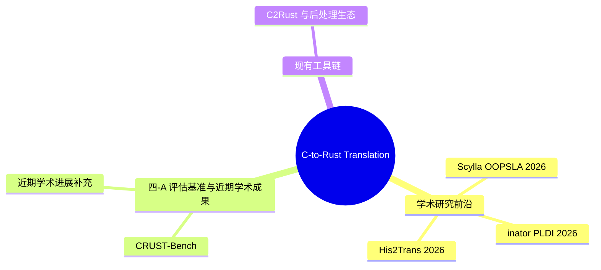

> **内容分级**: [综述级]
> **代码状态**: ✅ 含可编译示例
>
> **定理链**: N/A — 描述性/综述性/导航性文档，不涉及形式化定理链
>

# C-to-Rust Translation Ecosystem（C 到 Rust 翻译生态）
>
> **EN**: C To Rust Translation
> **Summary**: C To Rust Translation: Rust ecosystem tools, crates, and engineering practices.
> **Rust 版本**: 1.97.0+ (Edition 2024)
> **受众**: [进阶]
> **Bloom 层级**: L4-L5
> **A/S/P 标记**: **P** — Procedure
> **双维定位**: E×Eva — 评估 C→Rust 自动化翻译工具的适用性与局限
> **前置概念**: [Rust vs C++](../../05_comparative/01_systems_languages/01_rust_vs_cpp.md) ·
> [Unsafe Rust](../../03_advanced/02_unsafe/01_unsafe.md) ·
> [FFI](../../03_advanced/04_ffi/02_ffi_advanced.md)
> **后置概念**: [Formal Verification Tools](../08_formal_verification/02_formal_verification_tools.md) ·
> [Compiler Internals](../00_toolchain/04_compiler_internals.md)
> **权威来源**: 本文件为 `concept/` 权威页。
>
> **主要来源**: [DARPA TRACTOR] · [C2Rust] · [Scylla (OOPSLA 2026)] · [&inator (PLDI 2026)] · [His2Trans] · [Itanium C++ ABI](https://itanium-cxx-abi.github.io/cxx-abi/abi.html)
>
> **来源**: [Rustonomicon — FFI](https://doc.rust-lang.org/nomicon/ffi.html) · [bindgen](https://docs.rs/bindgen/)
---

**变更日志**:

- v1.0 (2026-05-26): 初始创建。覆盖 DARPA TRACTOR、Scylla、&inator、His2Trans、C2Rust 生态等最新权威来源 [Web Authority AlignmentSprint](../../00_meta/02_sources/05_international_authority_index.md)
- v1.1 (2026-05-26): 权威内容对齐：补充 Hayroll (PLDI 2026) — C 宏（Macro）与条件编译的模块（Module）化翻译，符号执行驱动配置覆盖，翻译器无关设计 [Web Authority AlignmentBatch 14](../../00_meta/02_sources/05_international_authority_index.md)

---

## 📑 目录

- [C-to-Rust Translation Ecosystem（C 到 Rust 翻译生态）](#c-to-rust-translation-ecosystemc-到-rust-翻译生态)
  - [📑 目录](#-目录)
  - [零、TL;DR —— 30 秒选型](#零tldr--30-秒选型)
  - [一、翻译生态全景矩阵](#一翻译生态全景矩阵)
  - [二、工业级项目：DARPA TRACTOR](#二工业级项目darpa-tractor)
  - [三、学术研究前沿](#三学术研究前沿)
    - [3.1 Scylla（OOPSLA 2026）](#31-scyllaoopsla-2026)
    - [3.2 \&inator（PLDI 2026）](#32-inatorpldi-2026)
    - [3.3 His2Trans（2026）](#33-his2trans2026)
    - [3.4 Cpp2Rust：C++ → Safe Rust 的自动翻译（PLDI 2026）](#34-cpp2rustc--safe-rust-的自动翻译pldi-2026)
    - [3.5 Hayroll：C 宏与条件编译的模块化翻译（PLDI 2026）](#35-hayrollc-宏与条件编译的模块化翻译pldi-2026)
  - [四、现有工具链](#四现有工具链)
    - [4.1 C2Rust 与后处理生态](#41-c2rust-与后处理生态)
  - [四-A、评估基准与近期学术成果](#四-a评估基准与近期学术成果)
    - [CRUST-Bench：C-to-Safe-Rust 翻译的系统性评估（COLM 2025 Spotlight）](#crust-benchc-to-safe-rust-翻译的系统性评估colm-2025-spotlight)
    - [近期学术进展补充](#近期学术进展补充)
  - [五、挑战与未来方向](#五挑战与未来方向)
  - [可编译示例：使用 `bindgen` 生成 C FFI 绑定](#可编译示例使用-bindgen-生成-c-ffi-绑定)
  - [嵌入式测验（Embedded Quiz）](#嵌入式测验embedded-quiz)
    - [测验 1：将 C 代码迁移到 Rust 的常见策略有哪些？（理解层）](#测验-1将-c-代码迁移到-rust-的常见策略有哪些理解层)
    - [测验 2：`c2rust` 工具能自动完成哪些工作？它的局限性是什么？（理解层）](#测验-2c2rust-工具能自动完成哪些工作它的局限性是什么理解层)
    - [测验 3：C 的 `void*` 与 Rust 的 `*mut c_void` 在 FFI 边界上如何对应？（理解层）](#测验-3c-的-void-与-rust-的-mut-c_void-在-ffi-边界上如何对应理解层)
    - [测验 4：为什么 C 到 Rust 的迁移中，" unsafe 边界最小化"是最重要的原则？（理解层）](#测验-4为什么-c-到-rust-的迁移中-unsafe-边界最小化是最重要的原则理解层)
    - [测验 5：Linux 内核的 Rust 驱动开发采用了什么增量迁移策略？（理解层）](#测验-5linux-内核的-rust-驱动开发采用了什么增量迁移策略理解层)
  - [认知路径](#认知路径)
    - [核心推理链](#核心推理链)
  - [⚠️ 反例与陷阱](#️-反例与陷阱)
    - [反例：C 风格裸指针解引用缺少 `unsafe`（rustc 1.97.0 实测）](#反例c-风格裸指针解引用缺少-unsaferustc-1970-实测)
    - [✅ 修正：显式 `unsafe` 块并注明不变量](#-修正显式-unsafe-块并注明不变量)
  - [🧭 思维导图（Mindmap）](#-思维导图mindmap)

---

## 零、TL;DR —— 30 秒选型

| 你的场景 | 首选工具 | 期望输出 |
|:---|:---|:---|
| 需要 safe Rust，C 代码无复杂别名 | **Scylla** | 纯 safe Rust（有限子集） |
| 需要精确 API 接口翻译 | **&inator** | safe 签名 + 内部实现保留 |
| 大规模工业代码库迁移 | **His2Trans / DARPA TRACTOR** | 可编译骨架 + 渐进式重构 |
| 快速原型、接受 unsafe | **C2Rust** | 机械翻译的 unsafe Rust |
| C2Rust 输出后处理 | **Crown / Laertes** | 减少 unsafe 使用比例 |

> **关键洞察**: C→Rust 翻译的本质不是"语法转换"，而是**所有权（Ownership）推断**。C 的裸指针在 Rust 中可能对应 `&T`、`&mut T`、`Box<T>`、`Vec<T>` 或保留为 `*const T`——选择哪个取决于别名分析、生命周期（Lifetimes）推断和数组大小推断的精度。当前没有任何工具能在所有场景下做出完美选择，这是该领域的核心开放问题。[来源: [PLDI 2026 — &inator](https://arxiv.org/abs/2604.17261)]

---

## 一、翻译生态全景矩阵

| 维度 | C2Rust | Crown | Scylla | &inator | His2Trans | DARPA TRACTOR |
|:---|:---|:---|:---|:---|:---|:---|
| **翻译范式** | 规则-based AST 转换 | C2Rust + SMT 优化 | 应用式子集 → safe Rust | 全局类型推断（Type Inference） + 接口翻译 | Skeleton-first + LLM 精修 | AI + 形式化验证 |
| **输出安全性** |  mostly unsafe | 减少 unsafe | ✅ safe Rust（有限子集） | ✅ safe 签名 | 渐进式 safe 化 | 目标：verified safe |
| **别名处理** | 保留裸指针 | SMT 约束推断 | 不支持复杂别名 | 全局别名分析 | 构建追踪恢复 | 待公开 |
| **数组推断** | 无 | 有限 | 有限 | ✅ 精确 | 静态分析 + 历史模式 | 待公开 |
| **工业规模** | ✅ 生产可用 | 研究 | 研究 | 研究 | 研究 | 资助阶段 |
| **形式化保证** | ❌ | 部分（SMT） | 类型安全 | 接口正确性 | 无 | 目标：完整验证 |

> **[来源: [OOPSLA 2026 — Scylla](https://arxiv.org/abs/2412.15042)]** · **[来源: [PLDI 2026 — &inator](https://arxiv.org/abs/2604.17261)]** · **[来源: [arXiv 2026 — His2Trans](https://arxiv.org/abs/2603.02617)]** · **[来源: [DARPA TRACTOR](https://www.darpa.mil/research/programs/translating-all-c-to-rust)]**

---

## 二、工业级项目：DARPA TRACTOR

**DARPA TRACTOR**（Translating All C to Rust）是美国国防部高级研究计划局于 2024 年启动的 $5M+ 资助项目，目标是创建能**安全且可验证地**将遗留 C 代码库转换为内存安全（Memory Safety） Rust 的自动化工具。

**ForCLift**（Formally-Verified Compositional Lifting of C to Rust）是 TRACTOR 下的核心研究团队，由威斯康星大学麦迪逊分校（UW-Madison）、加州大学伯克利分校（UC Berkeley）、伊利诺伊大学厄巴纳-香槟分校（UIUC）和爱丁堡大学联合组成。

**技术路线**：

```text
Verified Lifting = 形式化方法 + 程序分析 + 大语言模型（LLM）
```

| 组件 | 功能 | 创新点 |
|:---|:---|:---|
| **组合式提升** | 将 C 函数逐函数翻译为 Rust | 模块（Module）化验证，避免全局分析爆炸 |
| **LLM 辅助合成** | 生成 idiomatic Rust 代码 | 利用 LLM 的模式识别能力处理 C 惯用法 |
| **形式化验证** | 证明翻译前后语义等价 | SMT + 程序逻辑验证输出正确性 |

> **关键洞察**: TRACTOR 的独特之处在于**"验证翻译本身"**——不仅生成 Rust 代码，还要证明生成的代码与原始 C 代码语义等价。这比"仅生成代码"难一个数量级，但也是唯一能让高保证系统（如国防、航空）接受自动翻译的路径。[来源: [DARPA TRACTOR Program](https://www.darpa.mil/research/programs/translating-all-c-to-rust)] · [来源: [UIUC News 2025](https://csl.illinois.edu/news-and-media/translating-legacy-code-for-a-safer-future)]

---

## 三、学术研究前沿

本节将「学术研究前沿」分解为若干主题： Scylla（OOPSLA 2026）、inator（PLDI 2026）、His2Trans（2026）、Cpp2Rust：C++ → Safe Rust 的自动翻译（PLDI…等5个方面。

### 3.1 Scylla（OOPSLA 2026）

**Scylla** 是由 Microsoft Research 的 Fromherz & Protzenko 开发的 C→safe Rust 翻译器，发表于 OOPSLA 2026。

**核心创新**：

- **目标约束**: 仅处理 C 的"应用式子集"（applicative subset）——无复杂别名、无动态借用（Borrowing）
- **类型推断（Type Inference）**: 全局反向分析，从期望类型反推 C 变量应翻译为 `&T`、`&mut T` 还是 `Box<T>`
- **安全保证**: 输出代码保证通过 Rust 借用（Borrowing）检查器，即**零 unsafe**

**局限**：

```text
Scylla 不支持的 C 模式:
  ❌ 指针算术（除数组索引外）
  ❌ 动态借用（运行时决定的 &mut / &）
  ❌ 复杂别名（如链表、图结构）
  ❌ union 和位域
```

> **关键洞察**: Scylla 证明了"在受限子集上，C→safe Rust 是可行的"。它的价值不在于处理所有 C 代码，而在于定义了**"可安全翻译的 C 子集"**的边界——这是 TRACTOR 等工业项目的重要参考。[来源: [OOPSLA 2026 — Fromherz & Protzenko, "Scylla: Translating an Applicative Subset of C to Safe Rust"](https://arxiv.org/abs/2412.15042)]

### 3.2 &inator（PLDI 2026）

**&inator** 是由普渡大学（Purdue）Chen、Coughlin 和 Bond 开发的 C→Rust **接口翻译**工具，发表于 PLDI 2026。

**核心创新**：

- **接口翻译而非代码翻译**: &inator 不翻译函数体，而是翻译**函数签名**——将 C 的 `int* foo(int* x)` 翻译为 Rust 的 `fn foo(x: &mut i32) -> &mut i32`
- **全局类型推断（Type Inference）**: 使用 SMT 求解器（Z3）在**整个程序**范围内推断每个指针的最精确 Rust 类型
- **别名感知**: 通过全局分析处理跨函数边界的别名关系

**技术架构**：

```text
C AST → 指针关系图 → SMT 约束（Z3）→ 最优 Rust 类型分配 → 接口重写
```

> **关键洞察**: &inator 的核心贡献是证明了"接口翻译"比"全程序翻译"更容易验证——因为接口的行为由类型签名决定，而类型签名可以被形式化地比较（C 的函数类型 vs Rust 的函数类型）。这为"渐进式迁移"提供了理论基础：先翻译接口（安全边界），再逐步重写实现。[来源: [PLDI 2026 — Chen et al., "Correct, Precise C-to-Rust Interface Translation"](https://arxiv.org/abs/2604.17261)]

### 3.3 His2Trans（2026）

**His2Trans** 是 2026 年提出的**骨架优先 + 历史知识重用**框架，针对工业级 C 代码库的渐进式迁移。

**核心创新**：

- **Skeleton-first**: 先建立可编译的项目级骨架（声明、模块（Module）结构、跨模块引用（Reference）），再生成函数体
- **Build Trace Recovery**: 从构建系统的实际依赖追踪中恢复项目上下文，而非依赖推测性静态分析
- **Historical Knowledge Reuse**: 重用已编译通过的翻译对（Rust API、本地模式），形成自我进化的 RAG（Retrieval-Augmented Generation）

> **关键洞察**: His2Trans 认识到现有工具的核心失败模式——"初始选择错误导致后续级联失败"。通过先建立类型一致的骨架，His2Trans 将全局构建失败转化为局部修复任务，这是从"研究原型"到"工业工具"的关键跃迁。[来源: [arXiv 2026 — "His2Trans: A Skeleton-First Framework for Self-Evolving C-to-Rust Translation"](https://arxiv.org/abs/2603.02617)]

### 3.4 Cpp2Rust：C++ → Safe Rust 的自动翻译（PLDI 2026）

**[INESC-ID / Google]** Cpp2Rust 是首个能自动将 **C++ 程序翻译为功能等价且内存安全（Memory Safety）的 Rust 代码** 的系统，发表于 PLDI 2026。与 C→Rust 翻译相比，C++→Rust 面临更严峻的挑战：C++ 拥有类、继承、虚调用、模板、异常和 STL，其**无限制别名模型**与 Rust 的所有权（Ownership）模型存在根本性冲突。

**核心策略 — 运行时安全检查（Runtime-Enforced Safety）**：

Cpp2Rust 不尝试在编译期证明 C++ 的别名模式符合 Rust 的借用（Borrowing）规则（这是不可判定的），而是将所有权（Ownership）和可变性检查**推迟到运行时（Runtime）**：

| C++ 特性 | Cpp2Rust 翻译策略 | 运行时（Runtime）开销 |
|:---|:---|:---|
| 原始指针（Raw Pointer） `T*` | 自定义 `Ptr<T>` 类型（引用（Reference）计数 + 借用（Borrowing）检查） | 引用计数增减 |
| 引用（Reference） `T&` | `Ptr<T>` 的不可变借用（Immutable Borrow）视图 | 动态可变性检查 |
| 指针算术 | `Ptr<T>` 的偏移操作（边界检查） | 边界检查 |
| 类/继承/虚调用 | Rust trait + vtable 模拟 | 动态分发 |
| 部分 STL（`std::vector`, `std::string`） | 对应 Rust 标准库类型 | 无额外开销 |

**Source-to-Source 优化器**：

Cpp2Rust 包含一个 Rust→Rust 优化器（3.6k LOC），通过静态分析消除冗余的运行时（Runtime）检查：

- **单所有权（Ownership）消除**：当分析证明某个 `Ptr<T>` 始终只有一个所有者时，移除引用（Reference）计数；
- **静态可变性提升**：当分析证明某个 `Ptr<T>` 的可变性模式固定时，将动态检查转换为静态 `&mut T`；
- **内联与死代码消除**：标准编译器优化。

**评估结果（真实世界 C++ 程序）**：

| 程序 | 领域 | C++ LOC | Cpp2Rust safe LOC | 性能损失（优化后） | 备注 |
|:---|:---|:---:|:---:|:---:|:---|
| **WOFF2** | 字体压缩 | 4.7k | 7.7k | **压缩 2%** / 解压 21% | 与 C++ 版本字节级一致 |
| **Brunsli** | JPEG 无损压缩 | ~8k | — | **6× 更慢** | 大量指针算术，优化器难以消除动态检查 |

> **关键对比**: Google 工程师手动将 WOFF2 从 C++ 移植到 Rust 花费了 **12 天机械翻译 + 8 天惯用化重构**，且引入了 **20 个 bug**（整数溢出、运行时（Runtime）可变性违规、panic、语义不匹配）。Cpp2Rust 在**几秒钟内**完成机械翻译，输出零 unsafe 代码，并通过字节级输出验证正确性。
> **核心洞察**: Cpp2Rust 的"运行时（Runtime）安全"策略与 Scylla/&inator 的"编译期安全"策略形成互补。对于**性能不敏感的安全关键组件**（如解析器、配置加载器），Cpp2Rust 提供了一条"自动翻译→运行正确→逐步优化"的实用路径；对于**性能敏感的核心路径**，仍需 Scylla/&inator 的静态分析或人工重写。这类似于 Rust 自身的设计哲学：默认安全，允许局部 unsafe 优化。
> **来源**: [PLDI 2026 — Popescu et al., "Cpp2Rust: Automatic Translation of C++ to Safe Rust"](https://web.ist.utl.pt/nuno.lopes/pubs/cpp2rust-pldi26.pdf) · [Cpp2Rust GitHub](https://github.com/Cpp2Rust/cpp2rust) · 可信度: ✅

### 3.5 Hayroll：C 宏与条件编译的模块化翻译（PLDI 2026）

**[University of Washington]** Hayroll 是一个**模块化包装器**，使 C→Rust 翻译工具能够**感知预处理器**（preprocessor-aware），而无需修改底层翻译器。这是解决 C-to-Rust 翻译中最顽固障碍之一——**C 预处理器宏（Macro）和条件编译**——的首个系统性方案。

**问题背景**：现有 C→Rust 翻译器（如 C2Rust）在翻译前先运行 C 预处理器 `cpp`，这导致：

1. **丢失可配置性**：`#ifdef` 条件编译被展开为单一配置，丢失多平台/多配置支持；
2. **丢失抽象**：程序员定义的宏（Macro）（常量、函数式宏）被内联展开，变成魔法数字和重复代码；
3. **代码膨胀**：条件编译的代码块全部展开，导致翻译后的 Rust 代码包含大量死代码。

**Hayroll 双层架构**：

| **层级** | **功能** | **技术** |
|:---|:---|:---|
| **条件编译翻译层 (Pioneer)** | 符号执行推导每行源代码的激活条件 | 将程序拆分为配置特定的翻译任务，覆盖每行代码 |
| **宏翻译层** | 分类宏、标注宏展开节点、重建 Rust 宏（Macro）/函数 | 通过源码标注与翻译器输出交互，无需侵入式修改 |

**关键设计——翻译器无关性**：

- 两层之间仅通过**任务分区**和**源码标注**通信
- 底层翻译器保持黑盒状态（实现使用 C2Rust，但设计可适配任何翻译器）
- 宏展开节点被标记为 "tag"，翻译器输出后通过检索 tag 重建宏结构

**评估结果**：

| **基准** | **说明** | **结果** |
|:---|:---|:---|
| CRUST-Bench | 100 个真实 C 仓库 | 成功重建大多数语法宏 |
| LibmCS | 嵌入式 C 数学库 | 避免配置爆炸（符号执行控制组合数） |
| zlib | 压缩库（大量条件编译） | 输出通过与原 C2Rust 相同的测试 |

> **核心洞察**: Hayroll 证明"解耦的预处理器分析"可以在不修改底层翻译器的情况下，恢复 C→Rust 翻译的配置行为和宏抽象。这与 &inator 的"接口层解耦"哲学一致：通过定义清晰的边界（这里是源码标注 + 任务分区），让现有工具获得新能力而无需重写。对工业迁移而言，这意味着企业可以在保留现有 C 项目配置基础设施（Kconfig、CMake 条件编译等）的同时，逐步引入 Rust 组件。
> **来源**: [PLDI 2026 — Peng et al., "Hayroll: A Modular Wrapper for Translating C Macros and Conditional Compilation to Rust"](https://homes.cs.washington.edu/~mernst/pubs/c-rust-macros-pldi2026.pdf) · [Hayroll GitHub](https://github.com/UW-HARVEST/Hayroll) · 可信度: ✅

---

## 四、现有工具链

本节聚焦「现有工具链」，核心内容为 C2Rust 与后处理生态。

### 4.1 C2Rust 与后处理生态

**C2Rust**（Galois / Immunant）是目前最成熟的 C→Rust 翻译工具，但输出以 **unsafe Rust** 为主。

**后处理工具链**：

| 工具 | 技术 | 效果 |
|:---|:---|:---|
| **Crown** (Zhang et al., 2023) | 所有权（Ownership） + 可变性分析，SMT 约束 | 减少 raw pointer 使用，但不修改函数签名 |
| **Laertes** (Emre et al., 2021) | 重量级指针分析 + 借用（Borrowing）检查器劫持 | 97% 成功率处理纯指针函数（libxml2 中 210/3029 函数） |
| **CRustS** (Ling et al., 2022) | 模板封装 | 封装 unsafe 代码，但不消除 |

> **关键洞察**: C2Rust 生态的核心教训——"翻译容易，安全化难"。从 unsafe Rust 到 safe Rust 的转换需要**全局所有权（Ownership）推断**，而这不是局部重写能解决的。&inator 和 Scylla 的成功在于绕过这个问题：&inator 只翻译接口（类型系统（Type System）层面），Scylla 限制输入子集（语言层面）。[来源: [C2Rust](https://c2rust.com/)] · [来源: [Crown Paper](https://arxiv.org/abs/2305.02287)]

---

## 四-A、评估基准与近期学术成果

本节围绕「四-A、评估基准与近期学术成果」展开，覆盖 CRUST-Bench：C-to-Safe-Rust 翻译的系统性评估… 与 近期学术进展补充 两个方面。

### CRUST-Bench：C-to-Safe-Rust 翻译的系统性评估（COLM 2025 Spotlight）

**[UT Austin / NYU]** CRUST-Bench 是由 Khatry 等人提出的首个**仓库级** C-to-Rust 翻译基准测试，填补了此前仅评估单函数翻译的空白。它包含 **100 个真实 C 仓库**（平均 958 LOC，多文件），每个仓库配有人工编写的 **safe Rust 接口**（规定签名、类型和所有权（Ownership）约束）和 **Rust 测试用例**（验证功能正确性）。

**评估协议的四重约束**：

1. **接口匹配**： transpiled 代码必须遵循给定的 safe Rust 接口；
2. **编译通过**：通过 rustc 借用（Borrowing）检查器；
3. **零 unsafe / 零 FFI**：接口层不允许 `unsafe` 块或外部函数调用；
4. **测试通过**：全部测试用例执行成功。

**LLM 评估结果（关键发现）**：

| 模型 | 单次成功率 | 迭代修复成功率 | 备注 |
|:---|:---:|:---:|:---|
| OpenAI o3 | **19%** | **48%** | 最强闭源模型，修复循环利用编译错误和测试失败反馈 |
| Claude Opus 4 | 13-22% | 32-48% | 与 o3 同量级 |
| Claude 3.7 Sonnet | 13-22% | 32-48% | 同量级 |
| Virtuoso-Medium-32B | <10% | ~20% | 最强开源模型，但仍显著落后闭源模型 |
| SWE-agent 等 Agentic 系统 | — | < 修复循环 | 未超过简单的 "generate-then-repair" 循环 |

> **关键洞察**: 即使是最先进的 LLM（OpenAI o3）在**严格的 safe Rust 约束**下，迭代修复后也只能达到 48% 的成功率。这揭示了 C-to-Rust 翻译的核心瓶颈不在语法转换，而在**所有权（Ownership）语义推断**——将 C 的自由指针模型映射到 Rust 的受限借用（Borrowing）模型需要超越模式匹配（Pattern Matching）的深层推理。CRUST-Bench 的严格协议（零 unsafe）使其成为衡量"真正的安全翻译"而非"语法转写"的黄金标准。
> **来源**: [CRUST-Bench (COLM 2025 Spotlight)](https://arxiv.org/abs/2504.15254) · [CRUST-Bench GitHub](https://github.com/anirudhkhatry/CRUST-bench) · 可信度: ✅

### 近期学术进展补充

| 论文 | 会议 | 核心贡献 | 与 C-to-Rust 翻译的关联 |
|:---|:---|:---|:---|
| **"Don't Write, but Return"** (Hong & Ryu) | PLDI 2024 | 将 C 的输出参数替换为 Rust 的代数数据类型（ADT）返回 | 解决 C 中常见的 "out-parameter" 模式到 Rust 的惯用转换 |
| **"To Tag, or Not to Tag"** (Hong & Ryu) | ASE 2024 | C union 到 Rust tagged union 的自动翻译策略 | 解决 C union 的内存布局与 Rust enum 的类型安全之间的语义映射 |
| **"Compiling C to Safe Rust, Formalized"** (Fromherz & Protzenko) | arXiv 2024 | C 到 safe Rust 的形式化编译框架 | 提供翻译正确性的数学基础，与 Scylla/&inator 互补 |
| **Hayroll** | PLDI 2026 | [C 宏与条件编译的模块化翻译](#35-hayrollc-宏与条件编译的模块化翻译pldi-2026) | 符号执行 + 宏分类重建，翻译器无关设计 |
| **SmartC2Rust** | ICSE 2026 | 迭代反馈驱动的 LLM C→Rust 翻译（安全性 + 等价性） | 利用 LLM 模式识别 + 编译器反馈循环，实现安全的 C 到 Rust 自动翻译 |

> **来源**: [Hong & Ryu, PLDI 2024](https://doi.org/10.1145/3656406) · [Hong & Ryu, ASE 2024](https://doi.org/10.1145/3691620.3694985) · [Fromherz & Protzenko, arXiv 2024](https://arxiv.org/abs/2412.15042) · [Hayroll, PLDI 2026](https://homes.cs.washington.edu/~mernst/pubs/c-rust-macros-pldi2026.pdf) · [SmartC2Rust, ICSE 2026](https://conf.researchr.org/track/icse-2026/icse-2026-research-track) · 可信度: ✅

---

## 五、挑战与未来方向

| 挑战 | 当前状态 | 未来方向 |
|:---|:---|:---|
| **指针算术 → 切片（Slice）/索引** | 部分解决（&inator, Scylla） | 需要更精确的数组大小推断 |
| **动态别名 → 借用（Borrowing）** | 未解决 | 可能需要运行时（Runtime）检查（如 RefCell） |
| **union/位域 → Rust 枚举（Enum）** | 手动处理（Hong & Ryu 2024 有进展） | 自动化语义映射 |
| **宏/条件编译** | C2Rust 部分支持（Hayroll PLDI 2026 有进展） | 预处理标准化 |
| **验证翻译正确性** | CRUST-Bench 提供评估框架 | 组合式验证 + LLM 辅助 |
| **LLM 安全翻译上限** | o3 迭代修复 48%（CRUST-Bench） | 需要结合符号执行和类型推断（Type Inference）的混合方法 |

> **权威来源**: [DARPA TRACTOR](https://www.darpa.mil/research/programs/translating-all-c-to-rust) · [Scylla (OOPSLA 2026)](https://arxiv.org/abs/2412.15042) · [&inator (PLDI 2026)](https://arxiv.org/abs/2604.17261) · [His2Trans (arXiv 2026)](https://arxiv.org/abs/2603.02617) · [CRUST-Bench (COLM 2025)](https://arxiv.org/abs/2504.15254) · [C2Rust](https://c2rust.com/) · [Crown](https://arxiv.org/abs/2305.02287) · [Laertes](https://arxiv.org/abs/2103.15450)

---

## 可编译示例：使用 `bindgen` 生成 C FFI 绑定

以下示例展示如何用 `bindgen` 将 C 头文件自动转换为 Rust FFI 绑定：

```rust
// build.rs — 在编译时生成绑定
use std::env;
use std::path::PathBuf;

fn main() {
    println!("cargo:rustc-link-lib=my_c_lib");

    let bindings = bindgen::Builder::default()
        .header("wrapper.h")
        .parse_callbacks(Box::new(bindgen::CargoCallbacks::new()))
        .generate()
        .expect("Unable to generate bindings");

    let out_path = PathBuf::from(env::var("OUT_DIR").unwrap());
    bindings
        .write_to_file(out_path.join("bindings.rs"))
        .expect("Couldn't write bindings!");
}
```

```rust,ignore
// src/lib.rs — 使用生成的绑定
include!(concat!(env!("OUT_DIR"), "/bindings.rs"));

pub fn call_c_function() {
    unsafe {
        my_c_function(); // 调用 C 函数
    }
}
```

> **Cargo.toml 依赖**: `bindgen = "0.71"`

---

> **权威来源**: [Rust Reference](https://doc.rust-lang.org/reference/introduction.html) · [The Rust Programming Language](https://doc.rust-lang.org/book/title-page.html) · [Rustonomicon](https://doc.rust-lang.org/nomicon/index.html) · [Rust RFCs](https://rust-lang.github.io/rfcs/index.html)
> **权威来源对齐变更日志**: 2026-05-26 创建 C-to-Rust 翻译生态专题文件，对齐 DARPA TRACTOR、PLDI 2026、OOPSLA 2026 等最新权威来源 [Web Authority AlignmentSprint](../../00_meta/02_sources/05_international_authority_index.md)

- 2026-05-26 R22: 补充 SmartC2Rust (ICSE 2026) — 迭代反馈驱动的 LLM C→Rust 翻译 [ICSE 2026](https://conf.researchr.org/home/icse-2026)

**文档版本**: 1.0
**最后更新**: 2026-05-26
**状态**: ✅ 初始创建

## 嵌入式测验（Embedded Quiz）

「嵌入式测验（Embedded Quiz）」部分按测验 1：将 C 代码迁移到 Rust 的常见策略有哪些？（理解层）、测验 2：`c2rust` 工具能自动完成哪些工作？它的局限性是什么？…、测验 3：C 的 `void*` 与 Rust 的 `*mut c_v…、测验 4：为什么 C 到 Rust 的迁移中，" unsafe 边界最…等5个方面的顺序逐层展开。

### 测验 1：将 C 代码迁移到 Rust 的常见策略有哪些？（理解层）

**题目**: 将 C 代码迁移到 Rust 的常见策略有哪些？

<details>
<summary>✅ 答案与解析</summary>

1) 逐步替换：用 Rust 重写模块，通过 FFI 与遗留 C 代码交互；2) 完全重写：一次性替换整个项目；3) 自动翻译：`c2rust` 工具自动转换语法，再手动重构为安全 Rust。

</details>

---

### 测验 2：`c2rust` 工具能自动完成哪些工作？它的局限性是什么？（理解层）

**题目**: `c2rust` 工具能自动完成哪些工作？它的局限性是什么？

<details>
<summary>✅ 答案与解析</summary>

`c2rust` 可将 C 代码语法翻译为等价的 Rust（包括指针、结构体（Struct）、宏）。局限性：翻译后的代码使用大量 `unsafe` 和原始指针（Raw Pointer），仍需手动重构为安全 Rust。
</details>

---

### 测验 3：C 的 `void*` 与 Rust 的 `*mut c_void` 在 FFI 边界上如何对应？（理解层）

**题目**: C 的 `void*` 与 Rust 的 `*mut c_void` 在 FFI 边界上如何对应？

<details>
<summary>✅ 答案与解析</summary>

`c2rust` / `bindgen` 将 `void*` 映射为 `*mut c_void`。在 Rust 中通常需要将其转换为具体类型指针（通过 `as *mut T`），这需要在 `unsafe` 块中进行。
</details>

---

### 测验 4：为什么 C 到 Rust 的迁移中，" unsafe 边界最小化"是最重要的原则？（理解层）

**题目**: 为什么 C 到 Rust 的迁移中，" unsafe 边界最小化"是最重要的原则？

<details>
<summary>✅ 答案与解析</summary>

自动翻译产生大量 `unsafe`。应通过封装将 unsafe 限制在最底层，向上提供安全的 Rust API。这允许借用（Borrowing）检查器保护大部分代码，同时与 C 遗留代码互操作。
</details>

---

### 测验 5：Linux 内核的 Rust 驱动开发采用了什么增量迁移策略？（理解层）

**题目**: Linux 内核的 Rust 驱动开发采用了什么增量迁移策略？

<details>
<summary>✅ 答案与解析</summary>

在现有 C 内核框架中逐步引入 Rust 驱动。Rust 代码通过安全的 FFI 包装调用 C 内核 API，利用 Rust 的内存安全（Memory Safety）保证降低驱动漏洞风险，同时保持与 C 子系统的兼容。
</details>

## 认知路径

> **认知路径**: 从 Rust 核心语言特性出发，经由 **C-to-Rust Translation Ecosystem（C 到 Rust 翻译生态）** 的生态/前沿实践，通向系统化工程能力与未来语言演进方向。

### 核心推理链

| 定理 | 前提 | 结论 | 置信度 |
|:---|:---|:---|:---|
| C-to-Rust Translation Ecosystem（C 到 Rust 翻译生态） 基础原理 ⟹ 正确选型 | 理解核心概念与适用边界 | 能在实际项目中做出合理决策 | 高 |
| C-to-Rust Translation Ecosystem（C 到 Rust 翻译生态） 选型实践 ⟹ 常见陷阱 | 忽视版本兼容性与生态成熟度 | 技术债务或迁移成本 | 中 |
| C-to-Rust Translation Ecosystem（C 到 Rust 翻译生态） 陷阱规避 ⟹ 深度掌握 | 持续跟踪社区演进与最佳实践 | 能进行架构设计与技术预研 | 高 |

## ⚠️ 反例与陷阱

本节以裸指针解引用缺 `unsafe` 为反例，展示 C 代码直译时最易遗漏的安全边界标注。

### 反例：C 风格裸指针解引用缺少 `unsafe`（rustc 1.97.0 实测）

C 代码直译时最易遗漏的安全边界：

```rust,compile_fail,E0133
fn main() {
    let x = 42;
    let p = &x as *const i32;
    let v = *p; // ❌ 解引用裸指针必须在 unsafe 块中
    println!("{}", v);
}
```

**错误**：`E0133 dereference of raw pointer is unsafe and requires unsafe block`。

### ✅ 修正：显式 `unsafe` 块并注明不变量

```rust
fn main() {
    let x = 42;
    let p = &x as *const i32;
    // SAFETY: p 来自有效引用 &x，指向已初始化的 i32，且在 x 存活期内使用。
    let v = unsafe { *p };
    println!("{}", v);
}
```

---

## 🧭 思维导图（Mindmap）



> **认知功能**: 本 mindmap 从本页「C-to-Rust Translation」的章节结构提炼，一级分支对应核心主题，叶子节点为关键子概念，可作为本页的快速导航与复习索引。
