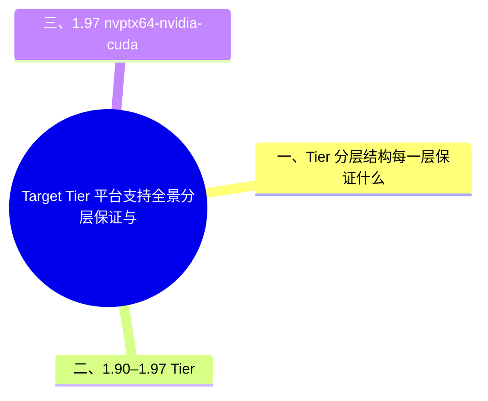

# Target Tier 平台支持全景：分层保证与 1.90–1.97 变迁

**EN**: Target Tier Platform Support: Guarantees and Changes in Rust 1.90–1.97

> **Summary**: Consolidated reference for Rust's tiered platform support — what Tier 1/2/3 guarantee, the current target counts, and every tier change from Rust 1.90 through 1.97, including the nvptx64-nvidia-cuda minimum SM/PTX ISA raise in 1.97.

> **Rust 版本**: 1.97.0+ (Edition 2024)
> **Bloom 层级**: L3-L4
> **权威来源**: 本文件为 `concept/` 权威页（target tier 分层与版本变迁的唯一 consolidated 解释）。
> **前置概念**: [交叉编译与 target 三元组](02_cross_compilation.md) · [将 Rust 集成到现有平台](../00_toolchain/08_platform_rust_integration.md)
> **后置概念**: [`-Z` 选项参考清单](../00_toolchain/15_z_flags_reference.md)（`build-std` 与 Tier 2/3 目标的关系）· [WASI](01_wasi.md) · [Rust vs Go（交叉编译与平台支持广度对比）](../../05_comparative/01_systems_languages/03_rust_vs_go.md)

> **来源**: [The rustc book — Platform Support](https://doc.rust-lang.org/nightly/rustc/platform-support.html)（curl 200 实测 2026-07-12）· [Target Tier Policy](https://doc.rust-lang.org/nightly/rustc/target-tier-policy.html) · [releases.rs 1.90–1.97](https://releases.rs/)（各版 Platform Support 节，curl 200 实测）· [rustc book — nvptx64-nvidia-cuda](https://doc.rust-lang.org/nightly/rustc/platform-support/nvptx64-nvidia-cuda.html)（curl 200 实测）
> **国际权威来源（2026-07-13 补录）**: **P1** [Herlihy & Shavit — The Art of Multiprocessor Programming（Morgan Kaufmann）](https://dl.acm.org/doi/book/10.5555/2385452)（各目标架构原子操作（Atomic Operations）/内存模型的理论参照） · **P2** [Rust Blog — Raising the baseline for the nvptx64-nvidia-cuda target](https://blog.rust-lang.org/2026/05/01/nvptx-baseline-update/)（nvptx baseline 调整的官方公告；curl 200 实测 2026-07-13）

---

## 一、Tier 分层结构：每一层保证什么

Rust 官方支持的平台（target）按保证强度分为三层，以 **target triple**（目标三元组）标识（三元组结构见 [交叉编译](02_cross_compilation.md) §target triple）。

| 层级 | 一句话 | 官方二进制 | 自动化测试 | std 支持 | 能否作开发主机 |
|:---|:---|:---|:---|:---|:---|
| **Tier 1（含 Host Tools）** | “保证能工作” | rustc/cargo/std 全量 | 每次变更后构建**并通过测试**（含 host tools 测试） | 完整 std | ✅ |
| **Tier 2（含 Host Tools）** | “保证能构建” | std（个别仅 core）+ host tools | 每次变更后**构建**通过；测试不总是运行 | 完整 std | ✅ |
| **Tier 2** | “保证能构建” | std（个别仅 core） | 构建通过；测试不保证 | 完整 std（个别仅 core） | ❌（仅编译目标） |
| **Tier 3** | “代码库里有支持” | ❌ 不产出官方二进制 | ❌ 不保证构建 | 视目标而定，多为 core/no_std | ❌ |

关键含义差异：

- **Tier 1 → Tier 2 的核心落差**：自动化测试从“每次变更必跑”变为“只保证构建”；Tier 2 目标特定代码**不经 Rust 团队严格审查**（rustc book 原文：tier 2 target-specific code is not closely scrutinized），bug 可能性更高。
- **`rust-docs` 组件**通常不为 Tier 2 构建，rustup 会改装相近 Tier 1 目标的文档。
- **Tier 3** 是“社区维护”层：官方 CI 不覆盖，损坏可能无人立即发现；稳定工具链上通常需 `-Z build-std`（见 [`-Z` 选项参考清单](../00_toolchain/15_z_flags_reference.md) §二）自行编译 core/std。

当前快照（rustc book nightly 版页面，2026-07-12 实测统计）：Tier 1 **8** 个（全部含 host tools）、Tier 2 含 host tools **27** 个、Tier 2 不含 host tools **77** 个、Tier 3 约 **200** 个。完整清单以 [Platform Support](https://doc.rust-lang.org/nightly/rustc/platform-support.html) 页面为准；组件可用性另见 [Component availability](https://rust-lang.github.io/rustup-components-history/)。

---

## 二、1.90–1.97 Tier 变迁年表（release notes Platform Support 节逐版核对）

| 版本 | 变化 | 方向 |
|:---|:---|:---|
| **1.90** | `x86_64-apple-darwin` → Tier 2 with host tools | ⬇ 降级（macOS 平台重心转向 aarch64） |
| **1.91** | `aarch64-pc-windows-gnullvm`、`x86_64-pc-windows-gnullvm` → Tier 2 with host tools；`aarch64-pc-windows-msvc` → **Tier 1** | ⬆ 升级（Windows on ARM 进入一等公民） |
| **1.92** | 无 Platform Support 变化 | — |
| **1.93** | `riscv64a23-unknown-linux-gnu` → Tier 2（无 host tools） | ⬆ 升级（RISC-V RVA23 基线目标） |
| **1.94** | 新增 `riscv64im-unknown-none-elf` 为 **Tier 3** | ➕ 新增（RISC-V 嵌入式裸机） |
| **1.95** | `powerpc64-unknown-linux-musl` → Tier 2 with host tools；`aarch64-apple-{tvos, tvos-sim, watchos, watchos-sim, visionos, visionos-sim}` 六个 Apple 目标 → Tier 2 | ⬆ 升级（Apple 非主流设备平台批量转正） |
| **1.96** | 无 Platform Support 变化 | — |
| **1.97** | `nvptx64-nvidia-cuda`：放弃旧硬件架构与旧 PTX ISA（见 §三） | 🔧 支持面收窄 |

> **读表要点**：1.90–1.97 的主线是 **aarch64 全面上行**（Windows ARM 升 Tier 1、Apple 六目标升 Tier 2）与 **RISC-V 补齐**（RVA23 服务器目标升 Tier 2、嵌入式裸机目标新增 Tier 3）；唯一的降级是 x86_64 macOS 随 Apple 硬件迁移退居 Tier 2。

---

## 三、1.97 nvptx64-nvidia-cuda：最低 SM / PTX ISA 上调

`nvptx64-nvidia-cuda`（Tier 2，no_std，面向 NVIDIA CUDA 加速器的 PTX 代码生成）在 1.97 上调了最低支持版本（[rustc book — nvptx64-nvidia-cuda](https://doc.rust-lang.org/nightly/rustc/platform-support/nvptx64-nvidia-cuda.html) 的 “Minimum SM and PTX support by Rust version” 表）：

| Rust 版本 | SM 最低 | PTX ISA 最低 |
|:---|:---|:---|
| ≤ 1.96 | 2.0 | 3.2 |
| **1.97 – 待定上限** | **7.0（Volta 及以后）** | **7.0（CUDA 11+）** |

工程含义：

- **旧卡退役**：Compute Capability < 7.0（Volta 之前的 Maxwell/Pascal 等）的 GPU 从 1.97 起不再是受支持目标；PTX ISA < 7.0（CUDA 11 之前的驱动栈）同理。
- **target-cpu 选择**：`-C target-cpu=sm_89` 等指定具体 SM 架构时，PTX 版本取 “支持该 SM 的最老 PTX 版本” 与 “工具链支持的最老 PTX 版本” 的**较大者**，以最大化驱动兼容性；`-C target-feature=+ptx80` 可单独抬高 PTX 版本（默认 `ptx78` 需 CUDA 驱动 11.8，`ptx80` 需 12.0）。
- **构建路径**：该目标无预编译 std，须 nightly + `-Z build-std=core`（配合 `llvm-tools` 与 `llvm-bitcode-linker` 组件）——这是 Tier 2 no_std 目标的典型工作流，与 §一中 “Tier 2 仅保证构建” 的定位一致。
- **feature 粒度警告**：虽然编译器接受 `#[target_feature(enable = "ptx80", enable = "sm_89")]`，但 rustc book 明确 `ptx*`/`sm_*` 应视为 **crate 粒度**（经 `-C target-cpu`/`-C target-feature` 设置），属性用法不受支持、未来可能报错。

---

## 四、判定表：我的目标在哪一层、意味着什么

```text
目标 triple 查询：
  rustc --print target-list          # 编译器内置支持列表
  rustup target list --installed     # 本机已装 std 的目标

需要官方 std 二进制 + 测试保证     → 必须 Tier 1
需要官方 std 二进制，可自建测试     → Tier 2（注意 rust-docs 可能缺失）
目标在 target-list 但 rustup 无 std → Tier 3：nightly + -Z build-std 自行编译
目标不在 target-list               → 自定义 target JSON（-Z json-target-spec）或 Tier 3 提案（Target Tier Policy）
```

> **来源与反链**
>
> - [The rustc book — Platform Support](https://doc.rust-lang.org/nightly/rustc/platform-support.html)（分层定义与当前全量清单）
> - [Target Tier Policy](https://doc.rust-lang.org/nightly/rustc/target-tier-policy.html)（各层进入/退出政策）
> - [releases.rs — Rust Changelogs](https://releases.rs/)（1.90/1.91/1.93/1.94/1.95/1.97 各版 Platform Support 节；1.92/1.96 确认无该节）
> - [rustc book — nvptx64-nvidia-cuda](https://doc.rust-lang.org/nightly/rustc/platform-support/nvptx64-nvidia-cuda.html)（SM/PTX 最低版本表）
> - 反链：[交叉编译](02_cross_compilation.md) · [`-Z` 选项参考清单](../00_toolchain/15_z_flags_reference.md) · [将 Rust 集成到现有平台](../00_toolchain/08_platform_rust_integration.md)

## 🧭 思维导图（Mindmap）



## ⚠️ 反例与陷阱

嵌入式目标上常试图让句柄类型既 Copy 又自动释放资源——这在 Rust 中互斥。

### 反例：Copy 与 Drop 互斥（rustc 1.97.0，--edition 2024 实测）

```rust,compile_fail,E0184
#[derive(Copy)]
struct Handle(u8);

impl Drop for Handle { // ❌ Copy 与 Drop 互斥
    fn drop(&mut self) {}
}
```

**实测错误**：`error[E0184]: the trait`Copy`cannot be implemented for this type; the type has a destructor`。

### ✅ 修正：纯数据类型用 Copy；需释放资源的类型用 Drop + 移动语义

```rust
#[derive(Clone, Copy)]
struct Handle(u8); // ✅ 纯 Copy 数据不写 Drop

fn main() {
    let _ = Handle(0);
}
```

## 版本兼容性 / Version Compatibility

> 本节汇总与本概念相关的 Rust 稳定版本变更。完整列表见对应版本跟踪页。

- **[Rust 1.90](../../07_future/00_version_tracking/rust_1_90_stabilized.md)**
  - `x86_64-apple-darwin` 降为 Tier 2（含 host tools）
- **[Rust 1.94](../../07_future/00_version_tracking/rust_1_94_stabilized.md)**
  - 29 个 RISC-V target feature 稳定（含 RVA22U64 / RVA23U64 profile 大部）
- **[Rust 1.97](../../07_future/00_version_tracking/rust_1_97_stabilized.md)**
  - `nvptx64-nvidia-cuda` 基线提升
