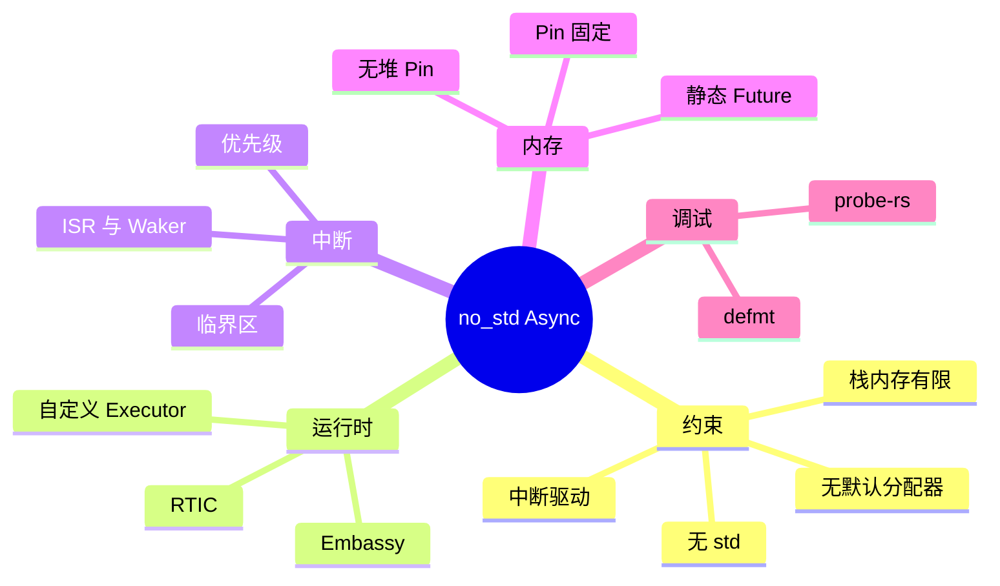
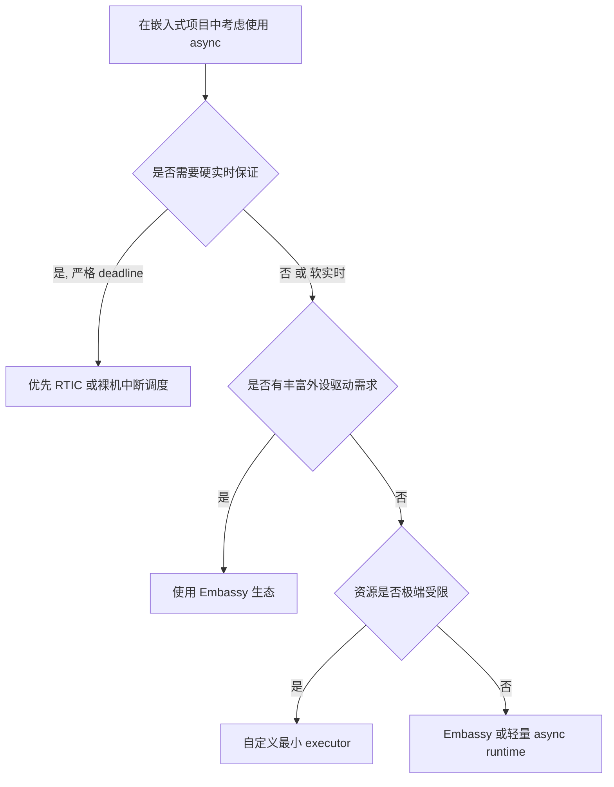

> **内容分级**: [专家级]
>
> **Rust 版本**: 1.97.0+ (Edition 2024)
> **本节关键术语**: no_std · embedded · async · embassy · rtic · interrupt · executor · 裸机 — [完整对照表](../../00_meta/01_terminology/01_terminology_glossary.md)

# 裸机与嵌入式中的 Async：no_std 异步运行时

> **EN**: Async in no_std and Embedded Systems
> **Summary**: Asynchronous Rust without the standard library: executor design, interrupt-driven futures, memory constraints, and the trade-offs between embassy, rtic, and custom executors on bare-metal devices.
> **受众**: [专家]
> **Bloom 层级**: L4-L5
> **权威来源**: 本文件为 `concept/` 权威页。
> **A/S/P 标记**: **P** — Procedure
> **双维定位**: P×Eva — 评判 no_std async 方案在资源约束下的适用性
> **定位**: 系统讲解在 `no_std`/嵌入式环境中使用 async Rust 的特殊约束：无堆分配、中断安全、自定义 executor、embassy 与 rtic 的架构差异，以及如何避免在裸机中触发 UB。
> **前置概念**: [Async/Await](../../03_advanced/01_async/01_async.md) · [Pin 与 Unpin](../../03_advanced/01_async/08_pin_unpin.md) · [Unsafe Rust](../../03_advanced/02_unsafe/01_unsafe.md) · [交叉编译](02_cross_compilation.md) · [Rust vs C](../../05_comparative/01_systems_languages/01_rust_vs_cpp.md)
> **后置概念**: [Async FFI Boundary](../../03_advanced/04_ffi/04_async_ffi_boundary.md) · [Async 中的 Unsafe](../../03_advanced/02_unsafe/08_async_in_unsafe_contexts.md)

---

> **来源**: [Embassy Book](https://embassy.dev/book/) · [RTIC Book](https://rtic.rs/2/book/en/) · [Rust Embedded Book](https://docs.rust-embedded.org/book/) · [RFC 2394 — async/await](https://rust-lang.github.io/rfcs/2394-async_await.html)

---

## 🧠 知识结构图



## 📑 目录

- [裸机与嵌入式中的 Async：no\_std 异步运行时](#裸机与嵌入式中的-asyncno_std-异步运行时)
  - [🧠 知识结构图](#-知识结构图)
  - [📑 目录](#-目录)
  - [一、权威定义](#一权威定义)
  - [二、no\_std async 的约束矩阵](#二no_std-async-的约束矩阵)
  - [三、执行器模型对比](#三执行器模型对比)
    - [3.1 Embassy 核心机制](#31-embassy-核心机制)
    - [3.2 RTIC 核心机制](#32-rtic-核心机制)
  - [四、中断与 Waker](#四中断与-waker)
    - [4.1 边界陈述](#41-边界陈述)
    - [4.2 关键契约](#42-关键契约)
    - [4.3 反例：在 ISR 中直接 await](#43-反例在-isr-中直接-await)
  - [五、内存管理](#五内存管理)
    - [5.1 静态 Future 与 Pin](#51-静态-future-与-pin)
    - [5.2 无堆 Pin](#52-无堆-pin)
  - [六、判定树](#六判定树)
  - [七、反例与失效模式](#七反例与失效模式)
  - [八、相关概念](#八相关概念)

---

## 一、权威定义

> **Rust Reference**: A crate can be marked `#![no_std]` to indicate it does not link against the standard library, but only the core crate.

**no_std async 定义**：在不允许依赖 `std`（因此无 `std::thread`、无默认堆分配器、无标准 I/O）的嵌入式/裸机环境中，使用 `Future` / `async` / `await` 进行协作式多任务调度。其本质是在单线程或有限中断优先级环境中，用一个**极简 executor** 轮询 Future。

---

## 二、no_std async 的约束矩阵

| 资源/特性 | 标准 async (std) | no_std async | 影响 |
|---|---|---|---|
| 线程模型 | 多线程 + work-stealing | 通常单线程/单核 | `Send`/`Sync` 要求可放宽 |
| 堆分配 | `Box::pin` 可用 | 优先静态/栈分配 | Future 必须静态固定 |
| 标准 I/O | `tokio::net` 等 | 外设 HAL + 自定义 driver | 需自己封装 Future |
| 时间/定时器 | `tokio::time` | 硬件定时器 + executor 集成 | 精度与功耗直接相关 |
| 错误处理（Error Handling） | `std::io::Error` | 自定义 error 类型 | 需显式设计错误枚举（Enum） |
| 调试 | `println!` / `tracing` | `defmt` / `rtt` | 日志格式与带宽受限 |

---

## 三、执行器模型对比

| 框架 | 调度模型 | 内存模型 | 适用场景 |
|---|---|---|---|
| **Embassy** | 协作式单线程 executor，可配置多核 | 静态任务、无堆也可运行 | 通用嵌入式 async，外设驱动丰富 |
| **RTIC** | 基于硬件优先级的任务调度，可混合 async | 静态资源、锁-free 设计 | 硬实时、中断密集型系统 |
| **自定义 executor** | 完全由用户实现 poll 循环 | 完全可控 | 极端资源约束或教学目的 |

### 3.1 Embassy 核心机制

```rust,ignore
#[embassy_executor::main]
async fn main(_spawner: Spawner) {
    let p = embassy_stm32::init(Default::default());
    let mut led = Output::new(p.PA5, Level::Low, Speed::Low);

    loop {
        led.set_high();
        Timer::after(Duration::from_millis(300)).await;
        led.set_low();
        Timer::after(Duration::from_millis(300)).await;
    }
}
```

### 3.2 RTIC 核心机制

RTIC 不强制使用 async，但支持 `async` task：

- 任务按硬件优先级调度；
- 通过 `lock` 机制管理共享资源；
- 更适合有严格截止时间的应用。

---

## 四、中断与 Waker

### 4.1 边界陈述

在裸机中，外设事件通常通过**中断服务例程（ISR）**通知。将中断接入 async 的标准模式：

1. Future 注册一个 waker 到全局/外设特定的 waker 槽；
2. ISR 触发时调用该 waker；
3. executor 重新 poll 对应 Future；
4. Future 从中断标志/外设寄存器读取结果。

### 4.2 关键契约

| 契约 | 说明 |
|---|---|
| ISR 不直接 poll | ISR 只调用 `wake`，避免在原子上下文中执行复杂逻辑 |
| Waker 存储安全 | 在临界区内读写 waker 槽，防止中断嵌套导致竞争 |
| 中断使能/禁用 | Future drop 或取消时必须禁用对应中断，避免唤醒已释放 Future |

### 4.3 反例：在 ISR 中直接 await

```rust,ignore
#[interrupt]
fn USART1() {
    // 错误：中断上下文中不能 await
    some_async_fn().await;
}
```

**修正**：ISR 只做最小化状态更新并调用 waker；异步（Async）逻辑在 task 中执行。

---

## 五、内存管理

### 5.1 静态 Future 与 Pin

no_std 环境中通常避免堆分配，Future 通过 `static` 或栈上固定：

```rust,ignore
use core::pin::Pin;
use embassy_executor::Spawner;

#[embassy_executor::main]
async fn main(spawner: Spawner) {
    static TASK: StaticCell<MyTask> = StaticCell::new();
    spawner.spawn(my_task(TAKE.init(MyTask::new()))).unwrap();
}
```

### 5.2 无堆 Pin

- 使用 `pin!` 宏（Macro）在栈上固定（Rust 1.68+，`core::pin::pin!`）；
- 使用 `StaticCell` 等 crate 在静态内存中固定；
- 禁止在 no_std 中手动 `Box::pin` 除非启用了自定义分配器。

---

## 六、判定树



---

## 七、反例与失效模式

| 失效模式 | 根因 | 修复方向 |
|---|---|---|
| 中断中直接 await | ISR 不是 task 上下文 | ISR 只做 wake |
| 堆分配导致 OOM | no_std 无默认分配器 | 使用静态 Future |
| Future 被移动后自引用（Reference）失效 | 未正确 Pin | 使用 StaticCell / pin! |
| 中断未禁用导致唤醒已释放任务 | Drop 中未清理中断 | 在 Drop 中禁用中断并注销 waker |
| `std` 类型意外引入 | 依赖未标记 no_std | 使用 `cargo nono` 等工具检查 |

---

## 八、相关概念

- [Async/Await](../../03_advanced/01_async/01_async.md)
- [Pin 与 Unpin](../../03_advanced/01_async/08_pin_unpin.md)
- [Unsafe Rust](../../03_advanced/02_unsafe/01_unsafe.md)
- [交叉编译](02_cross_compilation.md)
- [Async FFI Boundary](../../03_advanced/04_ffi/04_async_ffi_boundary.md)
- [Async 中的 Unsafe](../../03_advanced/02_unsafe/08_async_in_unsafe_contexts.md)

---

> **权威来源**: [Embassy Book](https://embassy.dev/book/) · [RTIC Book](https://rtic.rs/2/book/en/) · [Rust Embedded Book](https://docs.rust-embedded.org/book/)
