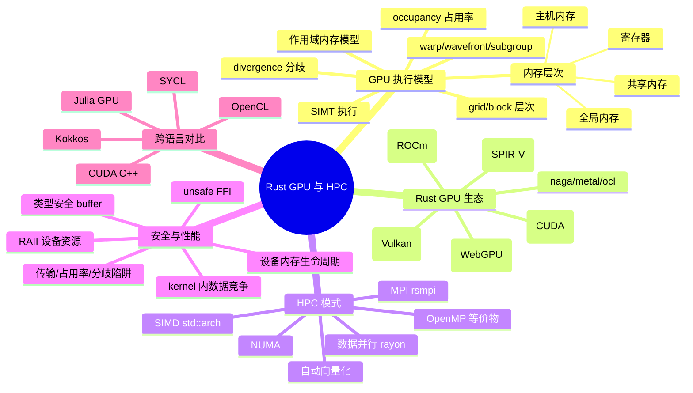

# Rust GPU 与高性能计算（GPU Programming & HPC）

> **EN**: GPU Programming and High-Performance Computing with Rust
> **Summary**: GPU execution models (SIMT, warps, blocks, memory hierarchy), the Rust GPU crate ecosystem (wgpu, rust-gpu, cust/accel, hip-sys, ash), HPC patterns (data parallelism, SIMD, NUMA, MPI), cross-language comparison with CUDA C++/SYCL/OpenCL/Kokkos/Julia, and the safety and performance boundaries of device-side Rust.

> **Rust 版本**: 1.97.0+ (Edition 2024)
> **Bloom 层级**: L6
> **权威来源**: 本文件为 `concept/` 权威页（Rust GPU 编程与 HPC 生态的唯一 consolidated 解释）。
> **受众**: [进阶]
> **内容分级**: [综述级]
> **A/S/P 标记**: **P** — Procedure（生态工程操作知识）
> **本节关键术语**: SIMT · warp · workgroup · occupancy · divergence · device memory · WGSL · SPIR-V · PTX — [完整对照表](../../00_meta/01_terminology/01_terminology_glossary.md)
> **前置概念**: [Systems and Embedded（嵌入式系统）](../05_systems_and_embedded/03_embedded_systems.md) · [Unsafe Rust](../../03_advanced/02_unsafe/01_unsafe.md) · [FFI](../../03_advanced/04_ffi/01_rust_ffi.md)
> **后置概念**: [Domain Applications（机器学习生态）](../11_domain_applications/13_machine_learning_ecosystem.md) · [Cross Compilation（交叉编译）](../05_systems_and_embedded/02_cross_compilation.md)

---

> **来源**: [wgpu 官方文档与源码](https://github.com/gfx-rs/wgpu) · [docs.rs/wgpu](https://docs.rs/wgpu) · [Rust-GPU 项目（rust-gpu Book）](https://rust-gpu.github.io/rust-gpu/book/) · [github.com/Rust-GPU/rust-gpu](https://github.com/Rust-GPU/rust-gpu) · [ash — Vulkan 绑定](https://github.com/ash-rs/ash) · [docs.rs/cust（CUDA Driver API）](https://docs.rs/cust) · [docs.rs/cudarc](https://docs.rs/cudarc) · [CUDA C++ Programming Guide](https://docs.nvidia.com/cuda/cuda-c-programming-guide/) · [CUDA C++ Best Practices Guide](https://docs.nvidia.com/cuda/cuda-c-best-practices-guide/) · [Vulkan Specification](https://registry.khronos.org/vulkan/specs/latest/html/vkspec.html) · [SPIR-V Specification](https://registry.khronos.org/SPIR-V/specs/unified1/SPIRV.html) · [WebGPU Specification（W3C）](https://www.w3.org/TR/webgpu/) · [WGSL Specification（W3C）](https://www.w3.org/TR/WGSL/) · [SYCL 2020 Specification](https://registry.khronos.org/SYCL/specs/sycl_2020/html/sycl-2020.html) · [OpenCL 3.0 Specification](https://registry.khronos.org/OpenCL/specs/3.0-unified/html/OpenCL_API.html) · [NVIDIA HPC 开发者门户](https://developer.nvidia.com/hpc) · [rustc book — nvptx64-nvidia-cuda target](https://doc.rust-lang.org/nightly/rustc/platform-support/nvptx64-nvidia-cuda.html)
> **国际权威来源**: **P0** [rustc book — Platform Support: nvptx64-nvidia-cuda](https://doc.rust-lang.org/nightly/rustc/platform-support/nvptx64-nvidia-cuda.html)（Rust 官方 CUDA 目标支持页；URL 含 doc.rust-lang.org 官方域） · **P1** [Lustig, Sahasrabuddhe & Giroux — A Formal Analysis of the NVIDIA PTX Memory Consistency Model（ASPLOS 2019）](https://dl.acm.org/doi/10.1145/3297858.3304043)（GPU 作用域内存模型的形式化基准文献） · [Herlihy & Shavit — The Art of Multiprocessor Programming（Morgan Kaufmann）](https://dl.acm.org/doi/book/10.5555/2385452)（内存一致性模型理论参照） · **P2** [Rust Blog — Raising the baseline for the nvptx64-nvidia-cuda target](https://blog.rust-lang.org/2026/05/01/nvptx-baseline-update/)（1.97 nvptx 基线调整官方公告；与本目录 [Target Tier 平台支持全景](10_target_tier_platform_support.md) 互链）

---

## 🧠 知识结构图



## 📑 目录

- [Rust GPU 与高性能计算（GPU Programming \& HPC）](#rust-gpu-与高性能计算gpu-programming--hpc)
  - [🧠 知识结构图](#-知识结构图)
  - [📑 目录](#-目录)
  - [一、核心概念](#一核心概念)
    - [1.1 权威定义](#11-权威定义)
    - [1.2 GPU 与 CPU 的设计哲学差异](#12-gpu-与-cpu-的设计哲学差异)
    - [1.3 Rust 切入 GPU 的三条技术路径](#13-rust-切入-gpu-的三条技术路径)
  - [二、GPU 执行模型](#二gpu-执行模型)
    - [2.1 SIMT 与执行层次：grid / block / warp](#21-simt-与执行层次grid--block--warp)
    - [2.2 术语对照：CUDA ↔ HIP ↔ WebGPU ↔ Metal](#22-术语对照cuda--hip--webgpu--metal)
    - [2.3 内存层次结构](#23-内存层次结构)
    - [2.4 占用率（Occupancy）与延迟隐藏](#24-占用率occupancy与延迟隐藏)
    - [2.5 分歧（Divergence）与独立线程调度](#25-分歧divergence与独立线程调度)
    - [2.6 同步与作用域内存模型](#26-同步与作用域内存模型)
  - [三、Rust GPU 生态](#三rust-gpu-生态)
    - [3.1 全景对比表](#31-全景对比表)
    - [3.2 wgpu：WebGPU 的 Rust 原生实现](#32-wgpuwebgpu-的-rust-原生实现)
    - [3.3 rust-gpu：Rust 源码直编 SPIR-V](#33-rust-gpurust-源码直编-spir-v)
    - [3.4 cust / cudarc / accel：CUDA 谱系](#34-cust--cudarc--accelcuda-谱系)
    - [3.5 hip-sys 与 ROCm](#35-hip-sys-与-rocm)
    - [3.6 ash：Vulkan 裸绑定](#36-ashvulkan-裸绑定)
    - [3.7 周边生态：naga / metal / ocl / nvptx 目标](#37-周边生态naga--metal--ocl--nvptx-目标)
  - [四、HPC 模式](#四hpc-模式)
    - [4.1 数据并行：rayon 与 grid-stride 思维](#41-数据并行rayon-与-grid-stride-思维)
    - [4.2 SIMD 与向量化](#42-simd-与向量化)
    - [4.3 NUMA 感知](#43-numa-感知)
    - [4.4 MPI：rsmpi](#44-mpirsmpi)
    - [4.5 OpenMP 构造的 Rust 等价物](#45-openmp-构造的-rust-等价物)
    - [4.6 GPU offload 工程模式](#46-gpu-offload-工程模式)
  - [五、安全与性能](#五安全与性能)
    - [5.1 安全挑战](#51-安全挑战)
    - [5.2 Rust 的独特优势](#52-rust-的独特优势)
    - [5.3 性能陷阱清单](#53-性能陷阱清单)
  - [六、跨语言对比](#六跨语言对比)
  - [七、反命题与边界分析](#七反命题与边界分析)
    - [7.1 反命题树](#71-反命题树)
    - [7.2 反例 1：裸指针设备缓冲不可跨线程共享（E0277）](#72-反例-1裸指针设备缓冲不可跨线程共享e0277)
    - [7.3 反例 2：Drop 设备缓冲 ≠ kernel 已完成](#73-反例-2drop-设备缓冲--kernel-已完成)
    - [7.4 反例 3：假设 warp 内 lockstep 执行](#74-反例-3假设-warp-内-lockstep-执行)
    - [7.5 反例 4：「GPU 必然更快」谬误](#75-反例-4gpu-必然更快谬误)
    - [7.6 选型判定表](#76-选型判定表)
  - [八、来源与延伸阅读](#八来源与延伸阅读)

---

## 一、核心概念

本节先澄清 GPGPU 与 HPC 的基本定位，再对比 CPU 和 GPU 的设计哲学差异，最后梳理 Rust 进入 GPU 领域的三条技术路径；后续 GPU 执行模型、生态选型与安全分析都建立在这些概念之上。

### 1.1 权威定义

> **CUDA C++ Programming Guide**: The GPU is specialized for highly parallel computations and therefore designed such that more transistors are devoted to data processing rather than data caching and flow control.

**GPGPU（通用图形处理器计算）定义**：将原本为图形渲染设计的 GPU 用作通用数据并行加速器——把同一 kernel（核函数）施加到大规模数据元素上，由数百到数万个轻量线程并发执行。**HPC（高性能计算）** 则是更大的伞概念：在单节点（多核 CPU + SIMD + GPU 加速器）与集群（MPI 互联的多节点）两个尺度上追求浮点吞吐与内存带宽的极限利用。

Rust 在该领域的角色可概括为一句话：**host 侧的安全编排者 + device 侧的新兴编译目标**。host 侧（CPU 代码）Rust 的所有权与类型系统可以直接生效；device 侧（kernel 代码）则取决于具体路径——wgpu/WGSL 提供 API 级验证，rust-gpu 把 Rust 类型检查延伸到 shader 内，而 cust/ash/hip-sys 等 FFI 路径则退化为 `unsafe` 薄封装（见 [Unsafe Rust](../../03_advanced/02_unsafe/01_unsafe.md) 与 [FFI](../../03_advanced/04_ffi/01_rust_ffi.md)）。

### 1.2 GPU 与 CPU 的设计哲学差异

| 维度 | CPU | GPU |
|---|---|---|
| 优化目标 | 单线程延迟（低 latency） | 吞吐（高 throughput） |
| 核心数 | 数核至百余核（复杂乱序核） | 数百至万余简化流水核 |
| 控制逻辑 | 大缓存、分支预测、乱序执行 | 控制逻辑占比小，靠海量线程隐藏延迟 |
| 内存带宽 | 双通道 DDR5 约 100 GB/s 量级 | HBM 可达数 TB/s 量级 |
| 并行粒度 | 线程级 + 指令级 | 数据级（SIMT）为主 |
| 典型并行规模 | 10¹–10² 线程 | 10⁴–10⁶ 线程 |

工程推论：GPU 不是「更快的 CPU」，而是一台**带宽换延迟**的机器。只有「足够规则、足够大规模、计算密度（FLOP/Byte）足够高」的问题才值得 offload——这是 §7.5 反例 4 的正面陈述。

### 1.3 Rust 切入 GPU 的三条技术路径

```text
路径 A：FFI 绑定（host 安全壳 + C ABI device API）
  Rust ──unsafe FFI──> CUDA Driver/Runtime (cust, cudarc)
                    ─> HIP Runtime        (hip-sys)
                    ─> Vulkan             (ash)
                    ─> OpenCL             (ocl, opencl3)
  kernel 语言：CUDA C++ / OpenCL C / GLSL（非 Rust）

路径 B：WebGPU 原生（安全 API + WGSL shader）
  Rust ──safe API──> wgpu ──> Vulkan/Metal/DX12/GL/WebGPU
  kernel 语言：WGSL（经 naga 翻译为各后端 shader IR）

路径 C：Rust 源码直编 device IR（kernel 也用 Rust 写）
  Rust ──rustc_codegen_spirv──> SPIR-V   (rust-gpu)
  Rust ──rustc nvptx 后端 ────> PTX      (accel, 历史项目; nvptx64 目标)
```

三条路径的「Rust 纯度」递增，但成熟度大致递减：路径 A 最成熟（直接复用厂商驱动栈），路径 C 最「Rust-native」（kernel 享受类型检查与 host/device 类型共享），但工具链约束最强。

---

## 二、GPU 执行模型

理解 GPU 程序的性能与安全边界，需要先掌握其执行层次、内存层次与同步语义；本节从 SIMT 模型出发，依次展开 grid/block/warp、内存层级、占用率、分歧与作用域内存模型，为后续评估各 Rust GPU crate 的抽象能力提供共同语言。

### 2.1 SIMT 与执行层次：grid / block / warp

GPU 采用 **SIMT（Single Instruction, Multiple Threads）** 模型：程序员按「标量线程」写 kernel，硬件把若干线程编为一组**锁步发射**的执行单位。

执行层次自底向上（以 CUDA 术语为基准）：

1. **线程（thread / invocation）**：kernel 的最小执行实例，拥有私有寄存器与程序计数器（Volta 起）。
2. **warp（NVIDIA，32 线程）/ wavefront（AMD，GCN/CDNA 为 64，RDNA 支持 wave32）/ subgroup（Vulkan/WebGPU，设备相关，常见 32 或 64）**：同一 warp 内的线程共享一条指令发射通路——同一周期执行同一指令（或经分歧机制串行化，见 §2.5）。
3. **线程块（thread block / CTA）/ workgroup**：调度到一个 SM（流式多处理器）/ CU（计算单元）上的线程集合，块内线程可通过**共享内存**与**块级 barrier** 协作。
4. **grid**：一次 kernel 启动的全部线程块；块之间**不可直接同步**（Cooperative Groups 的 grid.sync() 是受限例外），块间执行顺序不确定。

一个关键工程事实：**block 是资源分配单位，warp 是执行发射单位**。SM 上的寄存器堆与共享内存按 block 划分，而指令按 warp 发射；这两个粒度共同决定 §2.4 的占用率。

### 2.2 术语对照：CUDA ↔ HIP ↔ WebGPU ↔ Metal

| 概念 | CUDA | HIP (ROCm) | WebGPU / WGSL | Vulkan / SPIR-V | Metal |
|---|---|---|---|---|---|
| 单个线程 | thread | thread | invocation | invocation | thread |
| 锁步执行组 | warp (32) | wavefront (64/32) | subgroup | subgroup | simdgroup |
| 线程块 | thread block | thread block | workgroup | workgroup | threadgroup |
| 全局启动 | grid | grid | dispatch | dispatch | grid |
| 线程索引 | `threadIdx` | `hipThreadIdx_x` | `local_invocation_id` | `LocalInvocationId` | `thread_position_in_threadgroup` |
| 块索引 | `blockIdx` | `hipBlockIdx_x` | `workgroup_id` | `WorkgroupId` | `threadgroup_position_in_grid` |
| 块级 barrier | `__syncthreads()` | `__syncthreads()` | `workgroupBarrier()` | `OpControlBarrier` | `threadgroup_barrier()` |
| 共享内存 | `__shared__` | `__shared__` | `var<workgroup>` | `Workgroup` storage class | `threadgroup` 地址空间 |
| 全局内存 | `__device__` | `__device__` | `var<storage>` | `StorageBuffer` | `device` 地址空间 |

读表要点：HIP 与 CUDA 几乎逐字同构（这正是 hipify 工具链存在的原因）；WebGPU/Vulkan/Metal 的术语虽异，层次模型完全一致。**Rust 各 GPU crate 的差异本质上是「暴露哪个 API 的术语层」**——wgpu 暴露 WebGPU 术语，cust/hip-sys 暴露 CUDA/HIP 术语，ash 暴露 Vulkan 术语。

### 2.3 内存层次结构

| 层次 | 作用域 | 典型延迟（数量级） | 典型带宽/容量特征 | Rust/wgpu 侧对应 |
|---|---|---|---|---|
| 寄存器（Register） | 单线程私有 | 约 1 周期 | 每 SM 数十万字节；超标即 spill 到 local memory | 不可见（由编译器分配） |
| 共享内存 / L1（Shared / Workgroup） | block 内共享 | 数十周期 | 每 SM 数十至两百余 KB；分 bank，存在 bank conflict | WGSL `var<workgroup>`；CUDA `__shared__` |
| L2 缓存 | 整卡共享 | 百余至数百周期 | 数 MB 至数十 MB | 不可见 |
| 全局内存（Global / HBM / GDDR） | 整卡 + 跨 kernel | 数百周期 | 数 GB 至数十 GB；带宽 TB/s 量级 | wgpu `Buffer`（`STORAGE` 用途） |
| 主机内存（Host DRAM） | CPU 侧 | 经 PCIe/NVLink | PCIe Gen5 x16 约 64 GB/s 量级；NVLink 更高 | `Vec<T>` / staging buffer |

三条铁律：

1. **合并访问（coalescing）**：warp 内连续线程访问连续全局内存地址，硬件才能把 32 次访问合并成少量宽事务；散乱访问（gather/scatter）会把有效带宽砍掉一个数量级。
2. **数据结构上移**：热数据尽量从全局内存搬到共享内存（tiling / cache-blocking），从共享内存搬到寄存器。
3. **主机↔设备传输是悬崖**：§2.3 表中最后一行的带宽比全局内存低约两个数量级——见 §5.3 性能陷阱 P1 与 §7.5 反例 4。

### 2.4 占用率（Occupancy）与延迟隐藏

GPU 隐藏内存延迟的手段不是缓存与预测，而是**过度订阅**：每个 SM 同时驻留数十个 warp，一个 warp 等待内存时立刻切换到另一个就绪 warp。

```text
occupancy = 活跃 warp 数 / SM 最大可驻留 warp 数
```

占用率的三个常见瓶颈：

| 资源 | 约束机理 | 调优方向 |
|---|---|---|
| 每线程寄存器数 | 寄存器堆总量固定，线程用得多则驻留 warp 少 | 减小 kernel 活跃度窗口；`-maxrregcount` 类开关；拆 kernel |
| 每 block 共享内存 | 共享内存按 block 预留 | 减少 tile 尺寸；动态共享内存按需分配 |
| block 尺寸 | 过小（<64）浪费调度槽，过大降低调度弹性 | 经验起点 128–256 线程/block，再做参数扫描 |

**反直觉点**：100% occupancy 通常不是目标。延迟敏感型 kernel 在 25%–50% occupancy 即可打满带宽；盲目提高占用率反而可能因寄存器 spill 减速（CUDA Best Practices Guide 对 occupancy 章节的论述即此）。

### 2.5 分歧（Divergence）与独立线程调度

同一 warp 内线程走不同分支路径时，硬件对每条活跃路径**串行发射**并以掩码屏蔽不活跃线程——`if/else` 两侧都执行一遍：

```text
if (tid % 2 == 0) { path_a(); } else { path_b(); }
// warp 视角：先以半掩码执行 path_a，再以另一半掩码执行 path_b —— 时间≈两者之和
```

减轻分歧的惯用手法：按分支谓词对数据预排序/分区；把小分支改为无分支算术（`min`/`max`/select）；把分歧粒度提升到 warp 对齐的边界。

**架构变迁警示**：自 Volta（SM 7.0，恰为 Rust 1.97 nvptx64 目标的最低 SM，见 [Target Tier 平台支持全景](10_target_tier_platform_support.md)）起，NVIDIA 引入**独立线程调度（Independent Thread Scheduling）**——每个线程有独立 PC 与栈。warp 内「天然 lockstep」不再是语言语义的一部分：依赖「同 warp 隐式同步」的老代码（如不加 `__syncwarp()` 的 warp 内数据交换）在 Volta+ 上是未定义行为（详见 §7.4 反例 3）。

### 2.6 同步与作用域内存模型

GPU 的内存一致性比 CPU 更弱且**分层作用域化**。以 PTX 内存模型为基准（其形式化分析见 §八 Lustig et al., ASPLOS 2019）：

| 作用域（scope） | 含义 | 对应 CUDA/WebGPU 原语 |
|---|---|---|
| `.cta` | 仅 block 内可见有序 | `__syncthreads()`（执行 + 内存 fence） |
| `.cluster` | 线程块簇（Hopper 起） | cluster barrier |
| `.gpu` | 整卡可见有序 | `__threadfence()`、device-scope atomics |
| `.sys` | 跨 GPU + 主机可见有序 | `__threadfence_system()`、system-scope atomics |

工程含义：

- **barrier 有两种语义**：执行屏障（所有线程到达）+ 内存屏障（到达前的写对之后的读可见）。WebGPU 的 `workgroupBarrier()` 两者兼有；`storageBarrier()` 只有内存语义。
- **原子操作必须带作用域**：用 `.cta` 能解决的事用 `.sys` 是性能自杀；Rust 侧目前没有跨 kernel 的原子类型抽象——kernel 内原子由各 shader 语言（WGSL `atomic<T>`、CUDA `atomicAdd`）负责。
- **kernel 边界即隐式同步点**：同一 stream/queue 内，前一个 kernel 的写对后一个 kernel 可见（API 保证）；跨 stream 则需显式 event/semaphore。

与 Rust 内存模型（见 [原子操作与内存序](../../03_advanced/00_concurrency/06_atomics_and_memory_ordering.md)）的映射关系是开放问题：Rust/C++ 的 `Relaxed/Acquire/Release/SeqCst` 没有「作用域」维度，把 kernel 内并发映射到 Rust 抽象需要在 crate 层自行约定——这正是 §5.1 安全挑战 S4 的根源。

---

## 三、Rust GPU 生态

Rust 在 GPU 领域并非单一工具，而是由 wgpu、rust-gpu、cust/cudarc、hip-sys、ash 等 crate 组成的多层生态；本节先给出全景对比，再逐个剖析其抽象层级、安全边界与典型用法，帮助读者根据目标平台与团队约束选型。

### 3.1 全景对比表

| crate | 目标 API / IR | 抽象层级 | host 侧 unsafe 程度 | kernel 语言 | 维护状态（截至 1.97 时代） | 典型场景 |
|---|---|---|---|---|---|---|
| [wgpu](https://docs.rs/wgpu) | WebGPU → Vulkan/Metal/DX12/GL/WebGPU | 高（安全 API + 验证） | 几乎无（`unsafe` 仅限个别映射路径） | WGSL | 活跃（gfx-rs 社区；Firefox、Deno、Bevy 采用） | 跨平台 compute + 图形、ML 推理、可视化 |
| [rust-gpu](https://github.com/Rust-GPU/rust-gpu) | Rust 源码 → SPIR-V | 高（shader 也用 Rust） | host 侧取决于对接的图形/compute API | **Rust**（`spirv-std`，no_std） | 活跃（Embark 发起，社区续作；cargo-gpu 管理工具链） | shader 复用 Rust 类型、研究、渲染 |
| [cust](https://docs.rs/cust) | CUDA Driver API | 低-中（RAII 薄壳 + unsafe FFI） | 中（模块加载、launch 需 unsafe） | CUDA C++（nvcc 预编译）/ PTX | 低-中活跃（rustacuda 后继改名） | 既有 CUDA kernel 的 Rust 集成 |
| [cudarc](https://docs.rs/cudarc) | CUDA Runtime API + NVRTC | 中（安全壳为主） | 低 | CUDA C++（运行时 JIT） | 活跃 | ML/科学计算快速原型 |
| [accel](https://github.com/termoshtt/accel) | Rust 源码 → PTX（nvptx 后端） | 高 | 低 | **Rust** | 已归档（历史项目） | Rust→CUDA 的早期探索 |
| [hip-sys](https://docs.rs/hip-sys) 等 | HIP Runtime/Driver API | 低（sys 绑定） | 高 | CUDA/HIP C++ | 低活跃（按需选用） | AMD ROCm 平台移植 |
| [ash](https://github.com/ash-rs/ash) | Vulkan | 极低（1:1 裸绑定） | 高（几乎全 unsafe） | GLSL/HLSL→SPIR-V | 活跃 | 自研引擎、渲染器底层 |

选型一句话：**要安全跨平台选 wgpu；要 Rust 写 kernel 选 rust-gpu；要复用既有 CUDA 资产选 cust/cudarc；要极致控制选 ash**（详见 §7.6 判定表）。

### 3.2 wgpu：WebGPU 的 Rust 原生实现

[wgpu](https://github.com/gfx-rs/wgpu) 是 [WebGPU 规范（W3C）](https://www.w3.org/TR/webgpu/) 的 Rust 原生实现：同一份 Rust 代码通过不同后端跑在 Vulkan、Metal、DX12、OpenGL 与浏览器 WebGPU 之上（截至 2026-07，wgpu 已发布 25.x 系列，持续作为 Firefox、Deno、Bevy 的底层 GPU 抽象）。其设计要点：

- **类型安全的资源模型**：`Buffer` 携带 `BufferUsages` 位标志（`STORAGE`/`COPY_DST`/…），用途不匹配的绑定在 API 验证层直接报错；
- **命令编码器即顺序证明**：`CommandEncoder` 按调用顺序编码，借用规则保证编码期间资源不被并发篡改；
- **shader 用 WGSL**，经 [naga](https://github.com/gfx-rs/wgpu/tree/trunk/naga) 翻译到各后端 IR；WGSL 是强类型、无指针的 shader 语言，天然规避一类内存安全漏洞。

最小 compute 流水线（示意，`rust,ignore`——需 wgpu/bytemuck/pollster 依赖）：

```rust,ignore
use wgpu::util::DeviceExt;

async fn run() -> Result<(), Box<dyn std::error::Error>> {
    // 1. 适配器与设备：wgpu 按后端能力协商 limits/features
    let instance = wgpu::Instance::default();
    let adapter = instance
        .request_adapter(&wgpu::RequestAdapterOptions::default())
        .await
        .expect("no suitable GPU adapter");
    let (device, queue) = adapter
        .request_device(&wgpu::DeviceDescriptor::default())
        .await?;

    // 2. host 数据 → 类型安全 buffer（bytemuck 保证 Pod 布局）
    let input: Vec<f32> = (0..1024).map(|x| x as f32).collect();
    let storage = device.create_buffer_init(&wgpu::util::BufferInitDescriptor {
        label: Some("input"),
        contents: bytemuck::cast_slice(&input),
        usage: wgpu::BufferUsages::STORAGE | wgpu::BufferUsages::COPY_SRC,
    });
    let staging = device.create_buffer(&wgpu::BufferDescriptor {
        label: Some("staging"),
        size: (input.len() * 4) as u64,
        usage: wgpu::BufferUsages::MAP_READ | wgpu::BufferUsages::COPY_DST,
        mapped_at_creation: false,
    });

    // 3. WGSL compute shader 与管线
    let shader = device.create_shader_module(wgpu::include_wgsl!("square.wgsl"));
    let pipeline = device.create_compute_pipeline(&wgpu::ComputePipelineDescriptor {
        label: Some("square"),
        layout: None,
        module: &shader,
        entry_point: Some("main"),
        compilation_options: Default::default(),
        cache: None,
    });

    // 4. 编码 dispatch：workgroup 数 = ceil(N / 64)
    let mut encoder = device.create_command_encoder(&Default::default());
    {
        let mut pass = encoder.begin_compute_pass(&Default::default());
        pass.set_pipeline(&pipeline);
        pass.set_bind_group(0, &make_bind_group(&device, &pipeline, &storage), &[]);
        pass.dispatch_workgroups(1024 / 64, 1, 1);
    }
    encoder.copy_buffer_to_buffer(&storage, 0, &staging, 0, staging.size());
    queue.submit([encoder.finish()]);

    // 5. 异步映射读回（MapMode::Read 与 MAP_READ 用途不匹配会在验证层报错）
    let slice = staging.slice(..);
    slice.map_async(wgpu::MapMode::Read, |_| {});
    device.poll(wgpu::PollType::wait_indefinitely())?;
    let data: Vec<f32> = bytemuck::cast_slice(&slice.get_mapped_range()).to_vec();
    staging.unmap();
    Ok(())
}
```

配套 WGSL（`square.wgsl`）：

```wgsl
@group(0) @binding(0) var<storage, read_write> data: array<f32>;

@compute @workgroup_size(64)
fn main(@builtin(global_invocation_id) id: vec3<u32>) {
    let i = id.x;
    data[i] = data[i] * data[i];
}
```

注意 wgpu **只验证 host↔GPU 接口**（buffer 用途、绑定布局、同步）；kernel 内部（WGSL 代码）的正确性由 WGSL 类型系统与 naga 验证负责，与 Rust 类型系统无关——host 的 `f32` buffer 与 shader 的 `array<f32>` 布局一致性由 `bytemuck` 的 `Pod` 约束外加程序员对齐保证。

### 3.3 rust-gpu：Rust 源码直编 SPIR-V

[rust-gpu](https://github.com/Rust-GPU/rust-gpu)（[Book](https://rust-gpu.github.io/rust-gpu/book/)）走路径 C：通过自定义 codegen 后端 `rustc_codegen_spirv` 把 **Rust 源码直接编译为 SPIR-V**，kernel 用真正的 Rust 书写（no_std，经 `spirv-std` crate 提供 GPU 内建函数）。核心卖点：

- **host/device 类型共享**：同一个 `#[repr(C)]` 结构体 crate 可同时链接进 host 二进制与 shader，消除 §3.2 末尾的「布局手工对齐」问题；
- **kernel 过 rustc 类型检查**：借用检查、泛型单态化、`#[inline]` 全套可用；编译产物再经 `spirv-val`（[SPIR-V 规范](https://registry.khronos.org/SPIR-V/specs/unified1/SPIRV.html) 验证器）校验；
- **工具链约束**：后端与特定编译器版本绑定（由仓库 `rust-toolchain.toml` 固定，`cargo-gpu`/`spirv-builder` 自动管理对应工具链与后端构建）——这是路径 C 的普遍代价（本页 D5 白名单事由之一，工具链事实陈述）。

示意 shader crate（`rust,ignore`——需 spirv-std 与 rust-gpu 工具链）：

```rust,ignore
#![no_std]
// shader crate：由 spirv-builder 以 spirv-unknown-vulkan1.2 目标编译

use spirv_std::glam::{UVec3, Vec4};
use spirv_std::spirv;

#[spirv(compute(threads(64)))]
pub fn prefix_sum_chunk(
    #[spirv(global_invocation_id)] id: UVec3,
    #[spirv(storage_buffer, descriptor_set = 0, binding = 0)] data: &mut [u32],
    #[spirv(workgroup)] scratch: &mut [u32; 64], // block 级共享内存
) {
    let i = id.x as usize;
    scratch[(i % 64) as usize] = data[i];
    spirv_std::arch::workgroup_memory_barrier_sync_group();
    // …（省略扫描细节）block 内前缀和
    data[i] = scratch[(i % 64) as usize];
}

#[spirv(fragment)]
pub fn shade(output: &mut Vec4) {
    *output = Vec4::ONE; // 图形管线同样可用
}
```

边界提示：rust-gpu 目标是 Vulkan 生态（SPIR-V）；它**不是** CUDA 编译路径。要 NVIDIA PTX 须走路径 A（cust/cudarc + nvcc/NVRTC）或官方的 `nvptx64-nvidia-cuda` target（见 §3.7 与 [Target Tier 平台支持全景](10_target_tier_platform_support.md)，该目标 1.97 起最低 SM 7.0 / PTX ISA 7.0，且需 nightly 工具链 `-Z build-std=core`——工具链事实，与 Tier 页同源）。

### 3.4 cust / cudarc / accel：CUDA 谱系

NVIDIA 生态在 Rust 中的谱系按年代与抽象层级排列：

| crate | API 层 | 定位 |
|---|---|---|
| `rustacuda` | Driver API | 早期安全壳尝试，已归档 |
| [cust](https://docs.rs/cust) | Driver API | rustacuda 改名后继；`DeviceBuffer`/`Module`/`Stream` RAII 封装 + unsafe launch |
| [cudarc](https://docs.rs/cudarc) | Runtime API + NVRTC | 安全壳比例更高；运行时 JIT 编译 CUDA C 源码字符串；ML 社区常用 |
| [accel](https://github.com/termoshtt/accel) | Rust→PTX | 用 rustc nvptx 后端从 Rust 生成 PTX 的历史项目，已归档 |

cust 示意（`rust,ignore`——需 cust crate + CUDA Toolkit + nvcc 预编译 cubin）：

```rust,ignore
use cust::prelude::*;

fn main() -> Result<(), Box<dyn std::error::Error>> {
    cust::init(cust::CudaFlags::empty())?;
    let device = Device::get_device(0)?;
    let _ctx = Context::new(device)?;          // RAII：Drop 即 cuCtxDestroy

    // kernel 用 CUDA C++ 编写、nvcc 离线编译为 cubin：
    // extern "C" __global__ void saxpy(float a, const float* x, float* y, int n)
    //     { int i = blockIdx.x * blockDim.x + threadIdx.x;
    //       if (i < n) y[i] = a * x[i] + y[i]; }
    let module = Module::from_file("kernels.cubin")?;
    let stream = Stream::new(StreamFlags::NON_BLOCKING, None)?;

    let n = 1 << 20;
    let x = DeviceBuffer::from_slice(&vec![1.0f32; n])?; // RAII：Drop 即 cuMemFree
    let mut y = DeviceBuffer::from_slice(&vec![2.0f32; n])?;

    let grid = (n as u32).div_ceil(256);
    unsafe {
        // launch! 宏内部是 cuLaunchKernel FFI：类型/参数个数不被 Rust 检查
        launch!(module.saxpy<<<grid, 256, 0, stream>>>(
            2.0f32, x.as_device_ptr(), y.as_device_ptr(), n as i32
        ))?;
    }
    stream.synchronize()?;                       // host↔device 同步点
    let mut out = vec![0.0f32; n];
    y.copy_to(&mut out)?;
    assert!((out[7] - 4.0).abs() < 1e-6);
    Ok(())
}
```

关键观察：`launch!` 的参数列表穿过 C ABI，**rustc 无法校验参数个数与类型**——kernel 签名改了而 host 调用点忘改，是 CUDA FFI 最高发的事故源（§5.1 S1）。

### 3.5 hip-sys 与 ROCm

AMD 侧由 [HIP](https://rocm.docs.amd.com/projects/HIP/en/latest/) 提供与 CUDA 高度同构的 API（见 §2.2 对照表），`hipify` 工具可把 CUDA 源码机械翻译为 HIP。Rust 侧现状：

- `hip-sys` 及配套 `rocBLAS`/`hipBLAS` 等 `*-sys` 绑定提供 FFI 声明；抽象层级与 `cust` 之前的 `rustacuda` 时代相当——**绝大多数调用在 `unsafe` 块内**；
- 工程惯例：kernel 以 HIP C++ 编写（同一份源码经 `amdclang++` 编到 AMD、经 hipify+nvcc 编到 NVIDIA），Rust 只做 host 编排；
- 与 NVIDIA 路径的共用策略：把 kernel 资产维持在 CUDA/HIP 双语兼容子集内，host 侧用 trait 抽象 `Device`/`Stream`，按 target 条件编译 cust 或 hip-sys 后端。

### 3.6 ash：Vulkan 裸绑定

[ash](https://github.com/ash-rs/ash) 是 [Vulkan 规范](https://registry.khronos.org/vulkan/specs/latest/html/vkspec.html) 的 1:1 Rust 绑定：句柄类型 + C 函数指针表，**不附带 RAII 与验证**。它是「我要自己设计安全抽象」场景的起点（Bevy/自研引擎底层、wgpu 的 Vulkan 后端概念同层）。

```rust,ignore
// rust,ignore —— ash 语义示意：创建 compute pipeline 的最小骨架
use ash::{vk, Device};

fn make_pipeline(device: &Device, spv: &[u8]) -> vk::Pipeline {
    let module = unsafe {
        device.create_shader_module(
            &vk::ShaderModuleCreateInfo::default().code(bytemuck::cast_slice(spv)),
            None,
        )
    }
    .expect("shader module");
    let stage = vk::PipelineShaderStageCreateInfo::default()
        .stage(vk::ShaderStageFlags::COMPUTE)
        .module(module)
        .name(c"main");
    let set_layout = unsafe {
        device.create_descriptor_set_layout(&vk::DescriptorSetLayoutCreateInfo::default(), None)
    }
    .expect("set layout");
    let layout = unsafe {
        device.create_pipeline_layout(
            &vk::PipelineLayoutCreateInfo::default().set_layouts(&[set_layout]),
            None,
        )
    }
    .expect("pipeline layout");
    let pipelines = unsafe {
        device.create_compute_pipelines(
            vk::PipelineCache::null(),
            &[vk::ComputePipelineCreateInfo::default()
                .stage(stage)
                .layout(layout)],
            None,
        )
    }
    .expect("compute pipeline");
    pipelines[0]
}
```

与 wgpu 的对照恰是 Rust 安全分层的活教材：ash 把[Vulkan 规范](https://registry.khronos.org/vulkan/specs/latest/html/vkspec.html)的每一条「valid usage」规则都留给调用者；wgpu 则把这些规则编码进类型与运行时验证。**两者共享同一个 SPIR-V 生态**——rust-gpu 产出的 shader 可以直接喂给 ash 管线。

### 3.7 周边生态：naga / metal / ocl / nvptx 目标

- **naga**：gfx-rs 的 shader 翻译器（WGSL ↔ SPIR-V ↔ MSL ↔ HLSL ↔ GLSL），wgpu 内置；可作为库单独使用，做 shader 静态分析与跨 IR 迁移。
- **metal crate**：Apple Metal 的 Objective-C 绑定（host 侧），compute 与图形皆可；shader 语言为 MSL（C++14 子集）。
- **ocl / opencl3**：[OpenCL](https://registry.khronos.org/OpenCL/specs/3.0-unified/html/OpenCL_API.html) 绑定；OpenCL 3.0 把 2.x 特性降为可选，定位为「最终统一 API」，但工业重心已转向 CUDA/HIP/SYCL 与 WebGPU。
- **官方 nvptx64-nvidia-cuda target**：rustc 内置 LLVM NVPTX 后端（Tier 2、no_std），1.97 起最低 SM 7.0 / PTX ISA 7.0（[Rust Blog 公告](https://blog.rust-lang.org/2026/05/01/nvptx-baseline-update/)）；当前主要用于嵌入式 PTX 场景与 accel 类研究项目，详细约束见本目录 [Target Tier 平台支持全景](10_target_tier_platform_support.md)。

---

## 四、HPC 模式

GPU 只是 HPC 工具箱的一层。完整的 Rust HPC 图景按「节点内 → 节点间」组织：数据并行（rayon）→ 指令级并行（SIMD/向量化）→ 内存拓扑（NUMA）→ 加速器 offload（§三）→ 集群（MPI）。

### 4.1 数据并行：rayon 与 grid-stride 思维

CPU 侧数据并行的 Rust 惯用答案是 [rayon](https://docs.rs/rayon)：work-stealing 调度 + 并行迭代器，借用检查在编译期排除并行数据竞争（对照 [并发编程](../../03_advanced/00_concurrency/01_concurrency.md)）：

```rust,ignore
use rayon::prelude::*;

fn par_saxpy(a: f32, x: &[f32], y: &mut [f32]) {
    // par_iter_mut 与 par_iter 的交集约束由借用检查保证：
    // 若误写成 &y.par_iter() 与 par_iter_mut 共存，直接编译失败
    y.par_iter_mut()
        .zip(x.par_iter())
        .for_each(|(yi, xi)| *yi += a * xi);
}
```

同一种「按索引切分、无共享写」的思维在 GPU 上叫 **grid-stride loop**：kernel 内以 `for (i = global_id; i < n; i += grid_dim * block_dim)` 遍历，使固定规模的 grid 能处理任意 n。两者的共同本质是**把迭代空间剖分为互不重叠的分片**——Rust 的 `chunks_mut`/`par_chunks_mut` 与 CUDA 的 blockIdx 分区是同一模式在不同硬件上的投影。

### 4.2 SIMD 与向量化

Rust 的 SIMD 三条路径（按稳定度排序）：

1. **自动向量化**：LLVM 在 `opt-level >= 2` 默认开启；配合 `-C target-cpu=native` 或具体微架构名放宽指令集基线。最常见的阻碍是**边界检查**——`chunks_exact`/`chunks_exact_mut` 或迭代器组合可消除，使循环可向量化：

```rust,ignore
// 版本 A：逐元素索引，边界检查抑制向量化
fn dot_slow(a: &[f32], b: &[f32]) -> f32 {
    let mut s = 0.0;
    for i in 0..a.len() { s += a[i] * b[i]; } // 每次访问都检查 i < len
    s
}

// 版本 B：zip 迭代器，长度由类型层面配对，向量化友好
fn dot_fast(a: &[f32], b: &[f32]) -> f32 {
    a.iter().zip(b).map(|(x, y)| x * y).sum()
}
```

1. **`std::arch` 内建函数（stable）**：x86/x86_64 的 SSE/AVX/AVX2/AVX-512、AArch64 的 NEON 内建已稳定；配合 `is_x86_feature_detected!` 做运行时分发，`#[target_feature]`（1.86 起可用于安全 fn，见 [releases.rs](https://releases.rs/) 1.86 条目）声明编译期启用：

```rust,ignore
#[target_feature(enable = "avx2")]
fn sum_avx2(xs: &[f32]) -> f32 {
    #[cfg(target_arch = "x86_64")]
    unsafe {
        use std::arch::x86_64::*;
        let mut acc = _mm256_setzero_ps();
        for chunk in xs.chunks_exact(8) {
            let v = _mm256_loadu_ps(chunk.as_ptr());
            acc = _mm256_add_ps(acc, v);
        }
        let mut tmp = [0.0f32; 8];
        _mm256_storeu_ps(tmp.as_mut_ptr(), acc);
        tmp.iter().sum::<f32>() + xs.chunks_exact(8).remainder().iter().sum::<f32>()
    }
    #[cfg(not(target_arch = "x86_64"))]
    {
        xs.iter().sum()
    }
}
```

1. **`std::simd` 可移植 SIMD（截至 1.97 仍为 nightly-only，`#![feature(portable_simd)]`）**：跨架构的统一 `Simd<T, N>` 抽象，文档见 [std::simd](https://doc.rust-lang.org/nightly/std/simd/index.html)（工具链事实陈述，非稳定层依赖）。

GPU 视角的注脚：SIMT 与 SIMD 在编程模型上的差异是「显式线程 vs 显式向量」——WGSL/CUDA 的 `vec4<f32>`/`float4` 是线程内向量，而 warp 32 线程是跨线程「向量」。`std::simd` 的 `Simd<f32, 8>` 与 CUDA 线程内 `float4` 解决的是同一层问题。

### 4.3 NUMA 感知

多路服务器（双路 EPYC/Xeon 常见）的内存按插槽分区：本地节点带宽高、延迟低；跨节点经 UPI/xGMI 访问有明显惩罚。Linux 默认 **first-touch** 策略——首次写入某页的线程所在节点承载该页。Rust 工程实践：

- **线程亲和**：`core_affinity` crate 或 `sched_setaffinity` FFI 固定 worker 线程到本节点核；
- **拓扑发现**：`hwloc2` crate（hwloc C 库绑定）枚举 NUMA 节点/核/缓存层次；
- **first-touch 初始化**：并行初始化数据时让「将来使用它的线程」执行首次写——rayon 的 `par_iter_mut().for_each(|x| *x = init)` 天然满足，前提是后续计算沿用相同的分片划分；
- **GPU 亲和**：多 GPU 服务器的每张卡挂在一个 NUMA 节点下，host 缓冲与 device 应同节点（`nvidia-smi topo -m` 查看），否则传输跨节点再罚一次。

### 4.4 MPI：rsmpi

节点间并行的 Rust 方案是 [rsmpi（crate 名 `mpi`）](https://docs.rs/mpi)：对 MPI C API（[MPI Standard](https://www.mpi-forum.org/docs/)）的薄封装，API 形态借鉴 Boost.MPI 的对象化风格：

```rust,ignore
use mpi::traits::*;

fn main() {
    let universe = mpi::initialize().unwrap();
    let world = universe.world();
    let rank = world.rank() as usize;
    let size = world.size() as usize;

    // 每进程负责 [rank*n/size, (rank+1)*n/size) 分片
    let n = 1 << 20;
    let local: Vec<f64> = (0..n / size).map(|i| ((rank * n / size + i) as f64).sin()).collect();
    let local_sum: f64 = local.iter().sum();

    // allreduce：MPI_SUM 归约到所有进程
    let mut global_sum = 0.0f64;
    world.all_reduce_into(&local_sum, &mut global_sum, mpi::collective::SystemOperation::sum());
    if rank == 0 {
        println!("global sum ≈ {global_sum}");
    }
}
```

典型部署形态是 **MPI + X 混合**：MPI 管节点间，节点内用 rayon/GPU（每进程绑定本节点 GPU 与 NUMA 节点）。Rust 的所有权在此处同样生效——`mpi` 的 buffer 类型约束发送/接收缓冲不重叠、生命周期覆盖通信期。

### 4.5 OpenMP 构造的 Rust 等价物

Rust **没有** pragma 式并行指令（OpenMP 的 `#pragma omp parallel for` 依赖预处理器改写源码，与 Rust 宏/属性哲学不合）。逐构造对照：

| OpenMP 构造 | Rust 等价物 | 说明 |
|---|---|---|
| `#pragma omp parallel for` | `rayon` 的 `par_iter()` / `par_chunks_mut()` | work-stealing 替代静态调度；`par_chunks_mut(k)` ≈ `schedule(static, k)` |
| `reduction(+:x)` | `par_iter().map(..).reduce(..)` / `sum()` | rayon reduce 树形归约，浮点结合顺序同样不确定 |
| `#pragma omp sections` | `rayon::join(a, b)` / `scope` | 分叉-汇合 |
| `#pragma omp task` | `rayon::spawn` / crossbeam scope | 动态任务 |
| `#pragma omp atomic` / `critical` | `Atomic*` / `Mutex`（[原子操作与内存序](../../03_advanced/00_concurrency/06_atomics_and_memory_ordering.md)） | 编译期 Send/Sync 约束替代程序员的 clause 自律 |
| `omp target offload`（GPU） | wgpu / cust / cudarc（§三） | Rust 无统一 offload 指令，按 crate 显式编排 |
| OpenMP 运行时本身 | `openmp-sys` FFI 绑定（crates.io） | 遗留互操作场景 |

### 4.6 GPU offload 工程模式

把 §二、§三的知识组装成可复用的 host 编排模式：

```text
模式 1：批处理流水（overlap compute & transfer）
  for chunk in data.chunks(CHUNK) {
      stream_a: H2D(chunk_i) ──> kernel(chunk_i) ──> D2H(result_i)
      stream_b: H2D(chunk_{i+1})  // 与前一段 kernel 重叠
  }
  前提：pinned host buffer（cust 的 LockedBuffer / cudaHostAlloc），
        非阻塞 stream + event 同步。

模式 2：驻留计算（keep data resident）
  迭代型算法（CG、时间步进、训练）：一次 H2D，
  全部中间状态留在 device，仅最后 D2H 结果。

模式 3：grid-stride + 占用率扫描
  kernel 写 grid-stride 形式；block size ∈ {128, 256, 512} 参数扫描，
  以实测带宽/时间为目标而非 occupancy 百分比。
```

---

## 五、安全与性能

GPU 编程把 Rust 的安全边界从 host 代码延伸到设备内存、kernel 执行与异步 stream；本节先归纳四类安全挑战，再对照 Rust 相较 C/C++ 系路径的独特优势，最后列出八个常见性能陷阱，作为工程审阅与调优的速查清单。

### 5.1 安全挑战

GPU 场景把 Rust 的安全边界推到了四个 rustc 够不着的位置：

**S1. unsafe FFI 与签名漂移。** CUDA/HIP/OpenCL 的 launch 接口经 C ABI 传递裸指针与标量（§3.4），参数个数/类型错位不被任何编译器检查。缓解：把每个 kernel 的 launch 封进一个安全 Rust 函数，参数类型与 kernel 签名一一对应并集中维护；能走 NVRTC 时用断言在 JIT 后校验符号存在。

**S2. 设备内存生命周期与 stream 异步性。** `DeviceBuffer` 的 `Drop`（cust）只保证释放显存，**不保证在途 kernel 已读完它**——在非默认 stream 上 drop 后立即复用/读取 host 侧数据是经典 use-after-free 变体。正确的封装契约：拥有 buffer 的类型同时拥有它最后被提交的 stream，drop 前 `stream.synchronize()` 或记录 event 依赖（§7.3 反例 2 给出失效形态）。

**S3. 同步与 barrier 纪律。** block 内共享内存的读写必须配 `workgroupBarrier()`/`__syncthreads()`；漏配在多数输入下「看起来对」，只在特定调度交错下出错——与 CPU 数据竞争同构但更难复现。WGSL 在语言层强制 barrier 的一致性规则（divergence 内 barrier 是编译错误），CUDA C++ 则全靠程序员。

**S4. kernel 内数据竞争不在借用检查射程内。** Rust 的「无数据竞争」保证作用域是**单个 Rust 程序的线程语义**；kernel 提交给驱动后，数千线程在设备上并发读写同一块显存，借用检查不可见、不可执行。kernel 内竞态自由的证明责任落在：WGSL 类型规则（rust-gpu/wgpu 路径）、PTX/Vulkan 内存模型纪律（§2.6）、以及工程审查。[Lustig et al.（ASPLOS 2019）](https://dl.acm.org/doi/10.1145/3297858.3304043) 对 PTX 模型的形式化工作表明：即便厂商模型本身，也是在发布多年后才获得严格语义——应用层更没有侥幸空间。

### 5.2 Rust 的独特优势

| 优势 | 机理 | 对标生态 |
|---|---|---|
| 类型安全 buffer 生命周期 | wgpu：`BufferUsages` + 借用编码器 + Drop 释放；cust：`DeviceBuffer` RAII | C API 中 cudaMalloc/cudaFree 手工配对 |
| 设备资源的所有权树 | `Context → Module/Stream/Buffer` 的所有权层级与 Drop 顺序由类型系统执行 | SYCL buffer 用析构+host accessor 阻塞达成类似效果，但错误在运行期 |
| Send/Sync 编译期边界 | host 侧多线程共享 GPU 资源时，`Send`/`Sync` 约束在编译期拦截跨线程误用（§7.2 反例 1） | C/C++ 全靠 code review |
| host/device 类型共享 | rust-gpu：同一 `#[repr(C)]` 类型编译进两侧 | CUDA C++ 天然共享（同语言），Rust 在路径 C 上追平 |
| SPIR-V/WGSL 双重验证 | rust-gpu 产物过 `spirv-val`；wgpu 管线创建时 naga+驱动双重校验 | GLSL/HLSL 传统工具链验证更薄 |
| 无 GC 暂停 | 帧循环/高频 launch 路径无收集暂停 | Julia/C# 托管 GPU 生态的结构性差异 |

### 5.3 性能陷阱清单

| # | 陷阱 | 机理 | 对策 |
|---|---|---|---|
| P1 | host↔device 传输淹没收益 | PCIe 带宽比 HBM 低约两个数量级（§2.3） | 驻留计算模式；pinned buffer；传输与计算重叠；只在必要时回读 |
| P2 | 占用率误区 | 寄存器/共享内存约束；100% occupancy ≠ 最快（§2.4） | block size 参数扫描；以带宽利用率为目标指标 |
| P3 | warp 分歧 | 分支串行化（§2.5） | warp 对齐的分支边界；数据预排序；无分支算术 |
| P4 | 非合并访存 | warp 内散乱地址拆成多事务 | AoS→SoA 重排；`vec4` 对齐；共享内存中转 |
| P5 | kernel launch 开销 | 每次 launch 微秒级固定成本 | 批量提交；融合 kernel；persistent kernel 慎用 |
| P6 | 隐式同步 | 默认 stream 上的 D2H 拷贝会整卡同步 | 非默认 stream + event；显式依赖图 |
| P7 | 快速数学缺省关闭 | Rust 稳定版无 fast-math 开关，IEEE 严格 | 需要时手写近似或在 kernel 侧（CUDA `--use_fast_math`、WGSL 无此概念）处理 |
| P8 | 浮点归约顺序 | 并行归约改变加法结合顺序，结果非位级确定 | 文档化非确定性；需要位级一致时用固定顺序分段归约 |

> 与通用 CPU 性能工程（[性能优化](../10_performance/01_performance_optimization.md)）的衔接：测量先行（`nsys`/`nsight-compute`/wgpu timestamp query）、一次只改一个变量、保留基准回放数据。

---

## 六、跨语言对比

| 维度 | CUDA C++ | SYCL | OpenCL | Kokkos | Julia GPU | **Rust** |
|---|---|---|---|---|---|---|
| 标准化主体 | NVIDIA 专有 | Khronos 标准（[SYCL 2020](https://registry.khronos.org/SYCL/specs/sycl_2020/html/sycl-2020.html)） | Khronos 标准 | 开源库（[kokkos](https://github.com/kokkos/kokkos)） | 语言生态（CUDA.jl / AMDGPU.jl / KernelAbstractions.jl） | 社区 crate 生态 |
| 硬件覆盖 | NVIDIA | Intel/AMD/NVIDIA（经 DPC++、AdaptiveCpp 等实现） | 广泛（CPU/GPU/FPGA） | NVIDIA/AMD/Intel/CPU | NVIDIA/AMD/Intel/Apple | NVIDIA/AMD/Intel/Apple/Web（wgpu） |
| kernel 语言 | CUDA C++ | C++（单源码） | OpenCL C | C++（模板封装） | Julia（源到 PTX/SPIR-V，GPUCompiler.jl） | WGSL / CUDA C++ / **Rust**（rust-gpu） |
| 内存安全 | 无 | buffer/accessor 运行期检查 | 无 | View 运行期检查 | GC + 数组边界检查 | host 编译期 + API 验证；kernel 内视路径 |
| 依赖管理 | 手工/nvcc | 运行时 DAG（accessor 推导） | 手工 event | 执行空间抽象 | 自动（CuArray） | 显式 stream/queue（受所有权约束） |
| 学习曲线 | 中 | 中高 | 高 | 高 | 低 | 中高（wgpu 较低） |
| 成熟度（HPC 生产） | 极高 | 高（Intel 生态） | 中 | 高（美国国家实验室） | 中高（科研） | 成长中 |

逐条要点：

- **CUDA C++**：性能与工具链（Nsight、cuBLAS/cuDNN、Cooperative Groups）的事实基准。Rust 的正确策略不是「重写一切」，而是 §3.4 的 host 安全壳 + 复用厂商库（cublas-sys 类绑定）。
- **SYCL**：其 buffer/accessor 模型把「谁在读、谁在写」显式声明给运行时推导依赖 DAG——与 Rust 借用纪律在精神上高度同构（accessor 的 `read_only`/`write_only` ≈ `&T`/`&mut T`），只是检查发生在运行期。Rust 把它前移到编译期。
- **OpenCL**：可移植性最广但 API 最繁琐；工业重心已移向 SYCL（上层）与 Vulkan compute（下层）。Rust 侧 `ocl`/`opencl3` 可用但非主线。
- **Kokkos**：C++ 性能可移植模板库，execution space（CUDA/HIP/SYCL/OpenMP/Threads）+ memory space + `View`（带引用计数的数组句柄）。Rust 没有完全对标物；wgpu 是「API 层可移植」，Kokkos 是「源码层可移植」。
- **Julia GPU**：`CuArray` + `@cuda` 宏，kernel 从 Julia 源码经 GPUCompiler.jl/LLVM 生成 PTX——架构上与 rust-gpu（源到 SPIR-V）、accel（源到 PTX）同族，但 Julia 用 GC 与运行期类型换交互性。Rust 换来的是：无暂停、可嵌入、二进制可分发的确定性部署。

更宏观的宿主语言层对比见 L5 权威页 [Rust vs C++](../../05_comparative/01_systems_languages/01_rust_vs_cpp.md)（所有权、零成本抽象与 FFI 哲学的系统比较）。

**Rust 定位总结**：在「host 编排安全性」上严格优于所有 C/C++ 系路径；在「kernel 内安全」上 wgpu/WGSL 与 rust-gpu 处于第一梯队；在「库生态成熟度」（BLAS/FFT/求解器）上仍显著落后 CUDA C++——生产系统的主流形态是 **Rust host + 厂商库 kernel + 自研 kernel 按需** 的混合架构。

---

## 七、反命题与边界分析

本节拆解关于「Rust GPU 程序自动获得 Rust 全部安全保证」的常见误解，先以反命题树列出四个核心边界，再通过具体反例和选型判定表说明 kernel 内并发、设备内存生命周期、warp 同步假设与性能预期上的真实限制。

### 7.1 反命题树

```text
命题：「用 Rust 写 GPU 程序 = 获得了 Rust 的全部安全保证」
├─ 反命题 1：kernel 内并发不在借用检查射程内
│   └─ 证据：§5.1 S4；kernel 提交后经驱动调度，rustc 语义终止于 launch 边界
├─ 反命题 2：FFI 路径（cust/hip-sys/ash）的 host 壳仍是 unsafe 密集区
│   └─ 证据：§3.4 launch! 签名漂移；§3.6 ash 1:1 裸绑定
├─ 反命题 3：wgpu 的验证是 API 层运行期验证，不是编译期证明
│   └─ 证据：绑定布局不匹配、WGSL 语义错误均在 create_* 时报错而非编译失败
└─ 反命题 4：性能可移植 ≠ 性能达标
    └─ 证据：同一份 WGSL 在不同后端的 occupancy/分歧表现可差数倍（§5.3 P2/P3）
```

### 7.2 反例 1：裸指针设备缓冲不可跨线程共享（E0277）

直觉说法「GPU buffer 反正不在 host 内存里，线程间随便传」在 Rust 里直接编译失败——这正是 Send/Sync 边界替你把关的瞬间：

```rust,compile_fail,E0277
use std::thread;

fn main() {
    let mut data = vec![1.0f32; 8];
    // 模拟“设备缓冲区”裸指针：host 侧跨线程共享裸指针不被允许
    let device_ptr: *mut f32 = data.as_mut_ptr();
    thread::spawn(move || {
        unsafe { *device_ptr.add(0) = 42.0; }
    }).join().unwrap();
}
```

**实测错误**（rustc 1.97.0，`--edition 2024`）：`error[E0277]:`*mut f32`cannot be sent between threads safely`。

修复方向不是「加 unsafe 强行 Send」，而是把所有权收进类型：cust 的 `DeviceBuffer` 持有设备分配、按 `Send` 语义传递所有权；需要跨线程共享时用 `Arc<Mutex<…>>` 或 channel 移交。**编译器拦下的正是 CUDA C++ 里最常见的 host 侧竞态。**

### 7.3 反例 2：Drop 设备缓冲 ≠ kernel 已完成

```rust,ignore
// 失效形态（语义示意，cust 风格）：
{
    let buf = DeviceBuffer::from_slice(&input)?;
    unsafe { launch!(module.kernel<<<g, b, 0, stream>>>(buf.as_device_ptr()))?; }
    // stream 为 NON_BLOCKING：launch 立即返回，kernel 仍在设备上执行
} // ❌ buf 在此 drop → cuMemFree；在途 kernel 读到已释放显存 → UB（设备侧）
stream.synchronize()?;
```

正确契约（§5.1 S2）：buffer 的持有者须绑定其最后提交的 stream，drop 前同步；或以 event 记录依赖，推迟释放到 event 完成。wgpu 路径用「提交即借用结束 + 内部引用计数」把这类错误挡在 API 层——代价是放弃对释放时机的精确控制。

### 7.4 反例 3：假设 warp 内 lockstep 执行

```c
/* CUDA C 失效形态（历史代码常见）：
   依赖“同 warp 线程天然同步”交换数据，不加显式同步 */
__shared__ float t[32];
t[threadIdx.x] = x;
float neighbor = t[(threadIdx.x + 1) % 32];  // Volta 之前：碰巧正确
```

自 Volta 独立线程调度起（§2.5），同 warp 线程可有交错进度，上述代码是数据竞争。正确写法是 `__syncwarp()` 后再读，或改用 warp shuffle 内建（`__shfl_down_sync` 等带掩码版本）。对 Rust 的启示：**shader/kernel 语义随硬件代际演化**，WGSL/SPIR-V 把这类同步显式化（`subgroupShuffle` 类操作）是更稳的抽象。

### 7.5 反例 4：「GPU 必然更快」谬误

反例设定：对 1 MB 数据做一次 SAXPY（`y += a*x`，每元素 2 FLOP / 12 Byte 流量，算术强度 ≈ 0.17 FLOP/B，纯带宽受限）：

```text
CPU：1 MB 可驻留 L2/L3，单核向量化即达数十 GB/s 等效，总耗时微秒级
GPU：H2D 1 MB（PCIe ~50 μs）+ kernel（HBM 下 <10 μs）+ D2H 1 MB（~50 μs）
    → 传输 ≈ 10× 计算；净结果：比 CPU 慢一个数量级
```

判据：算术强度（FLOP/Byte）足够高、数据可驻留、问题规模足够大，三者缺一即留在 CPU。这正是 §4.6 模式 2 与 §5.3 P1 的量化形态。

### 7.6 选型判定表

```text
需要跨平台（Win/Linux/macOS/Web/移动）+ 安全 API
  → wgpu（§3.2）
需要 kernel 与 host 共享 Rust 类型、愿意接受固定工具链
  → rust-gpu（§3.3，目标 Vulkan/SPIR-V 生态）
已有 CUDA kernel 资产或 cuBLAS/cuDNN 依赖（NVIDIA 限定）
  → cust（Driver API 全控）或 cudarc（Runtime+NVRTC 快速迭代）（§3.4）
需要 AMD ROCm
  → hip-sys host 壳 + HIP C++ kernel；或 wgpu（其 Vulkan 后端覆盖 AMD）（§3.5）
需要极致控制/自研引擎底层
  → ash（§3.6；准备好自担 valid-usage 纪律）
只需要 CPU 并行
  → rayon（§4.1）+ std::arch SIMD（§4.2）——别上 GPU（§7.5）
集群尺度
  → MPI（rsmpi，§4.4）+ 上述节点内方案叠加
```

---

## 八、来源与延伸阅读

**官方与规范（一手语义来源）**：

- [CUDA C++ Programming Guide](https://docs.nvidia.com/cuda/cuda-c-programming-guide/) —— SIMT、内存层次、占用率与 API 语义的定义性文本
- [CUDA C++ Best Practices Guide](https://docs.nvidia.com/cuda/cuda-c-best-practices-guide/) —— §5.3 各陷阱的厂商口径
- [PTX ISA](https://docs.nvidia.com/cuda/parallel-thread-execution/) —— 作用域内存模型（`.cta/.gpu/.sys`）的规范出处
- [Vulkan Specification](https://registry.khronos.org/vulkan/specs/latest/html/vkspec.html) · [SPIR-V Specification](https://registry.khronos.org/SPIR-V/specs/unified1/SPIRV.html) —— ash/rust-gpu 路径的底层语义
- [WebGPU（W3C）](https://www.w3.org/TR/webgpu/) · [WGSL（W3C）](https://www.w3.org/TR/WGSL/) —— wgpu 行为的上位规范
- [OpenCL 3.0 API](https://registry.khronos.org/OpenCL/specs/3.0-unified/html/OpenCL_API.html) · [SYCL 2020](https://registry.khronos.org/SYCL/specs/sycl_2020/html/sycl-2020.html)
- [rustc book — nvptx64-nvidia-cuda](https://doc.rust-lang.org/nightly/rustc/platform-support/nvptx64-nvidia-cuda.html) —— Rust 官方 CUDA 目标（P0）
- [NVIDIA HPC 开发者门户](https://developer.nvidia.com/hpc) —— HPC 库与案例索引

**学术（语义与内存模型）**：

- [Lustig, Sahasrabuddhe & Giroux — A Formal Analysis of the NVIDIA PTX Memory Consistency Model, ASPLOS 2019](https://dl.acm.org/doi/10.1145/3297858.3304043) —— §2.6 与 §5.1 S4 的形式化依据（P1）
- [Herlihy & Shavit — The Art of Multiprocessor Programming](https://dl.acm.org/doi/book/10.5555/2385452) —— 一致性模型通用理论（P1）

**Rust 生态（crate 与项目）**：

- [wgpu（GitHub）](https://github.com/gfx-rs/wgpu) · [docs.rs/wgpu](https://docs.rs/wgpu) · [learn-wgpu 教程](https://sotrh.github.io/learn-wgpu/)
- [Rust-GPU：rust-gpu Book](https://rust-gpu.github.io/rust-gpu/book/) · [github.com/Rust-GPU/rust-gpu](https://github.com/Rust-GPU/rust-gpu)（Rust GPU 社区工作的中心仓库，含 cargo-gpu 工具链管理）
- [ash（GitHub）](https://github.com/ash-rs/ash) · [docs.rs/cust](https://docs.rs/cust) · [docs.rs/cudarc](https://docs.rs/cudarc) · [docs.rs/mpi（rsmpi）](https://docs.rs/mpi) · [docs.rs/rayon](https://docs.rs/rayon)
- [Rust Blog — Raising the baseline for the nvptx64-nvidia-cuda target](https://blog.rust-lang.org/2026/05/01/nvptx-baseline-update/)（P2）

**本库反链**：[嵌入式系统](03_embedded_systems.md) · [交叉编译](02_cross_compilation.md) · [Target Tier 平台支持全景](10_target_tier_platform_support.md) · [Unsafe Rust](../../03_advanced/02_unsafe/01_unsafe.md) · [FFI](../../03_advanced/04_ffi/01_rust_ffi.md) · [原子操作与内存序](../../03_advanced/00_concurrency/06_atomics_and_memory_ordering.md) · [并发编程](../../03_advanced/00_concurrency/01_concurrency.md) · [性能优化](../10_performance/01_performance_optimization.md) · [机器学习生态](../11_domain_applications/13_machine_learning_ecosystem.md) · [数值类型](../../01_foundation/02_type_system/03_numerics.md)

> **变更日志**:
>
> - v1.0 (2026-07-16): 初始创建——GPU 执行模型（SIMT/warp/内存层次/occupancy/divergence/作用域内存模型）、Rust GPU 生态（wgpu/rust-gpu/cust/cudarc/accel/hip-sys/ash/naga/metal/ocl/nvptx）、HPC 模式（rayon/SIMD/NUMA/MPI/OpenMP 等价物）、安全与性能、跨语言对比（CUDA C++/SYCL/OpenCL/Kokkos/Julia）、4 组反例与选型判定表
