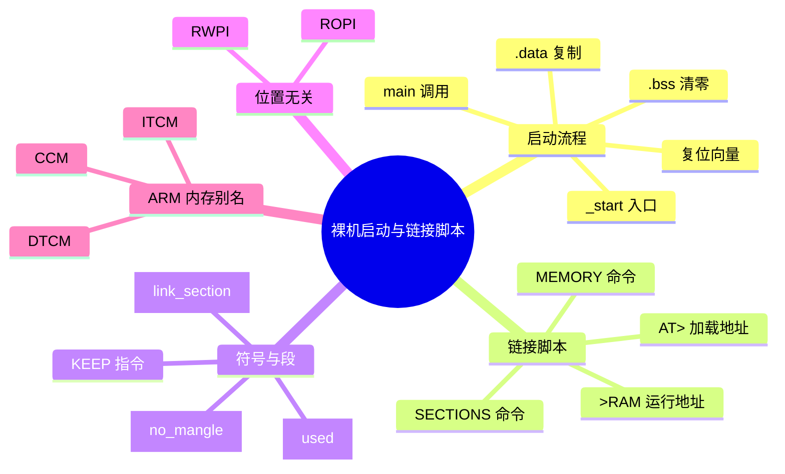
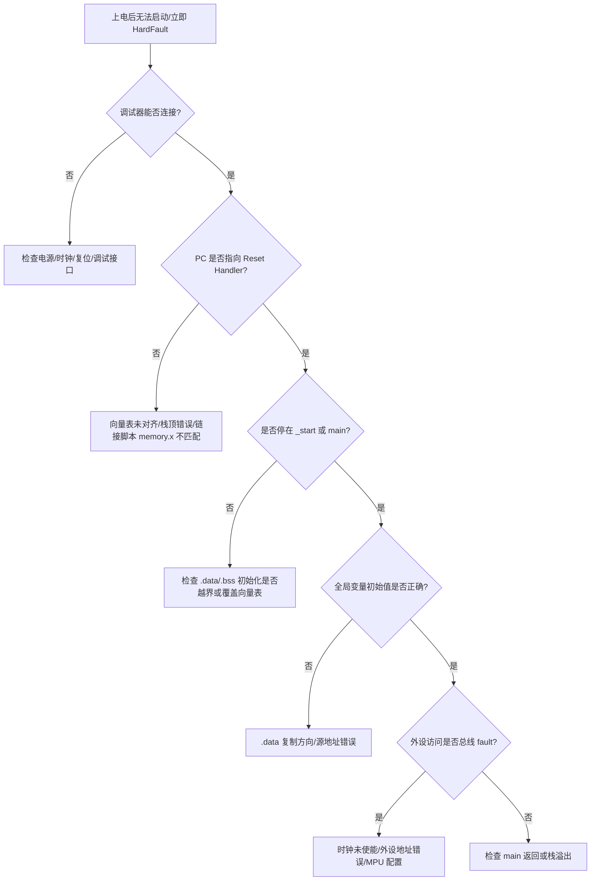

> **内容分级**: [专家级]
> **代码状态**: ⚠️ 裸机/目标平台相关代码标注 `rust,ignore`/`no_run`， host 平台无法直接编译
> **定理链**: N/A — 描述性/工程性文档
>
# 裸机启动与链接脚本
>
> **EN**: Bare-Metal Boot and Linker Scripts
> **Summary**: Bare-metal boot flow from reset vector to main: linker scripts, vector tables, `_start` initialization, `.data`/`.bss` setup, `#[link_section]`, `#[used]`, `#[no_mangle]`, and ARM memory aliases (CCM/DTCM/ITCM).
> **Rust 版本**: 1.97.0+ (Edition 2024)
>
> **受众**: [专家]
> **Bloom 层级**: L4
> **权威来源**: 本文件为 `concept/` 权威页。
> **A/S/P 标记**: **S+P** — Structure + Procedure
> **双维定位**: P×App — 在资源受限硬件上实现可启动固件
> **前置概念**: [Rust 嵌入式系统开发](03_embedded_systems.md) · [Unsafe Rust](../../03_advanced/02_unsafe/01_unsafe.md) · [交叉编译](02_cross_compilation.md) · [Cargo build-std](../01_cargo/22_build_std.md)
> **后置概念**: [Cortex-M 异常模型](14_interrupt_and_exception_model.md) · [panic_handler 与 no_std 运行时](18_panic_runtime_no_std.md) · [嵌入式内存分配器](16_embedded_memory_allocators.md)

---

> **来源**: [The Embedonomicon](https://docs.rust-embedded.org/embedonomicon/) · [The Embedded Rust Book](https://docs.rust-embedded.org/book/) · [ARMv7-M Architecture Reference Manual](https://developer.arm.com/documentation/ddi0403/latest/) · [ARMv8-M Architecture Reference Manual](https://developer.arm.com/documentation/ddi0553/latest/) · [cortex-m-rt](https://docs.rs/cortex-m-rt/) · [Ferrocene Language Specification](https://spec.ferrocene.dev/) · [A Survey of Rust Embedded Development (arXiv)](https://arxiv.org/abs/2311.05063)

---

## 🧠 知识结构图



## 📑 目录

- [裸机启动与链接脚本](#裸机启动与链接脚本)
  - [🧠 知识结构图](#-知识结构图)
  - [📑 目录](#-目录)
  - [一、权威定义](#一权威定义)
  - [二、启动流程：从复位到 main](#二启动流程从复位到-main)
    - [2.1 复位向量与向量表](#21-复位向量与向量表)
    - [2.2 `_start` 入口](#22-_start-入口)
    - [2.3 `.data` 复制与 `.bss` 清零](#23-data-复制与-bss-清零)
  - [三、链接脚本核心](#三链接脚本核心)
    - [3.1 `MEMORY` 命令](#31-memory-命令)
    - [3.2 `SECTIONS` 命令](#32-sections-命令)
    - [3.3 加载地址与运行地址分离](#33-加载地址与运行地址分离)
  - [四、Rust 段属性与链接器提示](#四rust-段属性与链接器提示)
    - [4.1 `#[link_section]`](#41-link_section)
    - [4.2 `#[used]`](#42-used)
    - [4.3 `#[no_mangle]` 与导出符号](#43-no_mangle-与导出符号)
  - [五、位置无关代码 ROPI/RWPI](#五位置无关代码-ropirwpi)
  - [六、ARM 特殊内存区域 CCM/DTCM/ITCM](#六arm-特殊内存区域-ccmdtcmitcm)
  - [七、反例与失效模式](#七反例与失效模式)
  - [八、边界测试](#八边界测试)
    - [8.1 边界测试：向量表未对齐（链接错误 / 启动崩溃）](#81-边界测试向量表未对齐链接错误--启动崩溃)
    - [8.2 边界测试：`.data` 复制源地址错误](#82-边界测试data-复制源地址错误)
    - [8.3 边界测试：CCM 上放 DMA 缓冲区（运行时静默错误）](#83-边界测试ccm-上放-dma-缓冲区运行时静默错误)
  - [九、链接属性与链接器指令矩阵](#九链接属性与链接器指令矩阵)
  - [十、决策树：启动失败诊断](#十决策树启动失败诊断)
  - [附录：Embedonomicon 映射](#附录embedonomicon-映射)
  - [十一、相关概念](#十一相关概念)
  - [🧭 思维导图（Mindmap）](#-思维导图mindmap)

---

## 一、权威定义

> **The Embedonomicon**: The linker script is the bridge between the compiler's output and the target device's memory layout. It tells the linker where each section of the program should be placed.

**裸机启动（bare-metal boot）**：在没有任何操作系统负责加载的前提下，由处理器硬件从固定复位向量地址取出初始 PC 与 SP，随后执行由运行时（runtime crate，如 `cortex-m-rt`）或用户提供的启动代码，完成栈初始化、RAM 区初始化、最终调用 `main` 的全过程。

**链接脚本（linker script）**：GNU ld / LLD 使用的文本脚本，通过 `MEMORY` 与 `SECTIONS` 命令描述目标地址空间的物理布局，把编译产物中的 `.text`、`.rodata`、`.data`、`.bss` 等 section 映射到 Flash 与 RAM。

判定依据：裸机固件能否正确启动，首先取决于链接脚本是否与实际芯片的内存映射一致；其次取决于启动代码是否正确完成 `.data` 复制和 `.bss` 清零。

---

## 二、启动流程：从复位到 main

### 2.1 复位向量与向量表

ARM Cortex-M 处理器上电后从地址 `0x0000_0000` 取初始 SP，从 `0x0000_0004` 取 Reset Handler 地址（LSB 置 1 表示 Thumb 状态）。向量表是可变大小的，最少包含前 16 个架构异常，之后是外设中断。

| 偏移 | 名称 | 说明 |
|:---|:---|:---|
| `0x0000_0000` | `_stack_top` | 主栈指针初始值（MSP） |
| `0x0000_0004` | `Reset` | 复位处理函数地址 |
| `0x0000_0008` | `NMI` | 不可屏蔽中断 |
| `0x0000_000C` | `HardFault` | 硬 fault |
| ... | 其他异常 | SVC/PendSV/SysTick 等 |
| `0x0000_0040+` | IRQ0..N | NVIC 外设中断 |

```rust,ignore
// cortex-m-rt 风格的向量表声明（目标平台代码）
#[no_mangle]
pub static __VECTORS: [unsafe extern "C" fn(); 16] = [
    __stack_top,      // 0x00: 初始 SP
    Reset,            // 0x04: Reset
    NMI,              // 0x08
    HardFault,        // 0x0C
    // 保留/默认处理
    DefaultHandler, DefaultHandler, DefaultHandler,
    DefaultHandler, DefaultHandler, DefaultHandler,
    SVC, DefaultHandler, DefaultHandler,
    PendSV, SysTick,  // 0x38, 0x3C
];
```

> **要点**：向量表必须按 256 字节（Cortex-M0 最小 128 字节）或 512 字节边界对齐；链接脚本中通常使用 `__vector_table_alignment` 并强制 `KEEP`。

### 2.2 `_start` 入口

`_start`（或 `Reset`）是复位后第一个执行的代码。它必须：

1. 初始化 MSP（某些启动文件假设硬件已做）；
2. 复制 `.data` 从 Flash 加载地址到 RAM 运行地址；
3. 清零 `.bss`；
4. 可选初始化 FPU、MPU、缓存；
5. 调用 `main`；
6. `main` 返回后进入无限循环或触发 fault。

```rust,ignore
// 目标平台启动代码示意（thumbv7m-none-eabi）
#[no_mangle]
pub unsafe extern "C" fn Reset() -> ! {
    extern "C" {
        static mut __sbss: u8;
        static mut __ebss: u8;
        static mut __sdata: u8;
        static mut __edata: u8;
        static __sidata: u8; // 加载地址
    }

    let count = &__ebss as *const u8 as usize - &__sbss as *const u8 as usize;
    core::ptr::write_bytes(&mut __sbss as *mut u8, 0, count);

    let count = &__edata as *const u8 as usize - &__sdata as *const u8 as usize;
    core::ptr::copy_nonoverlapping(&__sidata, &mut __sdata, count);

    extern "Rust" {
        fn main() -> !;
    }
    main()
}
```

> **安全说明**：启动代码运行于硬件复位后，中断默认禁用，因此上述裸指针操作虽然写在 `unsafe` 块中，但在正确链接脚本配合下是安全的；一旦进入 `main`，开发者需自行遵守 `no_std` 安全契约。

### 2.3 `.data` 复制与 `.bss` 清零

| Section | 内容 | 加载位置 | 运行位置 | 启动动作 |
|:---|:---|:---|:---|:---|
| `.text` | 代码/常量数据（常量可能在 `.rodata`） | Flash | Flash | 无需复制 |
| `.rodata` | 只读数据 | Flash | Flash | 无需复制 |
| `.data` | 已初始化全局/静态变量 | Flash | RAM | 复制 |
| `.bss` | 未初始化全局/静态变量 | 不占 Flash | RAM | 清零 |

判定依据：若 `.data` 未复制，全局变量初始值错误；若 `.bss` 未清零，依赖零初始化的静态变量将出现未定义值。两者都是最难调试的启动级 bug。

---

## 三、链接脚本核心

### 3.1 `MEMORY` 命令

`MEMORY` 命令声明目标芯片的物理地址空间。每行包含名称、属性、起始地址和长度。

```ld
/* memory.x — 以 STM32F407 为例 */
MEMORY
{
  /* Flash：只读、可执行 */
  FLASH (rx) : ORIGIN = 0x08000000, LENGTH = 1024K

  /* SRAM1：读写执行 */
  RAM (rwx) : ORIGIN = 0x20000000, LENGTH = 128K

  /* CCM RAM：仅数据，DMA 无法访问 */
  CCM (rw) : ORIGIN = 0x10000000, LENGTH = 64K
}
```

属性含义：

- `r`：可读
- `w`：可写
- `x`：可执行
- `a`：可分配（allocatable）

### 3.2 `SECTIONS` 命令

`SECTIONS` 描述输入 section 如何组合并放置到 `MEMORY` 中声明的区域。

```ld
/* link.x 片段 */
SECTIONS
{
  .text : {
    KEEP(*(.vector_table));
    *(.text .text.*);
    *(.rodata .rodata.*);
    _etext = .;
  } > FLASH

  .data : AT(_etext) {
    _sdata = .;
    *(.data .data.*);
    _edata = .;
  } > RAM

  .bss : {
    _sbss = .;
    *(.bss .bss.*);
    *(COMMON);
    _ebss = .;
  } > RAM

  _stack_top = ORIGIN(RAM) + LENGTH(RAM);
}
```

> **注意**：`KEEP(*(.vector_table))` 防止向量表 section 在 `--gc-sections` 下被链接器回收；`*(COMMON)` 收集 Fortran 风格的未初始化符号。

### 3.3 加载地址与运行地址分离

`.data` 在 Flash 中占空间（加载地址），但运行时必须在 RAM 中读写（运行地址）。LD 语法 `AT(_etext)` 指定加载地址，而 `> RAM` 指定运行地址。

启动代码需要符号：

- `_sdata` / `_edata`：`.data` 运行地址范围
- `_sidata`：`.data` 加载地址（需在脚本中显式计算）
- `_sbss` / `_ebss`：`.bss` 运行地址范围

```ld
_sidata = LOADADDR(.data);
```

判定依据：ARM 工具链与 GNU ld 的 `LOADADDR` 语义一致；LLD 也基本兼容，但自定义 target 需验证 `LOADADDR` 是否正确生成。

---

## 四、Rust 段属性与链接器提示

### 4.1 `#[link_section]`

`#[link_section = ".name"]` 把静态项放入指定 section，常用于向量表、启动标记、自定义 Flash 配置（如 nRF SoftDevice 的 `settings`、bootloader 标志）。

```rust,ignore
#[link_section = ".bootloader_version"]
#[used]
#[no_mangle]
static BOOTLOADER_VERSION: u32 = 0x0001_0002;
```

### 4.2 `#[used]`

在 `--gc-sections`（默认启用）下，未被引用的静态项会被链接器丢弃。`#[used]` 强制保留符号，避免向量表、panic 信息表、启动标记被 GC。

```rust,ignore
#[used]
static PANIC_MESSAGES: [u8; 256] = [0; 256];
```

> **边界**：LLVM 的 `#[used]` 实现会生成 `@llvm.used` / `@llvm.compiler.used`，确保符号不被丢弃；但 linker script 仍需 `KEEP` 来防止整个 section 被移除。

### 4.3 `#[no_mangle]` 与导出符号

启动代码、中断处理函数、C ABI 接口需要稳定的符号名，因此使用 `#[no_mangle]` 禁用 Rust name mangling。

```rust,ignore
#[no_mangle]
pub extern "C" fn _start() -> ! {
    loop {}
}
```

判定依据：`_start`、`Reset`、`DefaultHandler` 等符号名必须与链接脚本、启动文件、调试器期望一致；改名会导致链接失败或启动崩溃。

---

## 五、位置无关代码 ROPI/RWPI

| 模式 | 含义 | 适用场景 |
|:---|:---|:---|
| **ROPI**（Read-Only Position Independent） | 代码段可加载到任意地址运行 | bootloader、XIP、安全启动 |
| **RWPI**（Read-Write Position Independent） | 可写数据段可加载到任意地址 | 多段 RAM、动态重定位 |

Rust 编译器通过 `-C relocation-model=ropi` / `rwpi` 生成位置无关代码。注意：

- 全局指针初始化在 ROPI/RWPI 下需要链接时或运行时重定位；
- `static` 地址不能编译期常量化，需通过 GOT/PC-relative 访问；
- `cortex-m-rt` 默认使用 `static` relocation model，适合固定内存映射。

```rust,ignore
// .cargo/config.toml 示例
[target.thumbv7m-none-eabi]
rustflags = ["-C", "relocation-model=static"]
```

判定依据：需要 bootloader 链式加载或运行时可移动 firmware 时才启用 ROPI/RWPI；普通固定地址固件使用 `static` relocation model 可减少代码体积与复杂度。

---

## 六、ARM 特殊内存区域 CCM/DTCM/ITCM

| 区域 | 全称 | 特性 | Rust 使用场景 |
|:---|:---|:---|:---|
| **CCM** | Core-Coupled Memory | 与内核同频、DMA 通常不可访问 | 栈、关键数据结构、不允许 DMA 的缓冲区 |
| **DTCM** | Data Tightly-Coupled Memory | 低延迟数据访问 | 高频数据、中断上下文栈 |
| **ITCM** | Instruction Tightly-Coupled Memory | 低延迟指令访问 | 时间关键代码段、中断向量 |

链接脚本中把特定 section 放到这些区域：

```ld
MEMORY
{
  RAM (rwx) : ORIGIN = 0x20000000, LENGTH = 256K
  CCM (rw)  : ORIGIN = 0x10000000, LENGTH = 64K
}

SECTIONS
{
  .ccm_data (NOLOAD) : {
    *(.ccm .ccm.*);
  } > CCM
}
```

```rust,ignore
#[link_section = ".ccm_data"]
#[used]
static mut CCM_BUFFER: [u8; 4096] = [0; 4096];
```

> **注意**：若 CCM 不可被 DMA 访问，却把 DMA 缓冲区放在 `.ccm_data` 会导致静默数据错误；这是硬件手册必须确认的关键点。

---

## 七、反例与失效模式

| 失效模式 | 根因 | 修复方向 |
|:---|:---|:---|
| 上电后立即 HardFault | 栈顶未正确设置或向量表未对齐 | 检查 `__stack_top` 与向量表 `ALIGN` |
| 全局变量值错误 | `.data` 未复制或复制方向反了 | 确认 `_sidata`、`_sdata`、`_edata` 符号与启动代码 |
| `.bss` 未清零导致随机行为 | 启动代码遗漏清零或范围算错 | 使用链接器符号精确计算字节数 |
| `#[no_mangle]` 函数找不到 | 名字 mangling 未禁用或 section 被 GC | 加 `#[no_mangle]` 并在链接脚本 `KEEP` |
| 向量表被链接器回收 | 未使用 `KEEP` 或未加 `#[used]` | 链接脚本 `KEEP(*(.vector_table))` |
| DMA 读不到缓冲区数据 | 缓冲区放在 CCM 而 DMA 不能访问 CCM | 把 DMA 缓冲区放到普通 RAM |
| ROPI 固件崩溃 | 全局指针初始化依赖绝对地址 | 使用 PC-relative 访问或运行时重定位 |

---

## 八、边界测试

### 8.1 边界测试：向量表未对齐（链接错误 / 启动崩溃）

```rust,ignore
// ❌ 错误：向量表未按要求对齐
#[link_section = ".vector_table"]
static VT: [u32; 16] = [0; 16];
```

> **修正**：向量表需要 256 字节对齐；在链接脚本中：

```ld
.vector_table : {
    . = ALIGN(256);
    KEEP(*(.vector_table));
} > FLASH
```

### 8.2 边界测试：`.data` 复制源地址错误

```rust,ignore
// ❌ 错误：把运行地址当加载地址用
let count = ...;
core::ptr::copy_nonoverlapping(&__sdata, &mut __sdata, count);
```

> **修正**：源是 `_sidata`（Flash），目标是 `_sdata`（RAM）。

```rust,ignore
core::ptr::copy_nonoverlapping(&__sidata, &mut __sdata, count);
```

### 8.3 边界测试：CCM 上放 DMA 缓冲区（运行时静默错误）

```rust,ignore
// ❌ 错误：假设所有 RAM 都可被 DMA 访问
#[link_section = ".ccm_data"]
static DMA_BUF: [u8; 256] = [0; 256];
```

> **修正**：查阅参考手册确认 CCM/DTCM 的 DMA 可见性；把 DMA 缓冲区放到普通 SRAM section。

---

## 九、链接属性与链接器指令矩阵

| 属性 / 指令 | 作用对象 | 语义 | 裸机典型用途 | 注意 |
|:---|:---|:---|:---|:---|
| `#[no_mangle]` | 函数/静态项 | 禁用 Rust 符号名混淆 | `_start`、`Reset`、中断处理、C ABI | 不能与重载/泛型实例共享同名 |
| `#[export_name = "..."]` | 函数/静态项 | 显式指定链接符号名 | 向量表项、bootloader 链式加载 | 优先级高于 `#[no_mangle]` |
| `#[link_section = ".name"]` | 函数/静态项 | 放入指定 ELF section | 向量表、bootloader 版本、配置字 | section 必须在链接脚本中定义 |
| `#[used]` | 静态项 | 防止 LLVM 优化删除符号 | panic 信息表、启动标记 | 仍需链接脚本 `KEEP` 防止 section 被 GC |
| `#[used(linker)]`（nightly） | 静态项 | 强制链接器级别保留 | 同上 | 不需要 `KEEP` 配合 |
| `KEEP(...)` | 链接脚本 | 阻止 `--gc-sections` 回收 | 向量表、init 数组、启动标记 | 与 `#[used]` 互补 |
| `ALIGN(n)` | 链接脚本 | 按 n 字节对齐当前位置 | 向量表（256/512 字节）、DMA 缓冲区 | 对齐需与硬件要求一致 |
| `AT(_loadaddr)` | 链接脚本 | 设置 section 加载地址（LMA） | `.data` 在 Flash、运行在 RAM | 配合 `LOADADDR` 使用 |
| `LOADADDR(.data)` | 链接脚本 | 返回 section 的 LMA | 启动代码读取 `.data` 源地址 | LLD/GNU ld 语义基本一致 |
| `> RAM` / `> FLASH` | 链接脚本 | 设置 section 运行地址（VMA） | 代码/只读数据放 Flash，可写数据放 RAM | 必须与 `MEMORY` 命令中的区域名匹配 |

判定依据：属性决定“编译器输出什么符号”，链接器指令决定“符号放到哪里”。两者不一致是裸机启动失败的高发原因。

---

## 十、决策树：启动失败诊断



---

## 附录：Embedonomicon 映射

> [The Embedonomicon](https://docs.rust-embedded.org/embedonomicon/) 是 Rust Embedded Working Group 维护的裸机底层指南，专注于“如何从零构建一个可启动的 `#![no_std]` 程序”。本页内容与其核心主题对应如下：

| 本页主题 | Embedonomicon 核心内容 | 对应本页章节 |
|:---|:---|:---|
| 自定义 target 与 `build-std` | 创建 target JSON、选择链接器、启用 `build-std` | [八、`build-std` 与自定义 target JSON](23_no_std_and_bare_metal_idioms.md#八build-std-与自定义-target-json)（参见 [`no_std` 与裸机惯用法](23_no_std_and_bare_metal_idioms.md)） |
| 链接脚本与内存布局 | `MEMORY`、`SECTIONS`、`AT>`、LMA/VMA 分离、KEEP/ALIGN | [三、链接脚本核心](#三链接脚本核心) |
| 启动序列与 `_start` | 复位向量、`.data`/`.bss` 初始化、调用 `main` | [二、启动流程：从复位到 main](#二启动流程从复位到-main) |
| 自定义运行时 crate | `#[panic_handler]`、向量表、链接符号约定、位置无关代码 | [四、Rust 段属性与链接器提示](#四rust-段属性与链接器提示)、[五、位置无关代码 ROPI/RWPI](#五位置无关代码-ropirwpi) |

判定依据：当 `cortex-m-rt`/`riscv-rt` 的默认行为不满足需求时，Embedonomicon 是手写启动代码与链接脚本的首要权威；本页是其核心概念在 Rust 1.97 时代的精炼版与故障诊断补充。

> **来源**: [The Embedonomicon](https://docs.rust-embedded.org/embedonomicon/) · [The Embedded Rust Book](https://docs.rust-embedded.org/book/)

---

## 十一、相关概念

- [Cortex-M 异常模型](14_interrupt_and_exception_model.md)
- [panic_handler 与 no_std 运行时](18_panic_runtime_no_std.md)
- [嵌入式内存分配器](16_embedded_memory_allocators.md)
- [Cargo build-std](../01_cargo/22_build_std.md)
- [Unsafe Rust](../../03_advanced/02_unsafe/01_unsafe.md)
- [交叉编译](02_cross_compilation.md)
- [Rust vs Zig：系统编程的两种显式路径](../../05_comparative/01_systems_languages/06_rust_vs_zig.md)
- [嵌入式形式化内存模型](../../04_formal/14_embedded_semantics/01_embedded_formal_memory_model.md)
- [安全关键裸机 OS 与 Rust](../../06_ecosystem/05_systems_and_embedded/19_safety_critical_bare_metal_os.md)
- [`#![no_std]` 与裸机编程惯用法](23_no_std_and_bare_metal_idioms.md)

---

> **权威来源**: [The Embedonomicon](https://docs.rust-embedded.org/embedonomicon/) · [The Embedded Rust Book](https://docs.rust-embedded.org/book/) · [ARMv7-M Architecture Reference Manual](https://developer.arm.com/documentation/ddi0403/latest/) · [ARMv8-M Architecture Reference Manual](https://developer.arm.com/documentation/ddi0553/latest/) · [cortex-m-rt 文档](https://docs.rs/cortex-m-rt/) · [Ferrocene Language Specification](https://spec.ferrocene.dev/) · [GNU ld 手册](https://sourceware.org/binutils/docs/ld/)
>
> **权威来源对齐变更日志**: 2026-07-30 创建

**文档版本**: 1.0
**最后更新**: 2026-07-30
**状态**: ✅ 概念文件创建完成

---

## 🧭 思维导图（Mindmap）


> **认知功能**: 本 mindmap 从本页「裸机启动与链接脚本」的章节结构提炼，一级分支对应核心主题，叶子节点为关键子概念，可作为本页的快速导航与复习索引。
