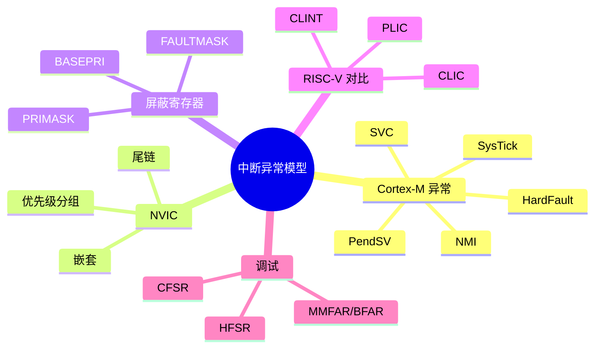

> **内容分级**: [专家级]
> **代码状态**: ⚠️ 裸机/目标平台相关代码标注 `rust,ignore`/`no_run`，host 平台无法直接编译
> **定理链**: N/A — 描述性/工程性文档
>
# Cortex-M 与 RISC-V 中断异常模型
>
> **EN**: Interrupt and Exception Model
> **Summary**: Cortex-M exception model (NMI, HardFault, SVC, PendSV, SysTick), NVIC/CLIC, BASEPRI/Primask, interrupt nesting, tail-chaining, fault register analysis, and a RISC-V interrupt controller comparison.
> **Rust 版本**: 1.97.0+ (Edition 2024)
>
> **受众**: [专家]
> **Bloom 层级**: L4
> **权威来源**: 本文件为 `concept/` 权威页。
> **A/S/P 标记**: **S** — Structure
> **双维定位**: P×Ana — 分析中断延迟与确定性行为
> **前置概念**: [Rust 嵌入式系统开发](03_embedded_systems.md) · [裸机启动与链接脚本](13_bare_metal_boot_linker_script.md) · [并发基础](../../03_advanced/00_concurrency/01_concurrency.md)
> **后置概念**: [no_std 同步原语](15_no_std_synchronization_primitives.md) · [PAC 与 HAL 实现](17_pac_hal_implementation.md) · [panic_handler 与 no_std 运行时](18_panic_runtime_no_std.md)

---

> **来源**: [ARMv7-M Architecture Reference Manual](https://developer.arm.com/documentation/ddi0403/latest/) · [ARMv8-M Architecture Reference Manual](https://developer.arm.com/documentation/ddi0553/latest/) · [RISC-V Privileged Spec](https://riscv.org/technical/specifications/) · [RISC-V CLIC Spec](https://github.com/riscv/riscv-fast-interrupt/blob/master/clic.adoc) · [cortex-m crate](https://docs.rs/cortex-m/) · [The Embedded Rust Book](https://docs.rust-embedded.org/book/) · [RTIC Book](https://rtic.rs/2/book/en/) · [Rust Atomics and Locks](https://marabos.nl/atomics/)

---

## 🧠 知识结构图



## 📑 目录

- [Cortex-M 与 RISC-V 中断异常模型](#cortex-m-与-risc-v-中断异常模型)
  - [🧠 知识结构图](#-知识结构图)
  - [📑 目录](#-目录)
  - [一、权威定义](#一权威定义)
  - [二、Cortex-M 异常表](#二cortex-m-异常表)
    - [关键异常详解](#关键异常详解)
  - [三、NVIC 与优先级](#三nvic-与优先级)
    - [3.1 优先级分组](#31-优先级分组)
    - [3.2 中断嵌套](#32-中断嵌套)
    - [3.3 尾链与 late-arrival](#33-尾链与-late-arrival)
  - [四、屏蔽寄存器](#四屏蔽寄存器)
    - [4.1 PRIMASK](#41-primask)
    - [4.2 BASEPRI](#42-basepri)
    - [4.3 FAULTMASK](#43-faultmask)
  - [五、RISC-V 中断控制器对比](#五risc-v-中断控制器对比)
  - [六、Fault 寄存器分析](#六fault-寄存器分析)
  - [七、Rust 中的中断处理](#七rust-中的中断处理)
  - [八、反例与失效模式](#八反例与失效模式)
  - [九、边界测试](#九边界测试)
    - [9.1 边界测试：中断中访问 `static mut`](#91-边界测试中断中访问-static-mut)
    - [9.2 边界测试：BASEPRI 临界区内触发低优先级中断](#92-边界测试basepri-临界区内触发低优先级中断)
  - [十、相关概念](#十相关概念)
  - [🧭 思维导图（Mindmap）](#-思维导图mindmap)

---

## 一、权威定义

> **ARMv7-M Architecture Reference Manual**: The Nested Vectored Interrupt Controller (NVIC) supports low-latency, nested, and vectored interrupts. Each interrupt has a programmable priority level and can be enabled or disabled independently.

**异常（Exception）**：打断正常指令流执行的事件，包括复位、NMI、HardFault、SVC、PendSV、SysTick 以及外设中断（IRQ）。在 Cortex-M 中，所有异常共享统一的向量表入口。

**中断（Interrupt）**：通常特指外设产生、经 NVIC 路由的异步异常，如定时器、UART、GPIO 中断。在 Rust 嵌入式中常通过 `#[interrupt]` 属性声明中断服务例程（ISR）。

判定依据：理解异常模型是设计可靠中断服务程序、临界区和实时调度的前提；错误配置优先级或屏蔽寄存器会导致优先级反转、死锁或不可接受的延迟。

---

## 二、Cortex-M 异常表

| 异常号 | 偏移 | 名称 | 说明 |
|:---|:---|:---|:---|
| 1 | 0x00 | Reset | 复位 |
| 2 | 0x04 | NMI | 不可屏蔽中断 |
| 3 | 0x08 | HardFault | 默认 fault 处理程序 |
| 4 | 0x0C | MemManage | 内存保护 fault（MPU） |
| 5 | 0x10 | BusFault | 总线错误 |
| 6 | 0x14 | UsageFault | 用法错误（未定义指令、除零等） |
| 7-10 | — | 保留 | — |
| 11 | 0x2C | SVCall | SVC 指令触发 |
| 12-13 | — | 保留 | — |
| 14 | 0x38 | PendSV | 可挂起的系统服务调用 |
| 15 | 0x3C | SysTick | 系统节拍定时器 |
| 16+ | 0x40+ | IRQ0..N | NVIC 外设中断 |

### 关键异常详解

- **NMI**：优先级仅次于 Reset，不可被屏蔽，常用于看门狗、电源故障。
- **HardFault**：当更高优先级 fault（MemManage/BusFault/UsageFault）被禁用或自身嵌套时进入的兜底处理程序。
- **SVC**：通过 `SVC #imm` 指令同步触发，常用于用户/特权模式切换或 RTOS 系统调用。
- **PendSV**：软件可挂起，典型用于 RTOS 上下文切换，延迟到所有高优先级中断完成后执行。
- **SysTick**：24 位递减定时器，常用于 RTOS 节拍或延时基准。

---

## 三、NVIC 与优先级

### 3.1 优先级分组

Cortex-M 使用可配置的优先级位数（4-8 位，取决于实现），数值越小优先级越高。优先级寄存器分为抢占优先级（preemption）和子优先级（subpriority）。

| 分组字段 | 抢占优先级位 | 子优先级位 | 含义 |
|:---|:---|:---|:---|
| PRIGROUP=0 | 7 位 | 1 位 | 128 级抢占，2 级子优先级 |
| PRIGROUP=3 | 4 位 | 4 位 | 16 级抢占，16 级子优先级 |
| PRIGROUP=7 | 0 位 | 8 位 | 无抢占，256 级子优先级 |

判定依据：子优先级只用于同抢占级内的轮询，不能打断同抢占级正在执行的 ISR；要实现真正的嵌套，必须设置不同的抢占优先级。

### 3.2 中断嵌套

当一个高抢占优先级中断在低优先级 ISR 执行期间到达时，硬件自动保存当前上下文并切换到高优先级 ISR。保存过程使用当前堆栈（MSP/PSP），Cortex-M 采用硬件 stacking 约 8 个寄存器（r0-r3、r12、lr、pc、xPSR）。

```rust,ignore
// cortex-m 包设置中断优先级示例
use cortex_m::peripheral::NVIC;
use cortex_m::interrupt::InterruptNumber;

unsafe { NVIC::unmask(USART1::IRQ) };
unsafe { (*NVIC::PTR).set_priority(USART1::IRQ, 3) };
```

### 3.3 尾链与 late-arrival

- **尾链（Tail-chaining）**：当一个 ISR 返回时，若存在挂起的高优先级中断，硬件不恢复主栈上下文，而是直接开始新 ISR，省约 12 个时钟周期。
- **Late-arrival**：若高优先级中断在正在压栈的低优先级中断到达时到达，硬件改压高优先级上下文，直接执行高优先级 ISR。

判定依据：尾链和 late-arrival 是 Cortex-M 低中断延迟的关键；实时系统需据此估算最坏情况中断延迟（WCL）。

---

## 四、屏蔽寄存器

| 寄存器 | 作用 | 使用场景 |
|:---|:---|:---|
| **PRIMASK** | 屏蔽除 NMI/HardFault 外的所有可配置优先级异常 | 单核临界区 |
| **BASEPRI** | 屏蔽优先级低于某阈值的中断 | 嵌套系统中只屏蔽低优先级中断，允许高优先级实时中断 |
| **FAULTMASK** | 屏蔽除 NMI 外的所有 fault | 调试或错误恢复 |

### 4.1 PRIMASK

```rust,ignore
use cortex_m::interrupt;

interrupt::free(|_| {
    // 此处中断被全局禁用
    critical_operation();
});
// 退出时自动恢复 PRIMASK
```

### 4.2 BASEPRI

```rust,ignore
// 仅屏蔽优先级数值 >= 4 的中断
unsafe { cortex_m::register::basepri::write(4 << 4) }
// 高优先级中断（数值 < 4）仍可抢占
```

> **注意**：退出临界区时必须正确恢复 BASEPRI，否则会导致高优先级中断被永久屏蔽。

### 4.3 FAULTMASK

```rust,ignore
// 屏蔽所有 fault（保留 NMI）
unsafe { cortex_m::register::faultmask::set() }
```

判定依据：`critical_section` crate 默认在 Cortex-M 上使用 PRIMASK/BASEPRI 实现；RTIC 利用 BASEPRI 实现优先级天花板协议。

---

## 五、RISC-V 中断控制器对比

| 特性 | Cortex-M NVIC | RISC-V CLINT/PLIC | RISC-V CLIC |
|:---|:---|:---|:---|
| 架构 | 内核集成 | 平台级外部 | 平台级，低延迟扩展 |
| 中断数 | 1-240+（实现相关） | PLIC 支持 1023 个 | 实现相关 |
| 嵌套 | 硬件嵌套 | 软件处理 | 硬件嵌套 |
| 向量表 | 固定地址向量表 | 默认统一入口 | 可选向量表 |
| 优先级 | 每个异常可编程 | PLIC 每个中断可编程 | 每个中断可编程 |
| 尾链 | 硬件支持 | 不支持 | 支持 |
| 当前 Rust 支持 | `cortex-m` / `cortex-m-rt` | `riscv-rt` / `riscv` crate | 实验性 |

判定依据：RISC-V 裸机 Rust 生态目前主要依赖 CLINT（Timer/Software interrupt）+ PLIC（外部中断）；CLIC 提供更接近 NVIC 的硬件特性，但硬件普及率和工具链成熟度仍在发展中。

---

## 六、Fault 寄存器分析

Cortex-M 提供一套 Configurable Fault Status Registers（CFSR）用于定位 fault 原因。

| 寄存器 | 全称 | 用途 |
|:---|:---|:---|
| `CFSR` | Configurable Fault Status Register | 聚合 MemManage/BusFault/UsageFault 状态 |
| `MMSR` | MemManage Fault Status Register | MPU 访问违规、不可执行区域执行等 |
| `BFSR` | BusFault Status Register | 总线错误、精确/非精确错误 |
| `UFSR` | UsageFault Status Register | 未定义指令、非法状态、除零、未对齐访问 |
| `HFSR` | HardFault Status Register | 强制 HardFault 原因 |
| `MMFAR` | MemManage Fault Address Register | 触发 MemManage 的地址 |
| `BFAR` | BusFault Address Register | 触发 BusFault 的地址 |

```rust,ignore
use cortex_m::peripheral::SCB;

fn print_fault_status() {
    let cfsr = SCB::cfsr();
    if cfsr & SCB::CFSR_MMFSR_Msk != 0 {
        // MemManage fault
        let mmfar = SCB::mmfar();
    }
    if cfsr & SCB::CFSR_BFARVALID_Msk != 0 {
        let bfar = SCB::bfar();
    }
}
```

判定依据：HardFault handler 中读取 CFSR/HFSR/MMFAR/BFAR 是定位启动崩溃、堆栈溢出、NULL 指针解引用等问题的标准调试手段。

---

## 七、Rust 中的中断处理

使用 `cortex-m-rt` + `cortex-m` 时，中断服务程序通过 `#[interrupt]` 属性绑定到 NVIC 中断号。

```rust,ignore
use cortex_m::peripheral::NVIC;
use stm32f4xx_hal::pac::TIM2;

#[interrupt]
fn TIM2() {
    // 清除中断标志、处理事件
    unsafe { (*TIM2::ptr()).sr.modify(|_, w| w.uif().clear_bit()) }
}

fn enable_tim2_irq() {
    unsafe { NVIC::unmask(TIM2::IRQ) };
}
```

> **关键契约**：ISR 应尽量短小；共享数据需用临界区、原子类型或 RTIC 资源保护；ISR 中不能 `await` 或阻塞。

---

## 八、反例与失效模式

| 失效模式 | 根因 | 修复方向 |
|:---|:---|:---|
| 中断永远不触发 | NVIC 未使能或优先级分组错误 | 调用 `NVIC::unmask` 并检查优先级 |
| HardFault 在中断中 | 栈溢出、未初始化外设、MPU 违规 | 增大栈、检查外设时钟、读 CFSR |
| 高优先级中断丢失 | 被同抢占级 ISR 长时间阻塞 | 降低低优先级任务工作量或提高优先级 |
| 优先级反转 | 低优先级任务持有高优先级任务需要的资源 | 使用优先级天花板或 RTIC |
| BASEPRI 未恢复 | 临界区退出代码路径遗漏 | 使用 `interrupt::free` RAII 封装 |
| 在 ISR 中使用 `alloc` | 中断上下文无分配器或分配器不可重入 | 预先分配静态缓冲区 |

---

## 九、边界测试

### 9.1 边界测试：中断中访问 `static mut`

```rust,compile_fail
#![no_std]

static mut COUNTER: u32 = 0;

#[no_mangle]
unsafe extern "C" fn TIM2() {
    // ❌ Rust 2024 Edition：`static_mut_refs` 为硬错误
    COUNTER += 1;
}
```

> **修正**：使用 `AtomicU32` 或 `critical_section::Mutex<RefCell<u32>>`。

```rust,ignore
use core::sync::atomic::{AtomicU32, Ordering};

static COUNTER: AtomicU32 = AtomicU32::new(0);

#[interrupt]
fn TIM2() {
    COUNTER.fetch_add(1, Ordering::Relaxed);
}
```

### 9.2 边界测试：BASEPRI 临界区内触发低优先级中断

```rust,ignore
// ❌ 错误：在 BASEPRI=4 临界区内调用可能触发低优先级中断的操作
unsafe { cortex_m::register::basepri::write(4 << 4) }
// 假设某操作 pend 了一个优先级为 5 的中断
// 该中断被屏蔽，直到 BASEPRI 恢复，可能违反实时约束
```

> **修正**：根据实时需求选择 PRIMASK（全关）或 BASEPRI（只关低于阈值）；在 BASEPRI 临界区内避免 pend 被屏蔽的中断。

---

## 十、相关概念

- [裸机启动与链接脚本](13_bare_metal_boot_linker_script.md)
- [no_std 同步原语](15_no_std_synchronization_primitives.md)
- [PAC 与 HAL 实现](17_pac_hal_implementation.md)
- [panic_handler 与 no_std 运行时](18_panic_runtime_no_std.md)
- [并发基础](../../03_advanced/00_concurrency/01_concurrency.md)
- [RTIC 框架](03_embedded_systems.md)

---

> **权威来源**: [ARMv7-M Architecture Reference Manual](https://developer.arm.com/documentation/ddi0403/latest/) · [ARMv8-M Architecture Reference Manual](https://developer.arm.com/documentation/ddi0553/latest/) · [RISC-V Privileged Spec](https://riscv.org/technical/specifications/) · [RISC-V CLIC Spec](https://github.com/riscv/riscv-fast-interrupt/blob/master/clic.adoc) · [cortex-m crate](https://docs.rs/cortex-m/) · [The Embedded Rust Book](https://docs.rust-embedded.org/book/) · [RTIC Book](https://rtic.rs/2/book/en/) · [Rust Atomics and Locks](https://marabos.nl/atomics/)
>
> **权威来源对齐变更日志**: 2026-07-30 创建

**文档版本**: 1.0
**最后更新**: 2026-07-30
**状态**: ✅ 概念文件创建完成

---

## 🧭 思维导图（Mindmap）


> **认知功能**: 本 mindmap 从本页「Cortex-M 与 RISC-V 中断异常模型」的章节结构提炼，一级分支对应核心主题，叶子节点为关键子概念，可作为本页的快速导航与复习索引。
