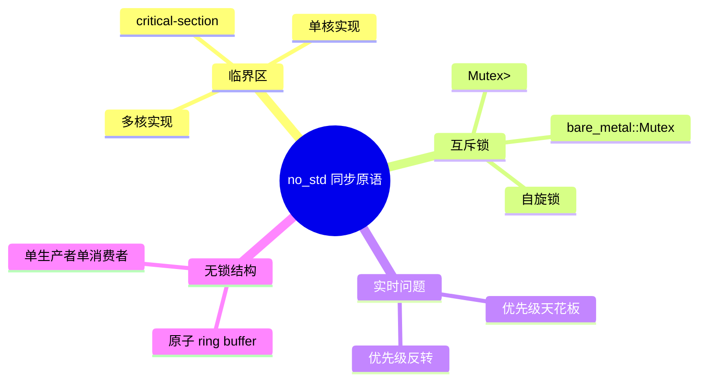
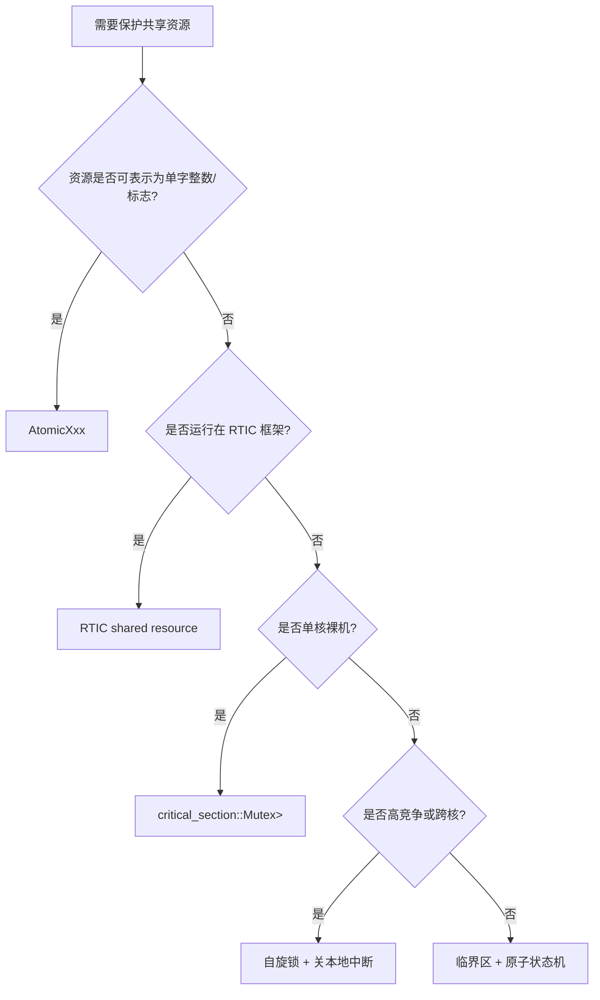

> **内容分级**: [专家级]
> **代码状态**: ⚠️ 裸机/目标平台相关代码标注 `rust,ignore`/`no_run`，host 平台无法直接编译
> **定理链**: N/A — 描述性/工程性文档
>
# no_std 同步原语
>
> **EN**: no_std Synchronization Primitives
> **Summary**: Synchronization in bare-metal no_std: critical-section single/multi-core implementations, Mutex<RefCell<T>>, spinlocks, bare_metal::Mutex, priority ceiling, priority inversion, and lock-free ring buffers.
> **Rust 版本**: 1.97.0+ (Edition 2024)
>
> **受众**: [专家]
> **Bloom 层级**: L4
> **权威来源**: 本文件为 `concept/` 权威页。
> **A/S/P 标记**: **S+P** — Structure + Procedure
> **双维定位**: P×Eva — 评估不同 no_std 同步策略的适用性
> **前置概念**: [Cortex-M 异常模型](14_interrupt_and_exception_model.md) · [并发基础](../../03_advanced/00_concurrency/01_concurrency.md) · [原子操作](../../03_advanced/00_concurrency/06_atomics_and_memory_ordering.md)
> **后置概念**: [PAC 与 HAL 实现](17_pac_hal_implementation.md) · [嵌入式内存分配器](16_embedded_memory_allocators.md) · [自定义裸机异步执行器](28_custom_bare_metal_async_executor.md) · [嵌入式形式化内存模型](../../04_formal/14_embedded_semantics/01_embedded_formal_memory_model.md)

---

> **来源**: [critical-section crate](https://docs.rs/critical-section/) · [cortex-m crate](https://docs.rs/cortex-m/) · [bare-metal crate](https://docs.rs/bare-metal/) · [Rust Atomics and Locks](https://marabos.nl/atomics/) · [The Embedded Rust Book](https://docs.rust-embedded.org/book/) · [RTIC Book](https://rtic.rs/2/book/en/) · [spin crate](https://docs.rs/spin/) · [Michael & Scott — Simple, Fast, and Practical Non-Blocking and Blocking Concurrent Queue Algorithms (ACM)](https://dl.acm.org/doi/10.1145/248052.248106) · [Herlihy — Wait-Free Synchronization (ACM)](https://dl.acm.org/doi/10.1145/114005.102808)

---

## 🧠 知识结构图



## 📑 目录

- [no\_std 同步原语](#no_std-同步原语)
  - [🧠 知识结构图](#-知识结构图)
  - [📑 目录](#-目录)
  - [一、权威定义](#一权威定义)
  - [二、临界区与 `critical-section`](#二临界区与-critical-section)
    - [2.1 单核实现](#21-单核实现)
    - [2.2 多核实现](#22-多核实现)
  - [三、`Mutex<RefCell<T>>` 模式](#三mutexrefcellt-模式)
  - [四、自旋锁](#四自旋锁)
  - [五、`bare_metal::Mutex`](#五bare_metalmutex)
  - [六、优先级天花板与优先级反转](#六优先级天花板与优先级反转)
    - [6.1 优先级天花板](#61-优先级天花板)
    - [6.2 优先级反转](#62-优先级反转)
  - [七、无锁 ring buffer](#七无锁-ring-buffer)
  - [八、反例与失效模式](#八反例与失效模式)
  - [九、边界测试](#九边界测试)
    - [9.1 边界测试：在单核裸机中使用自旋锁（死锁）](#91-边界测试在单核裸机中使用自旋锁死锁)
    - [9.2 边界测试：临界区内调用可能阻塞的操作](#92-边界测试临界区内调用可能阻塞的操作)
  - [十、no\_std 同步原语属性矩阵](#十no_std-同步原语属性矩阵)
  - [十一、同步策略决策树](#十一同步策略决策树)
  - [十二、相关概念](#十二相关概念)
  - [🧭 思维导图（Mindmap）](#-思维导图mindmap)

---

## 一、权威定义

> **Rust Atomics and Locks**: In bare-metal systems without an operating system, disabling interrupts is often the only way to implement a critical section on a single-core processor.

**临界区（Critical Section）**：一段访问共享资源的代码，执行期间必须保证不被并发上下文打断。在单核裸机中，通常通过关中断实现；在多核或对称多处理（SMP）裸机中，需要自旋锁或原子操作。

**no_std 同步原语**：在禁用标准库、没有 OS 调度器的环境中提供的并发保护机制，包括关中断临界区、自旋锁、原子类型和无锁数据结构。

判定依据：裸机中没有操作系统提供的互斥量或信号量，同步必须依赖硬件提供的原子指令和中断控制；错误选择会导致数据竞争、死锁或实时性失效。

---

## 二、临界区与 `critical-section`

[critical-section](https://docs.rs/critical-section/) 是 Rust embedded 生态的事实标准临界区抽象。它定义了一个 trait `CriticalSection`，由具体目标平台提供实现，应用代码通过 `with` 获取临界区 token。

```rust,ignore
use critical_section::with;

static COUNTER: critical_section::Mutex<RefCell<u32>> =
    critical_section::Mutex::new(RefCell::new(0));

fn increment() {
    with(|cs| {
        *COUNTER.borrow(cs).borrow_mut() += 1;
    });
}
```

### 2.1 单核实现

在单核 Cortex-M 上，`critical-section` 默认使用 `cortex_m::interrupt::free`，即通过 `cpsid i` / `cpsie i` 控制 PRIMASK。

```rust,ignore
// critical-section 单核实现示意
unsafe impl critical_section::Impl for SingleCore {
    unsafe fn acquire() -> RawRestoreState {
        let primask = cortex_m::register::primask::read();
        cortex_m::interrupt::disable();
        primask.is_active()
    }

    unsafe fn release(token: RawRestoreState) {
        if token {
            cortex_m::interrupt::enable();
        }
    }
}
```

### 2.2 多核实现

在多核 Cortex-M（如 Cortex-M55 dual-core）或 RISC-V SMP 上，仅关中断不够，因为另一个核仍在运行。需要：

- 使用全局自旋锁保护 `critical_section` 实现；
- 或使用特定核间中断（IPI）实现全核临界区。

```rust,ignore
// 多核示意：先获取自旋锁，再关本地中断
unsafe impl critical_section::Impl for MultiCore {
    unsafe fn acquire() -> RawRestoreState {
        GLOBAL_SPINLOCK.lock();
        let primask = cortex_m::register::primask::read();
        cortex_m::interrupt::disable();
        primask.is_active()
    }

    unsafe fn release(token: RawRestoreState) {
        if token {
            cortex_m::interrupt::enable();
        }
        GLOBAL_SPINLOCK.unlock();
    }
}
```

判定依据：单核项目误用多核实现会增加不必要的开销；多核项目仅关单核中断会导致跨核数据竞争。

---

## 三、`Mutex<RefCell<T>>` 模式

`critical_section::Mutex` 不是传统阻塞锁，它只是一个 token 门；内部通常配合 `RefCell<T>` 提供运行时借用检查。

```rust,ignore
use core::cell::RefCell;
use critical_section::Mutex;

static SHARED: Mutex<RefCell<Option<u32>>> = Mutex::new(RefCell::new(None));

fn set_value(v: u32) {
    critical_section::with(|cs| {
        *SHARED.borrow(cs).borrow_mut() = Some(v);
    });
}

fn get_value() -> Option<u32> {
    critical_section::with(|cs| *SHARED.borrow(cs).borrow())
}
```

> **要点**：该模式把 Rust 的编译期借用检查转换为运行时借用检查，适合中断与主循环共享的非 `Sync` 数据；如果已在临界区内，再嵌套调用不会死锁。

---

## 四、自旋锁

自旋锁通过原子变量忙等待获取锁，不依赖 OS 调度，常用于多核 bare-metal 或早期启动阶段。

```rust,ignore
#![no_std]

use core::sync::atomic::{AtomicBool, Ordering};
use core::hint::spin_loop;

pub struct SpinLock {
    locked: AtomicBool,
}

impl SpinLock {
    pub const fn new() -> Self {
        Self { locked: AtomicBool::new(false) }
    }

    pub fn lock(&self) {
        while self.locked.compare_exchange_weak(
            false, true,
            Ordering::Acquire,
            Ordering::Relaxed,
        ).is_err() {
            spin_loop();
        }
    }

    pub unsafe fn unlock(&self) {
        self.locked.store(false, Ordering::Release);
    }
}
```

判定依据：单核裸机中不应使用自旋锁，因为持锁线程被中断打断后，ISR 若再次尝试获取同一把锁会死锁；自旋锁仅适用于多核或中断不会重入同一把锁的场景。

---

## 五、`bare_metal::Mutex`

`bare_metal::Mutex` 是早期 embedded 生态使用的临界区包装，现已逐渐被 `critical-section::Mutex` 取代。它的设计依赖一个全局的临界区实现，API 与 `critical-section` 类似。

```rust,ignore
use bare_metal::Mutex;
use core::cell::RefCell;

static FOO: Mutex<RefCell<u32>> = Mutex::new(RefCell::new(0));

interrupt::free(|cs| {
    *FOO.borrow(cs).borrow_mut() = 42;
});
```

判定依据：新项目优先使用 `critical-section`，因为它有明确的多核路线图和更广泛的 HAL/BSP 支持；`bare_metal::Mutex` 主要用于维护旧代码。

---

## 六、优先级天花板与优先级反转

### 6.1 优先级天花板

**优先级天花板（Priority Ceiling）**：当任务/中断获取某个资源时，临时提升到访问该资源的所有任务中的最高优先级。这样低优先级任务持锁时不会被中等优先级任务抢占，从而避免优先级反转。

RTIC 在编译期为每个资源计算天花板优先级，并在运行时通过 BASEPRI 自动提升。

```rust,ignore
#[rtic::app(device = stm32f4::stm32f407)]
mod app {
    #[shared]
    struct Shared {
        counter: u32,
    }

    #[task(binds = TIM2, priority = 1, shared = [counter])]
    fn tick(mut cx: tick::Context) {
        cx.shared.counter.lock(|c| *c += 1); // 自动提升优先级
    }
}
```

### 6.2 优先级反转

**优先级反转（Priority Inversion）**：高优先级任务等待低优先级任务持有的资源，而中等优先级任务又抢占了低优先级任务，导致高优先级任务被间接阻塞。

在裸机中常见的诱因：

- 主循环（低优先级）持有 `Mutex`，被高优先级 ISR 抢占后 ISR 等待同一 `Mutex`；
- 临界区过长，阻塞了高优先级中断。

修复方向：

1. 缩短临界区；
2. 使用优先级天花板；
3. 使用无锁数据结构；
4. 避免在 ISR 中与主循环争用需要长时间持有的资源。

---

## 七、无锁 ring buffer

单生产者单消费者（SPSC）ring buffer 可以用原子索引实现，无需临界区，适合中断与主循环之间的高效数据传递。

```rust,ignore
#![no_std]

use core::sync::atomic::{AtomicUsize, Ordering};

const N: usize = 16;

pub struct SpscRing<T, const N: usize> {
    buffer: [T; N],
    head: AtomicUsize,
    tail: AtomicUsize,
}

impl<T: Copy + Default, const N: usize> SpscRing<T, N> {
    pub fn new() -> Self {
        Self {
            buffer: [T::default(); N],
            head: AtomicUsize::new(0),
            tail: AtomicUsize::new(0),
        }
    }

    pub fn push(&mut self, value: T) -> bool {
        let head = self.head.load(Ordering::Relaxed);
        let next = (head + 1) % N;
        if next == self.tail.load(Ordering::Acquire) {
            return false; // 满
        }
        self.buffer[head] = value;
        self.head.store(next, Ordering::Release);
        true
    }

    pub fn pop(&mut self) -> Option<T> {
        let tail = self.tail.load(Ordering::Relaxed);
        if tail == self.head.load(Ordering::Acquire) {
            return None; // 空
        }
        let value = self.buffer[tail];
        self.tail.store((tail + 1) % N, Ordering::Release);
        Some(value)
    }
}
```

判定依据：SPSC ring buffer 的正确性依赖于只有一个生产者和一个消费者；多生产者或多消费者必须额外同步。

---

## 八、反例与失效模式

| 失效模式 | 根因 | 修复方向 |
|:---|:---|:---|
| 单核裸机中使用自旋锁 | 中断可重入导致死锁 | 使用 `critical_section` |
| 临界区内执行耗时操作 | 高优先级中断被长时间屏蔽 | 缩短临界区，使用无锁结构 |
| `Mutex<RefCell<T>>` 嵌套 borrow_mut 恐慌 | 运行时借用规则冲突 | 重构代码避免嵌套可变借用 |
| 多核项目仅关本地中断 | 另一核仍可访问共享资源 | 使用全局自旋锁 + 关中断 |
| 优先级反转导致 deadline miss | 低优先级任务被中优先级任务抢占 | 优先级天花板或无锁设计 |
| SPSC ring buffer 被多生产者使用 | 数据竞争 | 增加原子同步或改用 MPMC |

---

## 九、边界测试

### 9.1 边界测试：在单核裸机中使用自旋锁（死锁）

```rust,ignore
#![no_std]

static LOCK: SpinLock = SpinLock::new();

fn main() {
    LOCK.lock();
    // 假设此处触发了一个中断，ISR 中也调用 LOCK.lock()
    // ❌ 死锁：单核无法释放锁，ISR 永远自旋
}
```

> **修正**：单核裸机使用 `critical_section::with` 关中断实现临界区。

### 9.2 边界测试：临界区内调用可能阻塞的操作

```rust,ignore
// ❌ 错误：在临界区内等待外部事件或执行耗时计算
with(|cs| {
    while !peripheral_ready() {}
    *SHARED.borrow(cs).borrow_mut() = read_value();
});
```

> **修正**：在临界区外等待，只在临界区内做最小状态更新。

```rust,ignore
let v = {
    while !peripheral_ready() {}
    read_value()
};
with(|cs| {
    *SHARED.borrow(cs).borrow_mut() = v;
});
```

---

## 十、no_std 同步原语属性矩阵

| 机制 | 原子性保证 | 中断安全 | 多核/SMP | 典型开销 | 最佳适用场景 |
|:---|:---|:---:|:---:|:---|:---|
| `critical_section::with` + `Mutex<RefCell<T>>` | 关中断 / 全局自旋锁 | ✅ | 可配（多核需全局锁） | 关中断延迟 | 中断与主循环共享非 `Sync` 数据 |
| `bare_metal::Mutex` | 同 critical-section（旧生态） | ✅ | 单核 | 低 | 维护旧代码 |
| 自旋锁（`SpinLock`） | 原子自旋等待 | ❌（单核死锁风险） | ✅ | 总线占用 | 多核早期启动、SMP |
| `AtomicXxx` | 硬件原子指令 | ✅ | ✅（需正确 Ordering） | 最低 | 计数器、标志、单字共享 |
| SPSC ring buffer | 原子头/尾索引 | ✅ | 否 | 极低 | 中断-主循环批量数据流 |
| RTIC `#[shared]` 资源 | 优先级天花板 | ✅ | 单核 | 零额外 | RTIC 任务间共享资源 |

> **补充**：对于没有原生 64-bit 或 compare-exchange 指令的目标（如某些 RISC-V MCU），可使用 [`portable-atomic`](https://docs.rs/portable-atomic/) crate 提供缺失的原子操作。

---

## 十一、同步策略决策树



---

## 十二、相关概念

- [Cortex-M 异常模型](14_interrupt_and_exception_model.md)
- [PAC 与 HAL 实现](17_pac_hal_implementation.md)
- [嵌入式内存分配器](16_embedded_memory_allocators.md)
- [嵌入式形式化内存模型](../../04_formal/14_embedded_semantics/01_embedded_formal_memory_model.md)
- [并发基础](../../03_advanced/00_concurrency/01_concurrency.md)
- [原子操作](../../03_advanced/00_concurrency/06_atomics_and_memory_ordering.md)
- [Rust vs C++：形式系统模型 vs 机制工程模型](../../05_comparative/01_systems_languages/01_rust_vs_cpp.md)
- [嵌入式形式化内存模型](../../04_formal/14_embedded_semantics/01_embedded_formal_memory_model.md)
- [`#![no_std]` 与裸机编程惯用法](23_no_std_and_bare_metal_idioms.md)

---

> **权威来源**: [critical-section crate](https://docs.rs/critical-section/) · [cortex-m crate](https://docs.rs/cortex-m/) · [bare-metal crate](https://docs.rs/bare-metal/) · [Rust Atomics and Locks](https://marabos.nl/atomics/) · [The Embedded Rust Book](https://docs.rust-embedded.org/book/) · [RTIC Book](https://rtic.rs/2/book/en/) · [spin crate](https://docs.rs/spin/)
>
> **权威来源对齐变更日志**: 2026-07-30 创建

**文档版本**: 1.0
**最后更新**: 2026-07-30
**状态**: ✅ 概念文件创建完成

---

## 🧭 思维导图（Mindmap）


> **认知功能**: 本 mindmap 从本页「no_std 同步原语」的章节结构提炼，一级分支对应核心主题，叶子节点为关键子概念，可作为本页的快速导航与复习索引。
