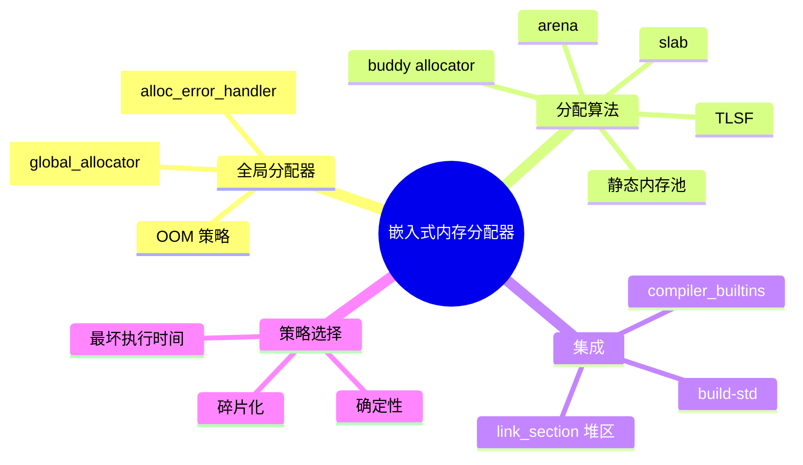

> **内容分级**: [专家级]
> **代码状态**: ⚠️ 裸机/目标平台相关代码标注 `rust,ignore`/`no_run`，host 平台无法直接编译
> **定理链**: N/A — 描述性/工程性文档
>
# 嵌入式内存分配器
>
> **EN**: Embedded Memory Allocators
> **Summary**: Memory allocation in no_std: TLSF/embedded-alloc, buddy allocator, slab/arena, static memory pools, #[global_allocator], OOM handler, and compiler_builtins integration.
> **Rust 版本**: 1.97.0+ (Edition 2024)
>
> **受众**: [专家]
> **Bloom 层级**: L4
> **权威来源**: 本文件为 `concept/` 权威页。
> **A/S/P 标记**: **S+P** — Structure + Procedure
> **双维定位**: P×Eva — 在资源受限环境中选择合适的内存策略
> **前置概念**: [裸机启动与链接脚本](13_bare_metal_boot_linker_script.md) · [Cargo build-std](../01_cargo/22_build_std.md) · [堆内存管理](../../02_intermediate/02_memory_management/01_memory_management.md)
> **后置概念**: [PAC 与 HAL 实现](17_pac_hal_implementation.md) · [panic_handler 与 no_std 运行时](18_panic_runtime_no_std.md) · [嵌入式形式化内存模型](../../04_formal/14_embedded_semantics/01_embedded_formal_memory_model.md)

---

> **来源**: [embedded-alloc crate](https://docs.rs/embedded-alloc/) · [linked_list_allocator crate](https://docs.rs/linked_list_allocator/) · [The Embedded Rust Book](https://docs.rust-embedded.org/book/) · [The Embedonomicon](https://docs.rust-embedded.org/embedonomicon/) · [alloc crate](https://doc.rust-lang.org/alloc/index.html) · [compiler_builtins](https://github.com/rust-lang/compiler-builtins) · [Tock Book](https://book.tockos.org/) · [TLSF: A New Dynamic Memory Allocator for Real-Time Systems (Springer)](https://link.springer.com/article/10.1007/s11241-008-9052-7)

---

## 🧠 知识结构图



## 📑 目录

- [嵌入式内存分配器](#嵌入式内存分配器)
  - [🧠 知识结构图](#-知识结构图)
  - [📑 目录](#-目录)
  - [一、权威定义](#一权威定义)
  - [二、`#[global_allocator]` 与 `alloc`](#二global_allocator-与-alloc)
    - [2.1 启用 alloc](#21-启用-alloc)
    - [2.2 OOM handler](#22-oom-handler)
  - [三、TLSF 与 `embedded-alloc`](#三tlsf-与-embedded-alloc)
  - [四、buddy allocator](#四buddy-allocator)
  - [五、slab 与 arena](#五slab-与-arena)
    - [slab allocator](#slab-allocator)
    - [arena](#arena)
  - [六、静态内存池](#六静态内存池)
  - [七、`compiler_builtins` 集成](#七compiler_builtins-集成)
  - [八、反例与失效模式](#八反例与失效模式)
  - [九、边界测试](#九边界测试)
    - [9.1 边界测试：未初始化堆就使用 `Box`](#91-边界测试未初始化堆就使用-box)
    - [9.2 边界测试：中断中使用 `Vec::push`](#92-边界测试中断中使用-vecpush)
  - [十、相关概念](#十相关概念)
  - [🧭 思维导图（Mindmap）](#-思维导图mindmap)

---

## 一、权威定义

> **The Embedded Rust Book**: While `#![no_std]` disables the standard library, you can still use the `alloc` crate if you provide a global allocator. This is common in embedded systems that have enough RAM but no operating system.

**嵌入式内存分配器**：在 `no_std` 环境中实现的 `GlobalAlloc` trait，为 `alloc::vec::Vec`、`Box`、`String` 等类型提供堆内存。与桌面系统不同，嵌入式分配器需要满足确定性、低碎片、可预测最坏执行时间（WCET）等约束。

判定依据：是否引入堆分配是嵌入式架构的早期决策；无堆（heapless）方案最确定但灵活性差，TLSF 等实时分配器在确定性与时效之间取得平衡。

---

## 二、`#[global_allocator]` 与 `alloc`

### 2.1 启用 alloc

在 `#![no_std]` crate 中使用 `alloc` 需要：

1. 声明 `extern crate alloc;`
2. 提供一个实现 `GlobalAlloc` 的静态实例并用 `#[global_allocator]` 标注；
3. 提供 `#[alloc_error_handler]`（nightly 旧版本）或处理 `Layout` 失败（当前 Rust 在 no_std 中仍需要自定义 OOM）。

```rust,ignore
#![no_std]
extern crate alloc;

use alloc::alloc::GlobalAlloc;
use core::alloc::Layout;

struct DummyAllocator;

unsafe impl GlobalAlloc for DummyAllocator {
    unsafe fn alloc(&self, _layout: Layout) -> *mut u8 {
        core::ptr::null_mut()
    }
    unsafe fn dealloc(&self, _ptr: *mut u8, _layout: Layout) {}
}

#[global_allocator]
static ALLOCATOR: DummyAllocator = DummyAllocator;
```

### 2.2 OOM handler

在稳定 Rust 中，`no_std` + `alloc` 仍需要处理分配失败。旧 nightly 使用 `#[alloc_error_handler]`；当前推荐做法是在分配调用处检查返回值，或在自定义分配器中触发 panic/复位。

```rust,ignore
#[alloc_error_handler]
fn oom(_layout: Layout) -> ! {
    // 旧 nightly 接口；稳定通道已逐步迁移
    cortex_m::peripheral::SCB::sys_reset();
}
```

判定依据：裸机中不存在 OS 的 `mmap` 或 overcommit；分配失败必须被显式处理，否则会导致未定义行为或静默错误。

---

## 三、TLSF 与 `embedded-alloc`

**TLSF（Two-Level Segregated Fit）** 是一种确定性 O(1) 分配与释放时间的动态内存分配器，特别适合实时系统。`embedded-alloc` crate 为 Cortex-M 提供基于 TLSF 的 `GlobalAlloc` 实现。

```rust,ignore
#![no_std]
extern crate alloc;

use embedded_alloc::TlsfHeap;

#[global_allocator]
static HEAP: TlsfHeap = TlsfHeap::empty();

fn init_heap() {
    // 在 RAM 中划出一段区域作为堆
    extern "C" {
        static mut _heap_start: u8;
        static mut _heap_end: u8;
    }
    let start = unsafe { &mut _heap_start as *mut u8 };
    let end = unsafe { &mut _heap_end as *mut u8 };
    let size = end as usize - start as usize;
    unsafe { HEAP.init(start, size) };
}
```

链接脚本中需要定义 `_heap_start` 和 `_heap_end`：

```ld
SECTIONS
{
  .bss : { ... } > RAM

  _heap_start = .;
  . += 32K;
  _heap_end = .;
}
```

判定依据：TLSF 的 O(1) WCET 使其成为硬实时系统的首选动态分配器；但它仍会产生碎片，长期运行需监控堆使用率。

---

## 四、buddy allocator

**Buddy allocator** 把内存按 2 的幂次分块，分配与合并都有对数级复杂度。它实现简单、外部碎片少，但内部碎片较大。

```rust,ignore
// 最小 buddy allocator 示意
const MIN_BLOCK: usize = 16;
const HEAP_SIZE: usize = 1024;

struct BuddyAllocator {
    memory: [u8; HEAP_SIZE],
    // 每个块大小记录位图/链表
}

unsafe impl GlobalAlloc for BuddyAllocator {
    unsafe fn alloc(&self, layout: Layout) -> *mut u8 {
        // 向上取整到 2 的幂
        let _size = layout.size().next_power_of_two().max(MIN_BLOCK);
        // 查找合适块...
        core::ptr::null_mut()
    }
    unsafe fn dealloc(&self, _ptr: *mut u8, _layout: Layout) {}
}
```

判定依据：buddy allocator 适合教学、资源充足且块大小分布均匀的场景；对极小对象和奇数大小分配不经济。

---

## 五、slab 与 arena

### slab allocator

**Slab allocator** 为固定大小的对象预先分配若干页，每个页只服务同一尺寸。它消除了不同大小对象之间的碎片，释放后可快速复用。

```rust,ignore
use core::mem::MaybeUninit;

struct Slab<const N: usize, T> {
    storage: [MaybeUninit<T>; N],
    free: [bool; N],
}

impl<const N: usize, T> Slab<N, T> {
    pub fn alloc(&mut self, value: T) -> Option<&mut T> {
        for (i, free) in self.free.iter_mut().enumerate() {
            if *free {
                *free = false;
                self.storage[i] = MaybeUninit::new(value);
                return Some(unsafe { &mut *self.storage[i].as_mut_ptr() });
            }
        }
        None
    }
}
```

### arena

**Arena allocator** 一次性分配一大块内存，对象按顺序分配，只能整体释放。适合生命周期相同的批量对象（如解析阶段）。

判定依据：slab 适合频繁分配/释放同尺寸对象；arena 适合阶段化批处理，释放时只需重置指针，无需遍历单个对象。

---

## 六、静态内存池

最确定性的方案是完全避免动态分配，使用 `heapless::Pool` 或自定义静态池。

```rust,ignore
use heapless::pool::Pool;

static POOL: Pool<MyStruct> = Pool::new();

fn init_pool() {
    static mut MEMORY: [u8; 1024] = [0; 1024];
    unsafe { POOL.grow(&mut MEMORY); }
}
```

判定依据：在安全关键或认证系统中，静态内存池是最可审计、最可预测的方案；动态分配器通常需要额外的 WCET 分析。

---

## 七、`compiler_builtins` 集成

裸机目标常常没有 libc，因此 `memcpy`、`memset`、`memmove`、`memcmp` 等由 `compiler_builtins` crate 提供。`build-std-features = ["compiler-builtins-mem"]` 让 `compiler_builtins` 实现这些函数。

```toml
# .cargo/config.toml
[unstable]
build-std = ["core", "alloc", "compiler_builtins"]
build-std-features = ["compiler-builtins-mem"]
```

判定依据：缺少 `compiler-builtins-mem` 时，链接裸机程序常出现 `undefined reference to memcpy` 等错误；自定义 libc 或 HAL 提供这些函数时可关闭该 feature。

---

## 八、反例与失效模式

| 失效模式 | 根因 | 修复方向 |
|:---|:---|:---|
| 链接错误：未定义 `memcpy` | 未启用 `compiler-builtins-mem` | 配置 `build-std-features` |
| 分配失败导致 panic | 未处理 OOM 或堆区过小 | 静态池、失败处理或增大堆 |
| 长期运行堆碎片化 | 频繁大小差异分配/释放 | TLSF、slab、arena 或静态池 |
| 中断中使用 `alloc` | 分配器不可重入或关中断过久 | 预先分配，中断外处理 |
| 堆区与栈重叠 | 链接脚本中堆顶超过栈底 | 精确计算 RAM 布局并留安全边距 |
| 未初始化 `#[global_allocator]` | 堆未初始化就调用 `Box::new` | 在 `main` 或 `init` 中先初始化堆 |

---

## 九、边界测试

### 9.1 边界测试：未初始化堆就使用 `Box`

```rust,ignore
#![no_std]
extern crate alloc;

use alloc::boxed::Box;
use embedded_alloc::TlsfHeap;

#[global_allocator]
static HEAP: TlsfHeap = TlsfHeap::empty();

fn main() {
    // ❌ 错误：堆尚未 init
    let _b = Box::new(42);
}
```

> **修正**：在 `_start` 或 `main` 开头调用 `HEAP.init(...)`。

### 9.2 边界测试：中断中使用 `Vec::push`

```rust,ignore
#[interrupt]
fn USART1() {
    // ❌ 错误：中断上下文调用可能分配内存的操作
    let mut v = Vec::new();
    v.push(read_byte());
}
```

> **修正**：使用静态缓冲区或预分配的 ring buffer。

---

## 十、相关概念

- [裸机启动与链接脚本](13_bare_metal_boot_linker_script.md)
- [Cargo build-std](../01_cargo/22_build_std.md)
- [PAC 与 HAL 实现](17_pac_hal_implementation.md)
- [panic_handler 与 no_std 运行时](18_panic_runtime_no_std.md)
- [嵌入式形式化内存模型](../../04_formal/14_embedded_semantics/01_embedded_formal_memory_model.md)
- [堆内存管理](../../02_intermediate/02_memory_management/01_memory_management.md)
- [Rust vs Zig：系统编程的两种显式路径](../../05_comparative/01_systems_languages/06_rust_vs_zig.md)
- [嵌入式形式化内存模型](../../04_formal/14_embedded_semantics/01_embedded_formal_memory_model.md)

---

> **权威来源**: [embedded-alloc crate](https://docs.rs/embedded-alloc/) · [linked_list_allocator crate](https://docs.rs/linked_list_allocator/) · [The Embedded Rust Book](https://docs.rust-embedded.org/book/) · [The Embedonomicon](https://docs.rust-embedded.org/embedonomicon/) · [alloc crate](https://doc.rust-lang.org/alloc/index.html) · [compiler_builtins](https://github.com/rust-lang/compiler-builtins) · [Tock Book](https://book.tockos.org/)
>
> **权威来源对齐变更日志**: 2026-07-30 创建

**文档版本**: 1.0
**最后更新**: 2026-07-30
**状态**: ✅ 概念文件创建完成

---

## 🧭 思维导图（Mindmap）


> **认知功能**: 本 mindmap 从本页「嵌入式内存分配器」的章节结构提炼，一级分支对应核心主题，叶子节点为关键子概念，可作为本页的快速导航与复习索引。
