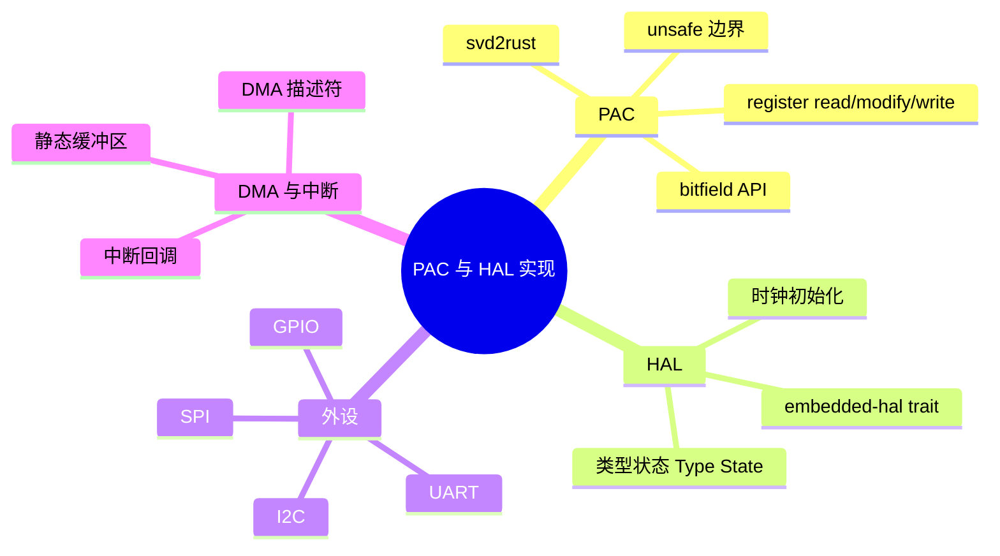

> **内容分级**: [专家级]
> **代码状态**: ⚠️ 裸机/目标平台相关代码标注 `rust,ignore`/`no_run`，host 平台无法直接编译
> **定理链**: N/A — 描述性/工程性文档
>
# PAC 与 HAL 实现
>
> **EN**: PAC and HAL Implementation
> **Summary**: svd2rust-generated PAC structure, register read/modify/write bitfield APIs, type-state HAL, clock/GPIO/UART/SPI/I2C initialization sequences, and DMA plus interrupt integration.
> **Rust 版本**: 1.97.0+ (Edition 2024)
>
> **受众**: [专家]
> **Bloom 层级**: L4
> **权威来源**: 本文件为 `concept/` 权威页。
> **A/S/P 标记**: **S+P** — Structure + Procedure
> **双维定位**: P×Cre — 设计可移植、类型安全的嵌入式外设抽象
> **前置概念**: [Rust 嵌入式系统开发](03_embedded_systems.md) · [裸机启动与链接脚本](13_bare_metal_boot_linker_script.md) · [Cortex-M 异常模型](14_interrupt_and_exception_model.md) · [泛型与 Trait Bounds](../../02_intermediate/01_generics/01_generics.md)
> **后置概念**: [panic_handler 与 no_std 运行时](18_panic_runtime_no_std.md) · [no_std 同步原语](15_no_std_synchronization_primitives.md) · [嵌入式内存分配器](16_embedded_memory_allocators.md)

---

> **来源**:
> [svd2rust](https://docs.rs/svd2rust/) ·
> [embedded-hal](https://docs.rs/embedded-hal/) ·
> [The Embedded Rust Book](https://docs.rust-embedded.org/book/) ·
> [The Embedonomicon](https://docs.rust-embedded.org/embedonomicon/) ·
> [Embassy Book](https://embassy.dev/book/) ·
> [cortex-m crate](https://docs.rs/cortex-m/) ·
> [Strom — Typestate Programming (IEEE)](https://ieeexplore.ieee.org/document/6312929)

---

## 🧠 知识结构图



## 📑 目录

- [PAC 与 HAL 实现](#pac-与-hal-实现)
  - [🧠 知识结构图](#-知识结构图)
  - [📑 目录](#-目录)
  - [一、权威定义](#一权威定义)
  - [二、PAC：`svd2rust` 输出结构](#二pacsvd2rust-输出结构)
    - [2.1 外设单例与寄存器访问](#21-外设单例与寄存器访问)
    - [2.2 `read`/`modify`/`write` API](#22-readmodifywrite-api)
    - [2.3 位域 API](#23-位域-api)
  - [三、HAL 设计：类型状态](#三hal-设计类型状态)
  - [四、时钟初始化序列](#四时钟初始化序列)
  - [五、GPIO 初始化](#五gpio-初始化)
  - [六、UART/SPI/I2C 初始化序列](#六uartspii2c-初始化序列)
    - [6.1 UART](#61-uart)
    - [6.2 SPI](#62-spi)
    - [6.3 I2C](#63-i2c)
  - [七、DMA 与中断结合](#七dma-与中断结合)
  - [八、反例与失效模式](#八反例与失效模式)
  - [九、边界测试](#九边界测试)
    - [9.1 边界测试：未使能时钟访问外设](#91-边界测试未使能时钟访问外设)
    - [9.2 边界测试：DMA 缓冲区未对齐](#92-边界测试dma-缓冲区未对齐)
  - [十、相关概念](#十相关概念)
  - [🧭 思维导图（Mindmap）](#-思维导图mindmap)

---

## 一、权威定义

> **svd2rust**: Generates a Peripheral Access Crate (PAC) from a System View Description (SVD) file. The PAC provides a type-safe, zero-cost abstraction over memory-mapped registers.

**PAC（Peripheral Access Crate）**：由芯片厂商提供的 SVD 文件通过 `svd2rust` 自动生成，提供寄存器级别的类型安全访问。PAC 保证“不会访问错误的寄存器地址”，但不保证“配置序列正确”。

**HAL（Hardware Abstraction Layer）**：在 PAC 之上实现 `embedded-hal` trait，把特定芯片的寄存器操作封装为跨平台 API。HAL 通过类型状态、构造函数和错误类型把硬件约束编码进类型系统。

判定依据：驱动开发者应面向 `embedded-hal` trait 编程以获得可移植性；只有 HAL 未覆盖的外设才直接使用 PAC。

---

## 二、PAC：`svd2rust` 输出结构

### 2.1 外设单例与寄存器访问

`svd2rust` 为每个外设生成一个单例（singleton），通过 `Peripherals::take()` 获取所有权。该函数使用原子操作保证只被调用一次，防止外设被重复初始化。

```rust,ignore
use stm32f4::stm32f407;

let dp = stm32f4::stm32f407::Peripherals::take().unwrap();

// 直接访问寄存器
dp.RCC.ahb1enr.modify(|_, w| w.gpioaen().set_bit());
let idr = dp.GPIOA.idr.read();
```

### 2.2 `read`/`modify`/`write` API

| 方法 | 语义 | 安全说明 |
|:---|:---|:---|
| `read()` | 返回寄存器当前值 | 读取副作用寄存器可能改变外设状态 |
| `modify(|r, w| ...)` | 读-改-写 | 保证原子性由硬件总线宽度决定 |
| `write(|w| ...)` | 直接写入，未设置位通常归零 | 会覆盖整个寄存器 |
| `reset()` | 写入复位值 | 谨慎使用 |

```rust,ignore
// 读-改-写：只置位 GPIOA 模式寄存器的 bit10:11
 dp.GPIOA.moder.modify(|_, w| w.moder5().output());

// 写：配置整个 GPIO 端口输出数据寄存器
 dp.GPIOA.odr.write(|w| unsafe { w.odr().bits(0x00FF) });
```

### 2.3 位域 API

`svd2rust` 为每个寄存器字段生成强类型方法，避免手动位移和掩码。

```rust,ignore
// 读取 USART 状态标志
let sr = dp.USART1.sr.read();
if sr.txe().bit_is_set() {
    // 发送寄存器空
}

// 配置波特率（伪代码，具体字段因芯片而异）
dp.USART1.brr.write(|w| unsafe { w.bits(0x0683) });
```

判定依据：PAC 把寄存器位运算错误转化为编译错误；但 `unsafe { w.bits(...) }` 绕过类型检查，仅在字段无合适枚举时使用。

---

## 三、HAL 设计：类型状态

类型状态模式把外设配置阶段编码到类型参数中，误用会在编译期被拒绝。

```rust,ignore
use core::marker::PhantomData;

pub struct Disabled;
pub struct Enabled<T> {
    _mode: PhantomData<T>,
}
pub struct Tx;
pub struct Rx;

pub struct Uart<STATE> {
    _state: PhantomData<STATE>,
}

impl Uart<Disabled> {
    pub fn new() -> Self {
        Self { _state: PhantomData }
    }

    pub fn enable_tx(self, baud: u32) -> Uart<Enabled<Tx>> {
        // 配置时钟、引脚复用、波特率
        let _ = baud;
        Uart { _state: PhantomData }
    }
}

impl Uart<Enabled<Tx>> {
    pub fn write_byte(&mut self, byte: u8) {
        let _ = byte;
    }
}
```

> **优点**：未配置 `Tx` 的 UART 无法调用 `write_byte`；编译器防止外设阶段错误。
> **代价**：类型参数增多，错误信息复杂；单态化可能增加代码体积。

---

## 四、时钟初始化序列

所有外设在使用前必须使能总线时钟。典型顺序：

1. 使能 HSE/HSI 并等待稳定；
2. 配置 PLL 得到系统时钟；
3. 配置 AHB/APB 分频器；
4. 切换系统时钟源；
5. 使能 GPIO 与外设总线时钟。

```rust,ignore
// PAC 风格时钟使能
dp.RCC.ahb1enr.modify(|_, w| w.gpioaen().set_bit());
dp.RCC.apb1enr.modify(|_, w| w.usart2en().set_bit());
```

判定依据：时钟未使能就访问外设寄存器通常导致总线 fault 或静默失败；这是嵌入式最常见的初始化错误之一。

---

## 五、GPIO 初始化

```rust,ignore
// PAC 风格 GPIO 配置
fn configure_pa5_output(dp: &stm32f407::Peripherals) {
    // 1. 使能 GPIOA 时钟
    dp.RCC.ahb1enr.modify(|_, w| w.gpioaen().set_bit());

    // 2. 配置 PA5 为输出
    dp.GPIOA.moder.modify(|_, w| w.moder5().output());

    // 3. 配置输出类型、速度、上下拉
    dp.GPIOA.otyper.modify(|_, w| w.ot5().push_pull());
    dp.GPIOA.ospeedr.modify(|_, w| w.ospeedr5().high_speed());
}
```

---

## 六、UART/SPI/I2C 初始化序列

### 6.1 UART

```rust,ignore
fn configure_usart2(dp: &stm32f407::Peripherals, baud: u32) {
    // 1. 使能时钟
    dp.RCC.apb1enr.modify(|_, w| w.usart2en().set_bit());

    // 2. 配置引脚复用（PA2=TX, PA3=RX）
    dp.GPIOA.moder.modify(|_, w| w.moder2().alternate().moder3().alternate());
    dp.GPIOA.afrl.modify(|_, w| w.afrl2().af7().afrl3().af7());

    // 3. 配置波特率
    let brr = calculate_brr(baud);
    dp.USART2.brr.write(|w| unsafe { w.bits(brr) });

    // 4. 使能 TX、RX、UART
    dp.USART2.cr1.modify(|_, w| w.te().set_bit().re().set_bit().ue().set_bit());
}
```

### 6.2 SPI

```rust,ignore
fn configure_spi1_master(dp: &stm32f407::Peripherals) {
    dp.RCC.apb2enr.modify(|_, w| w.spi1en().set_bit());

    // PA5=SCK, PA6=MISO, PA7=MOSI
    dp.GPIOA.moder.modify(|_, w| w.moder5().alternate().moder6().alternate().moder7().alternate());
    dp.GPIOA.afrl.modify(|_, w| w.afrl5().af5().afrl6().af5().afrl7().af5());

    dp.SPI1.cr1.write(|w| unsafe {
        w.br().bits(0b011) // fPCLK/16
         .cpol().set_bit()
         .cpha().set_bit()
         .mstr().set_bit()
         .spe().set_bit()
    });
}
```

### 6.3 I2C

```rust,ignore
fn configure_i2c1(dp: &stm32f407::Peripherals) {
    dp.RCC.apb1enr.modify(|_, w| w.i2c1en().set_bit());

    // PB6=SCL, PB7=SDA
    dp.GPIOB.moder.modify(|_, w| w.moder6().alternate().moder7().alternate());
    dp.GPIOB.afrl.modify(|_, w| w.afrl6().af4().afrl7().af4());

    // 配置时钟和使能
    dp.I2C1.cr2.write(|w| unsafe { w.freq().bits(42) });
    dp.I2C1.ccr.write(|w| unsafe { w.bits(210) });
    dp.I2C1.cr1.modify(|_, w| w.pe().set_bit());
}
```

判定依据：外设初始化顺序必须遵循“时钟 → 引脚复用 → 外设参数 → 使能”的固定模式；顺序错误会导致引脚不工作或外设无响应。

---

## 七、DMA 与中断结合

DMA 传输完成或半传输完成时触发中断。Rust 中通常使用静态缓冲区并配合 `critical_section` 或原子标志共享状态。

```rust,ignore
static mut TX_BUF: [u8; 256] = [0; 256];
static TX_DONE: AtomicBool = AtomicBool::new(false);

#[interrupt]
fn DMA2_STREAM7() {
    // 检查 TCIF 标志
    unsafe {
        if (*stm32f407::DMA2::ptr()).hifcr.read().bits() != 0 {
            // 清除标志
            (*stm32f407::DMA2::ptr()).hifcr.write(|w| w.ctcif7().set_bit());
        }
    }
    TX_DONE.store(true, Ordering::Release);
}

fn start_dma_tx(dp: &stm32f407::Peripherals, data: &[u8]) {
    // 复制到静态缓冲区
    unsafe { TX_BUF[..data.len()].copy_from_slice(data); }

    // 配置 DMA 源地址、目标地址、长度
    dp.DMA2.st[7].m0ar.write(|w| unsafe { w.bits(TX_BUF.as_ptr() as u32) });
    dp.DMA2.st[7].par.write(|w| unsafe { w.bits(stm32f407::USART1::ptr() as u32 + 0x04) });
    dp.DMA2.st[7].ndtr.write(|w| unsafe { w.bits(data.len() as u32) });

    // 使能 DMA 流与中断
    dp.DMA2.st[7].cr.modify(|_, w| w.en().set_bit().tcie().set_bit());
}
```

> **关键约束**：DMA 缓冲区必须位于 DMA 可访问的 RAM；某些芯片对缓冲区有对齐要求；`static mut` 缓冲区在 ISR 与主循环之间共享需要同步。

---

## 八、反例与失效模式

| 失效模式 | 根因 | 修复方向 |
|:---|:---|:---|
| 外设无响应 | 未使能外设时钟 | 先写 RCC 寄存器 |
| GPIO 不输出 | 引脚复用未配置或模式未设为 alternate | 检查 MODER/AFR |
| UART 乱码 | 波特率计算错误或时钟源不匹配 | 核对 `brr` 与 APB 时钟 |
| DMA 不触发中断 | 中断使能位未置位或 NVIC 未 unmask | 检查 `tcie` 与 `NVIC::unmask` |
| DMA 数据错误 | 缓冲区在不可见 RAM（如 CCM） | 把缓冲区放到普通 SRAM |
| `Peripherals::take()` panic | 已调用过一次 | 只调用一次并传递所有权 |
| 类型状态误用 | 在错误阶段调用方法 | 遵循 HAL 状态迁移 |

---

## 九、边界测试

### 9.1 边界测试：未使能时钟访问外设

```rust,ignore
// ❌ 错误：未使能 GPIOA 时钟
let dp = stm32f407::Peripherals::take().unwrap();
dp.GPIOA.odr.write(|w| unsafe { w.bits(0xFF) });
```

> **修正**：

```rust,ignore
dp.RCC.ahb1enr.modify(|_, w| w.gpioaen().set_bit());
```

### 9.2 边界测试：DMA 缓冲区未对齐

```rust,ignore
// ❌ 错误：某些 DMA 需要半字/字对齐
static mut BUF: [u8; 257] = [0; 257];
```

> **修正**：使用 `#[repr(align(4))]` 或长度取 4 的倍数。

```rust,ignore
#[repr(align(4))]
static mut BUF: [u8; 256] = [0; 256];
```

---

## 十、相关概念

- [Rust 嵌入式系统开发](03_embedded_systems.md)
- [裸机启动与链接脚本](13_bare_metal_boot_linker_script.md)
- [Cortex-M 异常模型](14_interrupt_and_exception_model.md)
- [no_std 同步原语](15_no_std_synchronization_primitives.md)
- [嵌入式内存分配器](16_embedded_memory_allocators.md)
- [panic_handler 与 no_std 运行时](18_panic_runtime_no_std.md)
- [泛型与 Trait Bounds](../../02_intermediate/01_generics/01_generics.md)
- [Rust vs Zig：系统编程的两种显式路径](../../05_comparative/01_systems_languages/06_rust_vs_zig.md)
- [嵌入式形式化内存模型](../../04_formal/14_embedded_semantics/01_embedded_formal_memory_model.md)
- [安全关键裸机 OS 与 Rust](../../06_ecosystem/05_systems_and_embedded/19_safety_critical_bare_metal_os.md)
- [`embedded-hal` 与驱动惯用法](24_embedded_hal_and_driver_idioms.md)

---

> **权威来源**:
> [svd2rust](https://docs.rs/svd2rust/) ·
> [embedded-hal](https://docs.rs/embedded-hal/) ·
> [The Embedded Rust Book](https://docs.rust-embedded.org/book/) ·
> [The Embedonomicon](https://docs.rust-embedded.org/embedonomicon/) ·
> [Embassy Book](https://embassy.dev/book/) ·
> [cortex-m crate](https://docs.rs/cortex-m/)
>
> **P0 官方来源**:
>
> - [The Rustonomicon](https://doc.rust-lang.org/nomicon/)
> - [Rust core — `core::ptr::read_volatile`](https://doc.rust-lang.org/core/ptr/fn.read_volatile.html)
> - [Rust core — `core::ptr::write_volatile`](https://doc.rust-lang.org/core/ptr/fn.write_volatile.html)
>
> **权威来源对齐变更日志**: 2026-07-30 创建

**文档版本**: 1.0
**最后更新**: 2026-07-30
**状态**: ✅ 概念文件创建完成

---

## 🧭 思维导图（Mindmap）


> **认知功能**: 本 mindmap 从本页「PAC 与 HAL 实现」的章节结构提炼，一级分支对应核心主题，叶子节点为关键子概念，可作为本页的快速导航与复习索引。
