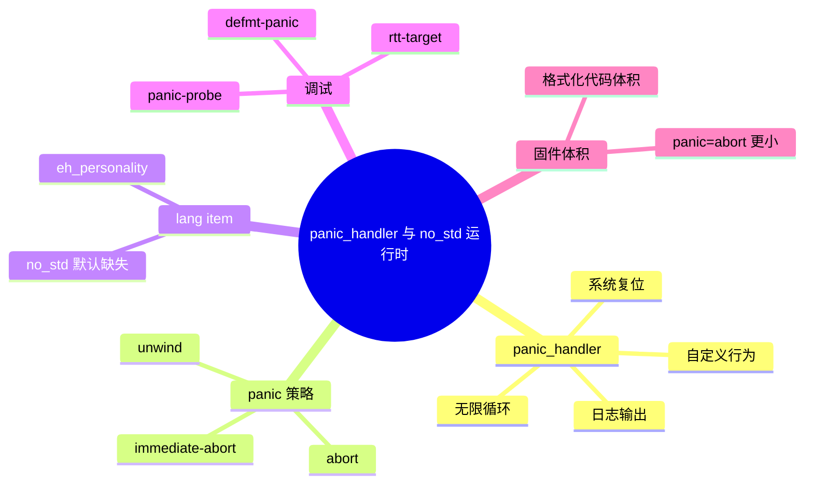
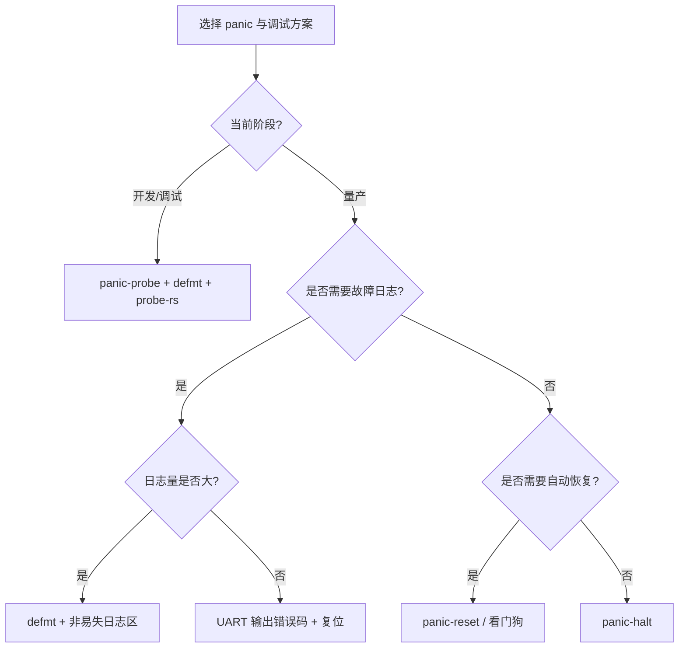

> **内容分级**: [专家级]
> **代码状态**: ⚠️ 裸机/目标平台相关代码标注 `rust,ignore`/`no_run`，host 平台无法直接编译
> **定理链**: N/A — 描述性/工程性文档
>
# panic_handler 与 no_std 运行时
>
> **EN**: panic_handler and no_std Runtime
> **Summary**: panic_handler, eh_personality lang item, panic = abort/unwind linkage impact, custom panic messages, panic-probe, and defmt-panic for embedded systems.
> **Rust 版本**: 1.97.0+ (Edition 2024)
>
> **受众**: [专家]
> **Bloom 层级**: L4
> **权威来源**: 本文件为 `concept/` 权威页。
> **A/S/P 标记**: **S+A+P** — Structure + Application + Procedure
> **双维定位**: P×Eva — 评估不同 panic 策略对固件大小与可调试性的影响
> **前置概念**: [Rust 嵌入式系统开发](03_embedded_systems.md) · [裸机启动与链接脚本](13_bare_metal_boot_linker_script.md) · [Unsafe Rust](../../03_advanced/02_unsafe/01_unsafe.md)
> **后置概念**: [嵌入式内存分配器](16_embedded_memory_allocators.md) · [PAC 与 HAL 实现](17_pac_hal_implementation.md) · [嵌入式形式化内存模型](../../04_formal/14_embedded_semantics/01_embedded_formal_memory_model.md)

---

> **来源**: [Rust Reference — Panic Handler](https://doc.rust-lang.org/reference/runtime.html#the-panic_handler-attribute) · [Rust Reference — Lang Items](https://doc.rust-lang.org/reference/attributes.html#lang-items) · [The Embedonomicon](https://docs.rust-embedded.org/embedonomicon/) · [panic-probe crate](https://docs.rs/panic-probe/) · [defmt-panic crate](https://docs.rs/defmt-panic/) · [Ferrocene Language Specification](https://spec.ferrocene.dev/) · [The Embedded Rust Book](https://docs.rust-embedded.org/book/) · [RustBelt: Securing the Foundations of the Rust Programming Language](https://plv.mpi-sws.org/rustbelt/popl18/)

---

## 🧠 知识结构图



## 📑 目录

- [panic\_handler 与 no\_std 运行时](#panic_handler-与-no_std-运行时)
  - [🧠 知识结构图](#-知识结构图)
  - [📑 目录](#-目录)
  - [一、权威定义](#一权威定义)
  - [二、`#[panic_handler]`](#二panic_handler)
    - [2.1 最小实现](#21-最小实现)
    - [2.2 输出 panic 信息](#22-输出-panic-信息)
    - [2.3 复位而非挂起](#23-复位而非挂起)
  - [三、`panic = abort/unwind` 链接影响](#三panic--abortunwind-链接影响)
  - [四、`eh_personality` lang item](#四eh_personality-lang-item)
  - [五、panic message 定制](#五panic-message-定制)
  - [六、`panic-probe` 与 `defmt-panic`](#六panic-probe-与-defmt-panic)
    - [6.1 panic-probe](#61-panic-probe)
    - [6.2 defmt-panic](#62-defmt-panic)
  - [七、反例与失效模式](#七反例与失效模式)
  - [八、边界测试](#八边界测试)
    - [8.1 边界测试：`no_std` 中未提供 panic handler](#81-边界测试no_std-中未提供-panic-handler)
    - [8.2 边界测试：`panic = "unwind"` 在 `no_std` 中链接失败](#82-边界测试panic--unwind-在-no_std-中链接失败)
  - [九、panic 策略与运行属性矩阵](#九panic-策略与运行属性矩阵)
  - [十、panic / 调试策略决策树](#十panic--调试策略决策树)
  - [十一、相关概念](#十一相关概念)
  - [🧭 思维导图（Mindmap）](#-思维导图mindmap)

---

## 一、权威定义

> **Rust Reference**: In Rust, panicking is the act of unwinding the stack or aborting the process when an unrecoverable error occurs. In `no_std` environments, a custom `#[panic_handler]` must be provided.

**panic_handler**：`no_std` 环境下由用户提供的函数，定义程序 panic 时的行为。该函数签名必须为 `fn(&PanicInfo) -> !`，即在 panic 后永不返回。

**no_std 运行时**：裸机程序不依赖 Rust 标准库的运行时，但需要最小启动支持：`#[panic_handler]`、`#[lang = "eh_personality"]`（unwind 策略下）以及可选的全局分配器。

判定依据：panic 策略直接影响固件大小、可调试性和错误恢复行为；是嵌入式项目早期必须明确的架构决策。

---

## 二、`#[panic_handler]`

### 2.1 最小实现

```rust,ignore
#![no_std]

use core::panic::PanicInfo;

#[panic_handler]
fn panic(_info: &PanicInfo) -> ! {
    loop {}
}
```

> **说明**：这是最小的 panic handler，进入无限循环。适合对体积要求极高的固件，但不利于调试。

### 2.2 输出 panic 信息

通过 UART 或 semihosting 输出 panic 位置信息，便于现场调试。

```rust,ignore
#![no_std]

use core::fmt::Write;
use core::panic::PanicInfo;

unsafe extern "C" {
    fn uart_putc(b: u8);
}

struct UartWriter;

impl Write for UartWriter {
    fn write_str(&mut self, s: &str) -> core::fmt::Result {
        // 通过 UART 发送字符串
        for b in s.bytes() {
            unsafe { uart_putc(b); }
        }
        Ok(())
    }
}

#[panic_handler]
fn panic(info: &PanicInfo) -> ! {
    let mut w = UartWriter;
    let _ = writeln!(w, "PANIC: {}", info);
    loop {}
}
```

### 2.3 复位而非挂起

```rust,ignore
#[panic_handler]
fn panic(_info: &PanicInfo) -> ! {
    // 触发系统复位
    cortex_m::peripheral::SCB::sys_reset();
}
```

判定依据：选择“挂起”还是“复位”取决于应用场景。开发阶段倾向于输出信息挂起以便调试；量产阶段倾向于快速复位恢复。

---

## 三、`panic = abort/unwind` 链接影响

| 策略 | 行为 | 体积 | 调试信息 | 适用场景 |
|:---|:---|:---|:---|:---|
| `panic = "unwind"` | 栈展开，调用 drop | 大 | 可捕获 panic 位置 | 桌面/服务器 |
| `panic = "abort"` | 直接 abort，不展开 | 小 | 较少 | 大多数嵌入式 |
| `panic-immediate-abort` | 不格式化、直接终止 | 最小 | 无 | 体积极度敏感 |

```toml
# Cargo.toml
[profile.release]
panic = "abort"
```

```toml
# .cargo/config.toml，配合 build-std
[unstable]
build-std = ["core", "alloc", "compiler_builtins"]
build-std-features = ["compiler-builtins-mem", "panic-immediate-abort"]
```

判定依据：裸机通常选择 `panic = "abort"` 以减小体积；`panic-immediate-abort` 可进一步减小但会丢失 panic 消息，仅在资源极其受限时使用。

---

## 四、`eh_personality` lang item

当使用 `panic = "unwind"` 时，编译器需要 `#[lang = "eh_personality"]` 来驱动栈展开。`no_std` 环境默认不提供该 lang item。

```rust,ignore
#![feature(lang_items)]

#[lang = "eh_personality"]
extern "C" fn eh_personality() {}
```

> **注意**：在 `panic = "abort"` 策略下不需要 `eh_personality`，这是裸机项目的常规选择。

判定依据：lang item 是 Rust 编译器与运行时之间的契约；`no_std` 项目中通常只保留 `panic_handler`，避免引入 unwinding 依赖。

---

## 五、panic message 定制

在 `panic = "abort"` 下仍可通过 `PanicInfo` 获取消息、位置和 payload。

```rust,ignore
#![no_std]

use core::panic::PanicInfo;

fn log_panic_loc(_file: &str, _line: u32) {}
fn log_panic_message(_msg: &core::panic::PanicMessage) {}

#[panic_handler]
fn panic(info: &PanicInfo) -> ! {
    if let Some(loc) = info.location() {
        // 输出文件名、行号
        log_panic_loc(loc.file(), loc.line());
    }
    // `info.message()` 在 Rust 1.97+ 直接返回 `PanicMessage<'_>`
    let msg = info.message();
    log_panic_message(&msg);
    loop {}
}
```

> **体积警告**：使用 `core::fmt` 格式化 panic 消息会显著增加代码体积；`defmt` 通过主机端格式化解决这个问题。

---

## 六、`panic-probe` 与 `defmt-panic`

### 6.1 panic-probe

`panic-probe` 与 `probe-rs` 调试器配合，panic 时通过 debug probe 输出信息并停止 CPU，便于在 IDE 中查看调用栈。

```rust,ignore
// Cargo.toml: panic-probe = "0.3"

use panic_probe as _;

#[defmt::panic_handler]
fn panic() -> ! {
    cortex_m::asm::udf()
}
```

### 6.2 defmt-panic

`defmt-panic` 使用 `defmt` 的延迟格式化机制，在目标端只传输 panic 位置索引，主机端解析完整消息，极大减少固件体积。

```rust,ignore
// Cargo.toml: defmt-panic = "0.3"

use defmt_rtt as _;
use defmt_panic as _;
```

判定依据：开发调试阶段优先使用 `panic-probe` + `defmt`；量产阶段根据是否需要错误日志选择 `panic-halt`、`panic-reset` 或自定义 handler。

---

## 七、反例与失效模式

| 失效模式 | 根因 | 修复方向 |
|:---|:---|:---|
| 链接错误：`panic_handler` 未定义 | `#![no_std]` 未提供 panic handler | 添加 `#[panic_handler]` |
| 链接错误：`eh_personality` 缺失 | 使用了 `panic = "unwind"` 但无 lang item | 改用 `panic = "abort"` 或提供 lang item |
| 固件体积过大 | panic 消息格式化引入大量代码 | 使用 `defmt` 或 `panic-immediate-abort` |
| panic 后设备死机无法恢复 | handler 进入无限循环 | 改用复位或看门狗 |
| panic 信息无法输出 | 未配置 UART/RTT/semihosting | 集成 `defmt` 或 semihosting |
| 测试构建失败 | `#[cfg(not(test))]` 未加导致测试用例冲突 | 用条件编译隔离 host 测试 |

---

## 八、边界测试

### 8.1 边界测试：`no_std` 中未提供 panic handler

```rust,compile_fail
#![no_std]

fn main() {
    panic!("boom");
}
```

> **修正**：

```rust,ignore
#![no_std]
use core::panic::PanicInfo;

#[panic_handler]
fn panic(_info: &PanicInfo) -> ! {
    loop {}
}
```

### 8.2 边界测试：`panic = "unwind"` 在 `no_std` 中链接失败

```rust,ignore
#![no_std]

// 没有 eh_personality
// 链接时可能报错：undefined reference to `rust_eh_personality`
```

> **修正**：在 `Cargo.toml` 中设置 `panic = "abort"`。

---

## 九、panic 策略与运行属性矩阵

| 策略 | 栈展开 | `eh_personality` | panic 消息 | 固件体积 | 调试能力 | 推荐场景 |
|:---|:---:|:---:|:---:|:---:|:---|:---|
| `panic = "unwind"` | ✅ | 需要 | 完整 | 大 | 可捕获调用栈 | host 测试、仿真 |
| `panic = "abort"` | ❌ | 不需要 | 可通过 `PanicInfo` 自定义 | 中 | 文件/行号 | 一般嵌入式固件 |
| `panic-immediate-abort` | ❌ | 不需要 | 无 | 最小 | 无 | 体积极度敏感（如 bootloader） |

判定依据：裸机项目默认选择 `panic = "abort"`；在需要最小体积且无需调试信息时，使用 `build-std-features = ["panic-immediate-abort"]`。

---

## 十、panic / 调试策略决策树



---

## 十一、相关概念

- [Rust 嵌入式系统开发](03_embedded_systems.md)
- [裸机启动与链接脚本](13_bare_metal_boot_linker_script.md)
- [PAC 与 HAL 实现](17_pac_hal_implementation.md)
- [嵌入式内存分配器](16_embedded_memory_allocators.md)
- [嵌入式形式化内存模型](../../04_formal/14_embedded_semantics/01_embedded_formal_memory_model.md)
- [Unsafe Rust](../../03_advanced/02_unsafe/01_unsafe.md)
- [Rust vs Zig：系统编程的两种显式路径](../../05_comparative/01_systems_languages/06_rust_vs_zig.md)
- [嵌入式形式化内存模型](../../04_formal/14_embedded_semantics/01_embedded_formal_memory_model.md)
- [`#![no_std]` 与裸机编程惯用法](23_no_std_and_bare_metal_idioms.md)

---

> **权威来源**: [Rust Reference — Panic Handler](https://doc.rust-lang.org/reference/runtime.html#the-panic_handler-attribute) · [Rust Reference — Lang Items](https://doc.rust-lang.org/reference/attributes.html#lang-items) · [The Embedonomicon](https://docs.rust-embedded.org/embedonomicon/) · [panic-probe crate](https://docs.rs/panic-probe/) · [defmt-panic crate](https://docs.rs/defmt-panic/) · [Ferrocene Language Specification](https://spec.ferrocene.dev/) · [The Embedded Rust Book](https://docs.rust-embedded.org/book/)
>
> **权威来源对齐变更日志**: 2026-07-30 创建

**文档版本**: 1.0
**最后更新**: 2026-07-30
**状态**: ✅ 概念文件创建完成

---

## 🧭 思维导图（Mindmap）


> **认知功能**: 本 mindmap 从本页「panic_handler 与 no_std 运行时」的章节结构提炼，一级分支对应核心主题，叶子节点为关键子概念，可作为本页的快速导航与复习索引。
