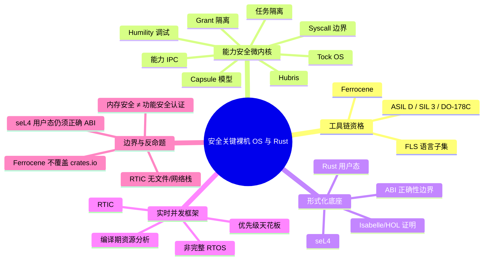

> **内容分级**: [专家级]
>
> **本节关键术语**: 功能安全 · Ferrocene · Tock · Hubris · seL4 · RTIC · 资格鉴定 · 能力安全 · 裸机 OS — [完整对照表](../../00_meta/01_terminology/01_terminology_glossary.md)

# 安全关键裸机操作系统与 Rust

> **EN**: Safety-Critical Bare-Metal Operating Systems in Rust
> **Summary**: Survey of Rust-based safety-critical bare-metal operating systems and qualification paths: Ferrocene, Tock, Hubris, seL4 userspace, and RTIC.
> **Rust 版本**: 1.97.0+ (Edition 2024)
>
> **受众**: [专家]
> **Bloom 层级**: L5-L6
> **权威来源**: 本文件为 `concept/` 权威页。
> **A/S/P 标记**: **P+S+A** — Procedure + Structure + Application
> **双维定位**: C×Eva — 比较与评价面向安全关键的 Rust 裸机 OS 架构及其资格鉴定路径
> **定位**: 从 Ferrocene 语言子集与工具链资格鉴定出发，系统比较 Tock、Hubris、seL4+Rust、RTIC 四种安全关键裸机/微内核/实时并发架构的设计哲学、隔离机制与认证边界。
> **前置概念**: [安全关键系统工程](../11_domain_applications/23_safety_critical_systems_engineering.md) ·
> [Rust 嵌入式系统开发](03_embedded_systems.md) ·
> [OS 内核开发](05_os_kernel.md) ·
> [形式化验证工具链](../../04_formal/04_model_checking/01_verification_toolchain.md)
> **后置概念**: [交叉编译](02_cross_compilation.md) ·
> [异步 no_std 嵌入式](11_async_no_std_embedded.md) ·
> [目标平台支持等级](10_target_tier_platform_support.md) ·
> [认证工具链与认证包清单](../../04_formal/04_model_checking/10_certified_toolchains_and_packages.md) ·
> [安全关键嵌入式 Rust 指南：MISRA-Rust、Ferrocene 与 IEC 61508](30_misra_rust_safety_critical_guidelines.md) ·
> [嵌入式图形](07_embedded_graphics.md)

---

> **来源**:
> [Ferrocene](https://docs.ferrocene.dev/) ·
> [Ferrocene Language Specification](https://spec.ferrocene.dev/) ·
> [Tock OS Book](https://book.tockos.org/) ·
> [Hubris](https://hubris.oxide.computer/) ·
> [seL4](https://sel4.systems/) ·
> [RTIC](https://rtic.rs/) ·
> [Rust Safety-Critical Rust Consortium](https://rustfoundation.org/safety-critical-rust-consortium/)

---

## 📑 目录

- [安全关键裸机操作系统与 Rust](#安全关键裸机操作系统与-rust)
  - [📑 目录](#-目录)
  - [一、Ferrocene 语言子集与工具链资格鉴定](#一ferrocene-语言子集与工具链资格鉴定)
    - [1.1 Ferrocene 是什么](#11-ferrocene-是什么)
    - [1.2 与 rustc 的关系](#12-与-rustc-的关系)
    - [1.3 资格鉴定范围](#13-资格鉴定范围)
  - [二、Ferrocene 合格目标平台](#二ferrocene-合格目标平台)
  - [三、Tock OS：能力安全的胶囊内核](#三tock-os能力安全的胶囊内核)
    - [3.1 胶囊模型](#31-胶囊模型)
    - [3.2 Grant 与进程隔离](#32-grant-与进程隔离)
    - [3.3 系统调用接口与内核/用户态边界](#33-系统调用接口与内核用户态边界)
  - [四、Hubris：任务隔离与 Humility 调试](#四hubris任务隔离与-humility-调试)
    - [4.1 任务模型与 IPC](#41-任务模型与-ipc)
    - [4.2 基于能力的设计](#42-基于能力的设计)
    - [4.3 Humility 调试与 dump 分析](#43-humility-调试与-dump-分析)
  - [五、seL4 + Rust 用户态](#五sel4--rust-用户态)
    - [5.1 seL4 微内核保证](#51-sel4-微内核保证)
    - [5.2 Rust 用户态组件](#52-rust-用户态组件)
    - [5.3 限制与工程现实](#53-限制与工程现实)
  - [六、RTIC 安全关键资格路径](#六rtic-安全关键资格路径)
    - [6.1 为什么 RTIC 适合安全关键](#61-为什么-rtic-适合安全关键)
    - [6.2 现有认证活动](#62-现有认证活动)
    - [6.3 资源冲突分析](#63-资源冲突分析)
    - [6.4 与完整 RTOS 的差异](#64-与完整-rtos-的差异)
  - [七、五类方案对比](#七五类方案对比)
  - [八、反命题与边界](#八反命题与边界)
    - [8.1 Ferrocene 资格不覆盖 crates.io 依赖](#81-ferrocene-资格不覆盖-cratesio-依赖)
    - [8.2 seL4 上的 Rust 用户态仍依赖 ABI 正确性](#82-sel4-上的-rust-用户态仍依赖-abi-正确性)
    - [8.3 RTIC 不是完整 RTOS](#83-rtic-不是完整-rtos)
    - [8.4 内存安全不等于功能安全认证](#84-内存安全不等于功能安全认证)
  - [九、边界测试](#九边界测试)
    - [9.1 安全关键 crate 中 unsafe 被 deny](#91-安全关键-crate-中-unsafe-被-deny)
    - [9.2 RTIC 资源未声明导致编译失败](#92-rtic-资源未声明导致编译失败)
    - [9.3 no\_std 裸机代码错误使用 std](#93-no_std-裸机代码错误使用-std)
  - [十、权威来源索引](#十权威来源索引)
  - [相关概念](#相关概念)
  - [🧭 思维导图（Mindmap）](#-思维导图mindmap)

---

## 一、Ferrocene 语言子集与工具链资格鉴定

### 1.1 Ferrocene 是什么

**Ferrocene** 是 Rust 编程语言首个面向安全关键领域、经第三方认证机构（TÜV SÜD）鉴定的工具链分发版。它由 Ferrous Systems 与 AdaCore 主导开发，目标是把 Rust 引入汽车、工业控制、航空航天等对工具置信度有严格要求的场景。Ferrocene 的核心价值不只是“一个稳定的 Rust 编译器”，而是提供了一套可被审计、被标准接受的**语言规范**和**工具链资格证据包**。

与社区版 Rust 不同，Ferrocene 交付物包含：

- **Ferrocene Language Specification (FLS)**：对 Rust 语言子集的精确、可审计文档；
- **经鉴定的 rustc/cargo 工具链**：版本冻结、回归测试、已知问题清单；
- **工具链鉴定报告与使用限制**：供安全案例（safety case）引用；
- **长期支持（LTS）与补丁策略**：满足高安全完整性等级对变更控制的要求。

> [来源: [Ferrocene](https://docs.ferrocene.dev/)] · [来源: [Ferrocene Language Specification](https://spec.ferrocene.dev/)]

### 1.2 与 rustc 的关系

Ferrocene 基于上游 **rustc 稳定版**，但在发布流程上增加了三层约束：

1. **语言子集规约**：FLS 明确哪些语言特性属于“合格子集”。超出子集的特性不意味着编译器不可用，但项目若宣称使用 Ferrocene 合格工具链，则需证明超出部分的风险已被控制。
2. **冻结与回溯**：Ferrocene 的发布周期与上游 Rust 不同步，通常滞后数月，以便完成测试、文档与审计。
3. **缺陷管理**：所有已知缺陷被记录在案，并提供缓解策略；安全关键项目必须评估这些缺陷是否影响其具体用例。

这种关系可类比为“经过鉴定的 GCC 交叉编译器”与“上游 GCC”的差异：代码语义一致，但**证据链**不同。

### 1.3 资格鉴定范围

Ferrocene 的鉴定覆盖了三大主流功能安全标准：

```text
Ferrocene 资格范围:
  认证机构: TÜV SÜD
  适用标准:
    ├── ISO 26262:2018 — 道路车辆功能安全，最高 ASIL D
    ├── IEC 61508:2010 — 工业通用功能安全，最高 SIL 3
    └── DO-178C / DO-330 — 航空机载软件及其工具鉴定
  交付物:
    ├── Ferrocene Language Specification
    ├── 编译器/工具链鉴定报告
    ├── 已知问题列表与限制
    └── 安装/使用/维护文档
```

需要强调的是，Ferrocene 解决的是**工具链置信度（Tool Confidence Level, TCL）**问题。它并不自动证明应用软件满足 ASIL D 或 DAL A，而是向审核方证明“编译器本身已被恰当鉴定，其输出可信”。这与 [安全关键系统工程](../11_domain_applications/23_safety_critical_systems_engineering.md) 中讨论的工具链资格话题完全一致。

---

## 二、Ferrocene 合格目标平台

Ferrocene 的资格是**按目标平台（target）逐项授予**的，而不是“一经购买全平台通用”。合格目标列表随版本更新，项目使用前必须核对当前版本支持矩阵。

典型的合格目标分为两类：

- **Host 平台**：运行编译器的开发机操作系统与架构，例如 `x86_64-unknown-linux-gnu`。
- **Target 平台**：生成二进制所面向的嵌入式或裸机目标，例如 `thumbv7em-none-eabihf`（Cortex-M4/M7 硬浮点）。

阅读目标列表时应注意：

1. **目标三元组含义**：`arch-vendor-os-abi` 中的 `none` 表示裸机，`eabi`/`eabihf` 区分软/硬浮点 ABI。
2. **合格 ≠ 通用**：某个 Cortex-M 目标合格，并不自动覆盖同一系列的其它变体；必须确认具体 triple。
3. **Host/Target 组合**：某些项目需要交叉编译，Host 与 Target 都必须在合格列表内，或提供额外工具鉴定证据。
4. **库与运行时**：合格目标通常对应 `no_std` 场景；若使用 `std`，需确认目标平台的 `std` 支持也在资格范围内。

```text
示例解读:
  thumbv7em-none-eabihf
    ├── arch   : ARMv7E-M (Cortex-M4/M7)
    ├── vendor : none (裸机/通用)
    ├── os     : none (无操作系统)
    └── abi    : eabihf (硬浮点 ABI)
```

---

## 三、Tock OS：能力安全的胶囊内核

**Tock** 是一个专为嵌入式系统设计的开源操作系统，采用 Rust 编写，其架构核心是可组合、可隔离的**胶囊（capsule）**模型。Tock 的设计目标是在资源受限设备上同时提供内核级功能与进程级隔离，并借助 Rust 类型系统实现能力安全（capability-safe）。

> [来源: [Tock OS Book](https://book.tockos.org/)]

### 3.1 胶囊模型

Tock 的内核由大量小型、可组合的 **capsule** 组成。每个 capsule 是一个实现特定硬件抽象或系统服务的 Rust 模块，例如 UART capsule、timer capsule、传感器驱动 capsule。它们通过 trait 组合，而非全局状态交互。

capsule 的关键约束：

- **无堆分配**：内核 capsule 默认不使用堆，避免内存碎片与分配失败路径；
- **显式能力传递**：访问硬件总线、DMA、中断等稀缺资源需要持有对应能力（capability）；
- **静态组合**：capsule 的依赖关系在编译期确定，便于静态分析与资源核算。

```rust,ignore
// Tock 风格 capsule 依赖注入示意（概念代码，非完整 Tock API）
struct Console<'a, U: Uart<'a>> {
    uart: &'a U,
    buffer: TakeCell<'static, [u8]>,
}

impl<'a, U: Uart<'a>> Console<'a, U> {
    // 通过构造函数显式接收 UART 能力，而非全局查找
    fn new(uart: &'a U, buffer: &'static mut [u8]) -> Self {
        Self {
            uart,
            buffer: TakeCell::new(buffer),
        }
    }
}
```

### 3.2 Grant 与进程隔离

Tock 的进程隔离依赖 **Grant** 机制。Grant 是内核为每个用户进程分配的一块受管内存区域，用于存储该进程对内核服务的请求上下文。Grant 的设计目标是：

- **类型安全**：Grant 区域的数据结构由 Rust 类型系统描述；
- **资源上限**：每个进程的 Grant 大小在编译或启动时确定，防止某个进程耗尽内核内存；
- **故障遏制**：用户进程崩溃不会破坏内核或其他进程的 Grant。

```text
Tock 内存隔离:
  内核空间:
    ├── capsule 代码与静态数据
    ├── 共享硬件抽象层
    └── Grant 表（每个进程一份）
  用户空间:
    └── 各进程独立地址空间/MPU 区域
```

### 3.3 系统调用接口与内核/用户态边界

Tock 提供精简的系统调用接口，用户进程通过 `subscribe`、`command`、`allow`、`yield` 四类 syscall 与内核交互。所有 syscall 都经过内核沙箱校验：

- **subscribe**：注册 upcall（回调）；
- **command**：向驱动发送命令；
- **allow**：把用户缓冲区授权给内核；
- **yield**：交出 CPU 等待事件。

内核/用户态边界的安全由 MPU（Memory Protection Unit）与 Rust 类型系统共同保证。 capsule 不能随意解引用用户指针，而必须通过 Grant 与受控的 allow 缓冲区访问。

---

## 四、Hubris：任务隔离与 Humility 调试

**Hubris** 是由 Oxide Computer 开发的微内核式实时操作系统，完全用 Rust 编写，面向需要高可靠性的嵌入式控制场景。其设计哲学是：**把传统操作系统的服务拆分为相互隔离的任务，通过编译期能力检查与显式 IPC 降低运行时可攻击面。**

> [来源: [Hubris](https://hubris.oxide.computer/)]

### 4.1 任务模型与 IPC

Hubris 把系统划分为多个**任务（task）**。每个任务有独立的栈、优先级和入口函数，任务之间不共享内存；通信只能通过受控的**IPC（Inter-Process Communication）** 完成。Hubris 调度器是固定优先级抢占式调度，适合硬实时约束。

任务配置通过编译期 TOML 描述，例如：

```toml
# 概念性 app.toml 片段
[tasks.sensor]
priority = 3
max-sizes = { flash = 32768, ram = 8192 }
start = true

[tasks.control]
priority = 2
max-sizes = { flash = 65536, ram = 16384 }
start = true
```

这种静态配置带来两个好处：

1. **内存预算可审计**：每个任务的 flash/ram 上限在链接阶段即被检查；
2. **调度可分析**：固定优先级使响应时间分析（RMA/RTA）在系统设计阶段即可进行。

### 4.2 基于能力的设计

Hubris 中的任务不是随意 IPC，而是持有**能力（capability）**。能力规定了任务能向哪些其它任务发送消息、能访问哪些外设、能执行哪些特权操作。能力在编译期由系统描述文件分配，运行时由内核强制执行。

```text
Hubris 能力示例:
  任务 A 持有:
    ├── 对任务 B 的 IPC 发送能力
    ├── 对 GPIO 端口 0 的访问能力
    └── 对看门狗的喂狗能力
  任务 C 持有:
    └── 仅对任务 D 的 IPC 接收能力
```

能力模型使安全案例分析更加直接：每个任务的权限边界清晰，违反行为会被内核拒绝。

### 4.3 Humility 调试与 dump 分析

与 Hubris 配套的是 **Humility** 调试工具。Humility 不是传统意义上的交互式调试器，而是一个**死后分析（post-mortem）**与**内省（introspection）**工具。它可以从目标设备提取完整系统状态（dump），并在主机上解析：

- 每个任务的栈使用情况；
- 当前寄存器与程序计数器；
- 任务间 IPC 消息队列状态；
- 能力违规记录。

```bash
# 概念性 Humility 工作流
humility hiffy list          # 列出可用 HIF 操作
humility tasks               # 查看任务状态
humility dump                # 提取系统 dump
humility jefe -f task_name   # 请求任务 fault/重启
```

Humility 的设计深受高可靠性系统运维影响：在无法随时挂接 JTAG 的生产环境中，**结构化 dump** 是故障定位的主要证据来源。

---

## 五、seL4 + Rust 用户态

**seL4** 是世界上第一个经过完整形式化验证的操作系统微内核，使用 Isabelle/HOL 证明了其功能正确性、完整性以及信息.flow 安全等关键属性。seL4 的验证覆盖内核本身，但不覆盖用户态程序。因此，把 Rust 用于 seL4 用户态，是在“已验证内核底座”之上构建“内存安全用户组件”的工程路径。

> [来源: [seL4](https://sel4.systems/)]

### 5.1 seL4 微内核保证

seL4 的形式化保证包括：

- **功能正确性（functional correctness）**：C 实现与抽象规范行为一致；
- **完整性（integrity）**：没有未授权修改；
- **机密性（confidentiality）**：信息流符合安全标签；
- **最坏情况执行时间（WCET）可分析**：适合硬实时系统。

这些保证仅作用于微内核内部。任何用户态组件，无论用 C 还是 Rust 编写，都必须通过 seL4 提供的 capability-based 系统调用接口与内核交互。

### 5.2 Rust 用户态组件

Rust 进入 seL4 用户态有两种主要技术路线：

1. **sel4-rs / rust-sel4**：提供 Rust 绑定的 seL4 ABI，让 Rust 代码直接调用 seL4 系统调用、创建 endpoint、管理 CNode 等内核对象。
2. **Ferros 风格（Oxide 早期探索）**：在 Rust 中实现 capability-safe 的 seL4 用户态框架，把 seL4 的能力模型映射到 Rust 类型系统，使某些能力错误在编译期即可被捕获。

```rust,ignore
// 概念性 seL4 Rust 用户态代码：通过 endpoint 发送 capability
fn send_notification(ep: &Endpoint, badge: u32) -> Result<(), SeL4Error> {
    // seL4_Send 风格系统调用由 Rust 绑定封装
    seL4::send(ep.cap_ref(), badge)?;
    Ok(())
}
```

### 5.3 限制与工程现实

seL4 + Rust 的边界非常清晰：

- **内核是 C + 汇编 + 形式化证明**；Rust 不替代内核，只替代用户态服务；
- **ABI 正确性仍是人的责任**：如果 Rust 代码错误地构造 capability 引用或违反 seL4 调用约定，内核会拒绝或产生未定义行为；
- **CAmkES/IPC 配置正确性**：复杂系统通常使用 CAmkES 等组件架构生成器，Rust 组件必须与生成器输出的接口严格对齐；
- **形式化保证不向上延伸**：用户态 Rust 代码仍需自己的测试、审查，甚至形式化方法（如 Verus）补充证据。

---

## 六、RTIC 安全关键资格路径

**RTIC**（Real-Time Interrupt-driven Concurrency）不是操作系统，而是一个基于硬件中断的并发框架。它通过过程宏在编译期分析任务优先级与资源共享，从而在无运行时开销的前提下排除数据竞争与死锁。

> [来源: [RTIC](https://rtic.rs/)]

### 6.1 为什么 RTIC 适合安全关键

RTIC 对安全关键项目的吸引力来自三点：

1. **编译期资源冲突检测**：`#[shared]` 与 `#[local]` 资源由宏分析，任何可能导致竞争的访问模式都会被拒绝；
2. **零运行时开销**：调度直接映射到 Cortex-M NVIC，没有额外的任务切换代码；
3. **确定性分析基础**：固定优先级 + 已知中断延迟，为响应时间分析提供输入。

```rust,ignore
#[rtic::app(device = stm32f4::stm32f407, peripherals = true)]
mod app {
    #[shared]
    struct Shared {
        counter: u32,
    }

    #[local]
    struct Local {}

    #[init]
    fn init(cx: init::Context) -> (Shared, Local, init::Monotonics) {
        (Shared { counter: 0 }, Local {}, init::Monotonics())
    }

    #[task(binds = TIM2, priority = 1, shared = [counter])]
    fn tick(mut cx: tick::Context) {
        cx.shared.counter.lock(|counter| {
            *counter += 1;
        });
    }
}
```

### 6.2 现有认证活动

RTIC 社区与工业界已在探索其资格鉴定路径。核心思路是：

- 把 RTIC 宏生成的代码纳入评审范围；
- 提供 WCET 分析所需的中间表示；
- 与 Ferrocene 等经鉴定工具链结合，形成“经鉴定编译器 + 已分析框架”的完整证据链。

目前 RTIC 更适合作为**已认证项目中的任务调度层**，而非独立追求完整操作系统认证。

### 6.3 资源冲突分析

RTIC 的核心安全机制是**优先级天花板协议（priority ceiling protocol）**。当低优先级任务持有共享资源时，它的优先级会被临时提升到所有可能访问该资源的任务中的最高优先级，从而避免优先级反转死锁。

这种机制完全在编译期由宏实现：开发者只需声明 `shared = [counter]`，宏会自动生成正确的临界区保护代码。

### 6.4 与完整 RTOS 的差异

RTIC 不提供：

- 文件系统；
- 网络协议栈；
- 动态任务创建；
- 虚拟内存/进程隔离；
- 设备驱动模型（依赖 HAL/PAC）。

因此，RTIC 是“在裸机上做安全关键并发”的框架，而不是“替代 FreeRTOS/Zephyr”的完整操作系统。对于需要丰富 OS 服务的场景，应评估 Tock、Hubris 或商业 RTOS。

---

## 七、五类方案对比

| 维度 | Ferrocene 合格用户空间 | Tock OS | Hubris | seL4 + Rust 用户态 | RTIC |
|:---|:---|:---|:---|:---|:---|
| **架构定位** | 经鉴定工具链 + 语言子集 | 能力安全胶囊微内核 | 任务隔离微内核 OS | 形式化验证微内核 + Rust 用户态 | 实时中断并发框架 |
| **核心安全机制** | 语言子集、工具链鉴定、已知问题管控 | 胶囊能力安全、Grant 隔离、MPU | 任务能力、静态内存预算、固定优先级 IPC | 形式化验证微内核、capability-based 系统调用 | 编译期优先级/资源分析、优先级天花板 |
| **隔离粒度** | 编译期（语言子集约束） | 进程 + 内核 capsule | 任务 | 用户态进程/组件 | 任务（中断） |
| **适用标准** | ISO 26262 ASIL D、IEC 61508 SIL 3、DO-178C/DO-330 | 研究/原型/IoT 安全 | 工业控制、高可靠嵌入式 | 高保证分离内核场景 | 汽车/工业实时控制 |
| **形式化保证** | 工具链鉴定报告 | 类型安全、部分形式化探索 | 类型安全 + 静态分析 | 微内核经 Isabelle/HOL 完整证明 | 宏生成代码可审查 |
| **网络/文件系统** | 不直接提供 | 有自定义栈 | 依赖任务实现 | 依赖用户态组件 | 不提供 |
| **Rust 占比** | 工具链与语言规范 | 内核几乎全 Rust | 内核几乎全 Rust | 用户态 Rust，内核 C/汇编 | 框架 Rust |
| **典型场景** | 需向审核方证明工具链置信度的任何 Rust 安全关键项目 | 安全 IoT、学术研究、教学 | 高可靠控制平面、边缘计算 | 高保证隔离、军事/航空/关键基础设施 | 硬实时控制、汽车 ECU |

选型判据：

- **需要向功能安全审核方提交工具链证据** → Ferrocene；
- **需要 OS 级进程隔离 + 内存受限 IoT** → Tock；
- **需要工业级任务隔离 + 结构化调试** → Hubris；
- **需要形式化验证的微内核底座 + Rust 用户态** → seL4 + Rust；
- **只需在裸机 Cortex-M 上做硬实时并发** → RTIC。

---

## 八、反命题与边界

### 8.1 Ferrocene 资格不覆盖 crates.io 依赖

Ferrocene 鉴定的是编译器和语言规范，不是任意第三方 crate。安全关键路径上使用的每个依赖都必须单独评审：

- 是否有 RUSTSEC 漏洞？
- `unsafe` 密度与审查状态如何？
- 许可证是否与交付物兼容？
- 是否经过形式化验证或同等强度的测试？

```rust,compile_fail
#![deny(unsafe_code)]

fn main() {
    // 错误：即使整个 crate 拒绝 unsafe，外部依赖仍可能引入 unsafe。
    // Ferrocene 的资格证据不会自动延伸到 crates.io 上的任意 crate。
    some_unaudited_crate::do_something();
}
```

### 8.2 seL4 上的 Rust 用户态仍依赖 ABI 正确性

seL4 内核的形式化正确性不意味着用户态 Rust 代码自动正确。Rust 组件必须：

- 正确使用 seL4 capability 引用；
- 遵守 seL4 系统调用 ABI；
- 与 CAmkES 等组件架构生成器输出保持一致。

任何 ABI 层错误都可能导致 capability 泄漏、消息截断或调度异常，而这些不在 seL4 内核证明范围内。

### 8.3 RTIC 不是完整 RTOS

RTIC 的轻量是其优势，也是边界：

```text
RTIC 不提供:
  ├── 文件系统
  ├── 网络协议栈
  ├── 动态任务/线程创建
  ├── 虚拟内存与进程隔离
  └── 标准 POSIX/RTOS API
```

如果项目需要 TCP/IP、TLS、文件系统或动态加载，RTIC 本身无法提供，必须额外引入 Embassy、lwip 或商业中间件。

### 8.4 内存安全不等于功能安全认证

Rust 的内存安全消除了一整类缺陷，但 ASIL D / DAL A / SIL 3 要求的是**过程、证据与风险降低**。即使代码没有内存错误，仍需：

- 需求追溯矩阵；
- 测试覆盖率（含 MC/DC）；
- 工具链鉴定；
- 安全分析（FMEA、FTA）；
- 形式方法或等效验证证据。

```rust,ignore
// 这段代码内存安全，但逻辑错误仍可能导致安全关键系统失效
fn brake_pressure_sensor(raw: u16) -> u16 {
    // 假设 raw 范围是 0..4095，映射到 0..100 bar
    // 如果这里把比例写反，不会触发 borrow checker 报错
    raw * 100 / 4095
}
```

---

## 九、边界测试

### 9.1 安全关键 crate 中 unsafe 被 deny

```rust,compile_fail
#![deny(unsafe_code)]

fn main() {
    // ❌ 编译错误：在声明 deny(unsafe_code) 的 crate 中无法使用 unsafe
    unsafe {
        let _ = std::ptr::null::<u8>();
    }
}
```

> **修正**: 安全关键项目常使用 `#![deny(unsafe_code)]` 强制把 unsafe 边界集中到少数经评审的 crate。需要硬件访问或 FFI 的模块应单独评审，并补充安全论证。

### 9.2 RTIC 资源未声明导致编译失败

```rust,ignore
#[rtic::app(device = some_chip::pac, peripherals = true)]
mod app {
    #[shared]
    struct Shared {
        counter: u32,
    }

    #[init]
    fn init(_: init::Context) -> (Shared, init::Local, init::Monotonics) {
        (Shared { counter: 0 }, init::Local {}, init::Monotonics())
    }

    // 假设某任务试图访问 counter 但未在 shared 中声明
    // #[task(binds = TIM2, priority = 1)]
    // fn tick(cx: tick::Context) {
    //     cx.shared.counter.lock(|c| *c += 1); // ❌ 编译错误：counter 未声明
    // }
}
```

> **修正**: RTIC 的宏在编译期检查资源声明与使用的一致性。任何未声明的共享资源访问都会被拒绝，这是其排除数据竞争的关键机制。

### 9.3 no_std 裸机代码错误使用 std

```rust,compile_fail
#![no_std]

fn main() {
    // ❌ 编译错误：no_std 环境中 std 不可用
    let _v = std::vec::Vec::new();
}
```

> **修正**: 安全关键裸机目标通常使用 `#![no_std]`。需要动态容器时应引入 `alloc` 并配置全局分配器，或使用 `heapless` 等静态容量容器。

---

## 十、权威来源索引

- **Ferrous Systems / AdaCore — Ferrocene** — [https://docs.ferrocene.dev/](https://docs.ferrocene.dev/)
- **Ferrocene Language Specification** — [https://spec.ferrocene.dev/](https://spec.ferrocene.dev/)
- **Tock OS Project** — [https://book.tockos.org/](https://book.tockos.org/)
- **Oxide Computer — Hubris** — [https://hubris.oxide.computer/](https://hubris.oxide.computer/)
- **seL4 Foundation** — [https://sel4.systems/](https://sel4.systems/)
- **RTIC Framework** — [https://rtic.rs/](https://rtic.rs/)
- **seL4: Formal Verification of an OS Kernel (SOSP'09)** — [https://dl.acm.org/doi/10.1145/1629575.1629596](https://dl.acm.org/doi/10.1145/1629575.1629596)
- **Tock: Towards Safe and Secure Embedded Systems (SOSP'17)** — [https://dl.acm.org/doi/10.1145/3132747.3132786](https://dl.acm.org/doi/10.1145/3132747.3132786)
- **Rust Foundation — Safety-Critical Rust Consortium** — [https://rustfoundation.org/safety-critical-rust-consortium/](https://rustfoundation.org/safety-critical-rust-consortium/)
- **ISO 26262** — *Road vehicles — Functional safety*. ISO, 2018.
- **IEC 61508** — *Functional safety of electrical/electronic/programmable electronic safety-related systems*. IEC, 2010.
- **RTCA DO-178C** — *Software Considerations in Airborne Systems and Equipment Certification*. RTCA, 2011.
- **RTCA DO-330** — *Software Tool Qualification Considerations*. RTCA, 2011.

> **相关文件**: [安全关键系统工程](../11_domain_applications/23_safety_critical_systems_engineering.md) ·
> [Rust 嵌入式系统开发](03_embedded_systems.md) ·
> [OS 内核开发](05_os_kernel.md) ·
> [形式化验证工具链](../../04_formal/04_model_checking/01_verification_toolchain.md)
>
> **文档版本**: 1.0 ｜ **最后更新**: 2026-07-30 ｜ **状态**: ✅ 新建（Rust 1.97 对齐）

---

## 相关概念

- [Rust vs Ada/SPARK：安全关键系统语言对比](../../05_comparative/01_systems_languages/07_rust_vs_ada_spark.md)
- [软件架构形式化](../../04_formal/10_architecture_semantics/01_software_architecture_formalization.md)

## 🧭 思维导图（Mindmap）



> **认知功能**: 本 mindmap 从工具链资格、能力安全微内核、形式化底座、实时并发框架和边界认知五个维度组织内容，可作为安全关键裸机 OS 选型的导航索引。
