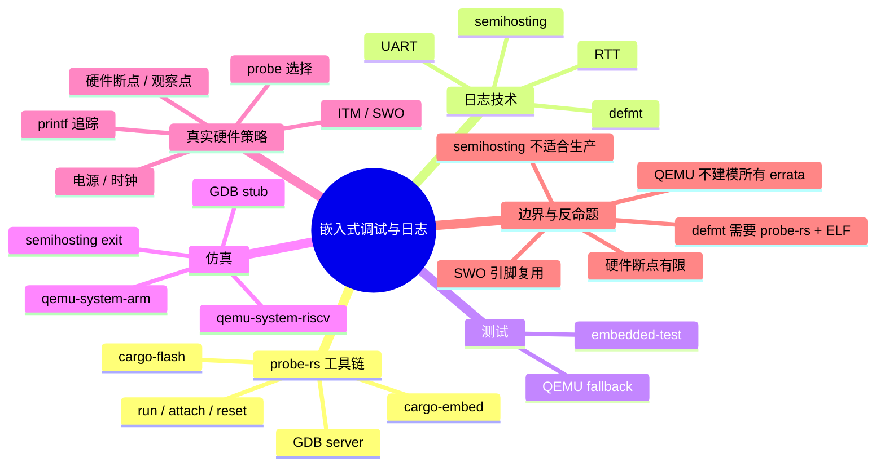

> **内容分级**: [专家级]
>
> **本节关键术语**: probe-rs · defmt · RTT · semihosting · ITM · SWO · embedded-test · QEMU · DAPLink · ST-Link · J-Link · OpenOCD — [完整对照表](../../00_meta/01_terminology/01_terminology_glossary.md)

# 嵌入式调试与日志

> **EN**: Embedded Debugging and Logging
> **Summary**: Rust embedded debugging and logging: probe-rs, defmt, RTT, semihosting, embedded-test, QEMU emulation, and real-hardware strategies for observability under resource constraints.
> **Rust 版本**: 1.97.0+ (Edition 2024)
>
> **受众**: [进阶]
> **Bloom 层级**: L3-L4
> **权威来源**: 本文件为 `concept/` 权威页。
> **A/S/P 标记**: **S+A+P** — Structure + Application + Procedure
> **双维定位**: P×App — 应用嵌入式调试与日志技术解决实际硬件问题
> **定位**: 系统梳理 Rust 嵌入式开发中的调试与日志技术——从 probe-rs 工具链到 defmt 帧格式、RTT/semihosting/UART 选型、embedded-test 与 QEMU 仿真，再到真实硬件调试策略。
> **前置概念**: [Rust 嵌入式系统开发](03_embedded_systems.md)
> **后置概念**: [实时操作系统](../06_data_and_distributed/01_application_domains.md) ·
> [性能优化](../10_performance/01_performance_optimization.md)

---

> **来源**: [probe-rs](https://probe.rs/) ·
> [probe-rs crate](https://crates.io/crates/probe-rs) ·
> [defmt](https://defmt.ferrous-systems.com/) ·
> [defmt crate](https://crates.io/crates/defmt) ·
> [Knurling](https://knurling.ferrous-systems.com/) ·
> [RTT target](https://github.com/probe-rs/rtt-target) ·
> [embedded-test](https://github.com/probe-rs/embedded-test) ·
> [The Embedded Rust Book](https://docs.rust-embedded.org/book/index.html) ·
> [OpenOCD](https://openocd.org/) ·
> [QEMU](https://www.qemu.org/)

---

## 📑 目录

- [嵌入式调试与日志](#嵌入式调试与日志)
  - [📑 目录](#-目录)
  - [一、probe-rs 工作流](#一probe-rs-工作流)
    - [1.1 架构与核心工具](#11-架构与核心工具)
    - [1.2 cargo-embed 与 cargo-flash](#12-cargo-embed-与-cargo-flash)
    - [1.3 probe-rs run / attach / reset](#13-probe-rs-run--attach--reset)
    - [1.4 probe-rs 与 OpenOCD / J-Link GDB server 对比](#14-probe-rs-与-openocd--j-link-gdb-server-对比)
  - [二、defmt 帧格式与限制](#二defmt-帧格式与限制)
    - [2.1 Deferred formatting 原理](#21-deferred-formatting-原理)
    - [2.2 字符串驻留与编码](#22-字符串驻留与编码)
    - [2.3 主机端格式化](#23-主机端格式化)
    - [2.4 何时不应使用 defmt](#24-何时不应使用-defmt)
  - [三、RTT 与 semihosting 对比](#三rtt-与-semihosting-对比)
    - [3.1 RTT（rtt-target / rtt-log）](#31-rttrtt-target--rtt-log)
    - [3.2 Semihosting](#32-semihosting)
    - [3.2.1 Semihosting 权威来源映射](#321-semihosting-权威来源映射)
    - [3.3 UART 日志](#33-uart-日志)
    - [3.4 四者综合对比](#34-四者综合对比)
  - [四、embedded-test](#四embedded-test)
    - [4.1 crate 与 HAL 集成](#41-crate-与-hal-集成)
    - [4.2 在目标上运行测试](#42-在目标上运行测试)
    - [4.3 QEMU fallback](#43-qemu-fallback)
  - [五、QEMU 仿真调试](#五qemu-仿真调试)
    - [5.1 qemu-system-arm / RISC-V](#51-qemu-system-arm--risc-v)
    - [5.2 Semihosting exit 与 GDB stub](#52-semihosting-exit-与-gdb-stub)
    - [5.3 与 cargo 集成](#53-与-cargo-集成)
    - [5.4 QEMU 仿真权威来源映射](#54-qemu-仿真权威来源映射)
  - [六、真实硬件调试策略](#六真实硬件调试策略)
    - [6.1 printf 式追踪](#61-printf-式追踪)
    - [6.2 ITM / SWO](#62-itm--swo)
    - [6.3 硬件断点与观察点](#63-硬件断点与观察点)
    - [6.4 电源与时钟问题](#64-电源与时钟问题)
    - [6.5 Probe 选择](#65-probe-选择)
  - [七、反命题与边界分析](#七反命题与边界分析)
    - [7.1 边界 1：defmt 不能用于通用 UART-only 场景](#71-边界-1defmt-不能用于通用-uart-only-场景)
    - [7.2 边界 2：semihosting 太慢，不能用于生产环境](#72-边界-2semihosting-太慢不能用于生产环境)
    - [7.3 边界 3：QEMU 不建模所有硬件 errata](#73-边界-3qemu-不建模所有硬件-errata)
    - [7.4 边界 4：硬件断点数量受限于 MCU](#74-边界-4硬件断点数量受限于-mcu)
    - [7.5 边界 5：SWO 引脚复用可能牺牲 GPIO](#75-边界-5swo-引脚复用可能牺牲-gpio)
  - [八、权威来源索引](#八权威来源索引)
  - [反例 / 边界测试 / 常见陷阱](#反例--边界测试--常见陷阱)
    - [tight loop 中无节制 RTT 日志导致静默丢日志](#tight-loop-中无节制-rtt-日志导致静默丢日志)
  - [相关概念](#相关概念)
  - [🧭 思维导图（Mindmap）](#-思维导图mindmap)

---

## 一、probe-rs 工作流

**[probe-rs](https://probe.rs/)** 是 Rust 嵌入式生态的事实标准调试与烧录工具链。它用 Rust 重写并统一了原本分散在 OpenOCD、J-Link Commander、ST-Link Utility 等工具中的能力，提供从固件烧录、实时日志到交互式调试的端到端工作流。

### 1.1 架构与核心工具

```text
probe-rs 架构:

  高层 CLI:
  ├── cargo-flash   : 编译 + 烧录
  ├── cargo-embed   : 烧录 + RTT 日志 + 配置脚本
  └── probe-rs      : 底层通用 CLI (run/attach/reset/gdb/dap)

  库层 (probe-rs crate):
  ├── Probe         : 枚举/选择调试器
  ├── Session       : 目标连接与会话管理
  ├── Core          : 寄存器/内存/断点/单步
  └── FlashLoader   : 片内 Flash 算法

  后端驱动:
  ├── CMSIS-DAP / DAPLink
  ├── ST-Link (V2/V3)
  ├── J-Link
  └── FTDI (部分支持)
```

probe-rs 的关键设计决策是 **把目标芯片描述（YAML 格式的 target 定义）与调试器协议分离**。开发者不需要为每个芯片写 OpenOCD 脚本；probe-rs 内置了数百个 ARM Cortex-M/R/A、RISC-V 目标的 Flash 算法与内存映射。

### 1.2 cargo-embed 与 cargo-flash

| 工具 | 主要用途 | 典型工作流 |
|:---|:---|:---|
| **`cargo-flash`** | 编译并烧录 | `cargo flash --chip nRF52840_xxAA --release` |
| **`cargo-embed`** | 烧录 + RTT 日志 + 交互配置 | `cargo embed --release`，按 `Embed.toml` 配置 |

`cargo-embed` 依赖 `Embed.toml` 配置文件：

```toml
# Embed.toml
[default.general]
chip = "nRF52840_xxAA"

[default.rtt]
enabled = true
channels = [
    { up = 0, name = "defmt", format = "Defmt" },
    { up = 1, name = "log", format = "String" },
]

[default.gdb]
enabled = false
```

`cargo-embed` 在 CI 中常用于“烧录 + 持续监听 RTT 通道”，比单独调用 `cargo flash` 后再用 `probe-rs run` 更省事。

### 1.3 probe-rs run / attach / reset

`probe-rs` CLI 是脚本化和自动化的基础：

```bash
# 烧录并运行，自动监听 RTT/defmt
probe-rs run --chip nRF52840_xxAA target/thumbv7em-none-eabihf/release/app

# 附加到已运行目标，不重置芯片（调试生产现场问题）
probe-rs attach --chip nRF52840_xxAA --probe 1366:0101

# 软复位目标
probe-rs reset --chip nRF52840_xxAA

# 擦除整片 Flash
probe-rs erase --chip nRF52840_xxAA

# 启动 GDB server，端口 1337
probe-rs gdb --chip nRF52840_xxAA --protocol swd --speed 4000
```

`attach` 与 `run` 的区别在真实调试中非常关键：`run` 会触发复位并从复位向量开始执行；`attach` 连接到当前运行状态，适合查看死锁或已经宕机的设备。

### 1.4 probe-rs 与 OpenOCD / J-Link GDB server 对比

| 维度 | **probe-rs** | **OpenOCD** | **J-Link GDB Server** |
|:---|:---|:---|:---|
| **定位** | Rust 原生、一体化工具链 | 通用、脚本化的 Open On-Chip Debugger | SEGGER 官方闭源 GDB server |
| **协议** | SWD/JTAG，CMSIS-DAP/ST-Link/J-Link | SWD/JTAG，适配器极多 | SWD/JTAG，仅限 J-Link |
| **配置方式** | YAML target 定义 + `Embed.toml` | TCL 脚本 (`interface/ target/ board`) | GUI/CLI 参数 |
| **Rust 集成** | `cargo-flash`/`cargo-embed` 原生集成 | 需手动 `arm-none-eabi-gdb` + `.gdbinit` | 需手动启动 server 再连 GDB |
| **RTT 支持** | 原生，自动解码 defmt | 需配置 `rtt` 命令 | 通过 J-Link RTT Viewer |
| **Flash 算法** | 内置 Rust 实现 | 社区 target 脚本 | J-Link 内置 |
| **跨平台** | 优秀（纯 Rust，预编译二进制） | 良好（需编译/包管理） | Windows/Linux/macOS 官方二进制 |
| **定制芯片** | 提交 YAML 即可扩展 | 需写 TCL 配置 | 依赖 SEGGER 支持 |
| **GDB 兼容性** | 通过 `probe-rs gdb` | 原生 server | 原生 server |

**选型建议**：

- **新项目/主流 MCU**：优先 probe-rs，开发体验最佳。
- **小众芯片或高度定制板**：OpenOCD 灵活性更高。
- **已有 J-Link 生态且团队熟悉 SEGGER 工具**：可保留 J-Link GDB Server，同时用 probe-rs 做 RTT 日志。

---

## 二、defmt 帧格式与限制

**[defmt](https://defmt.ferrous-systems.com/)**（deferred formatting）是 Knurling 项目推出的极端轻量日志框架。它的核心思想是 **把字符串格式化从目标端推迟到主机端**，从而显著降低固件体积与运行时开销。

### 2.1 Deferred formatting 原理

传统日志（如 `rtt-target` 或 `log` crate）在目标端完成格式化：

```text
传统日志:
  目标端: format!("temp={:.2}C, adc={}", t, adc) -> "temp=23.50C, adc=1023"
  传输  : 完整字符串字节
  主机端: 直接显示

defmt:
  目标端: 只发送 (message_id, raw_args...) 紧凑二进制帧
  传输  : 少量字节（通常 < 20 字节）
  主机端: 根据编译期驻留的格式字符串还原为可读日志
```

目标端无需携带 `core::fmt` 的格式化实现，因此 panic/日志字符串表、浮点格式化代码等都被剥离。

### 2.2 字符串驻留与编码

defmt 在编译期扫描源码中的日志调用，把所有格式字符串和枚举标签驻留在 ELF 文件的专用段中。运行时只传输：

- **Message index**：指向驻留字符串表的索引（1–2 字节）。
- **参数原始值**：整数、浮点、切片长度等，按类型编码。
- **切片数据**：如 `[u8]`、`str` 等动态长度数据紧跟其后。

```rust,ignore
// 目标端代码示例
defmt::info!("Temperature: {}.{} C", t / 100, t % 100);
```

运行时目标端不会格式化 `"Temperature: 25.30 C"`；它只发送 message index 和两个 `u16`/`u32` 原始值。主机端的 `probe-rs`/`cargo-embed` 读取 ELF 中的 `.defmt` 段，用同一版 `defmt` 解码。

### 2.3 主机端格式化

主机端格式化依赖 **构建产物 ELF 文件**。因此：

- 烧录时必须保留对应版本的 ELF；
- 不同编译优化级别或不同 `defmt` 版本可能导致解码失败；
- CI 中应将 ELF 作为 artifact 保存。

```text
defmt 数据流:

  编译期:
    源码调用 defmt::info!("x={}", x)
    └── 生成 .defmt 段（格式字符串 + 类型表）

  运行时:
    目标端发送 [msg_id: u16][x: u32]
    probe-rs 读取 ELF .defmt 段
    主机端输出 "x=42"
```

### 2.4 何时不应使用 defmt

defmt 的限制需要被清楚理解：

- **无法用于通用 UART-only 调试器**：defmt 需要 probe-rs 或兼容主机端解析 ELF；如果你只有串口转 USB 模块，`rtt-target` 或 `uart` 日志更合适。
- **切片/动态数据增大帧体积**：虽然比格式化字符串小，但大量二进制数据仍可能填满 RTT buffer。
- **解码依赖 ELF 与版本对齐**：现场调试时必须持有完全对应的 ELF，否则日志不可读。
- **动态格式字符串不支持**：`defmt::info!("{}", some_dynamic_string)` 只能传输已知的切片，不能动态构造格式模板。

```rust,ignore
// ❌ 错误：动态格式模板不被支持
let fmt = "x={}";
defmt::info!("{}", fmt, x); // 行为不符合直觉

// ✅ 正确：所有模板必须在编译期字面量中
defmt::info!("x={}", x);
```

---

## 三、RTT 与 semihosting 对比

### 3.1 RTT（rtt-target / rtt-log）

**RTT（Real-Time Transfer）** 是 SEGGER 提出的一种低开销双向通信机制，后被 probe-rs 开源实现。它使用目标 RAM 中的一组环形缓冲区，调试器通过 SWD/JTAG 在后台持续读取，无需额外 UART/USB 外设。

```rust,ignore
// 使用 rtt-target 示例
use rtt_target::{rtt_init_print, rprintln};

fn main() -> ! {
    rtt_init_print!();
    loop {
        rprintln!("Sensor: {}", read_sensor());
    }
}
```

[rtt-target](https://github.com/probe-rs/rtt-target) 是 probe-rs 生态下的 no_std RTT 实现。rtt-log 则是把 `log` crate 的日志后端桥接到 RTT。

RTT 优点：

- **速度快**：可达 MB/s 级别；
- **非侵入式**：不占用 UART/USB 外设；
- **双向**：可同时做日志输出和命令输入。

RTT 限制：

- 需要调试器持续连接；
- RAM 中需预留环形缓冲区；
- 掉线时日志会丢失。

### 3.2 Semihosting

**Semihosting** 让目标固件通过调试器调用主机端功能（如 `printf`、文件 I/O、`exit`）。在 ARM Cortex-M 上通常通过 `BKPT 0xAB` 陷阱实现。

```rust,ignore
// cortex-m-semihosting 示例
use cortex_m_semihosting::hprintln;

fn main() -> ! {
    loop {
        hprintln!("Hello from target").unwrap();
    }
}
```

Semihosting 优点：

- **零外设依赖**：只要有调试器即可输出；
- **可调用主机 `exit`**：测试框架可通知主机测试结束。

Semihosting 缺点：

- **极慢**：每次输出都触发断点/陷阱，调试器介入；
- **不适合生产**：会显著改变时序，无法在产品中启用；
- **仅当调试器连接时工作**。

### 3.2.1 Semihosting 权威来源映射

> [The Embedded Rust Book — Semihosting](https://docs.rust-embedded.org/book/start/semihosting.html) 与 ARM 半主机规范定义了目标固件通过调试器调用主机服务的标准接口。在 ARM Cortex-M 上，这一机制通常通过 `BKPT 0xAB` 陷阱实现，对应的 Rust 封装为 [`cortex-m-semihosting`](https://docs.rs/cortex-m-semihosting/)。

| 能力 | 标准/实现 | 典型用途 |
|:---|:---|:---|
| 字符/字符串输出 | `cortex_m_semihosting::hprintln!` | 启动阶段简单日志 |
| 主机文件 I/O | `cortex_m_semihosting::fs` / `sh` | 测试固件读取参考数据 |
| 程序退出 | `cortex_m_semihosting::debug::exit` | QEMU/测试框架报告结果 |
| 调试器依赖 | ARM Semihosting ABI | 仅在连接调试器时工作 |

判定依据：Semihosting 是“零外设”调试输出的权威方案，但因其陷阱开销，只适用于 bring-up、CI/QEMU 与测试退出场景，不能用于生产实时路径。

> **来源**: [The Embedded Rust Book — Semihosting](https://docs.rust-embedded.org/book/start/semihosting.html) · [ARM Semihosting ABI](https://developer.arm.com/documentation/100863/latest/) · [cortex-m-semihosting crate](https://docs.rs/cortex-m-semihosting/)

### 3.3 UART 日志

UART（通用异步收发器）是最传统的嵌入式日志输出方式：

```rust,ignore
// 使用 embedded-hal UART trait 输出日志
use embedded_hal::serial::Write;
use nb::block;

fn log_uart(uart: &mut impl Write<u8>, msg: &str) {
    for b in msg.as_bytes() {
        block!(uart.write(*b)).ok();
    }
}
```

UART 优点：

- 不依赖调试器，适合现场部署与长期监测；
- 几乎所有 MCU 都有 UART；
- 可直连 PC、蓝牙模块、LoRa 等。

UART 缺点：

- 需要占用 UART 外设和引脚；
- 波特率/电平需要匹配；
- 格式化在目标端完成，体积与开销较大。

### 3.4 四者综合对比

| 维度 | **defmt** | **RTT** | **Semihosting** | **UART** |
|:---|:---|:---|:---|:---|
| **目标端开销** | 极低（只发原始数据） | 低（写 RAM 环形缓冲） | 极高（每次陷阱） | 中（格式化 + 串口发送） |
| **主机端依赖** | probe-rs + ELF | probe-rs / J-Link 调试器 | 调试器 + semihosting 支持 | 串口转 USB / 逻辑分析仪 |
| **速度** | 很快 | 很快 | 很慢 | 受波特率限制 |
| **是否适合生产** | ✅ 是 | ✅ 是（若保留调试器） | ❌ 否 | ✅ 是 |
| **是否需要额外引脚** | 否 | 否 | 否 | 是（TX/RX） |
| **格式化位置** | 主机端 | 目标端 | 目标端 | 目标端 |
| **动态格式字符串** | ❌ 不支持 | ✅ 支持 | ✅ 支持 | ✅ 支持 |
| **典型场景** | 开发阶段密集日志 | 开发阶段实时日志 | 测试退出/简单输出 | 现场监测/长期日志 |

> **选型洞察**：资源极度受限时优先 defmt；需要零外设依赖的测试退出用 semihosting；需要现场独立运行用 UART；日常开发最常用 RTT。

---

## 四、embedded-test

**[embedded-test](https://github.com/probe-rs/embedded-test)** 是 probe-rs 团队推出的在真实硬件上运行 `#[test]` 风格单元/集成测试的框架。

### 4.1 crate 与 HAL 集成

embedded-test 把标准库的测试运行时代替为 `no_std` 版本，并通过 probe-rs 把测试二进制烧录到目标后收集结果。它要求 HAL/BSP 提供少量 trait 实现（时钟初始化、空闲循环等）。

```rust,ignore
// tests/on_target.rs（示例结构）
#![no_std]
#![no_main]

use embedded_test::fixtures;

#[embedded_test::tests]
mod tests {
    #[init]
    fn init() {
        // 初始化 HAL/时钟
    }

    #[test]
    fn gpio_blink() {
        // 驱动 LED，断言引脚状态
        assert!(true);
    }

    #[test]
    fn sensor_read_non_zero() {
        let v = read_sensor();
        assert_ne!(v, 0);
    }
}
```

### 4.2 在目标上运行测试

```bash
# 在真实硬件上运行 tests/ 目录下的测试
cargo test --tests --target thumbv7em-none-eabihf

# embedded-test 通过 Cargo runner 调用 probe-rs
# .cargo/config.toml 中配置：
# [target.thumbv7em-none-eabihf]
# runner = "probe-rs run --chip nRF52840_xxAA"
```

测试结果通过 RTT 或 semihosting `exit` 传回主机，`cargo test` 的退出码反映测试是否通过，可无缝集成到 CI。

### 4.3 QEMU fallback

没有硬件时，可用 QEMU 作为 fallback：

```bash
# 使用 qemu-system-arm 运行同一测试镜像
qemu-system-arm -machine micro:bit -semihosting -kernel target/thumbv7em-none-eabi/debug/deps/app-xxx
```

QEMU fallback 的关键价值：

- CI 中不需要真实硬件即可做基础回归；
- 快速反馈算法逻辑错误；
- 但无法验证真实时序、外设行为或硬件 errata。

---

## 五、QEMU 仿真调试

**[QEMU](https://www.qemu.org/)** 是嵌入式开发中不可或缺的仿真器，可在没有真实硬件的情况下验证启动流程、算法逻辑和调试脚本。

### 5.1 qemu-system-arm / RISC-V

```bash
# ARM Cortex-M 示例（micro:bit / nRF51）
qemu-system-arm -machine micro:bit -semihosting \
    -kernel target/thumbv6m-none-eabi/release/app

# RISC-V 示例（HiFive1）
qemu-system-riscv32 -machine sifive_e -nographic \
    -kernel target/riscv32imac-unknown-none-elf/release/app
```

QEMU 支持的机器模型通过 `qemu-system-arm -machine help` 列出。选择机器模型时必须确认：

- 是否包含目标 MCU 的外设？
- 是否支持 semihosting exit？
- 是否支持 GDB stub？

### 5.2 Semihosting exit 与 GDB stub

Semihosting `SYS_EXIT` 让测试或示例在 QEMU 中正常结束：

```rust,ignore
// 使用 cortex-m-semihosting 退出
use cortex_m_semihosting::debug;

debug::exit(debug::EXIT_SUCCESS);
```

GDB stub 允许在主机端单步调试：

```bash
# QEMU 启动 GDB server，端口 1234
qemu-system-arm -machine micro:bit -semihosting \
    -kernel target/thumbv6m-none-eabi/release/app \
    -S -gdb tcp::1234

# 在另一个终端连接
arm-none-eabi-gdb target/thumbv6m-none-eabi/release/app \
    -ex "target remote :1234"
```

### 5.3 与 cargo 集成

常见做法是在 `.cargo/config.toml` 中把 runner 指向脚本：

```toml
[target.thumbv6m-none-eabi]
runner = "qemu-system-arm -machine micro:bit -semihosting -kernel"
```

然后 `cargo run` 会自动调用 QEMU。配合 `cortex-m-rt` 的 `exit` 支持，可实现“编译-仿真-退出”一键闭环。

### 5.4 QEMU 仿真权威来源映射

> [QEMU](https://www.qemu.org/) 是嵌入式开发中功能级仿真的权威工具。[The Embedded Rust Book — QEMU](https://docs.rust-embedded.org/book/start/qemu.html) 展示了如何在不连接真实硬件的情况下验证启动流程、`semihosting` 输出与单元测试。QEMU 的机器模型由 `qemu-system-arm -machine help` / `qemu-system-riscv32 -machine help` 列出，选择模型时必须确认外设覆盖度与 semihosting/GDB stub 支持。

| 仿真目标 | QEMU 机器模型 | 关键验证点 |
|:---|:---|:---|
| ARM Cortex-M (micro:bit / nRF51) | `micro:bit`、`netduinoplus2` 等 | 启动流程、semihosting `exit`、GDB stub |
| RISC-V (HiFive1 / E310) | `sifive_e`、`sifive_u` | 启动代码、中断向量、外设寄存器 |
| 自定义目标 | 自定义 device tree / machine 参数 | 链接脚本、内存布局、启动顺序 |

判定依据：QEMU 适合作为算法与启动流程的回归平台，但**不能替代真实硬件验证**——它不精确建模外设时序、硬件 errata 与低功耗行为。最终测试必须在目标硬件上完成。

> **来源**: [QEMU 官方文档](https://www.qemu.org/docs/master/) · [The Embedded Rust Book — QEMU](https://docs.rust-embedded.org/book/start/qemu.html) · [cortex-m-quickstart QEMU 示例](https://github.com/rust-embedded/cortex-m-quickstart)

---

## 六、真实硬件调试策略

### 6.1 printf 式追踪

printf 式追踪是最高性价比的调试手段，但需谨慎使用：

- **避免在 ISR 中大量使用**：格式化与输出可能破坏实时性。
- **使用 defmt 降低开销**：把格式化推到主机端。
- **添加时间戳**：用 DWT cycle counter 或 RTC 给日志加时间戳。

```rust,ignore
// 使用 DWT  cycle counter 做时间戳
use cortex_m::peripheral::DWT;

defmt::info!("[{}] event", DWT::get_cycle_count());
```

### 6.2 ITM / SWO

**ITM（Instrumentation Trace Macrocell）** 和 **SWO（Serial Wire Output）** 是 ARM Cortex-M 的硬件跟踪能力：

- **SWO**：单线输出，通过 SWD 接口的额外引脚发送跟踪数据；
- **ITM**：32 个 stimulus port，可输出软件日志和事件；
- **DWT**：数据观察点和跟踪，可输出 PC 采样、异常入口等。

```rust,ignore
// 使用 cortex-m crate 配置 ITM
use cortex_m::peripheral::ITM;

unsafe {
    (*ITM::ptr()).stim[0].write('A' as u32);
}
```

SWO 的优势是 **不占用 RAM 环形缓冲区**，也不占用 UART；但：

- 需要支持 SWO 的调试器（部分 CMSIS-DAP 不支持）；
- SWO 引脚可能被 GPIO 复用，需要硬件设计预留。

### 6.3 硬件断点与观察点

ARM Cortex-M 的 **FPB（Flash Patch and Breakpoint）** 提供有限数量的硬件断点；DWT 提供数据观察点。

| 资源 | Cortex-M3/M4 | Cortex-M7 | 典型数量 |
|:---|:---|:---|:---:|
| **硬件断点** | FPB comparator | FPB comparator | 4–6 个 |
| **数据观察点** | DWT comparator | DWT comparator | 2–4 个 |

**调试策略**：

- 把硬件断点用在最难复现的代码路径；
- 用数据观察点监控全局状态被意外修改的位置；
- 断点不足时，改用条件断点或临时日志。

### 6.4 电源与时钟问题

真实硬件调试中约有一半的“软件 bug”实际根源于电源或时钟：

- **欠压复位（BOR）**：电源波动导致 MCU 反复复位；
- **时钟未使能**：外设时钟未在 RCC 中开启；
- **调试接口被关闭**：程序把 SWD 引脚复用为 GPIO 后 probe-rs 无法连接；
- **Sleep 模式影响调试器连接**：Deep sleep 会关闭调试域时钟。

```text
排查清单:
  1. 测量电源轨是否在规格范围内
  2. 确认目标芯片时钟配置正确
  3. 检查 SWD/JTAG 引脚是否被复用
  4. 确认未进入完全关闭调试接口的低功耗模式
  5. 使用 --connect-under-reset 在复位下连接
```

### 6.5 Probe 选择

| Probe | 价格 | 支持协议 | 推荐场景 |
|:---|:---:|:---|:---|
| **DAPLink / CMSIS-DAP** | 低 | SWD | 开源/教育/成本敏感项目 |
| **ST-Link V2/V3** | 中 | SWD/JTAG | STM32 开发 |
| **J-Link EDU / Base** | 中高 | SWD/JTAG + RTT + SWO | 商业开发、高级跟踪 |
| **Black Magic Probe** | 中 | SWD/JTAG | 开源爱好者、无线调试 |

---

## 七、反命题与边界分析

### 7.1 边界 1：defmt 不能用于通用 UART-only 场景

**命题**：“defmt 是最先进的日志方案，所有项目都应该使用。”

**现实**：defmt 依赖 probe-rs 读取 ELF 并解码 `.defmt` 段。如果你只有 USB-UART 转接模块、没有调试器，defmt 无法工作。此时应使用传统 `rtt-target`（如果有调试器）或直接 UART `fmt::Write`。

### 7.2 边界 2：semihosting 太慢，不能用于生产环境

**命题**：“semihosting 很方便，可以在产品中保留少量日志。”

**现实**：semihosting 每次输出都会触发调试器陷阱，时延可达毫秒级，且会完全阻塞目标执行直到调试器响应。它只适合测试退出和初始 bring-up，**绝不能用于生产日志或实时路径**。

### 7.3 边界 3：QEMU 不建模所有硬件 errata

**命题**：“代码在 QEMU 中通过测试，就可以认为在真实硬件上没问题。”

**现实**：QEMU 的 MCU 模型通常是功能级模型，可能不精确模拟：

- 外设时序与延迟；
- 硬件 errata 和硅片缺陷；
- 低功耗模式与复位行为；
- 缓存一致性（Cortex-M7 等）。

因此 QEMU 适合做算法与启动流程回归，**最终验证必须在真实硬件上完成**。

### 7.4 边界 4：硬件断点数量受限于 MCU

**命题**：“我可以像桌面调试一样设置很多断点。”

**现实**：Cortex-M 的硬件断点通常只有 4–6 个。超出数量后，调试器可能改用软件断点（在 Flash 中写 `BKPT` 指令），但软件断点在 XIP Flash 或只读存储器上不可用。调试脚本需要预先规划关键断点。

### 7.5 边界 5：SWO 引脚复用可能牺牲 GPIO

**命题**：“SWO 是免费的高速日志通道。”

**现实**：SWO 通常与某个 GPIO 引脚复用。启用 SWO 后，该引脚不能再用于通用 I/O。在引脚紧张的封装中，这可能意味着牺牲一个传感器接口或 LED。硬件设计阶段需权衡。

---

## 八、权威来源索引

- **probe-rs** — [https://probe.rs/](https://probe.rs/)
- **defmt** — [https://defmt.ferrous-systems.com/](https://defmt.ferrous-systems.com/)
- **Knurling** — [https://knurling.ferrous-systems.com/](https://knurling.ferrous-systems.com/)
- **rtt-target** — [https://github.com/probe-rs/rtt-target](https://github.com/probe-rs/rtt-target)
- **embedded-test** — [https://github.com/probe-rs/embedded-test](https://github.com/probe-rs/embedded-test)
- **The Embedded Rust Book** — [https://docs.rust-embedded.org/book/index.html](https://docs.rust-embedded.org/book/index.html)
- **OpenOCD** — [https://openocd.org/](https://openocd.org/)
- **QEMU** — [https://www.qemu.org/](https://www.qemu.org/)
- **A Survey of Rust Embedded Development (arXiv)** — [https://arxiv.org/abs/2311.05063](https://arxiv.org/abs/2311.05063)
- **SEGGER J-Link** — [https://www.segger.com/products/debug-probes/j-link/](https://www.segger.com/products/debug-probes/j-link/)
- **ARM Cortex-M 调试技术参考** — [https://developer.arm.com/documentation/ddi0403/latest/](https://developer.arm.com/documentation/ddi0403/latest/)

> **相关文件**: [Rust 嵌入式系统开发](03_embedded_systems.md) ·
> [安全关键系统工程](../11_domain_applications/23_safety_critical_systems_engineering.md) ·
> [性能优化](../10_performance/01_performance_optimization.md)
>
> **文档版本**: 1.0 ｜ **最后更新**: 2026-07-30 ｜ **状态**: ✅ 新建（Rust 1.97 对齐）

---

## 反例 / 边界测试 / 常见陷阱

### tight loop 中无节制 RTT 日志导致静默丢日志

**错误场景**：在传感器采样循环中每 1 ms 输出一条 `rprintln!` 日志，但主机端 `cargo-embed` 因 CPU 负载未能及时拉取 RTT up-buffer；日志被循环覆盖，出现大量缺失。

```rust,ignore
// ❌ 错误：高频循环中无流量控制地写 RTT
loop {
    let sample = adc.read(&mut pin).unwrap();
    rprintln!("adc={}", sample); // 若主机拉取慢，旧日志被覆盖
    delay_ms(1);
}
```

**为何错误**：RTT 本质上是目标 RAM 中的环形缓冲区；写入速度超过调试器读取速度时，新数据会覆盖尚未取出的旧数据，且不会报错。

**正确做法**：降低日志频率、聚合多条采样后再输出，或改用 `defmt` 减少单条日志字节数；对关键路径使用非覆盖模式（若 HAL 支持）并在主机端确保足够带宽。

---

## 相关概念

- [Rust vs C++：形式系统模型 vs 机制工程模型](../../05_comparative/01_systems_languages/01_rust_vs_cpp.md)
- [测试生态：单元测试、集成测试与验证策略](../../06_ecosystem/09_testing_and_quality/03_testing.md)

## 🧭 思维导图（Mindmap）



> **认知功能**: 本 mindmap 从工具链、日志、测试、仿真、真实硬件策略和边界六个维度组织内容，可作为调试技术选型和问题排查的导航索引。
