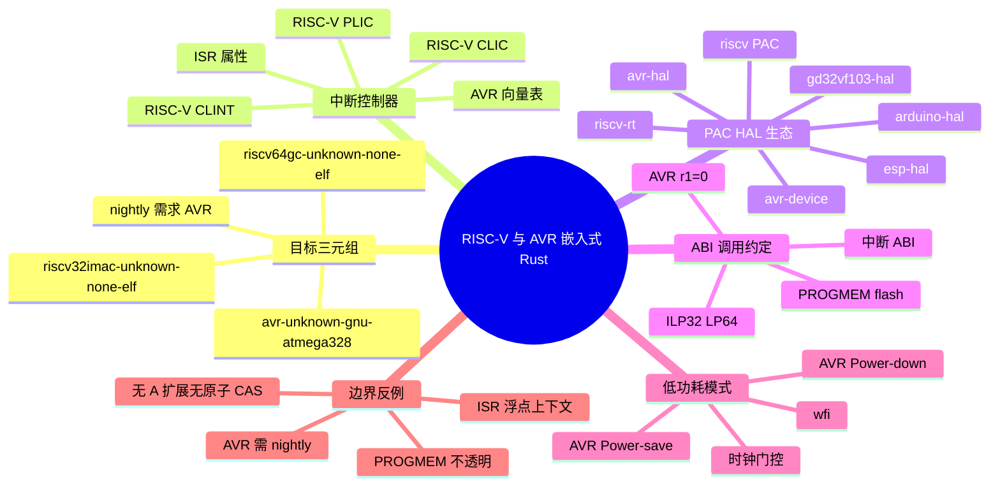

> **内容分级**: [专题级]
> **代码状态**: ⚠️ 含目标特定/需 nightly 片段；裸机与 AVR 代码块为说明性，非全平台可直编
> **定理链**: N/A — 工程架构/生态综述，不涉及形式化定理链
>
# RISC-V 与 AVR 嵌入式 Rust 开发
>
> **EN**: RISC-V and AVR Embedded Rust Development
> **Summary**: Authoritative guide to bare-metal Rust on RISC-V and AVR — target triples, interrupt controllers, PAC/HAL ecosystems, ABI/calling conventions, and low-power modes, with explicit boundary cases where Rust support diverges from mainstream Cortex-M.
> **Rust 版本**: 1.97.0+ (Edition 2024)
>
> **受众**: [进阶]
> **Bloom 层级**: L3-L4
> **权威来源**: 本文件为 `concept/` 权威页。
> **A/S/P 标记**: **S+A+P** — Structure + Application + Procedure
> **双维定位**: P×Sys — 架构并实现 RISC-V/AVR 资源受限系统
> **定位**: 系统对比 RISC-V 与 AVR 在 Rust 嵌入式生态中的目标三元组、中断架构、PAC/HAL 栈、ABI 约定与低功耗模式，帮助工程师在两款非 ARM 架构上做出技术选型与代码实现决策。
> **前置概念**: [Rust 嵌入式系统开发](03_embedded_systems.md) ·
> [交叉编译](02_cross_compilation.md) ·
> [Target Tier 平台支持全景](10_target_tier_platform_support.md)
> **后置概念**: [裸机与嵌入式中的 Async：no_std 异步运行时](11_async_no_std_embedded.md) ·
> [Rust 操作系统内核开发](05_os_kernel.md) ·
> [Embedded-HAL 1.0 迁移与 Embassy 生产状态](09_embedded_hal_1_0_migration.md)

---

> **来源**: [RISC-V Specifications](https://riscv.org/technical/specifications/) · [Rust Embedded Working Group — riscv-rt](https://github.com/rust-embedded/riscv-rt) · [Rust Embedded Working Group — riscv](https://github.com/rust-embedded/riscv) · [avr-rust GitHub](https://github.com/avr-rust) · [rahix/avr-hal](https://github.com/rahix/avr-hal) · [Embassy RISC-V support](https://embassy.dev/) · [RTIC](https://rtic.rs/) · [The Embedded Rust Book](https://docs.rust-embedded.org/book/index.html) · [A Survey of Rust Embedded Development (arXiv)](https://arxiv.org/abs/2311.05063) · [riscv-rt crate](https://docs.rs/riscv-rt/) · [riscv crate](https://docs.rs/riscv/) · [avr-rust organization](https://github.com/avr-rust)

---

## 📑 目录

- [RISC-V 与 AVR 嵌入式 Rust 开发](#risc-v-与-avr-嵌入式-rust-开发)
  - [📑 目录](#-目录)
  - [一、目标三元组与 Tier 状态](#一目标三元组与-tier-状态)
    - [1.1 RISC-V 目标三元组](#11-risc-v-目标三元组)
    - [1.2 AVR 目标三元组](#12-avr-目标三元组)
    - [1.3 安装与切换目标](#13-安装与切换目标)
  - [二、中断控制器](#二中断控制器)
    - [2.1 RISC-V 中断架构：CLINT / PLIC / CLIC](#21-risc-v-中断架构clint--plic--clic)
    - [2.2 AVR 中断向量表与 ISR 属性](#22-avr-中断向量表与-isr-属性)
  - [三、PAC / HAL 生态](#三pac--hal-生态)
    - [3.1 RISC-V PAC / HAL 栈](#31-risc-v-pac--hal-栈)
    - [3.2 AVR PAC / HAL 栈](#32-avr-pac--hal-栈)
  - [四、ABI 与调用约定](#四abi-与调用约定)
    - [4.1 RISC-V ABI](#41-risc-v-abi)
    - [4.2 AVR ABI](#42-avr-abi)
  - [五、低功耗模式](#五低功耗模式)
    - [5.1 RISC-V 低功耗](#51-risc-v-低功耗)
    - [5.2 AVR 睡眠模式](#52-avr-睡眠模式)
  - [六、RISC-V vs AVR 对比](#六risc-v-vs-avr-对比)
  - [七、边界与反例](#七边界与反例)
    - [边界 1：AVR Rust 不是 Tier 1 且需要 nightly](#边界-1avr-rust-不是-tier-1-且需要-nightly)
    - [边界 2：RISC-V 没有 A 扩展时无法提供原生原子 CAS](#边界-2risc-v-没有-a-扩展时无法提供原生原子-cas)
    - [边界 3：AVR 的 PROGMEM 字符串对 Rust 不透明](#边界-3avr-的-progmem-字符串对-rust-不透明)
    - [边界 4：RISC-V 中断向量表不保存浮点状态](#边界-4risc-v-中断向量表不保存浮点状态)
  - [八、常见陷阱](#八常见陷阱)
  - [九、权威来源索引](#九权威来源索引)
  - [十、实测案例](#十实测案例)
  - [相关概念](#相关概念)
  - [🧭 思维导图（Mindmap）](#-思维导图mindmap)

---

## 一、目标三元组与 Tier 状态

Rust 的目标三元组（target triple）决定编译器生成的机器码、调用约定与链接脚本。RISC-V 与 AVR 同属非 ARM 嵌入式阵营，但成熟度与工具链路径差异显著。

### 1.1 RISC-V 目标三元组

RISC-V 采用模块化 ISA，目标名中的字母直接映射指令扩展：

| 目标三元组 | ISA 配置 | ABI | 典型用途 | Rust Tier |
|:---|:---|:---|:---|:---|
| `riscv32imac-unknown-none-elf` | RV32I + M（乘除）+ A（原子）+ C（压缩） | ilp32 | 通用 32-bit MCU（SiFive E24/E31、GD32VF103、ESP32-C3 兼容模式） | Tier 2 |
| `riscv32imc-unknown-none-elf` | RV32I + M + C | ilp32 | 更小面积、无原子扩展 | Tier 2 |
| `riscv64gc-unknown-none-elf` | RV64I + M + A + F + D + G（通用）+ C | lp64d | 64-bit 应用处理器、Linux-capable SoC 裸机 | Tier 2 |
| `riscv64imac-unknown-none-elf` | RV64I + M + A + C | lp64 | 64-bit 无浮点 | Tier 2 |
| `riscv32i-unknown-none-elf` | 仅 RV32I | ilp32 | 极简核心 | Tier 2 |

关键判定：

- **`-none-elf`** 表示无 OS、裸机 ELF 输出，与 ARM 的 `-none-eabi` 等价。
- **M 扩展** 提供硬件乘除；没有 M 时编译器调用 `__mulsi3` 等软实现。
- **A 扩展** 提供 `LR/SC` 原子指令；没有 A 时 `core::sync::atomic` 需要外部原子模拟（见 §七边界 2）。
- **C 扩展** 压缩指令（16-bit），显著降低 Flash 占用，推荐默认启用。

> **来源**: [The rustc book — Platform Support](https://doc.rust-lang.org/nightly/rustc/platform-support.html)

### 1.2 AVR 目标三元组

AVR 是 8-bit 哈佛架构 MCU 家族，Rust 支持长期处于 Tier 3/nightly 边界：

| 目标三元组 | 对应 MCU | 状态 |
|:---|:---|:---|
| `avr-unknown-gnu-atmega328` | ATmega328/P（Arduino Uno/Nano） | Tier 3，需 nightly |
| `avr-none` | 通用 AVR（实验性） | 实验性，无官方 std |
| 社区自定义 JSON | ATtiny85/84、ATmega32U4 等 | 依赖 `avr-hal` 与自定义 target spec |

工程现状：

- AVR Rust 在 1.97 时代**仍要求 nightly 工具链**，核心原因是 LLVM AVR 后端的历史性 bug 与 `#[interrupt]` ABI 的 Rust 端支持尚未完全稳定。
- 没有官方 rustup std 二进制；通常使用 `avr-hal` 模板仓库，通过 `cargo build -Z build-std=core --target avr-atmega328p.json` 自行构建 `core`。
- 常用自定义 target 文件名如 `avr-atmega328p.json`，内容指定 `cpu: "atmega328p"`、数据/代码布局与 `atomic-cas: false`（8-bit AVR 无原生 CAS）。

```json
{
  "arch": "avr",
  "cpu": "atmega328p",
  "data-layout": "e-P1-p:16:8-i8:8-i16:8-i32:8-i64:8-f32:8-f64:8-n8-a:8",
  "max-atomic-width": 8,
  "atomic-cas": false,
  "eh-frame-header": false,
  "exe-suffix": ".elf",
  "late-link-args": { "gcc": ["-mmcu=atmega328p"] },
  "linker": "avr-gcc",
  "llvm-target": "avr-unknown-unknown",
  "os": "none",
  "target-c-int-width": "16",
  "target-pointer-width": "16",
  "vendor": "unknown"
}
```

> **来源**: [avr-rust GitHub](https://github.com/avr-rust) · [rahix/avr-hal](https://github.com/rahix/avr-hal)

### 1.3 安装与切换目标

RISC-V Tier 2 目标可直接通过 rustup 安装：

```bash
rustup target add riscv32imac-unknown-none-elf
rustup target add riscv64gc-unknown-none-elf

cargo build --target riscv32imac-unknown-none-elf
```

AVR 没有 rustup 官方 target，通常使用 `avr-hal` 模板：

```bash
# 需 nightly
cargo install ravedude
rustup component add rust-src --toolchain nightly

# 在项目目录使用自定义 target JSON
cargo +nightly build -Z build-std=core --target avr-atmega328p.json
```

---

## 二、中断控制器

中断模型是 RISC-V 与 AVR 在 Rust 中差异最大的领域之一：RISC-V 把中断控制拆成多个可选标准扩展，而 AVR 采用固定的向量表 + 特定属性。

### 2.1 RISC-V 中断架构：CLINT / PLIC / CLIC

RISC-V 标准把中断控制拆成三个互补组件，芯片可选配：

| 组件 | 作用 | 优先级/向量 | 典型出现位置 |
|:---|:---|:---|:---|
| **CLINT**（Core-Local Interruptor） | 提供软件中断（MSIP）、定时器中断（MTIMECMP） | 无外部优先级，仅本地定时器 | 单核 MCU（SiFive E31、FE310） |
| **PLIC**（Platform-Level Interrupt Controller） | 外设中断路由、仲裁、优先级 | 可配置优先级与阈值，claim/complete 握手 | 多核/复杂 SoC（Kendryte K210、StarFive JH7110） |
| **CLIC**（Core-Local Interrupt Controller） | 低延迟、可抢占向量中断 | 多级优先级，硬件向量表 | 新兴实时 MCU |

**RISC-V 中断模式**：

- **Direct 模式**：所有异常与中断进入同一入口 `mtvec`，由软件分发。
- **Vectored 模式**：`mtvec.BASE` 对齐后，中断按 cause 号跳转到 `BASE + 4×cause` 的向量槽；异常仍进入 BASE。

```text
RISC-V 中断处理流程（PLIC）：

  外设发起 IRQ
    │
    ▼
  PLIC 接收并比对 priority
    │
    ▼
  若 priority > threshold 且使能 → 向 hart 发起待处理信号
    │
    ▼
  CPU 完成当前指令，进入异常入口（mtvec）
    │
    ▼
  软件读取 claim 寄存器获得中断 ID（原子认领）
    │
    ▼
  ISR 执行
    │
    ▼
  写 complete 寄存器通知 PLIC 该中断已处理完毕
```

Rust 中 `riscv-rt` 提供启动与中断框架。PLIC 通常由具体芯片 PAC 暴露：

```rust,ignore
// riscv-rt 典型入口 + 手动 PLIC claim/complete
#[riscv_rt::entry]
fn main() -> ! {
    // 初始化 PLIC：使能 UART0 中断、设置优先级
    unsafe {
        pac::PLIC::set_priority(pac::Interrupt::UART0, 1);
        pac::PLIC::enable(pac::Interrupt::UART0);
        pac::PLIC::set_threshold(0);
    }
    loop { riscv::asm::wfi(); }
}

#[riscv_rt::interrupt]
unsafe fn MachineExternal() {
    // 读取 claim，获取当前最高优先级中断 ID
    let id = pac::PLIC::claim();
    match id {
        pac::Interrupt::UART0 => uart0_isr(),
        _ => {}
    }
    // 写 complete 释放该中断
    pac::PLIC::complete(id);
}
```

> **来源**: [RISC-V Specifications](https://riscv.org/technical/specifications/) · [riscv-rt](https://github.com/rust-embedded/riscv-rt)

### 2.2 AVR 中断向量表与 ISR 属性

AVR 使用固定向量表，复位向量位于 Flash 底端 `0x0000`，随后按中断源顺序排列（如 INT0、TIMER0_COMPA、USART_RX 等）。Rust 中通过 `avr-device` + `avr-hal` 的 `#[interrupt]` 属性绑定 ISR。

```rust,ignore
// avr-device 中断属性示例（ATmega328P）
use avr_device::interrupt;
use core::cell::RefCell;

static COUNTER: interrupt::Mutex<RefCell<u8>> = interrupt::Mutex::new(RefCell::new(0));

#[interrupt(atmega328p)]
fn TIMER0_COMPA() {
    interrupt::free(|cs| {
        *COUNTER.borrow(cs).borrow_mut() += 1;
    });
}
```

关键约定：

- **`#[interrupt(atmega328p)]`** 由 `avr-device` 宏生成向量表条目，并保存/恢复寄存器上下文。
- **全局状态**必须用 `interrupt::Mutex<RefCell<T>>` 保护；AVR 无原子 CAS，Mutex 通过关全局中断实现临界区。
- **中断向量表大小**由芯片型号决定，未使用向量需指向默认 `__default_isr`。

---

## 三、PAC / HAL 生态

### 3.1 RISC-V PAC / HAL 栈

RISC-V Rust 生态依赖 `riscv`（通用寄存器/CSR 访问）、`riscv-rt`（启动/中断）、以及各芯片 PAC。

| crate / 项目 | 作用 | 成熟度 |
|:---|:---|:---|
| [`riscv`](https://github.com/rust-embedded/riscv) | 通用 RISC-V CSR、ASM 包装、PMP、中断使能 | 高，社区核心 |
| [`riscv-rt`](https://github.com/rust-embedded/riscv-rt) | 启动代码、默认 trap handler、中断入口 | 高 |
| `e310x` / `e310x-hal` | SiFive FE310-G000/G003 | 中等 |
| `gd32vf103-pac` / `gd32vf103-hal` | 兆易创新 GD32VF103（RISC-V 32-bit MCU） | 中等 |
| `longan-nano` | 基于 GD32VF103 的开发板 BSP | 示例级 |
| `esp-hal`（RISC-V 核心） | ESP32-C3/C6/H2 的 Wi-Fi/BLE 芯片 | 高，生产可用 |
| `hifive1-revb` BSP | SiFive HiFive1 Rev B | 示例级 |

示例：使用 `gd32vf103-hal` 闪烁 LED：

```rust,ignore
use gd32vf103_hal::{pac, prelude::*, rcu::Rcu};
use riscv_rt::entry;

#[entry]
fn main() -> ! {
    let dp = pac::Peripherals::take().unwrap();
    let mut rcu = dp.RCU.constrain();
    let mut gpioa = dp.GPIOA.split(&mut rcu.apb2);
    let mut led = gpioa.pa1.into_push_pull_output();

    loop {
        led.set_high().unwrap();
        riscv::delay::McycleDelay::new().delay_ms(1000);
        led.set_low().unwrap();
        riscv::delay::McycleDelay::new().delay_ms(1000);
    }
}
```

### 3.2 AVR PAC / HAL 栈

AVR Rust 生态集中在 `avr-device`（PAC，按芯片型号生成）和 `avr-hal`（跨芯片 HAL）。

| crate / 项目 | 作用 | 成熟度 |
|:---|:---|:---|
| [`avr-device`](https://github.com/Rahix/avr-device) | ATmega/ATtiny 的 PAC，svd2rust 生成 | 高 |
| [`avr-hal`](https://github.com/rahix/avr-hal) | 跨芯片 GPIO、USART、I2C、SPI、PWM、ADC trait | 高 |
| [`ravedude`](https://github.com/Rahix/ravedude) | cargo runner：自动烧录 + 串口监控 | 高 |
| Arduino support | `arduino-hal` 封装板级别名 | 中 |

支持的家族：ATmega328P、ATmega32U4、ATmega2560、ATmega4809、ATtiny85/84/88 等。

```rust,ignore
// Arduino Uno 闪烁示例（avr-hal）
#![no_std]
#![no_main]

use panic_halt as _;
use arduino_hal::prelude::*;
use arduino_hal::simple_pwm::*;

#[arduino_hal::entry]
fn main() -> ! {
    let dp = arduino_hal::Peripherals::take().unwrap();
    let pins = arduino_hal::pins!(dp);
    let mut led = pins.d13.into_output();

    loop {
        led.toggle();
        arduino_hal::delay_ms(1000);
    }
}
```

> **来源**: [rahix/avr-hal](https://github.com/rahix/avr-hal) · [avr-rust GitHub](https://github.com/avr-rust)

---

## 四、ABI 与调用约定

### 4.1 RISC-V ABI

RISC-V 调用约定由 ABI 字符串（ilp32 / ilp32f / ilp32d / lp64 / lp64f / lp64d）决定：

| ABI | X 寄存器宽度 | 浮点参数寄存器 | 适用目标 |
|:---|:---|:---|:---|
| ilp32 | 32-bit | 无（软浮点） | `riscv32imac-unknown-none-elf` |
| ilp32f | 32-bit | f0–f7（单精度） | 含 F 扩展的 MCU |
| ilp32d | 32-bit | f0–f7（双精度） | 含 D 扩展 |
| lp64 | 64-bit | 无 | `riscv64imac-unknown-none-elf` |
| lp64d | 64-bit | f0–f7（双精度） | `riscv64gc-unknown-none-elf` |

整数调用约定：

- 参数寄存器：`a0`–`a7`（x10–x17）。
- 返回值：`a0`、`a1`。
- 临时寄存器：调用者保存（t0–t6）。
- 被调用者保存：s0–s11、ra（x1）。

**中断 ABI**：RISC-V 标准未强制规定中断保存集，但 `riscv-rt` 的 `#[interrupt]` 会保存完整上下文。手写 `__riscv_` 属性或内联汇编时，必须保证 CSR 与浮点状态（若使用）的一致性。

**原子操作**：

- 含 A 扩展：`amoadd.w`、`lr.w`/`sc.w` 直接编译为原子指令。
- 无 A 扩展：`core::sync::atomic` 需要 `__atomic_*` libgcc/libcompiler-rt 辅助函数，或 `portable-atomic` 等 crate 通过关中断模拟。

```rust,ignore
// 含 A 扩展：直接生成 amoadd / lr.sc
static COUNTER: core::sync::atomic::AtomicU32 =
    core::sync::atomic::AtomicU32::new(0);

fn increment() {
    COUNTER.fetch_add(1, core::sync::atomic::Ordering::Relaxed);
}
```

### 4.2 AVR ABI

AVR 是 8-bit 架构，调用约定与 RISC-V/ARM 差异巨大：

- **寄存器**：32 个 8-bit 寄存器 r0–r31；r24:r25 通常用于 16-bit 返回值；r18:r25 为调用者保存参数/临时寄存器；r2:r17 为被调用者保存；r0/r1 有特殊含义（r1 恒为 0，调用后需恢复为 0）。
- **栈**：向下生长，SP 为 16-bit，SRAM 通常仅 1–2KB（ATmega328P 2KB）。
- **函数返回**：8-bit 值放 r24；16-bit 放 r24:r25；32-bit 放 r22:r25。
- **PROGMEM / flash 数据**：AVR 哈佛架构把代码 Flash 与数据 SRAM 分开寻址。常量字符串/查找表若放在 Flash，必须通过特殊加载指令（`lpm`）读取，普通 `&str` 指针指向 SRAM。
- **`avr-libc` ABI touches**：与 C 混用时，`avr-libc` 的 `printf`/`memcpy` 等函数假设 r1=0；Rust 调用后若修改了 r1 未恢复，会导致 C 辅助函数错误。

```rust,ignore
// AVR 中普通 &str 默认在 SRAM；大常量表会迅速耗尽 RAM
static HELLO: &str = "Hello AVR"; // 字符串字面量实际在 Flash？取决于链接器与 lang item

// 使用 avr-hal 的 PROGMEM 宏（如果可用）或内联汇编 lpm
// 注意：这不是透明行为，需要显式处理
```

---

## 五、低功耗模式

### 5.1 RISC-V 低功耗

RISC-V 本身只定义 `wfi`（Wait For Interrupt）指令作为标准化低功耗入口；具体睡眠深度、时钟门控、唤醒源由芯片实现。

| 机制 | 说明 |
|:---|:---|
| `wfi` | 暂停 CPU，直到中断或调试事件；不会自动关外设时钟 |
| 时钟门控 | 通过 RCC/CLK 寄存器关闭未使用外设时钟 |
| PMP（Physical Memory Protection） | 配置内存访问权限，可在低功耗前锁定敏感区域 |
| 唤醒源 | 外部 GPIO、RTC、WDT、UART RX、timer 中断等 |

```rust,ignore
// 使用 riscv crate 的 wfi
fn idle_loop() -> ! {
    loop {
        // 进入低功耗，等待下一个中断
        riscv::asm::wfi();
    }
}
```

### 5.2 AVR 睡眠模式

AVR 定义 6 种睡眠模式，由 `SMCR`（Sleep Mode Control Register）配置：

| 模式 | 关闭内容 | 唤醒源 | 功耗 |
|:---|:---|:---|:---|
| `Idle` | CPU 时钟 | 任何使能中断 | 较高 |
| `ADC Noise Reduction` | CPU + I/O（除 ADC） | ADC 转换完成 | 中 |
| `Power-down` | 主时钟 | 外部复位、WDT、外部中断 INT0/INT1、Pin Change | 最低 |
| `Power-save` | 主时钟，Timer2 异步运行 | Timer2 溢出、外部中断 | 低 |
| `Standby` | 主时钟，晶体振荡器保持 | 外部复位、外部中断（ crystal 快速启动） | 低 |
| `Extended Standby` | 主时钟，Timer2 异步 + 晶体保持 | Timer2、外部中断 | 低 |

`avr-hal` 提供类型安全封装：

```rust,ignore
use avr_hal_generic::sleep;

fn sleep_forever() -> ! {
    let mut sleep_mode = sleep::SleepMode::PowerDown;
    loop {
        sleep_mode.sleep();
    }
}
```

注意：进入 `Power-down` 前通常需要关闭 ADC、BOD（若允许）以及未使用外设，否则功耗不会降到最低。

---

## 六、RISC-V vs AVR 对比

| 维度 | RISC-V | AVR |
|:---|:---|:---|
| **地址空间** | 32-bit 或 64-bit 统一地址空间 | 16-bit 地址总线；哈佛架构（Flash/SRAM 分离） |
| **中断模型** | CLINT/PLIC/CLIC 可选，软件分发或硬件向量 | 固定向量表，MCU 特定顺序 |
| **工具链成熟度** | rustc Tier 2，rustup 直接安装，HAL 生态快速发展 | Tier 3/nightly，需自定义 target JSON 与 nightly |
| **HAL 覆盖率** | `esp-hal` 生产级；GD32VF103/SiFive 中等； Embassy 支持增长 | `avr-hal` 覆盖主流 ATmega/ATtiny；Arduino 支持成熟 |
| **调用约定** | ILP32/LP64 标准整数 ABI；中断 ABI 由 rt 实现 | 8-bit 特殊寄存器约定；r1 必须保持为 0 |
| **原子操作** | 含 A 扩展原生支持；无 A 需外部模拟 | 无 CAS；通过关全局中断实现临界区 |
| **浮点** | 可选 F/D 扩展，由 ABI 决定 | 无硬件浮点，软浮点或定点数 |
| **功耗控制** | `wfi` + 芯片级时钟门控 | 6 种睡眠模式 + 外设单独关闭 |
| **Flash/RAM 典型规格** | 64KB–16MB Flash，8KB–8MB RAM | 16KB–256KB Flash，0.5KB–8KB RAM |
| **典型学习板** | Longan Nano、HiFive1、ESP32-C3-DevKit | Arduino Uno/Nano、ATtiny85、Pro Mini |

选型建议：

- **RISC-V** 适合需要 32/64-bit 地址空间、可扩展 ISA、网络/AIoT 边缘节点、或希望使用 Embassy 的项目。
- **AVR** 适合极低成本、极低功耗（μA 级 Power-down）、8-bit 生态遗产（Arduino 兼容性）、或教学场景；但需要接受 nightly 与较小资源。

---

## 七、边界与反例

### 边界 1：AVR Rust 不是 Tier 1 且需要 nightly

```text
❌ 错误假设：
   "avr-unknown-gnu-atmega328 是 Tier 2/1，可以直接 rustup target add。"

✅ 事实：
   AVR Rust 目前为 Tier 3/实验性，官方不提供 std/core 二进制；
   必须使用 nightly + rust-src + -Z build-std=core + 自定义 target JSON。
```

### 边界 2：RISC-V 没有 A 扩展时无法提供原生原子 CAS

```rust,compile_fail
#![no_std]

use core::sync::atomic::{AtomicU32, Ordering};

static COUNTER: AtomicU32 = AtomicU32::new(0);

// 在 riscv32imc（无 A 扩展）目标上，这段代码无法链接，
// 因为缺少 __atomic_compare_exchange_4 实现。
fn swap_once() -> u32 {
    COUNTER.swap(1, Ordering::SeqCst)
}
```

修正方案：使用 `portable-atomic` crate（关中断模拟）或链接 `libgcc` 提供的原子辅助函数。

### 边界 3：AVR 的 PROGMEM 字符串对 Rust 不透明

```rust,ignore
#![no_std]

// 在 AVR 上，这段代码会把字符串放在 SRAM，迅速耗尽 2KB RAM。
static GREETING: &str = "Hello, AVR world!";

fn show() {
    // 若要通过串口发送，需要 PROGMEM 读取宏或内联汇编 lpm
    // avr-hal 不保证普通 &str 自动位于 Flash
}
```

修正：使用 `avr-hal` 的 `progmem!` 宏或 `ufmt` 的格式字符串布局控制，把大常量显式放入 Flash 并通过 `lpm` 读取。

### 边界 4：RISC-V 中断向量表不保存浮点状态

```text
❌ 错误假设：
   "中断里可以使用 f32/f64 运算，因为硬件会自动保存 F 扩展寄存器。"

✅ 事实：
   riscv-rt 的默认 trap handler 只保存整数上下文；
   若 ISR 使用浮点寄存器，必须手动保存/恢复 f0–f31 + fcsr，
   或禁用中断中的浮点运算。
```

---

## 八、常见陷阱

```text
陷阱 1: 在 AVR 上混用 Rust 与 avr-libc 时忽略 r1=0 约定
  ❌ 手写汇编修改 r1 后未恢复
  ✅ 调用 avr-libc 函数前确保 r1 == 0

陷阱 2: RISC-V 上错误配置 mtvec 对齐
  ❌ mtvec = 0x8000_0001（未按 4 字节对齐）
  ✅ MODE=Direct 时 BASE 按 4 字节对齐；MODE=Vectored 时按 256 字节对齐（多数实现）

陷阱 3: 在 riscv32imc 上误用 AtomicU32::compare_exchange
  ❌ 直接依赖 core::sync::atomic 的 CAS
  ✅ 无 A 扩展时使用 portable-atomic 或关中断模拟

陷阱 4: AVR 中断中分配动态内存
  ❌ 在 ISR 中使用 alloc::vec::Vec
  ✅ AVR ISR 应保持最短；需要缓冲时用静态数组 + 头尾索引

陷阱 5: 忽略 RISC-V PLIC claim/complete 顺序
  ❌ ISR 结束时只写 complete 不读 claim
  ✅ 必须先 claim 再 complete，否则同一中断会被重复触发或丢失
```

---

## 九、权威来源索引

| 来源 | 可信度 | 说明 |
|:---|:---:|:---|
| [RISC-V Specifications](https://riscv.org/technical/specifications/) | ✅ 一级 | RISC-V 官方 ISA 与特权架构规范 |
| [The rustc book — Platform Support](https://doc.rust-lang.org/nightly/rustc/platform-support.html) | ✅ 一级 | Rust 官方目标 Tier 清单 |
| [riscv-rt](https://github.com/rust-embedded/riscv-rt) / [docs.rs](https://docs.rs/riscv-rt/) | ✅ 二级 | RISC-V 裸机启动与中断运行时 |
| [rust-embedded/riscv](https://github.com/rust-embedded/riscv) / [docs.rs](https://docs.rs/riscv/) | ✅ 二级 | RISC-V 通用 PAC/CSR 访问 crate |
| [esp-hal](https://github.com/esp-rs/esp-hal) | ✅ 二级 | ESP32-C3/C6/H2 等 RISC-V 芯片的生产级 HAL |
| [avr-rust GitHub](https://github.com/avr-rust) | ✅ 二级 | AVR Rust 社区组织入口 |
| [rahix/avr-hal](https://github.com/rahix/avr-hal) | ✅ 二级 | 主流 AVR HAL 与 Arduino 支持 |
| [Embassy](https://embassy.dev/) / [Embassy Book](https://embassy.dev/book/) | ✅ 二级 | 异步嵌入式运行时，含 RISC-V 后端 |
| [RTIC](https://rtic.rs/) / [RTIC Book](https://rtic.rs/2/book/en/) | ✅ 二级 | 实时中断驱动并发框架 |
| [The Embedded Rust Book](https://docs.rust-embedded.org/book/index.html) | ✅ 一级 | 官方嵌入式 Rust 指南 |
| [Rust Reference — Panic Handler](https://doc.rust-lang.org/reference/runtime.html#the-panic_handler-attribute) | ✅ 一级 | panic handler 官方说明 |

## 十、实测案例

`crates/c13_embedded/examples/riscv_minimal_blinky.rs` 针对 `riscv32imac-unknown-none-elf` 提供了最小可编译骨架：

```bash
cargo build -p c13_embedded --target riscv32imac-unknown-none-elf --example riscv_minimal_blinky
```

该示例使用 `riscv-rt` 入口、RAM-only `memory.x` 布局，并通过 `riscv::asm::nop()` 实现忙等延时，可在 QEMU virt 或从 RAM 启动的 RISC-V 开发板上作为 blinky 模板。

---

## 相关概念

- [Rust vs Zig：系统编程的两种显式路径](../../05_comparative/01_systems_languages/06_rust_vs_zig.md)
- [嵌入式形式化内存模型](../../04_formal/14_embedded_semantics/01_embedded_formal_memory_model.md)

## 🧭 思维导图（Mindmap）



---

**文档版本**: 1.1
**最后更新**: 2026-07-31
**状态**: ✅ Wave H 国际来源与实测案例补充完成
