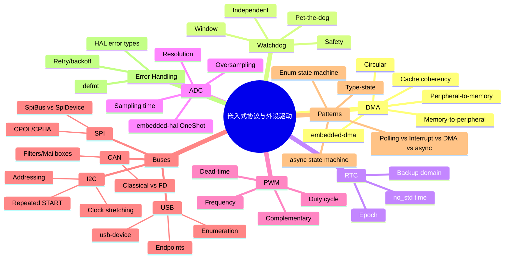

# 嵌入式协议与外设驱动

> **EN**: Embedded Protocol and Peripheral Drivers
> **Summary**: Embedded protocol drivers — how Rust abstracts DMA, watchdogs, RTCs, ADCs, PWM, I²C, SPI, CAN, and USB through embedded-hal, embedded-hal-async, and type-safe state machines.
> **Rust 版本**: 1.97.0+ (Edition 2024)
>
> **受众**: [进阶]
> **Bloom 层级**: L3-L4
> **权威来源**: 本文件为 `concept/` 权威页。
> **A/S/P 标记**: **S+A+P** — Structure + Application + Procedure
> **双维定位**: P×Cre — 设计并实现嵌入式外设驱动
> **定位**: 系统梳理 Rust 嵌入式生态中对常见片上外设与总线协议的抽象方式，重点说明 `embedded-hal` / `embedded-hal-async` 的 trait 设计、驱动状态机建模、错误处理与边界风险。
> **前置概念**: [Rust 嵌入式系统开发](03_embedded_systems.md) ·
> [异步 Rust](../../03_advanced/01_async/01_async.md) ·
> [类型系统](../../01_foundation/02_type_system/01_type_system.md)
> **后置概念**: [异步 no_std 嵌入式](11_async_no_std_embedded.md) ·
> [embedded-hal 1.0 迁移](09_embedded_hal_1_0_migration.md)

---

> **来源**: [embedded-hal](https://docs.rs/embedded-hal/latest/embedded_hal/) ·
> [embedded-hal-async](https://docs.rs/embedded-hal-async/latest/embedded_hal_async/) ·
> [Embassy Book](https://embassy.dev/book/) ·
> [RTIC Book](https://rtic.rs/) ·
> [usb-device](https://docs.rs/usb-device/latest/usb_device/) ·
> [Knurling](https://knurling.ferrous-systems.com/) ·
> [The Embedded Rust Book](https://docs.rust-embedded.org/book/index.html)

---

## 📑 目录

- [嵌入式协议与外设驱动](#嵌入式协议与外设驱动)
  - [📑 目录](#-目录)
  - [一、概述：从寄存器到 trait 抽象](#一概述从寄存器到-trait-抽象)
  - [二、DMA 直接内存访问](#二dma-直接内存访问)
    - [2.1 传输模式](#21-传输模式)
    - [2.2 缓冲区与对齐](#22-缓冲区与对齐)
    - [2.3 `embedded-dma` trait](#23-embedded-dma-trait)
    - [2.4 cache 一致性与边界](#24-cache-一致性与边界)
  - [三、Watchdog 看门狗](#三watchdog-看门狗)
    - [3.1 独立看门狗与窗口看门狗](#31-独立看门狗与窗口看门狗)
    - [3.2 喂狗模式与安全](#32-喂狗模式与安全)
  - [四、RTC 实时时钟](#四rtc-实时时钟)
    - [4.1 备份域与低功耗](#41-备份域与低功耗)
    - [4.2 `no_std` 时间表示](#42-no_std-时间表示)
  - [五、ADC 模数转换器](#五adc-模数转换器)
    - [5.1 分辨率、采样时间与基准](#51-分辨率采样时间与基准)
    - [5.2 过采样与连续采样](#52-过采样与连续采样)
    - [5.3 `embedded-hal` ADC trait](#53-embedded-hal-adc-trait)
  - [六、PWM 脉宽调制](#六pwm-脉宽调制)
    - [6.1 频率、占空比与互补输出](#61-频率占空比与互补输出)
    - [6.2 死区与 HRTIM](#62-死区与-hrtim)
  - [七、I²C 驱动](#七ic-驱动)
    - [7.1 地址、时钟拉伸与重复起始](#71-地址时钟拉伸与重复起始)
    - [7.2 错误条件](#72-错误条件)
    - [7.3 trait 设计](#73-trait-设计)
  - [八、SPI 驱动](#八spi-驱动)
    - [8.1 CPOL/CPHA 与全双工](#81-cpolcpha-与全双工)
    - [8.2 `SpiBus` 与 `SpiDevice`](#82-spibus-与-spidevice)
  - [九、CAN 控制器局域网](#九can-控制器局域网)
    - [9.1 Classical CAN 与 CAN FD](#91-classical-can-与-can-fd)
    - [9.2 过滤器、邮箱与位时序](#92-过滤器邮箱与位时序)
  - [十、USB 设备控制器](#十usb-设备控制器)
    - [10.1 端点、枚举与类驱动](#101-端点枚举与类驱动)
    - [10.2 `usb-device` 生态](#102-usb-device-生态)
  - [十一、系统论：轮询、中断、DMA 与 async](#十一系统论轮询中断dma-与-async)
  - [十二、状态机实现模式](#十二状态机实现模式)
    - [12.1 Type-state](#121-type-state)
    - [12.2 Enum state machine](#122-enum-state-machine)
    - [12.3 `embedded-hal` + async 状态机](#123-embedded-hal--async-状态机)
  - [十三、错误处理策略](#十三错误处理策略)
    - [13.1 HAL 错误类型](#131-hal-错误类型)
    - [13.2 重试与退避](#132-重试与退避)
    - [13.3 故障注入与 `defmt`](#133-故障注入与-defmt)
  - [十四、反命题与边界示例](#十四反命题与边界示例)
    - [14.1 DMA 缓冲区不能位于栈上](#141-dma-缓冲区不能位于栈上)
    - [14.2 SPI 片选必须在整个事务期间保持低电平](#142-spi-片选必须在整个事务期间保持低电平)
    - [14.3 USB 枚举时序严格](#143-usb-枚举时序严格)
    - [14.4 I²C 时钟拉伸可能导致 hang](#144-ic-时钟拉伸可能导致-hang)
    - [14.5 Watchdog 只在主循环喂狗会掩盖子任务死锁](#145-watchdog-只在主循环喂狗会掩盖子任务死锁)
  - [反例 / 边界测试 / 常见陷阱](#反例--边界测试--常见陷阱)
    - [未使能外设时钟就直接操作 I²C/SPI 寄存器](#未使能外设时钟就直接操作-icspi-寄存器)
  - [十五、权威来源索引](#十五权威来源索引)
  - [相关概念](#相关概念)
  - [🧭 思维导图（Mindmap）](#-思维导图mindmap)

---

## 一、概述：从寄存器到 trait 抽象

嵌入式驱动程序的核心任务是把“按手册配置寄存器”翻译成“类型安全、可复用、可测试”的 Rust API。Rust 生态通过三层抽象完成这件事：

| 层级 | 代表 | 职责 | 可移植性 |
|---|---|---|---|
| PAC（Peripheral Access Crate） | `stm32f4xx-pac` | 提供原始寄存器位域 | 低，芯片相关 |
| HAL（Hardware Abstraction Layer） | `stm32f4xx-hal` | 基于 PAC 实现 `embedded-hal` trait | 中，系列相关 |
| 驱动 crate | `mcp2515`、`ssd1306` | 只依赖 trait，不依赖具体芯片 | 高，跨平台 |

`embedded-hal` 是生态的事实标准：它把外设能力表达为 trait，例如 `SpiBus`、`I2c`、`Pwm`、`AdcOneShot` 等。驱动作者按 trait 写代码，用户把具体 HAL 实现传进去，实现“一次编写，多处运行”。[来源: [embedded-hal](https://docs.rs/embedded-hal/latest/embedded_hal/)]

`embedded-hal-async` 在此基础上增加了 async 版本 trait，例如 `SpiBusAsync`、`I2cAsync`，允许驱动在等待硬件时让出 CPU，提高并发效率。[来源: [embedded-hal-async](https://docs.rs/embedded-hal-async/latest/embedded_hal_async/)]

```rust
// 伪代码：trait 抽象的核心思想
use embedded_hal::spi::SpiBus;
use embedded_hal::digital::OutputPin;

pub struct MySensor<SPI, CS> {
    spi: SPI,
    cs: CS,
}

impl<SPI, CS, E> MySensor<SPI, CS>
where
    SPI: SpiBus<Error = E>,
    CS: OutputPin,
{
    pub fn read_id(&mut self) -> Result<u8, E> {
        self.cs.set_low().ok();
        let mut buf = [0x9F, 0, 0];
        self.spi.transfer_in_place(&mut buf)?;
        self.cs.set_high().ok();
        Ok(buf[1])
    }
}
```

> **设计洞察**：trait 抽象把“芯片细节”与“协议语义”分离。驱动作者不需要知道 SPI 控制器是 STM32 的 SPI1 还是 RP2040 的 SPI0，只需要知道它满足 `SpiBus` 的契约。

---

## 二、DMA 直接内存访问

DMA（Direct Memory Access）让外设与内存之间直接传输数据，无需 CPU 逐字节搬运。Rust 嵌入式中，DMA 通常与 `embedded-dma` 的 trait 配合使用，以在编译期保证缓冲区生命周期与可传输性。

### 2.1 传输模式

DMA 控制器支持的典型传输方向：

| 模式 | 方向 | 典型应用 |
|---|---|---|
| Memory-to-peripheral | RAM → 外设 | UART/SPI 发送大量数据 |
| Peripheral-to-memory | 外设 → RAM | ADC 采样、UART 接收 |
| Memory-to-memory | RAM → RAM | 块拷贝、双缓冲合成 |
| Circular | 环形缓冲区 | 连续音频采样、串口流 |

```text
DMA 传输生命周期:

  1. 配置：源地址、目标地址、传输长度、数据宽度、增量模式
  2. 启动：使能 DMA 通道/流，触发外设请求
  3. 等待：轮询 TC 标志 / 中断 / async await
  4. 收尾：无效化 cache、归还缓冲区、检查 TE 错误
```

### 2.2 缓冲区与对齐

DMA 对缓冲区有严格约束：

- 必须位于 DMA 可访问的内存区域（通常排除 CCM、紧耦合 ITCM 等）。
- 起始地址和数据宽度必须对齐。
- 生命周期必须覆盖整个传输过程；传输完成前不能 drop。
- 通常不能用栈上临时数组，因为函数返回后 DMA 仍在写内存。

```rust
// 正确：静态缓冲区，生命周期贯穿程序
static mut ADC_BUF: [u16; 1024] = [0; 1024];

// 错误：DMA 不能安全使用栈缓冲区
fn bad() {
    let mut buf: [u8; 256] = [0; 256];
    // dma.start(&mut buf); // 函数返回后 DMA 仍在写已释放栈内存
}
```

Scatter-gather（分散-聚集）允许一次传输描述符链表，把多个不连续的缓冲区连成一个逻辑传输。高级 DMA（如 STM32H7 的 MDMA）支持这种描述符链，但大多数 MCU DMA 不支持，需要软件分段触发。

### 2.3 `embedded-dma` trait

`embedded-dma` 定义了 `WriteBuffer` 与 `ReadBuffer`，DMA HAL 用它们约束缓冲区类型：

```rust
pub unsafe trait WriteBuffer {
    type Word;
    unsafe fn write_buffer(&mut self) -> (*mut Self::Word, usize);
}

pub unsafe trait ReadBuffer {
    type Word;
    unsafe fn read_buffer(&self) -> (*const Self::Word, usize);
}
```

这些 trait 是 `unsafe` 的，因为实现者必须保证：

1. 返回的指针在整个传输期间有效。
2. 不会被 CPU 与 DMA 同时非法访问（通常通过所有权或静态保证）。
3. 数据宽度与 DMA 配置匹配。

### 2.4 cache 一致性与边界

带 cache 的 Cortex-M7 等内核需要特别注意 DMA 一致性：

- **Peripheral-to-memory**：DMA 写入 RAM 后，CPU 读取前必须 `SCB_InvalidateDCache_by_Addr`。
- **Memory-to-peripheral**：CPU 填充缓冲区后，必须 `SCB_CleanDCache_by_Addr`，否则 DMA 读到的可能是 cache 中的旧数据。
- 部分 MCU 提供 **non-cacheable DMA buffer 区域**，可用 MPU 配置为透写/禁用 cache，避免手动维护。

> **边界风险**：若 DMA 缓冲区跨越 cache line 边界，且未按整行对齐清洗/失效，会导致部分 cache line 未同步，产生难以复现的数据错误。

---

## 三、Watchdog 看门狗

看门狗定时器（WDT）在系统卡死时触发复位，是提高鲁棒性的最后防线。Rust 驱动通常把它包装成必须显式 “喂狗” 的类型，避免无意识漏喂。

### 3.1 独立看门狗与窗口看门狗

| 类型 | 时钟源 | 特性 | 典型超时 |
|---|---|---|---|
| Independent WWDG | 专用低速 RC | 复位不可屏蔽，适合全局死锁 | 几十 ms 到数 s |
| Window WWDG | 系统时钟分频 | 必须在窗口内喂狗，过早过晚都复位 | 数 ms 到数百 ms |

```rust
use embedded_hal::watchdog::Watchdog;

pub fn task_loop(wdt: &mut impl Watchdog) -> ! {
    loop {
        do_work();
        wdt.feed(); // “喂狗”
    }
}
```

### 3.2 喂狗模式与安全

- **仅在主循环喂狗**：如果某个子任务死锁，主循环仍继续喂狗，看门狗失去意义。
- **分散喂狗**：在关键任务完成后再喂，确保多个任务都活着。
- **窗口看门狗**：若中断延迟导致喂狗时间点落在窗口外，会触发复位；这对实时性要求高的系统既是保护也是设计约束。

> **安全注意**：启动看门狗前，应确保 panic handler、错误日志路径已就绪；否则反复复位将无法诊断根因。`defmt` + `rtt` 常用于在复位前捕获现场。[来源: [Knurling](https://knurling.ferrous-systems.com/)]

---

## 四、RTC 实时时钟

RTC 在掉电或低功耗模式下维持时间，通常由独立电池域供电。Rust 中需要处理跨域时钟、备份寄存器和 epoch 表示。

### 4.1 备份域与低功耗

RTC 的时钟源（LSE、LSI、HSE 分频）和日历寄存器位于 **备份域**。写入前通常需要：

1. 使能电源接口和备份域访问。
2. 解除备份域写保护。
3. 选择时钟源并初始化预分频器。
4. 开启 RTC。

```text
RTC 初始化流程:

  启用 PWR 时钟
    │
    ▼
  解锁备份域写保护 (DBP)
    │
    ▼
  选择 RTC 时钟源 (LSE/LSI/HSE_DIV)
    │
    ▼
  设置预分频器 (sync + async) 得到 1 Hz
    │
    ▼
  配置日历/闹钟
```

### 4.2 `no_std` 时间表示

`std::time` 不可用，但 `core::time::Duration` 仍可用。常用库：

- `time` crate 提供 `PrimitiveDateTime`，在 `no_std` 模式下可用（关闭默认特性）。
- `chrono` 也可配置为 `no_std`。
- 若只需 epoch 秒数，直接用 `u32` 或 `u64` 最省资源。

```rust
// 简单 epoch 时间戳（秒）
pub struct RtcTime {
    pub year: u16,    // 2000..2099
    pub month: u8,    // 1..12
    pub day: u8,      // 1..31
    pub hour: u8,
    pub minute: u8,
    pub second: u8,
}

impl RtcTime {
    pub fn to_epoch_days(&self) -> u32 {
        // 简化算法；真实驱动应使用已验证库
        let y = self.year as u32;
        let m = self.month as u32;
        let d = self.day as u32;
        let days = 365 * y + y / 4 - y / 100 + y / 400
                 + (367 * m - 362) / 12 + d - 719529;
        days
    }
}
```

> **边界风险**：不同 RTC 硬件的 epoch 基准不同（Unix epoch、2000 年 1 月 1 日、硬件复位值等）。驱动应显式文档化基准，并在与上位机同步时统一换算。

---

## 五、ADC 模数转换器

ADC 把模拟电压转换为数字值，是嵌入式中最常用的外设之一。`embedded-hal` 提供 `adc::OneShot` trait 做一次性采样抽象。

### 5.1 分辨率、采样时间与基准

| 参数 | 含义 | 影响 |
|---|---|---|
| 分辨率 | 输出位宽（8/10/12/16 bit） | 量化精度 |
| 采样时间 | 保持输入电压的时间 | 高阻抗源需要更长时间 |
| 参考电压 Vref | ADC 满量程对应的模拟电压 | 决定每 LSB 代表的电压 |

```text
电压换算:

  V_in = (adc_code × V_ref) / (2^resolution)

  例如 12-bit、V_ref = 3.3 V、code = 2048:
  V_in = 2048 × 3.3 / 4096 = 1.65 V
```

### 5.2 过采样与连续采样

- **Oversampling**：硬件多次采样并平均，提高有效分辨率（以牺牲吞吐率为代价）。
- **Continuous mode**：ADC 在触发后连续转换，配合 DMA 自动填充缓冲区。
- **Scan mode**：按顺序转换多个通道。

```rust
use embedded_hal::adc::OneShot;

pub fn read_temperature<ADC, PIN, E>(
    adc: &mut ADC,
    pin: &mut PIN,
) -> Result<f32, E>
where
    ADC: OneShot<PIN, u16, Error = E>,
{
    let code = adc.read(pin)?;
    let v = 3.3 * (code as f32) / 4095.0;
    // 假设传感器 10 mV/°C，0 °C 对应 0.5 V
    Ok((v - 0.5) / 0.01)
}
```

### 5.3 `embedded-hal` ADC trait

`embedded-hal` 1.x 的 ADC 抽象主要分两类：

- `adc::OneShot<ADC, Word, Pin>`：单次采样。
- 具体 HAL 常提供更丰富的 API（连续模式、DMA、注入通道等），但这些不在 trait 中，因为它们太依赖芯片。

> **边界风险**：若输入电压超过 Vref 或低于 Vssa，可能损坏芯片或得到钳位值。驱动应在文档中声明允许范围，并在硬件上添加钳位保护。

---

## 六、PWM 脉宽调制

PWM 通过周期性高低电平的占空比控制平均电压，广泛用于电机、LED、电源。Rust 中 `embedded-hal` 用 `Pwm` trait 抽象设置周期与占空比。

### 6.1 频率、占空比与互补输出

```text
PWM 关键量:

  频率 f = 1 / T
  占空比 D = t_high / T × 100%
  有效电压 V_avg = D × V_high
```

```rust
use embedded_hal::pwm::SetDutyCycle;

pub fn set_led_brightness<PWM, E>(
    pwm: &mut PWM,
    percent: u8,
) -> Result<(), E>
where
    PWM: SetDutyCycle<Error = E>,
{
    let max = pwm.max_duty_cycle();
    pwm.set_duty_cycle_fraction(percent as u32, 100)?;
    Ok(())
}
```

- **互补输出（Complementary Output）**：高级定时器输出两路互补 PWM，配合死区，可直接驱动 H 桥。
- **Center-aligned mode**：在计数器向上/向下计数时翻转，降低谐波。

### 6.2 死区与 HRTIM

- **Dead-time**：在互补信号切换时插入两路同时为低（或高）的时间，防止上下桥臂直通短路。
- **HRTIM（High-Resolution Timer）**：部分 MCU 提供亚纳秒级 PWM 分辨率，用于数字电源、Class-D 音频。

| 特性 | 普通 PWM | 互补 PWM | HRTIM |
|---|---|---|---|
| 分辨率 | ns 级 | ns 级 | 亚 ns 级 |
| 死区 | 无 | 有 | 有 |
| 典型应用 | LED、舵机 | BLDC、H 桥 | 数字电源 |

> **边界风险**：死区时间设置过短会导致桥臂直通；过长会导致输出波形畸变、电机电流纹波增大。

---

## 七、I²C 驱动

I²C 是两线串行总线（SDA、SCL），支持多主多从。Rust 中 `embedded-hal` 提供 `I2c` trait 抽象读写操作。

### 7.1 地址、时钟拉伸与重复起始

- **地址**：7-bit 为主流，10-bit 用于设备众多的系统。
- **Clock stretching**：从设备拉低 SCL 要求主设备等待，处理慢速设备或流控。
- **Repeated START**：在一次传输中不发 STOP 而直接发 START，用于“写寄存器地址后立即读”等复合事务。

```rust
use embedded_hal::i2c::I2c;

const ADDR: u8 = 0x50; // 7-bit EEPROM 地址

pub fn eeprom_read<I2C, E>(
    i2c: &mut I2C,
    mem_addr: u16,
    buf: &mut [u8],
) -> Result<(), E>
where
    I2C: I2c<Error = E>,
{
    let addr_bytes = mem_addr.to_be_bytes();
    i2c.write_read(ADDR, &addr_bytes, buf)?; // 内部使用 repeated START
    Ok(())
}
```

### 7.2 错误条件

| 错误 | 含义 | 常见原因 |
|---|---|---|
| NACK | 从设备无应答 | 地址错误、设备未上电、总线占用 |
| Arbitration lost | 多主冲突 | 两个主机同时启动 |
| Bus error | 非法电平跳变 | 信号完整性差、未接上拉 |
| Overrun/Underrun | 数据寄存器未及时处理 | 中断延迟 |

### 7.3 trait 设计

`embedded-hal` 1.x 的 `I2c` trait 合并了读写方法：

```rust
pub trait I2c<A: AddressMode = SevenBitAddress> {
    type Error;
    fn read(&mut self, address: A, read: &mut [u8]) -> Result<(), Self::Error>;
    fn write(&mut self, address: A, write: &[u8]) -> Result<(), Self::Error>;
    fn write_read(
        &mut self,
        address: A,
        write: &[u8],
        read: &mut [u8],
    ) -> Result<(), Self::Error>;
    // ... transaction API
}
```

> **边界风险**：I²C 总线必须外接上拉电阻，否则 SDA/SCL 无法被拉高。若上拉电阻选型不当（如 10 kΩ 在高速模式下），会导致信号沿过缓、误触发总线错误。

---

## 八、SPI 驱动

SPI 是全双工四线总线（SCK、MOSI、MISO、CS），速度高于 I²C。Rust 的 `embedded-hal` 把总线能力与时片选管理拆成 `SpiBus` 与 `SpiDevice`。

### 8.1 CPOL/CPHA 与全双工

| 模式 | CPOL | CPHA | 空闲时钟 | 采样边沿 |
|---|---|---|---|---|
| 0 | 0 | 0 | 低 | 上升沿 |
| 1 | 0 | 1 | 低 | 下降沿 |
| 2 | 1 | 0 | 高 | 下降沿 |
| 3 | 1 | 1 | 高 | 上升沿 |

```rust
use embedded_hal::spi::SpiBus;

pub fn spi_loopback<SPI, E>(spi: &mut SPI, tx: &[u8], rx: &mut [u8]) -> Result<(), E>
where
    SPI: SpiBus<Error = E>,
{
    spi.transfer(tx, rx)? // 同时发送和接收
}
```

### 8.2 `SpiBus` 与 `SpiDevice`

- **`SpiBus`**：代表原始 SPI 总线，不管理 CS。
- **`SpiDevice`**：代表一个 CS 选中的从设备，自动在事务前后拉低/拉高 CS。

```rust
use embedded_hal::spi::SpiDevice;

pub fn read_sensor<DEV, E>(dev: &mut DEV, cmd: u8, out: &mut [u8]) -> Result<(), E>
where
    DEV: SpiDevice<Error = E>,
{
    // 自动处理 CS：transaction 期间拉低，结束拉高
    dev.transaction(&mut [
        Operation::Write(&[cmd]),
        Operation::Read(out),
    ])
}
```

> **边界风险**：CS 必须在整个事务期间保持低电平。如果错误地用 `SpiBus` 手动控制 GPIO 并在两次 `write` 之间释放 CS，从设备会误认为两次独立的 8-bit 命令，而不是一次完整命令。[来源: [embedded-hal](https://docs.rs/embedded-hal/latest/embedded_hal/spi/index.html)]

---

## 九、CAN 控制器局域网

CAN 是工业与汽车领域的主流总线，具有高可靠性和仲裁机制。Rust 生态通过 `embedded-can` 和 `bxcan` 提供抽象。

### 9.1 Classical CAN 与 CAN FD

| 特性 | Classical CAN | CAN FD |
|---|---|---|
| 最大数据段 | 8 byte | 64 byte |
| 数据段波特率 | ≤1 Mbit/s | ≤8 Mbit/s（物理层决定） |
| 帧格式 | 标准/扩展 | 标准/扩展 + FDF 位 |
| 兼容性 | 只接收经典帧 | 可与传统 CAN 共存 |

### 9.2 过滤器、邮箱与位时序

- **过滤器（Filter）**：硬件根据 ID 掩码决定哪些帧存入接收 FIFO，减轻 CPU 负担。
- **邮箱（Mailbox）**：发送单元一般有 3 个邮箱，可排队待发帧。
- **位时序**：由同步段、传播段、相位缓冲段组成，决定采样点和容错能力。

```rust
use bxcan::{Can, Frame, Id, StandardId};

// 伪代码：配置过滤器并发送一帧
let mut can = Can::new(periph);
can.modify_filters().enable_bank(0, bxcan::Fifo::Fifo0, bxcan::filter::Mask32::accept_all());

let id = StandardId::new(0x123).unwrap();
let frame = Frame::new_data(id, [0x01, 0x02, 0x03, 0x04]);
can.transmit(&frame);
```

> **边界风险**：CAN 采样点设置错误会导致高波特率下误码率激增。典型采样点范围为 75%–87.5%，需根据线缆长度和收发器特性计算。

---

## 十、USB 设备控制器

USB 设备端驱动涉及端点、枚举、描述符、类驱动四层。Rust 中 `usb-device` crate 提供跨芯片的 USB 设备框架。

### 10.1 端点、枚举与类驱动

```text
USB 设备架构:

  硬件 USB 外设
    │
    ├── 控制端点 EP0（IN/OUT）：枚举、标准请求
    ├── 批量/中断/同步端点：类驱动使用
    │
    ▼
  usb-device 框架
    │
    ├── UsbBus trait：抽象底层控制器
    ├── UsbDevice：管理枚举、描述符、控制传输
    │
    ▼
  类驱动 (Class Driver)
    ├── cdc_acm：虚拟串口
    ├── hid：键盘/鼠标/自定义 HID
    ├── midi：MIDI
    └── msc：大容量存储
```

### 10.2 `usb-device` 生态

```rust
use usb_device::prelude::*;
use usbd_serial::{SerialPort, USB_CLASS_CDC};

// 伪代码：构建 CDC-ACM 虚拟串口设备
let usb_bus = UsbBusAllocator::new(hw_usb);
let mut serial = SerialPort::new(&usb_bus);

let mut usb_dev = UsbDeviceBuilder::new(&usb_bus, UsbVidPid(0x16c0, 0x27dd))
    .manufacturer("Example")
    .product("Serial port")
    .serial_number("TEST")
    .device_class(USB_CLASS_CDC)
    .build();
```

`usb-device` 的核心设计：

- `UsbBus` trait 由芯片 HAL 实现，封装端点分配、中断处理。
- 类驱动只处理自己的端点和请求。
- 主循环周期性调用 `usb_dev.poll(&mut [&mut serial])`。

> **边界风险**：USB 枚举对时序极其严格。若设备在总线复位后 100 ms 内未响应 `GET_DESCRIPTOR` 请求，主机将放弃枚举。中断延迟过长或 `poll` 调用间隔过大都会导致枚举失败。[来源: [usb-device](https://docs.rs/usb-device/latest/usb_device/)]

---

## 十一、系统论：轮询、中断、DMA 与 async

同一外设往往可以用多种方式驱动，选择取决于延迟、功耗、CPU 占用和代码复杂度。

| 方式 | 延迟 | CPU 占用 | 功耗 | 代码复杂度 | 适用场景 |
|---|---|---|---|---|---|
| 轮询（Polling） | 高且抖动 | 100% | 高 | 低 | 简单初始化、快速自检 |
| 中断（Interrupt） | 中低 | 按需唤醒 | 低 | 中 | UART 字节接收、GPIO 事件 |
| DMA | 低 | 极低 | 低 | 高 | 大块 ADC/串口/SPI 流 |
| async | 中低 | 协作式让出 | 低 | 中 | 多协议并发、网络栈 |

```text
选择决策树:

  数据量小且偶尔发生？
    ├── 是 → 中断
    └── 否 → 数据量大且连续？
            ├── 是 → DMA（必要时加 async 控制流）
            └── 否 → 多任务并发？
                    ├── 是 → async / RTIC
                    └── 否 → 轮询（仅限 boot/调试）
```

`async` 并不替代 DMA，而是常与 DMA 配合：用 async 等待 DMA 完成中断，用 DMA 搬运数据。Embassy 的 `Transfer` future 就是这种模式。[来源: [Embassy Book](https://embassy.dev/book/)]

---

## 十二、状态机实现模式

外设驱动本质是状态机。Rust 提供三种常见建模方式：

### 12.1 Type-state

用泛型参数把状态编码进类型，错误状态转换在编译期拒绝。

```rust
pub struct Uninit;
pub struct Ready;
pub struct Running;

pub struct Adc<STATE> {
    _state: core::marker::PhantomData<STATE>,
}

impl Adc<Uninit> {
    pub fn new() -> Self { Self { _state: core::marker::PhantomData } }
    pub fn calibrate(self) -> Adc<Ready> { Adc { _state: core::marker::PhantomData } }
}

impl Adc<Ready> {
    pub fn start(self) -> Adc<Running> { Adc { _state: core::marker::PhantomData } }
}

// 编译错误：未校准不能启动
// let adc = Adc::<Uninit>::new().start();
```

### 12.2 Enum state machine

运行期状态，适合状态多、转移依赖运行时输入的场景。

```rust
pub enum UsbState {
    Default,
    Addressed(u8),
    Configured { config: u8, interface: u8 },
    Suspended,
}

impl UsbState {
    pub fn on_setup(&mut self, request: SetupPacket) -> Result<(), UsbError> {
        match self {
            UsbState::Default => { /* 仅允许 SET_ADDRESS */ }
            UsbState::Addressed(_) => { /* 允许 GET_DESCRIPTOR, SET_CONFIG */ }
            UsbState::Configured { .. } => { /* 全功能 */ }
            UsbState::Suspended => { /* 先唤醒 */ }
        }
        Ok(())
    }
}
```

### 12.3 `embedded-hal` + async 状态机

在 Embassy/RTIC 中，状态转移常由 async 函数表达，等待事件自然成为 `.await` 点。

```rust
// Embassy 风格伪代码
#[embassy_executor::task]
async fn can_rx_task(mut can: Can<'static>) {
    loop {
        let frame = can.receive().await; // 状态机在 await 处挂起
        process(frame);
    }
}
```

| 模式 | 优点 | 缺点 |
|---|---|---|
| Type-state | 编译期保证，零开销 | 状态多时代码膨胀 |
| Enum | 灵活，易于扩展 | 运行时检查，可能遗漏分支 |
| async | 自然表达并发等待 | 需要运行时或 executor |

---

## 十三、错误处理策略

### 13.1 HAL 错误类型

`embedded-hal` trait 通过关联类型 `Error` 让 HAL 暴露具体错误，驱动作者通过 trait bound 处理：

```rust
pub enum AdcError {
    Overrun,
    Timeout,
    Calibration,
}

impl embedded_hal::adc::Error for AdcError {
    fn kind(&self) -> embedded_hal::adc::ErrorKind {
        match self {
            AdcError::Overrun => embedded_hal::adc::ErrorKind::Overrun,
            _ => embedded_hal::adc::ErrorKind::Other,
        }
    }
}
```

### 13.2 重试与退避

总线错误通常 transient，可设计指数退避：

```rust
pub fn with_retry<T, E>(
    mut op: impl FnMut() -> Result<T, E>,
    max_retries: u32,
) -> Result<T, E> {
    for i in 0..max_retries {
        match op() {
            Ok(v) => return Ok(v),
            Err(e) if i == max_retries - 1 => return Err(e),
            Err(_) => {
                // 指数退避，最大 100 ms
                let delay = 1u32 << i.min(6);
                cortex_m::asm::delay(delay * 1000);
            }
        }
    }
    unreachable!()
}
```

### 13.3 故障注入与 `defmt`

- **故障注入**：在测试时人为制造 NACK、超时、DMA 错误，验证驱动恢复路径。
- **`defmt` 日志**：相比 `rtt-target` 的格式化，`defmt` 把格式字符串留在主机端，只传输参数，极大降低固件体积和日志开销。[来源: [Knurling](https://knurling.ferrous-systems.com/)]

```rust
use defmt::{error, warn};

fn handle_i2c_error(e: I2cError) {
    match e {
        I2cError::Nack => warn!("I2C NACK, retrying"),
        I2cError::ArbitrationLost => error!("I2C arbitration lost"),
        _ => error!("I2C unexpected error: {}", e),
    }
}
```

---

## 十四、反命题与边界示例

### 14.1 DMA 缓冲区不能位于栈上

```rust
// ❌ 边界示例：DMA 使用栈缓冲区
fn start_adc_dma(dma: &mut Dma) {
    let mut buf: [u16; 64] = [0; 64];
    dma.start(&mut buf); // DMA 在函数返回后继续写内存
} // buf 被 drop，DMA 写入已释放内存，导致未定义行为
```

正确做法：使用 `'static` 数组或 DMA 安全包装类型。

### 14.2 SPI 片选必须在整个事务期间保持低电平

```rust
// ❌ 边界示例：错误地在两次传输之间释放 CS
fn bad_read(spi: &mut impl SpiBus, cs: &mut impl OutputPin) {
    cs.set_low().ok();
    spi.write(&[0x0B, 0x00]).ok();
    cs.set_high().ok();          // 错误：事务未结束就释放 CS
    cs.set_low().ok();
    spi.read(&mut [0; 4]).ok();  // 从设备已把前两个 byte 当作完整命令
    cs.set_high().ok();
}
```

正确做法：使用 `SpiDevice` 的 `transaction` API，或在整个读写期间保持 CS 低。

### 14.3 USB 枚举时序严格

```rust
// ❌ 边界示例：主循环长时间阻塞导致枚举失败
loop {
    heavy_computation(); // 耗时 > 10 ms
    usb_dev.poll(&mut [&mut serial]); // 错过主机 SETUP 包
}
```

正确做法：把 `usb_dev.poll` 放在高优先级中断或 1 ms 周期任务中；长时间任务拆分到独立上下文。

### 14.4 I²C 时钟拉伸可能导致 hang

```rust
// ❌ 边界示例：没有超时机制的 I²C 主循环
loop {
    i2c.write(ADDR, &[cmd]); // 若从设备一直拉低 SCL，此调用永久阻塞
}
```

正确做法：使用带超时的 HAL API，或在总线卡死时发送时钟脉冲恢复（bus recovery）。

### 14.5 Watchdog 只在主循环喂狗会掩盖子任务死锁

```rust
// ❌ 边界示例：子任务死锁但主循环仍喂狗
loop {
    // sensor_task 已死锁，未更新数据
    usb_task.poll(); // 仍在运行
    wdt.feed();      // 看门狗无法检测局部故障
}
```

正确做法：采用“任务健康心跳”机制，只有所有关键任务正常时才喂狗。

---

## 反例 / 边界测试 / 常见陷阱

### 未使能外设时钟就直接操作 I²C/SPI 寄存器

**错误场景**：初始化 I²C 时只配置了 GPIO 复用和波特率，却忘记在 RCC 中使能 I²C 外设时钟；随后调用 `write_read` 永远返回超时或总线错误。

```rust,ignore
// ❌ 错误：未开启 I2C1 时钟就发起传输
fn init_i2c(i2c: &mut I2c1, scl: &mut Pin, sda: &mut Pin) {
    scl.set_alt_mode(AltMode::I2C1);
    sda.set_alt_mode(AltMode::I2C1);
    // 缺失：rcc.enable_peripheral(Peripheral::I2C1);
    i2c.set_speed(100_000);
}

fn read_eeprom(i2c: &mut I2c1) {
    i2c.write_read(0x50, &[0x00], &mut [0; 8]).unwrap(); // 永远无应答
}
```

**为何错误**：ARM/RISC-V MCU 上电后默认关闭大部分外设时钟以节能；未使能时钟时对应外设寄存器不可写、总线状态机不工作，任何传输都会失败。

**正确做法**：在使用外设前显式调用 `rcc.enable_peripheral(...)` 或 HAL 提供的时钟使能函数，并在初始化顺序上将“时钟使能”放在“引脚配置”和“协议参数配置”之前。

---

## 十五、权威来源索引

| 来源 | 链接 | 用途 |
|---|---|---|
| embedded-hal | <https://docs.rs/embedded-hal/latest/embedded_hal/> | 通用外设 trait 抽象 |
| embedded-hal-async | <https://docs.rs/embedded-hal-async/latest/embedded_hal_async/> | 异步外设 trait |
| Embassy Book | <https://embassy.dev/book/> | 异步嵌入式运行时 |
| RTIC Book | <https://rtic.rs/> | 实时中断驱动并发框架 |
| usb-device | <https://docs.rs/usb-device/latest/usb_device/> | USB 设备框架 |
| Knurling | <https://knurling.ferrous-systems.com/> | `defmt` 调试与日志 |
| The Embedded Rust Book | <https://docs.rust-embedded.org/book/index.html> | 嵌入式 Rust 入门 |
| Typestate Programming (IEEE) | <https://ieeexplore.ieee.org/document/6312929> | 类型状态机形式化基础 |

---

---

## 相关概念

- [Rust vs Zig：系统编程的两种显式路径](../../05_comparative/01_systems_languages/06_rust_vs_zig.md)
- [嵌入式形式化内存模型](../../04_formal/14_embedded_semantics/01_embedded_formal_memory_model.md)

## 🧭 思维导图（Mindmap）


