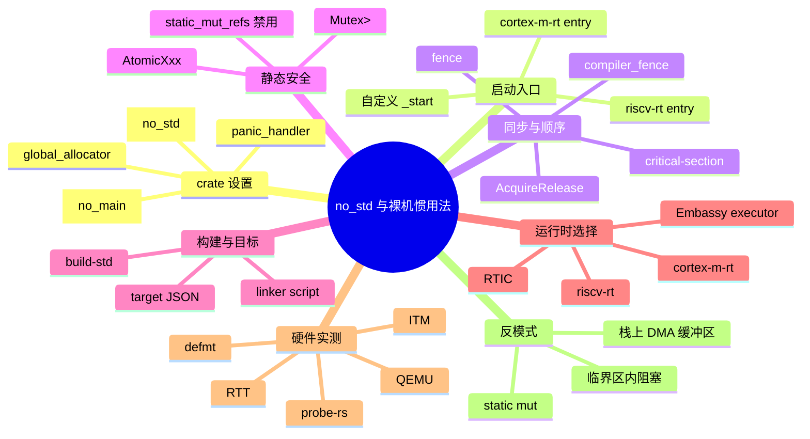
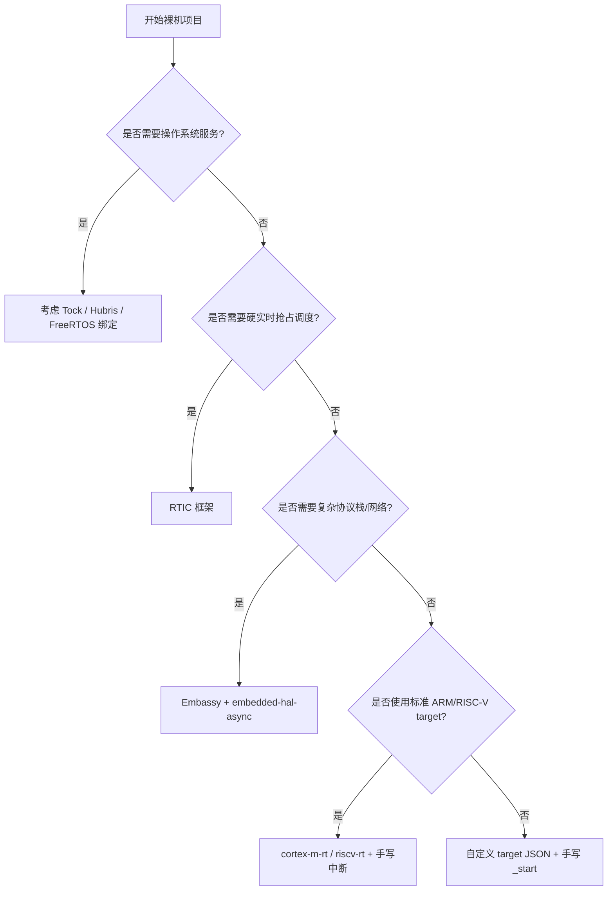

> **内容分级**: [专家级]
> **代码状态**: ⚠️ 裸机/目标平台相关代码标注 `rust,ignore`/`no_run`， host 平台无法直接编译
> **定理链**: N/A — 描述性/工程性文档
>
# `#![no_std]` 与裸机编程惯用法
>
> **EN**: `no_std` and Bare-Metal Idioms
> **Summary**: Practical idioms for `#![no_std]` and bare-metal Rust: crate setup, panic handler, custom alloc, critical-section, memory fences, static safety, build-std, target JSON, linker scripts, cortex-m-rt/riscv-rt entry patterns, Embassy executor, probe-rs hardware-in-the-loop debugging, KG/SHACL semantics, and common anti-patterns.
> **Rust 版本**: 1.97.0+ (Edition 2024)
>
> **受众**: [专家]
> **Bloom 层级**: L4
> **权威来源**: 本文件为 `concept/` 权威页。
> **A/S/P 标记**: **S+A+P** — Structure + Application + Procedure
> **双维定位**: P×Cre — 在资源受限硬件上组装可运行、可维护的裸机 crate
> **前置概念**:
> [Rust 嵌入式系统开发](03_embedded_systems.md) ·
> [裸机启动与链接脚本](13_bare_metal_boot_linker_script.md) ·
> [panic_handler 与 no_std 运行时](18_panic_runtime_no_std.md) ·
> [嵌入式内存分配器](16_embedded_memory_allocators.md) ·
> [no_std 同步原语](15_no_std_synchronization_primitives.md) ·
> [Rust vs C++](../../05_comparative/01_systems_languages/01_rust_vs_cpp.md)
> **后置概念**:
> [PAC 与 HAL 实现](17_pac_hal_implementation.md) ·
> [embedded-hal 与驱动惯用法](24_embedded_hal_and_driver_idioms.md) ·
> [异步 no_std 嵌入式](11_async_no_std_embedded.md) ·
> [no_std 启动流程与运行时深度解析](27_no_std_startup_runtime_deep_dive.md) ·
> [自定义裸机异步执行器](28_custom_bare_metal_async_executor.md) ·
> [嵌入式内存布局与堆安全](29_embedded_memory_layout_and_heap_safety.md) ·
> [安全关键嵌入式 Rust 指南：MISRA-Rust、Ferrocene 与 IEC 61508](30_misra_rust_safety_critical_guidelines.md)

---

> **来源**:
> [The Embedded Rust Book](https://docs.rust-embedded.org/book/) ·
> [The Embedonomicon](https://docs.rust-embedded.org/embedonomicon/) ·
> [cortex-m-rt](https://docs.rs/cortex-m-rt/) ·
> [riscv-rt](https://docs.rs/riscv-rt/) ·
> [critical-section crate](https://docs.rs/critical-section/) ·
> [Embassy Book](https://embassy.dev/book/) · [Ferrous Systems](https://ferrous-systems.com/) ·
> [Knurling](https://knurling.ferrous-systems.com/) ·
> [Rust Reference — no_std](https://doc.rust-lang.org/reference/names/preludes.html#the-no_std-attribute) ·
> [The Rustonomicon](https://doc.rust-lang.org/nomicon/) ·
> [rustc-dev-guide](https://rustc-dev-guide.rust-lang.org/) ·
> [probe.rs](https://probe.rs/) ·
> [defmt Book](https://defmt.ferrous-systems.com/) ·
> [Ferrocene](https://ferrocene.dev/) ·
> [Ferrocene Language Specification](https://spec.ferrocene.dev/) ·
> [Tock OS](https://www.tockos.org/) ·
> [Hubris OS](https://hubris.oxide.computer/)

---

## 🧠 知识结构图



## 📑 目录

- [`#![no_std]` 与裸机编程惯用法](#no_std-与裸机编程惯用法)
  - [🧠 知识结构图](#-知识结构图)
  - [📑 目录](#-目录)
  - [一、权威定义](#一权威定义)
  - [二、最小可启动 `#![no_std]` crate](#二最小可启动-no_std-crate)
  - [三、关键属性矩阵](#三关键属性矩阵)
  - [四、panic handler 与运行时入口模式](#四panic-handler-与运行时入口模式)
    - [4.1 `cortex-m-rt` 入口](#41-cortex-m-rt-入口)
    - [4.2 `riscv-rt` 入口](#42-riscv-rt-入口)
    - [4.3 自定义 `_start` / 链接脚本](#43-自定义-_start--链接脚本)
  - [五、自定义分配器与 `heapless`](#五自定义分配器与-heapless)
  - [六、`critical-section` 与内存屏障](#六critical-section-与内存屏障)
  - [七、`static` vs `static mut` 安全](#七static-vs-static-mut-安全)
  - [八、`build-std` 与自定义 target JSON](#八build-std-与自定义-target-json)
  - [九、链接脚本核心约定](#九链接脚本核心约定)
  - [十、Embassy 裸机执行器](#十embassy-裸机执行器)
  - [十一、常见 no\_std 反模式](#十一常见-no_std-反模式)
  - [十二、反例与失效模式](#十二反例与失效模式)
  - [十三、边界测试](#十三边界测试)
    - [13.1 边界测试：`no_std` 中误用 `std`](#131-边界测试no_std-中误用-std)
    - [13.2 边界测试：缺少 `panic_handler`](#132-边界测试缺少-panic_handler)
    - [13.3 边界测试：直接访问 `static mut`](#133-边界测试直接访问-static-mut)
    - [13.4 边界测试：`Vec` 在未初始化堆上使用](#134-边界测试vec-在未初始化堆上使用)
  - [十四、决策树：裸机技术栈选择](#十四决策树裸机技术栈选择)
  - [十五、构建-运行-测试 no\_std 最小可复现工作流](#十五构建-运行-测试-no_std-最小可复现工作流)
    - [15.1 使用 cargo-generate 模板](#151-使用-cargo-generate-模板)
    - [15.2 QEMU 仿真验证](#152-qemu-仿真验证)
    - [15.3 `cargo embed` 与 `cargo run --target`](#153-cargo-embed-与-cargo-run---target)
  - [十六、硬件实测与 probe-rs 调试](#十六硬件实测与-probe-rs-调试)
    - [16.1 probe-rs 工具链](#161-probe-rs-工具链)
    - [16.2 defmt 零开销日志](#162-defmt-零开销日志)
    - [16.3 RTT / ITM / OpenOCD 对比](#163-rtt--itm--openocd-对比)
    - [16.4 芯片验证工作流](#164-芯片验证工作流)
    - [16.5 硬件实测流程（probe-rs / QEMU / RTT）](#165-硬件实测流程probe-rs--qemu--rtt)
      - [环境准备](#环境准备)
      - [Host 编译检查](#host-编译检查)
      - [交叉编译 QEMU blinky](#交叉编译-qemu-blinky)
      - [QEMU 运行](#qemu-运行)
      - [真实硬件烧录与 RTT 日志](#真实硬件烧录与-rtt-日志)
      - [defmt 零开销日志](#defmt-零开销日志)
  - [十七、常见惯用法清单扩展](#十七常见惯用法清单扩展)
    - [17.1 `build-std` 与自定义 target JSON](#171-build-std-与自定义-target-json)
    - [17.2 链接脚本符号在 Rust 中引用](#172-链接脚本符号在-rust-中引用)
    - [17.3 `#[link_section]` 放置向量表与启动标记](#173-link_section-放置向量表与启动标记)
    - [17.4 `MaybeUninit` 与 MMIO 映射](#174-maybeuninit-与-mmio-映射)
    - [17.5 `critical-section` 实现选择](#175-critical-section-实现选择)
    - [17.6 单例模式：`Peripherals::take()`](#176-单例模式peripheralstake)
    - [17.7 GPIO 类型状态（typestate）](#177-gpio-类型状态typestate)
    - [17.8 DMA 缓冲区与内存安全](#178-dma-缓冲区与内存安全)
    - [17.9 栈/堆布局决策](#179-栈堆布局决策)
  - [十八、知识图谱与 SHACL 语义衔接](#十八知识图谱与-shacl-语义衔接)
  - [十九、国际化权威来源](#十九国际化权威来源)
  - [二十、相关概念](#二十相关概念)
  - [二十一、权威来源索引](#二十一权威来源索引)
  - [🧭 思维导图（Mindmap）](#-思维导图mindmap)
  - [十二、国际学术参考（P1）](#十二国际学术参考p1)

---

## 一、权威定义

> **The Embedded Rust Book**: `#![no_std]` tells the Rust compiler not to automatically import the standard library (`std`) prelude. It does not disable the `core` library, and `alloc` can still be used if a global allocator is provided.

**`#![no_std]`**：禁用标准库预导入的 crate 级属性。`core`（无堆）仍然完整可用；`alloc`（`Vec`、`Box`、`String`）在提供全局分配器后可用。

**裸机（bare-metal）**：没有操作系统负责加载、调度、内存映射与设备驱动，程序直接运行在处理器硬件上，复位向量指向用户提供的启动代码。

**build-std**：Cargo 不稳定特性，用于为自定义目标重新编译 `core`、`alloc`、`compiler_builtins`，是大多数裸机/自定义 target 项目的构建前提。

判定依据：能否成功构建并启动一个 `#![no_std]` 裸机 crate，取决于属性组合、`panic_handler`、入口运行时、链接脚本与目标三元组四者是否一致。

---

## 二、最小可启动 `#![no_std]` crate

```rust,ignore
// src/main.rs（Cortex-M 目标）
#![no_std]
#![no_main]

use core::panic::PanicInfo;
use cortex_m_rt::entry;

#[entry]
fn main() -> ! {
    // 用户代码
    loop {
        cortex_m::asm::wfi();
    }
}

#[panic_handler]
fn panic(_info: &PanicInfo) -> ! {
    loop {}
}
```

```toml
# Cargo.toml
[package]
name = "bare_metal_app"
version = "0.1.0"
edition = "2024"

[dependencies]
cortex-m = "0.7"
cortex-m-rt = "0.7"

[profile.release]
panic = "abort"
```

```toml
# .cargo/config.toml
[target.thumbv7em-none-eabihf]
runner = "probe-rs run --chip STM32F407VG"

[build]
target = "thumbv7em-none-eabihf"

[unstable]
build-std = ["core", "compiler_builtins"]
build-std-features = ["compiler-builtins-mem"]
```

> **要点**：`#![no_main]` 表示不使用 Rust 默认的 `main` 入口符号；`cortex-m-rt` 的 `#[entry]` 宏会生成符合向量表要求的复位处理函数并调用用户 `main`。

---

## 三、关键属性矩阵

| 属性 | 作用对象 | 语义 | 裸机典型用途 | 与 `std` 程序的差异 |
|:---|:---|:---|:---|:---|
| `#![no_std]` | crate | 禁用 `std` 预导入 | 所有裸机/嵌入式 crate | `std` 的线程/文件/网络不可用 |
| `#![no_main]` | crate | 不生成默认 `main` 符号 | 由运行时提供入口 | `std` 程序通常自动生成 |
| `#[panic_handler]` | 函数 | 定义 panic 行为 | 必须提供 | `std` 已提供默认 handler |
| `#[global_allocator]` | 静态 `GlobalAlloc` | 启用 `alloc` | 需要堆时配置 | `std` 使用系统分配器 |
| `#[no_mangle]` | 项 | 禁止符号名混淆 | ISR、C ABI、启动符号 | 同样可用，但裸机更依赖 |
| `#[export_name = "..."]` | 项 | 显式设置链接符号名 | 向量表、启动文件 | 比 `#[no_mangle]` 更精确 |
| `#[link_section = ".name"]` | 静态/函数 | 放入指定 section | 向量表、bootloader 标记 | 同样可用 |
| `#[used]` | 静态 | 防止 LLVM 优化删除 | panic 信息表、启动标记 | 同样可用 |
| `#[repr(C)]` | 类型 | C 兼容布局 | MMIO 寄存器映射 | 同样常用 |

判定依据：裸机 crate 中，属性是“编译器与链接器之间的契约”，组合错误通常表现为链接错误（`undefined reference`）或启动崩溃，而非类型错误。

---

## 四、panic handler 与运行时入口模式

### 4.1 `cortex-m-rt` 入口

[cortex-m-rt](https://docs.rs/cortex-m-rt/) 提供 `#[entry]`、`#[exception]`、`#[interrupt]` 三个宏，分别对应主入口、ARM 架构异常和外设中断。

```rust,ignore
#![no_std]
#![no_main]

use cortex_m_rt::{entry, exception, interrupt};
use stm32f4::stm32f407::Peripherals;

#[entry]
fn main() -> ! {
    let _dp = Peripherals::take().unwrap();
    loop { cortex_m::asm::wfi(); }
}

#[exception]
unsafe fn HardFault(_ef: &cortex_m_rt::ExceptionFrame) -> ! {
    loop {}
}

#[interrupt]
fn TIM2() {
    // 处理定时器中断
}
```

### 4.2 `riscv-rt` 入口

[riscv-rt](https://docs.rs/riscv-rt/) 与 `cortex-m-rt` 类似，但向量表与异常模型遵循 RISC-V 规范。

```rust,ignore
#![no_std]
#![no_main]

use riscv_rt::entry;

#[entry]
fn main() -> ! {
    loop { riscv::asm::wfi(); }
}

#[panic_handler]
fn panic(_info: &core::panic::PanicInfo) -> ! {
    loop {}
}
```

### 4.3 自定义 `_start` / 链接脚本

当 `cortex-m-rt`/`riscv-rt` 不满足需求（如自定义启动序列、二级 bootloader、非标准向量表）时，可手写 `_start` 并在链接脚本中指定入口。更多启动细节见 [裸机启动与链接脚本](13_bare_metal_boot_linker_script.md) 与 [no_std 启动流程与运行时深度解析](27_no_std_startup_runtime_deep_dive.md)。

```rust,ignore
#![no_std]
#![no_main]

use core::panic::PanicInfo;

#[unsafe(no_mangle)]
pub unsafe extern "C" fn _start() -> ! {
    unsafe extern "C" {
        static mut _sbss: u8;
        static mut _ebss: u8;
        static mut _sdata: u8;
        static mut _edata: u8;
        static _sidata: u8;
    }
    let bss_size = core::ptr::addr_of!(_ebss) as usize - core::ptr::addr_of!(_sbss) as usize;
    unsafe {
        core::ptr::write_bytes(core::ptr::addr_of_mut!(_sbss), 0, bss_size);
    }
    let data_size = core::ptr::addr_of!(_edata) as usize - core::ptr::addr_of!(_sdata) as usize;
    unsafe {
        core::ptr::copy_nonoverlapping(
            core::ptr::addr_of!(_sidata),
            core::ptr::addr_of_mut!(_sdata),
            data_size,
        );
    }
    main()
}

fn main() -> ! {
    loop {}
}

#[panic_handler]
fn panic(_info: &PanicInfo) -> ! {
    loop {}
}
```

> **注意**：自定义 `_start` 必须手动完成 `.bss` 清零、`.data` 复制、栈指针设置（部分硬件自动设置 SP）以及最终调用 `main`；使用 `core::ptr::addr_of!` / `addr_of_mut!` 可避免直接对 `static mut` 取引用。

---

## 五、自定义分配器与 `heapless`

在 `#![no_std]` 中使用 `alloc` 需要全局分配器；若不想引入堆，可使用 `heapless` 等静态容量容器。

```rust,ignore
#![no_std]
extern crate alloc;

use alloc::boxed::Box;
use embedded_alloc::TlsfHeap;

#[global_allocator]
static HEAP: TlsfHeap = TlsfHeap::empty();

#[entry]
fn main() -> ! {
    // 链接脚本需定义 _heap_start / _heap_end
    extern "C" {
        static mut _heap_start: u8;
        static mut _heap_end: u8;
    }
    unsafe {
        let start = core::ptr::addr_of_mut!(_heap_start);
        let end = core::ptr::addr_of!(_heap_end);
        HEAP.init(start, end as usize - start as usize);
    }
    let _b = Box::new(42);
    loop {}
}
```

```rust,ignore
// 无堆方案：heapless 静态容量容器
use heapless::Vec;

static mut BUFFER: Vec<u8, 64> = Vec::new();

fn push_sample(v: u8) {
    unsafe {
        let _ = BUFFER.push(v); // 满时返回 Err，不会分配
    }
}
```

判定依据：裸机中是否使用堆是早期架构决策。`heapless` 提供最可预测的行为；TLSF 提供确定性动态分配；通用分配器需要持续监控碎片。更多堆安全分析见 [嵌入式内存布局与堆安全](29_embedded_memory_layout_and_heap_safety.md)。

---

## 六、`critical-section` 与内存屏障

`critical-section` 是嵌入式临界区的事实标准；内存屏障保证编译器和 CPU 的访问顺序。

```rust,ignore
use critical_section::with;
use core::cell::RefCell;

static COUNTER: critical_section::Mutex<RefCell<u32>> =
    critical_section::Mutex::new(RefCell::new(0));

fn increment() {
    with(|cs| {
        *COUNTER.borrow(cs).borrow_mut() += 1;
    });
}
```

**内存屏障选择**：

| 屏障 | 作用 | 典型场景 |
|:---|:---|:---|
| `compiler_fence(Ordering::Acquire/Release)` | 阻止编译器重排，不插入 CPU 指令 | 中断标志、DMA 描述符 |
| `fence(Ordering::SeqCst)` | 全内存顺序，插入 DMB/fence 指令 | 多核共享变量、外设寄存器 |
| `atomic::fence` | 同 `core::sync::atomic::fence` | 与原子变量配合使用 |

```rust,ignore
// DMA 启动前确保对缓冲区的写入已对外设可见
static mut BUF: [u8; 256] = [0; 256];

unsafe fn start_dma() {
    let buf = &mut BUF;
    buf[0] = 0x55;
    core::sync::atomic::fence(core::sync::atomic::Ordering::Release);
    // 现在写入 DMA 控制寄存器
    (*DMA::ptr()).m0ar.write(|w| w.bits(buf.as_ptr() as u32));
}
```

判定依据：单核裸机中 `compiler_fence` 通常足够；多核或带 cache/DMA 写回的系统需要 `fence`。错误选择会导致“变量已更新但外设看不到”的静默错误。

---

## 七、`static` vs `static mut` 安全

从 Rust 2024 Edition 起，`static_mut_refs` lint 提升为硬错误，直接访问 `static mut` 不再允许。裸机中应改用以下模式：

| 模式 | 适用数据 | 说明 |
|:---|:---|:---|
| `static FOO: AtomicU32` | 整数/标志 | 最安全，零开销 |
| `static FOO: Mutex<RefCell<T>>` | 非 `Sync` 的复合类型 | 中断与主循环共享 |
| `static FOO: UnsafeCell<T>` | 需要裸指针映射 | 需手动保证无竞争 |
| `static mut FOO: T` | 不推荐 | 需要 `unsafe`，2024 Edition 已限制 |

```rust,compile_fail
#![no_std]

static mut COUNTER: u32 = 0;

fn increment() {
    // ❌ Rust 2024 编译错误：use of mutable static is unsafe
    COUNTER += 1;
}
```

```rust,ignore
#![no_std]

use core::sync::atomic::{AtomicU32, Ordering};

static COUNTER: AtomicU32 = AtomicU32::new(0);

fn increment() {
    COUNTER.fetch_add(1, Ordering::Relaxed);
}
```

---

## 八、`build-std` 与自定义 target JSON

`build-std` 让 Cargo 为没有预编译 std/core 的目标重新编译核心库。

```toml
# .cargo/config.toml
[unstable]
build-std = ["core", "alloc", "compiler_builtins"]
build-std-features = ["compiler-builtins-mem"]

[build]
target = "thumbv7em-none-eabihf"
```

当官方 target 不满足需求（如自定义 FPU、特殊内存布局、新芯片）时，可编写 target JSON：

```json
{
  "llvm-target": "thumbv7em-none-eabihf",
  "target-endian": "little",
  "target-pointer-width": "32",
  "arch": "arm",
  "cpu": "cortex-m4",
  "features": "+vfp4,-d32",
  "os": "none",
  "vendor": "unknown",
  "linker": "rust-lld",
  "linker-flavor": "ld.lld",
  "pre-link-args": ["-Tlink.x"],
  "panic-strategy": "abort",
  "relocation-model": "static",
  "singlethread": true,
  "max-atomic-width": 32
}
```

> **来源**: [The Embedonomicon — Build a `no_std` program](https://docs.rust-embedded.org/embedonomicon/) · [Rust Target Tier Policy](https://doc.rust-lang.org/rustc/target-tier-policy.html)

---

## 九、链接脚本核心约定

裸机项目通常把链接脚本命名为 `memory.x`（内存布局）和 `link.x`（section 规则），并在 crate 中通过 `cortex-m-rt` 自动包含，或在 `.cargo/config.toml` 中通过 `rustflags = ["-C", "link-arg=-Tlink.x"]` 指定。

```ld
/* memory.x — STM32F407 示例 */
MEMORY
{
  FLASH (rx) : ORIGIN = 0x08000000, LENGTH = 1024K
  RAM   (rwx): ORIGIN = 0x20000000, LENGTH = 128K
}

/* link.x 片段 */
SECTIONS
{
  .text : {
    KEEP(*(.vector_table));
    *(.text .text.*);
    *(.rodata .rodata.*);
    _etext = .;
  } > FLASH

  .data : AT(_etext) {
    _sdata = .;
    *(.data .data.*);
    _edata = .;
  } > RAM

  .bss : {
    _sbss = .;
    *(.bss .bss.*);
    *(COMMON);
    _ebss = .;
  } > RAM

  _stack_top = ORIGIN(RAM) + LENGTH(RAM);
}
```

判定依据：链接脚本必须与芯片参考手册中的内存映射一致；`_sdata`/`_edata`/`_sbss`/`_ebss`/`_sidata`/`_stack_top` 等符号是启动代码与脚本之间的接口。更多细节见 [裸机启动与链接脚本](13_bare_metal_boot_linker_script.md)。

---

## 十、Embassy 裸机执行器

[Embassy](https://embassy.dev/) 提供 `no_std`/`no_alloc` 的 async 执行器，任务以 Future 状态机运行，中断即 waker。

```rust,ignore
#![no_std]
#![no_main]

use embassy_executor::Spawner;
use embassy_time::Timer;
use embassy_rp::gpio::{Level, Output};

#[embassy_executor::main]
async fn main(_spawner: Spawner) {
    let p = embassy_rp::init(Default::default());
    let mut led = Output::new(p.PIN_25, Level::Low);

    loop {
        led.set_high();
        Timer::after_secs(1).await;
        led.set_low();
        Timer::after_secs(1).await;
    }
}
```

```toml
[dependencies]
embassy-executor = { version = "0.5", features = ["task-arena-size-98304"] }
embassy-time = "0.5"
embassy-rp = { version = "0.5", features = ["defmt", "time-driver"] }
cortex-m-rt = "0.7"
```

**关键概念**：

| 概念 | 说明 |
|:---|:---|
| `task-arena-size-*` | 静态任务池大小，必须在编译期确定 |
| time driver | 硬件定时器驱动 `Timer::after_*`，执行器依赖它 |
| `WFI`/`WFE` | 无任务时进入低功耗等待 |
| `Spawner` | 用于在 `main` 中派生其它任务 |

判定依据：Embassy 适合 I/O 密集、协议栈复杂的裸机设备；硬实时控制应评估 RTIC 或手写中断。自定义执行器实现参考 [自定义裸机异步执行器](28_custom_bare_metal_async_executor.md)。

---

## 十一、常见 no_std 反模式

| 反模式 | 问题 | 惯用修正 |
|:---|:---|:---|
| 在 `#![no_std]` 中直接使用 `std::` | 编译错误 | 使用 `core::` 或引入 `alloc` |
| `static mut` 直接修改 | 数据竞争 / 2024 Edition 硬错误 | `AtomicXxx` 或 `Mutex<RefCell<T>>` |
| 在裸机中使用 `println!` | 无标准输出 | `defmt`、`rtt-target`、UART HAL |
| 栈上数组交给 DMA | 返回后 DMA 写已释放内存 | `'static` 缓冲区或 DMA 安全包装 |
| 临界区内执行耗时/阻塞操作 | 中断延迟恶化 | 缩短临界区，只保护最小状态更新 |
| 未初始化堆就使用 `Box`/`Vec` | 未定义行为 | 先 `HEAP.init(...)` |
| 单核裸机使用自旋锁 | ISR 重入导致死锁 | `critical_section::with` |
| 忽略 HAL 方法返回的 `Result` | 静默错误 | 显式 `unwrap`/`?` 或错误处理 |
| 混合不同 `Ordering` 而不验证 | 内存顺序错误 | 按 happens-before 关系选择 |
| 未开启 `compiler-builtins-mem` | 链接错误 `memcpy` 未定义 | 配置 `build-std-features` |
| 在测试或 host 工具中假设裸机环境 | 无法运行 / 结果不一致 | 用 `cfg(target_os = "none")` 隔离或 `std` 代理测试 |
| 自定义分配器未对齐 / 未处理零大小分配 | UB / 双释放 | 严格实现 `GlobalAlloc` 契约并审计 |

---

## 十二、反例与失效模式

| 失效模式 | 根因 | 修复方向 |
|:---|:---|:---|
| 链接错误 `undefined reference to rust_eh_personality` | 使用了 `panic = "unwind"` 但无 unwinding 支持 | 改用 `panic = "abort"` |
| 链接错误 `undefined reference to memcpy` | 缺少 `compiler-builtins-mem` | 配置 `build-std-features` |
| 上电 HardFault | 栈顶错误 / 向量表未对齐 / `.data`/`.bss` 未初始化 | 检查链接脚本与启动代码 |
| 全局变量值随机 | `.bss` 未清零 | 启动代码清零整个 `.bss` |
| 中断中访问共享数据崩溃 | 未使用临界区或原子类型 | `critical_section::with` / `AtomicXxx` |
| DMA 数据错误 | 缓冲区在不可见 RAM 或 cache 未清洗 | 放到 DMA 可访问区并维护 cache 一致性 |
| async 任务不运行 | Embassy time driver 未使能或 arena 太小 | 检查 features 与 task-arena-size |
| `Box::new` 死机 | 堆未初始化 | `HEAP.init(...)` |
| 中断 handler 数据竞争 | 非原子共享可变状态 | 使用 `Mutex<RefCell<T>>` 或原子 |
| 自定义分配器 soundness 漏洞 | 未同步 / 未对齐 / 越界 | 实现 `alloc`/`dealloc`/`realloc` 契约并跑 miri / Kani |

---

## 十三、边界测试

### 13.1 边界测试：`no_std` 中误用 `std`

```rust,compile_fail
#![no_std]

fn main() {
    // ❌ 编译错误：no_std 中 std 不可用
    let _v = std::vec::Vec::new();
}
```

> **修正**：使用 `heapless::Vec` 或配置全局分配器后使用 `alloc::vec::Vec`。

### 13.2 边界测试：缺少 `panic_handler`

```rust,compile_fail
#![no_std]

fn main() {
    panic!("boom");
}
```

> **修正**：提供 `#[panic_handler] fn panic(_: &core::panic::PanicInfo) -> ! { loop {} }`。更多运行时细节见 [panic_handler 与 no_std 运行时](18_panic_runtime_no_std.md)。

### 13.3 边界测试：直接访问 `static mut`

```rust,compile_fail
#![no_std]

static mut COUNTER: u32 = 0;

fn increment() {
    COUNTER += 1; // ❌ 编译错误
}
```

> **修正**：改为 `static COUNTER: core::sync::atomic::AtomicU32 = ...`。

### 13.4 边界测试：`Vec` 在未初始化堆上使用

```rust,ignore
#![no_std]
extern crate alloc;
use alloc::vec::Vec;
use embedded_alloc::TlsfHeap;

#[global_allocator]
static HEAP: TlsfHeap = TlsfHeap::empty();

fn main() {
    // ❌ 错误：HEAP 尚未 init
    let mut v = Vec::new();
    v.push(1);
}
```

> **修正**：在 `main` 开头调用 `HEAP.init(...)`。

---

## 十四、决策树：裸机技术栈选择



---

## 十五、构建-运行-测试 no_std 最小可复现工作流

### 15.1 使用 cargo-generate 模板

Rust Embedded WG 与 Knurling 提供可立即运行的模板，避免从零配置链接脚本、向量表与 runner。

```bash
# Cortex-M 快速启动模板（Rust Embedded WG）
cargo generate --git https://github.com/rust-embedded/cortex-m-quickstart

# RISC-V 快速启动模板
cargo generate --git https://github.com/riscv-rust/riscv-rust-quickstart

# Knurling 应用模板（含 defmt、probe-rs、embedded-test）
cargo generate --git https://github.com/knurling-rs/app-template
```

生成后的关键文件：

```text
├── Cargo.toml
├── build.rs          # 告知 cortex-m-rt 链接脚本位置
├── memory.x          # 芯片内存布局
├── src/
│   └── main.rs
└── .cargo/
    └── config.toml   # target、runner、build-std
```

`.cargo/config.toml` 示例：

```toml
[target.thumbv7em-none-eabihf]
runner = "probe-rs run --chip STM32F407VG"
rustflags = [
  "-C", "link-arg=-Tlink.x",
  "-C", "link-arg=-Tdefmt.x",
]

[build]
target = "thumbv7em-none-eabihf"

[unstable]
build-std = ["core", "compiler_builtins"]
build-std-features = ["compiler-builtins-mem"]
```

### 15.2 QEMU 仿真验证

无硬件时，可用 QEMU 验证裸机镜像逻辑：

```bash
# 安装 qemu-system-arm（host 包管理器）
# 编译后得到 ELF
qemu-system-arm -M netduinoplus2 -cpu cortex-m4 \
  -kernel target/thumbv7em-none-eabihf/release/app \
  -nographic -S -s
```

`-S -s` 让 QEMU 启动时暂停并开启 GDB server（端口 1234），随后可用 `arm-none-eabi-gdb` 或 `gdb-multiarch` 连接单步调试。

### 15.3 `cargo embed` 与 `cargo run --target`

probe-rs 把烧录、RTT 日志、调试统一为 Cargo 子命令：

```bash
# 一键烧录并输出 RTT/defmt 日志
cargo embed --release

# 或使用 cargo runner（已在 .cargo/config.toml 配置）
cargo run --release
```

`cargo embed` 读取项目根目录 `Embed.toml`：

```toml
[default.probe]
protocol = "Swd"

[default.flashing]
enabled = true

[default.rtt]
enabled = true

[default.gdb]
enabled = false
```

判定依据：模板 + QEMU + probe-rs 构成“无硬件先仿真、有硬件再实测”的最小可复现工作流。

---

## 十六、硬件实测与 probe-rs 调试

### 16.1 probe-rs 工具链

[probe-rs](https://probe.rs/) 是用 Rust 编写的嵌入式调试与烧录工具链，支持 CMSIS-DAP、J-Link、ST-Link 等调试器，提供统一 CLI 与库 API。

核心命令：

| 命令 | 用途 |
|:---|:---|
| `probe-rs list` | 列出已连接调试器 |
| `probe-rs chip list` | 列出支持的芯片 |
| `probe-rs run --chip <CHIP> <ELF>` | 烧录并运行，自动附加 RTT |
| `probe-rs attach --chip <CHIP>` | 附加到运行中的目标 |
| `probe-rs download --chip <CHIP> <ELF>` | 仅下载固件 |
| `cargo embed` | 基于 `Embed.toml` 的一体化工作流 |

```bash
# 运行并查看 RTT 输出
probe-rs run --chip STM32F407VG target/thumbv7em-none-eabihf/release/app
```

### 16.2 defmt 零开销日志

[defmt](https://defmt.ferrous-systems.com/) 是 Ferrous Systems 为资源受限目标设计的“deferred formatting”日志框架：目标端只传输原始数据，格式化在 host 端完成，显著降低二进制体积与运行时开销。

```rust,ignore
use defmt::*;

#[entry]
fn main() -> ! {
    info!("booting, version={}", 1);
    let sensor = 42;
    debug!("sensor reading: {}", sensor);
    loop { cortex_m::asm::wfi(); }
}
```

`Cargo.toml`：

```toml
[dependencies]
defmt = "0.3"
defmt-rtt = "0.4"

[features]
default = ["defmt-default"]
```

链接脚本需包含 `defmt.x`：

```rust,ignore
// build.rs
fn main() {
    println!("cargo:rustc-link-arg=-Tdefmt.x");
}
```

### 16.3 RTT / ITM / OpenOCD 对比

| 技术 | 机制 | 优点 | 缺点 | 推荐场景 |
|:---|:---|:---|:---|:---|
| RTT (Segger Real-Time Transfer) | 环形缓冲区 + 调试器读取 | 低侵入、速度快、与 probe-rs 集成好 | 需要调试器连接 | 日常开发日志 |
| ITM (Instrumentation Trace Macrocell) | ARM 专用跟踪单元 | 不占用 RAM 环 buffer，可时间戳 | 仅部分 Cortex-M 支持 | 高频事件 tracing |
| OpenOCD | GDB server + 调试适配器 | 通用、芯片支持广泛 | 配置复杂、Rust 原生体验弱 | 已有 OpenOCD 基础设施 |
| defmt | 延迟格式化 + 传输原始 token | 体积极小、适合 no_std | 需要 host 端解析与 probe-rs 支持 | 生产级 no_std 日志 |

判定依据：新项目和纯 Rust 工作流优先 probe-rs + defmt/RTT；已有 OpenOCD 基础设施或需要 ITM 跟踪时保留对应工具链。

### 16.4 芯片验证工作流

硬件在环（HIL）验证通常包含以下步骤：

1. **CI 构建**：`cargo build --release --target <target>` 在 host 编译器交叉编译。
2. **静态检查**：`cargo clippy --target <target>` + `cargo vet`/`cargo audit`。
3. **单元/集成测试（host）**：把算法层拆分到 `std` 可编译的 crate，用 `#[cfg(test)]` 在 host 跑。
4. **QEMU 仿真**：验证启动流程与协议状态机。
5. **probe-rs 下载 + RTT 断言**：在真实芯片跑 `embedded-test` 或手写断言，通过 defmt 输出结果。
6. **回归记录**：把固件版本、芯片批次、测试日志绑定到 release note。

```rust,ignore
// embedded-test 示例（芯片端）
#[cfg(test)]
mod tests {
    use super::*;

    #[test]
    fn hal_gpio_toggle() {
        let p = Peripherals::take().unwrap();
        let mut led = Output::new(p.PA5, Level::Low);
        led.set_high();
        assert!(led.is_set_high());
    }
}
```

### 16.5 硬件实测流程（probe-rs / QEMU / RTT）

本节给出从 host 检查、QEMU 仿真到真实硬件烧录的完整可复现命令，对应 crate 示例：

- [`crates/c13_embedded/examples/no_std_qemu_blinky.rs`](../../../crates/c13_embedded/examples/no_std_qemu_blinky.rs)
- [`crates/c13_embedded/examples/no_std_defmt_rtt.rs`](../../../crates/c13_embedded/examples/no_std_defmt_rtt.rs)
- [`crates/c13_embedded/docs/05_no_std_hardware_workbench.md`](../../../crates/c13_embedded/docs/05_no_std_hardware_workbench.md)

#### 环境准备

```bash
# 安装 ARM Cortex-M 目标
rustup target add thumbv7m-none-eabi thumbv7em-none-eabihf

# 安装 probe-rs 工具链与 cargo-embed
cargo install probe-rs-tools --locked
cargo install cargo-embed --locked

# 安装 QEMU（Ubuntu 示例）
sudo apt-get install qemu-system-arm
```

#### Host 编译检查

```bash
cargo check --workspace
```

预期输出：

```text
    Checking c13_embedded v3.1.0 (E:/_src/rust-lang/crates/c13_embedded)
    Finished `dev` profile [unoptimized + debuginfo] target(s) in ...
```

#### 交叉编译 QEMU blinky

```bash
cargo build -p c13_embedded --target thumbv7m-none-eabi --example no_std_qemu_blinky
```

预期输出：

```text
   Compiling c13_embedded v3.1.0 (E:/_src/rust-lang/crates/c13_embedded)
    Finished `dev` profile [unoptimized + debuginfo] target(s) in ...
```

#### QEMU 运行

```bash
qemu-system-arm -cpu cortex-m3 -machine stm32-f103c8 -nographic \
  -kernel target/thumbv7m-none-eabi/debug/examples/no_std_qemu_blinky
```

预期现象：镜像成功启动并进入无限循环；无报错即表示链接脚本、启动代码与目标三元组一致。按 `Ctrl-A X` 退出 QEMU。

#### 真实硬件烧录与 RTT 日志

```bash
probe-rs run --chip STM32F407VG \
  target/thumbv7m-none-eabi/debug/examples/no_std_qemu_blinky
```

预期输出（片段）：

```text
     Erasing sectors ✔ [00:00:00] [##########] 16.00 KiB/16.00 KiB @ 45.00 KiB/s (eta 0s )
 Programming pages   ✔ [00:00:00] [##########] 16.00 KiB/16.00 KiB @ 30.00 KiB/s (eta 0s )
    Finished in 0.5s
```

#### defmt 零开销日志

[`defmt`](https://defmt.ferrous-systems.com/) 在目标端只传输原始 token，格式化在 host 完成，适合 `no_std` 日志。

启用目标依赖（在 `crates/c13_embedded/Cargo.toml` 中取消注释）：

```toml
[target.'cfg(target_arch = "arm")'.dependencies]
defmt = "0.3"
defmt-rtt = "0.4"
panic-probe = { version = "0.3", features = ["print-defmt"] }
```

并在 `build.rs` 或 `.cargo/config.toml` 中加入：

```text
-C link-arg=-Tdefmt.x
```

编译运行：

```bash
cargo build -p c13_embedded --target thumbv7em-none-eabihf --example no_std_defmt_rtt
probe-rs run --chip STM32F407VG \
  target/thumbv7em-none-eabihf/debug/examples/no_std_defmt_rtt
```

预期 RTT 输出：

```text
INFO  booting, version=1
DEBUG sensor reading: 42
```

判定依据：host `cargo check` 通过 + QEMU 可启动 + probe-rs 可烧录并输出 RTT，构成“无硬件先仿真、有硬件再实测”的最小闭环。

---

## 十七、常见惯用法清单扩展

### 17.1 `build-std` 与自定义 target JSON

见 [八、`build-std` 与自定义 target JSON](#八build-std-与自定义-target-json)。自定义 target 用于新芯片或特殊 ABI。

### 17.2 链接脚本符号在 Rust 中引用

```rust,ignore
extern "C" {
    static _stack_top: u8;
    static _sheap: u8;
    static _eheap: u8;
}

fn heap_bounds() -> (*mut u8, usize) {
    unsafe {
        let start = core::ptr::addr_of!(_sheap) as *mut u8;
        let end = core::ptr::addr_of!(_eheap) as *mut u8;
        (start, end.offset_from(start) as usize)
    }
}
```

### 17.3 `#[link_section]` 放置向量表与启动标记

```rust,ignore
#[unsafe(link_section = ".vector_table.reset_vector")]
#[unsafe(no_mangle)]
pub static __RESET_VECTOR: unsafe extern "C" fn() -> ! = _reset_handler;
```

### 17.4 `MaybeUninit` 与 MMIO 映射

```rust,ignore
use core::mem::MaybeUninit;

const GPIOA_BASE: usize = 0x4002_0000;

fn gpioa() -> &'static mut Gpioa {
    unsafe {
        &mut *(GPIOA_BASE as *mut MaybeUninit<Gpioa>)
            .cast::<Gpioa>()
    }
}
```

### 17.5 `critical-section` 实现选择

单核 Cortex-M/RISC-V 通常使用 `critical-section` 的 `restore-state` 或 `mutex` 后端；多核需要 `spin` 或架构特定 CAS 后端。

```toml
# Cargo.toml
critical-section = { version = "1.1", features = ["restore-state-none"] }
```

### 17.6 单例模式：`Peripherals::take()`

```rust,ignore
use cortex_m::peripheral::Peripherals;

#[entry]
fn main() -> ! {
    let mut cp = Peripherals::take().unwrap();
    cp.DWT.enable_cycle_counter();
    // ...
}
```

`take()` 返回 `Option`，确保整个程序生命周期中只存在一个外设包装实例。

### 17.7 GPIO 类型状态（typestate）

```rust,ignore
struct Pin<MODE> { port: u8, pin: u8, _mode: PhantomData<MODE> }
struct Input;
struct Output;

impl Pin<Input> {
    fn into_output(self) -> Pin<Output> { /* ... */ }
}

impl Pin<Output> {
    fn set_high(&mut self) { /* ... */ }
}
```

### 17.8 DMA 缓冲区与内存安全

```rust,ignore
// 静态 'static 缓冲区，避免栈释放后被 DMA 写入
#[link_section = ".dma_buffer"]
static mut DMA_BUF: [u8; 256] = [0; 256];

unsafe fn start_tx() {
    let buf: &'static mut [u8; 256] = &mut DMA_BUF;
    core::sync::atomic::fence(Ordering::Release);
    dma_start(buf.as_ptr(), buf.len());
}
```

### 17.9 栈/堆布局决策

| 策略 | 场景 | 风险 |
|:---|:---|:---|
| 纯静态分配 | 最简单、最可预测 | 灵活性差 |
| `heapless` | 需要集合但拒绝堆碎片 | 容量需在编译期确定 |
| TLSF/链表分配器 | 需要动态堆 | 碎片、同步、确定性 |
| 双区 RAM | 将 DMA/缓存与栈分离 | 链接脚本复杂度增加 |

更多内存布局分析见 [嵌入式内存布局与堆安全](29_embedded_memory_layout_and_heap_safety.md)。

---

## 十八、知识图谱与 SHACL 语义衔接

将 `#![no_std]` 裸机项目建模为知识图谱时，可将关键实体抽象为以下 OWL/SHACL 类：

| 本体类 | 示例实例 | 说明 |
|:---|:---|:---|
| `rust:Crate` | `bare_metal_app` | 一个 Rust crate |
| `rust:Target` | `thumbv7em-none-eabihf` | 编译目标三元组 |
| `rust:LinkerScript` | `memory.x` / `link.x` | 定义内存布局与 section 规则 |
| `rust:PanicHandler` | `fn panic(&PanicInfo) -> !` | 必须提供的 panic 处理函数 |
| `rust:GlobalAllocator` | `static HEAP: TlsfHeap` | 启用 `alloc` 的全局分配器 |
| `rust:RuntimeEntry` | `cortex_m_rt::entry` | 启动入口运行时 |
| `rust:CriticalSection` | `critical_section::with` | 临界区实现 |
| `rust:MmioRegister` | `GPIOA` 寄存器映射 | 内存映射外设寄存器 |

**SHACL 约束示例**：每个声明为裸机的 crate 必须至少有一个 `PanicHandler`。

```turtle
@prefix rust: <https://rust-lang.org/kg/> .
@prefix sh: <http://www.w3.org/ns/shacl#> .

rust:BareMetalCrateShape
    a sh:NodeShape ;
    sh:targetClass rust:Crate ;
    sh:property [
        sh:path rust:hasAttribute ;
        sh:hasValue "no_std" ;
    ] ;
    sh:property [
        sh:path rust:hasPanicHandler ;
        sh:minCount 1 ;
        sh:message "Every bare-metal #![no_std] crate must declare a panic_handler." ;
    ] ;
    sh:property [
        sh:path rust:hasTarget ;
        sh:minCount 1 ;
        sh:message "Every bare-metal crate must specify a target triple or custom target JSON." ;
    ] .

rust:GlobalAllocatorShape
    a sh:NodeShape ;
    sh:targetClass rust:GlobalAllocator ;
    sh:property [
        sh:path rust:implementsTrait ;
        sh:hasValue "GlobalAlloc" ;
        sh:message "A global allocator must implement the GlobalAlloc trait." ;
    ] .
```

**关系谓词**：在 KG 中使用具体语义谓词而非通用 `ex:relatedTo`：

- `rust:dependsOn`：crate 依赖某个 runtime 或 hal。
- `rust:requires`：target 需要特定的 linker script。
- `rust:hasPart`：crate 包含 panic handler / allocator。
- `rust:mutexWith`：单核自旋锁与 `critical_section` 在语义上互斥。
- `rust:counterExample`：将常见反例（栈上 DMA 缓冲区）链接到推荐惯用法。

判定依据：SHACL 约束可把“裸机 crate 必须有 panic handler、必须指定 target、使用堆时必须提供 GlobalAlloc”等工程纪律形式化，便于 CI 与知识图谱联合审计。

---

## 十九、国际化权威来源

- **[The Embedded Rust Book](https://docs.rust-embedded.org/book/)** — Rust Embedded Working Group 官方指南：`<https://docs.rust-embedded.org/book/>`
- **[The Embedonomicon](https://docs.rust-embedded.org/embedonomicon/)** — 裸机底层实现权威：`<https://docs.rust-embedded.org/embedonomicon/>`
- **[Knurling-rs](https://knurling.ferrous-systems.com/)** — Ferrous Systems 嵌入式 Rust 项目集（defmt、probe-rs 模板、embedded-test）：`<https://knurling.ferrous-systems.com/>`
- **[Ferrous Systems](https://ferrous-systems.com/)** — 培训、咨询与 Ferrocene 工具链：`<https://ferrous-systems.com/>`
- **[Rust Embedded Working Group GitHub](https://github.com/rust-embedded)** — 官方仓库组织：`<https://github.com/rust-embedded>`
- **[Ferrocene](https://ferrocene.dev/)** — 安全关键 Rust 工具链与认证：`<https://ferrocene.dev/>`
- **[Tock OS](https://www.tockos.org/)** — 用于微控制器的 Rust 嵌入式操作系统：`<https://www.tockos.org/>`
- **[Hubris OS](https://hubris.oxide.computer/)** — Oxide Computer 的 Rust 微内核：`<https://hubris.oxide.computer/>`
- **[Embassy](https://embassy.dev/)** — `no_std` async 框架：`<https://embassy.dev/>`
- **[Embassy Book](https://embassy.dev/book/)** — Embassy 官方文档：`<https://embassy.dev/book/>`
- **[RTIC](https://rtic.rs/)** — Real-Time Interrupt-driven Concurrency：`<https://rtic.rs/>`
- **[cortex-m crate](https://docs.rs/cortex-m/)** — ARM Cortex-M 裸机核心抽象：`<https://docs.rs/cortex-m/>`
- **[cortex-m-rt crate](https://docs.rs/cortex-m-rt/)** — Cortex-M 运行时入口：`<https://docs.rs/cortex-m-rt/>`
- **[riscv-rt crate](https://docs.rs/riscv-rt/)** — RISC-V 运行时入口：`<https://docs.rs/riscv-rt/>`
- **[probe.rs](https://probe.rs/)** — Rust 嵌入式调试与烧录：`<https://probe.rs/>`
- **[probe-rs book](https://probe.rs/docs/)** — probe-rs 文档：`<https://probe.rs/docs/>`
- **[defmt Book](https://defmt.ferrous-systems.com/)** — 零开销日志：`<https://defmt.ferrous-systems.com/>`
- **[Rust Reference — no_std](https://doc.rust-lang.org/reference/names/preludes.html#the-no_std-attribute)** — 语言规范：`<https://doc.rust-lang.org/reference/names/preludes.html#the-no_std-attribute>`

---

## 二十、相关概念

- [Rust 嵌入式系统开发](03_embedded_systems.md)
- [裸机启动与链接脚本](13_bare_metal_boot_linker_script.md)
- [panic_handler 与 no_std 运行时](18_panic_runtime_no_std.md)
- [嵌入式内存分配器](16_embedded_memory_allocators.md)
- [no_std 同步原语](15_no_std_synchronization_primitives.md)
- [PAC 与 HAL 实现](17_pac_hal_implementation.md)
- [embedded-hal 与驱动惯用法](24_embedded_hal_and_driver_idioms.md)
- [异步 no_std 嵌入式](11_async_no_std_embedded.md)
- [no_std 启动流程与运行时深度解析](27_no_std_startup_runtime_deep_dive.md)
- [自定义裸机异步执行器](28_custom_bare_metal_async_executor.md)
- [嵌入式内存布局与堆安全](29_embedded_memory_layout_and_heap_safety.md)
- [安全关键嵌入式 Rust 指南：MISRA-Rust、Ferrocene 与 IEC 61508](30_misra_rust_safety_critical_guidelines.md)
- [交叉编译](02_cross_compilation.md)
- [安全关键裸机 OS 与 Rust](19_safety_critical_bare_metal_os.md)

---

## 二十一、权威来源索引

- **[The Embedded Rust Book](https://docs.rust-embedded.org/book/)** — Rust Embedded Working Group 官方指南，覆盖 `no_std`、内存映射外设、静态保证、设计模式与移植性。
  - 重点章节：[Introduction](https://docs.rust-embedded.org/book/intro/index.html)、[Peripherals](https://docs.rust-embedded.org/book/peripherals/index.html)、[Static Guarantees](https://docs.rust-embedded.org/book/static-guarantees/index.html)、[Design Patterns](https://docs.rust-embedded.org/book/design-patterns/index.html)。

- **[The Embedonomicon](https://docs.rust-embedded.org/embedonomicon/)** — 裸机底层实现权威，覆盖自定义 target、链接脚本、启动序列与自定义运行时 crate。

- **[Embassy Book](https://embassy.dev/book/)** — Embassy 异步框架官方文档，覆盖 `no_std` async executor、HAL、time driver、网络栈与最佳实践。

- **[Ferrous Systems](https://ferrous-systems.com/)** — Rust 嵌入式培训与咨询，提供 Ferrocene 安全关键工具链、认证路径与生产化经验。

- **[Knurling](https://knurling.ferrous-systems.com/)** — Ferrous Systems 的嵌入式 Rust 项目集，包括 `defmt`、probe-rs 工作流前身、`embedded-test` 模板与硬件开发板支持。

- **[cortex-m-rt](https://docs.rs/cortex-m-rt/)** / **[riscv-rt](https://docs.rs/riscv-rt/)** — ARM Cortex-M 与 RISC-V 的官方运行时入口 crate。

- **[critical-section crate](https://docs.rs/critical-section/)** — 跨平台临界区抽象的事实标准。

- **[Rust Reference — no_std](https://doc.rust-lang.org/reference/names/preludes.html#the-no_std-attribute)** — `#![no_std]` 属性的语言级规范。

- **[The Rustonomicon](https://doc.rust-lang.org/nomicon/)** (P0) — Rust 官方 unsafe Rust、FFI 与裸机底层语义权威。

- **[rustc-dev-guide](https://rustc-dev-guide.rust-lang.org/)** (P0) — Rust 编译器内部实现与 target 规范参考，适合深入理解 `build-std`、自定义 target JSON 与链接流程。

- **[Ferrocene Language Specification](https://spec.ferrocene.dev/)** (P0) — 安全关键 Rust 工具链语言规范，与 bare-metal/embedded Rust 认证路径对齐。

- **[The Embedded Rust Book](https://docs.rust-embedded.org/book/)** (P2) — Rust Embedded Working Group 官方生态指南。

- **[probe.rs 文档](https://probe.rs/docs/)** — 基于 CMSIS-DAP / J-Link / ST-Link 的 Rust 嵌入式调试与烧录工作流。

- **[defmt Book](https://defmt.ferrous-systems.com/)** — Ferrous Systems 开发的零开销日志框架，替代 `println!` 的裸机调试方案。

- **[Ferrocene](https://ferrocene.dev/)** — 面向安全关键嵌入式 Rust 的认证工具链。

- **[Tock OS](https://www.tockos.org/)** — Rust 编写的微控制器操作系统。

- **[Hubris OS](https://hubris.oxide.computer/)** — Oxide Computer 的 Rust 微内核，强调类型安全 IPC。

- **[RTIC](https://rtic.rs/)** — 基于中断的硬实时并发框架。

- **[Rust Embedded Working Group GitHub](https://github.com/rust-embedded)** — 官方 crate、模板与文档仓库。

> **权威来源对齐变更日志**: 2026-07-31 创建；2026-08-03 Wave 补充 probe-rs、defmt、Knurling、Ferrous Systems、Tock、Hubris、RTIC、KG/SHACL 语义、硬件实测与最小可复现工作流；2026-08-03 新增 no_std 硬件实测工作台、c13_embedded crate 示例与 P0 来源（Rustonomicon、rustc-dev-guide、Ferrocene spec）。

**文档版本**: 1.3
**最后更新**: 2026-08-03
**状态**: ✅ 概念文件持续维护中

---

## 🧭 思维导图（Mindmap）


> **认知功能**: 本 mindmap 从 crate 设置、启动入口、同步与顺序、静态安全、构建目标、运行时选择、硬件实测与反模式八个维度组织内容，可作为裸机 Rust 项目选型与知识图谱构建的快速导航索引。

---

## 十二、国际学术参考（P1）

> 以下来源将裸机/嵌入式 Rust 惯用法与学术研究对齐：
>
> - [RustBelt: Securing the Foundations of Rust — ACM POPL 2018](https://doi.org/10.1145/3158154)
> - [Stacked Borrows: An Aliasing Model for Rust — arXiv:1806.09173](https://arxiv.org/abs/1806.09173)
> - [Tree Borrows — Orlieu & Pichardie, PLDI 2025](https://perso.crans.org/vanille/treebor/)
> - [Ferrocene: Rust for Safety-Critical Systems — White Paper](https://ferrocene.dev/)
