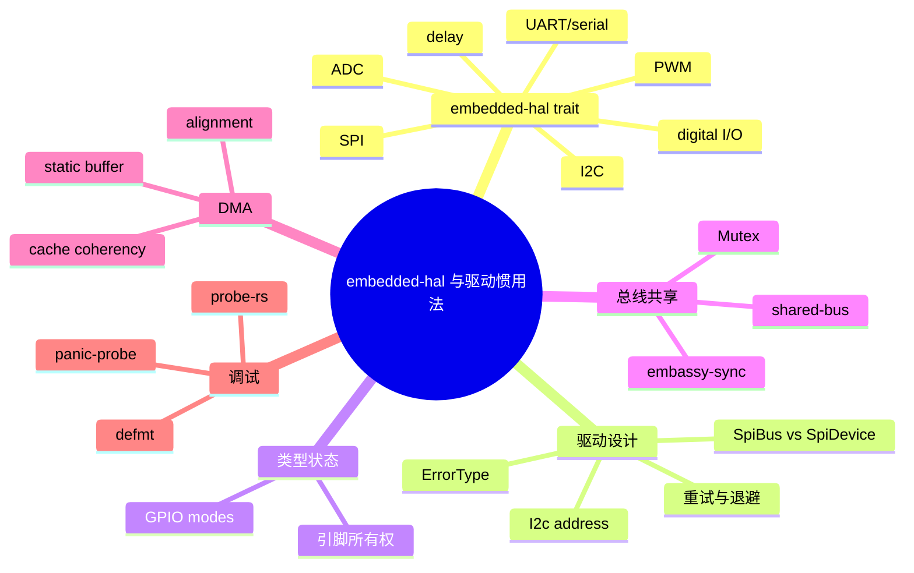
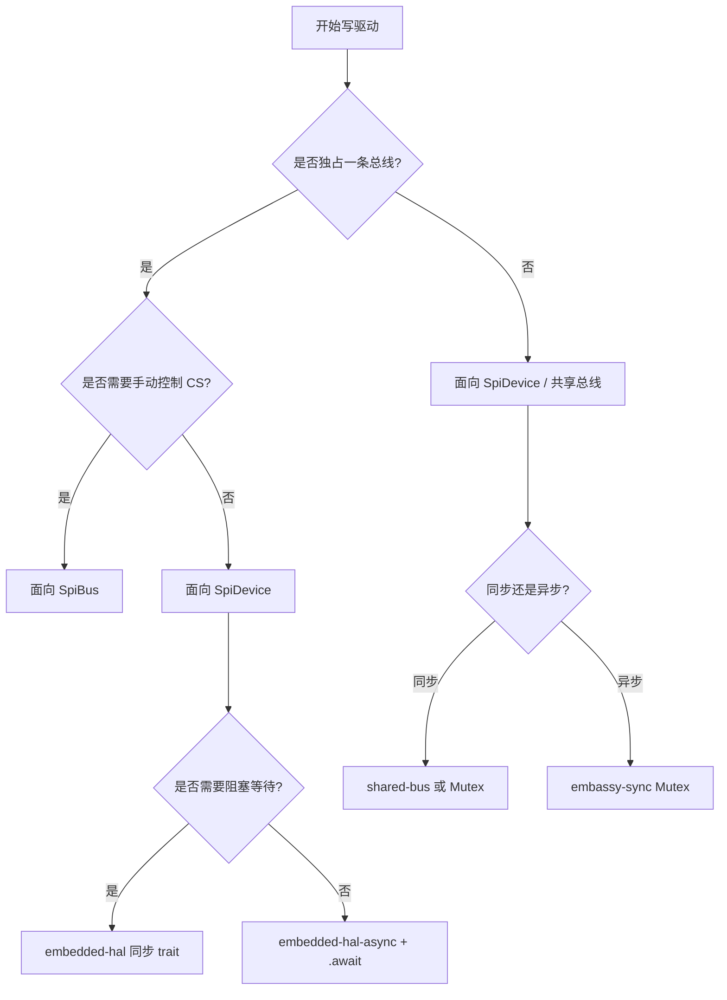

> **内容分级**: [专家级]
> **代码状态**: ⚠️ 裸机/目标平台相关代码标注 `rust,ignore`/`no_run`， host 平台无法直接编译
> **定理链**: N/A — 描述性/工程性文档
>
# `embedded-hal` 与驱动惯用法
>
> **EN**: Embedded-HAL and Driver Idioms
> **Summary**: Idioms for writing and using embedded drivers with `embedded-hal` 1.0: digital I/O, SPI/I2C/UART trait contracts, type-state pins, shared buses, DMA buffer ownership, error handling, `defmt`, and probe-rs debugging.
> **Rust 版本**: 1.97.0+ (Edition 2024)
>
> **受众**: [专家]
> **Bloom 层级**: L4
> **权威来源**: 本文件为 `concept/` 权威页。
> **A/S/P 标记**: **S+A+P** — Structure + Application + Procedure
> **双维定位**: P×Cre — 编写可移植、类型安全的嵌入式设备驱动
> **前置概念**: [Rust 嵌入式系统开发](03_embedded_systems.md) · [PAC 与 HAL 实现](17_pac_hal_implementation.md) · [embedded-hal 1.0 迁移](09_embedded_hal_1_0_migration.md) · [no_std 与裸机惯用法](23_no_std_and_bare_metal_idioms.md)
> **后置概念**: [嵌入式协议与外设驱动](22_embedded_protocol_drivers.md) · [异步 no_std 嵌入式](11_async_no_std_embedded.md) · [嵌入式调试与日志](20_embedded_debugging_logging.md)

---

> **来源**: [embedded-hal 1.0](https://docs.rs/embedded-hal/1.0.0/embedded_hal/) · [embedded-hal-async](https://docs.rs/embedded-hal-async/latest/embedded_hal_async/) · [embedded-io](https://docs.rs/embedded-io/latest/embedded_io/) · [shared-bus](https://docs.rs/shared-bus/) · [embassy-sync](https://docs.rs/embassy-sync/) · [defmt](https://docs.rs/defmt/) · [probe-rs](https://probe.rs/) · [The Embedded Rust Book](https://docs.rust-embedded.org/book/) · [Embassy Book](https://embassy.dev/book/) · [Knurling](https://knurling.ferrous-systems.com/) · [Ferrous Systems](https://ferrous-systems.com/)

---

## 🧠 知识结构图



## 📑 目录

- [`embedded-hal` 与驱动惯用法](#embedded-hal-与驱动惯用法)
  - [🧠 知识结构图](#-知识结构图)
  - [📑 目录](#-目录)
  - [一、权威定义](#一权威定义)
  - [二、`embedded-hal` 1.0 trait 概览与属性矩阵](#二embedded-hal-10-trait-概览与属性矩阵)
  - [三、数字 I/O](#三数字-io)
  - [四、SPI、I2C 与 UART trait 契约](#四spii2c-与-uart-trait-契约)
    - [4.1 `SpiBus` vs `SpiDevice`](#41-spibus-vs-spidevice)
    - [4.2 `I2c`](#42-i2c)
    - [4.3 UART / 串口](#43-uart--串口)
  - [五、类型状态引脚](#五类型状态引脚)
  - [六、共享总线](#六共享总线)
    - [6.1 同步共享：`shared-bus` / `critical_section::Mutex`](#61-同步共享shared-bus--critical_sectionmutex)
    - [6.2 异步共享：`embassy-sync`](#62-异步共享embassy-sync)
  - [七、DMA 缓冲区所有权](#七dma-缓冲区所有权)
  - [八、驱动中的错误处理](#八驱动中的错误处理)
  - [九、`defmt`、probe-rs 与调试](#九defmtprobe-rs-与调试)
  - [十、常见驱动反模式](#十常见驱动反模式)
  - [十一、反例与失效模式](#十一反例与失效模式)
  - [十二、边界测试](#十二边界测试)
    - [12.1 边界测试：未实现 `ErrorType` 直接 impl 功能 trait](#121-边界测试未实现-errortype-直接-impl-功能-trait)
    - [12.2 边界测试：错误地在两次 `SpiBus` 操作之间释放 CS](#122-边界测试错误地在两次-spibus-操作之间释放-cs)
    - [12.3 边界测试：DMA 使用栈缓冲区](#123-边界测试dma-使用栈缓冲区)
  - [十三、决策树：驱动实现选型](#十三决策树驱动实现选型)
  - [十四、相关概念](#十四相关概念)
  - [🧭 思维导图（Mindmap）](#-思维导图mindmap)

---

## 一、权威定义

> **embedded-hal**: A hardware abstraction layer (HAL) for embedded systems. It provides a set of traits that describe the capabilities of hardware peripherals, allowing drivers to be written once and used on many platforms.

**`embedded-hal`**：Rust 嵌入式生态的硬件抽象 trait 集合。它把 GPIO、SPI、I2C、串口、延时、PWM、ADC 等外设能力表达为 trait，使驱动 crate 可以面向 trait 编程而不依赖具体 MCU。

**驱动 crate（driver crate）**：只依赖 `embedded-hal` trait（或 `embedded-hal-async`）实现的设备逻辑 crate，例如 `mcp2515`、`ssd1306`、`bme280`。它不关心底层是 STM32、nRF 还是 RP2040。

判定依据：驱动可移植性的边界是 trait 契约；超出契约的时序、缓冲策略、错误恢复必须由驱动文档明确说明。

---

## 二、`embedded-hal` 1.0 trait 概览与属性矩阵

| Trait / 模块 | 核心能力 | 同步 crate | 异步 crate | 关键类型/说明 |
|:---|:---|:---|:---|:---|
| `digital::InputPin` | 读取引脚电平 | `embedded-hal` | `embedded-hal-async` | `ErrorType` + `ErrorKind` |
| `digital::OutputPin` | 设置引脚高/低 | `embedded-hal` | `embedded-hal-async` | 返回 `Result<(), Self::Error>` |
| `digital::StatefulOutputPin` | 可读取输出状态的 OutputPin | `embedded-hal` | — | 适合需要回读的驱动 |
| `spi::SpiBus` | 独占总线原始读写 | `embedded-hal` | `embedded-hal-async` | 不管理 CS |
| `spi::SpiDevice` | 共享总线上的设备事务 | `embedded-hal` | `embedded-hal-async` | 自动 CS + `Operation` |
| `i2c::I2c` | I2C 读写 + `write_read` | `embedded-hal` | `embedded-hal-async` | 7-bit / 10-bit address |
| `delay::DelayNs` | 纳秒/毫秒延时 | `embedded-hal` | `embedded-hal-async` | 阻塞 / async |
| `pwm::SetDutyCycle` | 设置 PWM 占空比 | `embedded-hal` | — | `max_duty_cycle` |
| `adc::OneShot` | 单次 ADC 采样 | `embedded-hal` | — | `read(pin)` |
| `serial::ErrorType` | 串口错误类型基础设施 | `embedded-hal` | — | 实际字节流见 `embedded-io` |

> **来源**: [embedded-hal 1.0 docs](https://docs.rs/embedded-hal/1.0.0/embedded_hal/) · [embedded-hal-async docs](https://docs.rs/embedded-hal-async/latest/embedded_hal_async/)

判定依据：写驱动时应优先面向 `SpiDevice`、`I2c`、`OutputPin`、`DelayNs` 等高级 trait；只有在需要直接控制片选或总线时，才使用 `SpiBus`。

---

## 三、数字 I/O

`OutputPin` 返回 `Result`，因为某些 HAL 的 GPIO 操作可能失败（如引脚未配置为输出）。驱动中不应无条件 `.unwrap()`。

```rust,ignore
use embedded_hal::digital::{InputPin, OutputPin};

pub struct ButtonLed<BTN, LED> {
    button: BTN,
    led: LED,
}

impl<BTN, LED, E> ButtonLed<BTN, LED>
where
    BTN: InputPin<Error = E>,
    LED: OutputPin<Error = E>,
{
    pub fn poll(&mut self) -> Result<(), E> {
        if self.button.is_high()? {
            self.led.set_high()?;
        } else {
            self.led.set_low()?;
        }
        Ok(())
    }
}
```

---

## 四、SPI、I2C 与 UART trait 契约

### 4.1 `SpiBus` vs `SpiDevice`

| 视角 | `SpiBus` | `SpiDevice` |
|:---|:---|:---|
| 所有权 | 独占总线 | 总线的一个从设备 |
| CS 管理 | 手动 | 自动（transaction 内保持低） |
| 适用 | 单一从设备、高性能 | 多从设备共享总线 |
| 可移植性 | 中 | 高 |

```rust,ignore
use embedded_hal::spi::{SpiBus, SpiDevice, Operation};

// 使用 SpiBus 时必须手动控制 CS
fn raw_read_id<BUS, CS, E>(bus: &mut BUS, cs: &mut CS) -> Result<u8, E>
where
    BUS: SpiBus<Error = E>,
    CS: embedded_hal::digital::OutputPin<Error = E>,
{
    cs.set_low()?;
    let mut cmd = [0x9F, 0, 0];
    bus.transfer_in_place(&mut cmd)?;
    cs.set_high()?;
    Ok(cmd[1])
}

// 使用 SpiDevice 时 CS 由 transaction 自动管理
fn device_read_id<DEV, E>(dev: &mut DEV) -> Result<u8, E>
where
    DEV: SpiDevice<Error = E>,
{
    let mut buf = [0u8; 3];
    dev.transaction(&mut [
        Operation::Write(&[0x9F]),
        Operation::Read(&mut buf),
    ])?;
    Ok(buf[0])
}
```

### 4.2 `I2c`

```rust,ignore
use embedded_hal::i2c::I2c;

const ADDR: u8 = 0x50;

pub fn eeprom_read<I2C, E>(i2c: &mut I2C, mem_addr: u16, buf: &mut [u8]) -> Result<(), E>
where
    I2C: I2c<Error = E>,
{
    i2c.write_read(ADDR, &mem_addr.to_be_bytes(), buf)
}
```

### 4.3 UART / 串口

`embedded-hal` 1.0 本身不再提供阻塞字节流 trait；串口字节流抽象由 [`embedded-io`](https://docs.rs/embedded-io/) / [`embedded-io-async`](https://docs.rs/embedded-io-async/) 提供。

```rust,ignore
use embedded_io::Write;

pub fn log_line<UART, E>(uart: &mut UART, msg: &[u8]) -> Result<(), E>
where
    UART: Write<Error = E>,
{
    uart.write_all(msg)?;
    uart.write_all(b"\r\n")?;
    Ok(())
}
```

---

## 五、类型状态引脚

类型状态把 GPIO 配置阶段编码进类型，误用会在编译期被拒绝。

```rust,ignore
use core::marker::PhantomData;

pub struct Input<F> { _mode: PhantomData<F> }
pub struct Floating;
pub struct PullUp;

pub struct Output<P> { _drive: PhantomData<P> }
pub struct PushPull;
pub struct OpenDrain;

pub struct Pin<MODE> {
    _mode: PhantomData<MODE>,
}

impl Pin<Input<Floating>> {
    pub fn into_pull_up(self) -> Pin<Input<PullUp>> {
        // 配置上拉
        Pin { _mode: PhantomData }
    }
}

impl Pin<Output<PushPull>> {
    pub fn set_high(&mut self) { /* ... */ }
}

// 编译错误：输入引脚不能调用 set_high
// let p: Pin<Input<Floating>> = ...;
// p.set_high();
```

判定依据：类型状态适合引脚资源有限、配置错误代价高的 MCU；状态多时会增加单态化体积，需要权衡。

---

## 六、共享总线

当多个驱动需要共用一条 SPI/I2C 总线时，必须保证同一时刻只有一个驱动访问总线。

### 6.1 同步共享：`shared-bus` / `critical_section::Mutex`

```rust,ignore
use core::cell::RefCell;
use critical_section::Mutex;
use embedded_hal::spi::SpiBus;
use embedded_hal::digital::OutputPin;

// 总线被 Mutex<RefCell<...>> 保护
static BUS: Mutex<RefCell<Option<MySpi>>> = Mutex::new(RefCell::new(None));

fn init_bus(spi: MySpi) {
    critical_section::with(|cs| {
        *BUS.borrow(cs).borrow_mut() = Some(spi);
    });
}

fn use_bus<F, R>(f: F) -> R
where
    F: FnOnce(&mut MySpi) -> R,
{
    critical_section::with(|cs| {
        let mut bus = BUS.borrow(cs).borrow_mut();
        f(bus.as_mut().unwrap())
    })
}
```

### 6.2 异步共享：`embassy-sync`

```rust,ignore
use embassy_sync::blocking_mutex::raw::CriticalSectionRawMutex;
use embassy_sync::mutex::Mutex;
use embassy_embedded_hal::shared_bus::asynch::spi::SpiDevice;

static SPI_BUS: Mutex<CriticalSectionRawMutex, MySpi> = Mutex::new(MySpi::new());

#[embassy_executor::task]
async fn sensor_task() {
    let mut dev = SpiDevice::new(&SPI_BUS, CsPin::new());
    let mut buf = [0u8; 4];
    dev.read(&mut buf).await.unwrap();
}
```

判定依据：同步环境用 `shared-bus` 或 `critical_section::Mutex<RefCell<T>>`；异步环境用 `embassy-sync` 的 `Mutex` + `SpiDevice`。

---

## 七、DMA 缓冲区所有权

DMA 要求缓冲区在传输期间保持有效，通常需要 `'static` 生命周期与正确的对齐。

```rust,ignore
#[repr(align(4))]
static mut TX_BUF: [u8; 256] = [0; 256];

fn start_tx(dma: &mut Dma, data: &[u8]) {
    unsafe {
        TX_BUF[..data.len()].copy_from_slice(data);
        dma.start(TX_BUF.as_ptr(), data.len());
    }
}
```

**关键约束**：

| 约束 | 说明 | 失败后果 |
|:---|:---|:---|
| `'static` | 缓冲区不能是栈临时变量 | DMA 写已释放内存 |
| 对齐 | 起始地址与长度需满足 DMA 要求 | 总线错误 / 数据错位 |
| DMA 可访问 RAM | 避开 CCM/ITCM 等不可见区域 | 静默数据错误 |
| Cache 一致性 | Cortex-M7 等需清洗/失效 D-cache | 读到旧数据 |

判定依据：DMA 缓冲区所有权是嵌入式驱动中最容易引入未定义行为的环节；推荐用 HAL 提供的 DMA 安全包装类型（如 Embassy 的 `BlockingMutex` + `DmaBuf`）代替裸 `static mut`。

---

## 八、驱动中的错误处理

`embedded-hal` 1.0 要求先实现 `ErrorType`，再实现功能 trait；错误类型可通过 `kind()` 映射到标准 `ErrorKind`。

```rust,ignore
use embedded_hal::spi::{ErrorType, ErrorKind, Error as SpiErrorTrait, SpiDevice};

#[derive(Debug)]
pub enum MySpiError {
    Timeout,
    Overrun,
    BusFault,
}

impl SpiErrorTrait for MySpiError {
    fn kind(&self) -> ErrorKind {
        match self {
            MySpiError::Overrun => ErrorKind::Overrun,
            _ => ErrorKind::Other,
        }
    }
}

impl ErrorType for MyDevice {
    type Error = MySpiError;
}
```

**重试与退避**：

```rust,ignore
pub fn with_retry<T, E>(
    mut op: impl FnMut() -> Result<T, E>,
    max: u32,
) -> Result<T, E> {
    for i in 0..max {
        match op() {
            Ok(v) => return Ok(v),
            Err(e) if i == max - 1 => return Err(e),
            Err(_) => {
                let us = 1u32 << i.min(6);
                cortex_m::asm::delay(us * 1000);
            }
        }
    }
    unreachable!()
}
```

---

## 九、`defmt`、probe-rs 与调试

[`defmt`](https://docs.rs/defmt/) 通过延迟格式化把格式字符串留在主机端，目标端只传输原始参数，极大降低固件体积。

```rust,ignore
use defmt::{info, error, Format};

#[derive(Format)]
pub enum SensorError {
    Timeout,
    Nack,
}

fn read_sensor() -> Result<u16, SensorError> {
    info!("reading sensor...");
    if fail {
        error!("sensor failed: {:?}", SensorError::Timeout);
        return Err(SensorError::Timeout);
    }
    Ok(42)
}
```

```toml
[dependencies]
defmt = "0.3"
defmt-rtt = "0.4"
panic-probe = { version = "0.3", features = ["print-defmt"] }
```

**probe-rs 工作流**：

```bash
# 烧录并自动连接 RTT/defmt
probe-rs run --chip STM32F407VG target/thumbv7em-none-eabihf/release/app

# 仅下载
probe-rs download --chip STM32F407VG target/thumbv7em-none-eabihf/release/app
```

判定依据：开发阶段优先使用 `defmt` + `probe-rs` + `panic-probe`；量产阶段根据需求选择 `panic-reset`、UART 日志或完全不输出。

---

## 十、常见驱动反模式

| 反模式 | 问题 | 惯用修正 |
|:---|:---|:---|
| 面向 `SpiBus` 写多设备驱动 | 调用方需手动管理 CS，易错 | 面向 `SpiDevice` |
| 在 `SpiBus` 两次 write 之间释放 CS | 从设备误判事务边界 | 用 `SpiDevice::transaction` |
| 忽略 `OutputPin::set_high` 的 `Result` | 静默失败 | 显式 `?` 或错误传播 |
| 把 DMA 缓冲区放在栈上 | 未定义行为 | `'static` 或 DMA 安全包装 |
| I2C NACK 直接 panic | 总线瞬态错误 | 指数退避重试 |
| 在 async ISR 中 `.await` 阻塞操作 | 破坏实时性 | 使用 channel / defer 到任务 |
| 混用 `embedded-hal` 0.2 与 1.0 | trait 不匹配 | 统一版本线或使用兼容 shim |
| 把 HAL 特定错误直接暴露给用户 | 破坏可移植性 | 映射到 `ErrorKind` |

---

## 十一、反例与失效模式

| 失效模式 | 根因 | 修复方向 |
|:---|:---|:---|
| SPI 读取数据错位 | CS 在事务中间被释放 | 使用 `SpiDevice` |
| I2C 永远 NACK | 地址错误 / 未上拉 / 未使能时钟 | 核对地址、上拉、RCC |
| DMA 数据随机错 | 缓冲区在 CCM 或 cache 未同步 | 放到 DMA 可见 RAM 并清洗 cache |
| 驱动编译不过 | trait bound 中 `Error` 类型不匹配 | 先实现 `ErrorType` |
| 多驱动共享 SPI 数据损坏 | 无互斥保护 | `shared-bus` / `embassy-sync` |
| 日志把固件撑爆 | `core::fmt` 引入大量代码 | 使用 `defmt` |
| async 驱动在 no_std 无法编译 | 缺少 `embedded-hal-async` 或 executor | 配置 Embassy/RTIC async |

---

## 十二、边界测试

### 12.1 边界测试：未实现 `ErrorType` 直接 impl 功能 trait

```rust,ignore
// ❌ 错误：embedded-hal 1.0 中必须先实现 ErrorType
use embedded_hal::spi::SpiDevice;

struct MyDevice;

impl SpiDevice<u8> for MyDevice {
    fn transaction(&mut self, _ops: &mut [embedded_hal::spi::Operation<'_, u8>])
        -> Result<(), ()> { Ok(()) }
}
```

> **修正**：
>
> ```rust,ignore
> use embedded_hal::spi::{ErrorType, ErrorKind, SpiDevice};
>
> impl ErrorType for MyDevice {
>     type Error = ErrorKind;
> }
> impl SpiDevice<u8> for MyDevice { /* ... */ }
> ```

### 12.2 边界测试：错误地在两次 `SpiBus` 操作之间释放 CS

```rust,ignore
// ❌ 错误：从设备把两次传输当作独立命令
fn bad_read(spi: &mut impl embedded_hal::spi::SpiBus, cs: &mut impl embedded_hal::digital::OutputPin) {
    cs.set_low().ok();
    spi.write(&[0x0B, 0x00]).ok();
    cs.set_high().ok(); // 事务未结束就释放
    cs.set_low().ok();
    spi.read(&mut [0; 4]).ok();
    cs.set_high().ok();
}
```

> **修正**：整个命令+读取保持在同一 transaction 内，或使用 `SpiDevice`。

### 12.3 边界测试：DMA 使用栈缓冲区

```rust,ignore
fn bad_dma(dma: &mut Dma) {
    let mut buf = [0u8; 64];
    // ❌ DMA 在函数返回后继续写入栈内存
    dma.start(&mut buf);
}
```

> **修正**：使用 `static mut` 或 `'static` 缓冲区，并保证生命周期覆盖传输。

---

## 十三、决策树：驱动实现选型



---

## 十四、相关概念

- [Rust 嵌入式系统开发](03_embedded_systems.md)
- [PAC 与 HAL 实现](17_pac_hal_implementation.md)
- [embedded-hal 1.0 迁移](09_embedded_hal_1_0_migration.md)
- [no_std 与裸机惯用法](23_no_std_and_bare_metal_idioms.md)
- [嵌入式协议与外设驱动](22_embedded_protocol_drivers.md)
- [异步 no_std 嵌入式](11_async_no_std_embedded.md)
- [嵌入式调试与日志](20_embedded_debugging_logging.md)
- [no_std 同步原语](15_no_std_synchronization_primitives.md)
- [嵌入式内存分配器](16_embedded_memory_allocators.md)

---

> **权威来源**: [embedded-hal 1.0 docs](https://docs.rs/embedded-hal/1.0.0/embedded_hal/) · [embedded-hal-async docs](https://docs.rs/embedded-hal-async/latest/embedded_hal_async/) · [embedded-io docs](https://docs.rs/embedded-io/latest/embedded_io/) · [shared-bus crate](https://docs.rs/shared-bus/) · [embassy-sync crate](https://docs.rs/embassy-sync/) · [defmt docs](https://docs.rs/defmt/) · [probe-rs](https://probe.rs/) · [Embassy Book](https://embassy.dev/book/) · [Knurling](https://knurling.ferrous-systems.com/)
>
> **权威来源对齐变更日志**: 2026-07-31 创建

**文档版本**: 1.0
**最后更新**: 2026-07-31
**状态**: ✅ 概念文件创建完成

---

## 🧭 思维导图（Mindmap）


> **认知功能**: 本 mindmap 从 trait 抽象、驱动设计、类型状态、总线共享、DMA 所有权与调试六个维度组织内容，可作为编写嵌入式驱动的快速导航索引。
