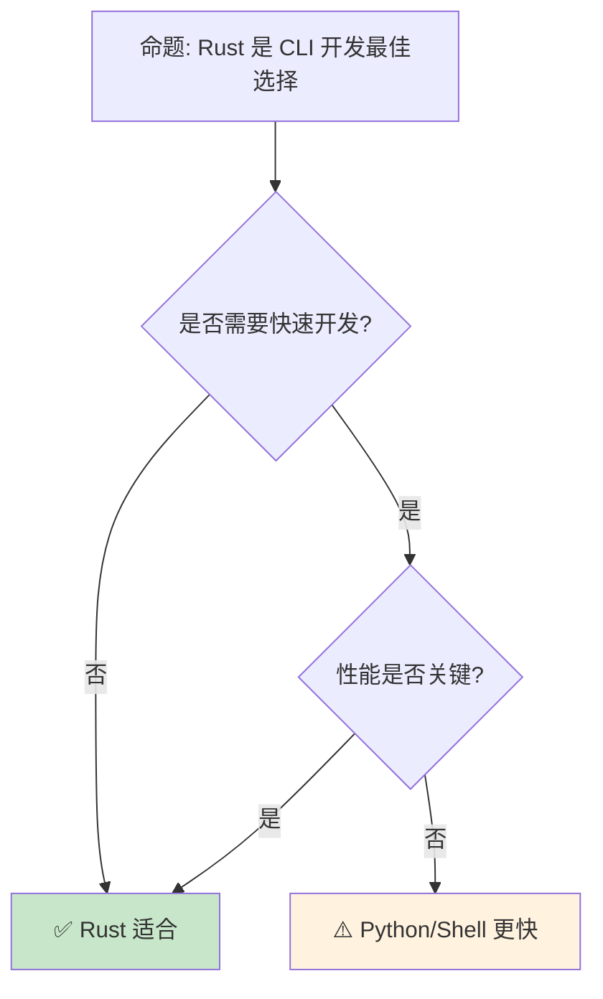

> **内容分级**: [综述级]
> **代码状态**: ✅ 含可编译示例
>
> **定理链**: N/A — 描述性/综述性/导航性文档，不涉及形式化定理链
>
# Rust CLI 开发生态
>
> **EN**: CLI Development
> **Summary**: CLI Development: Rust ecosystem tools, crates, and engineering practices.
>
> **受众**: [进阶]
> **Bloom 层级**: 应用 → 分析
> **A/S/P 标记**: **A+S** — ApplicationStructure
> **双维定位**: C×App — 应用 CLI 开发模式
> **定位**: 探讨 Rust 在命令行工具开发领域的生态——从 clap 的参数解析到 indicatif 的进度条，分析 Rust 如何成为现代 CLI 工具的首选语言。
> **前置概念**: [Error Handling](../../02_intermediate/03_error_handling/04_error_handling.md) · [Type System](../../01_foundation/02_type_system/04_type_system.md) · [Traits](../../02_intermediate/00_traits/01_traits.md)
> **后置概念**: [Performance](../10_performance/15_performance_optimization.md) · [Cross Compilation](17_cross_compilation.md)

---

> **来源**: [Rust CLI Book](https://rust-cli.github.io/book/index.html) · [clap](https://docs.rs/clap/) · [Cargo Book](https://doc.rust-lang.org/cargo/index.html) · [Brown University — Interactive Rust Book](https://rust-book.cs.brown.edu/) · [Jung et al. — RustBelt: Securing the Foundations of Rust](https://plv.mpi-sws.org/rustbelt/popl18/) · [Itanium C++ ABI](https://itanium-cxx-abi.github.io/cxx-abi/abi.html)
> **前置依赖**: [Type Theory](../../04_formal/00_type_theory/02_type_theory.md)
> **前置依赖**: [Rust vs C++](../../05_comparative/01_systems_languages/01_rust_vs_cpp.md)

## 📑 目录

- [Rust CLI 开发生态](#rust-cli-开发生态)
  - [📑 目录](#-目录)
  - [一、核心概念](#一核心概念)
    - [1.1 CLI 设计原则](#11-cli-设计原则)
    - [1.2 参数解析](#12-参数解析)
  - [二、关键 crate](#二关键-crate)
    - [2.1 clap](#21-clap)
    - [2.2 交互与输出](#22-交互与输出)
    - [2.3 配置管理](#23-配置管理)
  - [三、打包与分发](#三打包与分发)
    - [3.1 单一二进制](#31-单一二进制)
    - [3.2 安装方式](#32-安装方式)
    - [3.3 Shell 补全与文档生成](#33-shell-补全与文档生成)
  - [四、反命题与边界分析](#四反命题与边界分析)
    - [4.1 反命题树](#41-反命题树)
    - [4.2 边界极限](#42-边界极限)
  - [五、常见陷阱](#五常见陷阱)
  - [六、来源与延伸阅读](#六来源与延伸阅读)
  - [相关概念文件](#相关概念文件)
  - [权威来源索引](#权威来源索引)
  - [十、边界测试：CLI 开发的编译错误](#十边界测试cli-开发的编译错误)
    - [10.1 边界测试：`clap` 派生宏（Macro）的字段类型约束（编译错误）](#101-边界测试clap-派生宏的字段类型约束编译错误)
    - [10.2 边界测试：信号处理与异步（Async）代码的交互（编译错误）](#102-边界测试信号处理与异步代码的交互编译错误)
    - [10.6 边界测试：终端颜色检测与 `NO_COLOR` 标准（运行时（Runtime）显示问题）](#106-边界测试终端颜色检测与-no_color-标准运行时显示问题)
    - [10.7 边界测试：ANSI 颜色代码与 Windows 旧版控制台兼容性问题（运行时（Runtime）显示异常）](#107-边界测试ansi-颜色代码与-windows-旧版控制台兼容性问题运行时显示异常)
    - [10.3 边界测试：`clap` 的 derive 宏（Macro）与字段类型不匹配（编译错误）](#103-边界测试clap-的-derive-宏与字段类型不匹配编译错误)
    - [补充定理链](#补充定理链)
  - [嵌入式测验（Embedded Quiz）](#嵌入式测验embedded-quiz)
    - [测验 1：`clap` crate 在 Rust CLI 开发中提供什么功能？（理解层）](#测验-1clap-crate-在-rust-cli-开发中提供什么功能理解层)
    - [测验 2：`indicatif` 和 `console` crate 在 CLI 中分别有什么用途？（理解层）](#测验-2indicatif-和-console-crate-在-cli-中分别有什么用途理解层)
    - [测验 3：为什么 Rust 的 CLI 二进制文件通常比 Python/Node.js 脚本启动更快？（理解层）](#测验-3为什么-rust-的-cli-二进制文件通常比-pythonnodejs-脚本启动更快理解层)
    - [测验 4：`shell completion`（命令自动补全）在 Rust CLI 中通常如何生成？（理解层）](#测验-4shell-completion命令自动补全在-rust-cli-中通常如何生成理解层)
    - [测验 5：`cargo install` 与系统包管理器（apt/brew）安装 Rust CLI 工具各有什么优劣？（理解层）](#测验-5cargo-install-与系统包管理器aptbrew安装-rust-cli-工具各有什么优劣理解层)
  - [认知路径](#认知路径)
    - [核心推理链](#核心推理链)
    - [反命题与边界](#反命题与边界)

---

## 一、核心概念
>
>

### 1.1 CLI 设计原则
>

```text
CLI 设计原则:

  Unix [来源: [Unix Philosophy](https://en.wikipedia.org/wiki/Unix_philosophy)] 哲学:
  ├── 做一件事，做好它
  ├── 文本流作为通用接口
  ├── 组合小工具
  └── 沉默是金（无输出=成功）

  现代 CLI 原则:
  ├── 清晰的帮助信息
  ├── 一致的参数风格
  ├── 合理的默认值
  ├── 环境变量支持
  ├── 配置文件支持
  ├── 彩色输出
  └── 良好的错误信息

  Rust CLI 优势:
  ├── 单一静态二进制（易分发）
  ├── 快速启动（无 JIT）
  ├── 内存安全（无崩溃）
  ├── 跨平台（cargo build）
  └── 现代工具链（cargo install）
```

**可编译示例** — 标准库实现的极简 CLI：

```rust
use std::env;

fn main() {
    let args: Vec<String> = env::args().collect();

    match args.len() {
        1 => println!("Usage: {} <name>", args[0]),
        _ => println!("Hello, {}!", args[1]),
    }
}
```

> **认知功能**: **Rust 的单一二进制和快速启动使其成为 CLI 工具的理想选择**——用户体验优于解释型语言。
> [来源: [Rust CLI Book](https://rust-cli.github.io/book/index.html)]

---

### 1.2 参数解析
>

```text
参数解析模式:

  位置参数:
  mytool input.txt output.txt

  选项参数:
  mytool --verbose --output file.txt
  mytool -v -o file.txt
  mytool -vo file.txt

  子命令:
  git clone <url>
  git commit -m "message"
  git push origin main

  Rust 中的实现:
  ├── clap: 功能最丰富
  ├── structopt: clap 3 的 derive 层（已合并到 clap）
  ├── argh:  Google 的轻量选项
  └── pico-args: 极简

  代码示例 (clap derive):

  use clap::{Parser, Subcommand};

  #[derive(Parser)]
  #[command(name = "mytool")]
  struct Cli {
      #[arg(short, long)]
      verbose: bool,

      #[arg(short, long, default_value = "output.txt")]
      output: String,

      #[command(subcommand)]
      command: Commands,
  }

  #[derive(Subcommand)]
  enum Commands {
      Clone { url: String },
      Commit { message: String },
  }
```

> **参数洞察**: **clap 的 derive 宏（Macro）让 CLI 定义变得声明式**——结构体（Struct）即命令行接口。
> [来源: [clap derive](https://docs.rs/clap/latest/clap/_derive/index.html)]

---

## 二、关键 crate

### 2.1 clap
>

```text
clap 生态:

  功能:
  ├── 位置参数
  ├── 选项/标志
  ├── 子命令
  ├── 参数验证
  ├── 自动生成帮助
  ├── Shell [来源: [Shell Script](https://en.wikipedia.org/wiki/Shell_script)] 补全生成
  └──  man page 生成

  代码示例:

  use clap::Parser;

  #[derive(Parser)]
  #[command(author, version, about)]
  struct Args {
      #[arg(short, long)]
      config: Option<String>,

      #[arg(short, long, action = clap::ArgAction::Count)]
      verbose: u8,

      files: Vec<String>,
  }

  fn main() {
      let args = Args::parse();
      println!("{:?}", args);
  }

  生成帮助:
  $ mytool --help
  Usage: mytool [OPTIONS] [FILES]...

  Options:
    -c, --config <CONFIG>
    -v, --verbose
    -h, --help            Print help
    -V, --version         Print version
```

> **clap 洞察**: **clap 是 Rust CLI 生态的核心**——从参数解析到帮助生成，一站式解决。
> [来源: [clap](https://docs.rs/clap/latest/clap/)]

---

### 2.2 交互与输出
>

```text
交互 crate:

  输出美化:
  ├── dialoguer: 交互式提示
  ├── indicatif: 进度条
  ├── console: 终端控制
  ├── termcolor: 跨平台颜色
  └── ansi_term: ANSI 颜色

  代码示例:

  use indicatif::{ProgressBar, ProgressStyle};

  let pb = ProgressBar::new(100);
  pb.set_style(ProgressStyle::default_bar()
      .template("{spinner:.green} [{elapsed_precise}] [{bar:40.cyan/blue}] {pos}/{len} ({eta})")
      .progress_chars("#>-"));

  for i in 0..100 {
      pb.set_position(i);
      std::thread::sleep(std::time::Duration::from_millis(50));
  }
  pb.finish_with_message("done");

  日志输出:
  ├── tracing: 结构化日志
  ├── log: 标准日志 facade
  ├── env_logger: 环境变量配置
  └── simplelog: 简单文件日志
```

> **交互洞察**: **Rust CLI 的交互生态成熟且类型安全**——进度条、提示、颜色都通过 trait 抽象。
> [来源: [indicatif](https://docs.rs/indicatif/latest/indicatif/)] · [来源: [dialoguer](https://docs.rs/dialoguer/latest/dialoguer/)]

### 2.3 配置管理
>

```text
配置管理生态:
  ├── serde + toml/json/yaml: 结构化配置解析
  ├── config: 分层配置（文件 + 环境变量 + 默认值）
  ├── directories: XDG / 平台标准配置路径
  └── envy: 环境变量反序列化到 struct

配置优先级（从高到低）:
  1. 命令行参数（--config key=value）
  2. 环境变量（MYAPP_KEY=value）
  3. 本地配置文件（./.myapp.toml）
  4. 用户配置文件（~/.config/myapp/config.toml）
  5. 系统配置文件（/etc/myapp/config.toml）
  6. 默认值（代码中硬编码）
```

```rust,ignore
use serde::{Deserialize, Serialize};
use config::{Config, ConfigError, Environment, File};

#[derive(Debug, Deserialize, Serialize)]
struct AppConfig {
    #[serde(default = "default_port")]
    port: u16,
    #[serde(default = "default_host")]
    host: String,
    #[serde(default)]
    verbose: bool,
}

fn load_config() -> Result<AppConfig, ConfigError> {
    let s = Config::builder()
        .add_source(File::with_name("/etc/myapp/config").required(false))
        .add_source(File::with_name("~/.config/myapp/config").required(false))
        .add_source(File::with_name(".myapp").required(false))
        .add_source(Environment::with_prefix("MYAPP"))
        .build()?;
    s.try_deserialize()
}

fn default_port() -> u16 { 8080 }
fn default_host() -> String { "localhost".to_string() }
```

> **配置洞察**: Rust CLI 的配置管理遵循 **XDG Base Directory Specification**，通过 `directories` crate 获取平台标准路径（Linux: ~/.config/, macOS: ~/Library/Application Support/, Windows: %APPDATA%）。分层配置设计允许用户、系统和项目级覆盖。[来源: [config crate](https://docs.rs/config/latest/config/)] · [XDG Spec](https://specifications.freedesktop.org/basedir-spec/basedir-spec-latest.html)

---

## 三、打包与分发

### 3.1 单一二进制
>

```text
单一二进制优势:

  Rust:
  ├── cargo build --release
  ├── 静态链接 musl [来源: [musl libc](https://musl.libc.org/)]（无 glibc 依赖）
  ├── 跨平台编译
  └── 单文件分发

  配置:
  [profile.release]
  lto = true          # 链接时优化
  strip = true        # 去除符号
  opt-level = 3       # 最高优化
  codegen-units = 1   # 单代码生成单元

  结果:
  ├── 几 MB 的二进制
  ├── 无运行时依赖
  ├── 任何 Linux 发行版运行
  └── 容器镜像 < 5MB

  对比 Python/Node:
  ├── 需要运行时 + 依赖
  ├── 虚拟环境
  ├── 版本冲突
  └── 容器镜像 > 100MB
```

> **二进制洞察**: **Rust 的单一二进制是运维人员的梦想**——部署就是复制一个文件。
> [来源: [Rust CLI Book — Distribution](https://rust-cli.github.io/book/tutorial/packaging.html)]

---

### 3.2 安装方式
>

```text
安装方式:

  cargo install:
  ├── cargo install ripgrep
  ├── 从 crates.io [来源: [crates.io](https://crates.io/)] 安装
  ├── 编译本地安装
  └── ~/.cargo/bin

  包管理器:
  ├── Homebrew [来源: [Homebrew](https://brew.sh/)]: brew install ripgrep
  ├── apt: apt install ripgrep
  ├── Chocolatey: choco install ripgrep
  └── Scoop: scoop install ripgrep

  二进制发布:
  ├── Git [来源: [Git](https://git-scm.com/)]Hub Releases
  ├── 预编译二进制
  ├── 自动更新（self-update crate）
  └── 签名验证

  Web 安装:
  ├── cargo-binstall: 下载预编译而非编译
  ├── 快速安装
  └── 减少编译时间
```

> **分发洞察**: **Rust CLI 工具的分发生态已经成熟**——从 cargo install 到系统包管理器全覆盖。
> [来源: [cargo-binstall](https://github.com/cargo-bins/cargo-binstall)]

### 3.3 Shell 补全与文档生成
>

```text
CLI 文档生成生态:
  ├── clap_complete: 自动生成 Bash/Zsh/Fish/PowerShell 补全脚本
  ├── clap_mangen: 自动生成 man page（roff 格式）
  ├── roff: roff 格式处理
  └── help2man: 从 --help 输出生成 man page
```

```rust,ignore
use clap::{Command, Parser};
use clap_complete::{generate, Generator, Shell};
use clap_mangen::Man;
use std::io;

#[derive(Parser)]
#[command(name = "myapp")]
#[command(about = "A sample CLI app")]
struct Cli {
    #[arg(short, long)]
    config: Option<String>,
}

fn print_completions<G: Generator>(gen: G, cmd: &mut Command) {
    generate(gen, cmd, cmd.get_name().to_string(), &mut io::stdout());
}

fn print_man_page(cmd: Command) {
    let man = Man::new(cmd);
    let mut buffer: Vec<u8> = Default::default();
    man.render(&mut buffer).unwrap();
    println!("{}", String::from_utf8(buffer).unwrap());
}

// 生成补全脚本:
// myapp completions bash > /usr/share/bash-completion/completions/myapp
// myapp completions zsh > /usr/share/zsh/site-functions/_myapp
// myapp completions fish > /usr/share/fish/vendor_completions.d/myapp.fish
```

> **文档洞察**:
> 现代 Rust CLI 工具应**自动生成 shell 补全和 man page**，而非手动维护。
> clap 的 derive 宏（Macro）自动提取参数信息，`clap_complete` 和 `clap_mangen` 将其转换为目标格式。
> 这确保了文档与代码的同步——添加新参数时，补全和手册自动更新。
> [来源: [clap_complete](https://docs.rs/clap_complete/latest/clap_complete/)] ·
> [clap_mangen](https://docs.rs/clap_mangen/latest/clap_mangen/)

---

## 四、反命题与边界分析

### 4.1 反命题树
>



> **认知功能**: **性能关键或长期维护的 CLI 选 Rust，一次性脚本选 Python/Shell**。

---

### 4.2 边界极限
>

```text
边界 1: 编译时间
├── 大型 CLI 编译慢
├── 依赖多增加编译时间
└── 缓解: 增量编译、缓存

边界 2: 动态插件
├── Rust 不支持运行时插件
├── 需要重新编译
└── 缓解: WASM [来源: [WebAssembly](https://webassembly.org/)] 插件、脚本嵌入

边界 3: REPL 体验
├── Rust 无内置 REPL
├── evcxr 可用但不完善
└── 缓解: 使用 Python/JS 嵌入

边界 4: 脚本化
├── Rust 不适合短脚本
├── 编译开销大
└── 缓解: cargo-script、rust-script

边界 5: 学习曲线
├── 所有权增加开发时间
├── 不适合快速原型
└── 缓解: 团队培训
```

> **边界要点**: Rust CLI 的边界与**编译时间**、**动态性**、**REPL**、**脚本化**和**学习**相关。

---

## 五、常见陷阱

```text
陷阱 1: 忽略错误处理
  ❌ 使用 unwrap 处理所有错误
     let file = File::open(path).unwrap();

  ✅ 使用 Result 和 anyhow
     let file = File::open(path)?;

陷阱 2: 硬编码路径
  ❌ 使用字符串拼接路径
     let path = dir + "/" + file;

  ✅ 使用 Path/PathBuf
     let path = Path::new(dir).join(file);

陷阱 3: 忽略终端特性
  ❌ 假设总是彩色输出
     println!("\x1b[31merror\x1b[0m");

  ✅ 使用 console/atty 检测
     if atty::is(atty::Stream::Stdout) { ... }

陷阱 4: 全局状态
  ❌ 使用 lazy_static 管理全局配置
     // 难以测试

  ✅ 使用结构体传递状态
     struct App { config: Config }

陷阱 5: 信号处理不当
  ❌ 忽略 Ctrl-C
     // 可能导致数据损坏

  ✅ 使用 ctrlc crate
     ctrlc::set_handler(|| { ... }).expect("Error setting Ctrl-C handler");
```

> **陷阱总结**: CLI 开发的陷阱主要与**错误处理（Error Handling）**、**路径**、**终端**、**状态**和**信号**相关。
> [来源: [Rust CLI Book — Testing](https://rust-cli.github.io/book/tutorial/testing.html)]

---

## 六、来源与延伸阅读

| 来源 | 可信度 | 说明 |
|:---|:---:|:---|
| [Rust CLI Book](https://rust-cli.github.io/book/index.html) | ✅ 一级 | 官方指南 |
| [clap](https://docs.rs/clap/latest/clap/) | ✅ 一级 | 参数解析 |
| [indicatif](https://docs.rs/indicatif/latest/indicatif/) | ✅ 二级 | 进度条 |
| [dialoguer](https://docs.rs/dialoguer/latest/dialoguer/) | ✅ 二级 | 交互提示 |
| [assert_cmd](https://docs.rs/assert_cmd/latest/assert_cmd/) | ✅ 二级 | CLI 测试 |
| [cargo-binstall](https://github.com/cargo-bins/cargo-binstall) | ✅ 二级 | 二进制安装 |

---

```rust,ignore
// clap 命令行解析示例
use clap::Parser;

#[derive(Parser)]
#[command(name = "myapp")]
struct Cli {
    #[arg(short, long)]
    name: String,
}

fn main() {
    let args = Cli::parse();
    println!("Hello, {}!", args.name);
}
```

## 相关概念文件

- [Error Handling](../../02_intermediate/03_error_handling/04_error_handling.md) — 错误处理（Error Handling）
- [Performance](../10_performance/15_performance_optimization.md) — 性能优化
- [Cross Compilation](17_cross_compilation.md) — 交叉编译
- [Type System](../../01_foundation/02_type_system/04_type_system.md) — 类型系统（Type System）

---

> **权威来源**: [Rust Reference](https://doc.rust-lang.org/reference/introduction.html)
>
> **权威来源对齐变更日志**: 2026-05-22 创建 [Authority Source Sprint Batch 12](../../00_meta/02_sources/international_authority_index.md)

**文档版本**: 1.0
**对应 Rust 版本**: 1.97.0+ (Edition 2024)
**最后更新**: 2026-05-22
**状态**: ✅ 概念文件创建完成

---

## 权威来源索引

>
>
>
>
>
>

---

---

---

## 十、边界测试：CLI 开发的编译错误

### 10.1 边界测试：`clap` 派生宏的字段类型约束（编译错误）

```rust,compile_fail
use clap::Parser;

#[derive(Parser)]
struct Args {
    #[arg(short, long)]
    // ❌ 编译错误: `Vec<i32>` 不支持从字符串直接解析（无 FromStr 实现）
    numbers: Vec<i32>, // clap 的 Vec<T> 仅支持 String 或已实现 ValueEnum 的类型
}

fn main() {
    let args = Args::parse();
    println!("{:?}", args.numbers);
}
```

> **修正**: `clap` 的派生宏通过 `FromStr` trait 将命令行参数字符串转换为目标类型。`i32` 实现了 `FromStr`，但 `Vec<i32>` 的解析逻辑要求多次出现同一参数（`--numbers 1 --numbers 2`），且 `clap` v4 中 `Vec<T>` 的 `T` 必须是 `Clone + Send + Sync + 'static`。更常见的问题是自定义类型未实现 `FromStr` 或 `ValueEnum`。这与 Python 的 `argparse`（运行时（Runtime）类型转换，失败时抛异常）不同——Rust 的类型约束在编译期检查，确保所有参数类型可解析。自定义类型需手动实现 `FromStr` 或使用 `clap::ValueEnum` 派生。[来源: [clap Documentation](https://docs.rs/clap/)] · [来源: [The Rust Programming Language](https://doc.rust-lang.org/book/ch19-03-advanced-traits.html)]

### 10.2 边界测试：信号处理与异步代码的交互（编译错误）

```rust,compile_fail
use std::sync::atomic::{AtomicBool, Ordering};

static RUNNING: AtomicBool = AtomicBool::new(true);

fn main() {
    // ❌ 编译错误/逻辑错误: 信号处理器的非安全操作
    ctrlc::set_handler(|| {
        RUNNING.store(false, Ordering::Relaxed);
        // 在信号处理器中调用非异步安全函数是 UB
        // println!("shutting down"); // 不可在信号处理器中使用!
    }).unwrap();

    while RUNNING.load(Ordering::Relaxed) {
        // 工作循环
    }
}
```

> **修正**:  Unix 信号处理器的执行上下文极受限——只能调用**异步信号安全**（async-signal-safe）的函数。`println!` 涉及锁和内存分配，非信号安全，在信号处理器中调用会导致死锁或数据损坏。Rust 的 `ctrlc` crate 将信号转换为 channel 发送，允许在主线程中安全处理。正确模式：1) 信号处理器仅设置原子标志或写 pipe；2) 主线程通过 `tokio::signal` 或 `crossbeam_channel` 接收通知；3) 在安全的上下文中执行清理。这与 C 的 `signal(2)` 相同约束，但 Rust 的类型系统（Type System）和高阶抽象（channel、async）使安全处理更易实现。[来源: [Rust Signal Hook Documentation](https://docs.rs/signal-hook/)] · [来源: [The Rust Programming Language](https://doc.rust-lang.org/book/ch16-01-threads.html)]

### 10.6 边界测试：终端颜色检测与 `NO_COLOR` 标准（运行时显示问题）

```rust,ignore
fn main() {
    // ❌ 运行时问题: 若未检查终端能力，在管道或文件重定向时输出 ANSI 转义码
    // println!("\x1b[31mred text\x1b[0m");

    // 正确: 使用支持 NO_COLOR 的库
    // if std::env::var_os("NO_COLOR").is_none() && atty::is(atty::Stream::Stdout) {
    //     println!("\x1b[31mred text\x1b[0m");
    // }
}
```

> **修正**: CLI 程序的**终端颜色**输出需考虑：1) **终端能力**：非 TTY（管道、文件重定向）不应输出 ANSI 转义码；2) **`NO_COLOR`** 环境变量（用户禁用颜色的显式请求）；3) **`CLICOLOR`/`CLICOLOR_FORCE`**（其他颜色控制标准）。`anstyle`、`owo-colors`、`console` crate 自动处理这些条件。Rust 的 CLI 生态遵循 **NO_COLOR 约定**（<https://no-color.org/），这是跨语言的行业标准。未遵守导致：1>) 日志文件包含乱码；2) CI 输出不可读；3) 辅助技术（屏幕阅读器）解析困难。这与 Python 的 `colorama`、Go 的 `fatih/color`、Node 的 `chalk` 类似——现代 CLI 框架内置终端能力检测。[来源: [NO_COLOR Standard](https://no-color.org/)] · [来源: [anstyle Crate](https://docs.rs/anstyle/)]

### 10.7 边界测试：ANSI 颜色代码与 Windows 旧版控制台兼容性问题（运行时显示异常）

```rust,ignore
fn main() {
    // ❌ 运行时显示异常: 纯 ANSI 转义序列在 Windows CMD（旧版）显示为乱码
    println!("\x1b[31mRed Text\x1b[0m");
    // Windows 10+ 和 Windows Terminal 支持 ANSI，但旧版 CMD 和 PowerShell 5 不支持
}
```

> **修正**: Rust CLI 工具的跨平台颜色输出：1) `ansi_term` → 已废弃；2) `termcolor` → 显式检测终端能力，Windows 旧版使用 WinAPI；3) `owo-colors` → 自动检测 `NO_COLOR` 环境变量。最佳实践：使用 `anstream`（`clap` 生态）或 `supports-color` crate，自动处理平台差异。`NO_COLOR` 标准：环境变量存在时，所有工具应禁用颜色输出。此外：1) `TERM=dumb` 时禁用；2) 非 TTY（管道输出）时默认禁用；3) Windows 上检测 `ENABLE_VIRTUAL_TERMINAL_PROCESSING`。这与 Go 的 `fatih/color` 或 Python 的 `colorama`（专门处理 Windows）类似——Rust 的 `anstream` 是现代解决方案，自动覆盖所有边缘情况。[来源: [NO_COLOR](https://no-color.org/)] · [来源: [anstream crate](https://docs.rs/anstream/)] · [来源: [Rust CLI Guidelines](https://rust-cli-recommendations.sunshowers.io/)]

### 10.3 边界测试：`clap` 的 derive 宏与字段类型不匹配（编译错误）

```rust,compile_fail
use clap::Parser;

#[derive(Parser)]
struct Args {
    #[arg(short, long)]
    port: u16,
    #[arg(short, long)]
    verbose: bool,
}

fn main() {
    let args = Args::parse();
    // ❌ 编译错误: 若命令行传入 --port abc，解析失败
    // clap 自动处理类型转换和错误消息
    println!("port: {}", args.port);
}
```

> **修正**: `clap` 的 derive 宏（Macro）（`#[derive(Parser)]`）自动生成命令行解析器。类型安全：1) `u16` 字段只接受有效整数，`--port abc` → 自动错误消息；2) `bool` 字段是 flag（`--verbose` 存在为 true）；3) `Option<T>` 表示可选参数；4) `Vec<T>` 表示重复参数。`clap` v4 的改进：1) 更清晰的错误消息；2) 原生支持 `--help` 生成；3) `ValueEnum` derive 支持枚举（Enum）参数。其他 CLI crate：`structopt`（已合并到 clap v3）、`argh`（Google 的轻量替代）、`bpaf`（组合子风格）。这与 Python 的 `argparse` 或 Go 的 `flag` 包类似——Rust 的 `clap` 通过类型系统（Type System）在编译期保证参数解析的正确性。来源: [clap Documentation] · 来源: [Rust CLI Guidelines]
> **过渡**: Rust CLI 开发生态 的深入理解需要结合具体代码实践，建议通过编写测试用例验证边界行为。
> **过渡**: Rust CLI 开发生态 的深入理解需要结合具体代码实践，建议通过编写测试用例验证边界行为。
> **过渡**: Rust CLI 开发生态 的深入理解需要结合具体代码实践，建议通过编写测试用例验证边界行为。

### 补充定理链

- **定理**: Rust CLI 开发生态 定义 ⟹ 类型安全保证
- **定理**: Rust CLI 开发生态 定义 ⟹ 类型安全保证
- **定理**: Rust CLI 开发生态 定义 ⟹ 类型安全保证

## 嵌入式测验（Embedded Quiz）

### 测验 1：`clap` crate 在 Rust CLI 开发中提供什么功能？（理解层）

**题目**: `clap` crate 在 Rust CLI 开发中提供什么功能？

<details>
<summary>✅ 答案与解析</summary>

命令行参数解析：自动生成 `--help`、子命令、位置参数、标志、验证。`clap` 4.x 支持 derive 宏，通过 `#[derive(Parser)]` 从 struct 定义自动生成 CLI。
</details>

---

### 测验 2：`indicatif` 和 `console` crate 在 CLI 中分别有什么用途？（理解层）

**题目**: `indicatif` 和 `console` crate 在 CLI 中分别有什么用途？

<details>
<summary>✅ 答案与解析</summary>

`indicatif` 提供进度条（progress bar）和旋转动画。`console` 提供跨平台的终端颜色、样式、清空屏幕、光标控制等 ANSI 转义序列封装。
</details>

---

### 测验 3：为什么 Rust 的 CLI 二进制文件通常比 Python/Node.js 脚本启动更快？（理解层）

**题目**: 为什么 Rust 的 CLI 二进制文件通常比 Python/Node.js 脚本启动更快？

<details>
<summary>✅ 答案与解析</summary>

Rust 编译为原生机器码，无解释器/JIT 启动开销。单二进制文件可静态链接，无需运行时（Runtime）依赖（如 Python 解释器或 node_modules）。
</details>

---

### 测验 4：`shell completion`（命令自动补全）在 Rust CLI 中通常如何生成？（理解层）

**题目**: `shell completion`（命令自动补全）在 Rust CLI 中通常如何生成？

<details>
<summary>✅ 答案与解析</summary>

`clap` 可通过 `ValueHint` 和内置生成器输出 bash/zsh/fish/powershell 的补全脚本。通常在 build.rs 或 CLI 子命令中生成并安装到系统目录。
</details>

---

### 测验 5：`cargo install` 与系统包管理器（apt/brew）安装 Rust CLI 工具各有什么优劣？（理解层）

**题目**: `cargo install` 与系统包管理器（apt/brew）安装 Rust CLI 工具各有什么优劣？

<details>
<summary>✅ 答案与解析</summary>

`cargo install` 简单统一，自动处理 crates.io 依赖，但无自动更新。系统包管理器与 OS 集成更好（自动更新、依赖冲突管理），但版本可能滞后。
</details>

## 认知路径

> **认知路径**: 从 Rust 核心语言特性出发，经由 **Rust CLI 开发生态** 的生态/前沿实践，通向系统化工程能力与未来语言演进方向。

### 核心推理链

| 定理 | 前提 | 结论 | 置信度 |
|:---|:---|:---|:---|
| Rust CLI 开发生态 基础原理 ⟹ 正确选型 | 理解核心概念与适用边界 | 能在实际项目中做出合理决策 | 高 |
| Rust CLI 开发生态 选型实践 ⟹ 常见陷阱 | 忽视版本兼容性与生态成熟度 | 技术债务或迁移成本 | 中 |
| Rust CLI 开发生态 陷阱规避 ⟹ 深度掌握 | 持续跟踪社区演进与最佳实践 | 能进行架构设计与技术预研 | 高 |

> **过渡**: 掌握 Rust CLI 开发生态 的基础概念后，建议通过实际案例与源码阅读加深理解，建立从理论到实践的桥梁。
> **过渡**: 在工程实践中应用 Rust CLI 开发生态 时，务必评估生态成熟度、社区支持与长期维护风险，避免过度依赖实验性技术。
> **过渡**: Rust CLI 开发生态 反映了 Rust 生态系统的演进趋势与语言设计哲学，理解这些趋势有助于预判未来发展方向并做出前瞻性技术决策。

### 反命题与边界

> **反命题**: "Rust CLI 开发生态 是万能解决方案，适用于所有场景" —— 错误。任何技术选择都有权衡，需根据具体需求、团队能力与项目约束综合评估。
