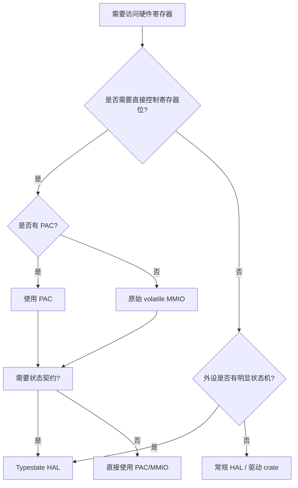

> **内容分级**: [专家级]
> **代码状态**: ⚠️ 裸机/目标平台相关代码标注 `rust,ignore`/`no_run`， host 平台无法直接编译
> **定理链**: N/A — 描述性/工程性文档
>
# 内存映射外设与 Typestate 编程
>
> **EN**: Memory-Mapped Peripherals and Typestate Programming
> **Summary**: Memory-mapped peripherals, volatile access, PAC, and typestate programming in embedded Rust: using the type system to encode hardware state machines and design contracts.
> **Rust 版本**: 1.97.0+ (Edition 2024)
>
> **受众**: [进阶]
> **Bloom 层级**: L3-L4
> **权威来源**: 本文件为 `concept/` 权威页。
> **A/S/P 标记**: **S+A** — Structure + Application
> **双维定位**: P×App — 将类型系统应用于硬件寄存器与外设状态机
> **定位**: 系统讲解嵌入式 Rust 中“内存映射外设”的访问方式——从原始 `volatile` 读写，到 PAC 生成的类型安全 API，再到用 Typestate 把外设状态机编码进 Rust 类型系统，从而把运行时错误转为编译期拒绝。
> **前置概念**:
> [Rust 嵌入式系统开发](03_embedded_systems.md) · [裸机启动与链接脚本](13_bare_metal_boot_linker_script.md) ·
> [Type System](../../01_foundation/02_type_system/01_type_system.md) · [Unsafe Rust](../../03_advanced/02_unsafe/01_unsafe.md) ·
> [Rust vs C++](../../05_comparative/01_systems_languages/01_rust_vs_cpp.md)
> **后置概念**:
> [PAC 与 HAL 实现](17_pac_hal_implementation.md) ·
> [embedded-hal 与驱动惯用法](24_embedded_hal_and_driver_idioms.md) ·
> [异步 no_std 嵌入式](11_async_no_std_embedded.md)

---

> **来源**:
> [The Embedded Rust Book — Memory-mapped Registers](https://docs.rust-embedded.org/book/start/memory-mapped-registers.html) ·
> [The Embedded Rust Book — Peripherals](https://docs.rust-embedded.org/book/peripherals/index.html) ·
> [The Embedded Rust Book — Static Guarantees](https://docs.rust-embedded.org/book/static-guarantees/index.html) ·
> [The Embedded Rust Book — Typestate Programming](https://docs.rust-embedded.org/book/static-guarantees/typestate-programming.html) ·
> [The Embedded Rust Book — Peripherals as State Machines](https://docs.rust-embedded.org/book/static-guarantees/peripherals-as-state-machines.html) ·
> [The Embedded Rust Book — Design Contracts](https://docs.rust-embedded.org/book/static-guarantees/design-contracts.html) ·
> [Discovery Book](https://docs.rust-embedded.org/discovery/) · [The Embedonomicon](https://docs.rust-embedded.org/embedonomicon/) ·
> [svd2rust](https://docs.rs/svd2rust/) · [cortex-m crate](https://docs.rs/cortex-m/) ·
> [The Rust Reference — Unsafe Blocks](https://doc.rust-lang.org/reference/unsafe-blocks.html) ·
> [The Rustonomicon — Foreign Function Interface](https://doc.rust-lang.org/nomicon/ffi.html) ·
> [Rust API Guidelines](https://rust-lang.github.io/api-guidelines/)

---

## 🧠 知识结构图

```mermaid
mindmap
  root((内存映射外设与 Typestate))
    内存映射寄存器
      固定地址
      #[repr(C)]
      volatile 访问
    PAC
      svd2rust 生成
      Peripherals::take
      寄存器位域
    外设状态机
      GPIO 模式
      UART 配置阶段
      时钟使能依赖
    Typestate 编程
      泛型状态标签
      消费 self
      编译期状态转移
    设计契约
      前置条件
      后置条件
      不变式
```

## 📑 目录

- [内存映射外设与 Typestate 编程](#内存映射外设与-typestate-编程)
  - [🧠 知识结构图](#-知识结构图)
  - [📑 目录](#-目录)
  - [一、权威定义](#一权威定义)
  - [二、内存映射寄存器与 Volatile 访问](#二内存映射寄存器与-volatile-访问)
    - [2.1 为什么必须 volatile](#21-为什么必须-volatile)
    - [2.2 原始 MMIO 模式](#22-原始-mmio-模式)
  - [三、PAC：外设访问 Crate](#三pac外设访问-crate)
    - [3.1 从 SVD 到 Rust API](#31-从-svd-到-rust-api)
    - [3.2 PAC 的“取走”模式](#32-pac-的取走模式)
  - [四、外设作为状态机](#四外设作为状态机)
    - [4.1 GPIO 模式转换](#41-gpio-模式转换)
    - [4.2 配置顺序依赖](#42-配置顺序依赖)
  - [五、Typestate 编程](#五typestate-编程)
    - [5.1 基本模式](#51-基本模式)
    - [5.2 GPIO Typestate 示例](#52-gpio-typestate-示例)
  - [六、设计契约](#六设计契约)
  - [七、属性矩阵](#七属性矩阵)
  - [八、关系与依赖](#八关系与依赖)
  - [九、Rust 示例](#九rust-示例)
    - [9.1 使用 `volatile-register` crate 的 MMIO](#91-使用-volatile-register-crate-的-mmio)
    - [9.2 Typestate UART：先配置波特率，再使能发送](#92-typestate-uart先配置波特率再使能发送)
  - [十、反例与失效模式](#十反例与失效模式)
    - [10.1 编译错误：在 Input 模式下调用 `set_high`](#101-编译错误在-input-模式下调用-set_high)
    - [10.2 运行时错误：未使能时钟就访问 GPIO](#102-运行时错误未使能时钟就访问-gpio)
    - [10.3 运行时错误：忘记 volatile 导致优化掉寄存器读写](#103-运行时错误忘记-volatile-导致优化掉寄存器读写)
    - [10.4 设计契约破坏：DMA 缓冲区不在 DMA 可见区域](#104-设计契约破坏dma-缓冲区不在-dma-可见区域)
  - [十一、决策树：外设访问策略](#十一决策树外设访问策略)
  - [十二、权威来源索引](#十二权威来源索引)
  - [十三、相关概念](#十三相关概念)
  - [🧭 思维导图（Mindmap）](#-思维导图mindmap)
  - [国际化权威来源补充（International Authority Sources）](#国际化权威来源补充international-authority-sources)

---

## 一、权威定义

> **The Embedded Rust Book — Memory-mapped Registers**: A peripheral is a device that sits on the processor's memory bus and responds to reads/writes at specific addresses. These addresses are called memory-mapped registers.

**内存映射寄存器（Memory-Mapped Register, MMR）**：硬件外设通过系统总线暴露给 CPU 的寄存器，每个寄存器在地址空间中有固定地址。对寄存器的读写即对外设的控制/状态查询。

**Volatile 访问**：明确告知编译器“该内存访问有副作用，禁止优化掉或重排”。设备寄存器可能因外部硬件事件而改变，普通 Rust/LLVM 读写可能被死存消除（dead-store elimination）或重复读取优化破坏语义。

**外设访问 Crate（PAC）**：由厂商 SVD（System View Description）文件经 `svd2rust` 自动生成的 Rust crate，为每个外设、寄存器、位域提供类型安全 API。

**Typestate 编程**：把对象允许的操作集合编码到类型中；对象在不同状态间转移时，旧类型被消费，新类型被返回。Rust 的所有权与线性类型特性使其天然适合 Typestate。

**设计契约（Design Contract）**：外设初始化与使用必须满足的前置条件、后置条件与不变式。Typestate 把这些契约从注释/文档提升到类型系统，违反即编译错误。

判定依据：PAC 解决“不会访问错误寄存器位”的问题；Typestate 解决“不会在外设错误状态下执行操作”的问题；两者结合是嵌入式 Rust 类型安全的核心。

---

## 二、内存映射寄存器与 Volatile 访问

### 2.1 为什么必须 volatile

```rust,ignore
// ❌ 错误：编译器可能优化掉第二次读取
let status = unsafe { (*UART_STATUS).read() };
while unsafe { (*UART_STATUS).read() } & TX_EMPTY == 0 {
    // 如果编译器把循环条件缓存为 false，将永远循环
}
```

设备寄存器与内存不同：

- **副作用（Side effects）**：写控制寄存器会触发硬件动作；读状态寄存器会清除某些标志。
- **外部可变性（External mutability）**：即使 CPU 没有写，外设也可能改变寄存器值（如定时器计数、DMA 完成标志）。
- **顺序敏感（Ordering-sensitive）**：启动 DMA 前必须先写缓冲区地址；编译器重排会导致硬件看到错误顺序。

`core::ptr::read_volatile` / `write_volatile` 保证：

1. 访问不会被优化掉；
2. 同一 volatile 访问不会被合并；
3. 在 Rust/LLVM 层面形成顺序点（与 `compiler_fence`/`fence` 配合可进一步约束 CPU 重排）。

### 2.2 原始 MMIO 模式

```rust,ignore
#![no_std]

use core::ptr::{read_volatile, write_volatile};

// 假设 GPIOA 端口输出数据寄存器 ODR 地址为 0x4002_0014
const GPIOA_ODR: *mut u32 = 0x4002_0014 as *mut u32;

/// 设置 PA5 高电平
unsafe fn set_pa5() {
    let val = read_volatile(GPIOA_ODR);
    write_volatile(GPIOA_ODR, val | (1 << 5));
}
```

原始 MMIO 的问题：地址/位偏移硬编码、不保证时钟已使能、缺乏编译期检查。

判定依据：原始 MMIO 只在启动早期、PAC 未生成、或调试时使用；生产代码应优先 PAC/HAL。

---

## 三、PAC：外设访问 Crate

### 3.1 从 SVD 到 Rust API

厂商以 SVD/XML 描述芯片寄存器。`svd2rust` 将其转换为 Rust 模块：

```text
stm32f4::stm32f407:
  ├── Peripherals
  │   └── take() -> Option<Peripherals>
  ├── GPIOA
  │   ├── moder: MODER
  │   ├── odr: ODR
  │   └── ...
  └── RCC
      └── ahb1enr: AHB1ENR
```

```rust,ignore
use stm32f4::stm32f407;

let dp = stm32f4::stm32f407::Peripherals::take().unwrap();

// 使能 GPIOA 时钟
dp.RCC.ahb1enr.modify(|_, w| w.gpioaen().set_bit());

// 配置 PA5 为输出
dp.GPIOA.moder.modify(|_, w| w.moder5().output());

// 设置 PA5 高电平
dp.GPIOA.odr.modify(|_, w| w.odr5().set_bit());
```

PAC 优势：

- 寄存器名、位域名在编译期检查；
- `modify` / `write` / `read` 方法区分读写语义；
- 零运行时开销：最终仍是直接的 `str`/`ldr` 指令。

### 3.2 PAC 的“取走”模式

`Peripherals::take()` 返回 `Option<Peripherals>`，并用内部静态变量保证全局唯一：

```rust,ignore
// ✅ 正确：只取一次
let dp = stm32f4::stm32f407::Peripherals::take().unwrap();

// ❌ 错误：第二次 take 返回 None
let dp2 = stm32f4::stm32f407::Peripherals::take().expect("already taken");
```

> **认知功能**: “取走”模式把“外设是全局唯一硬件资源”这一事实编码进类型系统，避免重复初始化、重复配置和数据竞争。

判定依据：PAC 提供寄存器级类型安全，但不保证配置顺序正确——时钟未使能就写 GPIO 仍是逻辑错误，这正是 Typestate 与设计契约要解决的下一层问题。

---

## 四、外设作为状态机

### 4.1 GPIO 模式转换

STM32 GPIO 引脚可处于多种互斥模式：模拟、输入、输出、复用。每种模式允许的操作不同：

| 模式 | 允许操作 | 禁止操作 |
|:---|:---|:---|
| **Input** | `is_high()` / `is_low()` | `set_high()` |
| **Output** | `set_high()` / `set_low()` / `toggle()` | `is_high()`（通常无意义） |
| **Analog** | ADC 采样 | 数字读写 |
| **Alternate** | 由具体复用功能（UART/SPI）接管 | 直接数字读写 |

在 C 中，模式通常用枚举字段记录，运行时检查；在 Rust 中，可把模式编码为类型参数。

### 4.2 配置顺序依赖

以 UART 为例，合法配置顺序是一个隐式状态机：

```text
Reset
  → 使能时钟
  → 配置引脚复用
  → 设置波特率
  → 使能 UART
  → 可发送/接收
```

如果跳过“使能时钟”直接写波特率寄存器，硬件可能静默忽略。Typestate 可以把这些阶段编码为类型，让编译器强制按顺序调用初始化方法。

---

## 五、Typestate 编程

### 5.1 基本模式

```rust,ignore
// 状态标签（零大小类型）
struct Input;
struct Output;

// 引脚类型携带状态参数
struct Pin<MODE> {
    port: *mut u32,
    pin: u8,
    _mode: core::marker::PhantomData<MODE>,
}

impl Pin<Input> {
    fn is_high(&self) -> bool { /* ... */ true }
}

impl Pin<Output> {
    fn set_high(&mut self) { /* ... */ }
}

// 状态转移：消费 Input，返回 Output
impl Pin<Input> {
    fn into_output(self) -> Pin<Output> {
        // 配置硬件为输出模式
        Pin { port: self.port, pin: self.pin, _mode: core::marker::PhantomData }
    }
}
```

Typestate 三要素：**状态标签**（零大小类型）、**泛型外设类型**（`Pin<MODE>`）、**消费型转换方法**（`into_output(self)` 拿走旧状态并返回新状态）。

### 5.2 GPIO Typestate 示例

```rust,ignore
#![no_std]

struct Input<Floating>;
struct Output<PushPull>;
struct AlternateFunction<A>;

struct Pin<MODE> {
    // 实际实现会持有 PAC 寄存器引用或地址
    _mode: core::marker::PhantomData<MODE>,
}

// 输入模式下可读
impl Pin<Input<Floating>> {
    fn is_high(&self) -> bool { true }
}

// 输出模式下可写
impl Pin<Output<PushPull>> {
    fn set_high(&mut self) {}
    fn set_low(&mut self) {}
}

// 状态转移方法
impl Pin<Input<Floating>> {
    fn into_push_pull_output(self) -> Pin<Output<PushPull>> {
        // 配置 MODER/OTYPER 寄存器
        Pin { _mode: core::marker::PhantomData }
    }
}

fn main() -> ! {
    let pin: Pin<Input<Floating>> = /* 初始化 */;
    let mut out = pin.into_push_pull_output();
    out.set_high();

    // ❌ 编译错误：pin 已被移动
    // pin.is_high();

    loop {}
}
```

> **Typestate 洞察**: **把“先配置、再使用”的硬件契约编码到类型中**，让非法操作在编译期被拒，而非在现场以静默错误形式出现。

判定依据：当外设有明确的离散状态且状态间转换不可逆或需满足前置条件时，Typestate 是最 Rust  idiomatic 的建模方式。

---

## 六、设计契约

设计契约在嵌入式 Rust 中通常由类型系统、文档和少量运行时断言共同表达：

| 契约类型 | 含义 | Rust 表达方式 |
|:---|:---|:---|
| **前置条件** | 调用方法前必须满足的状态 | Typestate 类型参数、`&mut self`、初始化标记 |
| **后置条件** | 方法返回后保证达到的状态 | 返回新的 Typestate 类型 |
| **不变式** | 对象生命周期内始终成立的性质 | 私有字段 + 构造函数校验、`const` 断言 |

示例：DMA 缓冲区必须位于 DMA 可访问内存且按字对齐。

```rust,ignore
struct DmaBuffer<const N: usize> {
    buf: [u8; N],
}

impl<const N: usize> DmaBuffer<N> {
    const fn new() -> Self {
        // 编译期断言：大小必须是 4 的倍数
        assert!(N % 4 == 0, "DMA buffer size must be word-aligned");
        Self { buf: [0; N] }
    }
}
```

判定依据：Typestate 与设计契约增加 API 表面积，但在错误代价高（硬实时、安全关键、难以调试的硬件）时，把契约前置到类型系统是最经济的风险控制。

---

## 七、属性矩阵

| 技术 | 抽象层级 | 类型安全 | 运行时开销 | 适用场景 |
|:---|:---:|:---:|:---:|:---|
| 原始 MMIO (`volatile`) | 最低 | 无 | 零 | 启动早期、调试、无 PAC 的芯片 |
| PAC (`svd2rust`) | 寄存器级 | 寄存器/位域 | 零 | 需要直接控制寄存器的驱动 |
| Typestate HAL | 外设状态级 | 状态转移 | 零 | GPIO、UART、SPI 等模式化外设 |
| 运行时状态机 | 应用级 | 运行时检查 | 较小 | 状态复杂、需动态配置的场景 |

---

## 八、关系与依赖


MMR 需 volatile 访问；PAC 是 MMR 的类型安全视图；Typestate HAL 在 PAC 之上表达外设状态机；Typestate 是设计契约的编译期实现机制。

---

## 九、Rust 示例

### 9.1 使用 `volatile-register` crate 的 MMIO

```rust,ignore
use volatile_register::{RW, RO};

#[repr(C)]
struct UartRegs {
    txdata: RW<u32>,
    rxdata: RO<u32>,
    txctrl: RW<u32>,
    rxctrl: RW<u32>,
    ie: RW<u32>,
    ip: RO<u32>,
    div: RW<u32>,
}

const UART0: *mut UartRegs = 0x1001_3000 as *mut UartRegs;

unsafe fn uart_putc(c: u8) {
    // 等待 TX FIFO 非满（简化示例）
    while (*UART0).ip.read() & 0x1 == 0 {}
    (*UART0).txdata.write(c as u32);
}
```

### 9.2 Typestate UART：先配置波特率，再使能发送

```rust,ignore
#![no_std]

struct Uninitialized;
struct Configured;
struct Enabled;

struct Uart<STATE> {
    base: *mut UartRegs,
    _state: core::marker::PhantomData<STATE>,
}

impl Uart<Uninitialized> {
    fn new(base: *mut UartRegs) -> Self {
        Self { base, _state: core::marker::PhantomData }
    }

    fn set_baud(self, divisor: u32) -> Uart<Configured> {
        unsafe { (*self.base).div.write(divisor); }
        Uart { base: self.base, _state: core::marker::PhantomData }
    }
}

impl Uart<Configured> {
    fn enable_tx(self) -> Uart<Enabled> {
        unsafe { (*self.base).txctrl.write(0x1); }
        Uart { base: self.base, _state: core::marker::PhantomData }
    }
}

impl Uart<Enabled> {
    fn putc(&mut self, c: u8) {
        unsafe { (*self.base).txdata.write(c as u32); }
    }
}

fn main() -> ! {
    let uart = Uart::new(UART0)
        .set_baud(138)   // 必须先配置波特率
        .enable_tx();    // 然后使能发送
    // uart.putc(b'H'); // ✅ 合法
    loop {}
}
```

---

## 十、反例与失效模式

### 10.1 编译错误：在 Input 模式下调用 `set_high`

```rust,compile_fail
#![no_std]

struct Input;
struct Output;
struct Pin<MODE>(core::marker::PhantomData<MODE>);

impl Pin<Input> {
    fn is_high(&self) -> bool { true }
}
impl Pin<Output> {
    fn set_high(&mut self) {}
}

fn main() {
    let mut pin: Pin<Input> = Pin(core::marker::PhantomData);
    pin.set_high(); // ❌ 编译错误：Pin<Input> 没有 set_high 方法
}
```

> **修正**：先调用 `into_output()` 将引脚转移到 `Pin<Output>` 状态。

### 10.2 运行时错误：未使能时钟就访问 GPIO

```rust,ignore
// ❌ 错误：RCC AHB1 时钟未开启，写 GPIOA 可能被硬件忽略
unsafe {
    (*GPIOA).odr.write(1 << 5);
}
```

> **修正**：在访问 GPIO 前使能对应时钟。Typestate 可在 `ClocksEnabled` 与 `ClocksDisabled` 状态间建模这一依赖。

### 10.3 运行时错误：忘记 volatile 导致优化掉寄存器读写

```rust,ignore
// ❌ 错误：普通读写可能被 LLVM 优化
let _ = *UART_STATUS;
*UART_TX = c;
```

> **修正**：使用 `read_volatile` / `write_volatile` 或 PAC/volatile-register 提供的封装。

### 10.4 设计契约破坏：DMA 缓冲区不在 DMA 可见区域

```rust,ignore
// ❌ 错误：若 CCM 不可被 DMA 访问，则 DMA 读不到数据
#[link_section = ".ccm_data"]
static DMA_BUF: [u8; 256] = [0; 256];
```

> **修正**：查阅参考手册，把 DMA 缓冲区放在普通 SRAM；或用类型系统标记 `DmaAccessibleBuffer`。

---

## 十一、决策树：外设访问策略



判定依据：优先使用现有 PAC/HAL；只在需要自定义状态机或 PAC 不存在时才手写 Typestate 或 MMIO。

---

## 十二、权威来源索引

- **[The Embedded Rust Book — Memory-mapped Registers](https://docs.rust-embedded.org/book/start/memory-mapped-registers.html)** — 内存映射寄存器基础与 `volatile` 概念。
- **[The Embedded Rust Book — Peripherals](https://docs.rust-embedded.org/book/peripherals/index.html)** — PAC、HAL、BSP 三层抽象与“The Borrow Checker” singleton 模式。
- **[The Embedded Rust Book — Static Guarantees](https://docs.rust-embedded.org/book/static-guarantees/index.html)** — Typestate、外设状态机、设计契约的系统讲解。
  - [Typestate Programming](https://docs.rust-embedded.org/book/static-guarantees/typestate-programming.html)
  - [Peripherals as State Machines](https://docs.rust-embedded.org/book/static-guarantees/peripherals-as-state-machines.html)
  - [Design Contracts](https://docs.rust-embedded.org/book/static-guarantees/design-contracts.html)
- **[Discovery Book](https://docs.rust-embedded.org/discovery/)** — 在 micro:bit 上动手实践内存映射外设与 Typestate。
- **[The Embedonomicon](https://docs.rust-embedded.org/embedonomicon/)** — 裸机底层实现、自定义 target、链接脚本与启动序列。
- **[svd2rust](https://docs.rs/svd2rust/)** — PAC 生成工具文档。
- **[cortex-m-rt 文档](https://docs.rs/cortex-m-rt/)** / **[riscv-rt 文档](https://docs.rs/riscv-rt/)** — 真实目标可编译示例的运行时入口。
- **P0 官方来源**:
  - [Rust core — `core::ptr::read_volatile`](https://doc.rust-lang.org/core/ptr/fn.read_volatile.html)
  - [Rust core — `core::ptr::write_volatile`](https://doc.rust-lang.org/core/ptr/fn.write_volatile.html)
  - [Rust Reference — `repr(C)` 结构体布局](https://doc.rust-lang.org/reference/type-layout.html#reprc-structs)

> **权威来源对齐变更日志**: 2026-07-31 创建；2026-07-31 Wave H 补充运行时入口来源。

---

## 十三、相关概念

- [Rust 嵌入式系统开发](03_embedded_systems.md)
- [裸机启动与链接脚本](13_bare_metal_boot_linker_script.md)
- [PAC 与 HAL 实现](17_pac_hal_implementation.md)
- [embedded-hal 与驱动惯用法](24_embedded_hal_and_driver_idioms.md)
- [异步 no_std 嵌入式](11_async_no_std_embedded.md)
- [Type System](../../01_foundation/02_type_system/01_type_system.md)
- [Unsafe Rust](../../03_advanced/02_unsafe/01_unsafe.md)

---

**文档版本**: 1.0
**最后更新**: 2026-07-31
**状态**: ✅ 概念文件创建完成

---

## 🧭 思维导图（Mindmap）

```mermaid
mindmap
  root((内存映射外设与 Typestate))
    内存映射寄存器
      固定地址
      #[repr(C)]
      volatile 访问
    PAC
      svd2rust 生成
      Peripherals::take
      寄存器位域
    外设状态机
      GPIO 模式
      UART 配置阶段
      时钟使能依赖
    Typestate 编程
      泛型状态标签
      消费 self
      编译期状态转移
    设计契约
      前置条件
      后置条件
      不变式
    反例
      未使能时钟
      非 volatile 访问
      DMA 缓冲区错位
```

> **认知功能**: 本 mindmap 从硬件寄存器、PAC 抽象、Typestate 状态机、设计契约与反例五个维度组织内容，可作为外设驱动设计与调试的导航索引。

## 国际化权威来源补充（International Authority Sources）

- <https://arxiv.org/abs/2311.05063>
