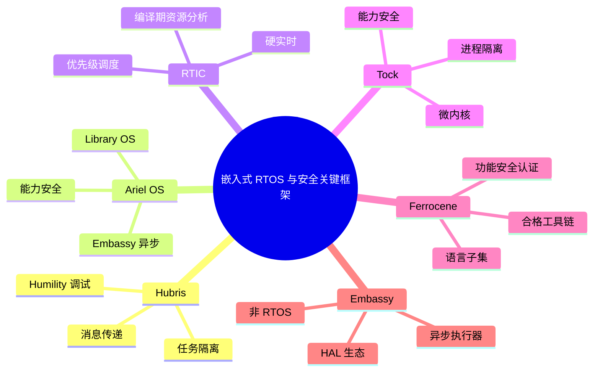
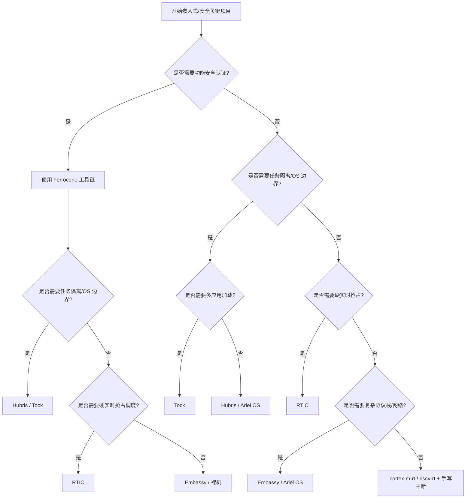
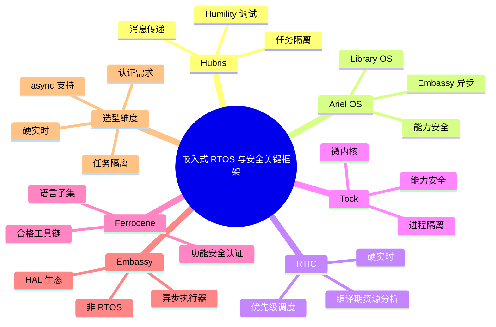

> **内容分级**: [专家级]
> **代码状态**: ⚠️ 裸机/目标平台相关代码标注 `rust,ignore`/`no_run`， host 平台无法直接编译
> **定理链**: N/A — 描述性/工程性文档
>
# 嵌入式 RTOS 与安全关键框架
>
> **EN**: Embedded RTOS and Safety-Critical Frameworks
> **Summary**: Comparative survey of Rust embedded RTOS and safety-critical frameworks: Hubris, Ariel OS, RTIC, Tock, Ferrocene, and Embassy, with architecture, scheduling, safety guarantees, and selection guidance.
> **Rust 版本**: 1.97.0+ (Edition 2024)
>
> **受众**: [专家]
> **Bloom 层级**: L4-L5
> **权威来源**: 本文件为 `concept/` 权威页。
> **A/S/P 标记**: **S+A+Eva** — Structure + Application + Evaluation
> **双维定位**: C×Eva — 比较与评价面向嵌入式与安全关键的 Rust 框架
> **定位**: 系统比较六种 Rust 嵌入式/安全关键方案——Hubris、Ariel OS、RTIC、Tock、Ferrocene、Embassy——从架构、调度、内存安全、async 支持、认证状态到典型场景，帮助工程师在技术栈选型时做出有据决策。
> **前置概念**: [Rust 嵌入式系统开发](03_embedded_systems.md) · [安全关键裸机 OS 与 Rust](19_safety_critical_bare_metal_os.md) · [异步 no_std 嵌入式](11_async_no_std_embedded.md) · [实时系统概念](03_embedded_systems.md#三实时系统) · [Rust vs Ada/SPARK](../../05_comparative/01_systems_languages/07_rust_vs_ada_spark.md)
> **后置概念**: [认证工具链与认证包清单](../../04_formal/04_model_checking/10_certified_toolchains_and_packages.md) · [性能优化](../10_performance/01_performance_optimization.md) · [嵌入式调试与日志](20_embedded_debugging_logging.md)

---

> **来源**: [Hubris](https://hubris.oxide.computer/) · [Hubris GitHub](https://github.com/oxidecomputer/hubris) · [Ariel OS GitHub](https://github.com/ariel-os/ariel-os) · [RTIC](https://rtic.rs/) · [RTIC Book](https://rtic.rs/2/book/en/) · [Tock OS Book](https://book.tockos.org/) · [Tock GitHub](https://github.com/tock/tock) · [Ferrocene](https://docs.ferrocene.dev/) · [Ferrous Systems — Ferrocene](https://ferrous-systems.com/ferrocene/) · [Embassy Book](https://embassy.dev/book/) · [Embassy GitHub](https://github.com/embassy-rs/embassy)

---

## 🧠 知识结构图



## 📑 目录

- [嵌入式 RTOS 与安全关键框架](#嵌入式-rtos-与安全关键框架)
  - [🧠 知识结构图](#-知识结构图)
  - [📑 目录](#-目录)
  - [一、权威定义](#一权威定义)
  - [二、Hubris](#二hubris)
  - [三、Ariel OS](#三ariel-os)
  - [四、RTIC](#四rtic)
  - [五、Tock](#五tock)
  - [六、Ferrocene](#六ferrocene)
  - [七、Embassy](#七embassy)
  - [八、六维属性矩阵](#八六维属性矩阵)
  - [九、选择决策树](#九选择决策树)
  - [十、Rust 示例](#十rust-示例)
    - [10.1 RTIC 任务资源管理](#101-rtic-任务资源管理)
    - [10.2 Embassy 异步任务](#102-embassy-异步任务)
  - [十一、反例与边界](#十一反例与边界)
    - [11.1 反例：把 Embassy 当作认证 RTOS 使用](#111-反例把-embassy-当作认证-rtos-使用)
    - [11.2 反例：在安全关键项目中混用未经验证的 crates.io 依赖](#112-反例在安全关键项目中混用未经验证的-cratesio-依赖)
    - [11.3 反例：在 RTIC 中忘记声明共享资源](#113-反例在-rtic-中忘记声明共享资源)
    - [11.4 边界：Hubris/Ariel OS 的单地址空间 vs 多应用隔离](#114-边界hubrisariel-os-的单地址空间-vs-多应用隔离)
  - [十二、权威来源索引](#十二权威来源索引)
  - [十三、相关概念](#十三相关概念)
  - [🧭 思维导图（Mindmap）](#-思维导图mindmap)

---

## 一、权威定义

**RTOS（Real-Time Operating System）**：提供任务调度、同步、中断管理与确定性时序保证的操作系统。关键区分在于调度策略（协作式/抢占式）与能否提供硬实时界限。

**Safety-critical framework**：不仅追求功能正确，还需提供可被审计、被标准接受的证据链，以支持功能安全（如 ISO 26262、IEC 61508、DO-178C）或高可靠场景。

**Library OS**：操作系统功能以库形式链接到应用中，而非作为独立内核运行；应用与 OS 通常共享地址空间，通过编译时配置裁剪功能。

**Type 1/Type 2 框架 区分依据**：

- **运行时框架**（RTIC、Embassy）：与应用程序编译为单一固件，依赖 Rust 类型系统保证安全；不提供任务间硬件隔离。
- **操作系统/微内核**（Hubris、Tock、Ariel OS）：提供任务/进程隔离、系统调用或消息传递边界。
- **工具链**（Ferrocene）：本身不是运行时，而是让 Rust 代码能被用于安全关键项目的合格编译器与证据包。

判定依据：选型首先要回答“是否需要任务隔离/OS 边界”与“是否需要功能安全认证”两个问题，否则容易把 Embassy 与 Hubris、Ferrocene 与 RTIC 混为一谈。

---

## 二、Hubris

> [Hubris](https://hubris.oxide.computer/) 是 Oxide Computer Company 为 deeply-embedded 系统开发的小型开源操作系统，核心约 2000 行 Rust。

| 维度 | 说明 |
|:---|:---|
| **架构** | 任务型微内核：多个独立编译的任务，通过内核进行消息传递 IPC；驱动代码以非特权任务运行。 |
| **调度** | 抢占式多任务；任务在创建时静态确定，运行时不创建/销毁任务。 |
| **内存安全** | 任务间内存隔离；任务内部依赖 Rust 类型系统；内核包含少量 `unsafe`，但任务代码可做到无 `unsafe`。 |
| **资源模型** | 无动态资源分配；无运行时堆；无驱动运行于特权模式；无 C 代码。 |
| **async 支持** | 不基于 `async/await`，使用同步消息传递（request/response）与通知。 |
| **调试** | [Humility](https://github.com/oxidecomputer/humility) 调试器可现场或离线检查任务交互与 dump。 |
| **认证状态** | 尚未宣布第三方功能安全认证，但架构目标为高可靠/安全关键场景。 |
| **典型用例** | Oxide 自研硬件控制、工业/航空电子、需要故障隔离的嵌入式控制。 |

```text
Hubris 设计契约:
  静态任务表
  ├── 无运行时任务创建/销毁
  ├── 无动态分配
  ├── 驱动不跑在特权模式
  └── 崩溃任务可单独重启
```

判定依据：当系统需要“一个任务崩溃不影响其他任务”且能接受静态任务表时，Hubris 是强候选。

---

## 三、Ariel OS

> [Ariel OS](https://github.com/ariel-os/ariel-os)（原 RIOT-rs）是面向安全、低功耗 IoT 的 Library OS，支持 Cortex-M、RISC-V 与 Xtensa。

| 维度 | 说明 |
|:---|:---|
| **架构** | Library OS：OS 功能作为 crate 链接到应用，单地址空间，能力安全（capability-based security）。 |
| **调度** | 基于 Embassy 的异步执行器，并添加抢占式多核调度器。 |
| **内存安全** | 全系统 Rust；能力安全模型限制应用对资源的访问。 |
| **async 支持** | 一等公民；基于 Embassy 的 `async/await`、time driver、网络栈。 |
| **网络** | 集成 embassy-net、TLS、LoRaWAN、Bluetooth 等。 |
| **构建系统** | `laze` 元构建系统，管理多板多配置的 crate 组合。 |
| **认证状态** | 尚未宣布功能安全认证。 |
| **典型用例** | 安全 IoT 终端、低功耗无线传感器、边缘计算节点。 |

```rust,ignore
// Ariel OS 应用示例：异步 blink + 按钮
#![no_std]
#![no_main]

use ariel_os::gpio::{Input, Level, Output, Pull};
use ariel_os::time::{Duration, Timer};

#[ariel_os::task]
async fn blink(mut led: Output<'static>) {
    loop {
        led.toggle();
        Timer::after(Duration::from_secs(1)).await;
    }
}

#[ariel_os::main]
async fn main(spawner: ariel_os::Spawner) {
    let led = Output::new(ariel_os::peripherals().led, Level::Low);
    let button = Input::new(ariel_os::peripherals().button, Pull::Up);
    spawner.spawn(blink(led)).unwrap();
    // 应用逻辑...
}
```

判定依据：Ariel OS 适合需要现代 async 网络栈、安全模型与低功耗的 IoT 项目，且愿意接受 Library OS 的单地址空间约束。

---

## 四、RTIC

> [RTIC](https://rtic.rs/)（Real-Time Interrupt-driven Concurrency）将 Rust 所有权模型应用于硬件中断优先级调度。

| 维度 | 说明 |
|:---|:---|
| **架构** | 基于硬件中断的任务框架；任务 = ISR，资源 = 共享数据，优先级 = 中断优先级。 |
| **调度** | 抢占式优先级调度，直接利用 Cortex-M NVIC（或 RISC-V 等架构中断控制器）。 |
| **内存安全** | 编译期资源冲突分析：通过 `#[shared]`/`#[local]` 与 `lock` 在编译期排除数据竞争与死锁。 |
| **确定性** | 零运行时开销；无堆；调度由硬件中断控制器完成。 |
| **async 支持** | RTIC 2.x 提供 `rtic-async` 实验性支持；传统 RTIC 以同步 ISR 为主。 |
| **认证状态** | 社区已有将其用于安全关键资格鉴定的研究与项目，但 RTIC 本身尚未作为产品通过第三方认证。 |
| **典型用例** | 硬实时电机控制、机器人、汽车 ECU、航空电子。 |

```rust,ignore
#[rtic::app(device = stm32f4::stm32f407, peripherals = true)]
mod app {
    #[shared]
    struct Shared {
        counter: u32,
    }

    #[local]
    struct Local {}

    #[init]
    fn init(cx: init::Context) -> (Shared, Local, init::Monotonics) {
        (Shared { counter: 0 }, Local {}, init::Monotonics())
    }

    #[task(binds = TIM2, priority = 1, shared = [counter])]
    fn tick(mut cx: tick::Context) {
        cx.shared.counter.lock(|counter| {
            *counter += 1;
        });
    }
}
```

判定依据：硬实时 + 资源共享复杂 → RTIC；它用编译期分析替代了传统 RTOS 的互斥量运行时开销。

---

## 五、Tock

> [Tock OS](https://tockos.org/) 是用 Rust 编写的安全嵌入式微内核操作系统，面向 IoT 与传感器网络。

| 维度 | 说明 |
|:---|:---|
| **架构** | 微内核：内核提供调度、驱动抽象、系统调用；用户态应用运行在隔离进程中。 |
| **调度** | 内核抢占式调度；用户态应用内部通常为协作式（callback-driven）。 |
| **内存安全** | Rust 内核 + MPU/MMU 进程隔离； capsule 模型限制驱动权限；能力安全（capabilities）。 |
| **async 支持** | 用户态 [`libtock-rs`](https://github.com/tock/libtock-rs) 提供异步 API；内核使用事件回调。 |
| **应用模型** | 多应用共享内核，应用可独立编译、加载、崩溃隔离。 |
| **认证状态** | 学术与研究背景深厚，已在部分产品中使用，但未大规模通过功能安全认证。 |
| **典型用例** | 可穿戴、IoT 网关、学术研究、需要多应用隔离的微控制器系统。 |

```text
Tock 安全模型:
  内核 (Rust)
  ├── Capsule: 受信任的驱动组件
  ├── Grant: 为用户进程分配的内核内存
  └── 系统调用接口
  用户进程 (libtock-rs / C)
  ├── 单线程、事件驱动
  └── MPU 隔离
```

判定依据：当需要在微控制器上运行多个互不信任的应用，且重视隔离与安全时，Tock 是首选。

---

## 六、Ferrocene

> [Ferrocene](https://ferrous-systems.com/ferrocene/) 是首个经第三方认证机构（TÜV SÜD）鉴定的 Rust 工具链分发版，由 Ferrous Systems 与 AdaCore 主导。

| 维度 | 说明 |
|:---|:---|
| **定位** | 不是 RTOS，而是**合格 Rust 工具链 + 语言规范 + 证据包**。 |
| **架构** | 基于上游 rustc/cargo 稳定版，增加鉴定流程、语言子集规约（FLS）与长期支持。 |
| **调度** | 不提供运行时调度；依赖项目选择的框架（RTIC/Embassy/裸机）。 |
| **内存安全** | 依赖 Rust 语言本身的类型系统与 borrow checker；FLS 明确合格子集。 |
| **async 支持** | 语言级 `async/await` 在合格子集范围内可用，具体受 FLS 约束。 |
| **认证状态** | ✅ ISO 26262:2018 ASIL D、IEC 61508:2010 SIL 3、DO-178C / DO-330。 |
| **典型用例** | 汽车 ECU、工业控制、航空航天机载软件等需要工具链证据的安全关键项目。 |

```text
Ferrocene 交付物:
  ├── Ferrocene Language Specification (FLS)
  ├── 经鉴定的 rustc / cargo
  ├── 工具链鉴定报告与已知缺陷清单
  └── 长期支持（LTS）与补丁策略
```

判定依据：Ferrocene 回答的是“我能不能把 Rust 用于安全关键认证项目”，而不是“我该用哪个 RTOS”。它通常与 RTIC、Hubris 或裸机框架搭配。

---

## 七、Embassy

> [Embassy](https://embassy.dev/book/) 是嵌入式 async Rust 执行器与 HAL 生态，不是完整 RTOS。

| 维度 | 说明 |
|:---|:---|
| **架构** | 异步执行器 + 芯片 HAL + 网络/蓝牙/USB 栈；应用与执行器编译为单一固件。 |
| **调度** | 协作式调度（单 executor 内），但可创建多个 executor 实例以支持不同优先级任务。 |
| **内存安全** | 依赖 Rust 所有权与 `async/await` 状态机；无任务间硬件隔离。 |
| **async 支持** | 一等公民；所有 I/O 围绕 `Future` 与 Waker 设计。 |
| **资源占用** | 无需堆；任务在编译期静态分配；Flash/RAM 占用通常高于同步代码但可接受。 |
| **认证状态** | 无功能安全认证。 |
| **典型用例** | 协议栈密集的联网设备、传感器融合、通用嵌入式异步应用。 |

```rust,ignore
#![no_std]
#![no_main]

use embassy_executor::Spawner;
use embassy_time::Timer;
use embassy_rp::gpio::{Level, Output};

#[embassy_executor::main]
async fn main(_spawner: Spawner) {
    let p = embassy_rp::init(Default::default());
    let mut led = Output::new(p.PIN_25, Level::Low);

    loop {
        led.set_high();
        Timer::after_secs(1).await;
        led.set_low();
        Timer::after_secs(1).await;
    }
}
```

判定依据：Embassy 适合 I/O 并发多、协议栈复杂的场景；不要把“选择 Embassy”误当成“选择了经过认证的 RTOS”。

---

## 八、六维属性矩阵

| 方案 | 架构 | 调度 | 内存安全保证 | async 支持 | 认证状态 | 典型用例 |
|:---|:---|:---|:---|:---:|:---|:---|
| **Hubris** | 任务型微内核 | 抢占式多任务 | 任务隔离 + Rust 类型系统 | ❌ 消息传递 | 无公开认证 | 高可靠控制、故障隔离 |
| **Ariel OS** | Library OS | 抢占式 + async | 能力安全 + Rust | ✅ Embassy-based | 无公开认证 | 安全 IoT、低功耗无线 |
| **RTIC** | 中断驱动框架 | 抢占式优先级 | 编译期资源冲突分析 | ⚠️ 实验性 | 无产品级认证 | 硬实时控制 |
| **Tock** | 微内核 | 内核抢占 + 用户协作 | Rust 内核 + MPU 隔离 | ✅ libtock-rs | 无大规模认证 | 多应用 IoT、研究 |
| **Ferrocene** | 合格工具链 | 不提供服务 | Rust 语言子集 + FLS | ✅ 受 FLS 约束 | ✅ ISO 26262 / IEC 61508 / DO-178C | 安全关键项目 |
| **Embassy** | async 执行器 | 协作式（可多级） | Rust 所有权 | ✅ 一等公民 | 无认证 | 通用嵌入式异步 |

判定依据：前四者是运行时/OS 方案；Ferrocene 是工具链证据；Embassy 是异步运行时。它们可以组合（Ferrocene + RTIC、Ferrocene + Embassy、Hubris + Ferrocene），但不应互相替代。

---

## 九、选择决策树



---

## 十、Rust 示例

### 10.1 RTIC 任务资源管理

```rust,ignore
#[rtic::app(device = stm32f4::stm32f407, peripherals = true)]
mod app {
    #[shared]
    struct Shared { counter: u32 }

    #[local]
    struct Local {}

    #[init]
    fn init(_cx: init::Context) -> (Shared, Local, init::Monotonics) {
        (Shared { counter: 0 }, Local {}, init::Monotonics())
    }

    #[task(binds = TIM2, priority = 1, shared = [counter])]
    fn tick(mut cx: tick::Context) {
        cx.shared.counter.lock(|c| *c += 1);
    }
}
```

### 10.2 Embassy 异步任务

```rust,ignore
#![no_std]
#![no_main]

use embassy_executor::Spawner;
use embassy_time::Timer;
use embassy_rp::gpio::{Level, Output};

#[embassy_executor::main]
async fn main(spawner: Spawner) {
    let p = embassy_rp::init(Default::default());
    let led = Output::new(p.PIN_25, Level::Low);
    spawner.spawn(blink(led)).unwrap();
}

#[embassy_executor::task]
async fn blink(mut led: Output<'static>) {
    loop {
        led.toggle();
        Timer::after_secs(1).await;
    }
}
```

---

## 十一、反例与边界

### 11.1 反例：把 Embassy 当作认证 RTOS 使用

**命题**：“Embassy 是 Rust 嵌入式最先进的运行时，可以用于汽车功能安全项目。”

**现实**：Embassy 没有功能安全认证，也没有任务隔离。它适合协议栈密集的通用嵌入式，但不能直接满足 ASIL/SIL/DO-178C 对工具链与运行时的证据要求。安全关键项目需要 Ferrocene 工具链 + 经评估的运行时。

### 11.2 反例：在安全关键项目中混用未经验证的 crates.io 依赖

**命题**：“Ferrocene 编译器合格了，所以所有 crates.io 库都可以用于认证项目。”

**现实**：Ferrocene 的资格鉴定**不覆盖**第三方 crate。项目必须对依赖进行额外的验证、分析或资格鉴定。参考 [Ferrocene 文档](https://docs.ferrocene.dev/)。

### 11.3 反例：在 RTIC 中忘记声明共享资源

```rust,ignore
#[rtic::app(device = stm32f4::stm32f407)]
mod app {
    #[shared]
    struct Shared { counter: u32 }

    #[task(binds = TIM2, priority = 1)]
    fn tick(_cx: tick::Context) {
        // ❌ 编译错误：counter 未在 shared 中声明
        // cx.shared.counter.lock(|c| *c += 1);
    }
}
```

> **修正**：所有跨任务共享的可变状态必须在 `#[shared]` 中声明，RTIC 才能做优先级天花板分析。

### 11.4 边界：Hubris/Ariel OS 的单地址空间 vs 多应用隔离

- **Hubris**：任务隔离但单地址空间？实际上 Hubris 使用 MPU 做任务隔离。Ariel OS 作为 Library OS 是单地址空间，依赖能力安全。
- **Tock**：提供用户进程间的硬件隔离，适合多应用场景。

判定依据：当需要运行不可信代码或第三方应用时，Tock 的进程隔离比 Library OS 的能力模型更直接。

---

## 十二、权威来源索引

- **[Hubris](https://hubris.oxide.computer/)** / **[Hubris GitHub](https://github.com/oxidecomputer/hubris)** — Oxide Computer 的任务型微内核 RTOS，约 2000 行 Rust。
- **[Ariel OS GitHub](https://github.com/ariel-os/ariel-os)** — 面向安全低功耗 IoT 的 Library OS，基于 Embassy。
- **[RTIC](https://rtic.rs/)** / **[RTIC Book](https://rtic.rs/2/book/en/)** — 实时中断驱动并发框架官方文档与书籍。
- **[Tock OS](https://tockos.org/)** / **[Tock OS Book](https://book.tockos.org/)** / **[Tock GitHub](https://github.com/tock/tock)** — 安全嵌入式微内核操作系统。
- **[Ferrocene](https://docs.ferrocene.dev/)** / **[Ferrous Systems — Ferrocene](https://ferrous-systems.com/ferrocene/)** — 经认证的 Rust 工具链与语言规范。
- **[Embassy Book](https://embassy.dev/book/)** / **[Embassy GitHub](https://github.com/embassy-rs/embassy)** — 嵌入式 async Rust 执行器与 HAL 生态。

> **权威来源对齐变更日志**: 2026-07-31 创建

---

## 十三、相关概念

- [Rust 嵌入式系统开发](03_embedded_systems.md)
- [安全关键裸机 OS 与 Rust](19_safety_critical_bare_metal_os.md)
- [异步 no_std 嵌入式](11_async_no_std_embedded.md)
- [认证工具链与认证包清单](../../04_formal/04_model_checking/10_certified_toolchains_and_packages.md)
- [性能优化](../10_performance/01_performance_optimization.md)
- [嵌入式调试与日志](20_embedded_debugging_logging.md)

---

**文档版本**: 1.0
**最后更新**: 2026-07-31
**状态**: ✅ 概念文件创建完成

---

## 🧭 思维导图（Mindmap）



> **认知功能**: 本 mindmap 从六个方案的核心特征与选型维度组织内容，可作为嵌入式/安全关键项目技术栈选型的快速导航索引。
