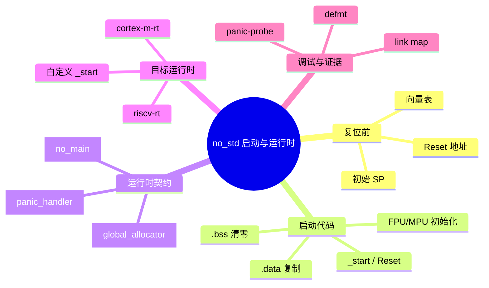
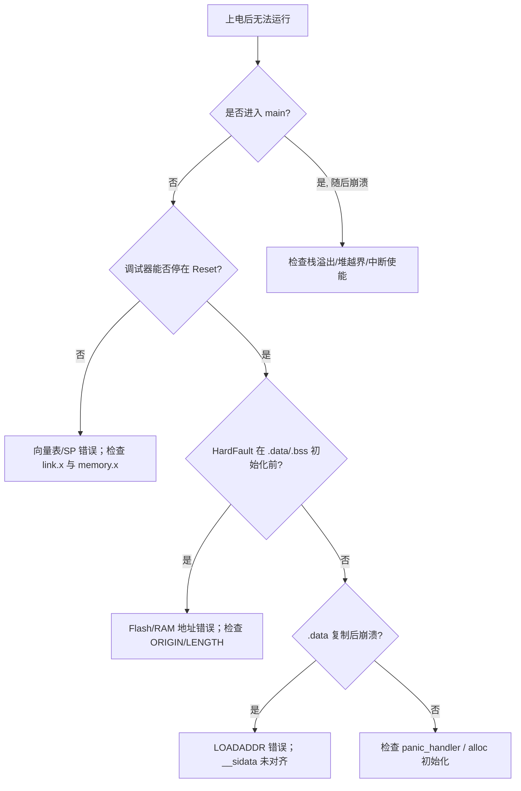

> **内容分级**: [专家级]
> **代码状态**: ⚠️ 裸机/目标平台相关代码标注 `rust,ignore`/`no_run`，host 平台无法直接编译
> **定理链**: N/A — 描述性/工程性文档
>
# no_std 启动流程与运行时深度解析
>
> **EN**: no_std Startup and Runtime Deep Dive
> **Summary**: End-to-end walkthrough of a `#![no_std]` bare-metal program from reset vector through linker script, `_start`, `.data`/`.bss` initialization, `#[panic_handler]`, and optional `#[global_allocator]`.
> **Rust 版本**: 1.97.0+ (Edition 2024)
>
> **受众**: [专家]
> **Bloom 层级**: L4
> **权威来源**: 本文件为 `concept/` 权威页。
> **A/S/P 标记**: **S+A+P** — Structure + Application + Procedure
> **双维定位**: P×Cre — 在真实硬件上组装可启动、可调试、可维护的裸机固件
> **前置概念**: [Rust 嵌入式系统开发](03_embedded_systems.md) · [裸机启动与链接脚本](13_bare_metal_boot_linker_script.md) · [panic_handler 与 no_std 运行时](18_panic_runtime_no_std.md) · [嵌入式内存分配器](16_embedded_memory_allocators.md)
> **后置概念**: [Cortex-M 与 RISC-V 中断异常模型](14_interrupt_and_exception_model.md) · [no_std 同步原语](15_no_std_synchronization_primitives.md) · [自定义裸机异步执行器](28_custom_bare_metal_async_executor.md)

---

> **来源**: [The Embedonomicon](https://docs.rust-embedded.org/embedonomicon/) · [The Embedded Rust Book](https://docs.rust-embedded.org/book/) · [Ferrous Systems — Booting a Cortex-M Microcontroller](https://rust-training.ferrous-systems.com/latest/book/booting-cortex-m) · [cortex-m-rt](https://docs.rs/cortex-m-rt/) · [riscv-rt](https://docs.rs/riscv-rt/) · [Rust Reference — Lang Items](https://doc.rust-lang.org/reference/attributes.html#lang-items) · [Rust Reference — Panic Handler](https://doc.rust-lang.org/reference/runtime.html#the-panic_handler-attribute)
>
> **横向对比**: [Rust vs Ada/SPARK](../../05_comparative/01_systems_languages/07_rust_vs_ada_spark.md)

---

## 🧠 知识结构图



## 📑 目录

- [no\_std 启动流程与运行时深度解析](#no_std-启动流程与运行时深度解析)
  - [🧠 知识结构图](#-知识结构图)
  - [📑 目录](#-目录)
  - [一、权威定义](#一权威定义)
  - [二、端到端启动流程](#二端到端启动流程)
    - [2.1 复位向量与向量表](#21-复位向量与向量表)
    - [2.2 `_start` 与运行时初始化](#22-_start-与运行时初始化)
    - [2.3 `.data` 复制与 `.bss` 清零](#23-data-复制与-bss-清零)
    - [2.4 调用 `main` 与 `panic_handler`](#24-调用-main-与-panic_handler)
  - [三、`cortex-m-rt` 完整示例](#三cortex-m-rt-完整示例)
  - [四、`riscv-rt` 完整示例](#四riscv-rt-完整示例)
  - [五、自定义 `_start` 与汇编入口](#五自定义-_start-与汇编入口)
  - [六、关键属性与链接器契约](#六关键属性与链接器契约)
  - [七、启动失败诊断决策树](#七启动失败诊断决策树)
  - [八、反例与失效模式](#八反例与失效模式)
  - [九、边界测试](#九边界测试)
    - [9.1 边界测试：向量表未对齐导致 HardFault](#91-边界测试向量表未对齐导致-hardfault)
    - [9.2 边界测试：`.data` 加载地址计算错误](#92-边界测试data-加载地址计算错误)
    - [9.3 边界测试：未提供 `panic_handler`](#93-边界测试未提供-panic_handler)
  - [十、相关概念](#十相关概念)
  - [🧭 思维导图（Mindmap）](#-思维导图mindmap)
  - [国际化权威来源补充（International Authority Sources）](#国际化权威来源补充international-authority-sources)

---

## 一、权威定义

> **The Embedonomicon**: A bare-metal Rust program is responsible for everything that an OS would normally do: setting up the stack, initializing memory, providing a panic handler, and finally running the application code.

**no_std 启动流程**：从处理器复位到用户 `main` 的完整执行链，包括向量表放置、栈初始化、`.data`/`.bss` RAM 初始化、可选 FPU/MPU/缓存配置，以及 `panic_handler` 注册。该流程在 `#![no_std]` 环境下完全由运行时 crate（如 `cortex-m-rt`、`riscv-rt`）或用户手写代码承担。

**运行时契约（runtime contract）**：编译器、链接器、启动代码与用户程序之间的隐式协议。违反契约通常不表现为类型错误，而表现为链接失败、启动崩溃或静默 HardFault。

判定依据：能否成功启动一个裸机固件，取决于向量表是否正确放置、链接脚本是否与芯片内存映射一致、启动代码是否完成 RAM 初始化，以及 panic/分配器等 lang item 是否唯一且匹配。

---

## 二、端到端启动流程

### 2.1 复位向量与向量表

ARM Cortex-M 上电后，硬件从地址 `0x0000_0000` 取初始主栈指针（MSP），从 `0x0000_0004` 取 Reset Handler 地址。RISC-V 的启动模式类似，但具体向量地址由平台/PLIC/SBI 决定。向量表必须满足对齐要求（Cortex-M 通常 256/512 字节对齐），否则触发 HardFault。

| 偏移 | Cortex-M 条目 | 说明 |
|:---|:---|:---|
| `0x00` | `_stack_top` | MSP 初始值，通常指向 RAM 最高地址 |
| `0x04` | `Reset` | 复位处理函数，LSB=1 表示 Thumb |
| `0x08` | `NMI` | 不可屏蔽中断 |
| `0x0C` | `HardFault` | 硬 fault |
| `0x10..0x40` | 保留/架构异常 | MemManage、BusFault、UsageFault 等 |
| `0x40+` | IRQ0..N | NVIC 外设中断 |

```rust,ignore
// cortex-m-rt 风格向量表声明示意
#[no_mangle]
pub static __VECTORS: [unsafe extern "C" fn(); 16] = [
    __stack_top, __reset_trampoline, NMI, HardFault,
    // 保留
    DefaultHandler, DefaultHandler, DefaultHandler, DefaultHandler,
    DefaultHandler, DefaultHandler, SVC,
    DefaultHandler, DefaultHandler, PendSV, SysTick,
];
```

> **要点**：`cortex-m-rt` 不直接使用 Rust 结构体表示向量表，而是将各组件放入独立 linker section，再由 `link.x` 按地址顺序组装，从而避免 Rust 结构体对齐与 LSB 设置带来的可移植性问题。

### 2.2 `_start` 与运行时初始化

`_start`（或 `Reset`）是复位后第一个执行的代码。`cortex-m-rt` 用汇编实现，以保证在访问任何 Rust 全局变量之前完成初始化，避免未初始化全局变量被 Rust 代码触碰导致的 UB。Ferrous Systems 的培训材料明确警告：用 Rust 编写 `_start` 并直接读写 `static mut` 符号初始化 `.bss`/`.data` 是 UB，因为此时全局变量尚未合法化。

`_start` 的典型职责：

1. 初始化 MSP（Cortex-M 硬件已做，但某些自定义目标需要显式设置）；
2. 复制 `.data` 从 Flash 加载地址到 RAM 运行地址；
3. 清零 `.bss`；
4. 可选：启用 FPU、配置 MPU、初始化缓存；
5. 调用用户 `main`；
6. `main` 返回后进入无限循环或触发 fault。

### 2.3 `.data` 复制与 `.bss` 清零

`.data` 段在 Flash 中保存初始值，在 RAM 中运行；`.bss` 段只需在 RAM 中清零。链接脚本需提供以下符号：

| 符号 | 含义 |
|:---|:---|
| `__sidata` | `.data` 在 Flash 中的加载起始地址 |
| `__sdata` | `.data` 在 RAM 中的运行起始地址 |
| `__edata` | `.data` 在 RAM 中的运行结束地址 |
| `__sbss` | `.bss` 在 RAM 中的起始地址 |
| `__ebss` | `.bss` 在 RAM 中的结束地址 |

```ld
/* memory.x 片段 */
MEMORY
{
  FLASH (rx) : ORIGIN = 0x0800_0000, LENGTH = 512K
  RAM   (rwx) : ORIGIN = 0x2000_0000, LENGTH = 128K
}

SECTIONS
{
  .text : { KEEP(*(.vector_table)); *(.text*); } > FLASH
  .rodata : { *(.rodata*); } > FLASH

  .data : AT(__sidata)
  {
    __sdata = .;
    *(.data*);
    __edata = .;
  } > RAM

  .bss :
  {
    __sbss = .;
    *(.bss*); *(COMMON);
    __ebss = .;
  } > RAM
}
```

### 2.4 调用 `main` 与 `panic_handler`

`cortex-m-rt` 的 `#[entry]` 宏将用户 `fn main() -> !` 接入 `_start`。`#![no_main]` 阻止 Rust 编译器生成默认的 `main` 符号。用户必须提供唯一的 `#[panic_handler]`；否则链接阶段报错 `#[panic_handler] function required, but not found`。

判定依据：启动链的任何一环缺失或错位，都会导致链接错误、启动后立即 HardFault，或在访问全局变量时产生 UB。

---

## 三、`cortex-m-rt` 完整示例

```rust,ignore
// src/main.rs
#![no_std]
#![no_main]

extern crate alloc;

use core::panic::PanicInfo;
use cortex_m_rt::entry;
use embedded_alloc::TlsfHeap;

// 1. 全局分配器（可选，仅当使用 alloc 时需要）
#[global_allocator]
static HEAP: TlsfHeap = TlsfHeap::empty();

// 2. panic handler
#[panic_handler]
fn panic(info: &PanicInfo) -> ! {
    // dev 阶段可接 defmt-panic；release 阶段可接 panic-abort
    cortex_m::asm::bkpt();
    loop {}
}

// 3. 用户入口
#[entry]
fn main() -> ! {
    // 初始化堆（链接脚本已定义 _heap_start/_heap_end）
    unsafe {
        extern "C" {
            static mut _heap_start: u8;
            static mut _heap_end: u8;
        }
        let start = &_heap_start as *mut u8;
        let size = &_heap_end as usize - start as usize;
        HEAP.init(start, size);
    }

    // 应用代码 ...
    loop {
        cortex_m::asm::wfi();
    }
}
```

```toml
# Cargo.toml
[package]
name = "cortex_m_startup"
version = "0.1.0"
edition = "2024"

[dependencies]
cortex-m = "0.7"
cortex-m-rt = "0.7"
panic-halt = "0.2"
embedded-alloc = "0.6"

[profile.release]
panic = "abort"
lto = true
```

```toml
# .cargo/config.toml
[target.thumbv7em-none-eabihf]
runner = "probe-rs run --chip STM32F407VG"
rustflags = ["-C", "link-arg=-Tlink.x"]

[build]
target = "thumbv7em-none-eabihf"

[unstable]
build-std = ["core", "alloc", "compiler_builtins"]
build-std-features = ["compiler-builtins-mem"]
```

```ld
/* memory.x */
MEMORY
{
  FLASH (rx) : ORIGIN = 0x0800_0000, LENGTH = 512K
  RAM   (rwx) : ORIGIN = 0x2000_0000, LENGTH = 128K
}

STACK_TOP = ORIGIN(RAM) + LENGTH(RAM);

SECTIONS
{
  .text : { KEEP(*(.vector_table)); *(.text*); } > FLASH
  .rodata : { *(.rodata*); } > FLASH

  __sidata = LOADADDR(.data);
  .data : AT(__sidata)
  {
    __sdata = .;
    *(.data*);
    __edata = .;
  } > RAM

  .bss :
  {
    __sbss = .;
    *(.bss*); *(COMMON);
    __ebss = .;
  } > RAM

  _heap_start = .;
  _heap_end = STACK_TOP - 8K; /* 为栈预留 8 KiB */
}
```

判定依据：`cortex-m-rt` 把最危险的启动代码放在汇编中完成，用户只需提供 `#[entry]`、`#[panic_handler]` 和 `memory.x`，是最推荐的生产路径。

---

## 四、`riscv-rt` 完整示例

RISC-V 裸机启动与 Cortex-M 类似，但向量表由 `_start` 符号与 `_stext`、`_heap_start` 等链接器符号共同决定。`riscv-rt` 负责清空 `.bss`、复制 `.data`、设置 GP（全局指针）。

```rust,ignore
// src/main.rs
#![no_std]
#![no_main]

use core::panic::PanicInfo;
use riscv_rt::entry;

#[panic_handler]
fn panic(_info: &PanicInfo) -> ! {
    loop {}
}

#[entry]
fn main() -> ! {
    // 应用代码
    loop {}
}
```

```toml
# .cargo/config.toml
[target.riscv32imac-unknown-none-elf]
rustflags = ["-C", "link-arg=-Tmemory.x", "-C", "link-arg=-Tlink.x"]

[build]
target = "riscv32imac-unknown-none-elf"

[unstable]
build-std = ["core", "compiler_builtins"]
build-std-features = ["compiler-builtins-mem"]
```

```ld
/* memory.x */
MEMORY
{
  RAM (rwx) : ORIGIN = 0x8000_0000, LENGTH = 64K
}

REGION_ALIAS("REGION_TEXT", RAM);
REGION_ALIAS("REGION_RODATA", RAM);
REGION_ALIAS("REGION_DATA", RAM);
REGION_ALIAS("REGION_BSS", RAM);
REGION_ALIAS("REGION_HEAP", RAM);
REGION_ALIAS("REGION_STACK", RAM);

_stack_start = ORIGIN(RAM) + LENGTH(RAM);
```

> **要点**：RISC-V 通常使用统一内存映射（XIP 或 RAM 启动），因此 `link.x` 使用 `REGION_ALIAS` 允许所有段落在同一区域；GP 寄存器初始化对小型全局数据访问的代码体积至关重要。

---

## 五、自定义 `_start` 与汇编入口

对于极端定制场景（bootloader、安全启动、教学），可以手写 `_start`。关键原则是：**在访问任何 Rust 全局变量之前，RAM 必须已初始化**，因此初始化循环应使用汇编或 `addr_of!/addr_of_mut!` 配合 volatile 访问。

```rust,ignore
#![no_std]
#![no_main]

use core::arch::asm;
use core::panic::PanicInfo;
use core::ptr::{addr_of, addr_of_mut};

#[unsafe(no_mangle)]
#[unsafe(link_section = ".vector_table")]
pub static VECTOR_TABLE: [u32; 2] = [
    STACK_TOP as u32,
    reset_handler as u32 | 1, /* Thumb 模式 */
];

extern "C" {
    static mut __sbss: u8;
    static mut __ebss: u8;
    static mut __sdata: u8;
    static mut __edata: u8;
    static mut __sidata: u8;
}

const STACK_TOP: usize = 0x2002_0000;

#[unsafe(no_mangle)]
pub unsafe extern "C" fn reset_handler() -> ! {
    unsafe {
        // 清零 .bss
        let bss_start = addr_of_mut!(__sbss);
        let bss_end = addr_of_mut!(__ebss);
        let mut p = bss_start;
        while (p as usize) < (bss_end as usize) {
            p.write_volatile(0);
            p = p.add(1);
        }

        // 复制 .data
        let data_start = addr_of_mut!(__sdata);
        let data_end = addr_of_mut!(__edata);
        let data_src = addr_of!(__sidata);
        let mut s = data_src;
        let mut d = data_start;
        while (d as usize) < (data_end as usize) {
            d.write_volatile(s.read_volatile());
            s = s.add(1);
            d = d.add(1);
        }
    }

    main();
    loop { asm!("wfi"); }
}

fn main() -> ! {
    loop {}
}

#[panic_handler]
fn panic(_info: &PanicInfo) -> ! {
    loop {}
}
```

判定依据：自定义 `_start` 带来完全可控性，但也把保证启动 soundness 的责任完全交给开发者；绝大多数项目应优先使用 `cortex-m-rt`/`riscv-rt`。

---

## 六、关键属性与链接器契约

| 属性 | 启动链作用 | 常见错误 |
|:---|:---|:---|
| `#![no_std]` | 不链接 std | 误引入依赖 std 的 crate |
| `#![no_main]` | 不生成默认 `main` | 与 `#[entry]` 冲突或重复符号 |
| `#[panic_handler]` | 提供 panic 行为 | 重复定义或缺失 |
| `#[global_allocator]` | 启用 alloc | 未初始化堆就使用 Vec/Box |
| `#[no_mangle]` | 保持启动符号名 | 符号冲突或链接器找不到 |
| `#[unsafe(link_section = "...")]` | 放置向量表/段 | section 名与链接脚本不匹配 |
| `#[unsafe(export_name = "...")]` | 精确控制符号 | 与 `#[no_mangle]` 混用 |
| `#[used]` | 防止被 LLVM 删除 | 忘记 KEEP 导致链接失败 |

---

## 七、启动失败诊断决策树



---

## 八、反例与失效模式

| 失效模式 | 根因 | 后果 |
|:---|:---|:---|
| 用 Rust 写 `_start` 直接读写 `static mut` 初始化 `.bss` | 全局变量尚未合法化 | UB，未来编译器优化可能破坏启动 |
| 向量表未按 256 字节对齐 | 链接脚本缺少 ALIGN | HardFault 或启动地址错 |
| `__sidata` 未使用 `LOADADDR` | `.data` 初始值从 RAM 而非 Flash 读取 | 初始化值随机 |
| 栈顶指向 Flash 而非 RAM | `STACK_TOP` 符号错误 | 第一条 push 就 HardFault |
| 重复 `#[panic_handler]` | 同时引入 panic-halt 与 panic-probe | 链接错误 |
| `#[entry]` 函数返回 `()` 而非 `!` | 运行时要求永不返回 | 编译错误 |

---

## 九、边界测试

### 9.1 边界测试：向量表未对齐导致 HardFault

```rust,ignore,compile_fail
#![no_std]
#![no_main]

// 错误：未保证 256 字节对齐的向量表
#[no_mangle]
#[link_section = ".text"] // 应该是 .vector_table 并 ALIGN(256)
static BAD_VECTOR: [u32; 2] = [0x2000_0000, 0x0800_0009];
```

**修正**：使用 `cortex-m-rt` 的 `link.x`，或在自定义链接脚本中 `ALIGN(256)` 并 `KEEP`。

### 9.2 边界测试：`.data` 加载地址计算错误

```ld
/* 错误示例：__sidata 放在 SECTIONS 之后才赋值 */
SECTIONS
{
  .data : { __sdata = .; *(.data*); __edata = .; } > RAM
}
__sidata = LOADADDR(.data); /* 若链接器尚未记录加载地址，可能为 0 */
```

**修正**：在 `.data` 段内使用 `AT(__sidata)`，并在段前定义 `__sidata = LOADADDR(.data)`。

### 9.3 边界测试：未提供 `panic_handler`

```rust,ignore,compile_fail
#![no_std]
#![no_main]

// 错误：没有 #[panic_handler]
#[no_mangle]
pub extern "C" fn _start() -> ! {
    loop {}
}
```

**修正**：添加 `#[panic_handler] fn panic(_: &PanicInfo) -> ! { loop {} }` 或引入 `panic-halt`。

---

## 十、相关概念

- [裸机启动与链接脚本](13_bare_metal_boot_linker_script.md)
- [panic_handler 与 no_std 运行时](18_panic_runtime_no_std.md)
- [嵌入式内存分配器](16_embedded_memory_allocators.md)
- [Cortex-M 与 RISC-V 中断异常模型](14_interrupt_and_exception_model.md)
- [no_std 与裸机惯用法](23_no_std_and_bare_metal_idioms.md)
- [自定义裸机异步执行器](28_custom_bare_metal_async_executor.md)

---

> **权威来源**: [The Embedonomicon](https://docs.rust-embedded.org/embedonomicon/) · [The Embedded Rust Book](https://docs.rust-embedded.org/book/) · [Ferrous Systems — Booting a Cortex-M Microcontroller](https://rust-training.ferrous-systems.com/latest/book/booting-cortex-m) · [cortex-m-rt](https://docs.rs/cortex-m-rt/) · [riscv-rt](https://docs.rs/riscv-rt/)

## 🧭 思维导图（Mindmap）


## 国际化权威来源补充（International Authority Sources）

- <https://arxiv.org/abs/2311.05063>
