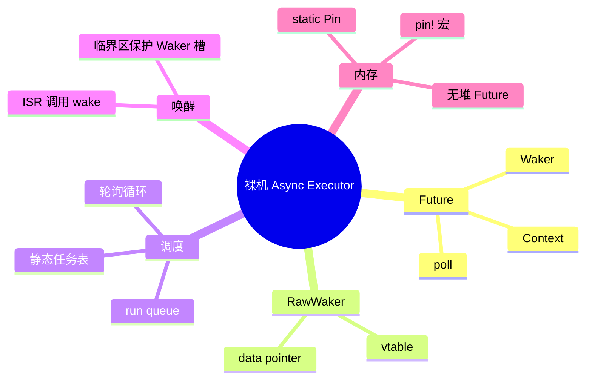
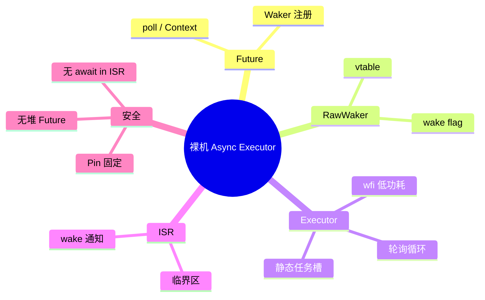

> **内容分级**: [专家级]
> **代码状态**: ⚠️ 裸机/目标平台相关代码标注 `rust,ignore`/`no_run`，host 平台无法直接编译
> **定理链**: N/A — 描述性/工程性文档
>
# 自定义裸机异步执行器
>
> **EN**: Custom Bare-Metal Async Executor
> **Summary**: Building a `#![no_std]` single-threaded async executor from scratch: `Future`, `RawWaker`, `Waker`, static task arena, interrupt-to-waker integration, and no-heap `Pin` patterns.
> **Rust 版本**: 1.97.0+ (Edition 2024)
>
> **受众**: [专家]
> **Bloom 层级**: L5
> **权威来源**: 本文件为 `concept/` 权威页。
> **A/S/P 标记**: **P+S** — Procedure + Structure
> **双维定位**: P×Cre — 在资源受限硬件上实现可预测、可审计的协作式调度
> **前置概念**: [Async/Await](../../03_advanced/01_async/01_async.md) · [Pin 与 Unpin](../../03_advanced/01_async/08_pin_unpin.md) · [裸机与嵌入式中的 Async](11_async_no_std_embedded.md) · [no_std 同步原语](15_no_std_synchronization_primitives.md)
> **后置概念**: [裸机中的 Async](11_async_no_std_embedded.md) · [嵌入式 RTOS 与安全关键框架对比](26_embedded_rtos_and_safety_critical_frameworks.md)

---

> **来源**: [Rust Reference — async/await](https://doc.rust-lang.org/reference/expressions.html#await-expressions) · [Embassy Executor on docs.rs](https://docs.rs/embassy-executor/) · [RTIC Book — async tasks](https://rtic.rs/2/book/en/) · [Rust Embedded Book — Concurrency](https://docs.rust-embedded.org/book/concurrency/) · [Future trait RFC](https://rust-lang.github.io/rfcs/2418-futures.html) · [Marabos — Rust Atomics and Locks](https://marabos.nl/atomics/)
>
> **横向对比**: [Rust vs Ada/SPARK](../../05_comparative/01_systems_languages/07_rust_vs_ada_spark.md)

---

## 🧠 知识结构图



## 📑 目录

- [自定义裸机异步执行器](#自定义裸机异步执行器)
  - [🧠 知识结构图](#-知识结构图)
  - [📑 目录](#-目录)
  - [一、权威定义](#一权威定义)
  - [二、从 `Future` 到 `Waker` 的最小模型](#二从-future-到-waker-的最小模型)
  - [三、手写 `RawWaker` 与 `Waker`](#三手写-rawwaker-与-waker)
  - [四、静态任务表与执行器](#四静态任务表与执行器)
  - [五、中断驱动的 `Waker`](#五中断驱动的-waker)
  - [六、完整可运行骨架](#六完整可运行骨架)
  - [七、与 Embassy / RTIC 的对比](#七与-embassy--rtic-的对比)
  - [八、反例与失效模式](#八反例与失效模式)
  - [九、边界测试](#九边界测试)
    - [9.1 边界测试：在 ISR 中直接 await](#91-边界测试在-isr-中直接-await)
    - [9.2 边界测试：未 `Pin` 的 Future 自引用](#92-边界测试未-pin-的-future-自引用)
    - [9.3 边界测试：ISR 中未保护地覆盖 Waker](#93-边界测试isr-中未保护地覆盖-waker)
  - [十、相关概念](#十相关概念)
  - [🧭 思维导图（Mindmap）](#-思维导图mindmap)

---

## 一、权威定义

> **Rust Reference**: A `Future` represents an asynchronous computation. The `poll` method drives the future to completion; it receives a `Context` containing a `Waker`, which the future can use to signal that it should be polled again.

**裸机 async executor**：在没有操作系统线程、没有标准库调度器、通常也没有堆分配器的环境中，用一个单线程循环轮询 `Future`，并通过硬件中断触发重新调度的最小运行时。其核心是 `Future::poll`、`Context`、`Waker` 三者之间的契约。

**`Waker`**：一个可克隆的、线程不安全的（裸机中通常是单核）句柄，用于通知 executor 某个 Future 已准备好再次被 poll。在裸机中，Waker 通常由 ISR 保存并在中断触发时调用。

判定依据：一个正确的裸机 executor 必须保证 (1) Future 被固定后不会被移动；(2) Waker 在 ISR 与 task 之间安全传递；(3) 同一个 Future 不会同时被 ISR 和 executor 并发 poll。

---

## 二、从 `Future` 到 `Waker` 的最小模型

裸机 executor 的核心状态机：

1. 创建 Future 并固定（`Pin<&mut F>`）；
2. 调用 `future.poll(cx)`；
3. 若返回 `Poll::Pending`，executor 进入低功耗等待（`wfi`）；
4. 外设中断触发，ISR 调用 `waker.wake()`；
5. executor 醒来，重新 poll 对应 Future。

```rust,ignore
#![no_std]
use core::future::Future;
use core::pin::Pin;
use core::task::{Context, Poll, Waker};

/// 最简 executor：只跑一个 Future 直到完成
pub fn block_on<F: Future>(mut future: F) -> F::Output {
    let mut future = unsafe { Pin::new_unchecked(&mut future) };
    let waker = /* 构造一个永不清醒的 waker */ todo!();
    let mut cx = Context::from_waker(&waker);

    loop {
        match future.as_mut().poll(&mut cx) {
            Poll::Ready(v) => return v,
            Poll::Pending => core::hint::spin_loop(), // 真实硬件用 wfi
        }
    }
}
```

> **要点**：上面的代码缺少有效的 Waker，因此只适用于主动轮询（busy-loop）。真实硬件需要 ISR 触发 wake。

---

## 三、手写 `RawWaker` 与 `Waker`

`Waker` 由 `RawWaker` 构造，后者包含一个数据指针和一个 vtable。vtable 必须实现 `clone`、`wake`、`wake_by_ref`、`drop`。在单核裸机中，vtable 函数通常只需设置一个 pending 标志。

```rust,ignore
#![no_std]
use core::sync::atomic::{AtomicBool, Ordering};
use core::task::{RawWaker, RawWakerVTable, Waker};

static WAKE_FLAG: AtomicBool = AtomicBool::new(false);

unsafe fn clone(_: *const ()) -> RawWaker {
    RawWaker::new(core::ptr::null(), &VTABLE)
}

unsafe fn wake(_: *const ()) {
    WAKE_FLAG.store(true, Ordering::Release);
}

unsafe fn wake_by_ref(_: *const ()) {
    WAKE_FLAG.store(true, Ordering::Release);
}

unsafe fn drop(_: *const ()) {}

static VTABLE: RawWakerVTable = RawWakerVTable::new(clone, wake, wake_by_ref, drop);

fn make_waker() -> Waker {
    unsafe { Waker::from_raw(RawWaker::new(core::ptr::null(), &VTABLE)) }
}
```

判定依据：单核裸机中的 Waker 可以极其简单，因为不存在跨核调度；多核场景下需要保证 wake 的原子性和内存序。

---

## 四、静态任务表与执行器

为避免堆分配，任务以静态数组形式存储。每个任务槽保存一个 `dyn Future` 的 trait object 或具体类型。下面展示使用具体类型的简化版本。

```rust,ignore
#![no_std]
use core::cell::Cell;
use core::future::Future;
use core::pin::Pin;
use core::task::{Context, Poll, Waker};

/// 固定容量的任务槽
type TaskFuture = Pin<&'static mut dyn Future<Output = ()>>;

pub struct Executor<'a> {
    tasks: &'a [Cell<Option<TaskFuture>>],
}

impl<'a> Executor<'a> {
    pub fn new(tasks: &'a [Cell<Option<TaskFuture>>]) -> Self {
        Self { tasks }
    }

    pub fn run(&self) -> ! {
        let waker = make_waker();
        let mut cx = Context::from_waker(&waker);

        loop {
            let mut active = false;
            for slot in self.tasks {
                if let Some(mut future) = slot.take() {
                    match future.as_mut().poll(&mut cx) {
                        Poll::Pending => {
                            slot.set(Some(future));
                            active = true;
                        }
                        Poll::Ready(()) => {}
                    }
                }
            }

            if !active && !WAKE_FLAG.swap(false, Ordering::Acquire) {
                cortex_m::asm::wfi();
            }
        }
    }
}
```

> **要点**：`Cell` 保证单核内无数据竞争；多核场景需替换为 `critical-section::Mutex` 或原子队列。`dyn Future` trait object 会带来 vtable 开销，资源极度受限时可使用固定类型数组或生成器。

---

## 五、中断驱动的 `Waker`

外设 ISR 需要把 Waker 存入一个全局槽，中断触发时调用 `wake`。Waker 槽必须在临界区内读写，防止 ISR 与 task 并发修改。

```rust,ignore
#![no_std]
use core::cell::RefCell;
use core::task::Waker;
use critical_section::{Mutex, with};

static WAKER_SLOT: Mutex<RefCell<Option<Waker>>> =
    Mutex::new(RefCell::new(None));

/// Future 注册 Waker
fn register_waker(waker: &Waker) {
    with(|cs| {
        *WAKER_SLOT.borrow(cs).borrow_mut() = Some(waker.clone());
    });
}

/// 定时器 ISR 触发 wake
#[no_mangle]
unsafe fn TIM2_IRQHandler() {
    with(|cs| {
        if let Some(w) = WAKER_SLOT.borrow(cs).borrow_mut().take() {
            w.wake();
        }
    });
}
```

判定依据：ISR 只应调用 `wake`，不应直接 poll Future 或执行复杂异步逻辑。Waker 槽的写入必须在临界区内完成，否则中断嵌套会导致竞争。

---

## 六、完整可运行骨架

```rust,ignore
#![no_std]
#![no_main]

use core::cell::Cell;
use core::future::Future;
use core::pin::Pin;
use core::sync::atomic::{AtomicBool, Ordering};
use core::task::{Context, Poll, RawWaker, RawWakerVTable, Waker};
use cortex_m_rt::entry;

static WAKE_FLAG: AtomicBool = AtomicBool::new(false);

unsafe fn clone(_: *const ()) -> RawWaker {
    RawWaker::new(core::ptr::null(), &VTABLE)
}
unsafe fn wake(_: *const ()) { WAKE_FLAG.store(true, Ordering::Release); }
unsafe fn wake_by_ref(_: *const ()) { WAKE_FLAG.store(true, Ordering::Release); }
unsafe fn drop(_: *const ()) {}
static VTABLE: RawWakerVTable = RawWakerVTable::new(clone, wake, wake_by_ref, drop);

fn make_waker() -> Waker {
    unsafe { Waker::from_raw(RawWaker::new(core::ptr::null(), &VTABLE)) }
}

/// 模拟硬件定时器的 Future
struct TimerFuture {
    expires_at: u32,
}

impl Future for TimerFuture {
    type Output = ();

    fn poll(self: Pin<&mut Self>, cx: &mut Context<'_>) -> Poll<()> {
        let now = unsafe { core::ptr::read_volatile(0x4000_0000 as *const u32) };
        if now >= self.expires_at {
            Poll::Ready(())
        } else {
            // 注册 waker 到定时器 ISR
            register_waker(cx.waker());
            Poll::Pending
        }
    }
}

static TASK1: Cell<Option<Pin<&'static mut dyn Future<Output = ()>>>> =
    Cell::new(None);

#[entry]
fn main() -> ! {
    static mut FUT1: TimerFuture = TimerFuture { expires_at: 1000 };
    let fut1: Pin<&'static mut TimerFuture> = unsafe { Pin::new_unchecked(&mut *FUT1) };
    TASK1.set(Some(fut1));

    let tasks: &[Cell<Option<Pin<&'static mut dyn Future<Output = ()>>>>] = &[TASK1];
    let executor = Executor::new(tasks);
    executor.run()
}

#[panic_handler]
fn panic(_: &core::panic::PanicInfo) -> ! { loop {} }
```

判定依据：该骨架展示了裸机 executor 的全部核心要素：Waker、静态 Future、ISR 触发、无堆 Pin。生产代码应替换为 Embassy 或 RTIC，以获得经过社区验证的内存安全保证。

---

## 七、与 Embassy / RTIC 的对比

| 维度 | 自定义 Executor | Embassy | RTIC |
|:---|:---|:---|:---|
| 调度模型 | 协作式轮询 | 协作式 + time driver | 基于硬件优先级的抢占 |
| Waker 实现 | 手动 | 内建，支持多核 | 由中断优先级隐式驱动 |
| 内存 | 完全可控 | 静态任务 arena | 静态资源 |
| 外设驱动 | 无 | 丰富 | 需自行或复用 |
| 适用场景 | 教学/极端约束 | 通用嵌入式 async | 硬实时、中断密集型 |

> **Embassy** 的 executor 本质上是一个高度优化的单线程轮询器，加上统一的 time driver 和 interrupt-to-waker 映射；**RTIC** 则把任务优先级直接映射到 NVIC 优先级，ISR 本身承担调度角色。

---

## 八、反例与失效模式

| 失效模式 | 根因 | 修复方向 |
|:---|:---|:---|
| ISR 中直接 `await` | ISR 不是 Future 上下文 | ISR 只做 `wake` |
| Future 未 Pin 就 poll | 自引用结构被移动 | 使用 `pin!` 或 `StaticCell` |
| Waker 槽未加临界区 | ISR 与 task 并发读写 | 使用 `critical_section::Mutex` |
| 丢失 wake 事件 | ISR 在 executor 检查 flag 与进入 sleep 之间触发 | 先禁中断再检查 flag，或原子 RMW |
| 多任务共享同一 Waker 槽 | 一个 ISR 唤醒多个 Future | 每个 Future/外设使用独立槽 |
| `dyn Future` vtable 过大 | 代码体积敏感 | 使用具体类型或状态机手写 |

---

## 九、边界测试

### 9.1 边界测试：在 ISR 中直接 await

```rust,ignore,compile_fail
#![no_std]

#[cortex_m_rt::interrupt]
fn TIM2() {
    // 错误：中断函数不是 async fn，不能 await
    some_async_fn().await;
}
```

**修正**：ISR 设置标志并调用 `waker.wake()`，真正的 await 在 task 中。

### 9.2 边界测试：未 `Pin` 的 Future 自引用

```rust,ignore
#![no_std]

async fn self_referential() {
    let mut buf = [0u8; 16];
    let _ref = &mut buf; // 隐式自引用
    // 若 Future 被移动，_ref 失效
}
```

**修正**：executor 必须以 `Pin<&mut F>` 形式存储和 poll Future。

### 9.3 边界测试：ISR 中未保护地覆盖 Waker

```rust,ignore
static mut WAKER: Option<Waker> = None;

#[no_mangle]
unsafe fn TIM2_IRQHandler() {
    // 错误：无临界区保护
    WAKER.take().map(|w| w.wake());
}
```

**修正**：使用 `critical_section::Mutex<RefCell<Option<Waker>>>`。

---

## 十、相关概念

- [裸机与嵌入式中的 Async](11_async_no_std_embedded.md)
- [no_std 同步原语](15_no_std_synchronization_primitives.md)
- [Cortex-M 与 RISC-V 中断异常模型](14_interrupt_and_exception_model.md)
- [嵌入式内存分配器](16_embedded_memory_allocators.md)
- [Pin 与 Unpin](../../03_advanced/01_async/08_pin_unpin.md)
- [Async/Await](../../03_advanced/01_async/01_async.md)

---

> **权威来源**: [Rust Reference — async/await](https://doc.rust-lang.org/reference/expressions.html#await-expressions) · [Embassy Executor on docs.rs](https://docs.rs/embassy-executor/) · [Embassy Book](https://embassy.dev/book/) · [RTIC Book](https://rtic.rs/2/book/en/) · [Rust Embedded Book — Concurrency](https://docs.rust-embedded.org/book/concurrency/) · [Future trait RFC](https://rust-lang.github.io/rfcs/2418-futures.html) · [Marabos — Rust Atomics and Locks](https://marabos.nl/atomics/)

## 十一、实测案例

`crates/c13_embedded/examples/custom_async_executor.rs` 是上述骨架的工程化实现，并已验证可在以下目标编译：

- `thumbv7em-none-eabihf`：ARM Cortex-M4F，idle 时使用 `cortex_m::asm::wfi()`。
- `riscv32imac-unknown-none-elf`：RISC-V 32-bit MCU，idle 时使用 `riscv::asm::wfi()`。

编译命令：

```bash
cargo build -p c13_embedded --target thumbv7em-none-eabihf --example custom_async_executor
cargo build -p c13_embedded --target riscv32imac-unknown-none-elf --example custom_async_executor
```

---

## 🧭 思维导图（Mindmap）


