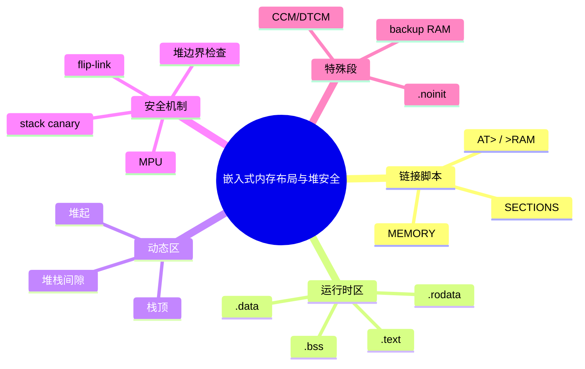
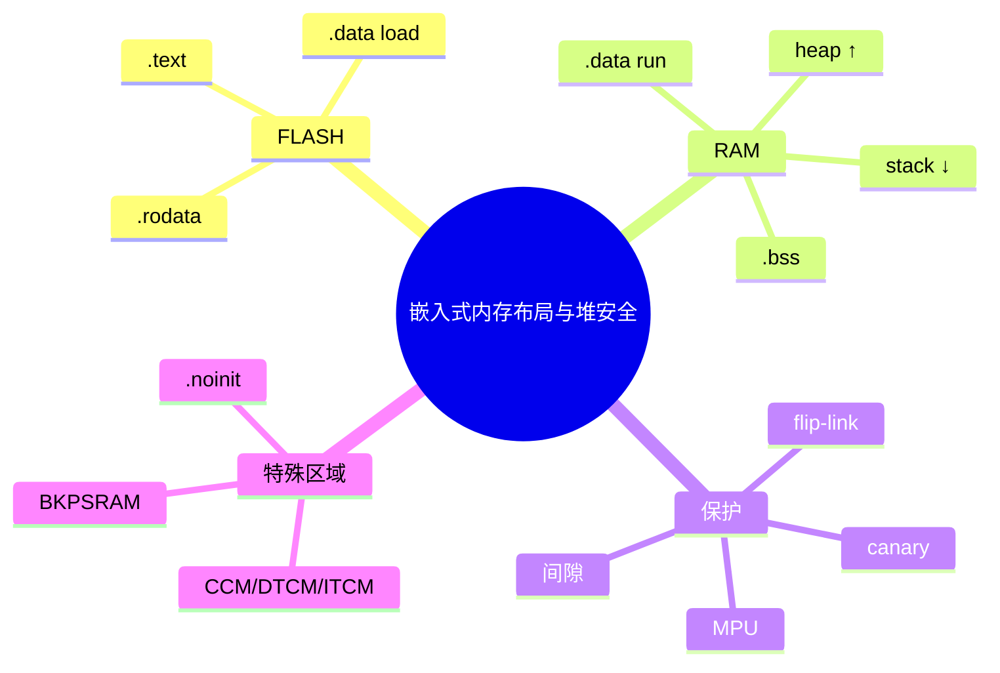

> **内容分级**: [专家级]
> **代码状态**: ⚠️ 裸机/目标平台相关代码标注 `rust,ignore`/`no_run`，host 平台无法直接编译
> **定理链**: N/A — 描述性/工程性文档
>
# 嵌入式内存布局与堆安全
>
> **EN**: Embedded Memory Layout and Heap Safety
> **Summary**: Deep dive into bare-metal memory layout: linker-script sections, stack placement, heap-stack collision, stack overflow detection, `.noinit`, backup RAM, and scatter-file comparisons for ARM.
> **Rust 版本**: 1.97.0+ (Edition 2024)
>
> **受众**: [专家]
> **Bloom 层级**: L4
> **权威来源**: 本文件为 `concept/` 权威页。
> **A/S/P 标记**: **S+P** — Structure + Procedure
> **双维定位**: P×Eva — 在资源受限硬件上设计可验证、可预测的内存布局
> **前置概念**: [裸机启动与链接脚本](13_bare_metal_boot_linker_script.md) · [嵌入式内存分配器](16_embedded_memory_allocators.md) · [no_std 启动流程与运行时](27_no_std_startup_runtime_deep_dive.md)
> **后置概念**: [安全关键裸机操作系统](19_safety_critical_bare_metal_os.md) · [嵌入式调试与日志](20_embedded_debugging_logging.md)

---

> **来源**: [The Embedonomicon](https://docs.rust-embedded.org/embedonomicon/) · [Ferrous Systems — Booting a Cortex-M Microcontroller](https://rust-training.ferrous-systems.com/latest/book/booting-cortex-m) · [cortex-m-rt linker scripts](https://github.com/rust-embedded/cortex-m-rt/tree/master/link.x.in) · [flip-link crate](https://github.com/knurling-rs/flip-link) · [ARM Compiler scatter files](https://developer.arm.com/documentation/100748/latest) · [The Embedded Rust Book — Collections](https://docs.rust-embedded.org/book/collections/) · [docs.rs — embedded-alloc](https://docs.rs/embedded-alloc)
>
> **横向对比**: [Rust vs Ada/SPARK](../../05_comparative/01_systems_languages/07_rust_vs_ada_spark.md)

---

## 🧠 知识结构图



## 📑 目录

- [嵌入式内存布局与堆安全](#嵌入式内存布局与堆安全)
  - [🧠 知识结构图](#-知识结构图)
  - [📑 目录](#-目录)
  - [一、权威定义](#一权威定义)
  - [二、链接器视角的内存布局](#二链接器视角的内存布局)
    - [2.1 `MEMORY` 命令](#21-memory-命令)
    - [2.2 `SECTIONS` 命令与加载/运行地址](#22-sections-命令与加载运行地址)
  - [三、栈与堆的放置策略](#三栈与堆的放置策略)
    - [3.1 栈顶与向下增长](#31-栈顶与向下增长)
    - [3.2 堆起始与向上增长](#32-堆起始与向上增长)
    - [3.3 堆栈间隙与碰撞检测](#33-堆栈间隙与碰撞检测)
  - [四、栈溢出检测机制](#四栈溢出检测机制)
    - [4.1 软件 canary](#41-软件-canary)
    - [4.2 MPU 栈保护](#42-mpu-栈保护)
    - [4.3 `flip-link`](#43-flip-link)
  - [五、特殊段与备份 RAM](#五特殊段与备份-ram)
    - [5.1 `.noinit`](#51-noinit)
    - [5.2 备份 RAM / 保留 RAM](#52-备份-ram--保留-ram)
    - [5.3 CCM / DTCM / ITCM](#53-ccm--dtcm--itcm)
  - [六、ARM scatter file 对比](#六arm-scatter-file-对比)
  - [七、反例与失效模式](#七反例与失效模式)
  - [八、边界测试](#八边界测试)
    - [8.1 边界测试：栈顶指向 RAM 末尾导致越界](#81-边界测试栈顶指向-ram-末尾导致越界)
    - [8.2 边界测试：未预留堆栈间隙](#82-边界测试未预留堆栈间隙)
    - [8.3 边界测试：CCM 上运行代码或 DMA](#83-边界测试ccm-上运行代码或-dma)
  - [九、相关概念](#九相关概念)
  - [🧭 思维导图（Mindmap）](#-思维导图mindmap)
  - [国际化权威来源补充（International Authority Sources）](#国际化权威来源补充international-authority-sources)
  - [国际化权威来源补充（International Authority Sources）](#国际化权威来源补充international-authority-sources-1)

---

## 一、权威定义

> **The Embedonomicon**: The linker script is the bridge between the compiler's output and the target device's memory layout. It tells the linker where each section of the program should be placed.

**嵌入式内存布局**：裸机固件在物理地址空间中的静态与动态区域安排，包括 Flash 中的 `.text`/`.rodata`、RAM 中的 `.data`/`.bss`、运行时栈、可选堆，以及特殊区域（CCM、DTCM、备份 RAM、`.noinit`）。

**堆栈安全**：防止栈向下增长侵入堆/全局数据区，或堆向上增长覆盖栈/全局数据区的机制。在裸机中没有 OS 保护页，因此需要链接器策略、运行时检查或 MPU 硬件保护共同协作。

判定依据：一个正确的内存布局必须同时满足 (1) 链接器能静态验证各段不重叠；(2) 运行时能检测或阻止栈/堆越界；(3) 特殊内存区域（如 DMA 不可访问区）不被误用。

---

## 二、链接器视角的内存布局

### 2.1 `MEMORY` 命令

`MEMORY` 命令声明目标设备拥有的物理内存区域及其属性（`r` 读、`w` 写、`x` 执行）。链接器后续 `SECTIONS` 命令将输出段映射到这些区域。

```ld
MEMORY
{
  FLASH (rx) : ORIGIN = 0x0800_0000, LENGTH = 512K
  RAM   (rwx) : ORIGIN = 0x2000_0000, LENGTH = 128K
  CCM   (rw)  : ORIGIN = 0x1000_0000, LENGTH = 64K
}
```

### 2.2 `SECTIONS` 命令与加载/运行地址

```ld
SECTIONS
{
  .text : { KEEP(*(.vector_table)); *(.text*); } > FLASH
  .rodata : { *(.rodata*); } > FLASH

  __sidata = LOADADDR(.data);
  .data : AT(__sidata)
  {
    __sdata = .;
    *(.data*);
    __edata = .;
  } > RAM

  .bss :
  {
    __sbss = .;
    *(.bss*); *(COMMON);
    __ebss = .;
  } > RAM
}
```

判定依据：`.data` 的加载地址（Flash）与运行地址（RAM）分离，是启动代码复制初始值的依据；`LOADADDR` 必须在段定义前后正确引用。

---

## 三、栈与堆的放置策略

### 3.1 栈顶与向下增长

ARM Cortex-M 使用满递减栈，栈顶（`_stack_top`）通常设在 RAM 最高地址。启动时 MSP 被初始化为 `_stack_top`。

```ld
STACK_TOP = ORIGIN(RAM) + LENGTH(RAM);
```

> **风险**：若 `_stack_top` 恰好等于 RAM 末尾，第一个 push 不会越界；但若中断嵌套过深或递归失控，栈会向下覆盖 `.bss`/`.data`/堆。

### 3.2 堆起始与向上增长

堆从 `.bss` 结束处向上增长。`embedded-alloc` 等 crate 需要链接脚本提供 `_heap_start`/`_heap_end`。

```ld
.bss :
{
  __sbss = .;
  *(.bss*); *(COMMON);
  __ebss = .;
} > RAM

_heap_start = .;
_heap_end = STACK_TOP - 8K; /* 为栈预留 8 KiB */
```

### 3.3 堆栈间隙与碰撞检测

裸机中没有 OS 的 guard page，因此需要主动预留间隙并运行时检查：

```rust,ignore
fn check_heap_stack_collision() {
    let heap_end = unsafe { &raw const _heap_end } as usize;
    let sp: usize;
    unsafe { core::arch::asm!("mov {}, sp", out(reg) sp); }
    if sp < heap_end + 1_024 {
        // 栈与堆间隙小于 1 KiB，触发恢复或 panic
        panic!("stack-heap collision imminent");
    }
}
```

判定依据：间隙大小是工程权衡；过小容易被突发中断栈击破，过大浪费 RAM。通常在链接脚本中预留固定区域（如 4–16 KiB），并结合运行时水位检查。

---

## 四、栈溢出检测机制

### 4.1 软件 canary

在栈底附近填充魔数，主循环中周期检查是否被改写。

```rust,ignore
#[unsafe(link_section = ".noinit")]
static mut STACK_CANARY: u32 = 0;

fn init_stack_canary() {
    unsafe { STACK_CANARY = 0xDEAD_BEEF; }
}

fn check_stack_canary() {
    unsafe {
        if STACK_CANARY != 0xDEAD_BEEF {
            panic!("stack overflow detected");
        }
    }
}
```

### 4.2 MPU 栈保护

ARMv7-M/ARMv8-M 的 MPU 可将栈底以下的一段 RAM 标记为不可访问，首次越界访问触发 MemManage Fault。

```rust,ignore
use cortex_m::peripheral::MPU;

fn setup_stack_guard(stack_bottom: u32) {
    let mpu = unsafe { cortex_m::Peripherals::steal().MPU };
    // 配置 MPU 区域：stack_bottom - 32 字节为 NO_ACCESS
    // 具体寄存器配置与芯片相关，略
}
```

### 4.3 `flip-link`

[knurling-rs/flip-link](https://github.com/knurling-rs/flip-link) 通过重新排序链接脚本，把栈放在 RAM 起始处，堆/全局数据放在 RAM 末尾。这样栈溢出会立即访问无效地址触发 HardFault，而非静默覆盖堆。

```toml
# .cargo/config.toml
[target.thumbv7em-none-eabihf]
rustflags = ["-C", "linker=flip-link"]
```

判定依据：`flip-link` 是零成本（zero-cost）的栈溢出保护方案，强烈推荐用于 Cortex-M 项目；MPU 保护更精确但需要芯片支持且配置复杂；canary 是软件兜底方案。

---

## 五、特殊段与备份 RAM

### 5.1 `.noinit`

`.noinit` 段在 RAM 中保留但不参与 `.bss` 清零，适合跨复位保持数据或存储 bootloader 标记。

```ld
SECTIONS
{
  .noinit (NOLOAD) :
  {
    __snoinit = .;
    *(.noinit*);
    __enoinit = .;
  } > RAM
}
```

```rust,ignore
#[unsafe(link_section = ".noinit")]
static mut PERSISTENT_FLAG: u32 = 0; // 值在复位后可能保持
```

### 5.2 备份 RAM / 保留 RAM

某些 MCU（如 STM32 L4/U5 系列）提供备份域 RAM，在主电源掉电但 VBAT 供电时保持数据。链接脚本需单独声明该区域。

```ld
MEMORY
{
  RAM (rwx) : ORIGIN = 0x2000_0000, LENGTH = 192K
  BKPSRAM (rw) : ORIGIN = 0x4002_4000, LENGTH = 2K
}

.bkpsram (NOLOAD) : { *(.bkpsram*); } > BKPSRAM
```

### 5.3 CCM / DTCM / ITCM

- **CCM（Core-Coupled Memory）**：仅 CPU 可访问，DMA 通常不能访问；适合栈或高速缓存数据，但**不能**放置 DMA 缓冲区。
- **DTCM（Data Tightly-Coupled Memory）**：低延迟数据 RAM。
- **ITCM（Instruction Tightly-Coupled Memory）**：低延迟指令 RAM，适合关键代码。

```ld
SECTIONS
{
  .fast_code : { *(.fast_code*); } > ITCM AT > FLASH
}
```

判定依据：错误地把 DMA 缓冲区放入 CCM 是常见的嵌入式静默错误，因为 CPU 读写正常但 DMA 不访问 CCM。

---

## 六、ARM scatter file 对比

ARM Compiler（armclang/armlink）使用 scatter file，语义与 GNU ld 的 linker script 类似但语法不同：

```armlink
; scatter.scat
LR_IROM1 0x08000000 0x00080000
{
  ER_IROM1 0x08000000 0x00080000
  {
    *.o (RESET, +First)
    *(InRoot$$Sections)
    .ANY (+RO)
  }

  RW_IRAM1 0x20000000 0x00020000
  {
    .ANY (+RW +ZI)
  }
}
```

| 概念 | GNU ld | ARM scatter |
|:---|:---|:---|
| 区域声明 | `MEMORY { ... }` | `LR_xxx / ER_xxx` |
| 加载/运行地址 | `AT>` | 区域嵌套 |
| 段选择 | `*(.text*)` | `.ANY (+RO)` |
| 不初始化段 | `(NOLOAD)` | 使用 ZI 段或 UNINIT |

判定依据：Rust 嵌入式生态主要使用 GNU ld / LLD，但向 ARM Compiler 迁移时 scatter file 的对应关系必须理解清楚，尤其是 ZI（Zero-Initialized）对应 `.bss`。

---

## 七、反例与失效模式

| 失效模式 | 根因 | 后果 |
|:---|:---|:---|
| 栈顶等于 RAM 末尾，无间隙 | 未预留 guard 区域 | 栈溢出静默覆盖堆/全局变量 |
| 堆 `_heap_end` 未对齐 | 分配器要求最小对齐 | 首次分配失败或 UB |
| DMA 缓冲区放入 CCM | CCM 对 DMA 不可见 | 数据不传输，程序行为异常 |
| `.noinit` 段被 `.bss` 清零覆盖 | 链接脚本顺序错误 | 跨复位数据丢失 |
| 备份 RAM 未启用时钟 | 外设时钟未配置 | 访问产生 BusFault |
| 未区分 DTCM/ITCM | 关键代码不在 ITCM | 缓存未命中导致 WCET 恶化 |

---

## 八、边界测试

### 8.1 边界测试：栈顶指向 RAM 末尾导致越界

```ld
/* 危险：栈顶直接指向 RAM 最高地址，下面没有 guard */
STACK_TOP = ORIGIN(RAM) + LENGTH(RAM);
```

**修正**：使用 `flip-link` 或预留 guard region，结合 MPU 保护。

### 8.2 边界测试：未预留堆栈间隙

```ld
/* 危险：堆直接顶到栈底 */
_heap_end = STACK_TOP;
```

**修正**：`_heap_end = STACK_TOP - 4K;` 并在运行时检查水位。

### 8.3 边界测试：CCM 上运行代码或 DMA

```ld
/* 危险：把 .text 或 DMA 缓冲区放入 CCM */
.dma_buf : { *(.dma_buf*); } > CCM
```

**修正**：`.dma_buf` 放入普通 RAM；CCM 仅用于栈/关键数据。

---

## 九、相关概念

- [裸机启动与链接脚本](13_bare_metal_boot_linker_script.md)
- [嵌入式内存分配器](16_embedded_memory_allocators.md)
- [no_std 启动流程与运行时](27_no_std_startup_runtime_deep_dive.md)
- [Memory-Mapped Peripherals 与 Typestate 设计](25_memory_mapped_peripherals_and_typestate.md)
- [Cortex-M 与 RISC-V 中断异常模型](14_interrupt_and_exception_model.md)

---

> **权威来源**: [The Embedonomicon](https://docs.rust-embedded.org/embedonomicon/) · [Ferrous Systems — Booting a Cortex-M Microcontroller](https://rust-training.ferrous-systems.com/latest/book/booting-cortex-m) · [flip-link](https://github.com/knurling-rs/flip-link) · [ARM Compiler scatter files](https://developer.arm.com/documentation/100748/latest)
>
> **P0 官方来源**:
>
> - [Rust Reference — Linkage](https://doc.rust-lang.org/reference/linkage.html)
> - [Rust Reference — `#[link_section]`](https://doc.rust-lang.org/reference/abi.html#the-link_section-attribute)
> - [Rust core — `GlobalAlloc`](https://doc.rust-lang.org/core/alloc/trait.GlobalAlloc.html)

## 🧭 思维导图（Mindmap）



## 国际化权威来源补充（International Authority Sources）

- <https://arxiv.org/abs/2311.05063>

## 国际化权威来源补充（International Authority Sources）

- <https://rust-unofficial.github.io/patterns/>
