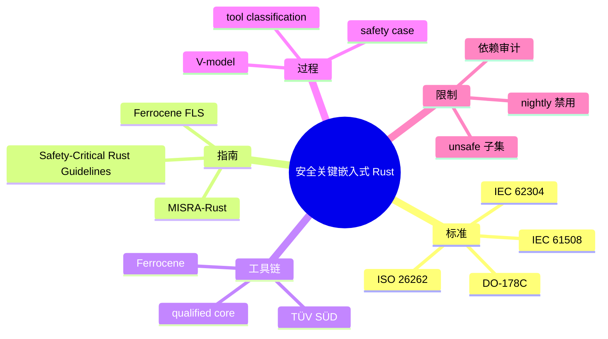
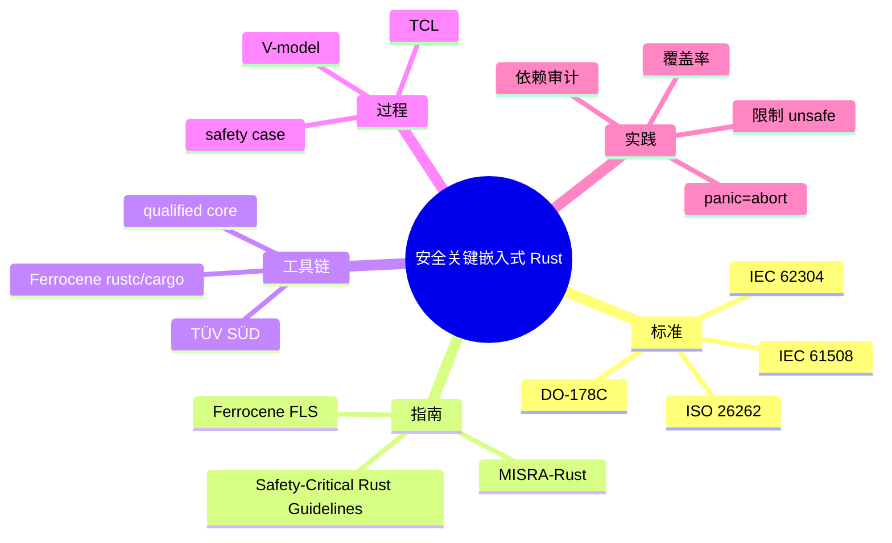

> **内容分级**: [专家级]
> **代码状态**: N/A — 综述/标准映射文档，不含可编译代码块
> **定理链**: N/A — 标准/过程性文档
>
# 安全关键嵌入式 Rust 指南：MISRA-Rust、Ferrocene 与 IEC 61508
>
> **EN**: MISRA-Rust and Safety-Critical Embedded Guidelines
> **Summary**: Mapping MISRA C/C++ guidelines to Rust, Ferrocene Language Specification restrictions, IEC 61508 / ISO 26262 process requirements, and Safety-Critical Rust Consortium activities for bare-metal embedded systems.
> **Rust 版本**: 1.97.0+ (Edition 2024)
>
> **受众**: [专家]
> **Bloom 层级**: L5-L6
> **权威来源**: 本文件为 `concept/` 权威页。
> **A/S/P 标记**: **P+S+A** — Procedure + Structure + Application
> **双维定位**: C×Eva — 比较与评价安全关键标准在 Rust 裸机项目中的落地方法
> **前置概念**: [安全关键裸机操作系统](19_safety_critical_bare_metal_os.md) · [Rust 嵌入式系统开发](03_embedded_systems.md) · [no_std 同步原语](15_no_std_synchronization_primitives.md) · [嵌入式内存布局与堆安全](29_embedded_memory_layout_and_heap_safety.md)
> **后置概念**: [认证工具链与认证包清单](../../04_formal/04_model_checking/10_certified_toolchains_and_packages.md) · [嵌入式 RTOS 与安全关键框架对比](26_embedded_rtos_and_safety_critical_frameworks.md)

---

> **来源**: [MISRARust: Mapping MISRA-C++ Coding Guidelines to the Rust Programming Language](https://arxiv.org/html/2605.23490v1) · [Ferrocene Language Specification](https://spec.ferrocene.dev/) · [Ferrocene core certification news](https://ferrous-systems.com/blog/ferrocene-libcore-news-release/) · [Rust Blog — What does it take to ship Rust in safety-critical?](https://blog.rust-lang.org/2026/01/14/what-does-it-take-to-ship-rust-in-safety-critical/) · [IEC 61508:2010](https://webstore.iec.ch/publication/66912) · [ISO 26262:2018](https://www.iso.org/standard/68383.html) · [Safety-Critical Rust Consortium](https://rustfoundation.org/safety-critical-rust-consortium/) · [Safety-Critical Rust coding guidelines](https://github.com/rustfoundation/safety-critical-rust-coding-guidelines)
>
> **横向对比**: [Rust vs Ada/SPARK](../../05_comparative/01_systems_languages/07_rust_vs_ada_spark.md)

---

## 🧠 知识结构图



## 📑 目录

- [安全关键嵌入式 Rust 指南：MISRA-Rust、Ferrocene 与 IEC 61508](#安全关键嵌入式-rust-指南misra-rustferrocene-与-iec-61508)
  - [🧠 知识结构图](#-知识结构图)
  - [📑 目录](#-目录)
  - [一、权威定义](#一权威定义)
  - [二、MISRA-Rust 指南映射](#二misra-rust-指南映射)
    - [2.1 从 MISRA C/C++ 到 Rust 的六类映射](#21-从-misra-cc-到-rust-的六类映射)
    - [2.2 典型规则对照](#22-典型规则对照)
  - [三、Ferrocene 语言规范与工具链鉴定](#三ferrocene-语言规范与工具链鉴定)
    - [3.1 FLS 的核心作用](#31-fls-的核心作用)
    - [3.2 合格子集示例](#32-合格子集示例)
    - [3.3 core 库资格鉴定](#33-core-库资格鉴定)
  - [四、IEC 61508 / ISO 26262 过程要求](#四iec-61508--iso-26262-过程要求)
    - [4.1 工具置信度与分类](#41-工具置信度与分类)
    - [4.2 V-model 证据链](#42-v-model-证据链)
    - [4.3 软件 SIL/ASIL 等级映射](#43-软件-silasil-等级映射)
  - [五、Safety-Critical Rust Consortium](#五safety-critical-rust-consortium)
  - [六、裸机嵌入式项目的实践清单](#六裸机嵌入式项目的实践清单)
  - [七、反例与失效模式](#七反例与失效模式)
  - [八、边界测试](#八边界测试)
    - [8.1 边界测试：在宣称 Ferrocene 合格项目中使用 nightly](#81-边界测试在宣称-ferrocene-合格项目中使用-nightly)
    - [8.2 边界测试：unsafe 未做安全论证](#82-边界测试unsafe-未做安全论证)
    - [8.3 边界测试：未经验证的 crates.io 依赖进入 SIL 路径](#83-边界测试未经验证的-cratesio-依赖进入-sil-路径)
  - [九、相关概念](#九相关概念)
  - [🧭 思维导图（Mindmap）](#-思维导图mindmap)

---

## 一、权威定义

> **Rust Blog — What does it take to ship Rust in safety-critical?**: Rust is already deployed in production for safety-critical systems, including mobile robotics (IEC 61508 SIL 2) and medical devices (IEC 62304 Class B). The path exists. The question is how to make it easier for the next teams coming through.

**MISRA-Rust**：将 MISRA C/C++ 编码指南映射到 Rust 语言的系统性工作。Rust 的类型系统、所有权、借用检查、模式匹配等机制自动消除了 MISRA C 中大量规则（如未初始化变量、空指针、数组越界）的根因，但仍有部分规则需要显式约束（如 unsafe、panic、依赖管理）。

**Ferrocene Language Specification (FLS)**：Ferrocene 项目维护的 Rust 语言子集规范，用于安全关键工具链鉴定。FLS 明确哪些语言特性属于合格子集，并提供可审计的语义描述。

**工具置信度（Tool Confidence Level, TCL）**：IEC 61508 中用于判定开发工具是否需要鉴定的分类。编译器、静态分析工具、测试工具等根据对最终产品安全的影响被分为 TCL1/TCL2/TCL3，级别越高，需要的证据越充分。

判定依据：安全关键 Rust 项目必须同时满足三重要求：(1) 编码符合语言子集/指南；(2) 工具链经过适当鉴定；(3) 开发过程产生可追溯的证据链。

---

## 二、MISRA-Rust 指南映射

### 2.1 从 MISRA C/C++ 到 Rust 的六类映射

根据 [MISRARust: Mapping MISRA-C++ Coding Guidelines to the Rust Programming Language](https://arxiv.org/html/2605.23490v1)，179 条 MISRA C++ 2023 规则可映射为以下六类：

| 类别 | 含义 | Rust 处理方式 |
|:---|:---|:---|
| **Enforced by compiler** | 编译器自动保证 | 所有权、借用、模式匹配 exhaustiveness、初始化检查 |
| **Rule already followed** | Rust 设计天然避免 | 无隐式类型转换、无整数提升陷阱 |
| **Need lint/clippy** | 需要静态分析工具 | `unwrap`/`expect` 使用、panic 路径、unsafe 块 |
| **Need coding standard** | 需要项目级编码规范 | unsafe 使用理由、FFI 边界文档、错误处理策略 |
| **Not applicable** | 不适用于 Rust | C++ 特有规则（如析构函数、异常规格） |
| **Need language extension** | 需要语言或工具扩展 | 形式化契约、运行时边界检查开关 |

### 2.2 典型规则对照

| MISRA C++ 规则主题 | Rust 等价关注点 | 推荐实践 |
|:---|:---|:---|
| 不允许未定义行为 | `unsafe` 块必须附安全论证 | 每处 `unsafe` 写明 pre/post-condition |
| 不允许不可达代码 | 消除 `panic` 路径 | 使用 `Result` 而非 `unwrap`；审计 `panic=abort` |
| 资源必须显式释放 | RAII / `Drop` | 避免 `mem::forget`；使用 scope guard |
| 循环必须有确定边界 | `for`、`while` 终止性 | 对复杂循环进行形式化或测试论证 |
| 不允许递归 | 栈深度可预测 | 禁用递归；使用显式栈或状态机 |
| 指针使用受控 | 裸指针限制 | 裸指针仅用于 MMIO/FFI；用类型状态封装 |
| 依赖管理 | crates.io 审计 | 高 SIL 路径避免或严格审计第三方依赖 |

判定依据：Rust 的内存安全保证覆盖了 MISRA C/C++ 中约 70% 与内存相关的规则，但剩余的 30%（unsafe、panic、并发、依赖）需要项目级规范和工具链支持。

---

## 三、Ferrocene 语言规范与工具链鉴定

### 3.1 FLS 的核心作用

Ferrocene Language Specification 是 Ferrocene 区别于社区 rustc 的关键交付物。它提供：

1. **可审计的语言子集描述**：哪些语法/语义属于合格范围；
2. **与 rustc 行为的可追溯映射**：证明 Ferrocene 行为与上游一致；
3. **已知问题与限制清单**：供安全案例引用；
4. **变更控制与 LTS 策略**：满足长周期项目维护需求。

### 3.2 合格子集示例

虽然 FLS 随版本演进，但以下特性通常属于需要额外论证或限制使用的类别：

| 特性 | FLS 态度 | 原因 |
|:---|:---|:---|
| `unsafe` | 允许但需论证 | 绕过编译器检查，需人工安全案例 |
| `nightly` 特性 | 通常排除 | 未经稳定化流程，证据不足 |
| 过程宏 | 需审计 | 宏展开可能引入不可见代码 |
| `std` | 目标相关 | 裸机目标通常仅使用 `core` |
| `panic = unwind` | 需目标支持 | 裸机通常强制 `abort` |
| 自定义 `global_allocator` | 需鉴定 | 分配器行为影响内存安全 |

### 3.3 core 库资格鉴定

2025 年 12 月，Ferrous Systems 宣布其 Rust `core` 库子集通过 TÜV SÜD 的 IEC 61508 SIL 2 认证，覆盖 `thumbv7em-none-eabihf` 与 `aarch64-unknown-none` 等目标。这是 Rust 生态首次有 `core` 库子集获得功能安全认证，意味着裸机 `no_std` 项目可以在安全案例中使用经过鉴定的核心库。

判定依据：Ferrocene 解决的是**工具链置信度**，而非应用软件本身的安全完整性。即使使用 Ferrocene，项目仍需证明应用代码满足目标 SIL/ASIL 的要求。

---

## 四、IEC 61508 / ISO 26262 过程要求

### 4.1 工具置信度与分类

IEC 61508-3 要求对开发工具进行分类：

| TCL | 判定标准 | 需要的证据 |
|:---|:---|:---|
| TCL1 | 工具不太可能引入错误 | 基本文档 |
| TCL2 | 工具可能引入错误，但会被后续步骤发现 | 使用经验、错误检测措施 |
| TCL3 | 工具可能引入错误且难以发现 | 工具鉴定、测试、已知问题分析 |

编译器通常属于 TCL3，因为它生成的代码直接进入目标产品且错误难以通过测试完全发现。Ferrocene 的价值在于为 rustc/cargo 提供 TCL3 证据包。

### 4.2 V-model 证据链

安全关键开发要求需求、设计、实现、验证、确认的双向追溯：

```text
系统需求 ←→ 软件需求 ←→ 架构设计 ←→ 详细设计 ←→ 代码 ←→ 单元测试 ←→ 集成测试 ←→ 系统测试
```

Rust 项目需要额外证据：

- **unsafe 代码安全论证**：pre-condition、post-condition、不变式；
- **依赖审计报告**：每个 crate 的用途、版本、许可证、安全评估；
- **静态分析报告**：Clippy、MIRI（如适用）、自定义 lint；
- **覆盖率报告**：MC/DC 覆盖在高 SIL 中通常是必需的；
- **工具链鉴定报告**：Ferrocene 证书或等效证据。

### 4.3 软件 SIL/ASIL 等级映射

| 标准 | 等级 | Rust 适用场景 |
|:---|:---|:---|
| IEC 61508 | SIL 1–SIL 4 | 工业控制、机器人、轨道交通 |
| ISO 26262 | QM–ASIL D | 汽车电子、ADAS、底盘 |
| IEC 62304 | Class A–C | 医疗设备固件 |
| DO-178C | DAL A–E | 航空航天机载软件 |

判定依据：等级越高，对过程证据、工具鉴定、代码可追溯性的要求越严格；Rust 的编译器保证可以减少部分测试负担，但不能替代过程证据。

---

## 五、Safety-Critical Rust Consortium

Rust Foundation 于 2024 年成立 [Safety-Critical Rust Consortium](https://rustfoundation.org/safety-critical-rust-consortium/)，目标是为安全关键领域制定 Rust 编码指南、工具鉴定路径和行业标准对接方案。关键工作项包括：

1. **Safety-Critical Rust Coding Guidelines**：与 MISRA-Rust 互补，提供可操作的 Rust 特定规则；
2. **MC/DC 覆盖支持**：推动 rustc 内置 MC/DC 覆盖率，满足 DO-178C / ISO 26262 要求；
3. **目标平台就绪清单**：把 Rust target tier 政策转化为安全关键项目的实用决策依据；
4. **异步运行时鉴定需求**：定义 safety-case friendly async runtime 的要求；
5. **C/C++ FFI 安全指南**：处理混合语言系统的接口证据。

---

## 六、裸机嵌入式项目的实践清单

针对 `#![no_std]` 裸机安全关键项目，建议执行以下动作：

| 阶段 | 动作 | 证据 |
|:---|:---|:---|
| 立项 | 选定目标 SIL/ASIL 与工具链 | 安全计划 |
| 架构 | 分解高/低完整性组件 | 安全架构文档 |
| 编码 | 使用 Ferrocene 合格子集；限制 unsafe | 编码规范、unsafe 论证 |
| 构建 | 使用 `panic = "abort"`；禁用 nightly | Cargo.toml、CI 配置 |
| 依赖 | 审计或避免 crates.io 依赖 | SBOM、依赖评估报告 |
| 验证 | 单元/集成测试 + 静态分析 + 覆盖率 | 测试报告、Clippy/MIRI 输出 |
| 确认 | 追溯需求到测试 | 追溯矩阵 |
| 维护 | 工具链 LTS、补丁管理 | 变更记录、回归测试 |

---

## 七、反例与失效模式

| 失效模式 | 根因 | 后果 |
|:---|:---|:---|
| 宣称使用 Ferrocene 但使用 nightly 特性 | 超出合格子集 | 鉴定无效 |
| unsafe 块无安全论证 | 无法向审核方证明正确性 | 认证失败 |
| 未经验证的 crates.io 依赖进入 SIL 路径 | 第三方代码无证据 | 安全案例不完整 |
| `panic = unwind` 在裸机中使用 | unwind runtime 未提供 | 链接错误或运行时崩溃 |
| 未固定 Rust 工具链版本 | 依赖漂移 | 回归测试不可复现 |
| 忽略目标平台 tier 限制 | Tier 3 目标无保证 | 长期维护风险 |

---

## 八、边界测试

### 8.1 边界测试：在宣称 Ferrocene 合格项目中使用 nightly

```rust,ignore,compile_fail
#![feature(allocator_api)] // 错误：nightly 特性通常不在 FLS 合格子集

#[global_allocator]
static A: MyAlloc = MyAlloc;
```

**修正**：仅使用 Ferrocene 版本对应的 stable Rust 特性；如需 nightly 特性，必须在安全案例中提供额外证据。

### 8.2 边界测试：unsafe 未做安全论证

```rust,ignore
// 反模式：unsafe 块没有 SAFETY 注释
unsafe { core::ptr::write_volatile(0x4000_0000 as *mut u32, 1) };
```

**修正**：

```rust,ignore
// SAFETY: 0x4000_0000 是该芯片 GPIOA 的 ODR 寄存器，
// 已由 HAL 在初始化阶段验证存在且可写。
unsafe { core::ptr::write_volatile(0x4000_0000 as *mut u32, 1) };
```

### 8.3 边界测试：未经验证的 crates.io 依赖进入 SIL 路径

```toml
# 反模式：高完整性路径引入大量未审计依赖
[dependencies]
rand = "0.8"
serde = "1.0"
```

**修正**：高 SIL 路径使用 `core`/`alloc` 或经过鉴定的内部库；必要时对第三方 crate 进行源码审计、测试覆盖和版本固定。

---

## 九、相关概念

- [安全关键裸机操作系统](19_safety_critical_bare_metal_os.md)
- [嵌入式 RTOS 与安全关键框架对比](26_embedded_rtos_and_safety_critical_frameworks.md)
- [认证工具链与认证包清单](../../04_formal/04_model_checking/10_certified_toolchains_and_packages.md)
- [no_std 启动流程与运行时](27_no_std_startup_runtime_deep_dive.md)
- [嵌入式内存布局与堆安全](29_embedded_memory_layout_and_heap_safety.md)

---

> **权威来源**: [MISRARust paper](https://arxiv.org/html/2605.23490v1) · [Ferrocene Language Specification](https://spec.ferrocene.dev/) · [Ferrocene core certification](https://ferrous-systems.com/blog/ferrocene-libcore-news-release/) · [Rust Blog — safety-critical](https://blog.rust-lang.org/2026/01/14/what-does-it-take-to-ship-rust-in-safety-critical/) · [Safety-Critical Rust Consortium](https://rustfoundation.org/safety-critical-rust-consortium/)

## 🧭 思维导图（Mindmap）


