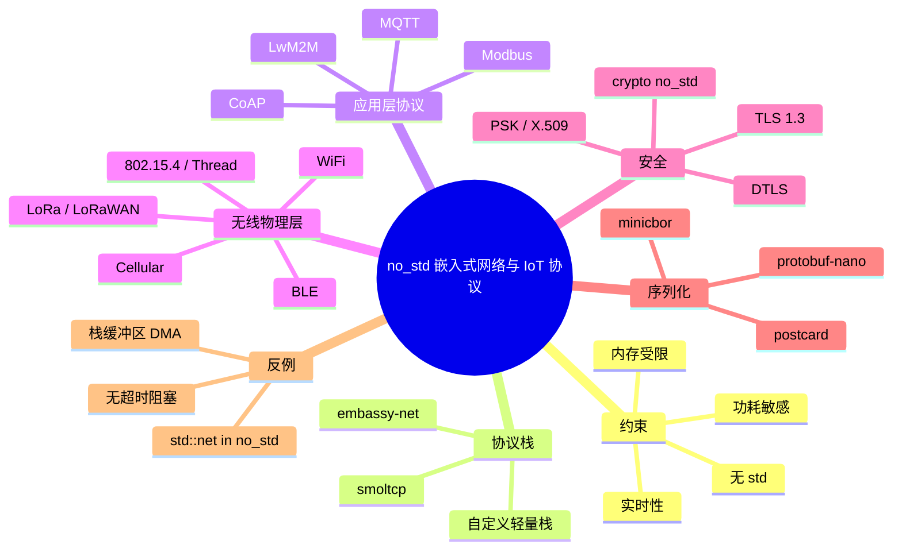
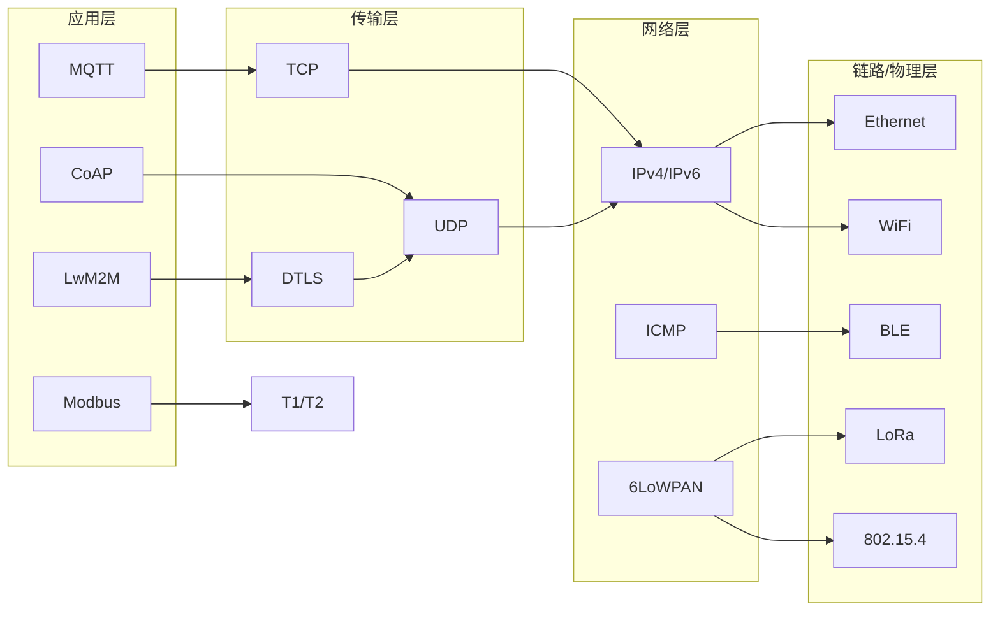
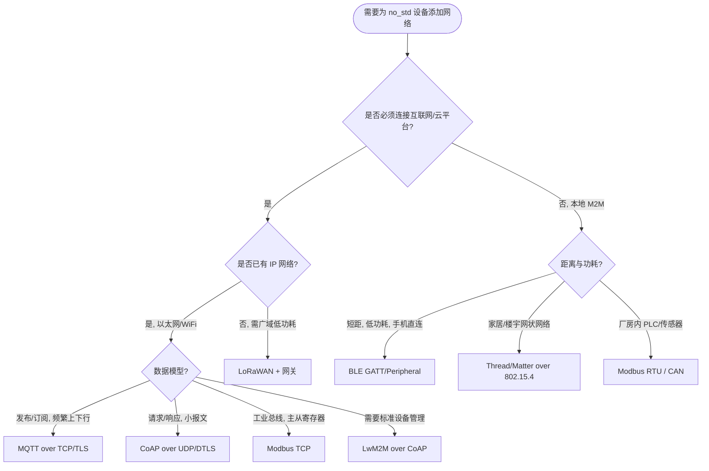

# no_std Rust 中的嵌入式网络与 IoT 协议

> **EN**: Embedded Networking and IoT Protocols in no_std Rust
> **Summary**: A canonical guide to implementing network connectivity and IoT protocols in resource-constrained, no_std Rust environments, covering MQTT, CoAP, LoRaWAN, smoltcp, embassy-net, and security trade-offs.
> **Rust 版本**: 1.97.1+ (Edition 2024)
>
> **受众**: [专家]
> **内容分级**: [专题深度]
> **Bloom 层级**: L4-L6
> **权威来源**: 本文件为 `concept/` 权威页。
> **A/S/P 标记**: **P+A+S** — Procedure + Application + Structure — Application + Structure + Procedure
> **双维定位**: P×Cre — 设计并实现资源受限设备的网络协议栈
> **定位**: 系统讲解在 `no_std`/裸机环境中实现网络连接的约束、协议选型、栈实现与安全实践；与 [`01_advanced_network_protocols.md`](../12_networking/01_advanced_network_protocols.md) 互补，后者聚焦 `std` 生态，本页聚焦 `no_std`/嵌入式生态。
> **前置概念**: [no_std 与裸机惯用法](23_no_std_and_bare_metal_idioms.md) ·
> [嵌入式协议与外设驱动](22_embedded_protocol_drivers.md) ·
> [裸机与嵌入式中的 Async](11_async_no_std_embedded.md) ·
> [高级网络协议概览](../12_networking/01_advanced_network_protocols.md)
> **后置概念**: [嵌入式 RTOS 与安全关键框架对比](26_embedded_rtos_and_safety_critical_frameworks.md) ·
> [网络安全](../12_networking/02_network_security.md) ·
> [自定义协议实现](../12_networking/03_custom_protocol_implementation.md)

---

> **来源**: [smoltcp](https://docs.rs/smoltcp/latest/smoltcp/) ·
> [embassy-net](https://docs.rs/embassy-net/latest/embassy_net/) ·
> [lora-rs](https://github.com/lora-rs/lora-rs) ·
> [rust-mqtt](https://github.com/cecri/rust-mqtt) ·
> [coap-lite](https://docs.rs/coap-lite/latest/coap_lite/) ·
> [Rust Embedded Book](https://docs.rust-embedded.org/book/) ·
> [MQTT 5.0 Specification](https://docs.oasis-open.org/mqtt/mqtt/v5.0/mqtt-v5.0.html) ·
> [RFC 7252 — CoAP](https://datatracker.ietf.org/doc/html/rfc7252) ·
> [LoRaWAN 1.0.4 Specification](https://resources.lora-alliance.org/technical-specifications/lorawan-1-0-4-specification) ·
> [Rust Reference — no_std](https://doc.rust-lang.org/reference/names/preludes.html#the-no_std-attribute) ·
> [Rust API Guidelines](https://rust-lang.github.io/api-guidelines/)

---

## 🧠 知识结构图



---

## 📑 目录

- [no\_std Rust 中的嵌入式网络与 IoT 协议](#no_std-rust-中的嵌入式网络与-iot-协议)
  - [🧠 知识结构图](#-知识结构图)
  - [📑 目录](#-目录)
  - [一、权威定义](#一权威定义)
  - [二、约束矩阵：嵌入式网络与通用网络的区别](#二约束矩阵嵌入式网络与通用网络的区别)
  - [三、协议分层模型](#三协议分层模型)
    - [3.1 物理/链路层](#31-物理链路层)
    - [3.2 网络/传输层](#32-网络传输层)
    - [3.3 应用层协议](#33-应用层协议)
  - [四、MQTT：发布/订阅与 QoS](#四mqtt发布订阅与-qos)
    - [4.1 MQTT 报文结构](#41-mqtt-报文结构)
    - [4.2 QoS 等级与内存代价](#42-qos-等级与内存代价)
    - [4.3 no\_std 客户端选型](#43-no_std-客户端选型)
  - [五、CoAP：REST over UDP](#五coaprest-over-udp)
    - [5.1 CoAP 消息格式](#51-coap-消息格式)
    - [5.2 Observe 与 Block-Wise](#52-observe-与-block-wise)
  - [六、LoRaWAN：远距离低功耗广域网](#六lorawan远距离低功耗广域网)
    - [6.1 Class A / B / C](#61-class-a--b--c)
    - [6.2 加解密与 Duty Cycle](#62-加解密与-duty-cycle)
  - [七、Modbus 与工业现场总线](#七modbus-与工业现场总线)
  - [八、网络栈实现：smoltcp 与 embassy-net](#八网络栈实现smoltcp-与-embassy-net)
    - [8.1 smoltcp 设计哲学](#81-smoltcp-设计哲学)
    - [8.2 embassy-net 与 async 集成](#82-embassy-net-与-async-集成)
  - [九、物理接口驱动选型](#九物理接口驱动选型)
  - [十、安全：DTLS/TLS 与 no\_std 密码学](#十安全dtlstls-与-no_std-密码学)
  - [十一、数据序列化](#十一数据序列化)
  - [十二、可编译示例：no\_std 定长包队列](#十二可编译示例no_std-定长包队列)
  - [十三、反例与边界](#十三反例与边界)
    - [13.1 在 no\_std 中使用 `std::net`](#131-在-no_std-中使用-stdnet)
    - [13.2 网络缓冲区跨越 DMA 边界](#132-网络缓冲区跨越-dma-边界)
    - [13.3 无超时阻塞等待网络事件](#133-无超时阻塞等待网络事件)
  - [十四、技术选型决策树](#十四技术选型决策树)
  - [十五、与国际权威来源对齐](#十五与国际权威来源对齐)
  - [十六、权威来源索引](#十六权威来源索引)
  - [十七、相关概念](#十七相关概念)

---

## 一、权威定义

> **Rust Reference**: A crate can be marked `#![no_std]` to indicate it does not link against the standard library, but only the core crate.

**嵌入式网络（Embedded Networking）**：在资源受限设备（MCU、传感器节点、工业控制器）上实现数据链路层到应用层通信的技术集合。与通用计算网络的核心差异在于：通常无操作系统完整网络栈、内存以 KB 计、功耗预算严格、实时响应要求高。

**IoT 协议**：专为机器对机器（M2M）通信设计的应用层或链路层协议，典型特征包括：小报文头、支持休眠/低功耗、容忍弱网/高延迟、提供轻量级安全模型。

在 `no_std` Rust 中实现这些协议，意味着必须放弃 `std::net`、`std::io`、默认堆分配器，转而依赖 `core::net`（Rust 1.77+）、`smoltcp`、`embassy-net`、自定义状态机，以及严格静态化的缓冲区管理。

---

## 二、约束矩阵：嵌入式网络与通用网络的区别

| 维度 | 通用网络（std） | 嵌入式网络（no_std） | 设计影响 |
|---|---|---|---|
| 网络栈 | 操作系统内核提供 | `smoltcp`、`embassy-net`、芯片硬件 | 需显式管理 ARP、IP、TCP 状态 |
| 内存 | MB/GB 级堆 | KB 级 RAM，常无堆 | 报文必须原地解析，禁止隐式分配 |
| 功耗 | 持续供电 | 电池/能量采集 | 协议需支持休眠与快速唤醒 |
| 实时性 | 软实时 | 硬/软实时 | 超时、重传必须可控 |
| 错误处理 | `std::io::Error` | 自定义 error 枚举 | 错误码需可映射到硬件状态 |
| 调试 | `println!` / `tracing` | `defmt` / `rtt` | 日志体积受限，需结构化 |
| 安全 | `rustls` + `tokio-rustls` | `embedded-tls`、`tinydtls`、PSK | 需权衡代码体积与加密强度 |

> **核心设计原则**：在 `no_std` 网络代码中，**所有权与生命周期就是资源管理**。一个持有接收缓冲区的 Future 若被错误 drop，可能导致 DMA 仍在写入已释放内存，从而触发未定义行为。

---

## 三、协议分层模型



### 3.1 物理/链路层

| 介质 | 典型速率 | 功耗 | 典型 Rust crate / HAL | 适用场景 |
|---|---|---|---|---|
| Ethernet 10/100M | 10–100 Mbit/s | 中高 | `smoltcp` + 芯片 PHY | 工业网关、PLC |
| WiFi | 10–100 Mbit/s | 高 | `esp-wifi`、`cyw43` | 智能家居、摄像头 |
| BLE 5 | 125 kbps–2 Mbps | 低 | `trouble`、nrf-softdevice | 可穿戴、传感器 |
| LoRa | 0.3–50 kbps | 极低 | `lora-rs` | 农业、表计 |
| 802.15.4 / Thread | 250 kbps | 低 | `openthread` Rust binding | 智能家居骨干 |
| Cellular (LTE-M/NB-IoT) | 10–1000 kbps | 中 | 模组 AT 命令驱动 | 广域追踪 |

### 3.2 网络/传输层

- **IPv4/IPv6**：`smoltcp` 提供完整 IPv4/IPv6、ICMP、TCP、UDP 实现，可在无 `std` 下运行。
- **6LoWPAN**：在 802.15.4 / LoRa 等小帧链路上压缩 IPv6 报文头，Thread 与部分 LoRaWAN 应用使用。
- **TCP vs UDP**：嵌入式中 UDP 更常见（CoAP、LoRaWAN、DNS-SD），因为状态小、功耗低；TCP 用于 MQTT、Modbus TCP 等需要可靠流的场景。

### 3.3 应用层协议

| 协议 | 传输层 | 通信模型 | 报文头大小 | 安全 | 典型 Rust crate |
|---|---|---|---|---|---|
| MQTT 3.1.1/5.0 | TCP | 发布/订阅 | 2 byte 起 | TLS/DTLS/PSK | `rust-mqtt`、`minimq` |
| CoAP | UDP | 请求/响应 | 4 byte | DTLS/EDHOC/PSK | `coap-lite` |
| LwM2M | CoAP/UDP | 设备管理 | 依托 CoAP | DTLS/TLS | `wakaama` binding |
| LoRaWAN | LoRa PHY | 星型接入 | 13 byte MAC | AES-128 | `lora-rs` |
| Modbus RTU | UART | 主/从 | 2–4 byte | 无/应用层 | `rmodbus` |
| Modbus TCP | TCP | 主/从 | 7 byte MBAP | TLS | `rmodbus` |

---

## 四、MQTT：发布/订阅与 QoS

MQTT 是 IoT 中最广泛使用的应用层协议，基于 TCP，报文小巧，支持遗嘱消息、保持连接、QoS 等级。

### 4.1 MQTT 报文结构

MQTT 报文由**固定报头**、**可变报头**、**有效载荷**三部分组成。固定报头仅 2 byte 起：

```text
 7 6 5 4 3 2 1 0
+-+-+-+-+-+-+-+-+
| MQTT Type |DUP| QoS |RETAIN|  <- 1 byte
+-+-+-+-+-+-+-+-+
| Remaining Length (1–4 bytes, VLQ)
+-+-+-+-+-+-+-+-+
```

### 4.2 QoS 等级与内存代价

| QoS | 语义 | 客户端状态 | 适用场景 |
|---|---|---|---|
| 0 | 最多一次 | 无状态 |  telemetry、心跳 |
| 1 | 至少一次 | 需记录未确认的 PUBLISH | 关键命令、告警 |
| 2 | 恰好一次 | 四步握手状态机 | 计费、固件升级 |

> **资源权衡**：在 RAM 受限节点上，QoS 1/2 需要维护**报文标识符（Packet ID）**与重传计时器。若设备频繁掉电，必须将未确认报文持久化到外部存储，否则掉电即丢失。

### 4.3 no_std 客户端选型

- **`rust-mqtt`**：面向 `no_std` 的 MQTT 5.0 客户端，支持固定缓冲区。
- **`minimq`**：极小内存占用的 MQTT 客户端，常与 `smoltcp` 配合使用。
- **`rumqttc`**：功能丰富，但依赖 `std`，不适用于纯 `no_std`。

---

## 五、CoAP：REST over UDP

CoAP（Constrained Application Protocol）专为受限节点设计，语义与 HTTP 类似，但基于 UDP，报文头仅 4 byte。

### 5.1 CoAP 消息格式

```text
 0                   1                   2                   3
 0 1 2 3 4 5 6 7 8 9 0 1 2 3 4 5 6 7 8 9 0 1 2 3 4 5 6 7 8 9 0 1
+-+-+-+-+-+-+-+-+-+-+-+-+-+-+-+-+-+-+-+-+-+-+-+-+-+-+-+-+-+-+-+-+
|Ver| T |  TKL  |      Code     |          Message ID           |
+-+-+-+-+-+-+-+-+-+-+-+-+-+-+-+-+-+-+-+-+-+-+-+-+-+-+-+-+-+-+-+-+
|   Token (if TKL > 0) ...
+-+-+-+-+-+-+-+-+-+-+-+-+-+-+-+-+-+-+-+-+-+-+-+-+-+-+-+-+-+-+-+-+
|   Options (0+ bytes) ...
+-+-+-+-+-+-+-+-+-+-+-+-+-+-+-+-+-+-+-+-+-+-+-+-+-+-+-+-+-+-+-+-+
|1 1 1 1 1 1 1 1|    Payload (if any) ...
+-+-+-+-+-+-+-+-+-+-+-+-+-+-+-+-+-+-+-+-+-+-+-+-+-+-+-+-+-+-+-+-+
```

- **Ver**: 版本，固定 01。
- **T**: 消息类型 CON/NON/ACK/RST。
- **Code**: 如 `0.01` GET、`2.05` Content。
- **Options**: URI-Path、Content-Format、Observe 等。

### 5.2 Observe 与 Block-Wise

- **Observe（RFC 7641）**：允许客户端订阅资源变化，服务器主动推送通知，避免轮询。
- **Block-Wise（RFC 7959）**：将大载荷分块传输，适配 MTU 受限链路（如 6LoWPAN 的 127 byte 帧）。

> **设计洞察**：CoAP 的 Option 采用**增量编码**，URI-Path 每段只编码 delta，报文极小。解析时必须按顺序遍历，不能随机访问，这正好适合 Rust 的迭代器与切片借用模型。

---

## 六、LoRaWAN：远距离低功耗广域网

LoRaWAN 是工作在 sub-GHz ISM 频段的低功耗广域网协议，典型链路预算可达 150 dB+，适合电池供电、间歇通信场景。

### 6.1 Class A / B / C

| Class | 下行窗口 | 功耗 | 适用 |
|---|---|---|---|
| A | 每次上行后开启两个短接收窗口 | 最低 | 表计、传感器 |
| B | 额外周期信标窗口 | 中 | 需要更低下行延迟 |
| C | 几乎持续接收 | 高 | 电网开关、报警器 |

### 6.2 加解密与 Duty Cycle

- **AES-128**：Join Request/Accept 使用 AppKey/NwkKey，数据帧使用 NwkSKey/AppSKey。
- **Duty Cycle**：ISM 频段通常限制发射占空比（如 1%），协议栈必须维护每次发送后的静默期，避免法规违规。
- **ADR（Adaptive Data Rate）**：网络服务器根据链路质量调整扩频因子（SF7–SF12），优化功耗与传输距离。

> **边界风险**：LoRaWAN 的**帧计数器（FCnt）**必须严格单调递增且不可回绕。若设备掉电后丢失 FCnt，重新加入网络或从非易失存储恢复是避免重放攻击的唯一方式。

---

## 七、Modbus 与工业现场总线

Modbus 是工业领域事实标准，分 RTU（串口）、TCP（以太网）、ASCII 三种模式。

| 模式 | 帧结构 | 差错检测 | 典型 MCU 实现 |
|---|---|---|---|
| RTU | 地址 + 功能码 + 数据 + CRC16 | CRC16 | UART + DMA 环形缓冲区 |
| TCP | MBAP（7 byte）+ PDU | 依赖 TCP 校验 | `smoltcp` socket |
| ASCII | `:` 起始 + LRC | LRC | 极少使用 |

Rust 中 `rmodbus` crate 提供 `no_std` 兼容的 Modbus 栈，支持 client/server 与自定义传输。

---

## 八、网络栈实现：smoltcp 与 embassy-net

### 8.1 smoltcp 设计哲学

`smoltcp` 是专为 `no_std` 设计的独立 TCP/IP 栈：

- **零分配**：所有 socket、缓冲区、路由表都在编译期或初始化时分配。
- **显式轮询**：通过 `iface.poll(timestamp)` 驱动，无后台线程。
- **可裁剪特性**：通过 Cargo features 选择 IPv4/IPv6/TCP/UDP/ICMP/DHCP/DNS。

```rust,ignore
use smoltcp::iface::{Config, Interface, SocketSet, SocketStorage};
use smoltcp::phy::{Device, DeviceCapabilities};
use smoltcp::time::Instant;

// 伪代码：初始化接口与 socket
let config = Config::new(hardware_addr);
let mut iface = Interface::new(config, &mut device, Instant::ZERO);
let mut sockets = SocketSet::new(&mut sockets_storage[..]);
let tcp_handle = sockets.add(tcp_socket);
```

### 8.2 embassy-net 与 async 集成

`embassy-net` 在 `smoltcp` 之上提供 async API：

- `TcpSocket::accept(...)`、`read(...)`、`write(...)` 都是 `.await` 点。
- 内置 DHCP、DNS、ICMP ping。
- 与 Embassy executor 集成，硬件中断自动唤醒任务。

```rust,ignore
#[embassy_executor::task]
async fn net_task(mut runner: Runner<'static, NetDriver>) {
    runner.run().await;
}

#[embassy_executor::task]
async fn mqtt_task(stack: Stack<'static>) {
    let mut rx_buffer = [0; 4096];
    let mut tx_buffer = [0; 4096];
    let mut socket = TcpSocket::new(stack, &mut rx_buffer, &mut tx_buffer);
    socket.connect((BROKER_IP, 1883)).await.unwrap();
    // ... MQTT framed send/recv
}
```

> **边界风险**：`embassy-net` 要求接收/发送缓冲区以 `'static` 借出。若把栈上数组传入，`await` 后任务被挂起时缓冲区地址必须仍然有效；通常使用 `StaticCell` 或 `pool` 管理。

---

## 九、物理接口驱动选型

| 接口 | 推荐 crate / HAL | 关键注意 |
|---|---|---|
| Ethernet RMII/MII | `stm32-eth`、`rp2040-ethernet`（PIO） | PHY 复位与时钟、MDIO 配置 |
| ESP32 WiFi | `esp-wifi` | 需要足够 IRAM/DRAM，注意 FCC 认证 |
| Raspberry Pi Pico W CYW43 | `cyw43` | 固件二进制需随固件分发 |
| nRF52 BLE | `trouble`、nrf-softdevice | SoftDevice 占用固定 RAM 区域 |
| SX1262/RFM95 LoRa | `lora-rs` + `embedded-hal` SPI | 频段与输出功率需符合当地法规 |
| W5500 | `w5500`、`w5500-dhcp` | 硬件 TCP/IP 栈，MCU 负担小 |

---

## 十、安全：DTLS/TLS 与 no_std 密码学

| 协议 | 层 | 特点 | no_std crate |
|---|---|---|---|
| DTLS 1.2/1.3 | UDP 之上 | 适合 CoAP/LwM2M | `tinydtls` binding、`embedded-tls` |
| TLS 1.3 | TCP 之上 | 1-RTT/0-RTT，前向安全 | `embedded-tls`、`wolfssl` binding |
| EDHOC | 应用层 | 轻量认证密钥交换，专为 constrained RFC 9203 | `lakers` |
| OSCORE | CoAP 对象安全 | 端到端加密，不依赖 DTLS | `liboscore` Rust binding |
| PSK | 应用/传输层 | 最小代码体积，但密钥分发困难 | 自定义 |

> **安全权衡**：在 KB 级 ROM 设备上，完整 X.509 证书链验证可能不可行。常见做法是在制造时烧录预共享密钥（PSK）或设备唯一证书，TLS/DTLS 仅做会话密钥协商与加密。

---

## 十一、数据序列化

| 格式 | 特点 | no_std crate | 适用 |
|---|---|---|---|
| postcard | serde 兼容，紧凑二进制 | `postcard` | 传感器数据、RPC |
| minicbor | CBOR 子集，无 `std` | `minicbor` | CoAP payload、LwM2M |
| protobuf-nano | 极小 protobuf | `protobuf-nano` | 与云端 protobuf 对接 |
| bitcode | 高性能二进制 | `bitcode` | 需要 `alloc` |
| JSON | 可读，但体积大 | `serde-json-core` | 调试、与 Web 对接 |

> **设计原则**：优先选择**无自描述字段**的二进制格式（postcard/minicbor），可显著降低 MCU 编码/解码开销与空中字节数。

---

## 十二、可编译示例：no_std 定长包队列

以下代码仅依赖 `core`，演示如何在 `no_std` 环境中管理网络接收包队列。这是 MQTT/CoAP/Modbus 等协议驱动中常见的模式：外设中断将包入队，主循环或 async task 出队解析。

```rust
#![no_std]

/// 固定容量、固定 MTU 的网络包队列。
/// 适用于 `no_std` 环境：无堆分配，所有内存在编译期确定。
pub struct PacketQueue<const N: usize, const MTU: usize> {
    storage: [[u8; MTU]; N],
    len: [u8; N],
    head: usize,
    tail: usize,
    count: usize,
}

#[derive(Debug, Clone, Copy, PartialEq, Eq)]
pub enum QueueError {
    Full,
    TooLarge,
}

impl<const N: usize, const MTU: usize> PacketQueue<N, MTU> {
    pub const fn new() -> Self {
        Self {
            storage: [[0; MTU]; N],
            len: [0; N],
            head: 0,
            tail: 0,
            count: 0,
        }
    }

    /// 入队一个网络包。拷贝到内部静态数组，避免栈缓冲区被 DMA 误用。
    pub fn enqueue(&mut self, pkt: &[u8]) -> Result<(), QueueError> {
        if self.count >= N {
            return Err(QueueError::Full);
        }
        if pkt.len() > MTU {
            return Err(QueueError::TooLarge);
        }
        let idx = self.tail;
        self.storage[idx][..pkt.len()].copy_from_slice(pkt);
        self.len[idx] = pkt.len() as u8;
        self.tail = (self.tail + 1) % N;
        self.count += 1;
        Ok(())
    }

    /// 出队一个包，返回对内部缓冲区的只读借用。
    pub fn dequeue(&mut self) -> Option<&[u8]> {
        if self.count == 0 {
            return None;
        }
        let idx = self.head;
        let len = self.len[idx] as usize;
        let pkt = &self.storage[idx][..len];
        self.head = (self.head + 1) % N;
        self.count -= 1;
        Some(pkt)
    }

    pub const fn capacity(&self) -> usize { N }
    pub fn len(&self) -> usize { self.count }
    pub fn is_empty(&self) -> bool { self.count == 0 }
    pub fn is_full(&self) -> bool { self.count >= N }
}

#[cfg(test)]
mod tests {
    use super::*;

    #[test]
    fn round_trip() {
        let mut q: PacketQueue<4, 64> = PacketQueue::new();
        assert!(q.is_empty());
        q.enqueue(b"hello").unwrap();
        q.enqueue(b"no_std").unwrap();
        assert_eq!(q.len(), 2);
        assert_eq!(q.dequeue(), Some(&b"hello"[..]));
        assert_eq!(q.dequeue(), Some(&b"no_std"[..]));
        assert!(q.is_empty());
    }

    #[test]
    fn overflow_returns_error() {
        let mut q: PacketQueue<2, 8> = PacketQueue::new();
        q.enqueue(b"a").unwrap();
        q.enqueue(b"b").unwrap();
        assert_eq!(q.enqueue(b"c"), Err(QueueError::Full));
    }
}
```

> **设计洞察**：
>
> 1. `storage` 与 `len` 是值类型数组，不依赖 `alloc`。
> 2. `dequeue` 返回借用而非拷贝，协议解析器可零拷贝读取报文头。
> 3. 队列容量为编译期常量，ROM/RAM 占用可预测。

---

## 十三、反例与边界

### 13.1 在 no_std 中使用 `std::net`

```rust,compile_fail,E0433
#![no_std]

// ❌ 错误：no_std crate 中无法解析 std crate
use std::net::TcpStream;

fn connect() -> TcpStream {
    TcpStream::connect("1.2.3.4:80").unwrap()
}
```

**修正**：使用 `core::net`（Rust 1.77+ 起稳定）表达地址，并配合 `smoltcp` 或 `embassy-net` 建立连接：

```rust
#![no_std]

use core::net::{Ipv4Addr, SocketAddrV4};

const ENDPOINT: SocketAddrV4 = SocketAddrV4::new(Ipv4Addr::new(192, 168, 1, 1), 1883);

// 实际连接需通过 smoltcp/embassy-net 的 TcpSocket 完成
```

### 13.2 网络缓冲区跨越 DMA 边界

```rust,ignore
// ❌ 边界示例：把栈缓冲区交给 DMA 做以太网接收
fn receive_frame(dma: &mut EthDma) {
    let mut buf: [u8; 1514] = [0; 1514];
    // DMA 在函数返回后仍继续写入 buf
    dma.start_rx(&mut buf);
} // buf 被释放，DMA 写入已释放内存
```

**修正**：使用 `'static` 缓冲区或 HAL 提供的 `PacketQueue`/`Pool`：

```rust,ignore
static mut RX_BUF: [u8; 1514] = [0; 1514];

fn receive_frame(dma: &mut EthDma) {
    dma.start_rx(unsafe { &mut RX_BUF });
}
```

### 13.3 无超时阻塞等待网络事件

```rust,ignore
// ❌ 边界示例：永久等待 LoRa 接收完成
loop {
    if radio.rx_done() {
        break;
    }
}
```

**修正**：使用带超时的 async API 或看门狗喂狗机制：

```rust,ignore
// Embassy 风格：接收最多等待 30 秒
let result = with_timeout(Duration::from_secs(30), radio.receive(&mut buf)).await;
```

---

## 十四、技术选型决策树



| 场景 | 推荐协议栈 | 关键 crate |
|---|---|---|
| 工业网关以太网 | MQTT + TLS 1.3 | `smoltcp` + `embedded-tls` |
| 电池传感器上云 | LoRaWAN → MQTT | `lora-rs` + 网关 |
| 智能家居本地控制 | Thread/Matter | `openthread-rs` / Matter SDK binding |
| 可穿戴手机配网 | BLE → WiFi | `trouble` + `cyw43` |
| 工业 PLC 数据采集 | Modbus RTU/TCP | `rmodbus` |
| 安全关键遥测 | CoAP + DTLS/EDHOC | `coap-lite` + `lakers` |

---

## 十五、与国际权威来源对齐

| 主题 | 国际权威来源 | 对齐说明 |
|---|---|---|
| `no_std` 语义 | [The Rust Reference — The `no_std` attribute](https://doc.rust-lang.org/reference/names/preludes.html#the-no_std-attribute) | 本页所有代码以 `#![no_std]` 为前提，`core::net` 自 1.77 稳定可用。 |
| 所有权与借用 | [The Rust Programming Language — Ownership](https://doc.rust-lang.org/book/ch04-00-understanding-ownership.html) | 网络缓冲区生命周期通过所有权/借用静态保证，避免 DMA UAF。 |
| Unsafe 边界 | [The Rustonomicon — Aliasing](https://doc.rust-lang.org/nomicon/aliasing.html) | DMA 共享内存属于 `unsafe` 契约，需文档化别名与对齐约束。 |
| API 设计 | [Rust API Guidelines](https://rust-lang.github.io/api-guidelines/) | 协议驱动优先返回自定义 error 枚举，关联类型暴露 HAL error。 |
| MQTT 规范 | [OASIS MQTT 5.0](https://docs.oasis-open.org/mqtt/mqtt/v5.0/mqtt-v5.0.html) | QoS、报文头、Packet ID 描述与规范一致。 |
| CoAP 规范 | [RFC 7252](https://datatracker.ietf.org/doc/html/rfc7252) | 报文格式、Option 增量编码、CON/NON/ACK/RST 类型与 RFC 一致。 |
| LoRaWAN 规范 | [LoRa Alliance 1.0.4](https://resources.lora-alliance.org/technical-specifications/lorawan-1-0-4-specification) | Class A/B/C、FCnt、ADR、AES-128 加解密与规范一致。 |
| DTLS/TLS | [RFC 6347](https://datatracker.ietf.org/doc/html/rfc6347)、[RFC 8446](https://datatracker.ietf.org/doc/html/rfc8446) | DTLS 1.2/ TLS 1.3 用于 constrained 环境，EDHOC 参见 RFC 9203。 |
| 嵌入式网络栈 | [smoltcp docs.rs](https://docs.rs/smoltcp/latest/smoltcp/) | 零分配、显式 poll、可裁剪特性与 crate 文档一致。 |
| async embedded | [Embassy Book](https://embassy.dev/book/) | `embassy-net` 缓冲区 `'static` 借用、ISR 唤醒机制与 Embassy 设计一致。 |

---

> **L5 向下引用（Reference）**: 嵌入式网络中的资源约束、显式缓冲区生命周期与 `no_std` 内存模型，可结合 [嵌入式形式化内存模型](../../04_formal/14_embedded_semantics/01_embedded_formal_memory_model.md) 与 [Rust vs C：系统编程的两种显式路径](../../05_comparative/01_systems_languages/01_rust_vs_cpp.md) 中的显式资源管理哲学进行对比理解。

---

## 十六、权威来源索引

| 来源 | 链接 | 用途 |
|---|---|---|
| Rust Reference — no_std | <https://doc.rust-lang.org/reference/names/preludes.html#the-no_std-attribute> | P0 官方：`no_std` 语义 |
| Rust Reference — Aliasing | <https://doc.rust-lang.org/reference/behavior-considered-undefined.html> | P0 官方：别名规则与 UB |
| The Rustonomicon — Aliasing | <https://doc.rust-lang.org/nomicon/aliasing.html> | P0 官方：unsafe 别名契约 |
| Rust API Guidelines | <https://rust-lang.github.io/api-guidelines/> | P0 官方：API 设计 |
| MQTT 5.0 Specification | <https://docs.oasis-open.org/mqtt/mqtt/v5.0/mqtt-v5.0.html> | P0 标准：MQTT 协议 |
| RFC 7252 — CoAP | <https://datatracker.ietf.org/doc/html/rfc7252> | P0 标准：CoAP |
| RFC 7641 — CoAP Observe | <https://datatracker.ietf.org/doc/html/rfc7641> | P0 标准：Observe |
| RFC 7959 — CoAP Block-Wise | <https://datatracker.ietf.org/doc/html/rfc7959> | P0 标准：Block-Wise |
| RFC 6347 — DTLS 1.2 | <https://datatracker.ietf.org/doc/html/rfc6347> | P0 标准：DTLS |
| RFC 8446 — TLS 1.3 | <https://datatracker.ietf.org/doc/html/rfc8446> | P0 标准：TLS 1.3 |
| RFC 9203 — EDHOC | <https://datatracker.ietf.org/doc/html/rfc9203> | P0 标准：EDHOC |
| LoRaWAN 1.0.4 | <https://resources.lora-alliance.org/technical-specifications/lorawan-1-0-4-specification> | P0 标准：LoRaWAN |
| smoltcp | <https://docs.rs/smoltcp/latest/smoltcp/> | P2 生态：`no_std` TCP/IP 栈 |
| embassy-net | <https://docs.rs/embassy-net/latest/embassy_net/> | P2 生态：async 网络栈 |
| lora-rs | <https://github.com/lora-rs/lora-rs> | P2 生态：LoRa/LoRaWAN |
| rust-mqtt | <https://github.com/cecri/rust-mqtt> | P2 生态：`no_std` MQTT |
| coap-lite | <https://docs.rs/coap-lite/latest/coap_lite/> | P2 生态：CoAP 解析 |
| rmodbus | <https://docs.rs/rmodbus/latest/rmodbus/> | P2 生态：Modbus |
| lakers | <https://github.com/lakers-rs/lakers> | P2 生态：EDHOC |
| Embassy Book | <https://embassy.dev/book/> | P2 生态：async 嵌入式 |
| Rust Embedded Book | <https://docs.rust-embedded.org/book/> | P2 生态：嵌入式 Rust 入门 |
| Knurling | <https://knurling.ferrous-systems.com/> | P2 生态：`defmt` 调试 |
| A Survey on Protocols and Data Reduction Strategies for IoT | <https://arxiv.org/abs/2404.19492> | P1 学术：IoT 通信协议与数据压缩策略综述 |

---

## 十七、相关概念

- [嵌入式协议与外设驱动](22_embedded_protocol_drivers.md)
- [裸机与嵌入式中的 Async：no_std 异步运行时](11_async_no_std_embedded.md)
- [no_std 与裸机惯用法](23_no_std_and_bare_metal_idioms.md)
- [自定义裸机异步执行器](28_custom_bare_metal_async_executor.md)
- [高级网络协议概览](../12_networking/01_advanced_network_protocols.md)
- [自定义协议实现](../12_networking/03_custom_protocol_implementation.md)
- [网络安全](../12_networking/02_network_security.md)
- [嵌入式 RTOS 与安全关键框架对比](26_embedded_rtos_and_safety_critical_frameworks.md)
